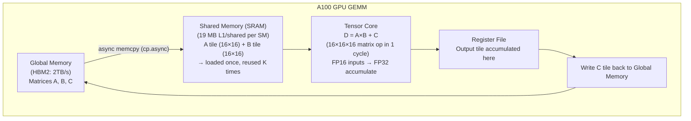
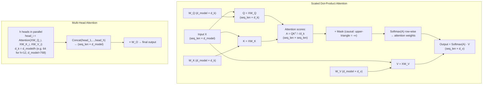
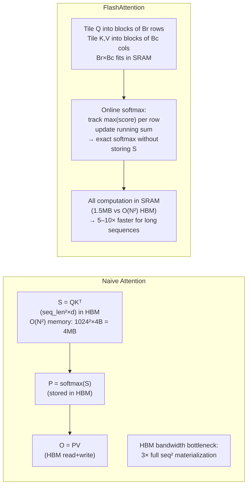
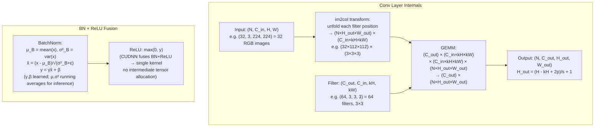
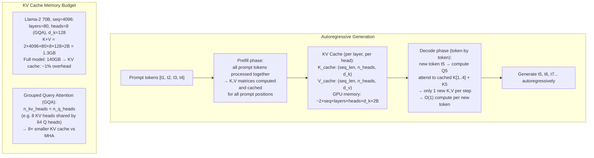
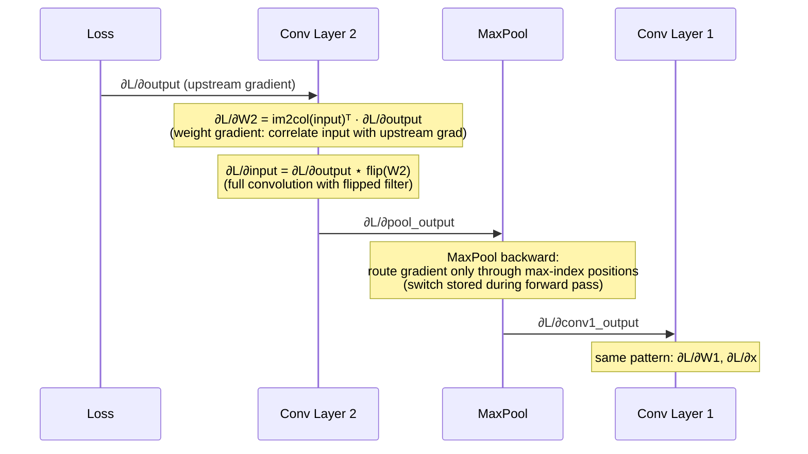
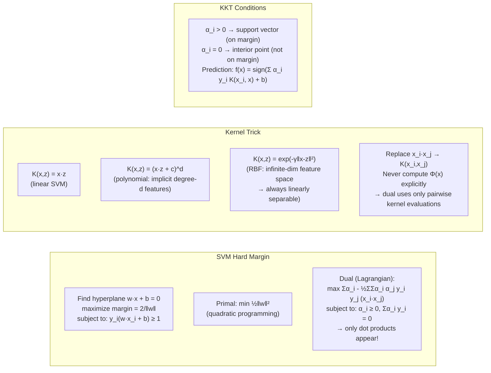
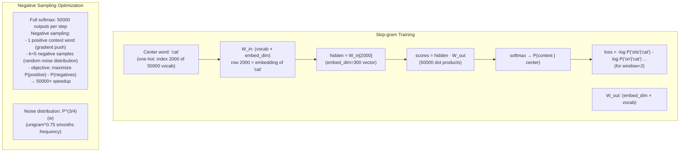
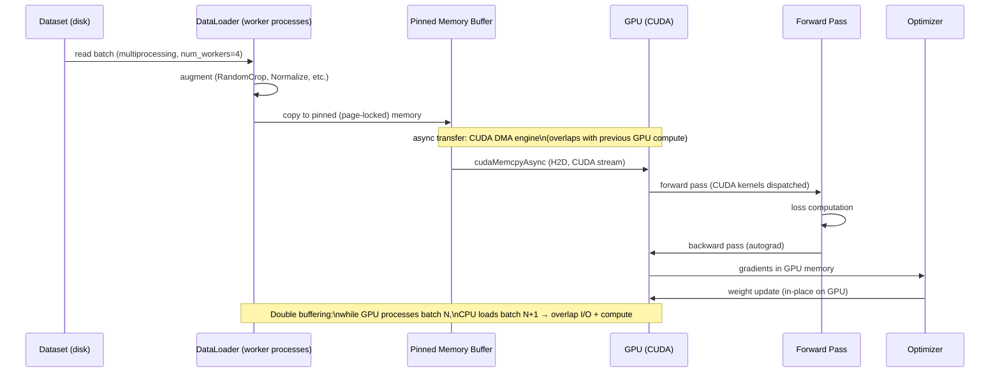

# Machine Learning & AI Internals: Under the Hood

> Source synthesis: ML/AI reference books (comp 8, 195–196, 224–225, 233, 254–255, 263, 280, 371, 434, 444, 449–450, 458, 469) covering neural network backpropagation mechanics, gradient descent optimizers, transformer attention internals, convolutional network computation graphs, and GPU memory management.

---

## Scope, Assumptions, and Evaluation Contract

This document explains representative ML algorithms and kernels. Complexity expressions describe selected operations; they do not establish model quality, end-to-end latency, or compatibility with every framework and accelerator.

- **Scope:** Tie behavior to the model architecture, tensor shapes, framework and kernel versions, accelerator, precision, compiler options, and memory layout.
- **Data assumptions:** Record dataset and split, preprocessing, label definition, sampling, seed, batch order, leakage controls, and distribution shift. An optimization result without these controls is not comparable.
- **Evidence and uncertainty:** Separate mathematical identities from implementation choices and empirical quality. Report repeated runs, confidence or variability, task metrics, calibration where relevant, throughput, latency percentiles, peak memory, and numerical error.
- **Resource claims:** FLOPs, memory complexity, quantization savings, and speedup ranges require batch size, sequence length, head dimensions, cache state, and hardware. An asymptotic improvement may not improve a small or bandwidth-limited workload.
- **Failure and completion:** Define divergence, NaN/Inf, OOM, unacceptable accuracy or bias regression, and latency-budget breach. Completion requires a fixed evaluation protocol, baseline comparison, acceptance thresholds, and a reproducible artifact.

---

## 1. Neural Network Forward Pass — Computation Graph

```mermaid
flowchart LR
    subgraph Layer Math
        X["Input x\n(batch_size × features)"]
        W["Weight matrix W\n(features × hidden)"]
        B["Bias b\n(hidden,)"]
        Z["z = xW + b\n(matrix multiply + broadcast)"]
        A["a = σ(z)\n(element-wise activation)"]
        L["Loss L = CrossEntropy(a, y)"]
    end

    X -->|"GEMM on GPU\ncuBLAS sgemm"| Z
    W --> Z
    B -->|"broadcast"| Z
    Z --> A
    A --> L

    subgraph Memory Layout (row-major)
        W_mem["W: [f0_h0, f0_h1, ..., f0_hn,\n     f1_h0, f1_h1, ...]"]
        Cache["Cache efficiency:\nGEMM tiles fit in L2\nFP16: 2× throughput vs FP32\nTF32: Tensor Core A100 19.5 TFLOPS"]
    end
```

### Tensor Core GEMM Pipeline



---

## 2. Backpropagation — Chain Rule Mechanics

```mermaid
flowchart BT
    subgraph Forward pass
        x --> z1["z1 = W1x+b1"] --> a1["a1 = ReLU(z1)"] --> z2["z2 = W2a1+b2"] --> y_hat["ŷ = softmax(z2)"] --> L["L = -Σ y log ŷ"]
    end

    subgraph Backward pass (chain rule)
        dL -->|"∂L/∂ŷ = ŷ - y\n(softmax+xentropy shortcut)"| dz2["∂L/∂z2"]
        dz2 -->|"∂L/∂W2 = a1ᵀ · ∂L/∂z2"| dW2["grad W2"]
        dz2 -->|"∂L/∂a1 = W2ᵀ · ∂L/∂z2"| da1["∂L/∂a1"]
        da1 -->|"∂L/∂z1 = da1 ⊙ (z1>0)\n(ReLU gate)"| dz1["∂L/∂z1"]
        dz1 -->|"∂L/∂W1 = xᵀ · ∂L/∂z1"| dW1["grad W1"]
    end
```

### Autograd Tape (PyTorch)

```mermaid
flowchart TD
    subgraph PyTorch Autograd
        T1["Tensor x\n(leaf, requires_grad=True)\n.grad_fn = None\n.is_leaf = True"]
        T2["z = x * W\n.grad_fn = MulBackward\n.saved_tensors = (x, W)"]
        T3["a = z.relu()\n.grad_fn = ReluBackward\n.saved_tensors = (z,)"]
        T4["L = a.sum()\n.grad_fn = SumBackward"]

        T1 --> T2 --> T3 --> T4

        subgraph Backward call
            B1["L.backward()\n→ SumBackward.backward(grad=1.0)"]
            B2["ReluBackward.backward(grad=1.0)\n→ grad *= (z > 0)"]
            B3["MulBackward.backward(grad=...)\n→ grad_x = grad * W\n   grad_W = grad * x"]
            B4["x.grad += grad_x\nW.grad += grad_W"]
            B1 --> B2 --> B3 --> B4
        end
    end
```

---

## 3. Gradient Descent Optimizers — Internal State

```mermaid
flowchart LR
    subgraph SGD with Momentum
        m_t["m_t = beta*m_{t-1} + (1-beta)*grad\n(exponential moving avg of grad)"]
        theta_t["theta_t = theta_{t-1} - alpha*m_t\n(beta=0.9, alpha=0.01)"]
        State["State per param:\nm (momentum buffer)"]
    end

    subgraph Adam
        g["g_t = grad L (gradient)"]
        m1["m_t = beta1*m_{t-1} + (1-beta1)*g_t\n(1st moment, beta1=0.9)"]
        v1["v_t = beta2*v_{t-1} + (1-beta2)*g_t^2\n(2nd moment, beta2=0.999)"]
        bc["m_hat_t = m_t/(1-beta1^t)\nv_hat_t = v_t/(1-beta2^t)\n(bias correction for cold start)"]
        up["theta_t = theta_{t-1} - alpha*m_hat_t/(sqrt(v_hat_t) + eps)\n(eps=1e-8, alpha=0.001)"]
        g --> m1
        g --> v1
        m1 --> bc
        v1 --> bc
        bc --> up
        State2["State per param:\nm, v (2× memory vs SGD)"]
    end

    subgraph AdamW (decoupled weight decay)
        WD["theta_t = theta_{t-1} - alpha*m_hat_t/(sqrt(v_hat_t)+eps) - alpha*lambda*theta_{t-1}\n(weight decay applied directly\nNOT through gradient)"]
        Note2["L2 regularization via gradient:\n∇L += λθ (changes Adam moments)\nAdamW: decay separate from Adam update\n→ better generalization"]
    end
```

---

## 4. Transformer — Self-Attention Internals



### FlashAttention — Memory-Efficient Tiling



---

## 5. Convolutional Neural Network — Computation Path



---

## 6. GPU Memory Hierarchy & Tensor Management

```mermaid
flowchart TD
    subgraph A100 Memory Hierarchy
        HBM["HBM2 (80GB)\n2TB/s bandwidth\n~400 cycles latency\nParameters, activations, gradients"]
        L2["L2 Cache (40MB)\n~5TB/s\nShared across all SMs"]
        Shared["Shared Memory / L1\n(192KB per SM, 108 SMs)\n~19TB/s\nTiled GEMM, reduction"]
        Registers["Register File\n(65536 × 32-bit per SM)\nfast local variables"]
    end
    Registers --> Shared --> L2 --> HBM

    subgraph GPU Memory Allocation (PyTorch)
        Allocator["PyTorch caching allocator\n(cudaMalloc reserved pool)"]
        Block["Block sizes: power-of-2 bins\n(512B → 1KB → ... → 1GB)\nreuse without cudaMalloc overhead"]
        Frag["Fragmentation: large allocations\nsplit from pool; small blocks recycled"]
        GC["torch.cuda.empty_cache()\nreturns pool blocks to CUDA\n(doesn't free reserved memory)"]
    end
```

### Mixed Precision Training (FP16 + FP32)

```mermaid
flowchart LR
    subgraph AMP (Automatic Mixed Precision)
        FP32_P["FP32 Master Weights\n(optimizer state)"]
        FP16_P["FP16 Weights\n(half precision copy\nfor forward/backward)"]
        FP16_A["FP16 Activations\n(2× memory saving)"]
        FP32_G["FP32 Gradients\n(accumulate in FP32\nto prevent underflow)"]
        GradScaler["GradScaler\nscale = 2^16 initial\nscale loss before backward\nunscale before optimizer step\n→ prevents FP16 gradient underflow"]
    end
    FP32_P -->|"cast to FP16"| FP16_P
    FP16_P --> FP16_A
    FP16_A -->|"backward → FP16 grad"| FP32_G
    GradScaler --> FP32_G
    FP32_G -->|"optimizer updates"| FP32_P
```

---

## 7. Large Language Model — KV Cache Internals



---

## 8. Convolutional Backprop — Gradient Flow



---

## 9. Decision Tree & Random Forest Internals

```mermaid
flowchart TD
    subgraph CART Algorithm (Classification)
        Root["Root node: all N samples"]
        Split["Find best split:\nfor each feature f, threshold t:\n  Gini = Σ p_k(1-p_k) per child\n  Info Gain = Gini_parent - weighted_avg_children\n→ pick (f*, t*) minimizing Gini"]
        Left["Left child: {x | x_f* < t*}"]
        Right["Right child: {x | x_f* ≥ t*}"]
        Stop["Stop: max_depth reached\nor min_samples_leaf\nor all samples same class"]
        Leaf["Leaf: predict majority class\n(or mean for regression)"]
        Root --> Split --> Left & Right
        Left --> Stop --> Leaf
    end

    subgraph Random Forest Ensemble
        Bootstrap["Bootstrap sampling:\nn_estimators=100 trees\neach trained on random sample\nwith replacement (63.2% unique)"]
        FeatureSample["Feature sampling per split:\nmax_features = √p (classification)\nmax_features = p/3 (regression)\n→ decorrelates trees"]
        Aggregate["Aggregation:\nclassification: majority vote\nregression: mean\n→ variance reduction (Var[mean] = Var[X]/n)"]
        Bootstrap --> FeatureSample --> Aggregate
    end
```

---

## 10. Support Vector Machine — Kernel Trick Internals



---

## 11. Embedding Space — Word2Vec Skip-gram Internals



---

## 12. Model Quantization — INT8 / INT4 Internals

```mermaid
flowchart TD
    subgraph Post-Training Quantization (PTQ)
        FP32_W["FP32 weights\n(e.g. 1.23, -0.45, 2.67)"]
        CalibRange["Calibration:\nrun representative data\nmeasure min/max or percentile\nper-channel or per-tensor"]
        Scale["scale = (max - min) / 255\nzero_point = round(-min / scale)\n(asymmetric INT8)"]
        INT8_W["INT8 weights\nw_q = clamp(round(w/scale + zp), 0, 255)\n(4× memory reduction vs FP32)"]
        DequantGEMM["GEMM in INT8:\naccumulate in INT32\n→ dequantize output back to FP32/BF16"]
    end
    FP32_W --> CalibRange --> Scale --> INT8_W --> DequantGEMM

    subgraph GPTQ (Layer-wise Quantization)
        Hessian["Compute Hessian H = 2XX^T\n(second-order info about weight sensitivity)"]
        OBQ["Optimal Brain Quantization:\nquantize one weight at a time\ncompensate remaining weights:\nδW = -q_err / H_ii × H_{i,:}\n→ minimize quantization error row by row"]
        INT4["INT4 weights (2 bits saved vs INT8)\n16× memory reduction vs FP32\nGPTQ 4-bit LLM: 70B model fits in 2×A100 40GB"]
    end
```

---

## 13. Training Pipeline — Data Flow



---

## 14. Performance Numbers

> These values are illustrative for particular tensor shapes, kernels, precision modes, and accelerators. They are not portable speedups or capacity limits; report the complete benchmark configuration and variability.

```mermaid
block-beta
  columns 2
  block:gpu_compute["GPU Compute (A100 SXM)"]:1
    g1["FP16 Tensor Core: 312 TFLOPS"]
    g2["BF16 Tensor Core: 312 TFLOPS"]
    g3["INT8 Tensor Core: 624 TOPS"]
    g4["FP32 (non-TC): 19.5 TFLOPS"]
  end
  block:model_size["Typical Model Sizes"]:1
    m1["BERT-base: 110M params, 440MB FP32"]
    m2["GPT-2 (1.5B): 6GB FP32, 3GB FP16"]
    m3["Llama-2 70B: 280GB FP32, 140GB FP16, 35GB INT4"]
    m4["ViT-L/16: 307M params, 1.2GB FP32"]
  end
  block:training["Training Throughput"]:1
    t1["A100 (FP16): ~2000 tokens/sec (GPT-2)"]
    t2["FlashAttention 2: 70% of peak A100 MFU"]
    t3["DDP 8-GPU: ~7.5× speedup (communication overhead)"]
    t4["Gradient accumulation: simulate 8× batch with 1 GPU"]
  end
  block:inference["Inference Latency"]:1
    i1["KV cache reuse: O(1) per new token"]
    i2["Prefill bottleneck: compute-bound (GEMM)"]
    i3["Decode bottleneck: memory-bound (KV cache BW)"]
    i4["Speculative decoding: 2–4× speedup (draft model)"]
  end
```



---

## Key Takeaways

- **Autograd tape** builds a DAG of `grad_fn` nodes during forward pass; `.backward()` traverses it in reverse, applying the chain rule at each node using saved tensors
- **Adam maintains 2 moment buffers** per parameter (m, v) — memory cost is 3× weights (weights + m + v), vs SGD which is 1×; AdamW decouples L2 decay to avoid contaminating moment estimates
- **FlashAttention** tiles attention and uses online softmax to avoid materializing the full O(N²) score matrix in HBM. Whether it is beneficial at sequence lengths above 2K depends on kernel version, shapes, precision, accelerator, and competing bottlenecks; benchmark the target workload.
- **KV cache** avoids recomputing prior keys and values, but each new token generally reads and attends over the growing cached sequence, so standard incremental attention compute is not O(1) in sequence length. Cache memory grows linearly in cached tokens; GQA changes the constant by using fewer KV heads.
- **INT8 GEMM** accumulates in INT32 to prevent overflow, then dequantizes — the scale/zero-point are computed per-channel for better accuracy than per-tensor
- **im2col + GEMM** is how convolutions are actually implemented — converts the sliding window operation into a large matrix multiply, enabling Tensor Core acceleration
- **Negative sampling** replaces full-vocabulary softmax work with O(k) sampled logistic terms, but optimizes a different objective rather than becoming mathematically equivalent to softmax in the limit. Training speedup depends on vocabulary, k, sampler, implementation, hardware, and quality target; 10,000× is not a portable claim.
