# Android & Mobile Internals: Binder IPC, ART Runtime & Rendering Pipeline

> Under the Hood: How Android's Binder IPC transports method calls through kernel memory, how ART compiles DEX to native code, how the SurfaceFlinger compositor orchestrates frame production, how Jetpack Compose's recomposition engine tracks state changes — the exact kernel interfaces, JIT pipelines, and rendering data flows.

---

## 1. Android Architecture: Layer Stack

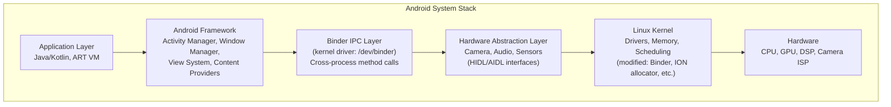

---

## 2. Binder IPC: Kernel-Level Message Passing

Binder is Android's primary IPC mechanism — all cross-process calls (Activity→Service, App→System Services) go through the Binder kernel driver.

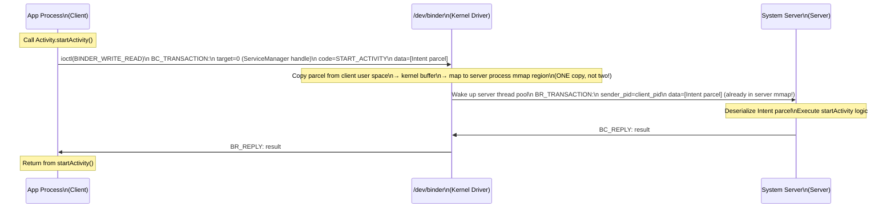

### Binder Memory Mapping (Zero-Copy Design)

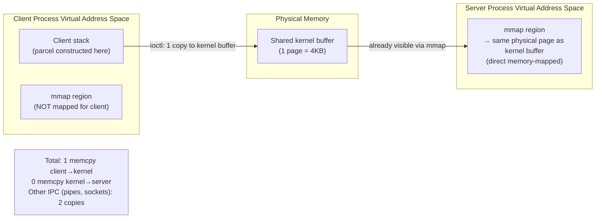

---

## 3. ART: Android Runtime JIT and AOT

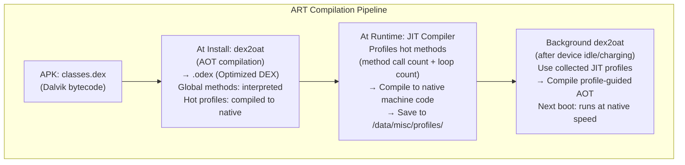

### DEX Bytecode to Native: Method JIT Pipeline

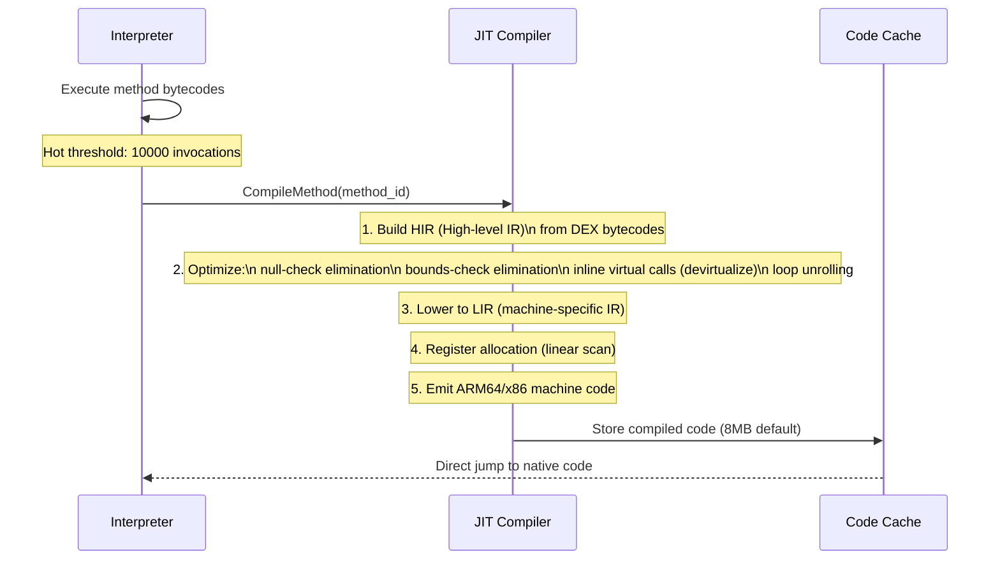

---

## 4. Android View System: Measure/Layout/Draw

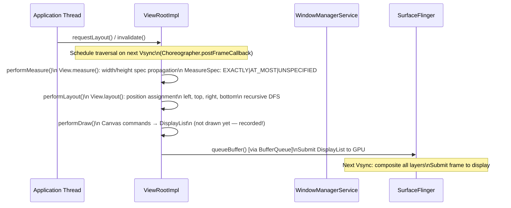

### DisplayList Recording vs Execution

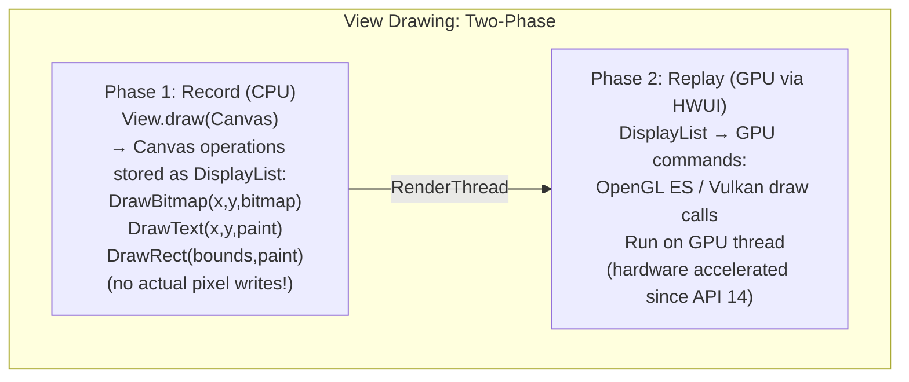

---

## 5. SurfaceFlinger: Display Compositor

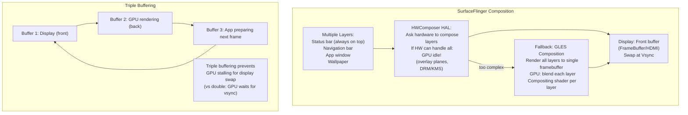

---

## 6. Jetpack Compose: Recomposition Engine

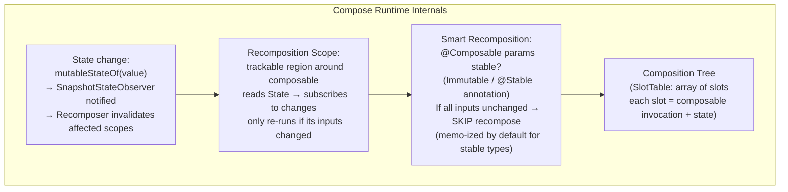

### Compose Slot Table Memory Layout

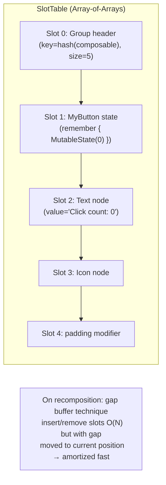

---

## 7. Android Memory Management: zRAM and Low Memory Killer

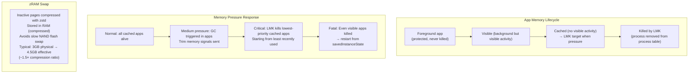

---

## 8. Dalvik/DEX Format Internals

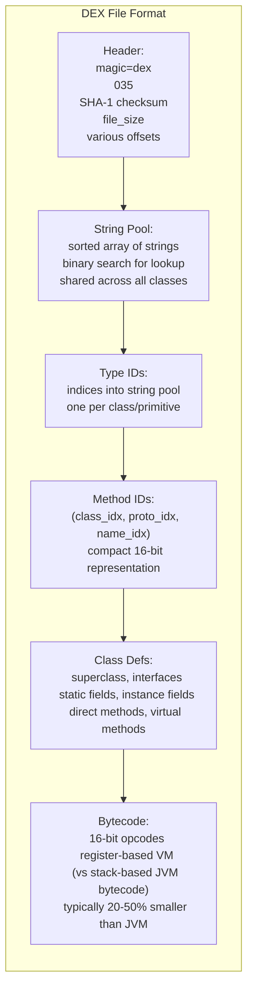

---

## 9. Camera Pipeline: ISP and HAL3

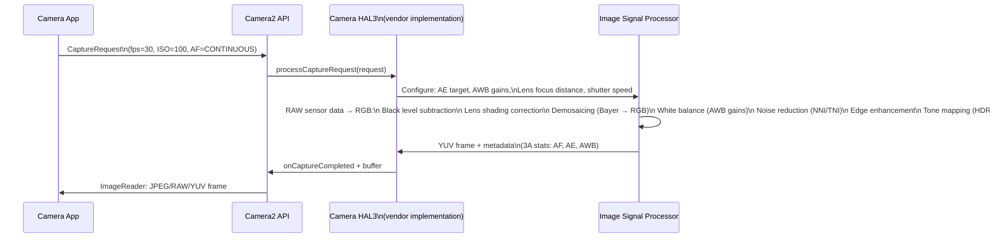

---

## 10. Bluetooth/WiFi Low-Level Stack

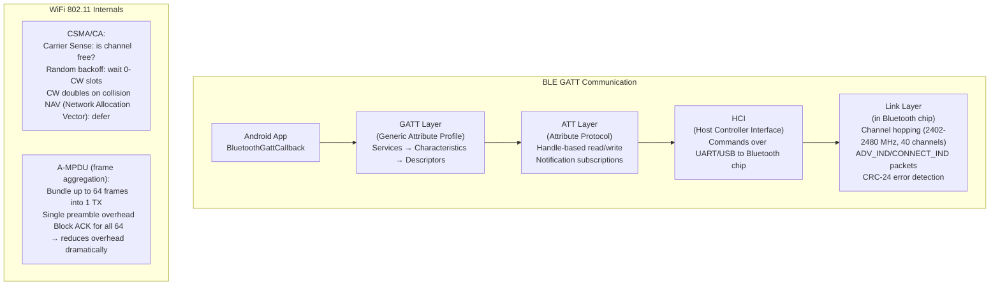

---

## Summary: Android Internals Data Flows

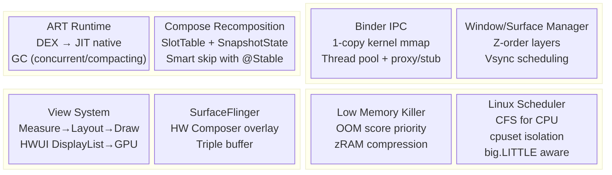
