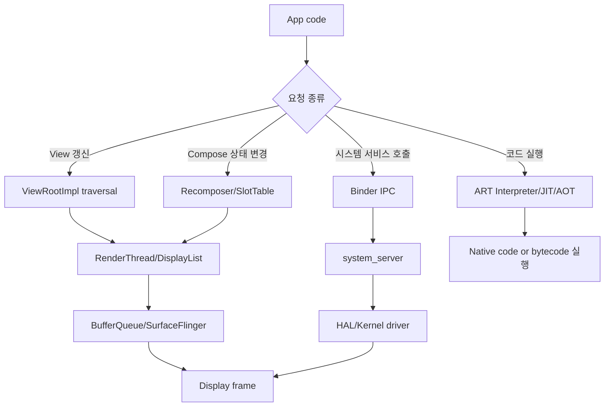
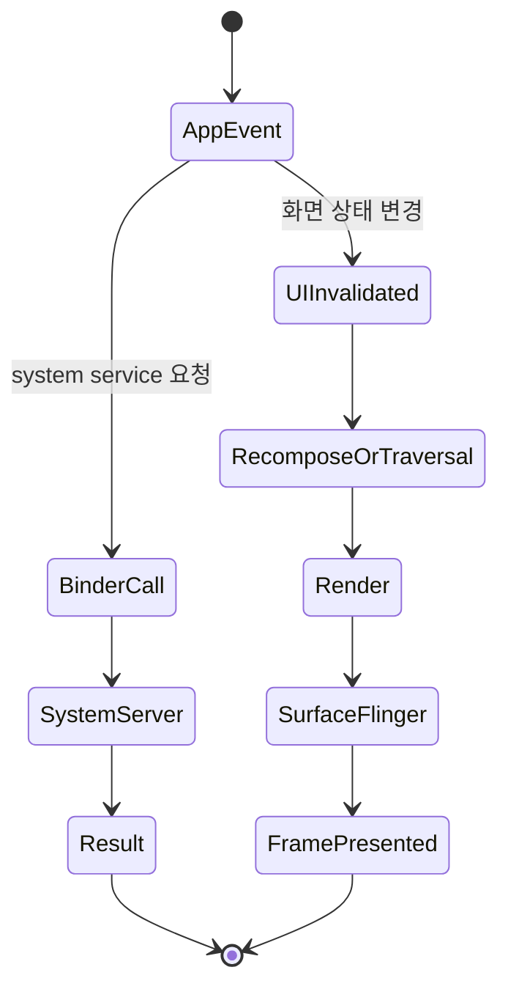
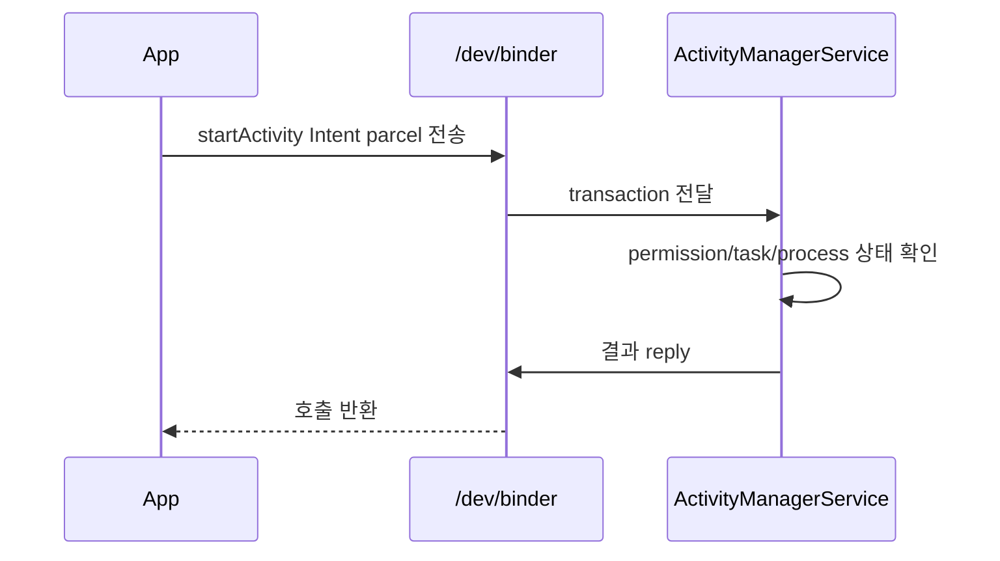

# Android & Mobile Internals 학습 및 기록 노트

## 1. 왜 필요한가? (Pain Point & Motivation)

Android 앱은 Kotlin 코드와 UI 계층만으로 동작하지 않는다. Activity 호출은 Binder IPC를 지나 `system_server`로 전달되고, DEX는 ART에서 interpreter, JIT, profile-guided AOT 경로를 탄다. UI 갱신은 View traversal, Compose recomposition, RenderThread, BufferQueue, SurfaceFlinger, HWComposer를 거쳐 화면에 나타난다.

이 문서는 원문의 Android/mobile internals 내용을 앱 실행, IPC, 런타임, 렌더링, 메모리, 하드웨어 경계의 data flow 중심으로 재작성한다.

## 2. 현재 나의 상태 (Baseline)

- Activity, Fragment, ViewModel, Compose, Room, Coroutine 같은 앱 개발 요소는 알고 있다.
- Binder, ART, SurfaceFlinger, HAL, zRAM, LMK 같은 시스템 내부와 앱 코드의 연결은 약하다.
- UI 성능 문제를 measure/layout/draw, DisplayList, GPU composition, Vsync 관점으로 추적해야 한다.
- Compose recomposition이 어떤 상태 범위만 다시 실행하는지 더 명확히 해야 한다.
- Android 메모리 누수와 process death/복원 경로를 런타임 구조로 설명할 필요가 있다.

## 3. 도달하고 싶은 목표 (Target State)

- 앱 요청이 Framework, Binder, system service, HAL, kernel로 내려가는 흐름을 설명한다.
- Binder가 parcel을 kernel buffer와 mmap 영역으로 전달하는 이유를 이해한다.
- ART의 DEX, interpreter, JIT, profile-guided AOT 흐름을 구분한다.
- View system과 Compose가 화면 갱신을 스케줄링하는 방식을 설명한다.
- Low Memory Killer, zRAM, lifecycle, SavedStateHandle을 메모리 압력 대응으로 연결한다.

## 4. 시스템 번역 (Data Flow)

Android data flow는 앱 프로세스 안에서 끝나지 않는다. 중요한 작업은 Binder를 통해 system service나 vendor HAL로 넘어가고, 화면 출력은 GPU와 display compositor까지 이어진다.

## 5. 핵심 구성요소 (Building Blocks)

| 구성요소 | 역할 | 핵심 상태 |
| --- | --- | --- |
| Binder | 프로세스 간 method call 전달 | transaction, parcel, kernel buffer |
| ART | DEX 실행과 JIT/AOT 최적화 | profile, code cache, compiled method |
| ViewRootImpl | measure/layout/draw traversal | dirty state, DisplayList |
| Choreographer | Vsync 기준 frame callback 예약 | frame time, callback queue |
| SurfaceFlinger | layer composition | buffer queue, layer z-order |
| Jetpack Compose | 선언적 UI와 recomposition | SlotTable, snapshot state |
| zRAM/LMK | 메모리 압력 대응 | compressed page, process priority |
| DEX format | compact bytecode container | string pool, type/method/class defs |
| Camera HAL3 | 앱 요청과 ISP 연결 | capture request/result metadata |
| BLE/WiFi stack | radio protocol 계층 | GATT/ATT/HCI, CSMA/CA |
| WorkManager/Coroutine/Room | 앱 데이터 파이프라인 | job, dispatcher, DB invalidation |

## 6. 상태 전이 (State Transition)

Compose 상태 변경은 영향을 받은 recomposition scope만 무효화하고, View system은 traversal을 다음 Vsync에 맞춰 예약한다. 두 경로 모두 마지막에는 buffer queue와 SurfaceFlinger 합성으로 이어진다.

## 7. 불변식 (Invariant: 절대 깨지면 안 되는 규칙)

- Binder transaction은 caller와 callee의 interface contract가 일치해야 한다.
- UI 업데이트는 main thread와 lifecycle 상태를 고려해야 한다.
- Compose state는 읽은 scope만 invalidation되어야 불필요한 recomposition이 줄어든다.
- View lifecycle owner보다 오래 사는 callback은 view reference를 붙잡으면 안 된다.
- Background 작업은 lifecycle 또는 WorkManager 제약 조건에 맞춰 취소/재시도되어야 한다.
- Camera, Bluetooth, WiFi 요청은 permission, HAL capability, lifecycle release가 모두 맞아야 한다.
- 메모리 압력 상황에서 process death를 고려해 중요한 UI state는 SavedStateHandle이나 영구 저장소로 복원 가능해야 한다.

## 8. 가장 작은 예제 (Minimal Viable Example)

이 예제는 Android API 호출이 단순 함수 호출처럼 보이지만 실제로는 kernel Binder driver와 `system_server`의 상태 검사를 거치는 IPC임을 보여준다.

## 9. 실패 사례 (What could go wrong?)

- Activity context를 singleton에 저장해 configuration change 후 이전 Activity가 GC되지 않는다.
- Main thread에서 network나 bitmap decode를 수행해 ANR이 발생한다.
- Compose에서 불안정한 parameter를 계속 전달해 recomposition skip이 되지 않는다.
- RecyclerView 이미지 로딩에서 lifecycle-aware cancellation과 downsampling을 하지 않아 OOM이 난다.
- Fragment view lifecycle 이후 binding을 해제하지 않아 view leak이 생긴다.
- WorkManager 제약 조건 없이 네트워크 sync를 실행해 오프라인에서 반복 실패한다.
- Camera, Location, Bluetooth resource를 lifecycle에 맞춰 해제하지 않는다.

## 10. 뇌 확장하기 (Evolution & Variants)

- UI 아키텍처는 Activity, Fragment, Compose, Navigation, MVI/MVVM을 lifecycle 기준으로 비교한다.
- 상태 관리는 LiveData, StateFlow, Snapshot State, SavedStateHandle을 복원 범위로 구분한다.
- 백그라운드 작업은 Coroutine, Foreground Service, WorkManager, AlarmManager의 보장 수준으로 선택한다.
- 렌더링은 View DisplayList, Compose rendering, SurfaceFlinger, HWComposer, GPU profiling까지 확장한다.
- 모바일 성능은 memory leak, overdraw, jank, cold start, battery/network cost를 함께 측정한다.

## 11. 최종 체크리스트 (Definition of Done)

- [x] Binder, ART, View/Compose, SurfaceFlinger, 메모리 관리, Camera/Wireless stack을 한 흐름으로 정리했다.
- [x] Binder IPC 최소 예제로 앱 호출이 `system_server`로 넘어가는 과정을 설명했다.
- [x] Compose recomposition, lifecycle, memory leak, ANR 실패 사례를 포함했다.
- [x] 모바일 앱 설계의 백그라운드 작업과 상태 복원 기준을 정리했다.
- [x] 원문 Android/mobile internals 문서를 12개 섹션 템플릿으로 재작성했다.

## 12. 뇌에 새기는 복습 문장 (TL;DR Blank)

Android 앱의 동작은 UI 코드 안에만 있지 않다. Binder, ART, lifecycle, renderer, kernel 메모리 정책을 함께 봐야 성능과 장애를 설명할 수 있다.
