# Networking Internals: Under the Hood

> Synthesized from: Forouzan *Data Communications and Networking* 4th ed, Comer *Computer Networks and Internets* 5th ed, Barrett & Silverman *SSH: The Definitive Guide*, Bourke *Server Load Balancing*, and supporting comp(24/28/37/38/344-355/467/496/501) references.

---

## 1. The Linux Network Stack — sk_buff Flow

Every packet in Linux travels through the kernel as a single heap object: `struct sk_buff`. Understanding its lifecycle reveals exactly where headers are added/stripped, checksums computed, and routing decisions made.

```c
struct sk_buff {
    struct sk_buff     *next, *prev;   // doubly-linked in queue
    struct sock        *sk;            // owning socket (NULL for forwarded)
    struct net_device  *dev;           // ingress/egress NIC
    unsigned char      *head;          // start of allocated buffer
    unsigned char      *data;          // start of current payload (moves as headers added/stripped)
    unsigned char      *tail;          // end of payload
    unsigned char      *end;           // end of allocated buffer
    __u32              len;            // total payload length
    __u16              protocol;       // ETH_P_IP, ETH_P_IPV6, ETH_P_ARP ...
    // ... transport header, network header, mac header pointers ...
};
```

### TX Path (userspace write → wire)

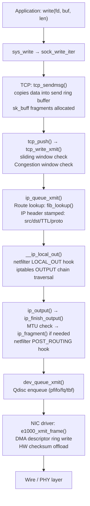

### RX Path (wire → socket buffer)

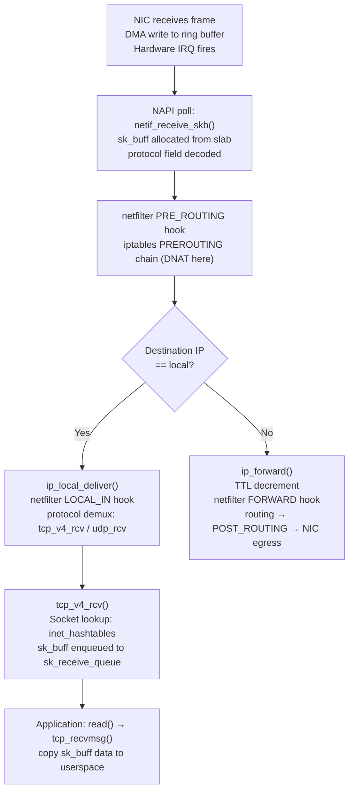

---

## 2. TCP State Machine and Congestion Control

### TCP Full State Machine

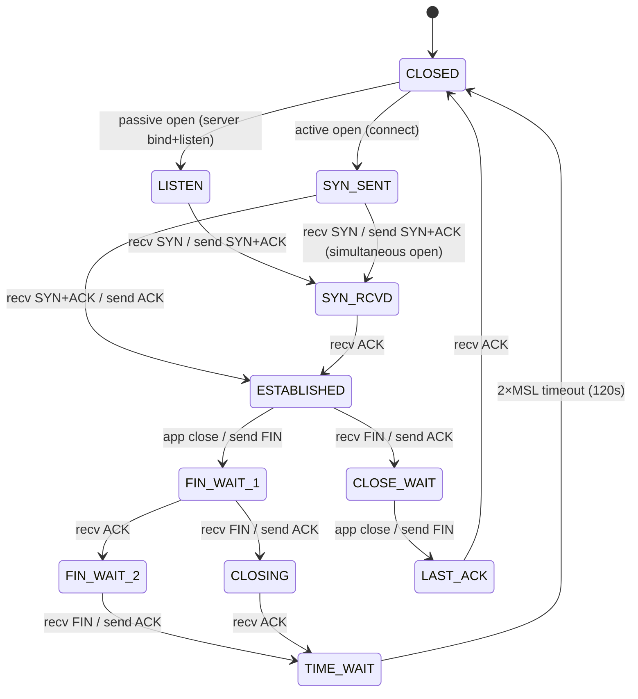

### TCP Three-Way Handshake — Kernel Memory Allocation Timeline

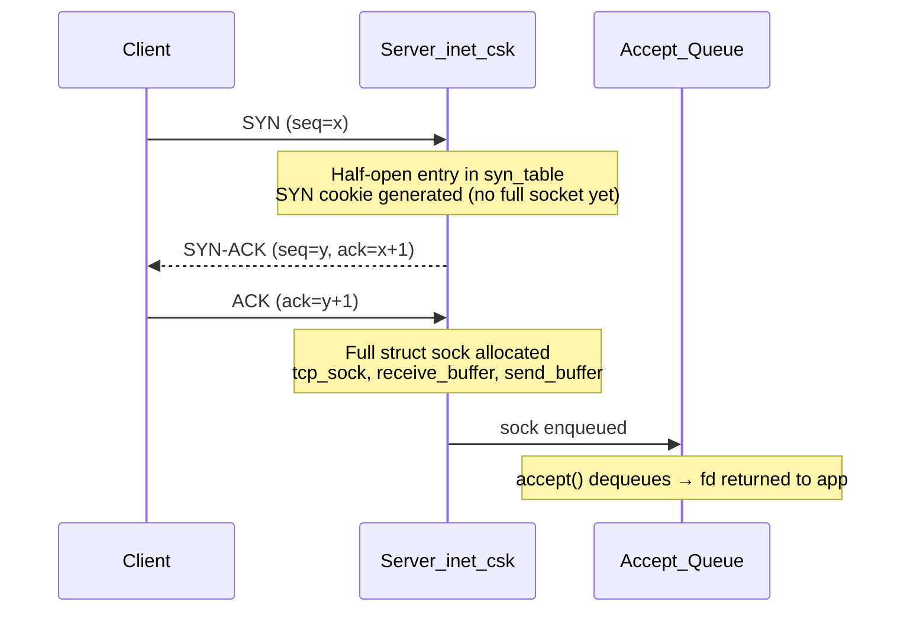

### Congestion Control — CUBIC Window Evolution

```mermaid
flowchart LR
    A["Slow Start\ncwnd += 1 per ACK\n(exponential growth)"] -->|cwnd >= ssthresh| B["Congestion Avoidance\nCUBIC: W(t) = C·(t-K)³ + Wmax\nK = ³√(Wmax·β/C)"]
    B -->|packet loss (3 dup ACKs)| C["Fast Recovery\nssthresh = cwnd × β(0.7)\nEnter CUBIC recovery probe"]
    C -->|new ACK| B
    B -->|RTO timeout| D["Slow Start\ncwnd = 1 MSS\nssthresh = cwnd/2"]
    D --> A

    style A fill:#2d4a22,color:#fff
    style B fill:#1a3a5c,color:#fff
    style C fill:#5c2d1a,color:#fff
    style D fill:#4a1a1a,color:#fff
```

**CUBIC formula breakdown**:
- `C` = 0.4 (scaling factor)
- `Wmax` = window size at last congestion event
- `K = ³√(Wmax · β / C)` — time to reach Wmax from trough
- At `t=K`, window equals Wmax; beyond K it grows super-linearly
- `β` = 0.7 (multiplicative decrease factor, less aggressive than Reno's 0.5)

**BBR (Bottleneck Bandwidth and RTT)** — probes bandwidth directly:
```
BtlBw = max delivery rate over RTprop window
pacing_rate = BtlBw × pacing_gain
cwnd = BtlBw × RTprop × cwnd_gain
```
BBR maintains separate PROBE_BW/PROBE_RTT/STARTUP/DRAIN state machine, never reacting to loss directly.

---

## 3. IP Layer — Header Processing and Routing

### IPv4 Header Memory Layout

```
 0                   1                   2                   3
 0 1 2 3 4 5 6 7 8 9 0 1 2 3 4 5 6 7 8 9 0 1 2 3 4 5 6 7 8 9 0 1
+-+-+-+-+-+-+-+-+-+-+-+-+-+-+-+-+-+-+-+-+-+-+-+-+-+-+-+-+-+-+-+-+
|Version|  IHL  |    DSCP   |ECN|         Total Length          |
+-+-+-+-+-+-+-+-+-+-+-+-+-+-+-+-+-+-+-+-+-+-+-+-+-+-+-+-+-+-+-+-+
|         Identification        |Flags|      Fragment Offset    |
+-+-+-+-+-+-+-+-+-+-+-+-+-+-+-+-+-+-+-+-+-+-+-+-+-+-+-+-+-+-+-+-+
|  Time to Live |    Protocol   |         Header Checksum       |
+-+-+-+-+-+-+-+-+-+-+-+-+-+-+-+-+-+-+-+-+-+-+-+-+-+-+-+-+-+-+-+-+
|                       Source Address                          |
+-+-+-+-+-+-+-+-+-+-+-+-+-+-+-+-+-+-+-+-+-+-+-+-+-+-+-+-+-+-+-+-+
|                    Destination Address                        |
+-+-+-+-+-+-+-+-+-+-+-+-+-+-+-+-+-+-+-+-+-+-+-+-+-+-+-+-+-+-+-+-+
```

- **IHL** (Internet Header Length): 4-bit field × 4 = header size in bytes (min 20, max 60)
- **DSCP/ECN**: Differentiated services — IP_TOS maps to queue priority; ECN bits signal congestion without drop
- **Identification + Flags + Fragment Offset**: Fragmentation reassembly — kernel tracks fragments in `ipq` hash table; reassembly timer fires after 30s

### FIB (Forwarding Information Base) Trie Lookup

Linux stores routing table as **LC-trie** (Level Compressed trie) for O(log₂W) LPM:

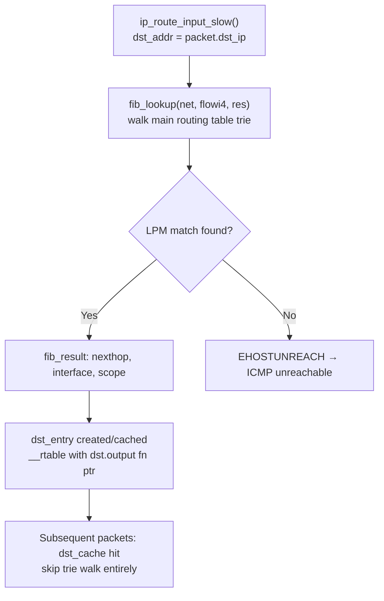

### IPv6 Extension Header Chain

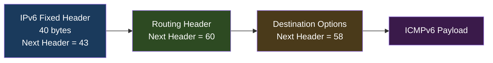

IPv6 eliminates fragmentation at intermediate routers — only source fragments (Path MTU Discovery mandatory). No header checksum (delegated to transport layer). Neighbor Discovery Protocol (NDP) replaces ARP using ICMPv6 type 135/136.

---

## 4. ARP Resolution — Memory Structures

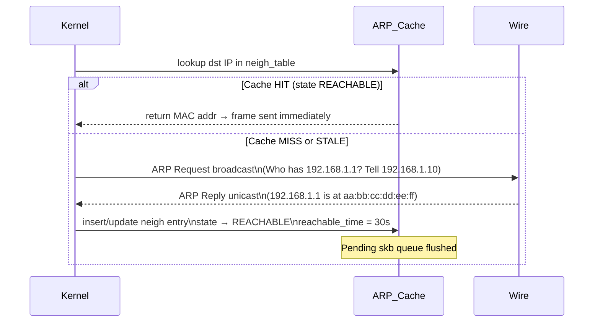

`struct neighbour` in kernel:
```c
struct neighbour {
    __u8            primary_key[4];  // IP address
    u8              ha[ALIGN(MAX_ADDR_LEN, sizeof(unsigned long))]; // MAC
    unsigned long   confirmed;        // jiffies of last confirmation
    atomic_t        refcnt;
    struct neigh_ops *ops;            // ops->output fn: arp_send or direct
    // NUD state machine: INCOMPLETE→REACHABLE→STALE→DELAY→PROBE→FAILED
};
```

---

## 5. DNS Resolution Chain

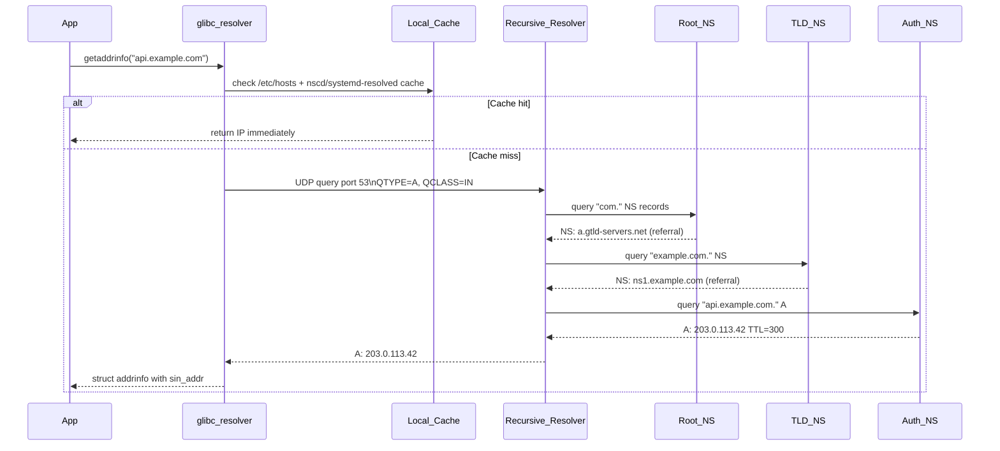

DNS message wire format (RFC 1035):
```
Header (12 bytes): ID(16) | QR|Opcode|AA|TC|RD|RA|Z|RCODE | QDCOUNT | ANCOUNT | NSCOUNT | ARCOUNT
Question: QNAME (labels) | QTYPE (2) | QCLASS (2)
Answer RR: NAME | TYPE | CLASS | TTL(32) | RDLENGTH | RDATA
```

DNSSEC adds **RRSIG** (signature over RRset), **DNSKEY** (zone signing key), **DS** (delegation signer hash), and **NSEC/NSEC3** (authenticated denial of existence). Validation chain: root KSK → TLD ZSK → authoritative zone ZSK → RRset signature.

---

## 6. Netfilter / iptables Hook Architecture

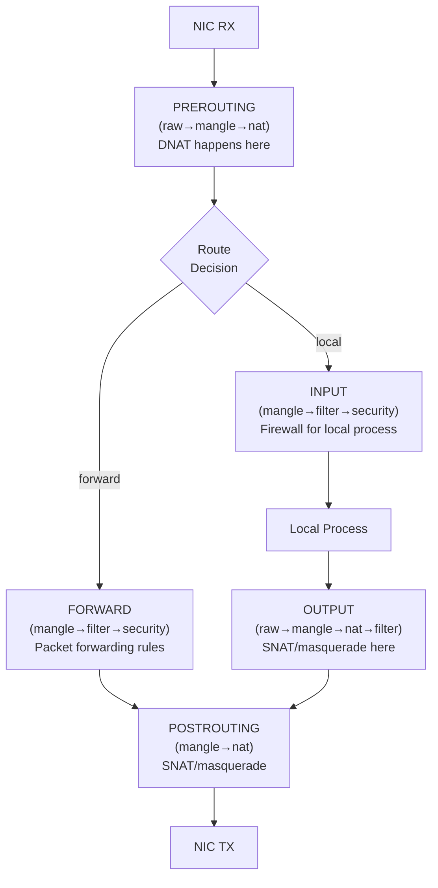

**Connection tracking (conntrack)** — each TCP/UDP flow stored in hash table:
```
nf_conntrack_tuple: {src_ip, src_port, dst_ip, dst_port, proto, netns}
State: NEW → ESTABLISHED → RELATED → INVALID
```
NAT rewrites packets by modifying sk_buff IP/TCP headers + recalculating checksums incrementally (RFC 1624 one's complement incremental update).

**nftables** replaces iptables using a register-based VM:
```
rule → list of expressions → each expression operates on registers r0..r15
verdict: accept / drop / jump / goto / return / continue
```

---

## 7. SSH Protocol Internals — Crypto Handshake

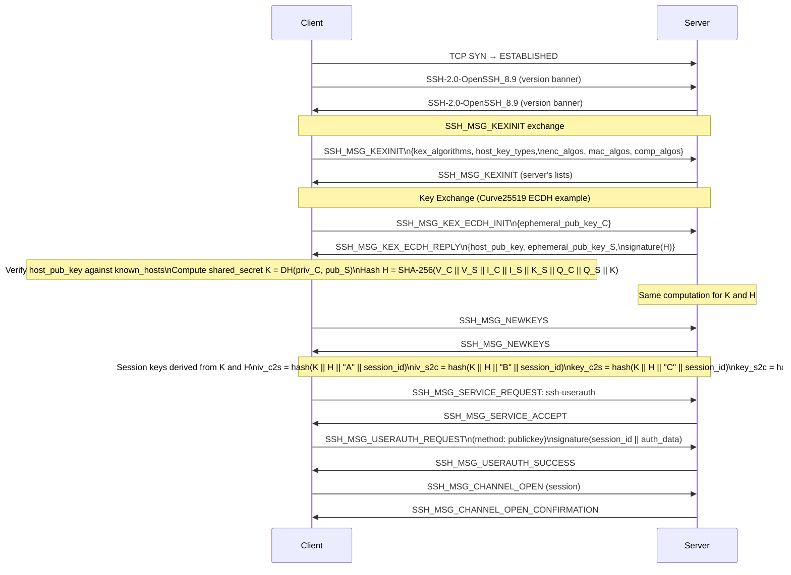

### SSH Packet Wire Format (after NEWKEYS)

```
uint32 packet_length       // length of (padding_length + payload + random_padding)
byte   padding_length      // random padding to align to cipher block size
byte[n] payload            // SSH message (compressed if negotiated)
byte[m] random_padding     // random bytes
byte[mac_len] MAC          // HMAC-SHA2-256(sequence_number || unencrypted_packet)
```

All fields after `packet_length` are encrypted with AES-256-CTR or ChaCha20-Poly1305. The MAC is computed over the **plaintext** (Encrypt-then-MAC or AEAD Poly1305 covers everything).

---

## 8. TLS 1.3 Handshake Internals

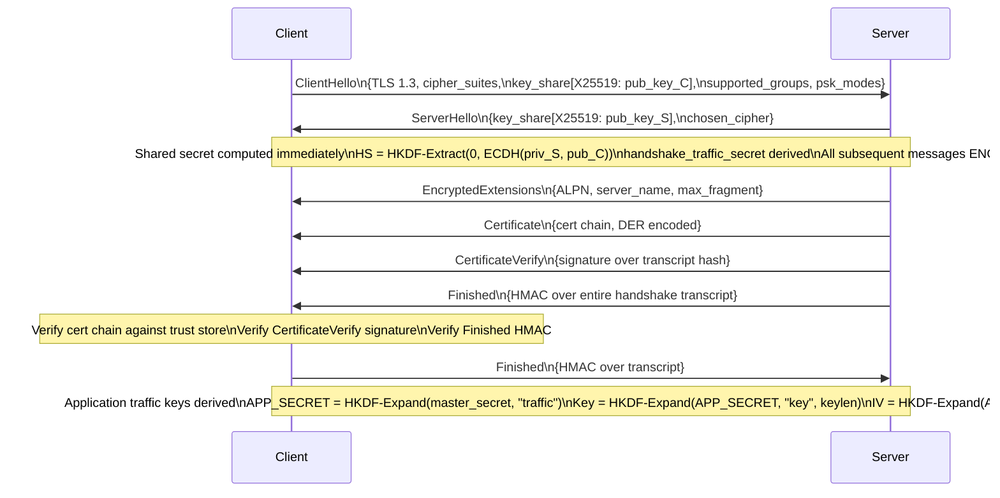

**0-RTT resumption**: Client stores PSK and ticket_age_add from previous session. On reconnect, sends early_data encrypted with resumption_master_secret before server responds. Server must accept or reject — replay vulnerability mitigated by anti-replay cache.

---

## 9. Load Balancing Algorithms — Internal Decision Paths

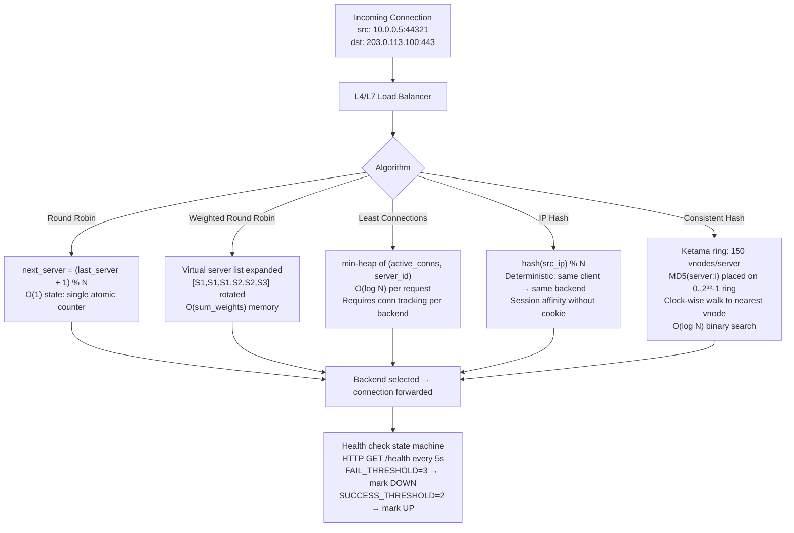

### DSR (Direct Server Return) vs NAT Mode

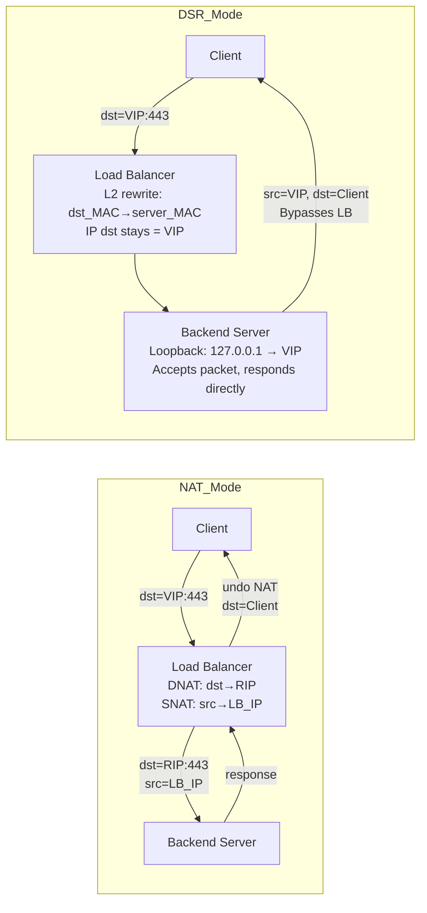

DSR eliminates return path bottleneck — LB only handles ingress. Requires all backends in same L2 domain and VIP configured on loopback (not ARP'd).

---

## 10. Linux Network Namespace Internals

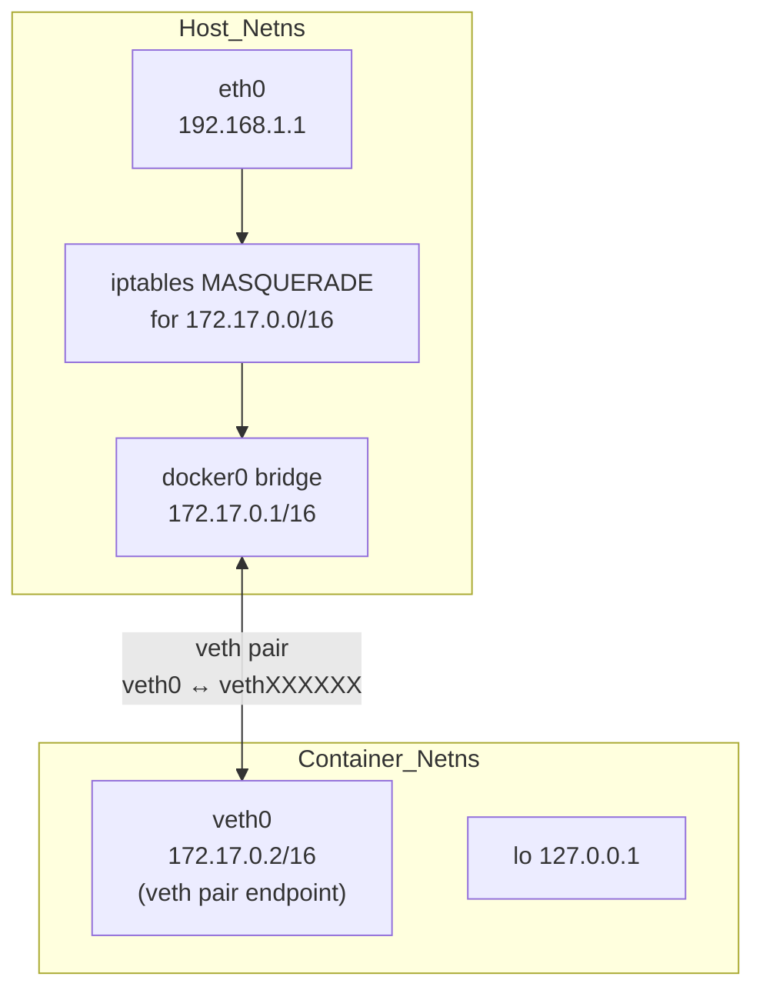

`struct net` (network namespace) contains its own:
- Routing table (`net->ipv4.fib_main`)
- ARP table (`net->ipv4.neigh_table`)
- Socket table (`net->ipv4.tcp_death_row`)
- iptables/nftables rulesets
- Network devices list (`net->dev_base_head`)

`ip netns add foo` → `clone(CLONE_NEWNET)` → new `struct net` allocated → `/proc/self/ns/net` symlink created. `unshare(CLONE_NEWNET)` in container runtime moves process into new namespace.

---

## 11. Wireless Network Internals (802.11)

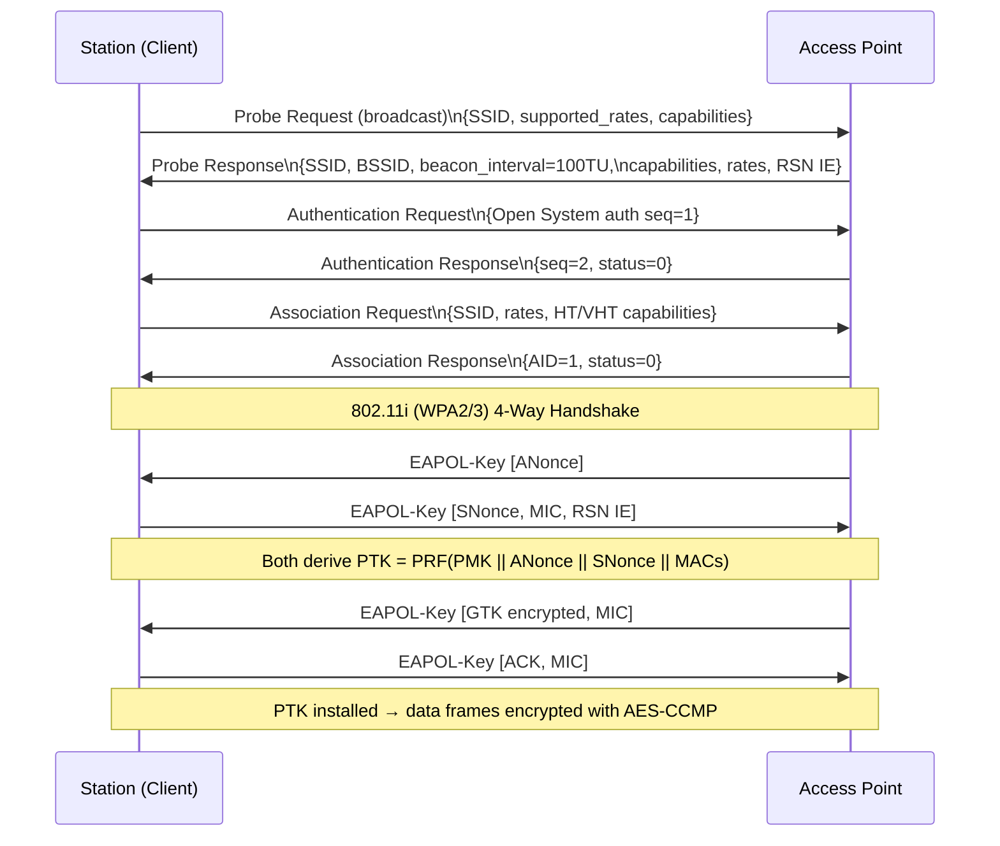

**OFDM channel encoding** (802.11n/ac/ax):
- Data split into subcarriers (e.g., 52 data + 4 pilot for 20MHz 802.11n)
- Each subcarrier BPSK/QPSK/16-QAM/64-QAM/256-QAM/1024-QAM modulated
- IFFT converts frequency domain to time domain → cyclic prefix added → RF
- MCS index encodes: modulation × coding_rate × spatial_streams → throughput

---

## 12. BGP Path Selection Internals

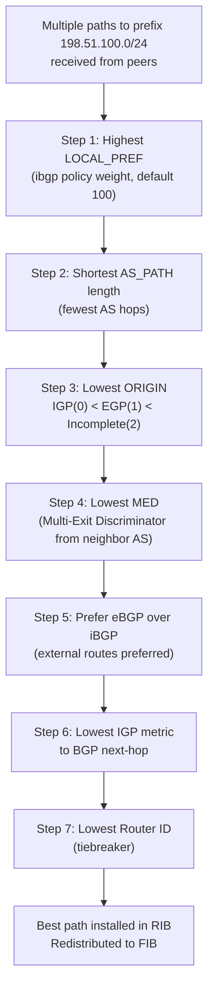

BGP UPDATE message carries:
- **WITHDRAWN ROUTES**: prefixes no longer reachable
- **PATH ATTRIBUTES**: ORIGIN, AS_PATH, NEXT_HOP, MED, LOCAL_PREF, COMMUNITY, LARGE_COMMUNITY
- **NLRI**: Network Layer Reachability Information (prefixes)

BGP session state machine: `IDLE → CONNECT → ACTIVE → OPENSENT → OPENCONFIRM → ESTABLISHED`. Keepalive timer (60s default) maintains session; Hold Time (180s) expiry tears it down.

---

## 13. TCP/UDP Checksum Computation

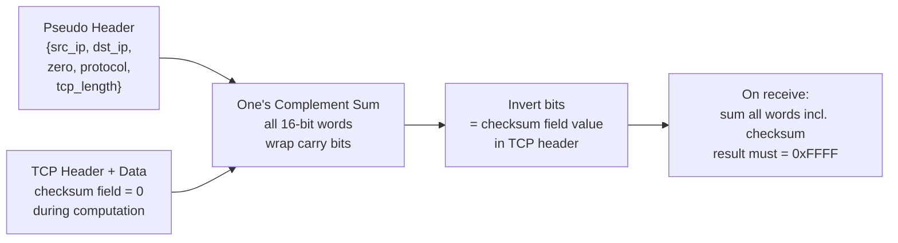

Hardware checksum offload (`NETIF_F_IP_CSUM`): NIC computes TCP/UDP checksum in hardware. Kernel sets `skb->ip_summed = CHECKSUM_PARTIAL` and writes partial pseudo-header checksum; NIC completes it over the payload using dedicated hardware logic, freeing CPU cycles.

---

## 14. HTTP/2 Frame Multiplexing Internals

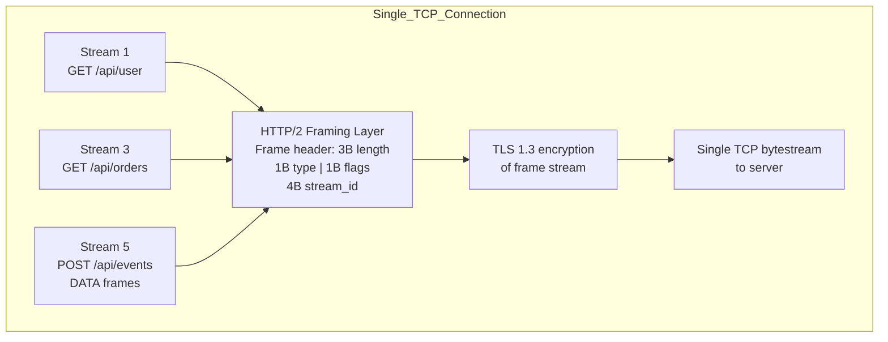

**HPACK header compression**:
- Static table: 61 predefined header name/value pairs (e.g., index 2 = `:method: GET`)
- Dynamic table: LRU cache of recently seen headers, max size negotiated via SETTINGS
- Huffman encoding applied to literal strings
- Result: headers like `Content-Type: application/json` → 1-2 bytes if previously seen

**Flow control**: Per-stream AND per-connection window. `WINDOW_UPDATE` frame adds to receive window. Each DATA frame deducted from both. Prevents slow stream from blocking fast ones.

---

## Network Stack Performance Numbers

| Operation | Typical Latency | Notes |
|-----------|-----------------|-------|
| L1 ARP cache hit → TX | ~5 µs | NIC DMA + driver path |
| TCP loopback (same host) | ~10-30 µs | kernel bypass via unix sockets ~1µs |
| LAN round-trip (GbE) | ~100-200 µs | includes switching fabric |
| WAN RTT (cross-continent) | ~60-150 ms | speed-of-light limited |
| DNS lookup (recursive, cold) | 20-200 ms | resolver chain traversal |
| TLS 1.3 handshake (warm) | 1 RTT + crypto | ~1-3 ms LAN |
| iptables rule (linear scan) | O(N) rules | 10k rules = ~100µs overhead |
| nftables rule (hash/map) | O(1) typical | set-based matching |
| TCP connection setup | 1.5 RTT | SYN + SYN-ACK + ACK + data |

---

## Summary — Key Internal Mappings

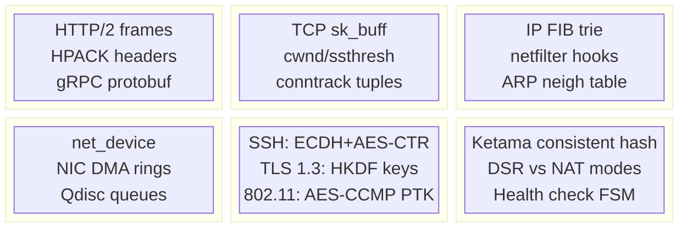

Every byte traverses: application buffer → socket send queue → TCP segmentation → IP header stamping → netfilter hooks → QDisc → NIC DMA ring → wire. On the receive side, the exact reverse path: DMA → NAPI poll → protocol demux → sk_receive_queue → userspace copy. Understanding this full sk_buff lifecycle — where it lives in memory, which kernel functions mutate it, and which hooks intercept it — is the foundation of all Linux network performance analysis and troubleshooting.
