# Operating Systems Internals: Kernel Data Structures and Scheduling

> **Under the Hood** — How the kernel manages processes, schedules threads, handles memory, and services I/O requests. Internals of task_struct, the CFS scheduler, virtual memory areas, page fault handling, VFS inode/dentry caches, and system call dispatch. Sources: *Understanding the Linux Kernel* (Bovet & Cesati), *Operating System Concepts* (Silberschatz/Galvin — "Dinosaur Book"), *The Linux Programming Interface* (Kerrisk), *Learning the UNIX Operating System*.

---

## Scope, Kernel Version, and Validation Contract

This document uses Linux to illustrate operating-system mechanisms. Kernel structures, scheduler policies, field counts, trees, thresholds, and call paths are implementation details tied to a source revision and build configuration.

- **Scope:** Record kernel release or commit, architecture, configuration, scheduler and cgroup settings, filesystem, storage device, CPU topology, page size, and enabled mitigations.
- **Model boundary:** Separate general OS concepts such as virtual memory and scheduling from Linux-specific structures such as `task_struct`, VMA indexes, VFS caches, and allocator metadata.
- **Numeric assumptions:** Timeslices, priorities, object sizes, cache counts, pipe capacities, and latency ranges vary with version, hardware, load, and instrumentation. Treat them as examples unless measured in the named environment.
- **Evidence and uncertainty:** Confirm a proposed path with the matching source, symbols, tracepoints, counters, and call traces. A sampled stack or single counter supports a hypothesis but does not uniquely identify causality.
- **Failure and completion:** Include memory pressure, races, signal interruption, I/O errors, starvation, priority inversion, and partial initialization. A claim is complete when its invariant and failure path are reproduced on the recorded kernel build.

---

## 1. Linux Kernel Process Model: task_struct

Each Linux task is represented by a `task_struct`. Its fields, size, layout, and enabled members depend on the kernel revision, architecture, and build configuration; “about 1000 fields” is only an illustrative source snapshot.

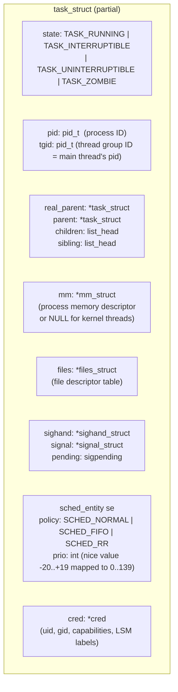

### Process State Machine

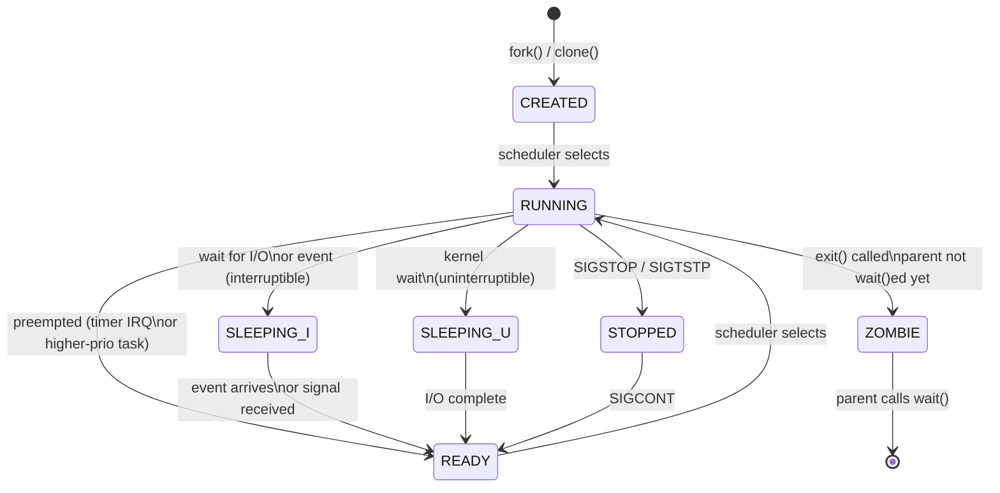

---

## 2. CFS Scheduler: Completely Fair Scheduler Internals

> Scheduler data structures and selection rules change across kernel revisions. Treat this as a representative path and verify it against the exact source and configuration being analyzed.

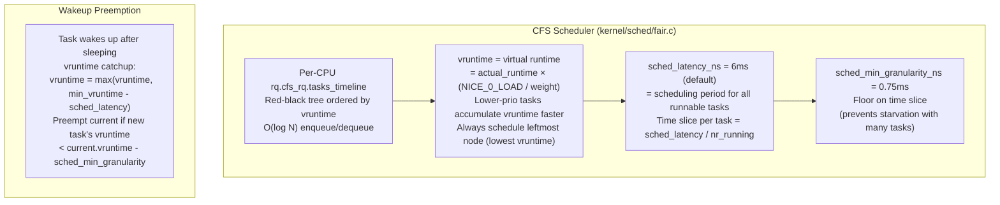

### CFS Timer Interrupt Flow

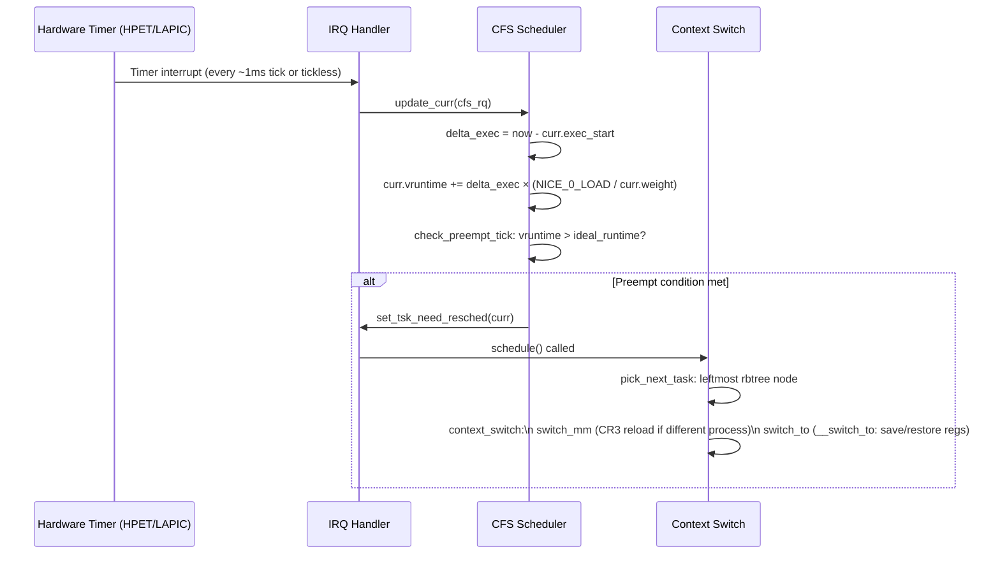

---

## 3. Virtual Memory: mm_struct and VMA Tree

> `mm_struct` is stable terminology, but the data structure used to index VMAs is kernel-version specific; do not infer a particular tree implementation from the conceptual diagram alone.

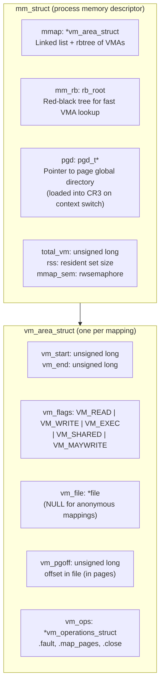

### Process Address Space Layout (x86-64 Linux)

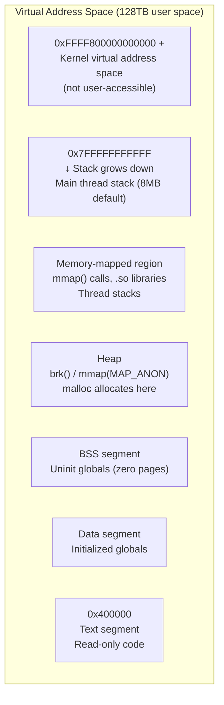

---

## 4. Page Fault Handler: Demand Paging Internals

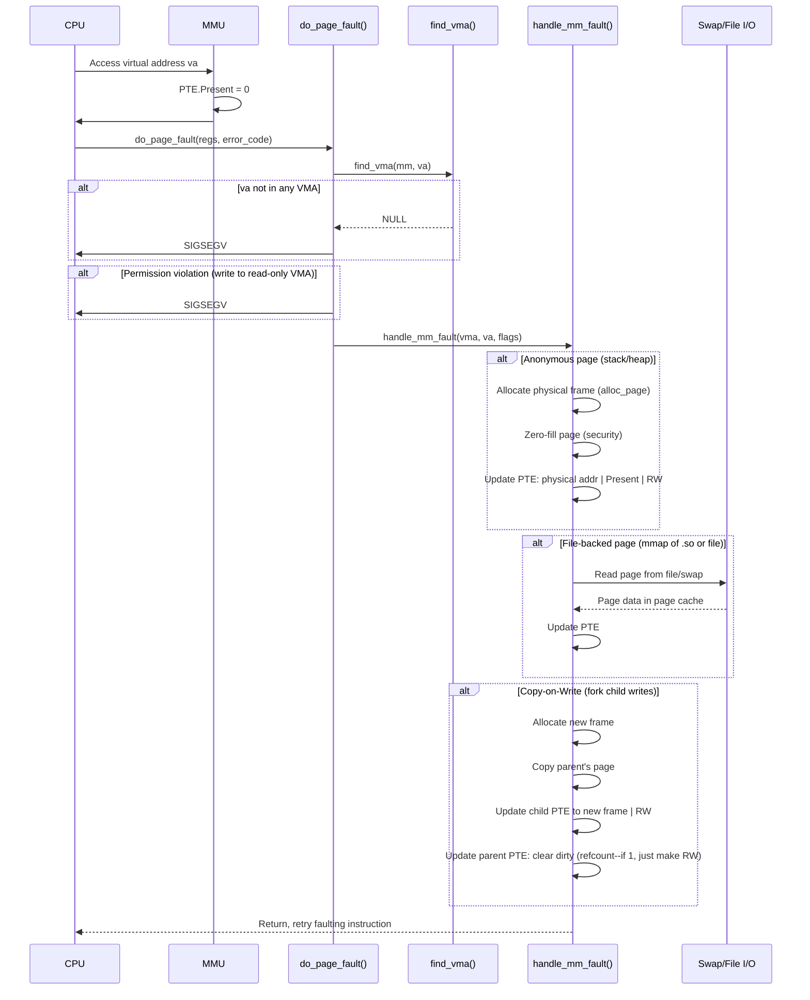

---

## 5. File System: VFS Inode/Dentry Cache

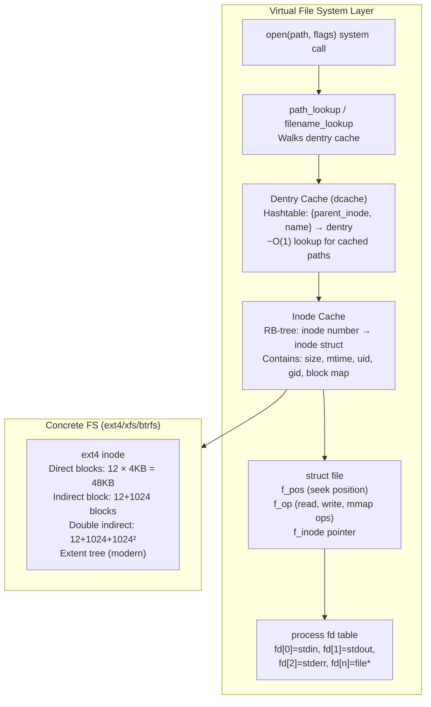

### read() System Call: Path from Syscall to Disk

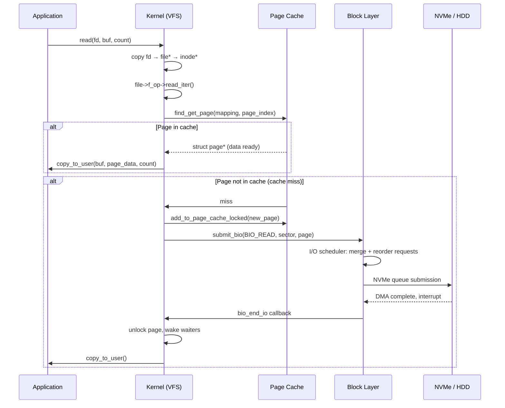

---

## 6. System Call Dispatch: User Space → Kernel

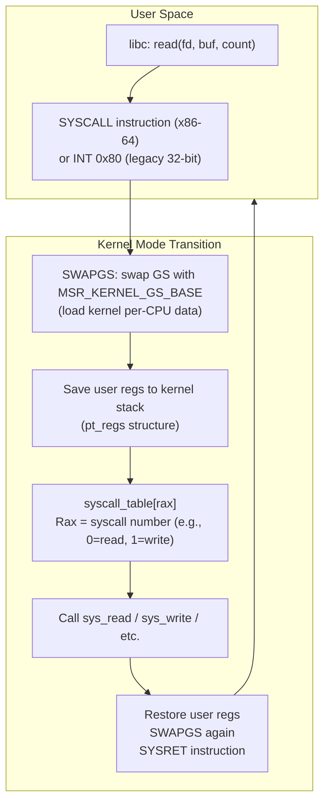

### Syscall Entry via VDSO (Virtual Dynamic Shared Object)

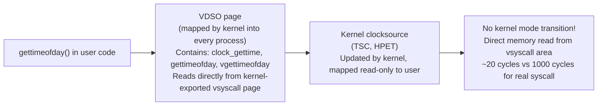

---

## 7. IPC Mechanisms: Pipes, Sockets, Shared Memory

```mermaid
flowchart TD
    subgraph PIPE["Anonymous Pipe"]
        WRITE_END["fd[1]: write end\nfile→inode→pipe_inode_info"]
        RING_BUF["Kernel ring buffer\n65536 bytes (16 pages)\nCircular buffer of struct pipe_buffer"]
        READ_END["fd[0]: read end\nBlocks in TASK_INTERRUPTIBLE if empty"]
        WRITE_END --> RING_BUF --> READ_END
    end
    subgraph SOCKET["Unix Domain Socket"]
        SRV_SOCK["Server socket\nunix_proto_ops\nbind path in /tmp/"]
        CLI_SOCK["Client socket\nconnect() to path"]
        SK_BUFF["sk_buff chain\nSocket kernel buffer\nskmem_alloc"]
        SRV_SOCK <--> SK_BUFF <--> CLI_SOCK
    end
    subgraph SHM["POSIX Shared Memory"]
        SHM_OPEN["shm_open(): creates tmpfs file\nin /dev/shm/"]
        MMAP_BOTH["Both processes mmap() same file\nPTEs in both mm_structs\npoint to same physical pages"]
        SEM["sem_post/wait\nfutex in shared memory\nfor synchronization"]
        SHM_OPEN --> MMAP_BOTH --> SEM
    end
```

---

## 8. Linux Kernel Synchronization Primitives

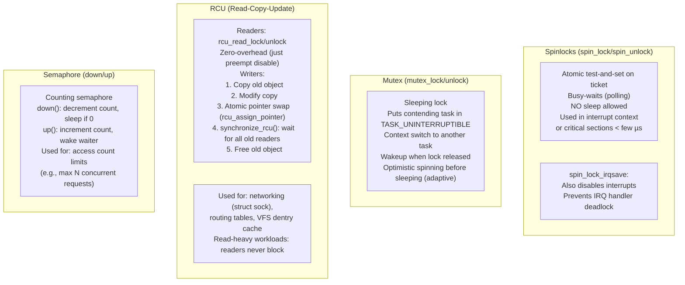

---

## 9. Memory Allocators: slab/slub Allocator Internals

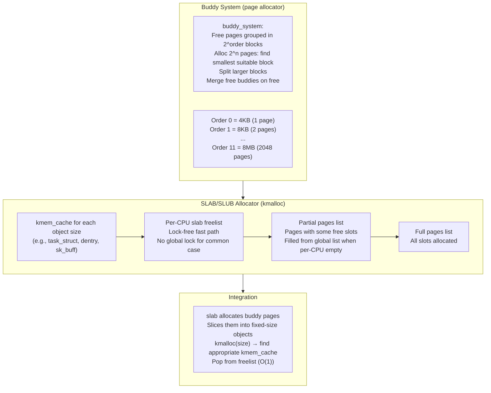

---

## 10. Process Creation: fork() and exec() Internals

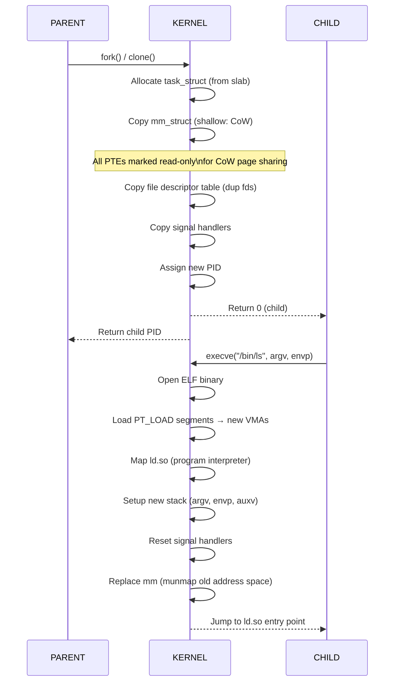

---

## 11. Linux Scheduling Classes (Priority Order)

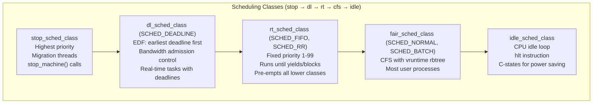

---

## 12. Kernel Module Loading: insmod Internals

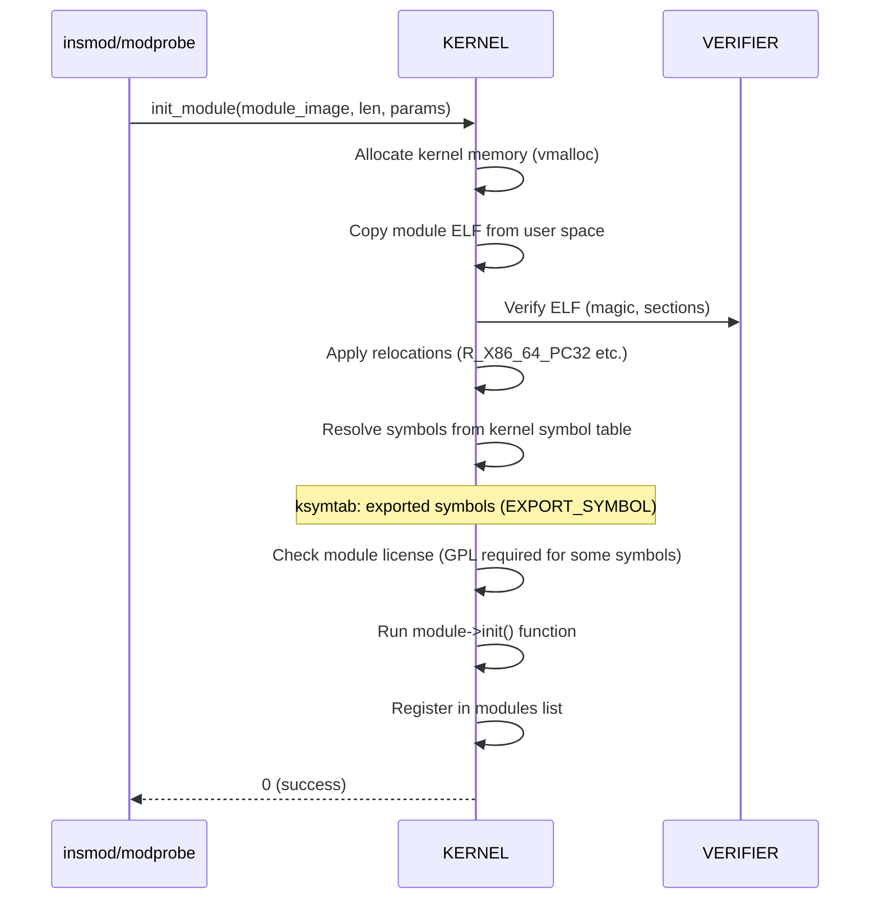
