# Programming Languages — Under the Hood: Runtimes, Type Systems, and Compilation Internals

> **Focus**: Not syntax or API usage — but how language runtimes schedule goroutines, how compilers monomorphize generics, how CPS transforms suspend coroutines, and how type inference propagates constraints across polymorphic call sites.

---

## Scope, Semantic Guarantees, and Runtime Evidence

This document compares language semantics with representative compiler and runtime implementations. A language rule, an optimization performed by one compiler, and a benchmark result must not be treated as the same kind of guarantee.

- **Scope:** Record language edition, compiler or runtime version, target, optimization flags, garbage collector, standard library, and relevant feature flags.
- **Semantic boundary:** Type safety, ownership, evaluation, and concurrency rules come from the language model. Stack layout, scheduler queues, object headers, JIT tiers, and lowering strategies are implementation details that may change.
- **Complexity and numbers:** Stack sizes, pause times, dispatch costs, allocation sizes, and asymptotic bounds require the input representation and dense or sparse assumptions. They are examples until reproduced.
- **Evidence and uncertainty:** Use compiler IR or assembly, runtime traces, allocation and GC profiles, race or sanitizer results, and statistically sound benchmarks. Infer an optimization only when the generated artifact shows it.
- **Failure and completion:** Cover panic or exception paths, cancellation, races, FFI ownership, deoptimization, stack growth, and resource cleanup. Completion requires preserved semantics plus measured improvement under a fixed workload.

---

## 1. Go Runtime: Goroutine Scheduler Internals

Go's runtime implements M:N green-thread scheduling — N goroutines multiplexed over M OS threads using a work-stealing scheduler (GMP model).

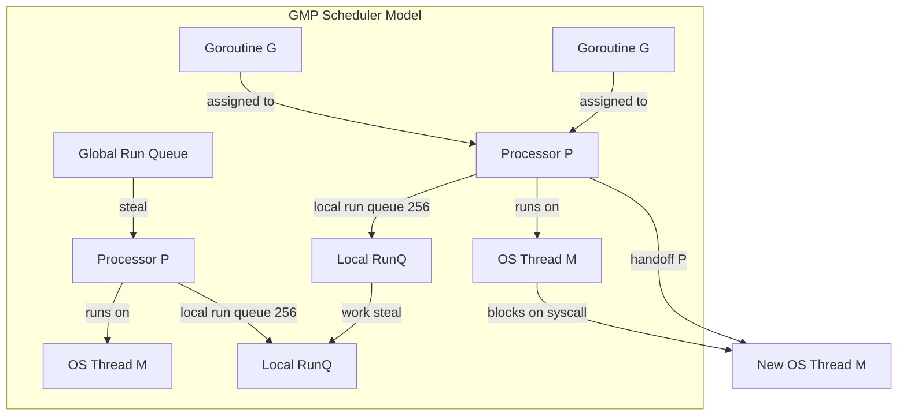

### Goroutine Stack Growth

A particular Go runtime version may start goroutines with an approximately 2KB stack and grow it by copying, while OS-thread stack reservations vary by OS and configuration and are not universally 2MB. Verify both values and the growth strategy against the target runtime:

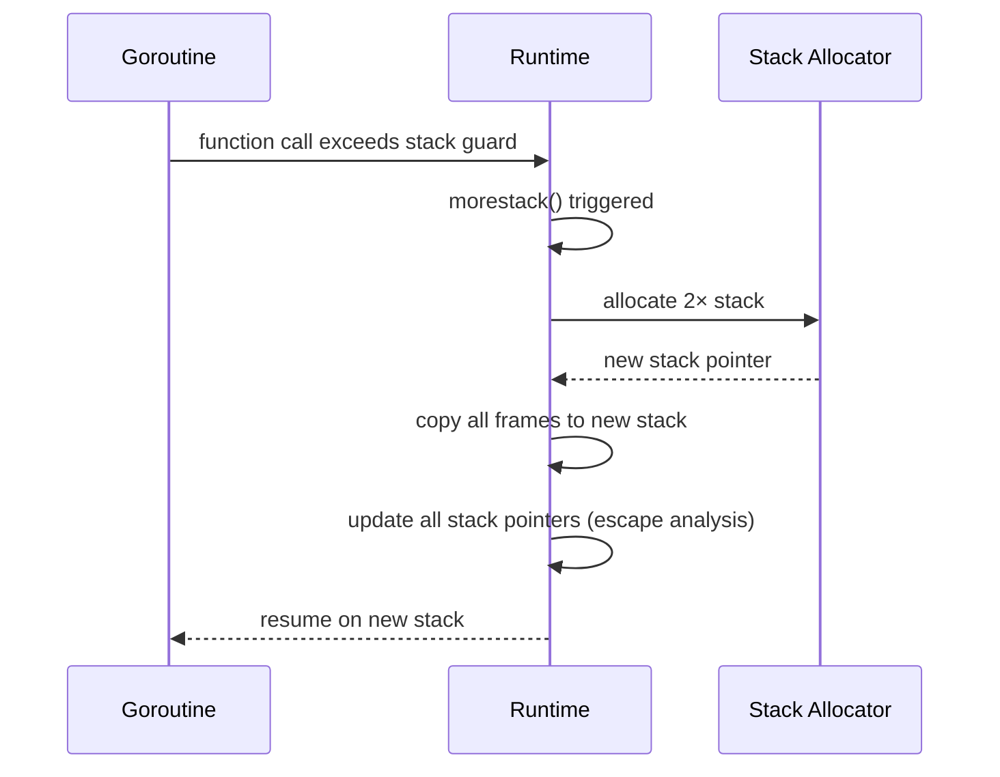

In Go runtimes that grow stacks by copying, stack-relative pointers known to the runtime are adjusted. This does not mean every arbitrary `unsafe.Pointer` pattern can be rewritten safely; Go’s pointer and escape rules, compiler metadata, cgo, and `unsafe` restrictions define the valid cases.

### Goroutine State Machine

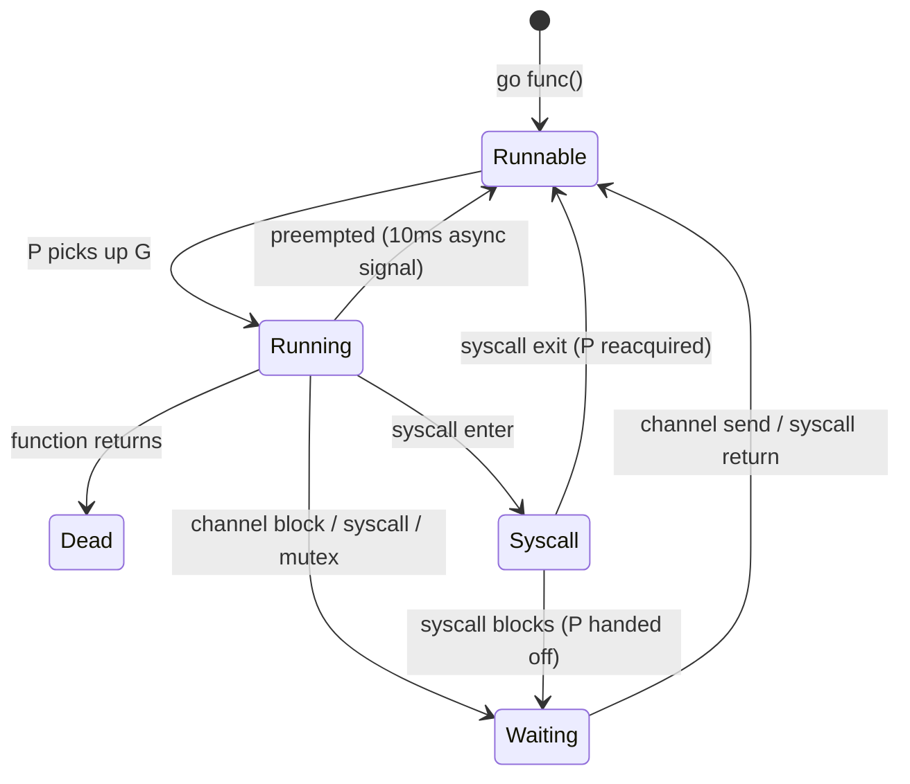

### Work Stealing Algorithm

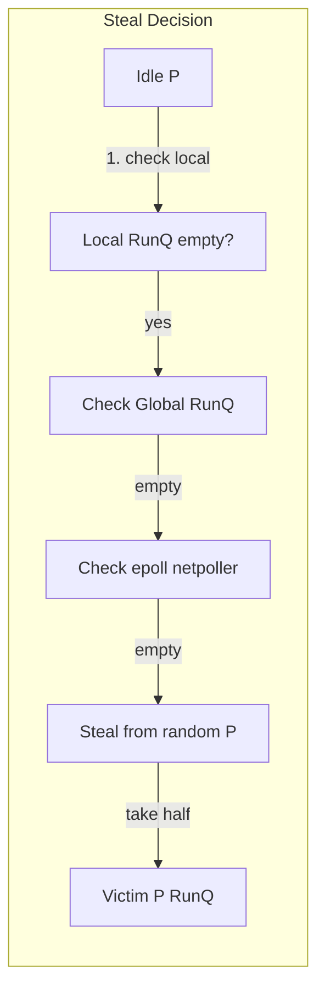

Stealing takes **half** of the victim's local run queue — reduces contention while ensuring fairness. The global run queue is checked every 61st scheduling tick to prevent starvation.

### Channel Internals: hchan Structure

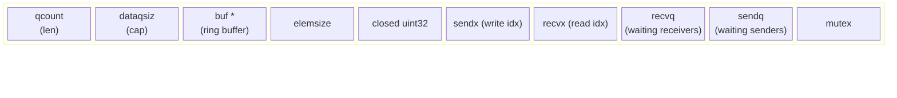

**Direct send optimization**: If a receiver is blocked in `recvq`, the sender copies data **directly to receiver's stack** (bypassing the buffer), then wakes the receiver — zero extra copy.

---

## 2. Go Garbage Collector: Tri-Color Concurrent Mark

Go uses a **concurrent tri-color mark-and-sweep** GC with a write barrier to maintain invariants while the mutator runs:

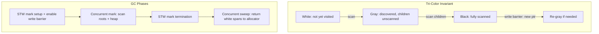

**Dijkstra write barrier**: On any pointer write `*slot = ptr`, if `*slot` was black and `ptr` is white, shade `ptr` gray. This ensures no black→white reference without gray intermediary.

GOGC=100 means GC triggers when live heap doubles. GC target: `goal = live * (1 + GOGC/100)`.

---

## 3. Rust: Ownership, Borrow Checker, and Zero-Cost Abstractions

### Ownership as Type System State

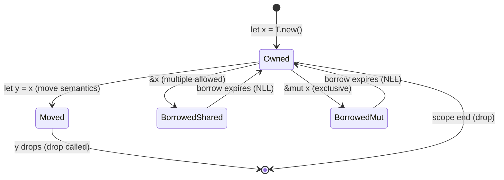

**NLL (Non-Lexical Lifetimes)**: Borrows end at **last use**, not scope close. The borrow checker operates over the MIR (Mid-level IR) control flow graph, not AST.

### Monomorphization vs Dynamic Dispatch

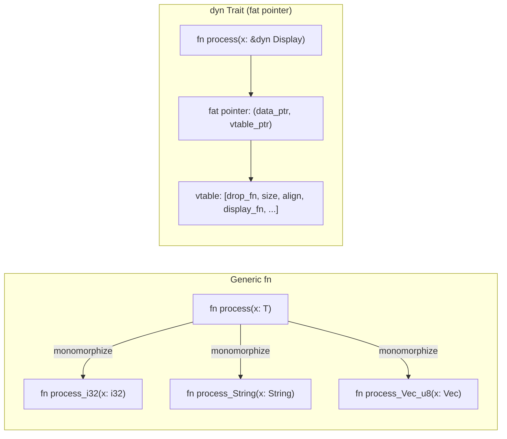

Monomorphization: **zero runtime cost**, code bloat, inlined. `dyn Trait`: one copy, indirection via vtable, prevents inlining.

### Memory Layout: Stack vs Heap

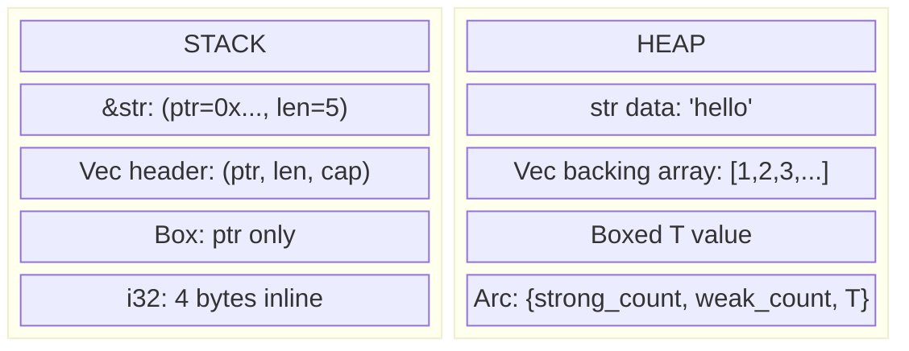

`String` = heap-allocated UTF-8. `&str` = stack fat pointer (ptr + len) into any string data. `Vec<T>` = heap buffer with (ptr, len, cap) header on stack.

### LLVM IR Pipeline

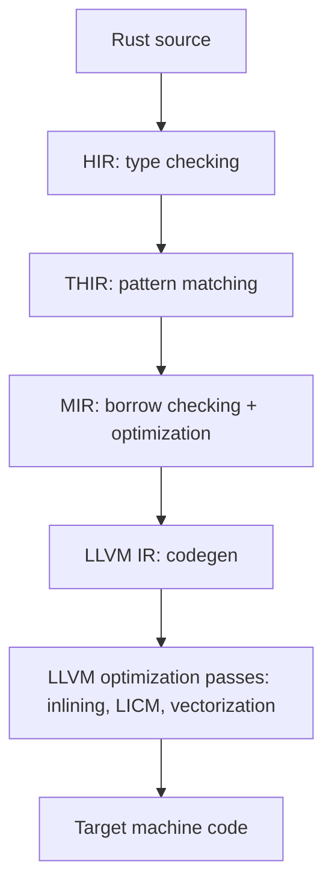

MIR is the key stage: it's a **control flow graph with explicit drops** — every variable drop is made explicit, allowing the borrow checker to verify safety without understanding complex control flow.

---

## 4. Scala: Type System, JVM Compilation, and Implicits

### Variance and Higher-Kinded Types

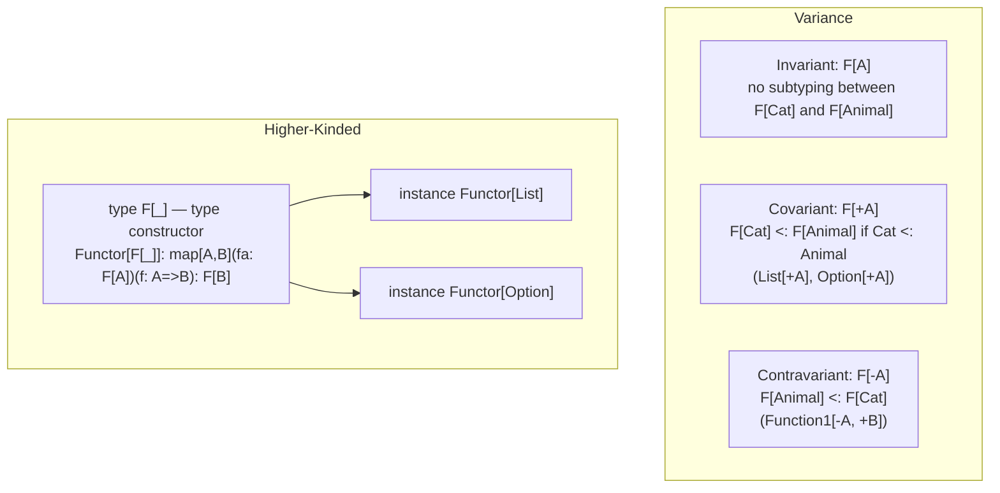

**Liskov Substitution** determines variance: covariant positions (return types, read-only containers) allow `+A`. Contravariant positions (function parameters) require `-A`.

### Implicit Resolution Algorithm

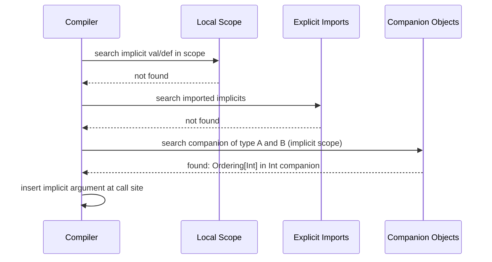

Implicit search is **deterministic** but can diverge if implicit chains form cycles. Scala 3 (Dotty) replaced implicits with `given`/`using` for clarity and better error messages.

### Scala JVM Bytecode: Traits and Mixins

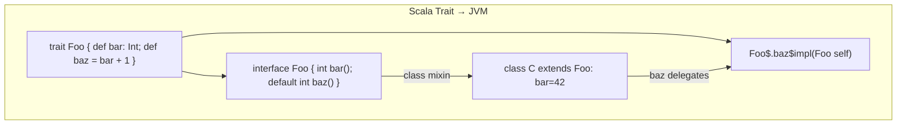

Traits with concrete methods compile to Java interfaces with `default` methods (JVM 8+). For complex diamond inheritance, a **static forwarder** is generated.

---

## 5. Kotlin: Coroutines as CPS Transformation

### Continuation-Passing Style Transformation

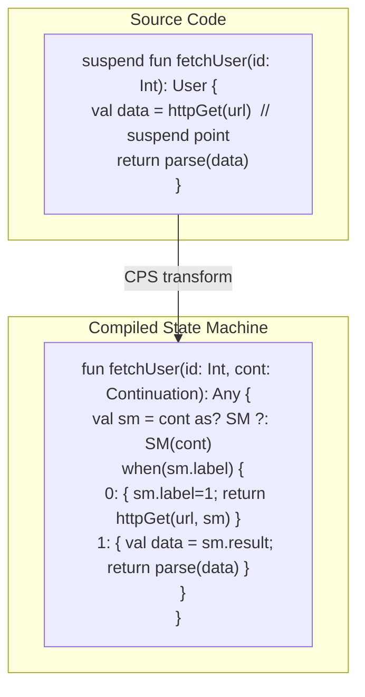

Each `suspend` call site becomes a **state machine label**. The `Continuation` object holds local variables across suspension. On resume, execution jumps to the correct `when` branch.

### Coroutine Continuation Object Memory Layout

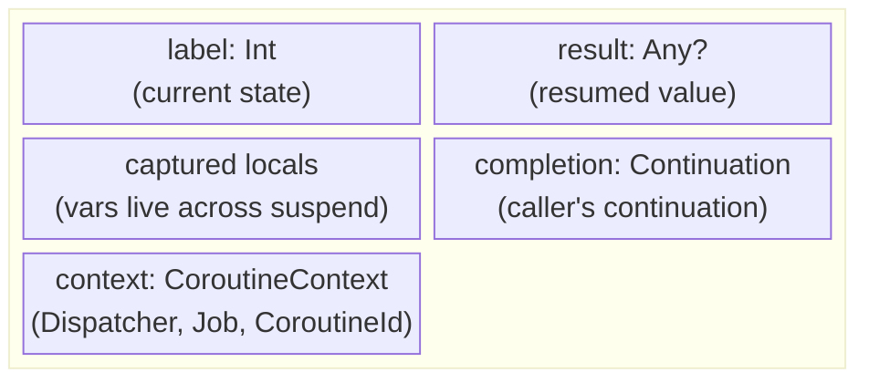

Heap-allocated continuation object replaces the stack frame at each suspension. This is **stackless coroutines** — no dedicated OS stack per coroutine (unlike Go goroutines which have growable stacks).

### Dispatcher and Thread Mapping

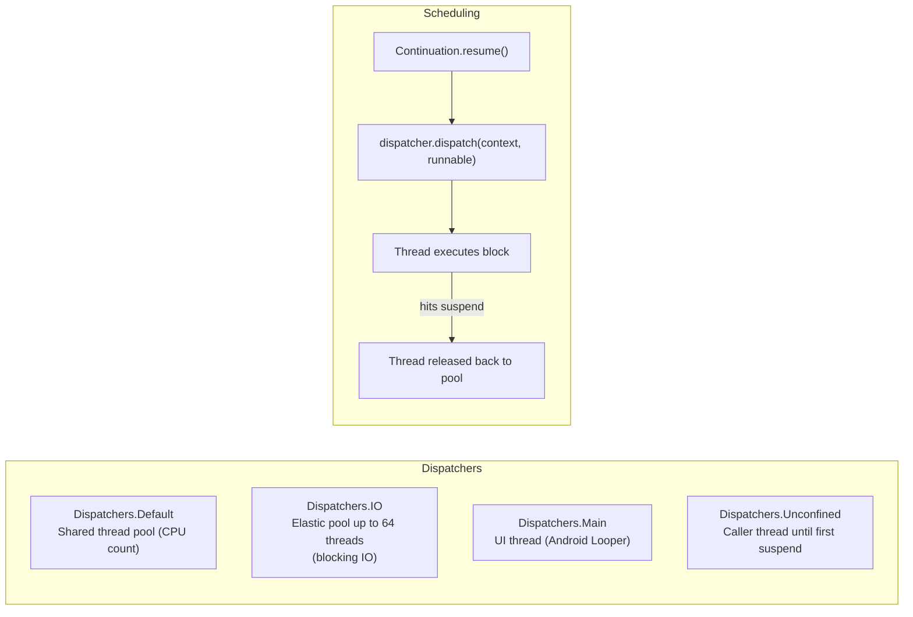

`withContext(Dispatchers.IO)` suspends current coroutine, dispatches to IO thread pool, resumes original dispatcher on completion — **no thread blocking** in the caller.

### Structured Concurrency and Job Tree

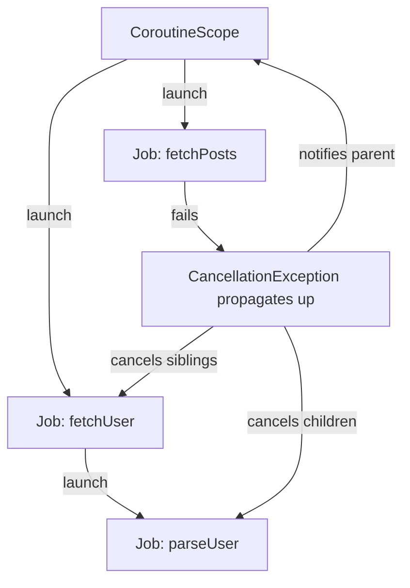

Cancellation is **cooperative** — coroutines must check `isActive` or call suspend functions that are cancellation-aware. A parent Job failure cancels all children (structured concurrency).

---

## 6. JVM Internals: HotSpot JIT Compilation

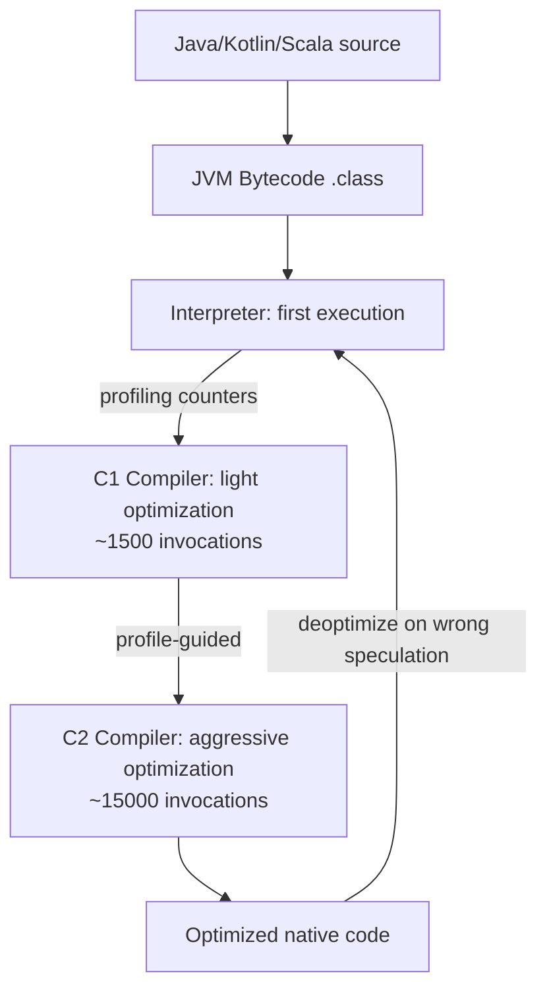

**Speculative optimizations** in C2:
- **Inlining**: virtual call devirtualized if only one implementation seen in profile
- **Escape analysis**: object stays on stack if it doesn't escape method
- **Loop unrolling + vectorization**: SIMD intrinsics for array operations
- **Null check elimination**: remove redundant null checks after profile confirms non-null

### JVM Memory Layout

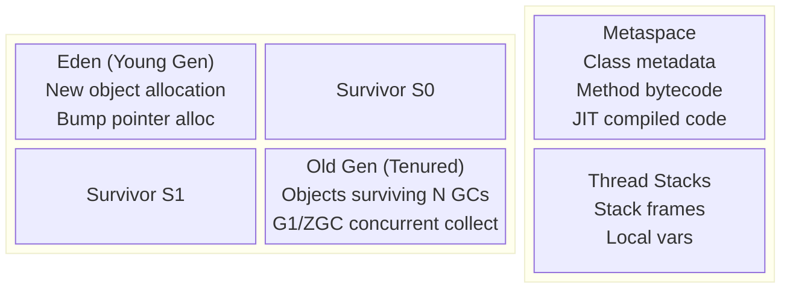

---

## 7. Go vs Rust vs JVM: Runtime Comparison

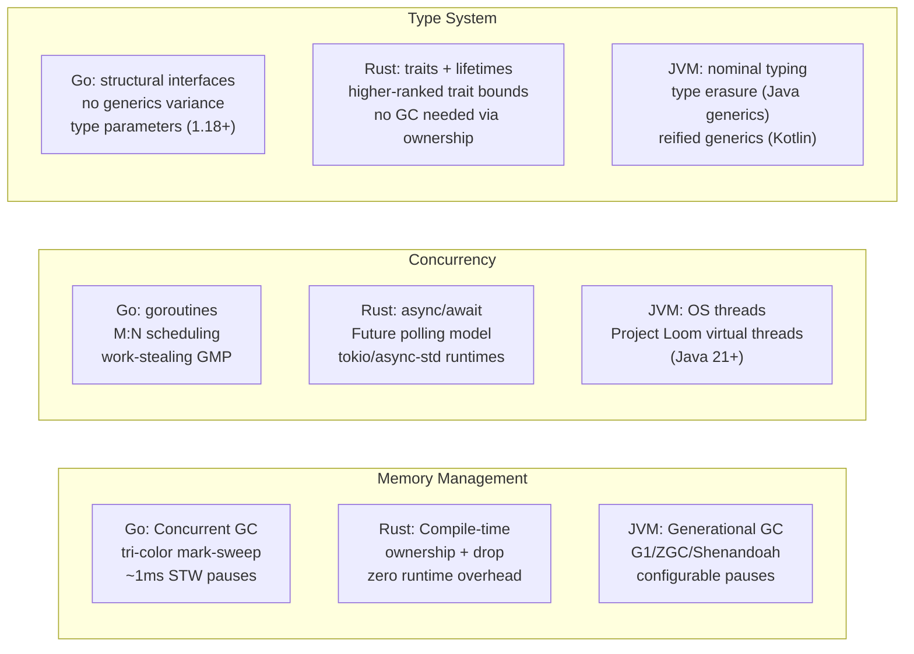

### Async/Await vs Goroutines: Core Difference

```mermaid
sequenceDiagram
    participant RustFuture as Rust Future (Stackless)
    participant GoRoutine as Go Goroutine (Stackful)

    Note over RustFuture: poll() returns Poll::Pending
    RustFuture->>RustFuture: stores state in Future struct (heap)
    RustFuture->>RustFuture: registers Waker with reactor
    Note over RustFuture: Thread returns to event loop

    Note over GoRoutine: goroutine blocks on channel/syscall
    GoRoutine->>GoRoutine: goroutine stack preserved (2KB–nMB)
    GoRoutine->>GoRoutine: P handed to another goroutine
    Note over GoRoutine: OS thread may park or handle another G
```

Rust futures are **poll-driven, zero-stack** — no allocation per suspension unless explicitly boxed. Go goroutines are **continuation-on-stack** — simpler to write (looks sync), higher per-goroutine baseline.

---

## 8. Functional Language Runtimes: Haskell GHC and OCaml

### GHC: Lazy Evaluation and Thunk Mechanics

```mermaid
flowchart TD
    subgraph "Thunk Lifecycle"
        T_created["Thunk created: closure ptr + env"] -->|first force| T_eval["Evaluate: enter closure"]
        T_eval -->|result| T_value["Update thunk to Value (WHNF)"]
        T_value -->|subsequent force| T_value
    end
    subgraph "Heap Object Layout"
        HO["Info Table Ptr | Payload..."]
        IT["Info Table: entry code | GC info | arity | srt"]
        HO --> IT
    end
```

**WHNF (Weak Head Normal Form)**: evaluation stops at outermost constructor — `Just _` is WHNF even if `_` is a thunk. Full NF evaluation requires `deepseq`.

### GHC Runtime System (RTS) Scheduler

```mermaid
flowchart LR
    HEC1["HEC 1 (OS Thread)\nHaskell Execution Context"] --> RunQ1[Spark Queue]
    HEC2["HEC 2 (OS Thread)"] --> RunQ2[Spark Queue]
    RunQ1 -->|work steal| RunQ2
    HEC1 -->|STM transaction| TLog[Transaction Log]
    TLog -->|commit: validate| STMHeap[STM Heap vars]
    TLog -->|conflict: retry| TLog
```

GHC's `par`/`seq` spark pool enables speculative parallelism. The **STM (Software Transactional Memory)** runtime uses optimistic concurrency: each transaction logs reads/writes, validates atomically on commit, retries on conflict.

---

## 9. Language Feature: Pattern Matching Compilation

Many ML-family compilers lower pattern matching to decision trees, jump tables, or mixed tests. Dispatch is not universally O(1); it depends on pattern form, constructor representation, guards, compiler strategy, and the path taken:

```mermaid
flowchart TD
    Match["match expr with\n| (0, _) -> A\n| (_, 0) -> B\n| (x, y) -> C"] -->|compile| DT["Decision Tree"]
    DT --> T1["test expr.0 == 0?"]
    T1 -->|yes| A["return A"]
    T1 -->|no| T2["test expr.1 == 0?"]
    T2 -->|yes| B["return B"]
    T2 -->|no| C["return C(x, y)"]
```

Compiler selects between **switch dispatch** (integer tags) and **if-chain** based on constructor density. Rust `match` on enums compiles to a jump table indexed by discriminant tag.

### Algebraic Data Type Memory Layout (Rust/Haskell)

```mermaid
block-beta
    columns 2
    block:rust_enum:1
        columns 1
        r_label["Rust: enum Option<T>"]
        r_none["None: discriminant=0, no payload"]
        r_some["Some(T): discriminant=1, T inline"]
        r_opt["niche optimization: &T None=0x0"]
    end
    block:haskell_adt:1
        columns 1
        h_label["Haskell: data Maybe a"]
        h_nothing["Nothing: info_ptr → Nothing_info, tag=0"]
        h_just["Just a: info_ptr → Just_info, a=thunk_ptr"]
    end
```

Rust applies **niche optimization**: `Option<&T>` uses null pointer as `None` — same size as `&T`, no discriminant needed.

---

## 10. Type Inference: Algorithm W / HM Unification

```mermaid
sequenceDiagram
    participant TC as Type Checker
    participant Env as Type Environment
    participant Uni as Unifier

    TC->>TC: generate fresh type var α for unknown
    TC->>Env: lookup variable → τ
    TC->>TC: instantiate polymorphic type (fresh vars)
    TC->>Uni: add constraint: τ1 = τ2
    Uni->>Uni: unify: walk structure recursively
    Uni->>Uni: occurs check: α ≠ F(α) (prevents infinite types)
    Uni-->>TC: substitution σ
    TC->>TC: generalize: ∀α. τ (if α free in τ, not in env)
    TC-->>TC: principal type derived
```

**Unification** is the core operation: `unify(List α, List Int)` → `α := Int`. Unification failure = type error. Occurs check prevents `α = List α` (infinite type).

### Rank-2 Polymorphism (Rust/Haskell HRTB)

```mermaid
flowchart TD
    R1["Rank-1: ∀a. a → a\nType var instantiated at call site by caller"]
    R2["Rank-2: (∀a. a → a) → Int\nCallee receives a polymorphic function\nMust work for ANY a, not a specific one"]
    R1 -->|subsumes| R2
    R2 -->|Rust syntax| HRTB["for<'a> Fn(&'a T) -> &'a U\nHigher-Ranked Trait Bound"]
```

Rust uses HRTBs for expressing that a closure must work for **any lifetime** — not just a specific inferred lifetime.

---

## 11. Cross-Language: Interoperability and FFI Mechanics

```mermaid
sequenceDiagram
    participant Rust
    participant CRuntime as C ABI (cdecl/SysV)
    participant Python as Python (CPython)

    Rust->>CRuntime: #[no_mangle] extern "C" fn foo()
    CRuntime->>Python: ctypes.CDLL → dlopen + dlsym
    Python->>Python: convert Python int → c_int (boxing)
    Python->>CRuntime: call via function pointer
    CRuntime->>Rust: stack frame in C calling convention
    Rust-->>CRuntime: return value
    CRuntime-->>Python: unbox to Python int
```

**PyO3 (Rust↔Python)**: GIL must be held when calling Python API. `pyo3::Python<'py>` token is a compile-time proof the GIL is held — safe Rust prevents GIL bugs at type level.

**JNI (Java↔C/Rust)**: JNIEnv pointer passed to native; every Java object reference is a handle (JNI local/global ref) — not a direct heap pointer. GC can move objects; JNI refs pin them.

---

## Summary: Language Runtime Internals Map

> Sizes, thresholds, dispatch costs, and lowering strategies below are version-specific examples. Language-level guarantees remain valid only where the governing specification defines them.

```mermaid
mindmap
  root((Language Runtimes))
    Go
      GMP scheduler M:N
      Work-stealing local runq
      Growable goroutine stacks
      Tri-color concurrent GC
      hchan direct send optimization
    Rust
      Ownership = compile-time GC
      MIR borrow checker CFG
      Monomorphization zero-cost
      LLVM backend optimization
      Async stackless Future polling
    Kotlin/JVM
      CPS transform suspend fns
      Continuation state machine
      Structured concurrency Job tree
      HotSpot C1/C2 JIT tiers
      G1/ZGC generational GC
    Scala/JVM
      Variance +A/-A type system
      Implicit resolution scope chain
      Trait → default method bytecode
      Higher-kinded type parameters
    Haskell/GHC
      Lazy thunk force + update
      WHNF evaluation strategy
      STM optimistic concurrency
      Spark pool parallel HEC
```
