# Security Internals: Cryptography, Authentication & Exploit Mechanics

> Under the Hood: How TLS handshakes negotiate keys, how hash functions avalanche, how buffer overflows corrupt control flow, how OAuth tokens prove identity — the exact memory layouts, state machines, and mathematical operations behind security mechanisms.

---

## 1. Symmetric Encryption: AES Internal Mechanics

AES (Advanced Encryption Standard) operates on a 4×4 byte **state matrix** through 10/12/14 rounds (for 128/192/256-bit keys).

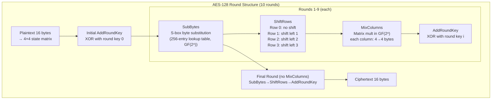

### SubBytes: S-Box as GF(2⁸) Multiplicative Inverse

The S-box is not arbitrary — each byte `b` is mapped to `b⁻¹ mod (x⁸+x⁴+x³+x+1)` (multiplicative inverse in GF(2⁸)), then an affine transform is applied. This provides:
- **Non-linearity**: breaks any linear algebraic attack
- **Avalanche**: 1 bit change in input changes ~50% of output bits after several rounds

### AES-GCM: Authenticated Encryption

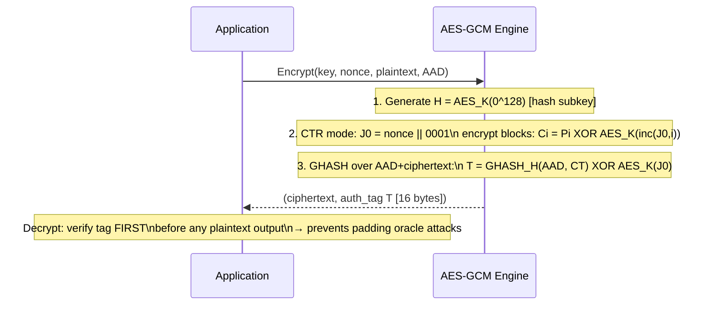

---

## 2. Public Key Cryptography: RSA and ECDH Internals

### RSA Key Generation and Operations

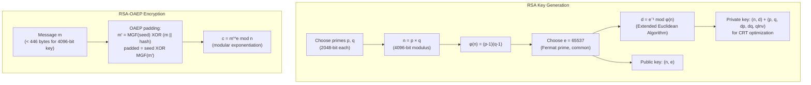

### ECDH Key Exchange (Curve25519)

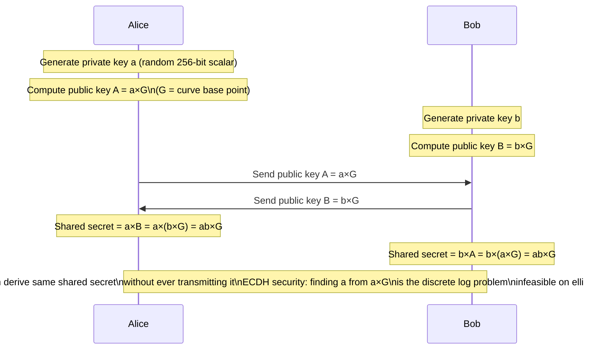

**Why Curve25519 over NIST curves**: Curve25519 (`y² = x³ + 486662x² + x` over GF(2²⁵⁵-19)) has no known NIST backdoors, is twist-secure, and the Montgomery ladder implementation is constant-time (no timing side channels).

---

## 3. TLS 1.3 Handshake: Every Byte Explained

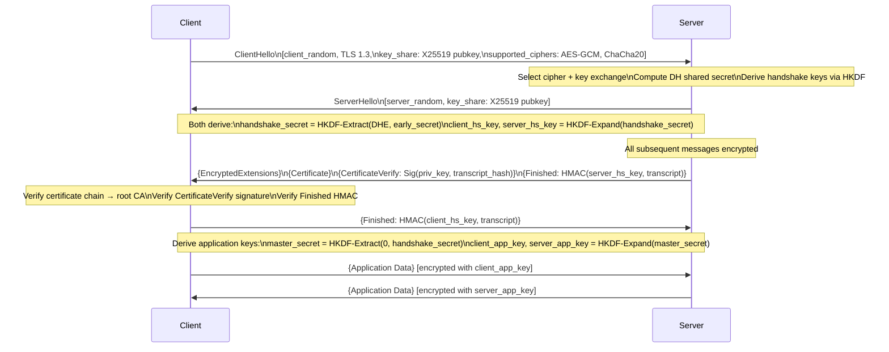

### HKDF Key Derivation

TLS 1.3 uses HKDF (HMAC-based Extract-and-Expand KDF):
```
HKDF-Extract(salt, IKM) = HMAC-SHA256(salt, IKM) → PRK (pseudorandom key)
HKDF-Expand(PRK, info, L) = T(1) || T(2) || ... where T(i) = HMAC-SHA256(PRK, T(i-1)||info||i)
```

**Forward Secrecy**: TLS 1.3 mandates ephemeral key exchange (X25519/P-256). The session key is derived from a fresh DH exchange per connection — compromising the server's long-term private key later cannot decrypt past traffic.

---

## 4. Hash Functions: SHA-256 Internals

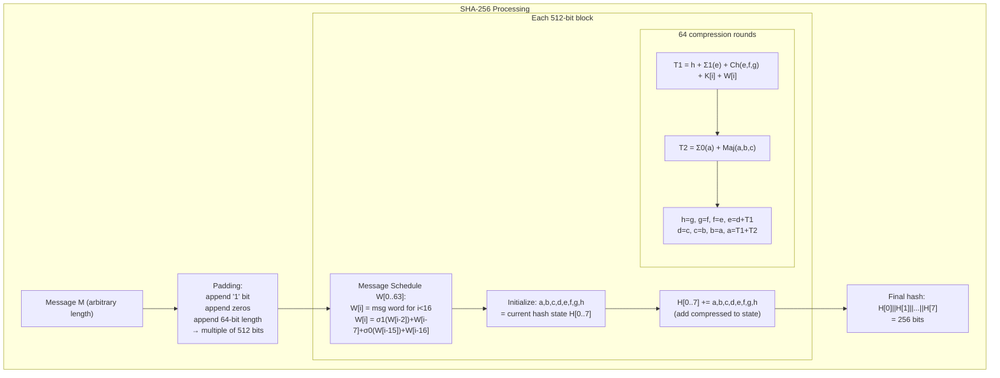

**Σ and σ functions use bit rotations + XOR**:
- `Σ0(a) = ROTR²(a) XOR ROTR¹³(a) XOR ROTR²²(a)`
- `Ch(e,f,g) = (e AND f) XOR (NOT_e AND g)` — "choose" function
- `Maj(a,b,c) = (a AND b) XOR (a AND c) XOR (b AND c)` — "majority" function

These bitwise operations create the **avalanche effect**: flipping 1 input bit changes ~50% of output bits.

---

## 5. Password Hashing: Why bcrypt/Argon2 vs SHA-256

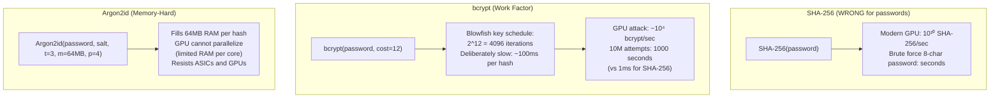

### Argon2 Memory Access Pattern

Argon2 allocates a matrix of memory blocks (1KB each). Each block computation depends on pseudo-random previous blocks — impossible to parallelize without the full matrix in memory.

---

## 6. Buffer Overflow: Stack Smashing Internals

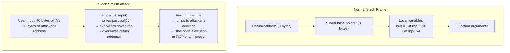

### Stack Layout During Overflow

```
[High address]
  0x7fff1000: return address = 0x401234 (main+0x30)
  0x7ffe_fff8: saved RBP = 0x7fff2000
  0x7ffe_fff0: i = 0
  0x7ffe_ffe0: buf[0..15] = "AAAA..."
[Low address]
                         ↑
                    strcpy writes upward
After overflow:
  return address = 0x41414141 (AAAA — attacker controlled)
```

### Modern Mitigations and How They're Bypassed

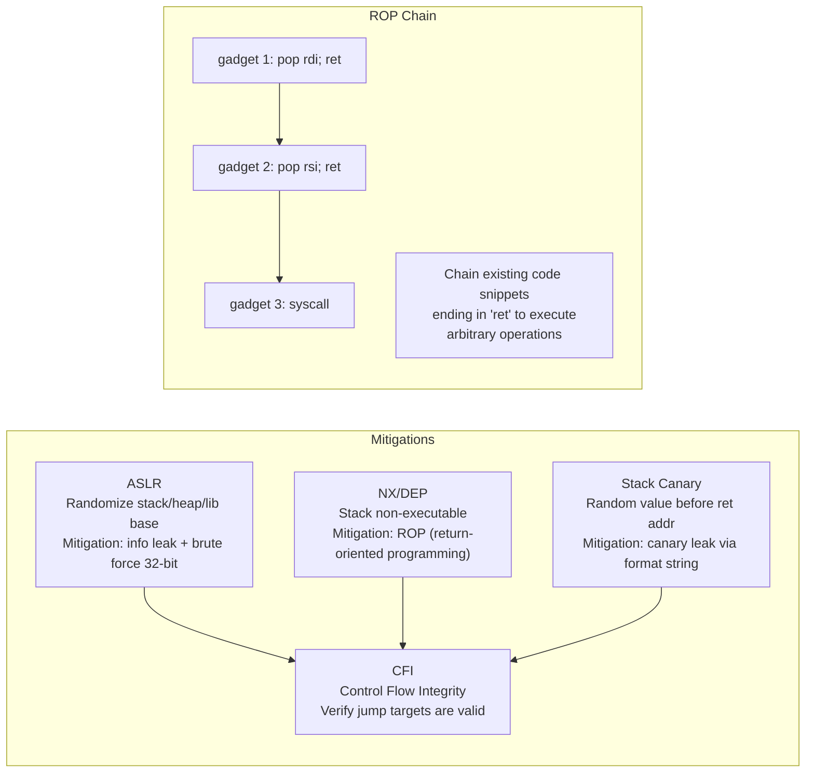

---

## 7. OAuth 2.0 / OIDC: Token Flow Internals

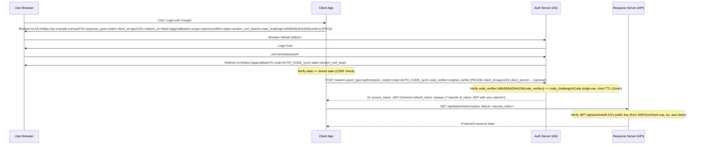

### JWT Structure and Signature Verification

```
Header: {"alg":"RS256","typ":"JWT","kid":"key-id-123"}
        → base64url encoded

Payload: {"sub":"user123","iss":"https://auth.example.com",
          "aud":"app123","exp":1709999999,"iat":1709996399,
          "scope":"openid profile"}
         → base64url encoded

Signature: RS256_sign(private_key, header.payload)
          = RSA-PKCS1v15-SHA256(private_key, base64(header)+"."+base64(payload))
          → base64url encoded

Final: header.payload.signature (3 dots-separated parts)
```

---

## 8. SQL Injection: Parse Tree Manipulation

```mermaid
flowchart TD
    subgraph "Vulnerable Code"
        CODE["query = 'SELECT * FROM users WHERE name=\'' + user_input + '\''"]
        LEGIT["user_input = 'alice'\n→ WHERE name='alice' ✓"]
        ATTACK["user_input = \"' OR '1'='1\"\n→ WHERE name='' OR '1'='1'\n→ returns ALL rows!"]
        CODE --> LEGIT
        CODE --> ATTACK
    end
    subgraph "Parameterized Query (Safe)"
        PARAM["query = 'SELECT * FROM users WHERE name=?'\nparams = [user_input]"]
        PARSE["DB parses SQL structure ONCE\nbefore substituting value"]
        SAFE["user_input = \"' OR '1'='1\"\n→ treated as literal string\n→ WHERE name = \"\\' OR \\'1\\'=\\'1\\'\"\n→ no rows returned ✓"]
        PARAM --> PARSE --> SAFE
    end
```

The key: parameterized queries **separate code from data** at the parser level. The SQL engine builds the parse tree from the template, then substitutes values as data literals — the value can never alter the tree structure.

---

## 9. Certificate Chain Verification

```mermaid
flowchart TD
    subgraph "Certificate Chain"
        LEAF["Leaf Cert: *.example.com\nPublic Key: EC P-256\nIssuer: DigiCert TLS RSA\nSignature: RSA by DigiCert TLS RSA key"]
        INT["Intermediate CA: DigiCert TLS RSA\nPublic Key: RSA 2048\nIssuer: DigiCert Global Root CA\nSignature: RSA by Root CA key"]
        ROOT["Root CA: DigiCert Global Root CA\nPublic Key: RSA 2048\nIssuer: self-signed\nTrusted: pre-installed in OS/browser"]

        LEAF --> INT --> ROOT
    end
    subgraph "Verification Steps"
        V1["1. Verify leaf cert signature\n   using intermediate CA's public key"]
        V2["2. Verify intermediate cert signature\n   using root CA's public key"]
        V3["3. Verify root cert in trusted store\n   (OS certificate bundle)"]
        V4["4. Check hostname: CN/SAN matches\n   *.example.com → valid for www.example.com"]
        V5["5. Check validity period\n   notBefore < now < notAfter"]
        V6["6. Check revocation:\n   OCSP staple or CRL download"]
        V1 --> V2 --> V3 --> V4 --> V5 --> V6
    end
```

**Certificate Transparency (CT)**: Since 2018, browsers require all TLS certs to be logged in public CT logs before issuance. The leaf cert contains a **Signed Certificate Timestamp (SCT)** — proof that it was submitted to a CT log. This prevents misissued certificates from hiding.

---

## 10. Memory Safety: Use-After-Free Exploitation

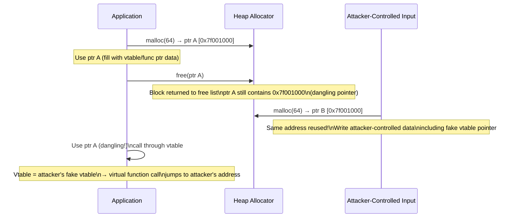

**Mitigations**:
- **Memory-safe languages**: Rust borrow checker prevents dangling pointers at compile time
- **AddressSanitizer**: Red zones + shadow memory detect use-after-free at runtime (2-3× slowdown)
- **tcmalloc/jemalloc pointer randomization**: Makes reuse address prediction harder
- **CFI**: Validates vtable call targets against expected class hierarchy

---

## 11. Side-Channel Attacks: Timing and Cache

### Spectre (Cache Timing Side Channel)

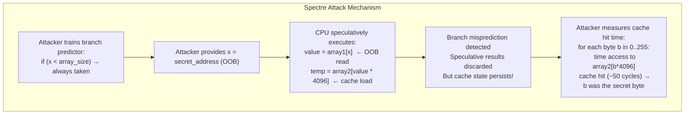

**Mitigation LFENCE**: Inserting `LFENCE` after bounds check prevents speculative execution of OOB access. **Retpoline** replaces indirect branches (jmp [rax]) with a return-based trampoline that confuses the branch predictor, preventing BTI (branch target injection).

---

## 12. Zero-Knowledge Proofs: Proving Without Revealing

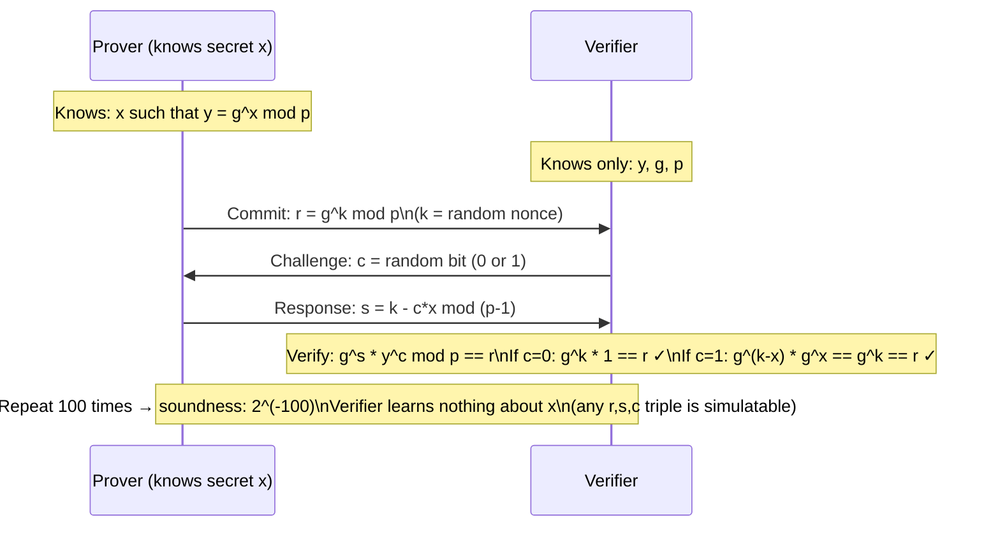

**zk-SNARKs** (used in ZCash, Ethereum): The prover knows a witness `w` satisfying a circuit `C(x, w) = 1`. The proof size is O(1) (a few hundred bytes) and verification is O(1) regardless of circuit complexity. This enables verifying blockchain transactions without revealing amounts.

---

## 13. Key Exchange Summary: What Actually Happens in Every HTTPS Connection

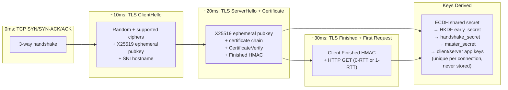

---

## Security Properties Cross-Reference

| Threat | Mechanism | Defense |
|---|---|---|
| Brute force password | Fast hash (SHA-256) | Memory-hard hash (Argon2id) |
| MITM interception | No authentication | TLS certificate chain verification |
| Traffic replay | Reuse captured token | Nonce/timestamp in token, short TTL |
| Buffer overflow | strcpy without bounds | Bounds-checked APIs, ASLR+NX+Canary |
| SQL injection | String concatenation | Parameterized queries |
| Use-after-free | C/C++ manual memory | Rust borrow checker, ASan |
| Cache timing (Spectre) | Speculative execution | LFENCE, retpoline, site isolation |
| CSRF | Cross-origin state-changing request | SameSite cookie, CSRF token |
| XSS | Unsanitized HTML output | Content Security Policy, output encoding |
| Downgrade attack | TLS version negotiation | TLS_FALLBACK_SCSV, HSTS preload |
