# Systems Programming Internals: Memory Models, Syscalls & Concurrency Primitives

> Under the Hood: How the CPU memory model orders stores/loads, how system calls cross the user/kernel boundary, how mutexes and futexes implement blocking in the kernel, how Rust's borrow checker enforces memory safety at compile time, how POSIX threads map to kernel scheduler entities.

---

## 1. CPU Memory Model: Store/Load Ordering

Modern CPUs reorder memory operations for performance. The programmer's sequential mental model does not match hardware reality.

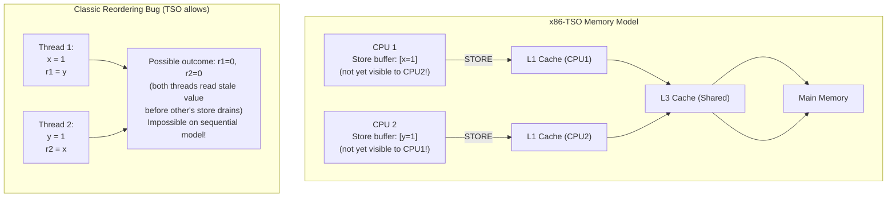

### Memory Fences and Barriers

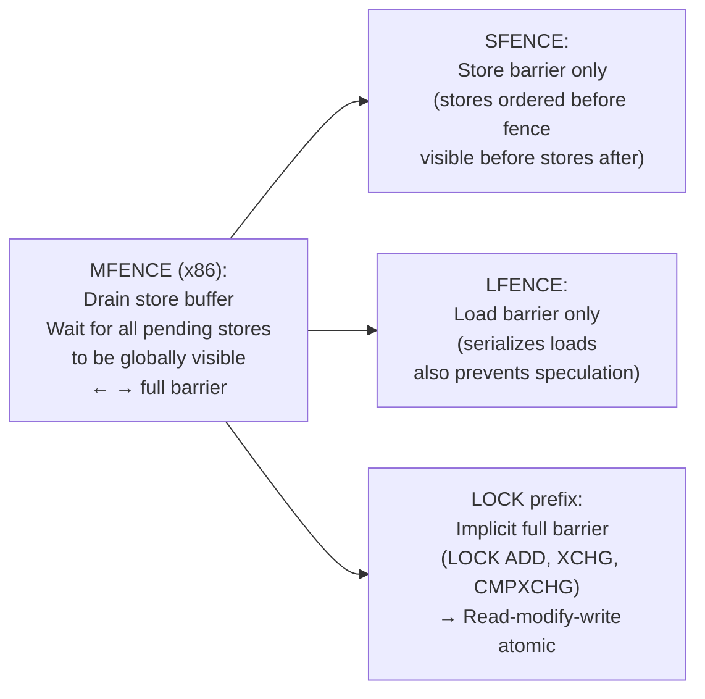

---

## 2. System Call: User Space → Kernel Crossing

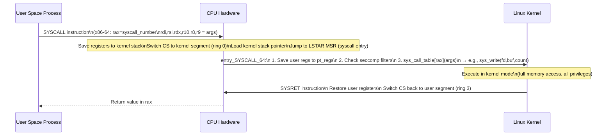

### vDSO: Avoiding Syscall Overhead

For frequently called syscalls with no side effects (gettimeofday, clock_gettime), Linux maps kernel code directly into user process address space via **vDSO** (virtual Dynamic Shared Object):

```
gettimeofday() call in user space:
  NORMAL: SYSCALL → kernel → read clock → SYSRET (~100ns)
  vDSO:   Call vDSO function directly (no ring switch!)
          Reads time from shared memory page (mapped by kernel)
          ~10ns — 10× faster
```

---

## 3. Mutex Implementation: Futex

A futex (fast userspace mutex) avoids syscalls in the uncontended case:

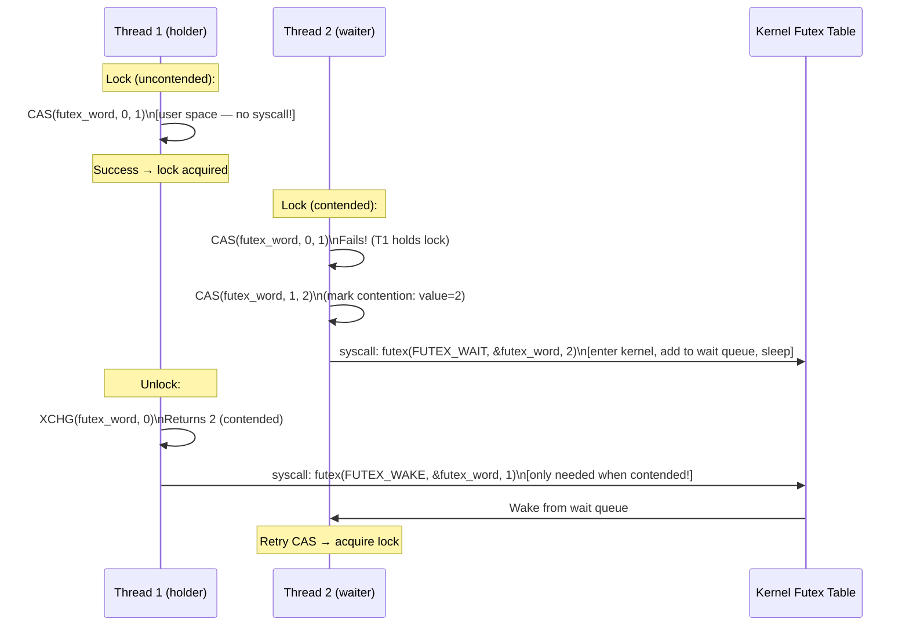

**Fast path**: Lock/unlock with no waiters = 1 atomic CAS + 0 syscalls.  
**Slow path**: Only when contended, syscall enters kernel to sleep/wake.

### Spinlock vs Mutex Tradeoff

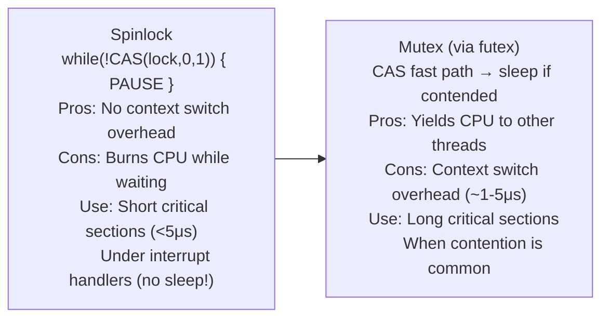

---

## 4. Rust Borrow Checker: Ownership Rules at Compile Time

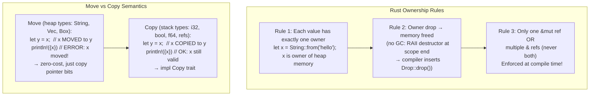

### Lifetime Annotations: Borrow Scope Enforcement

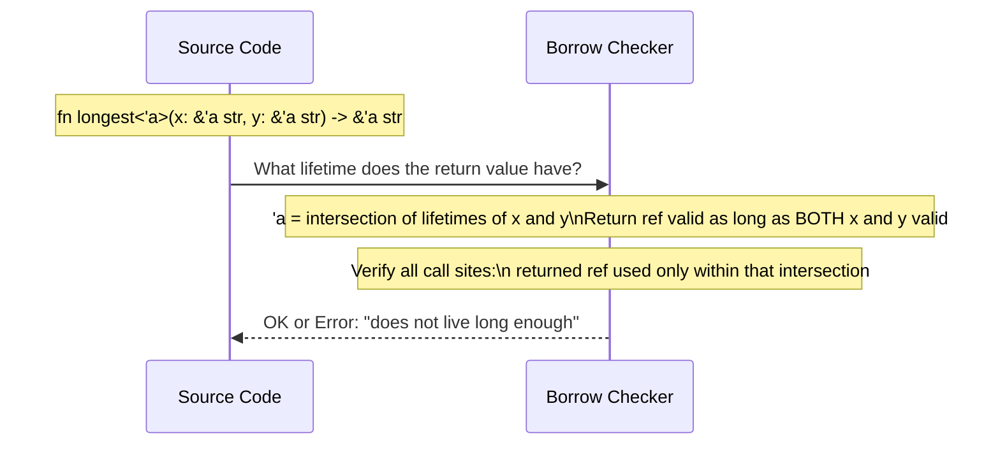

**Borrow checker eliminates at compile time**:
- Use-after-free: owner dropped while borrow exists → compile error
- Data races: `&mut` reference while any other reference active → compile error
- Dangling references: reference to value that left scope → compile error

---

## 5. POSIX Threads: Kernel Mapping and Scheduling

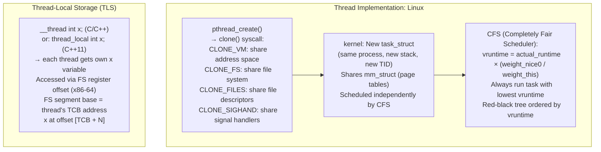

### Context Switch: What Gets Saved

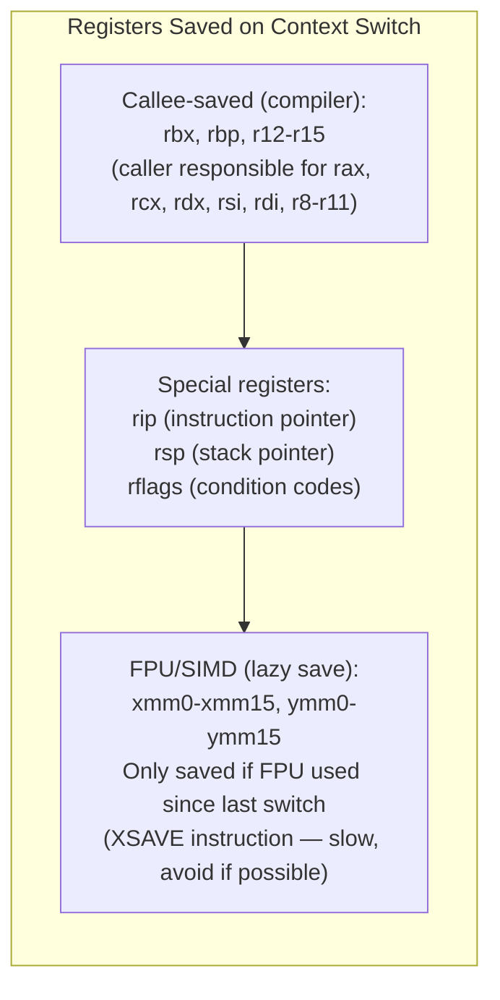

---

## 6. Memory Allocator Internals: glibc malloc

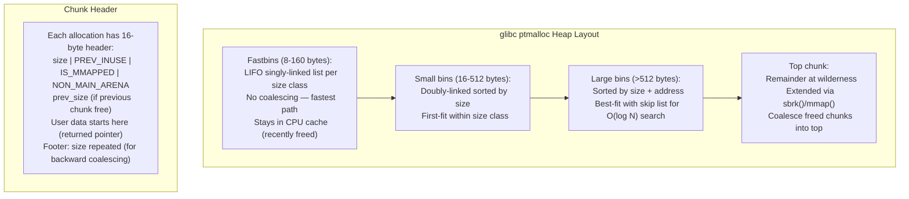

### TCMalloc: Thread-Caching for Low Contention

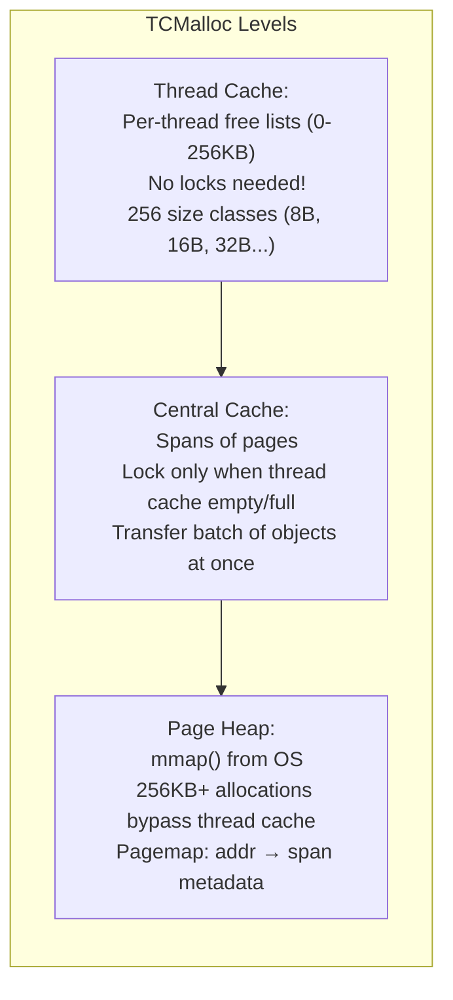

---

## 7. POSIX File I/O: Kernel Paths

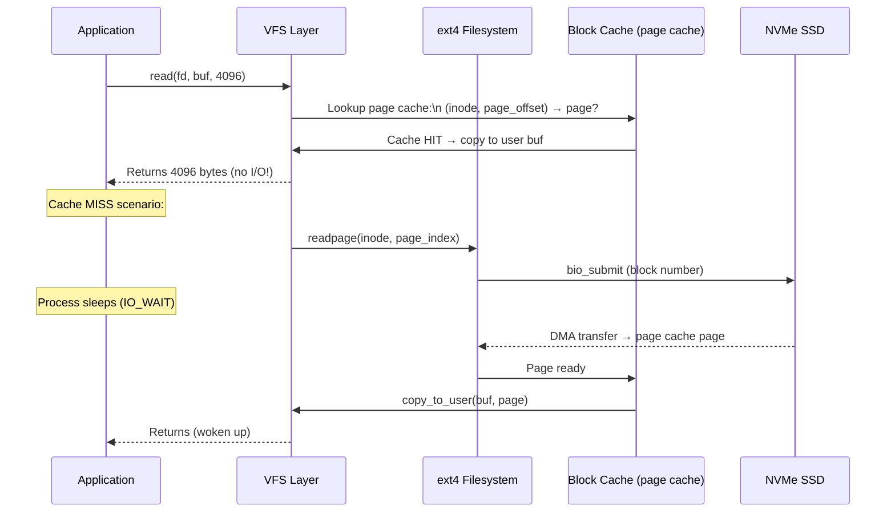

### O_DIRECT: Bypassing Page Cache

```c
// O_DIRECT: bypass page cache entirely
fd = open("data.bin", O_RDWR | O_DIRECT);
// Requires aligned buffer (aligned to 512 or 4096 bytes)
// Transfers directly: user_buf ↔ disk (via DMA)
// Used by: databases (manage their own cache)
//          backup tools (avoid evicting hot pages)
```

---

## 8. Signal Handling: Delivery and Async-Safety

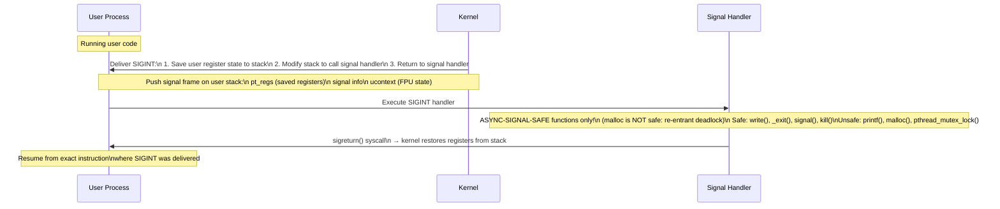

---

## 9. NUMA Architecture: Memory Locality

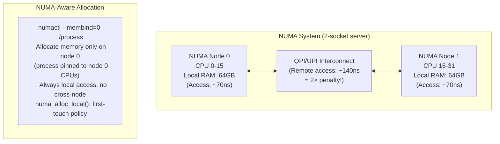

---

## Summary: Systems Programming Primitives

| Primitive | Implementation | Kernel Involvement |
|---|---|---|
| Mutex lock (uncontended) | CAS in user space | None (fast path) |
| Mutex lock (contended) | futex(FUTEX_WAIT) | Yes — process blocked |
| Thread create | clone(CLONE_VM\|...) | Yes — new task_struct |
| Context switch | save regs, load regs | Yes — CFS scheduler |
| Memory alloc (<256B) | Thread cache LIFO | None (tcmalloc) |
| Memory alloc (large) | mmap(MAP_ANON) | Yes — page table update |
| File read (cached) | copy from page cache | Minimal |
| File read (uncached) | bio submit + sleep | Yes — I/O scheduler |
| Signal delivery | Modify stack → handler | Yes — return to usermode |
| System call | SYSCALL instruction | Yes — ring 0 transition |
