# Web & Frontend Internals: Browser Engine, JavaScript Runtime & React Reconciliation

> Under the Hood: How a browser parses HTML into a render tree, how the JavaScript event loop processes microtasks and macrotasks, how React's reconciler diffs virtual DOM trees, how V8 JIT-compiles hot functions — the exact pipelines, data structures, and scheduling mechanics behind modern web development.

---

## 1. Browser Rendering Pipeline: Critical Path

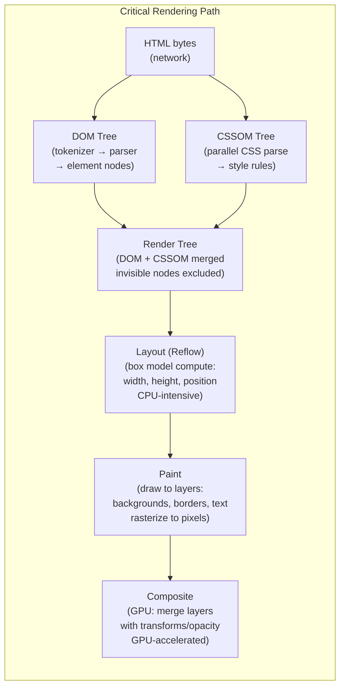

### HTML Tokenizer State Machine

The HTML tokenizer is a state machine with ~80 states. It cannot simply regex-parse HTML due to context-sensitive rules:

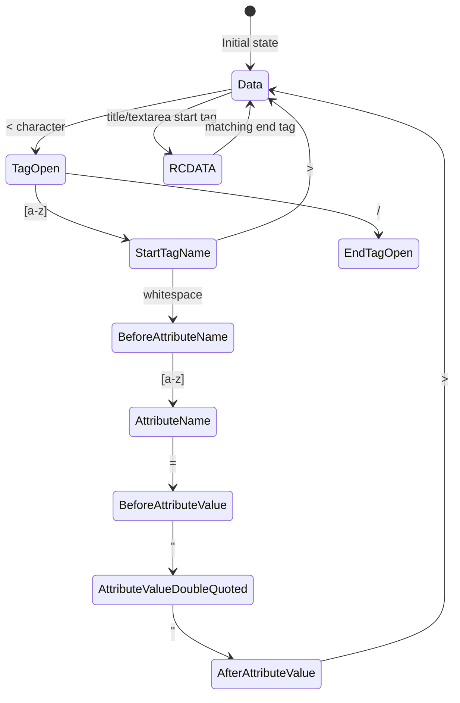

**Script blocking**: When the parser encounters a `<script>` tag (without `async`/`defer`), it **pauses HTML parsing**, executes the script (which may modify the DOM), then resumes. This is why `<script>` at the end of `<body>` is critical for performance.

---

## 2. JavaScript Event Loop: Microtask vs Macrotask

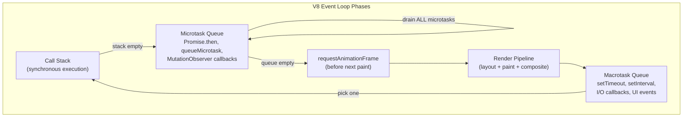

### Microtask Starvation Example

```javascript
// This BLOCKS rendering indefinitely:
function infiniteMicrotasks() {
    Promise.resolve().then(infiniteMicrotasks);
    // Microtask queue never empties → RAF never runs → page freezes
}

// Correct: yield to macrotask queue
function yieldToRender(callback) {
    setTimeout(callback, 0);  // or: scheduler.postTask()
}
```

### Promise Internal State Machine

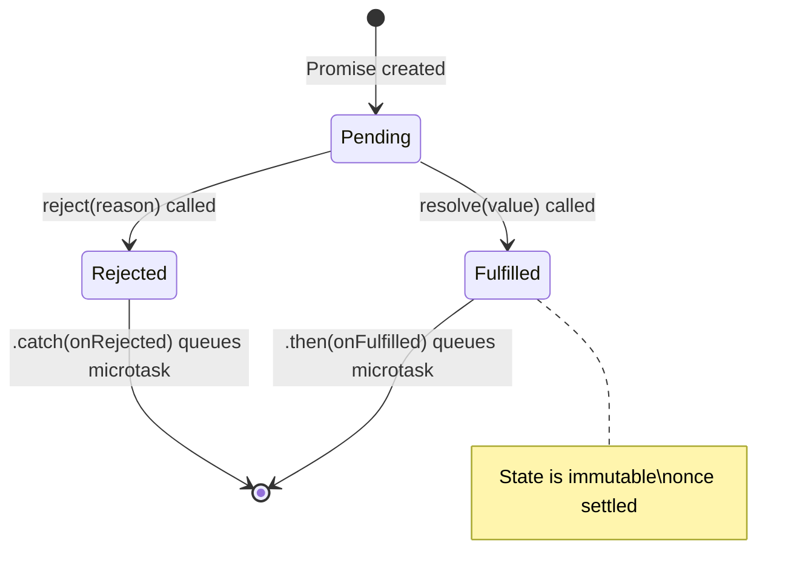

---

## 3. V8 JIT Compilation Pipeline

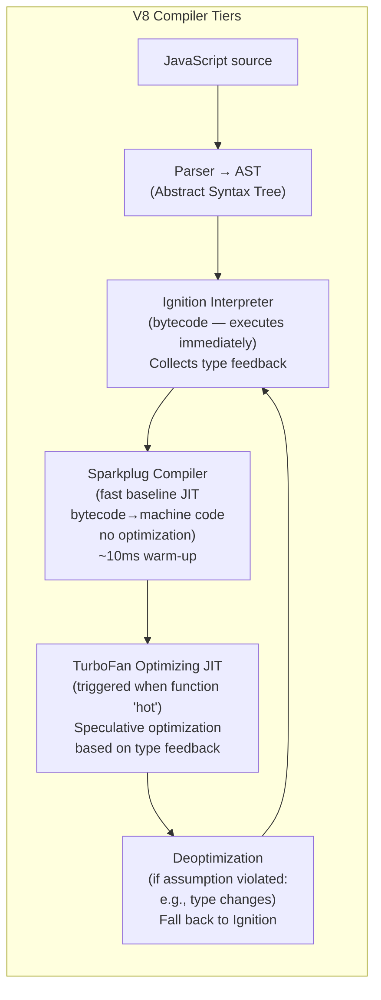

### TurboFan Speculative Optimization

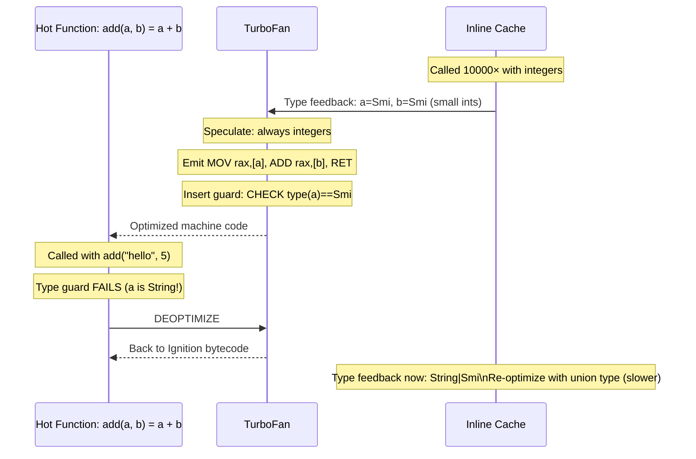

### Hidden Classes (Shapes/Maps)

V8 optimizes property access by assigning a **hidden class** (shape) to objects with the same property layout:

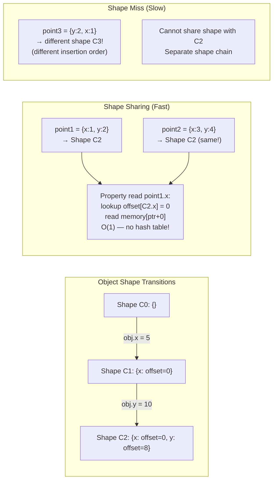

---

## 4. React Reconciliation: Fiber Architecture

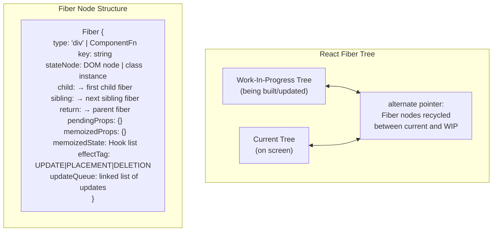

### Reconciliation: Diffing Algorithm

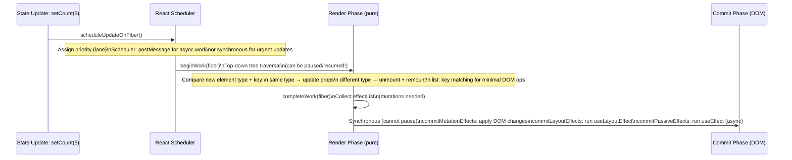

### Concurrent Mode: Time Slicing

React 18 Concurrent Mode uses the **scheduler** to break rendering work into 5ms slices:

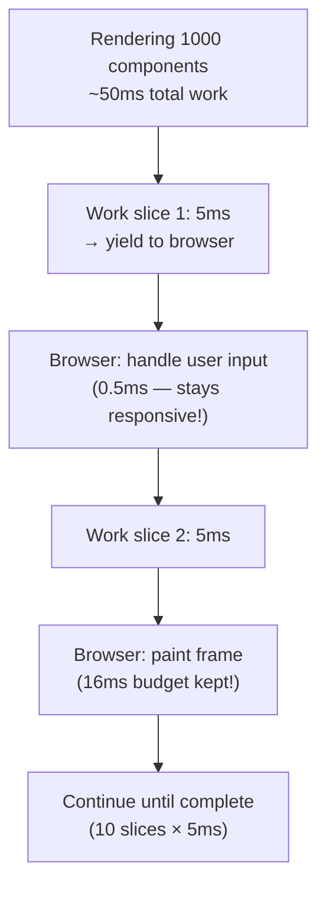

---

## 5. Virtual DOM Diffing: Key Algorithm

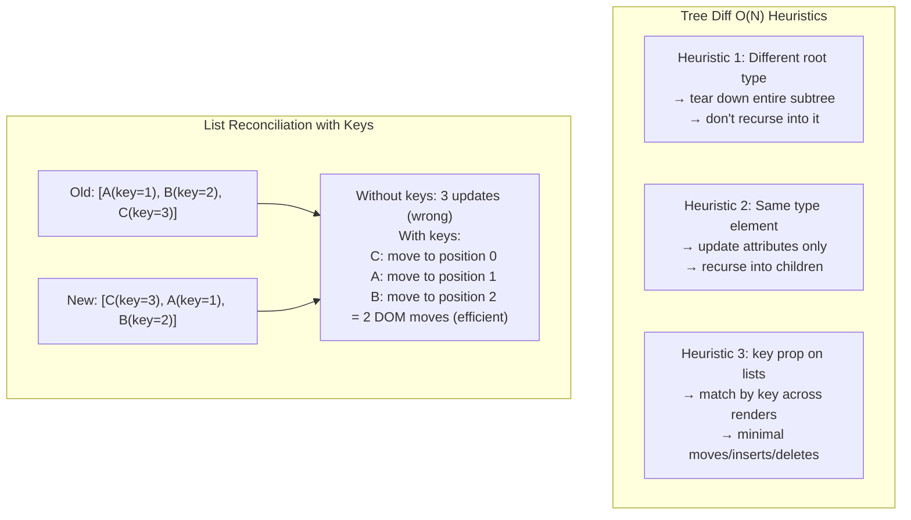

---

## 6. CSS Cascade and Specificity Computation

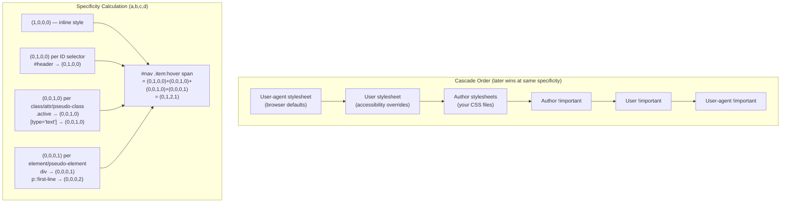

---

## 7. Web Performance: Critical Resource Loading

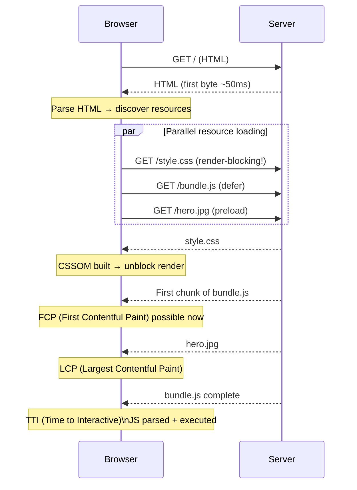

### Core Web Vitals Internal Triggers

| Metric | Trigger | Measurement |
|---|---|---|
| LCP | Largest image/text block painted | `PerformanceObserver` type `largest-contentful-paint` |
| FID/INP | Input event → browser response delay | `PerformanceEventTiming.processingStart - startTime` |
| CLS | Layout shift: element moves without user interaction | `LayoutShift.value = impact_fraction × distance_fraction` |

---

## 8. Service Workers: Fetch Interception Internals

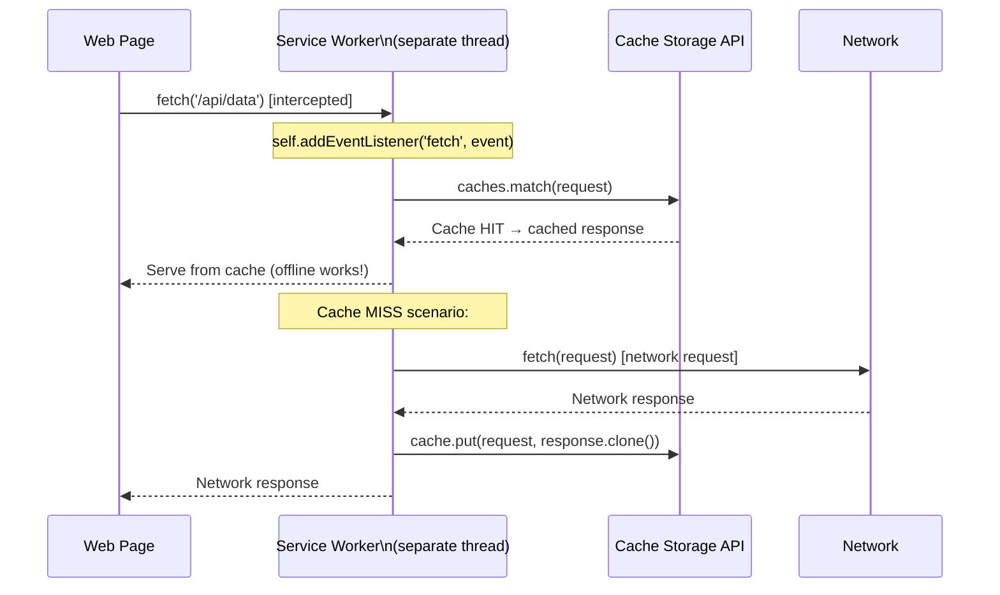

**Service Worker lifecycle** — separate from page, persists across page loads:
```
Install → Activate → Idle → Fetch/Message
(new SW waits for old clients to close before activating)
```

---

## 9. WebAssembly: Execution Model

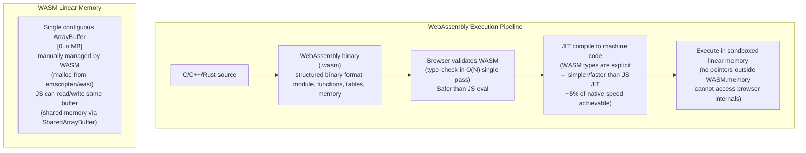

---

## 10. HTTP/2 Multiplexing and Head-of-Line Blocking

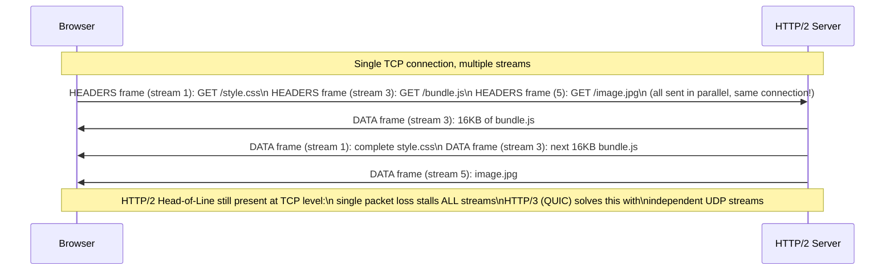

---

## 11. WebSocket: Frame Protocol Internals

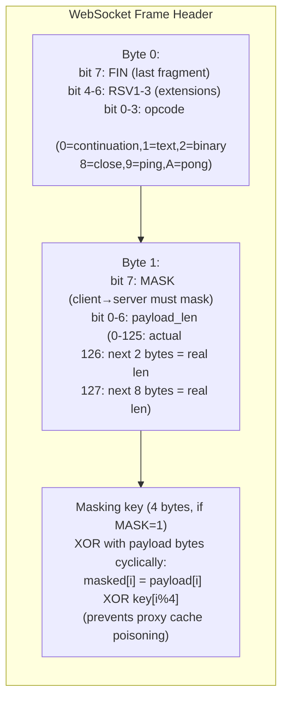

---

## Frontend Architecture Summary

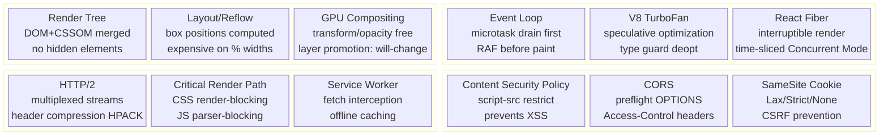
