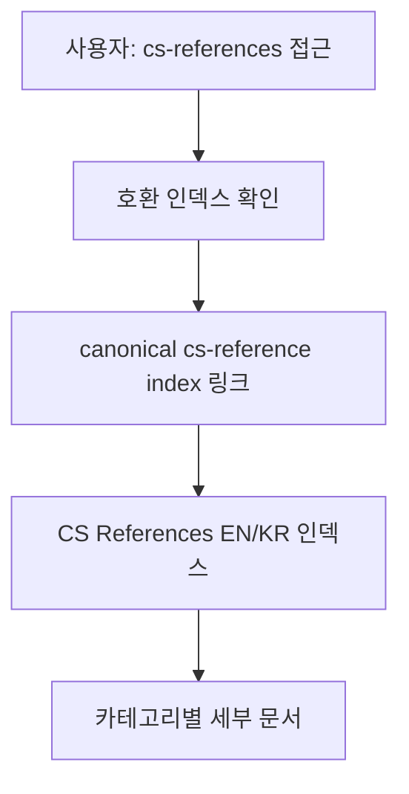
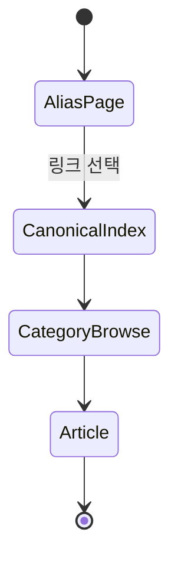

# CS References Redirect 인덱스 학습 및 기록 노트

## 1. 왜 필요한가? (Pain Point & Motivation)

`cs-references` 경로는 실제 문서 본문을 담기보다 `cs-reference` 인덱스로 사용자를 안내하는 호환 경로다. 비슷한 이름의 디렉터리가 함께 있을 때 어느 쪽이 실제 카테고리 인덱스인지 명확하지 않으면 탐색과 링크 유지보수가 어려워진다.

이 문서는 `cs-references` 인덱스의 역할을 redirect/alias 관점으로 정리한다.

## 2. 현재 나의 상태 (Baseline)

- `content/docs/books/cs-reference/index.md`가 실제 CS reference 인덱스라는 점을 확인해야 한다.
- `cs-references`는 독립 카테고리라기보다 이전 링크나 복수형 경로를 위한 안내 문서로 보인다.
- 이 파일은 목록을 중복 관리하지 않고 canonical index로 보내야 한다.

## 3. 도달하고 싶은 목표 (Target State)

- 이 경로가 실제 콘텐츠 소스가 아니라 안내 경로임을 분명히 한다.
- 사용자가 한국어/영어와 카테고리 필터를 보려면 canonical index로 이동해야 함을 알린다.
- 중복된 문서 목록을 만들지 않아 향후 링크 drift를 줄인다.

## 4. 시스템 번역 (Data Flow)

이 파일의 data flow는 문서 내용을 직접 제공하는 것이 아니라 canonical index로 진입점을 연결하는 것이다.

## 5. 핵심 구성요소 (Building Blocks)

| 구성요소 | 역할 | 유지 원칙 |
| --- | --- | --- |
| `cs-references` 경로 | 복수형 경로 호환 | 실제 목록을 중복하지 않는다 |
| Canonical link | 실제 인덱스 연결 | `../cs-reference/index.md`를 가리킨다 |
| CS reference index | 언어/카테고리별 탐색 | 본문 목록의 단일 관리 지점 |
| 안내 문장 | 사용자 혼란 방지 | 경로의 목적을 짧게 설명한다 |

## 6. 상태 전이 (State Transition)

`cs-references`는 사용자가 실제 CS reference 인덱스로 이동하기 전 거치는 alias 상태다.

## 7. 불변식 (Invariant: 절대 깨지면 안 되는 규칙)

- 이 문서는 실제 CS reference 목록을 중복 관리하지 않는다.
- Canonical index 링크는 `../cs-reference/index.md`를 가리켜야 한다.
- 인덱스 역할과 링크 목적이 본문에서 드러나야 한다.
- 경로 호환 문서는 사용자를 막다른 페이지에 남겨두면 안 된다.

## 8. 가장 작은 예제 (Minimal Viable Example)

[CS References (EN/KR) 인덱스 바로가기](../cs-reference/index.md)

이 링크 하나가 이 파일의 핵심 기능이다. 사용자는 복수형 경로에 들어와도 실제 CS reference 인덱스로 이동할 수 있다.

## 9. 실패 사례 (What could go wrong?)

- `cs-reference`와 `cs-references` 양쪽에 목록을 따로 작성해 문서가 서로 달라진다.
- Canonical link가 깨져 사용자가 실제 인덱스로 이동하지 못한다.
- 이 파일이 독립 카테고리처럼 보이지만 내용은 거의 없어 탐색 흐름이 끊긴다.
- 향후 파일 이동 시 redirect 성격을 잊고 삭제해 기존 링크가 깨진다.

## 10. 뇌 확장하기 (Evolution & Variants)

- 실제 문서 목록은 `cs-reference/index.md`에서만 관리한다.
- 필요하다면 빌드 시스템의 redirect 기능이나 frontmatter alias로 옮길 수 있다.
- 비슷한 복수형/단수형 경로가 더 있으면 같은 원칙으로 canonical path를 정한다.

## 11. 최종 체크리스트 (Definition of Done)

- [x] `cs-references`가 안내/호환 경로임을 설명했다.
- [x] Canonical index 링크를 유지했다.
- [x] 문서 목록을 중복 작성하지 않았다.
- [x] 경로 drift와 broken link 실패 사례를 정리했다.

## 12. 뇌에 새기는 복습 문장 (TL;DR Blank)

`cs-references`는 새 콘텐츠 저장소가 아니라 `cs-reference` 인덱스로 이어지는 호환 진입점이다.
