# Consul Service Mesh Internals: Under the Hood

> Sources: Consul Tutorial (TutorialsPoint, 2017)

---

## 1. What Consul Actually Is: A Distributed Systems Coordination Plane

Consul is a **Go binary** that simultaneously acts as:
- A **service registry** (who is alive, where is it, is it healthy?)
- A **distributed KV store** (Raft-replicated, strongly consistent)
- A **gossip membership system** (who belongs to this cluster?)
- A **DNS server** (resolve `service.consul` to healthy pod IPs)
- A **service mesh control plane** (intention-based mTLS authorization)

All of these are embedded in a single binary with no external dependencies (no ZooKeeper, no etcd, no external database).

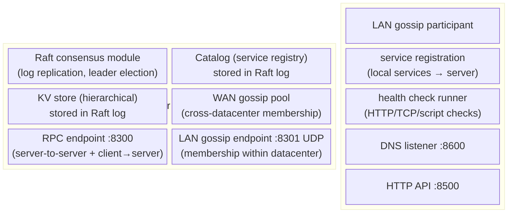

---

## 2. Raft Consensus: How Consul Achieves Strong Consistency

Consul's servers use **Raft** (Hashicorp's own Go implementation) to maintain a replicated state machine. Every write to the catalog or KV store must go through the Raft log.

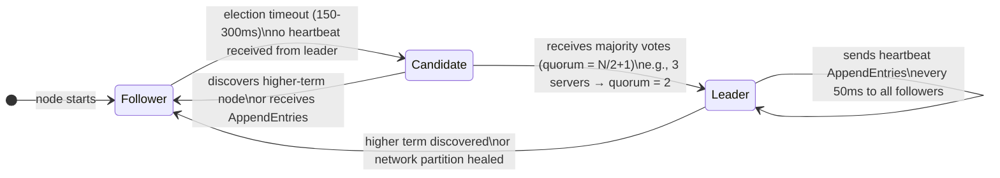

### Raft Log Entry Lifecycle

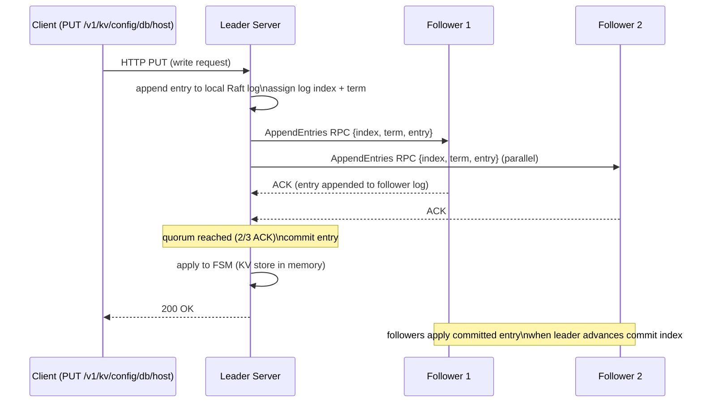

**Quorum requirement**: 3-server cluster tolerates 1 failure; 5-server tolerates 2 failures. Even number of servers should be avoided — with 4 servers, quorum = 3 same as with 3 servers, but 4 nodes must fail (network partition) to lose quorum — no improvement over 3.

### CAP Theorem Tradeoff

Consul chooses **CP** (Consistency + Partition Tolerance) over Availability:
- During a network partition, the minority partition becomes **unavailable** — reads return errors rather than stale data
- For **stale reads** (eventual consistency), `?stale` query parameter skips leader forwarding — followers answer locally but may return data up to `max_stale` seconds old

---

## 3. Gossip Protocol: Membership and Failure Detection

Consul uses **Serf** (a separate Hashicorp library) for gossip-based membership. Serf implements **SWIM** (Scalable Weakly-consistent Infection-style Process Group Membership).

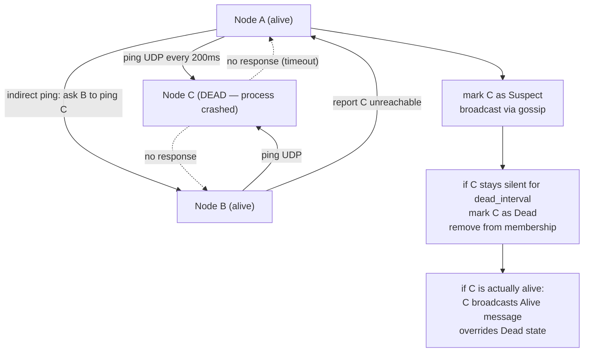

**Gossip dissemination**: each node, every gossip interval, picks `k` random peers (fanout) and sends the full list of recent member state changes (piggybacked on health pings). Information spreads in O(log N) rounds — exponential fan-out ensures cluster-wide convergence.

### LAN vs WAN Gossip Pools

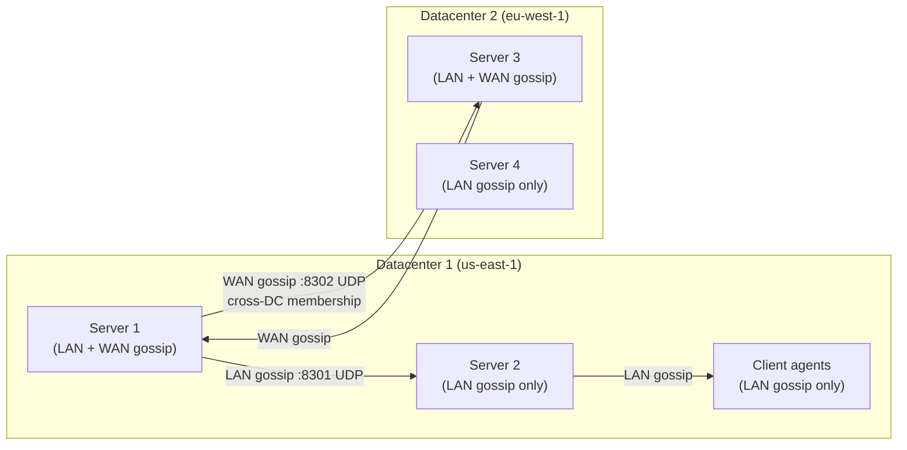

WAN gossip pool has **only server nodes** — clients never participate in WAN gossip. This bounds WAN gossip load to O(servers) regardless of cluster size.

---

## 4. KV Store Internal Structure

The Consul KV store is a **hierarchical path-based key-value store** backed by the Raft log. Every entry is a `KVPair` struct:

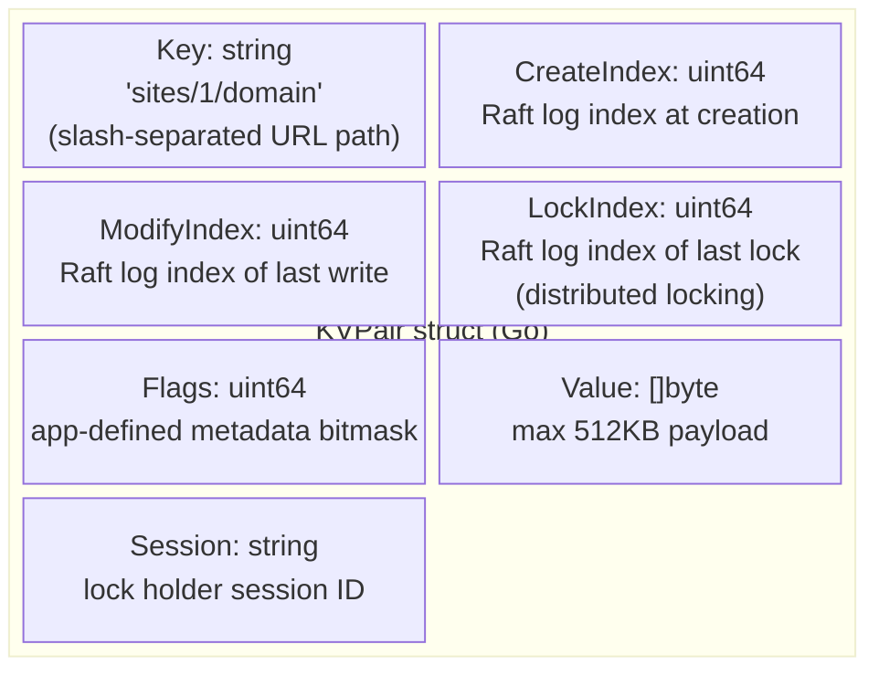

### Watch Mechanism: Blocking Queries

Consul KV supports **blocking queries** — long-polling via `?index=N&wait=Xs`. The client sends its last known `ModifyIndex`; the server holds the connection open until the index advances (a write occurs) or timeout:

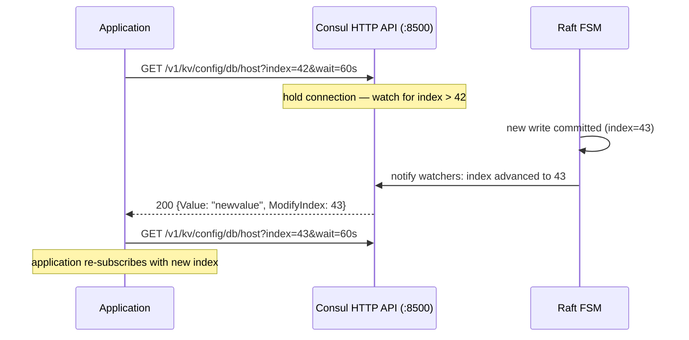

This enables **zero-latency config updates** without polling overhead — the HTTP connection blocks until something changes.

---

## 5. Service Registry: Catalog Architecture

The **catalog** is Consul's service registry — a Raft-replicated data structure mapping service names to healthy endpoint addresses.

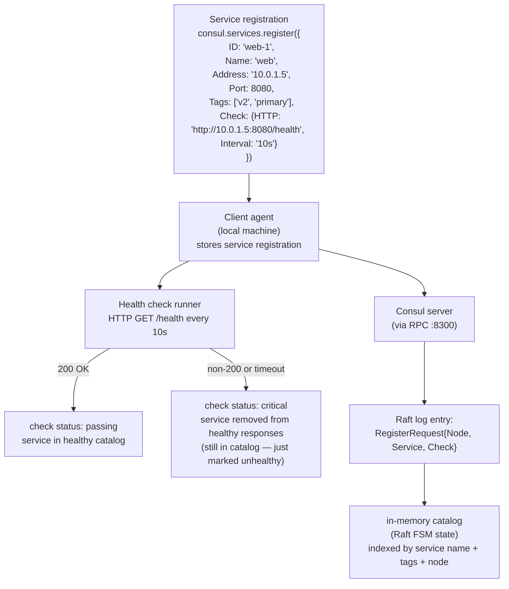

### Health Check Types

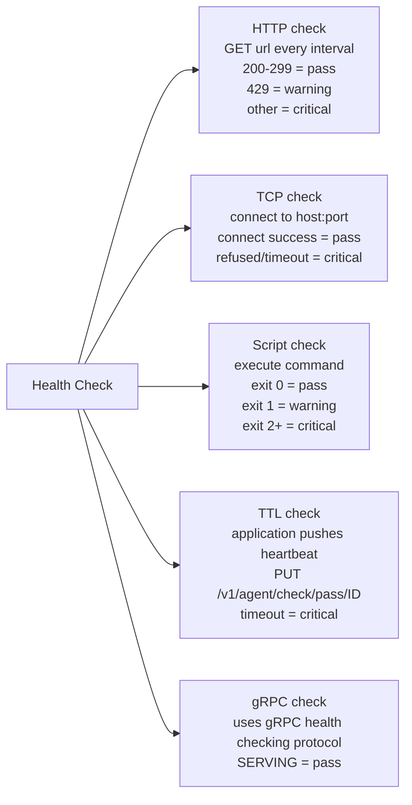

---

## 6. DNS Interface: Service Discovery via DNS

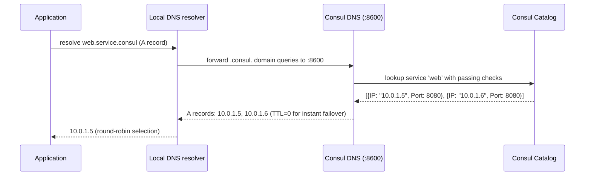

**DNS query patterns**:
- `web.service.consul` → A records for all healthy instances of `web`
- `web.service.dc2.consul` → instances in datacenter `dc2`
- `primary.web.service.consul` → instances tagged `primary`
- `_web._tcp.service.consul` → SRV records (includes port)

**TTL=0**: Consul sets DNS TTL to 0 by default so clients re-query on every connection — this ensures failed services are immediately excluded (at the cost of more DNS queries). Configurable via `dns_config.service_ttl`.

---

## 7. Multi-Datacenter Architecture: WAN Federation

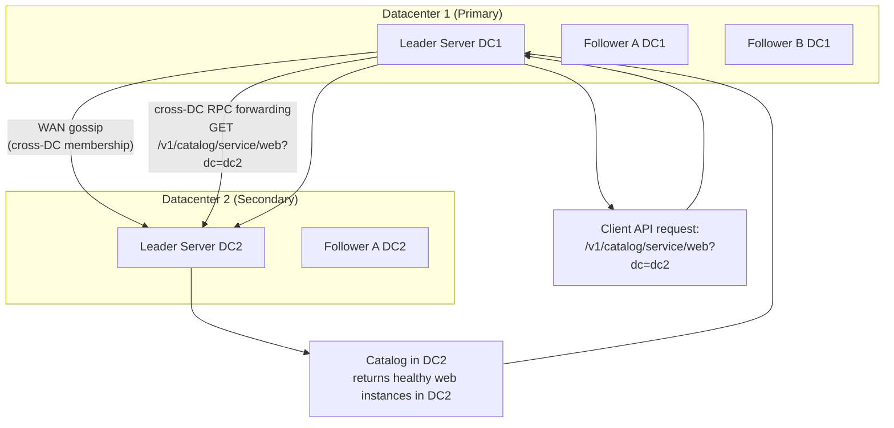

Each datacenter runs its **own independent Raft cluster** — there is no cross-DC replication of catalog data. Cross-DC queries are forwarded via **WAN RPC**: DC1 leader forwards the request to DC2 leader, which answers from its local catalog. This means cross-DC reads are strongly consistent within DC2 but involve WAN latency.

### Failover Ordering

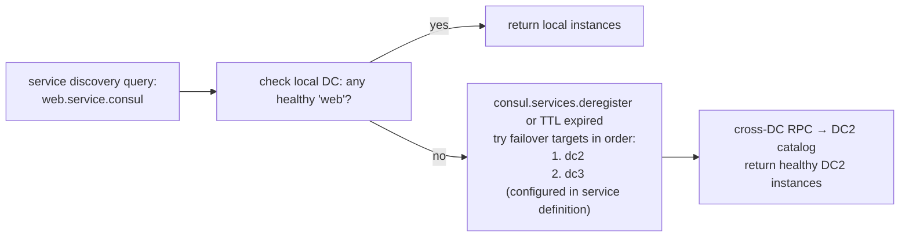

---

## 8. Session Locks: Distributed Mutex via Raft

Consul sessions enable **distributed leader election** and **service locking** built on top of the KV store:

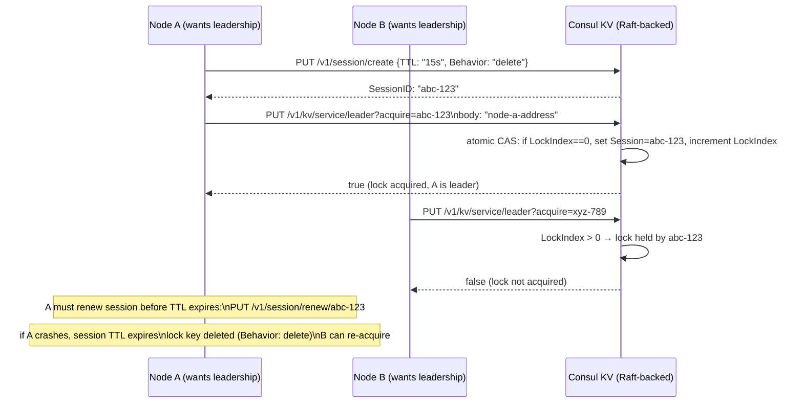

This pattern is used by Vault (Hashicorp), Nomad, and custom services for **leader election without external coordination**.

---

## 9. Consul Connect: Service Mesh mTLS Internals

Consul Connect extends service discovery into a **service mesh** — each service gets a **sidecar proxy** (Envoy) with automatically provisioned mTLS certificates:

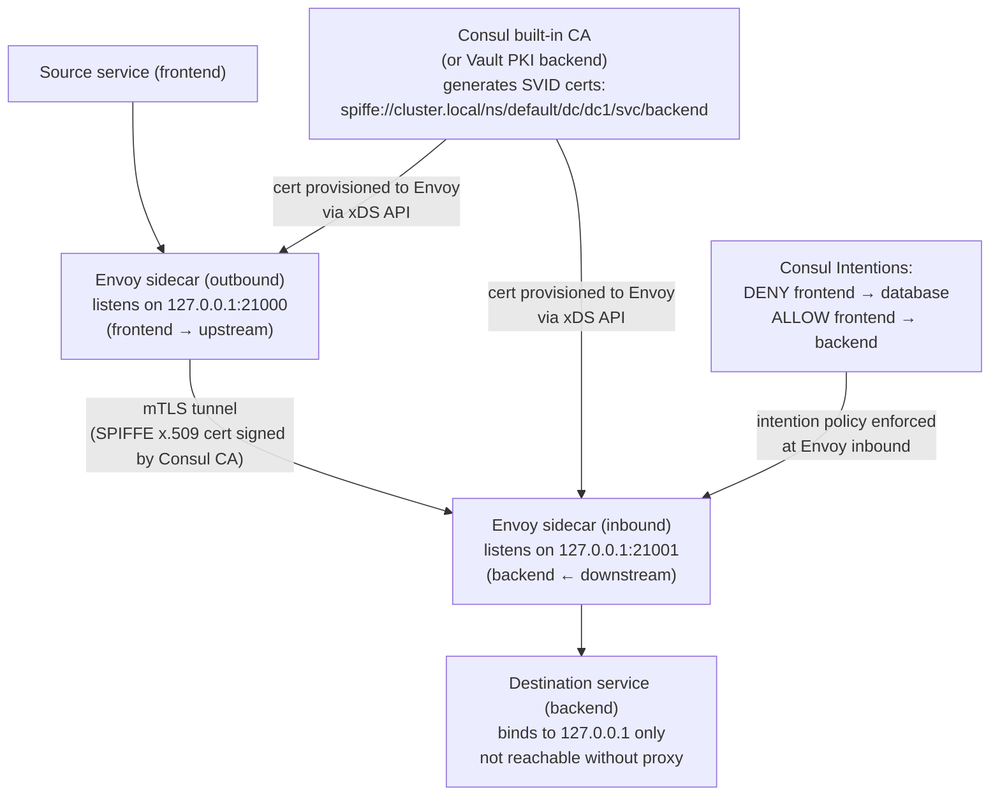

**SPIFFE** (Secure Production Identity Framework for Everyone): each service identity is a URI SAN in the x.509 cert — `spiffe://cluster.local/svc/backend`. The CA is Consul's own PKI (or Vault) — certificates are auto-rotated before expiry via the xDS protocol.

---

## 10. Watch System: Event-Driven Configuration Updates

Consul watches allow processes to react to changes without polling:

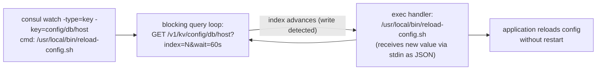

**Watch types**:
- `key` — single KV key change
- `keyprefix` — any key under a prefix (e.g., `config/app/`)
- `services` — catalog: service list changes (new services registered/deregistered)
- `service` — specific service health changes
- `nodes` — cluster membership changes
- `checks` — health check status changes
- `event` — Consul user events (distributed pub/sub)

---

## 11. Snapshot and Restore: Raft State Serialization

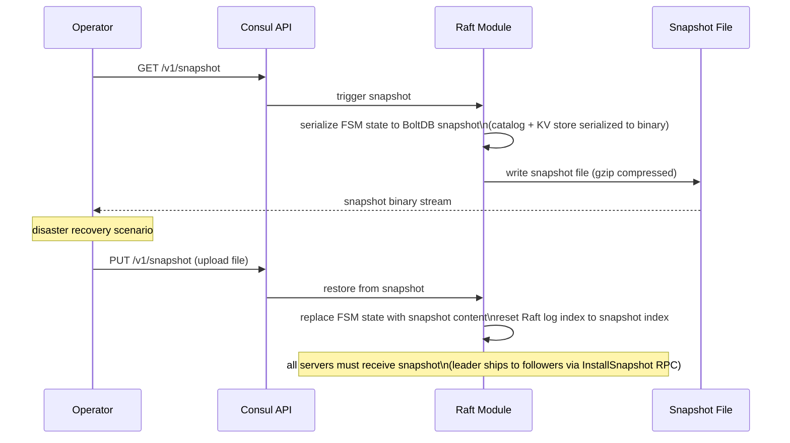

---

## 12. Comparison: Consul vs etcd vs ZooKeeper

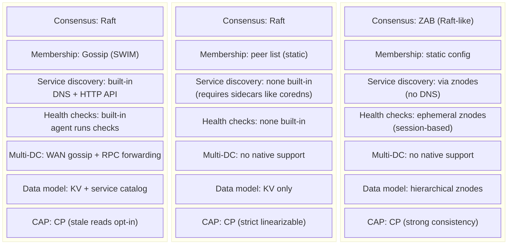

---

## 13. Full Data Flow: Service Registration to DNS Resolution

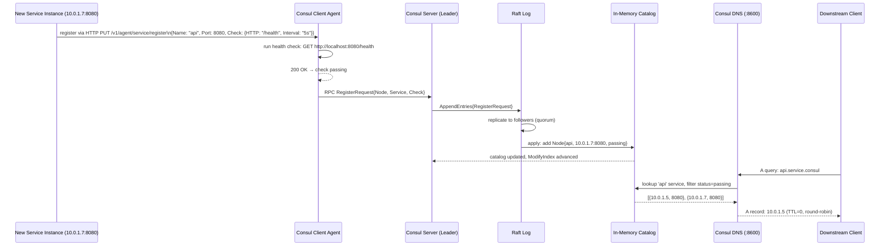

---

## 14. Failure Scenarios and Recovery

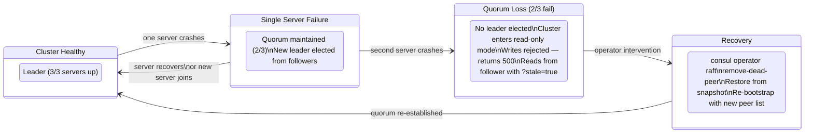

---

## Summary: Consul Internal Data Path

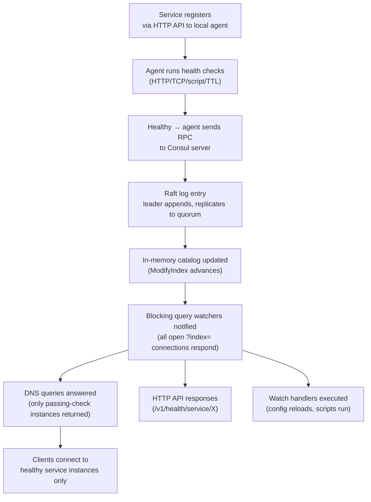

Every piece of Consul's distributed coordination — from service health to config distribution to leader election — flows through this same Raft-gossip-catalog pipeline. The Raft log is the single source of truth; gossip provides failure detection without burdening the Raft leader; and the blocking query system turns the catalog into a push-based event stream.
