# Docker & Kubernetes Internals: Under the Hood

> Sources: CI/CD with Docker and Kubernetes (Semaphore), Everything Kubernetes (Stratoscale), Docker and Kubernetes for Java Developers, Cloud Container Engine Kubernetes Basics (Huawei), Container Management: Kubernetes vs Docker Swarm vs Mesos vs Amazon ECS

---

> **Reading contract:** This overview is for engineers tracing container and Kubernetes control paths. It assumes Linux containers and must name Docker/BuildKit, OCI runtime, Linux/cgroup mode, Kubernetes, CRI, CNI, CSI, and kube-proxy implementation before its internals are treated as facts. Diagrams show common defaults, not every managed cluster or eBPF data plane. A rollout is complete only when the image digest, admitted object revision, Ready endpoints, observed traffic, SLO window, and rollback result are recorded. Pull, admission, scheduling, probe, or traffic failures require bounded retries and then rollback or escalation.

## 1. What Makes a Container: Linux Kernel Primitives

In the Linux model used here, a container is a group of processes isolated and constrained by kernel features while sharing the host kernel. Some products also offer VM-backed or Windows isolation, so "no hypervisor" is not a universal container property.

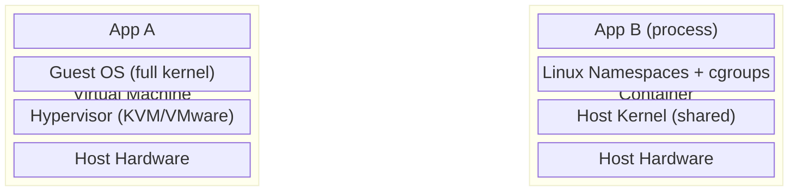

### Linux Namespaces — Isolation Boundaries

A container process can receive separate namespace views, but runtimes may share namespaces through host-network, host-PID, sidecar, or explicit namespace settings:

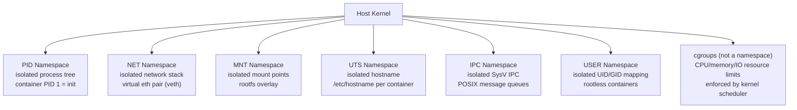

**cgroups** can enforce resource budgets. A 500m CPU limit represents half of one CPU's time averaged over the configured quota period, not permanent ownership of half a core. cgroup version, period, burst behavior, CPU set, and scheduler version determine throttling.

---

## 2. Docker Image Layers: OverlayFS Union Filesystem

Docker images are **content-addressed stacks of read-only layers** merged by OverlayFS (or AUFS on older systems) into a single unified view.

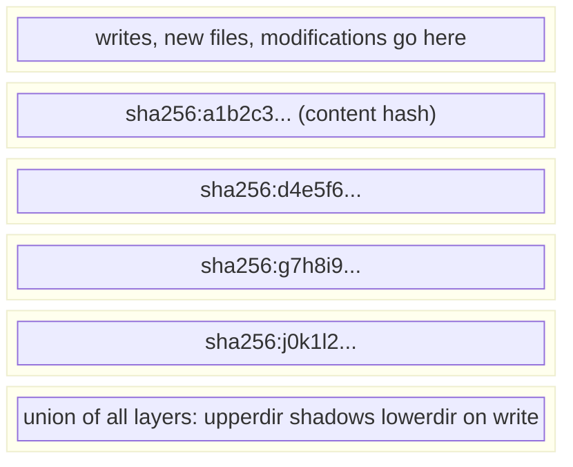

### Copy-on-Write (CoW) Semantics

When a container writes to a file that exists in a lower read-only layer:

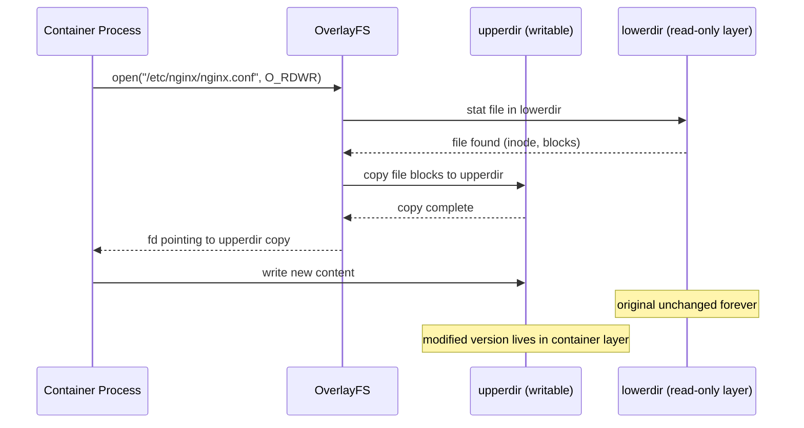

When the container is destroyed, upperdir is discarded. The lower layers (image) are immutable and shared across all containers using the same image — this is why 10 containers from the same image share layer storage.

### Build Cache Invalidation

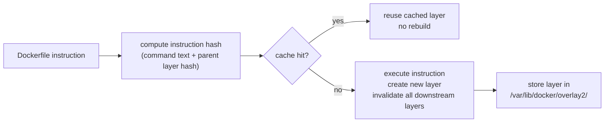

`COPY` instructions invalidate cache when file content changes (checksum comparison). This is why `COPY requirements.txt .` + `RUN pip install` should precede `COPY . .` — changing app source code won't re-run slow dependency installs.

---

## 3. Container Runtime Stack

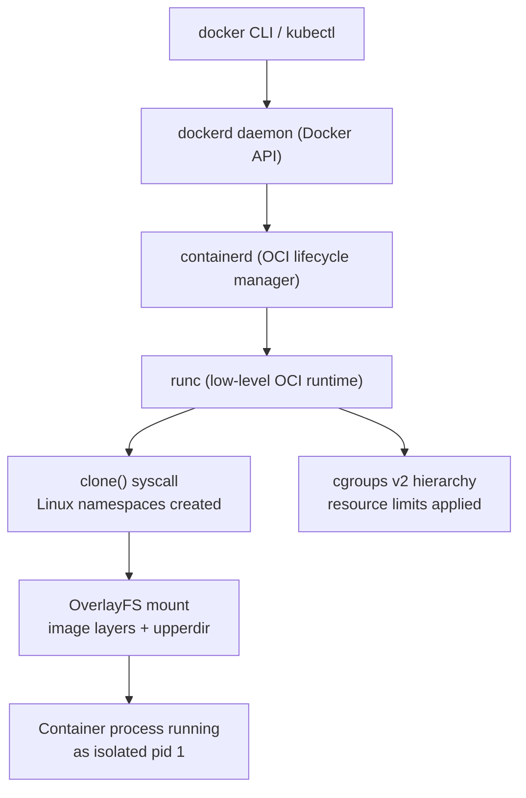

**containerd** manages image pulls (from registry), snapshot management (OverlayFS layers), and delegates actual process spawning to **runc** via the OCI runtime spec. Kubernetes communicates with containerd via the **Container Runtime Interface (CRI)** gRPC protocol.

---

## 4. Kubernetes Control Plane: Full Internal Flow

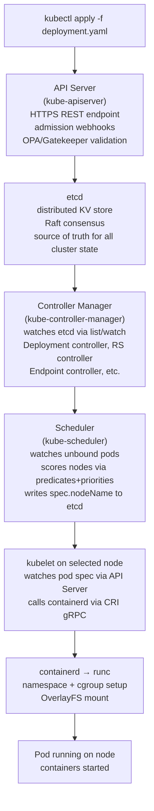

### Admission Webhook Chain

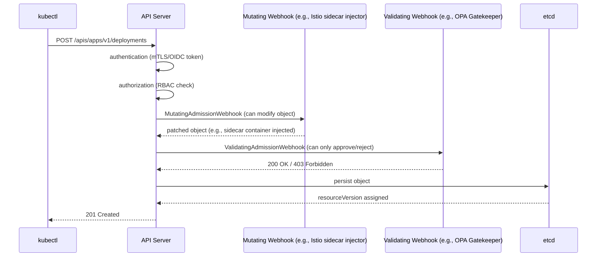

---

## 5. etcd: The Cluster's Single Source of Truth

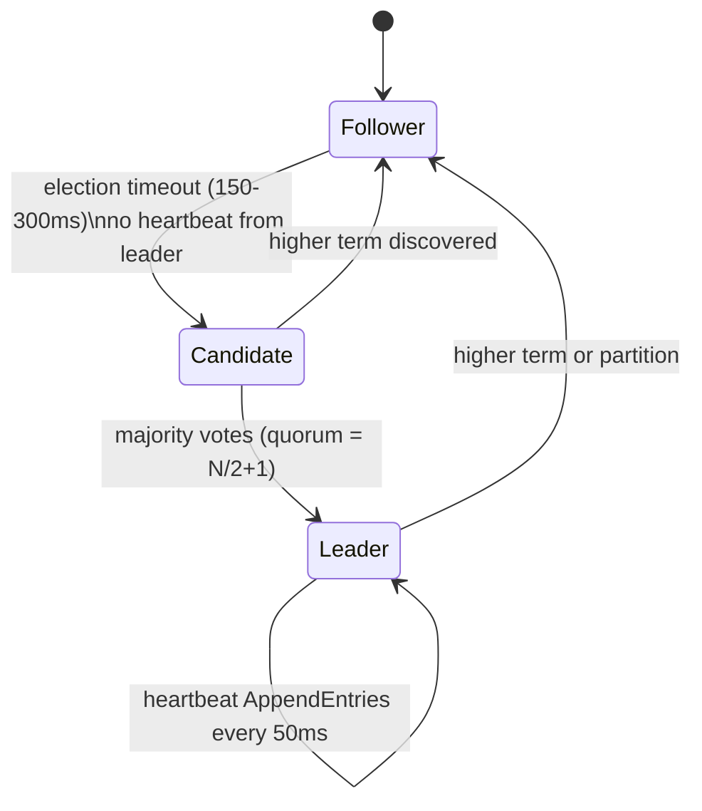

Kubernetes API objects are persisted through the API server to its configured storage, commonly etcd. Components consume API-server `list/watch` streams and may relist after expiration or disconnect; they do not receive raw etcd events directly. Reconciliation is level-based and must tolerate duplicate, delayed, and missed watch notifications.

---

## 6. ReplicaSet Label Selector Mechanics

A ReplicaSet does NOT track which pods it created by UUID. It performs a **label selector query** continuously:

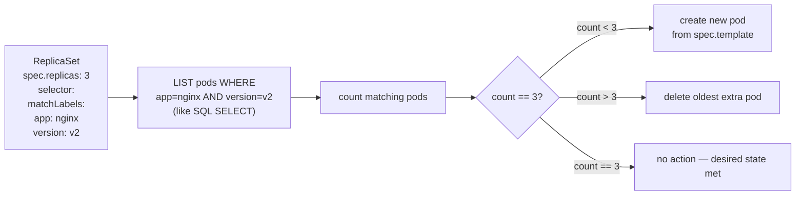

This label-based ownership means: if you **manually label** an unrelated pod with `app: nginx, version: v2`, the ReplicaSet will **adopt it** and potentially delete one of your intentional pods to maintain count=3.

---

## 7. Rolling Update: Deployment Controller State Machine

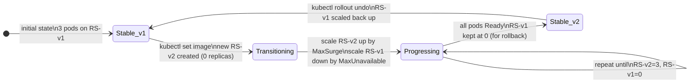

**MaxSurge=1, MaxUnavailable=0** (availability-oriented rollout configuration, not a zero-downtime guarantee):
- At no point can the total Ready pods drop below desired (3)
- One extra pod created (4 total briefly), then one old pod deleted
- Each new pod must pass readiness probe before proceeding

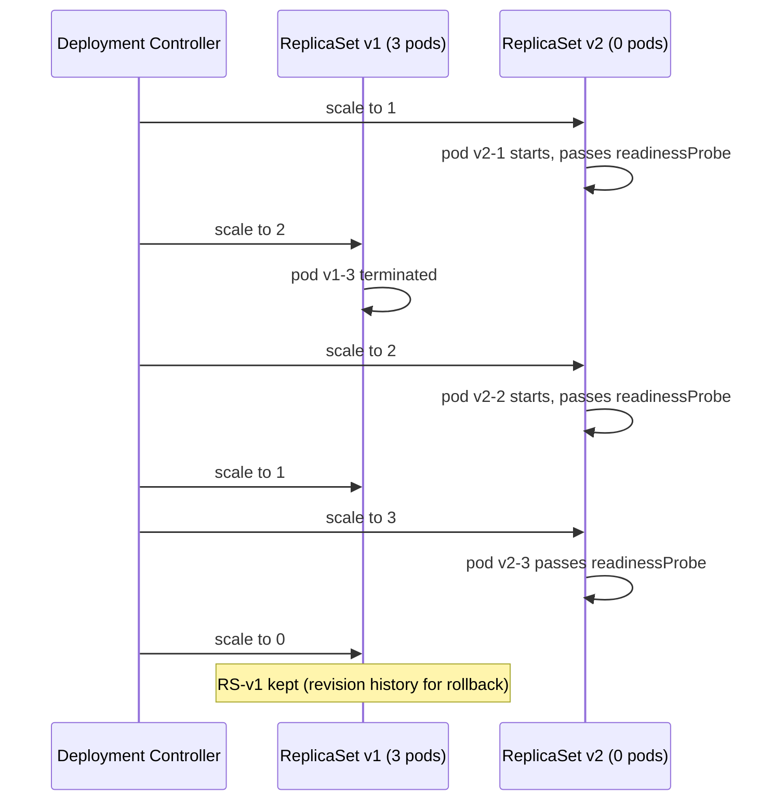

---

## 8. Service Networking: kube-proxy iptables/IPVS

A **Service** is a stable virtual IP (ClusterIP) that load-balances to a dynamic set of pod IPs. There is no kernel load-balancer process — it's implemented via **iptables DNAT rules** (or IPVS in proxy mode).

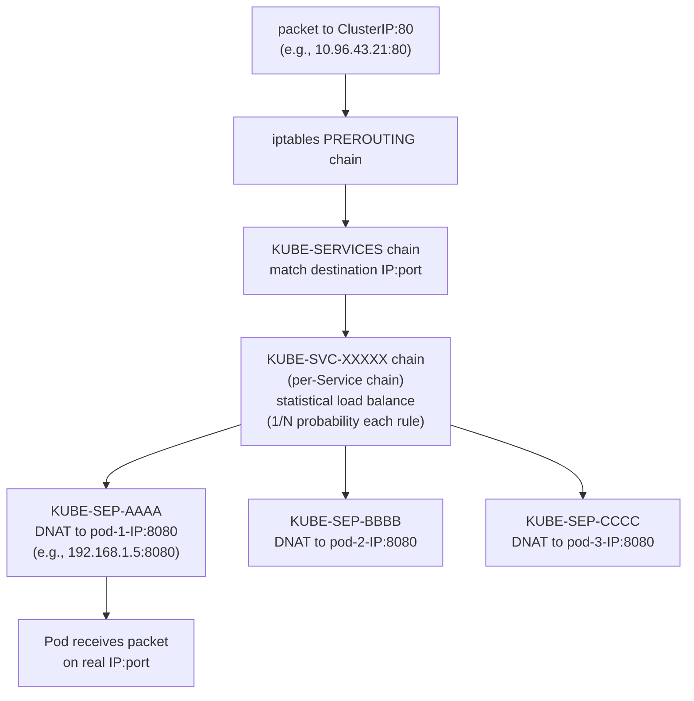

The Endpoint controller continuously watches pod events. When a pod fails readiness, its IP is removed from the Endpoints object, and kube-proxy removes that DNAT rule — **traffic stops before pod termination**.

### IPVS Mode (high pod count)

At 10,000+ services, iptables linear-scan becomes O(N). IPVS uses kernel hash tables for O(1) lookup:

```mermaid
block-beta
  columns 2
  block:ip["iptables mode"]:1
    I1["rule 1: match SVC-A → pod-1"]
    I2["rule 2: match SVC-A → pod-2"]
    I3["rule ...10000 rules scanned linearly"]
  end
  block:ipv["IPVS mode"]:1
    V1["IPVS virtual server table (hash)"]
    V2["O(1) lookup → backend real server"]
    V3["LB algorithms: rr, lc, sh, dh, wlc"]
  end
```

---

## 9. Ingress Controller: L7 HTTP Routing Internals

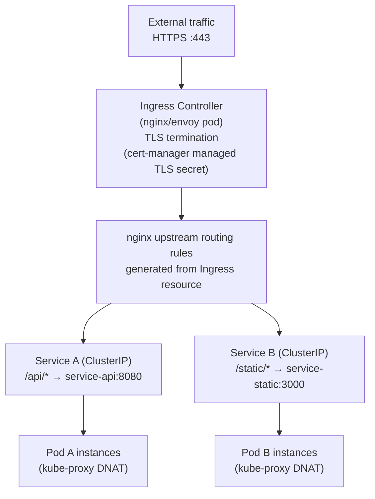

The nginx ingress controller runs a **watch loop** on Ingress objects. When an Ingress is created/modified, nginx-ingress calls `nginx -s reload` (hot reload via Unix socket) — no dropped connections — updating its `upstream` blocks.

---

## 10. Persistent Volumes: CSI Driver Architecture

The Container Storage Interface (CSI) decouples Kubernetes from storage vendor implementations:

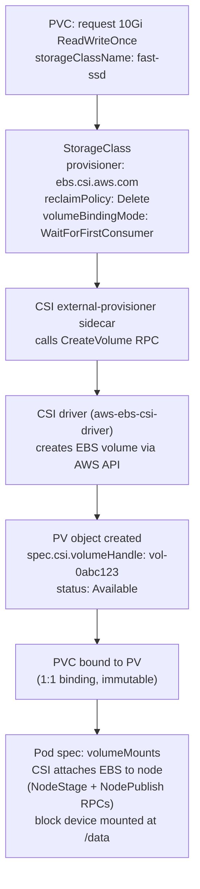

**PV access modes** map to storage system capabilities:
- `ReadWriteOnce (RWO)`: one node mounts read/write — EBS, local SSD
- `ReadWriteMany (RWX)`: multiple nodes mount read/write — NFS, CephFS
- `ReadOnlyMany (ROX)`: multiple nodes read-only — shared config data

---

## 11. RBAC: Subject → Role → Resource Binding

```mermaid
flowchart LR
  SA["ServiceAccount: app-reader\n(namespace: production)"]
  SA --> RB["RoleBinding: app-reader-binding\nsubject: ServiceAccount/app-reader\nroleRef: Role/pod-reader"]
  RB --> R["Role: pod-reader\nrules:\n- apiGroups: [\"\"]\n  resources: [pods]\n  verbs: [get, list, watch]"]
  R --> AUTH["API Server RBAC authorizer\nrequest: GET /api/v1/namespaces/production/pods\n→ ALLOW"]
  R --> DENY["request: DELETE /api/v1/namespaces/production/pods/foo\n→ DENY 403"]
```

**ClusterRole vs Role**: Role is namespace-scoped; ClusterRole applies cluster-wide (e.g., node access, PV management). `ClusterRoleBinding` grants cluster-wide permissions; `RoleBinding` scopes a ClusterRole to a namespace.

---

## 12. StatefulSet vs Deployment: Identity Preservation

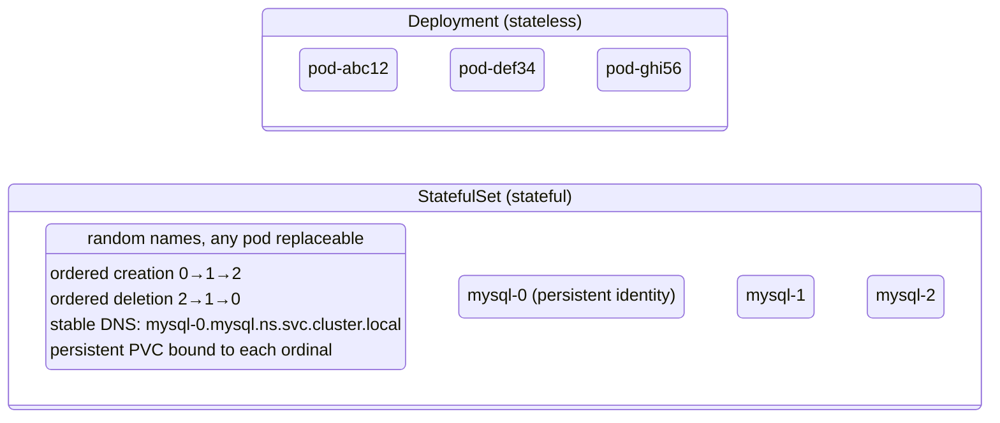

StatefulSets guarantee:
1. **Stable network identity**: `$(podname).$(servicename).$(namespace).svc.cluster.local`
2. **Stable storage**: PVC `data-mysql-0` persists across pod restarts (not deleted on pod delete)
3. **Ordered rolling updates**: pod N+1 not updated until pod N is Running+Ready

---

## 13. Kubernetes vs Docker Swarm vs Mesos: Scheduler Architecture

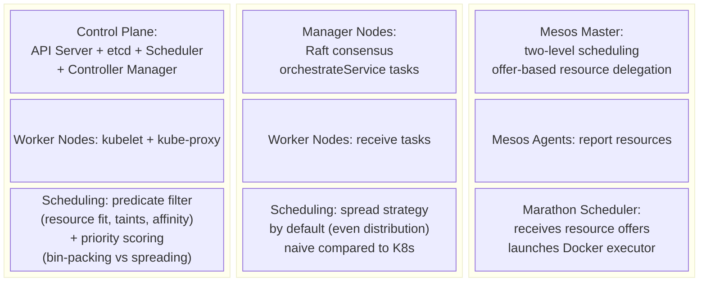

**Kubernetes two-phase scheduling** (predicates → priorities):
1. **Predicates** (hard filters): `NodeResourcesFit`, `PodFitsHostPorts`, `NodeAffinity`, `TaintToleration` — eliminates ineligible nodes
2. **Priorities** (soft scoring): `LeastRequestedPriority` (bin-pack), `BalancedResourceAllocation`, `InterPodAffinity` — scores remaining nodes 0-100, highest wins

---

## 14. Blue/Green and Canary Deployments: Label Selector Switch

Both advanced deployment strategies exploit K8s label selector mechanics — no special controller needed.

### Blue/Green

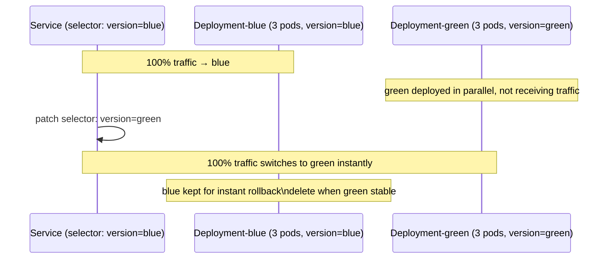

**Rollback**: patch selector back to `version=blue` — instantaneous, no pod restart.

### Canary

```mermaid
flowchart LR
  SVC["Service selector:\napp: frontend"] 
  SVC --> ST["Stable deployment\napp: frontend\n9 replicas\n→ 90% traffic"]
  SVC --> CN["Canary deployment\napp: frontend\n1 replica\n→ 10% traffic\n(proportional to replica count)"]
  CN --> MON["Monitor error rates\nlatency via Prometheus"]
  MON -- "healthy" --> SCALE["scale canary to 10\nscale stable to 0"]
  MON -- "bad metrics" --> ROLLBACK["delete canary deployment"]
```

---

## 15. CI/CD Pipeline: Container Lifecycle in Automation

```mermaid
flowchart LR
  GIT["git push\nfeature branch"]
  GIT --> CI["CI pipeline\n(Semaphore/Jenkins/GitHub Actions)"]
  CI --> BUILD["docker build -t app:$GIT_SHA .\n(layer cache from registry)"]
  BUILD --> TEST["docker run --rm app:$GIT_SHA\nnpm test / pytest / go test"]
  TEST --> PUSH["docker push registry/app:$GIT_SHA\n(push only new/changed layers)"]
  PUSH --> STAGING["kubectl set image deployment/app\napp=registry/app:$GIT_SHA\n--namespace=staging"]
  STAGING --> SMOKE["smoke tests\nreadiness probe gate"]
  SMOKE -- "pass" --> PROD["kubectl set image deployment/app\napp=registry/app:$GIT_SHA\n--namespace=production\n(rolling update)"]
  SMOKE -- "fail" --> RB["kubectl rollout undo\ndeployment/app"]
```

**Build-once, promote** principle: promote the same immutable image **digest**, not only a mutable tag or Git SHA. A digest identifies manifest content, while runtime configuration, secrets, platform-specific manifests, admission mutation, and node runtime can still change observed behavior.

---

## 16. Pod Lifecycle State Machine

```mermaid
stateDiagram-v2
  [*] --> Pending: pod created, scheduled to node
  Pending --> Init: init containers start (sequential)
  Init --> Running: all init containers exit 0\nmain containers start
  Running --> Succeeded: all containers exit 0 (Job)
  Running --> Failed: container exits non-zero\nrestartPolicy=Never
  Running --> Running: container restarts\n(restartPolicy=Always/OnFailure)\nExponential backoff: 10s→20s→40s→...→5min
  Running --> Terminating: SIGTERM sent\nterminationGracePeriodSeconds countdown
  Terminating --> [*]: SIGKILL if grace period exceeded
```

**Probe types and failure effects**:
- **livenessProbe** fails → container killed and restarted (CrashLoopBackOff if repeated)
- **readinessProbe** fails → pod IP removed from Endpoints (no traffic, pod stays Running)
- **startupProbe** fails → container killed (prevents liveness from firing during slow startup)

---

## 17. Network Policy: eBPF/iptables Packet Filter Architecture

```mermaid
flowchart TD
  POD_A["Pod A (namespace: prod)\nip: 192.168.1.5"]
  POD_B["Pod B (namespace: prod)\nip: 192.168.1.6"]
  POD_C["Pod C (namespace: test)\nip: 192.168.2.7"]

  NP["NetworkPolicy on Pod B:\nspec.ingress:\n- from:\n  - podSelector: {app: trusted}\n  namespaceSelector: {env: prod}"]

  POD_A -- "app=trusted label → ALLOW" --> NP
  NP --> POD_B
  POD_C -- "namespace=test → DENY" --> NP
```

NetworkPolicy is enforced by the **CNI plugin** (Calico, Cilium, WeaveNet). Cilium uses **eBPF programs** attached to network interfaces — no iptables rules, O(1) verdict lookup via BPF hash maps. Calico uses iptables chains injected per-NetworkPolicy.

---

## 18. Auto Scaling: HPA Control Loop

```mermaid
flowchart TD
  HPA["HPA Controller\n(kube-controller-manager)\nchecks every 15s"]
  HPA --> MS["Metrics Server\naggregates kubelet /metrics/resource"]
  MS --> CPU["current avg CPU utilization\nacross all pods"]
  CPU --> CALC["desired replicas =\nceil(currentReplicas × (currentUtil / targetUtil))\ne.g., 3 × (80% / 50%) = ceil(4.8) = 5"]
  CALC --> CMP{within min/max bounds?}
  CMP -- yes --> SCALE["patch Deployment.spec.replicas = 5"]
  CMP -- no --> CLAMP["clamp to minReplicas or maxReplicas"]
```

**Scale-down stabilization**: HPA waits 5 minutes before scaling down to prevent thrashing (yo-yo scaling). Scale-up has no stabilization delay — it acts immediately.

---

## Summary: Data Flow Through the Full Stack

```mermaid
flowchart TD
  DEV["Developer: git push"]
  DEV --> CICD["CI/CD pipeline\nbuilds Docker image layers\n(OverlayFS content-addressed)"]
  CICD --> REG["Container Registry\nstores layer blobs by sha256"]
  REG --> KUBCTL["kubectl apply\nDeployment spec → API Server"]
  KUBCTL --> ETCD["etcd (Raft)\ndesired state persisted"]
  ETCD --> CTRL["Deployment/RS Controller\nwatches etcd list/watch stream"]
  CTRL --> SCHED["Scheduler\npredicate filter + priority score\nselects node, writes nodeName"]
  SCHED --> KUBELET["kubelet on node\nwatches pod spec"]
  KUBELET --> CRI["containerd via CRI gRPC\npull image layers from registry"]
  CRI --> OFS["OverlayFS\nstacks read-only layers\n+ writable upperdir"]
  OFS --> NS["Linux namespaces created\n(PID, NET, MNT, UTS, IPC)"]
  NS --> CG["cgroups applied\n(CPU quota, memory limit)"]
  CG --> RUN["Container process running\nas isolated pid 1"]
  RUN --> SVC["kube-proxy iptables DNAT rules\nClusterIP → pod IPs\nload balanced"]
  SVC --> ING["Ingress controller (nginx)\nL7 HTTP routing\nTLS termination"]
  ING --> USER["User request served"]
```

The final diagram is one common Linux, containerd, OverlayFS, and kube-proxy path. Static pods, alternate runtimes, managed control planes, eBPF proxies, host networking, and server-side dry runs take different branches; trace the actual cluster before using it as an incident path.
