# Docker and Kubernetes for Java Developers: Under the Hood

> Source: *Docker and Kubernetes for Java Developers* — Jaroslaw Krochmalski, Packt Publishing, 2017 (417 pages)

---

## 1. Docker Image Internals: Layered Filesystem Architecture

Every Docker image is a stack of immutable, read-only **content-addressable layers** stored as compressed tar archives (OCI Image Format). When you build a Java application image, each Dockerfile instruction generates a new layer identified by its SHA-256 digest.

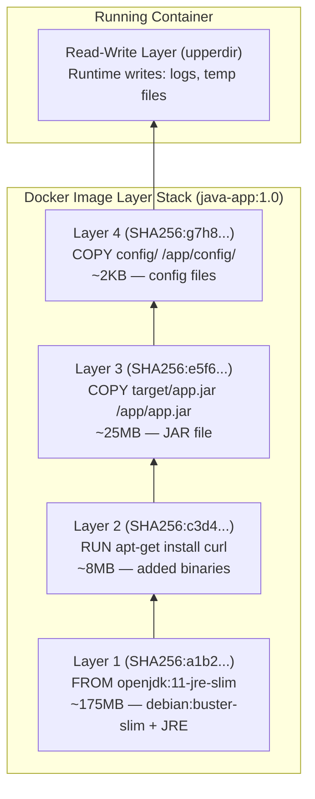

### OverlayFS: How Layers Merge in the Kernel

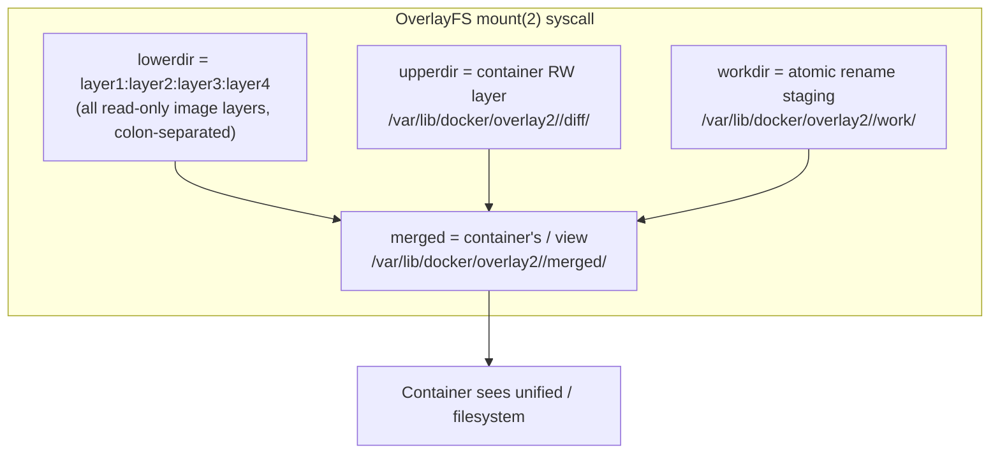

**Copy-on-Write mechanics**: When a container modifies `/etc/hosts` (in lower layer), the kernel's `copy_up()` function:
1. Reads the file from the lowest layer containing it
2. Creates a full copy in `upperdir`
3. Applies the write to the copy
4. Subsequent reads hit `upperdir` first

This means **first write is expensive** (full file copy), subsequent writes are cheap.

### Dockerfile Layer Caching: The Build Cache Algorithm

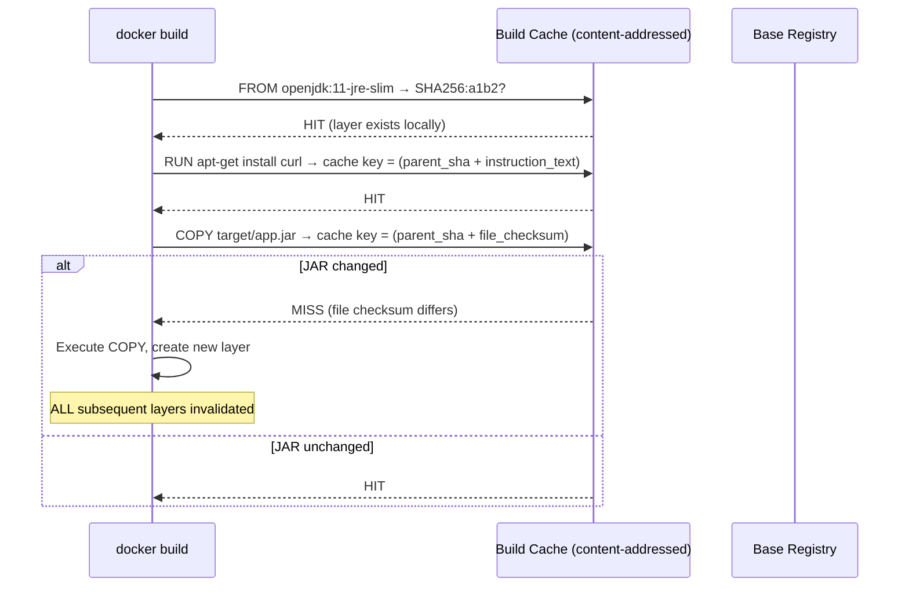

**Java optimization**: Place `COPY target/app.jar` as late as possible. Dependencies rarely change; the JAR changes on every build. Split into:
```
COPY target/dependency/ /app/WEB-INF/lib/    # changes rarely → cache hit
COPY target/classes/ /app/WEB-INF/classes/   # changes often → only this misses
```

---

## 2. JVM Inside Containers: cgroup Memory Boundaries

Pre-Java 10, the JVM used `sysconf(_SC_PHYS_PAGES)` to discover total RAM — it read the **host** physical memory, not the container limit. This caused catastrophic heap sizing when a container with a 512MB limit ran on a 64GB host: the JVM would configure `MaxHeapSize = 64GB × 0.25 = 16GB`, triggering OOM kills immediately.

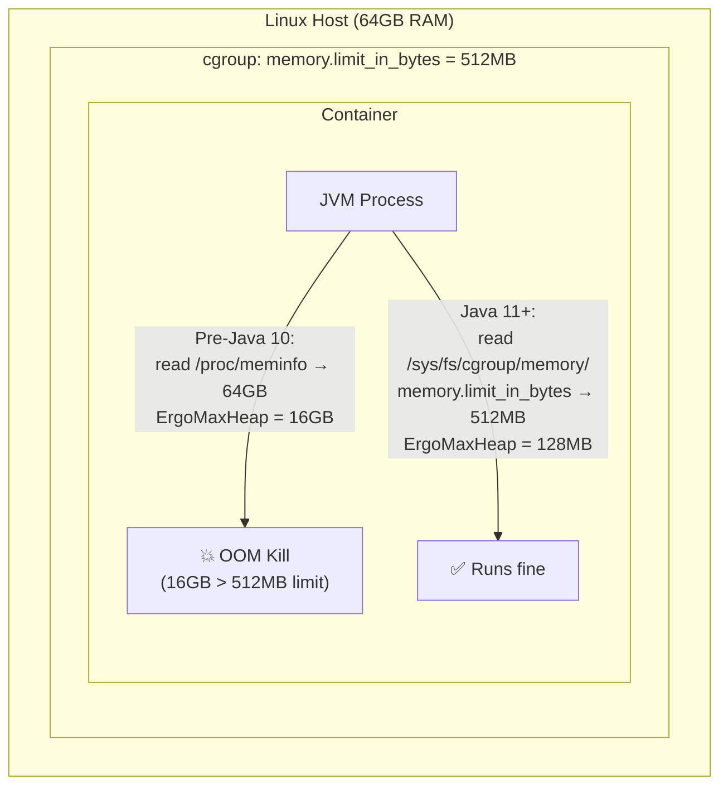

### cgroup v1 Memory Subsystem Paths (JVM reads)

```
/sys/fs/cgroup/memory/memory.limit_in_bytes     → container memory ceiling
/sys/fs/cgroup/memory/memory.usage_in_bytes     → current usage
/sys/fs/cgroup/memory/memory.memsw.limit_in_bytes → memory+swap ceiling
/sys/fs/cgroup/cpu/cpu.cfs_quota_us             → CPU allocation (microseconds/period)
/sys/fs/cgroup/cpu/cpu.cfs_period_us            → period window (default 100000 = 100ms)
```

**CPU throttling**: If `cfs_quota_us = 50000` and `cfs_period_us = 100000`, the container gets 0.5 CPUs. Java's `Runtime.getRuntime().availableProcessors()` historically returned the host count (e.g., 32), causing thread pools sized 32x too large.

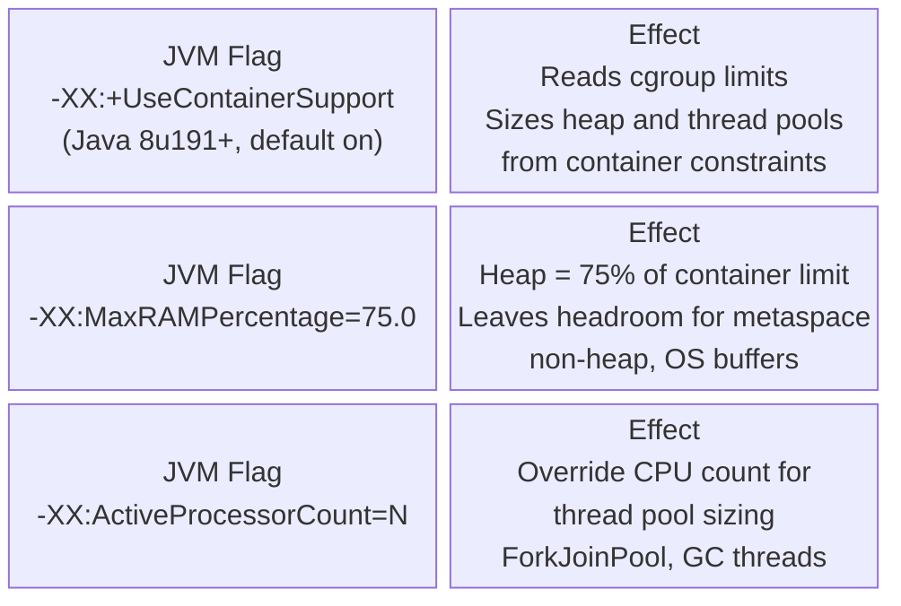

---

## 3. Docker Networking Internals: Linux Bridge and veth Pairs

When Docker starts a container, it creates an isolated network namespace and connects it to the `docker0` bridge via a **veth pair** (virtual Ethernet cable with two ends).

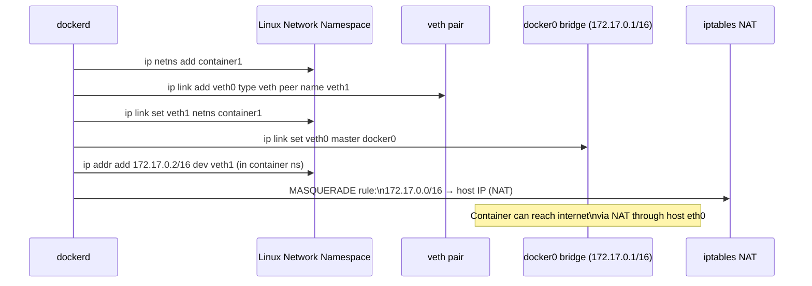

### Port Binding: DNAT Rule Creation

When you `docker run -p 8080:80`, Docker inserts iptables DNAT rules:

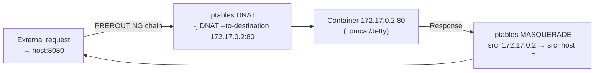

### Docker Network Modes

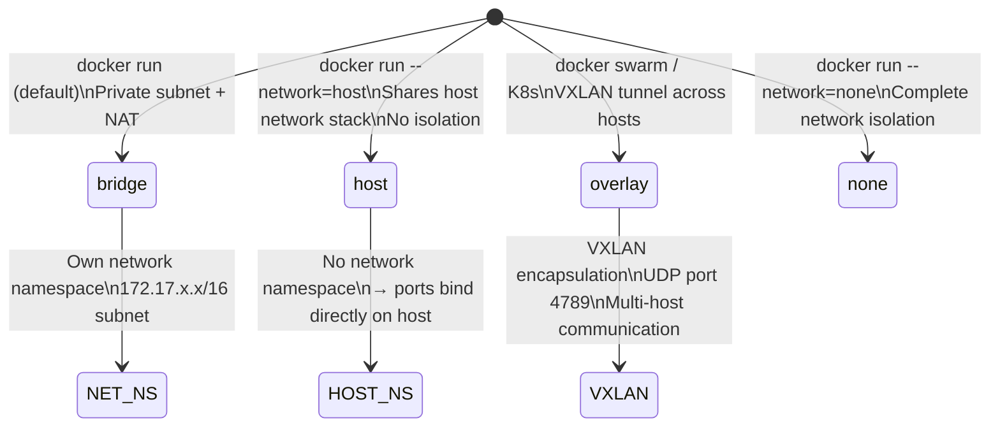

---

## 4. Docker Volumes: Persistent Storage Internals

Container filesystems are ephemeral — the `upperdir` is destroyed when the container is removed. Volumes bypass the overlay filesystem entirely, mounting host directories directly into the container's mount namespace.

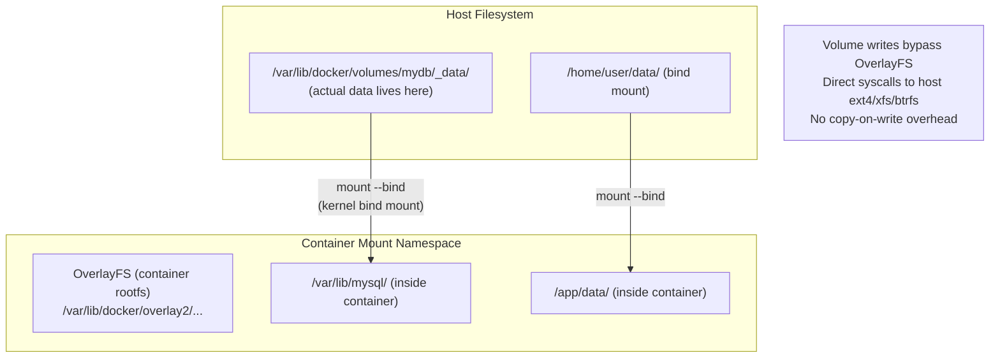

**Named volume vs bind mount**: Named volumes are managed by Docker — Docker creates and owns the directory. Bind mounts reference arbitrary host paths. For Java apps, use named volumes for database files, bind mounts for development (live code reload).

---

## 5. Docker Compose: Multi-Container Dependency Graph

Docker Compose translates YAML dependency declarations into Docker network and container creation sequences:

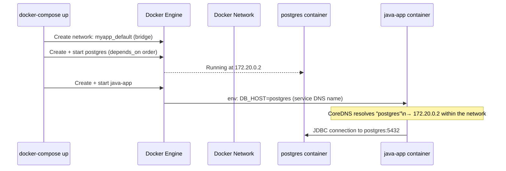

**`depends_on` vs health checks**: `depends_on` only waits for the container to *start*, not for the service to be *ready*. A Postgres container starts in milliseconds but needs seconds to initialize. Use `condition: service_healthy` with `HEALTHCHECK` instructions to gate Java app startup on actual DB readiness.

---

## 6. Kubernetes API Request Flow for Java Applications

When a Java microservice running in a pod calls the Kubernetes API (e.g., to discover other services):

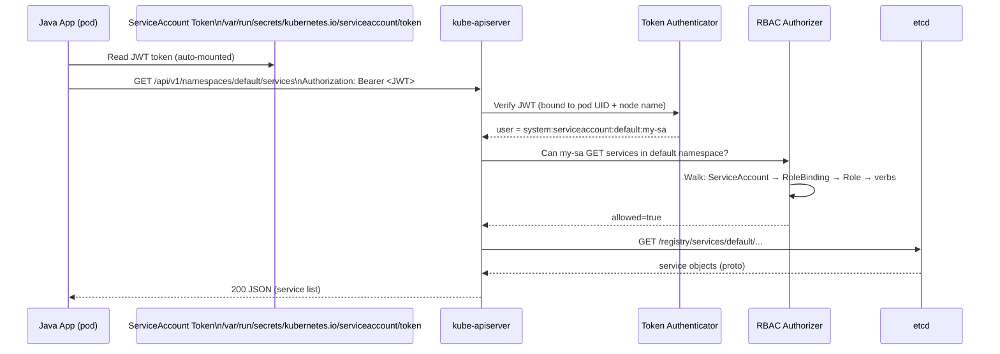

### RBAC Authorization Internals

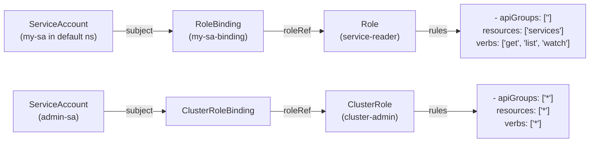

**RBAC evaluation**: The RBAC authorizer performs a set intersection — it checks if the requested `{verb, resource, apiGroup, namespace}` tuple is covered by any PolicyRule reachable from the authenticating subject via RoleBinding/ClusterRoleBinding chains. There are **no deny rules** — only allow rules. Permissions are additive across all bindings.

---

## 7. Kubernetes Deployment Pipeline for Java Applications

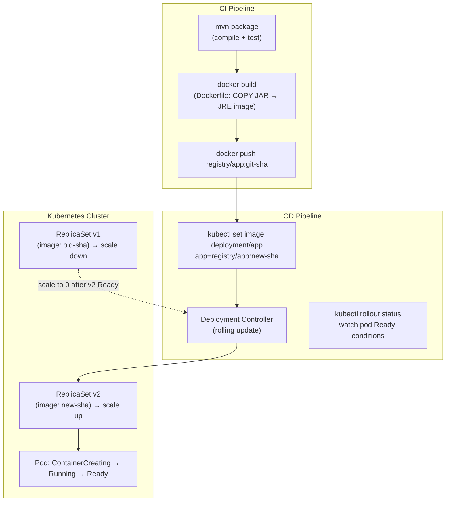

### Java App Readiness: Why Startup Probes Matter

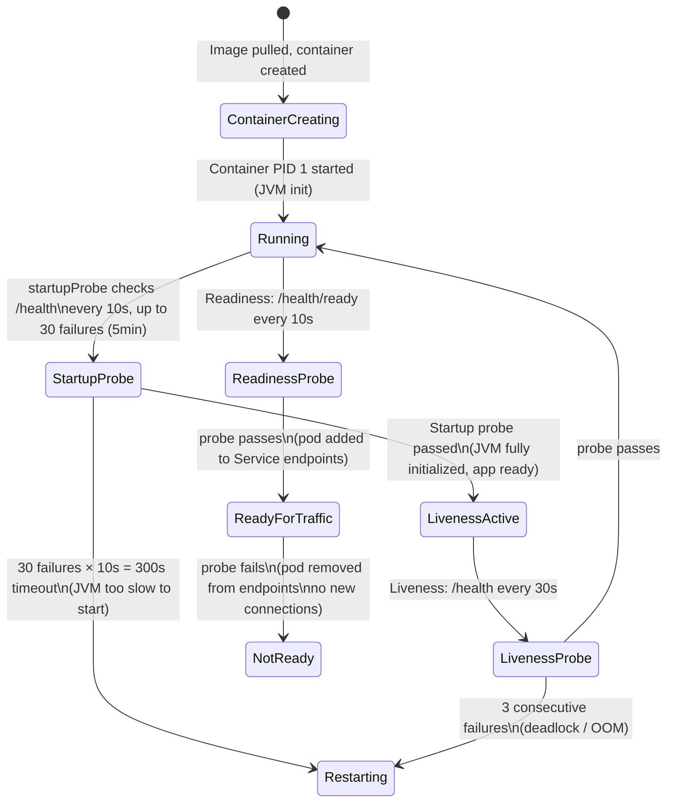

**Java startup issue**: Spring Boot applications can take 20-60 seconds to initialize on cold start (classpath scanning, bean wiring, DB connection pool). Without a `startupProbe`, the `livenessProbe` fires during initialization and **kills the app in a restart loop**. The startup probe suspends liveness checks until the app is confirmed started.

---

## 8. Service Discovery: How Java Microservices Find Each Other

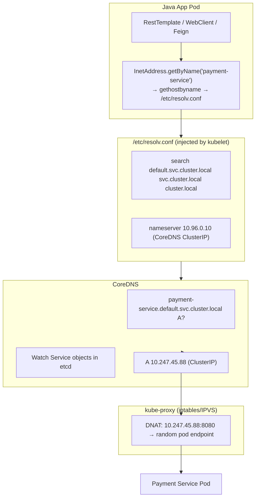

**Environment variable injection**: Kubernetes also injects `SERVICE_NAME_SERVICE_HOST` and `SERVICE_NAME_SERVICE_PORT` environment variables for every service that existed when the pod started. These are a legacy mechanism; DNS is preferred because it works for services created after pod startup.

---

## 9. ConfigMaps and Secrets: How Configuration Reaches Java Apps

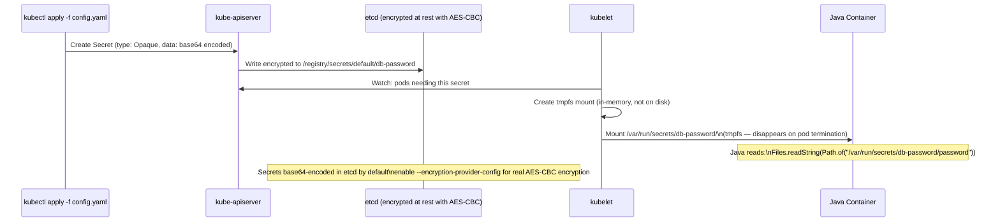

### Environment Variable vs Volume Mount

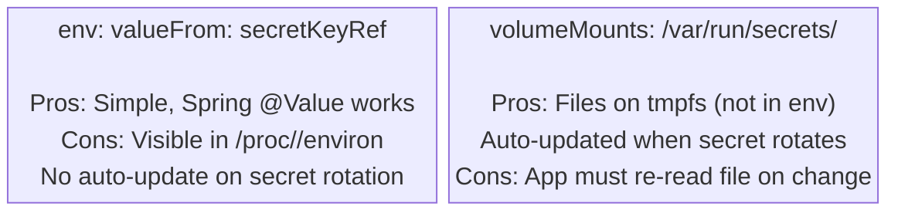

---

## 10. Persistent Java State in Kubernetes: StatefulSets + PVCs

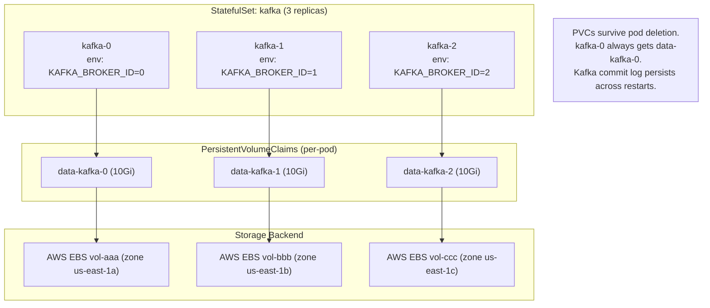

### CSI Volume Attachment Flow (AWS EBS → Java Pod)

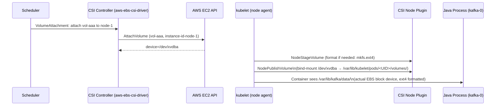

---

## 11. Horizontal Pod Autoscaling for Java Services

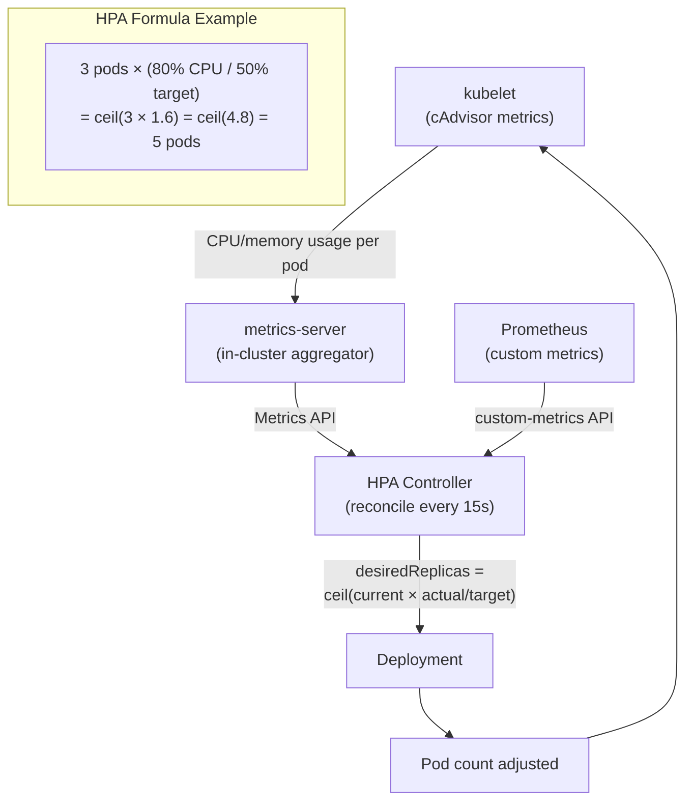

**Java-specific consideration**: JVM CPU usage spikes during GC. If a full GC pause consumes 100% CPU for 200ms, HPA may scale out unnecessarily. Use JVM GC metrics (e.g., `jvm_gc_pause_seconds`) as custom HPA metrics rather than raw CPU for more stable scaling behavior.

---

## 12. Docker + Kubernetes Build Pipeline: Complete Data Flow

```mermaid
flowchart LR
    subgraph DEV["Developer Machine"]
        CODE["Java Source\nsrc/main/java/..."]
        MVN["mvn clean package\n→ target/app.jar"]
        DOCKERFILE["Dockerfile:\nFROM openjdk:11-jre-slim\nCOPY target/app.jar /app/\nENTRYPOINT java -jar /app/app.jar"]
    end
    subgraph CI["CI/CD (Jenkins/GitHub Actions)"]
        BUILD["docker build -t registry/app:${GIT_SHA} ."]
        TEST["docker run --rm integration-tests"]
        PUSH["docker push registry/app:${GIT_SHA}"]
        DEPLOY["kubectl set image deployment/app app=registry/app:${GIT_SHA}"]
    end
    subgraph K8S["Kubernetes Cluster"]
        PULL["kubelet pulls image\nfrom registry (TLS)"]
        UNPACK["containerd unpacks layers\n→ overlay2 snapshots"]
        CGROUPSETUP["cgroup hierarchy created\n/kubepods/burstable/pod<UID>/<containerID>"]
        JVM_START["JVM starts:\n-XX:+UseContainerSupport\nReads memory.limit_in_bytes\nSizes heap accordingly"]
        PROBES["liveness + readiness probes\nHTTP GET /actuator/health"]
        SERVICE["Service endpoints updated\nkube-proxy iptables rules installed"]
    end
    CODE --> MVN --> DOCKERFILE --> BUILD --> TEST --> PUSH --> DEPLOY
    DEPLOY --> PULL --> UNPACK --> CGROUPSETUP --> JVM_START --> PROBES --> SERVICE
```

---

## 13. Kubernetes Networking for Java: Service Types Internals

```mermaid
flowchart TD
    JAVA_CLIENT["Java Client\n(RestTemplate calling payment-svc)"] --> CLUSTER_IP["ClusterIP Service\n10.247.45.88:8080\n(virtual, not a real host)"]

    CLUSTER_IP -->|"kube-proxy iptables chain\nKUBE-SVC-xxx"| EP_SEL["Endpoint Selection\nStatistical load balancing"]
    EP_SEL --> POD_A["payment-pod-1\n172.16.0.10:8080"]
    EP_SEL --> POD_B["payment-pod-2\n172.16.0.11:8080"]
    EP_SEL --> POD_C["payment-pod-3\n172.16.0.12:8080"]

    EXTERNAL["External Java Client\n(outside cluster)"] --> NODE_PORT["NodePort\nnode-ip:30080"]
    NODE_PORT -->|DNAT| CLUSTER_IP

    CLOUD_LB["Cloud LoadBalancer\n(AWS NLB / GCP GLB)"] --> NODE_PORT
```

**Session affinity**: Setting `service.spec.sessionAffinity: ClientIP` instructs kube-proxy to create iptables rules using the `-m recent` module to track client IP → backend pod mappings (default 10800s timeout). Java apps using sticky sessions (e.g., HTTP session state) need this to avoid request scattering across pods.

---

## Summary: JVM-in-Container Mental Model

```mermaid
flowchart TD
    subgraph KERNEL["Linux Kernel"]
        CGROUP["cgroup: memory.limit_in_bytes = 512MB\ncpu.cfs_quota_us = 50000 (0.5 CPU)"]
        NETNS["Network namespace:\nveth0 ↔ cni0 bridge\npod CIDR: 172.16.x.x"]
        MNTNS["Mount namespace:\nOverlayFS rootfs\nVolume bind-mounts (tmpfs for secrets)"]
        PIDNS["PID namespace:\nJVM = PID 1 inside container"]
    end
    subgraph JVM["JVM Process"]
        HEAP["-Xmx = MaxRAMPercentage × 512MB\n= 384MB heap"]
        NONHEAP["Non-heap:\nMetaspace (class metadata)\nCode cache (JIT compiled)\nThread stacks (512KB each)"]
        GC["GC threads = min(ActiveProcessorCount, 8)"]
    end
    CGROUP -->|constrains| JVM
    NETNS -->|routes| JAVA_NET["Java network I/O\n(HTTP, JDBC, Kafka)"]
    MNTNS -->|provides| JAVA_FS["Java file I/O\n(config reads, log writes)"]
    PIDNS -->|hosts| JVM
```

The JVM must always be treated as a **cgroup-aware process**. Container resource limits are not hints — they are hard kernel enforcement boundaries. A JVM that ignores them will be OOM-killed by the kernel's memory reclaim machinery, not by a graceful Java exception.
