# Edge Computing Container Architectures: Docker vs. Kubernetes for Real-Time Robotics

> **Under the Hood** — How containers orchestrate closed-loop control systems at the edge: namespace isolation, network routing, scheduling latency, and MPC feedback timing across ROS message buses.

---

> **Reading contract:** This is a scenario analysis for ROS, MPC, Docker, and Kubernetes at the edge, not a flight-safety design or a general benchmark. The numerical comparison is evidence only for its original hardware, ROS version, topology, solver, workload, sample count, and percentile, none of which are fully recorded here. Readers must separate measured values from causal hypotheses. A control deployment is complete only after worst-case execution time, end-to-end age, jitter, deadline misses, actuator failsafe, recovery time, and rollback are demonstrated under load. A missed deadline is a safety failure, not a retry opportunity inside the same control period.

## 1. The Edge Computing Compute Model

Edge computing places compute near sensors and actuators to reduce, not eliminate, network delay and jitter. Whether cloud or edge execution can support a closed loop depends on the control period, worst-case age of data, loss behavior, solver deadline, stability analysis, and onboard fallback.

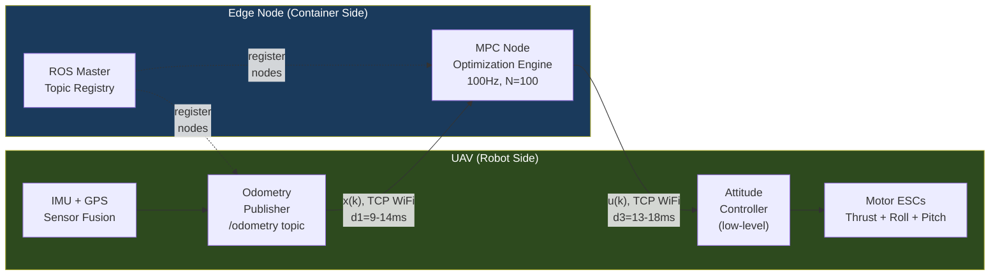

**Round-trip timing formula:**

```
T_rtt = T_robot→edge + T_mpc_exec + T_edge→robot
Docker RTT:     14.2ms + 16.1ms + 17.6ms = ~47.9ms
Kubernetes RTT:  9.5ms + 16.9ms + 13.1ms = ~39.5ms
```

---

## 2. Container Isolation Architecture: What Actually Gets Isolated

Both Docker and Kubernetes use the same Linux kernel primitives for container isolation. Understanding which namespaces exist and which are shared is critical for ROS networking.

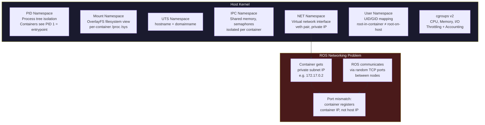

### The `--network=host` Fix: Bypassing NET Namespace

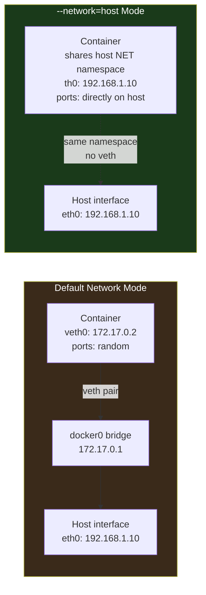

With `--network=host`, the container's ROS master registers itself on the host's actual IP (e.g., `192.168.1.10`) instead of a private Docker subnet IP, enabling cross-device ROS topic subscription to work correctly over WiFi.

---

## 3. Docker Single-Node Edge Architecture: Internal Data Flow

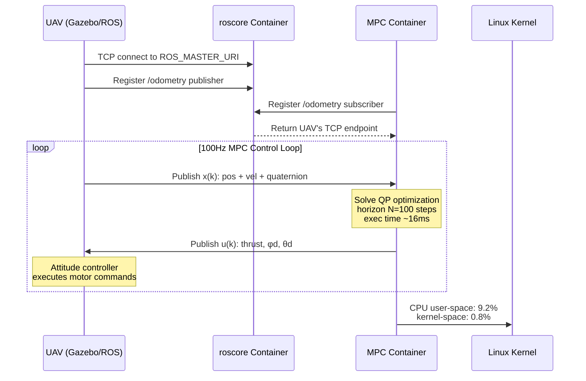

### Container Process Hierarchy (Docker)

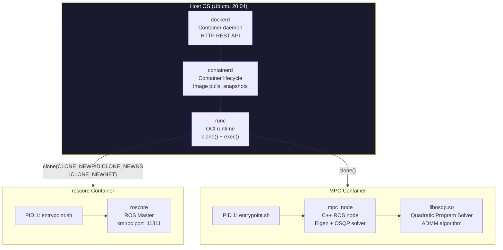

---

## 4. Kubernetes Multi-Node Edge Architecture: Control Plane Data Flow

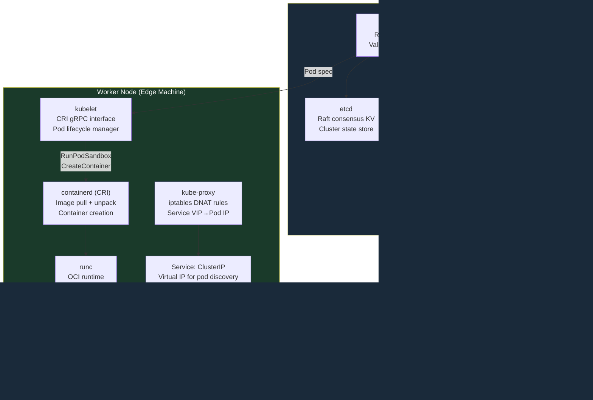

### Kubernetes Pod Network Isolation vs. Host Network

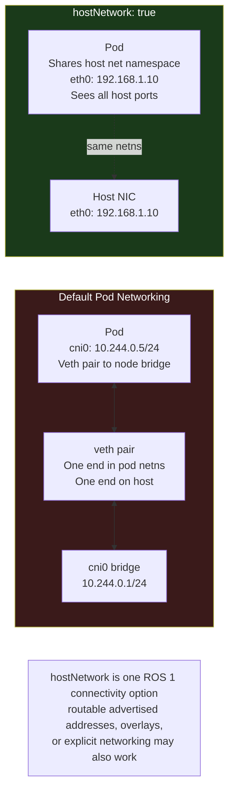

---

## 5. MPC Optimization: What the Compute Offload Actually Does

The MPC solve is a quadratic program (QP) solved at 100Hz. This is what gets offloaded to the edge container.

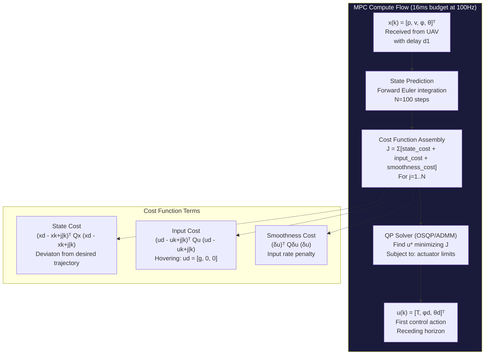

### UAV Kinematic Model in Memory

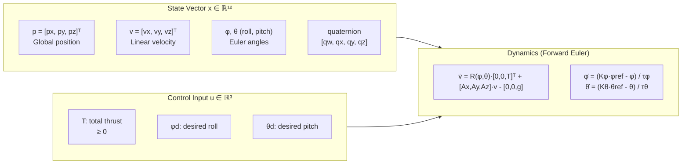

---

## 6. Docker vs. Kubernetes: Resource Overhead Under the Hood

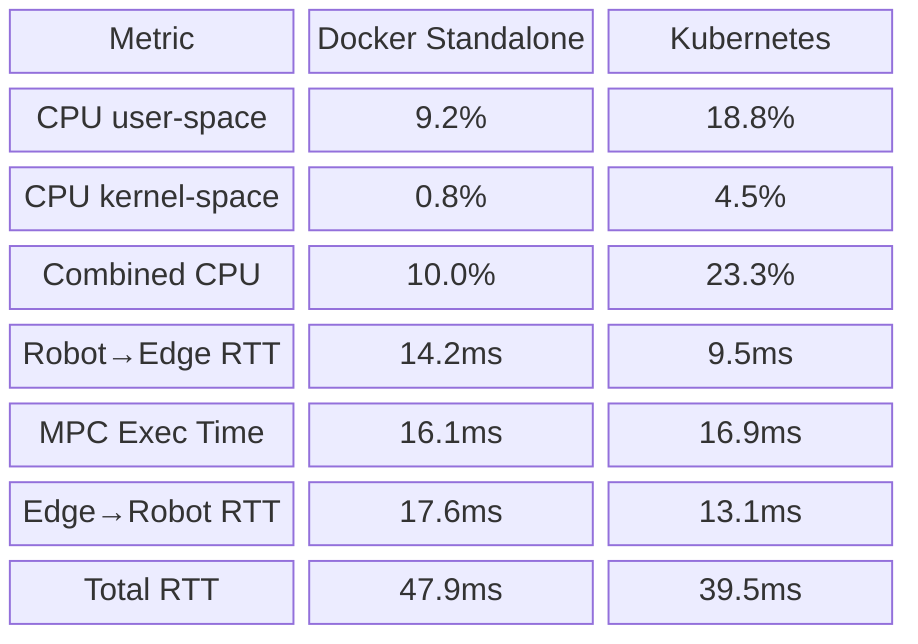

This sample reports lower Kubernetes RTT and higher CPU usage than its Docker run. The proposed ARP, iptables, and control-plane causes are **hypotheses**, not demonstrated explanations; topology, warm-up, host networking, sampling, background load, and variance must be controlled before attribution.

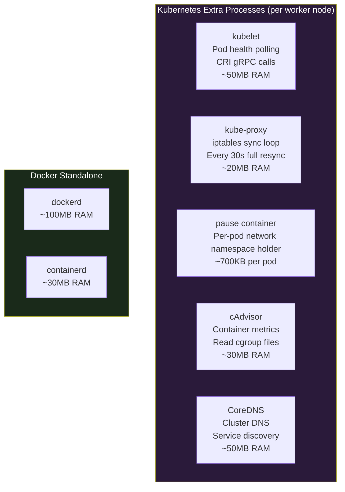

---

## 7. ROS Node Communication: Pub/Sub Over TCP

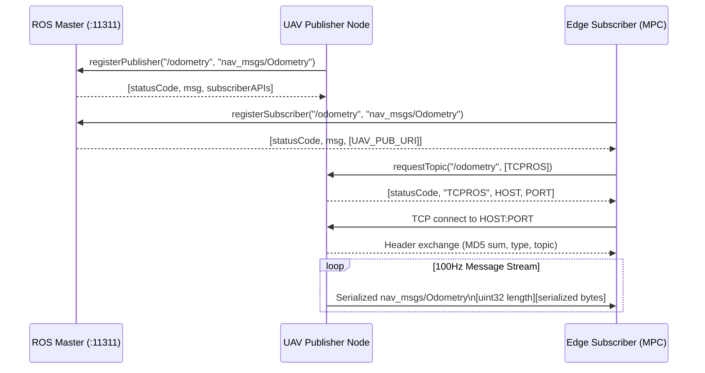

ROS Master returns the publisher's advertised endpoint to subscribers. A non-routable container address will fail from another device, but `--network=host` is only one remedy; a routable CNI/overlay, correct `ROS_IP`/`ROS_HOSTNAME`, port reachability, or a gateway can satisfy the same requirement.

---

## 8. Container Failure Recovery: Docker vs. K8s State Machines

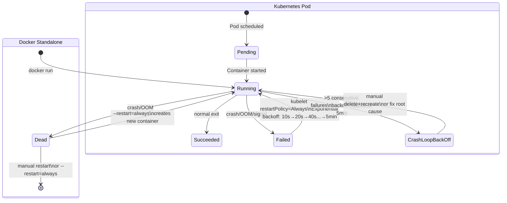

Kubernetes restart and readiness behavior can restore a failed process, but exponential backoff is not a real-time flight-control failover. Production UAV control needs an onboard safe controller and explicit stale-command timeout; orchestration recovery is a slower secondary mechanism. Docker also supports restart and health-check features, though higher-level routing and readiness semantics differ.

---

## 9. Edge Architecture Decision Matrix

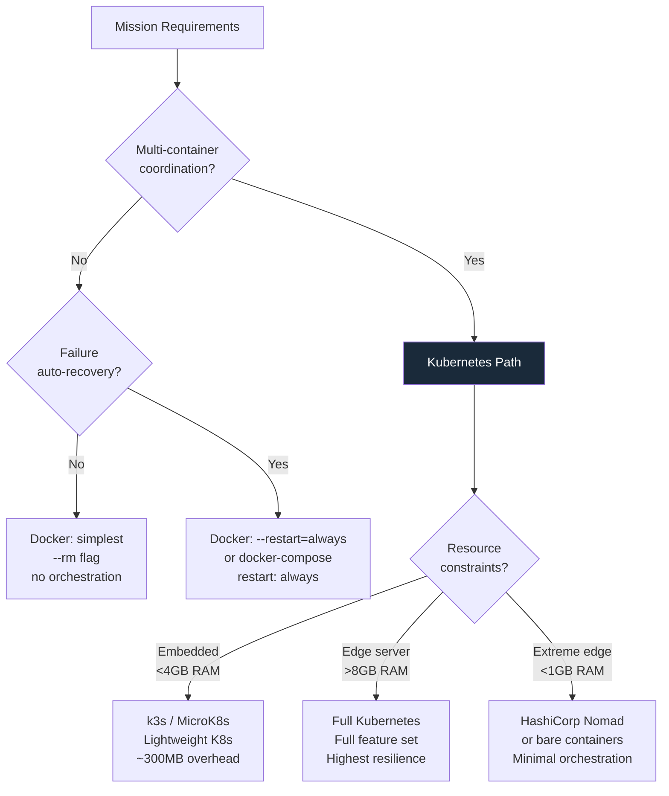

---

## 10. Latency Budget Analysis: Why Edge Beats Cloud for Real-Time Control

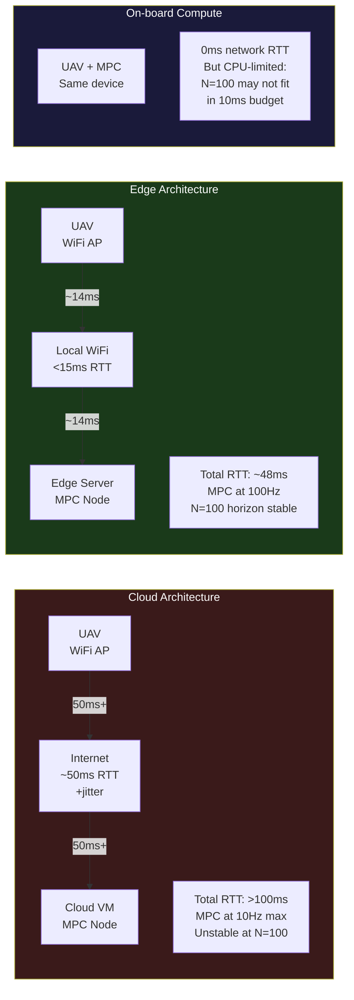

A 100Hz period is 10ms, so the stated 16ms edge solve already misses that deadline before adding network delay; it is not "just within" the budget. These figures support a lower demonstrated control rate unless pipelining and a stability analysis define a different deadline model.

---

## 11. Container Image Layer Architecture for ROS

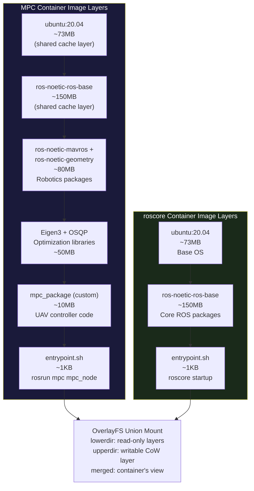

---

## 12. Extending the Architecture: Multi-Robot Coordination via Edge

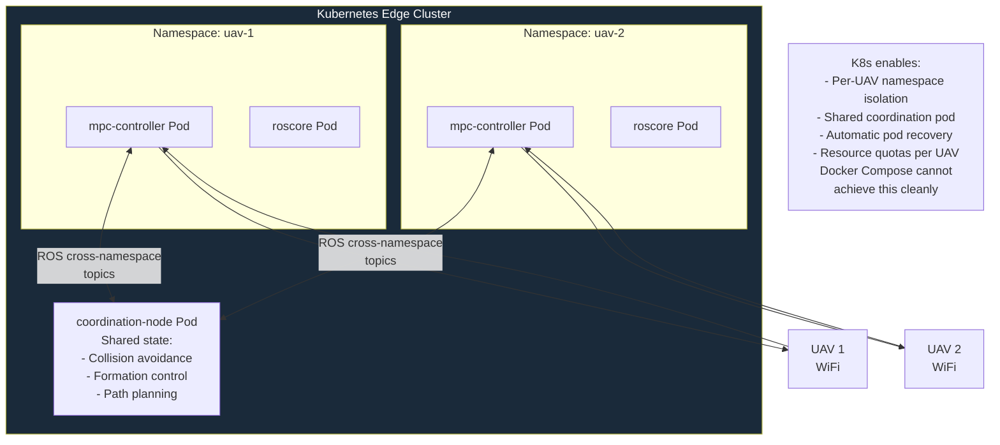

---

## Summary: Internal Architecture Tradeoffs

| Dimension | Docker Standalone | Kubernetes |
|-----------|------------------|------------|
| **Network overhead** | Host-mode: zero overhead | Host-mode: still passes kube-proxy DNAT |
| **CPU overhead** | ~10% (MPC only) | ~23% (MPC + kubelet + kube-proxy + etcd client) |
| **Failure recovery** | Manual or `--restart` flag | Automatic with probe-gated readiness |
| **Scaling** | Single node only | Multi-node pod migration |
| **Network RTT** | 47.9ms total | 39.5ms total (warmed iptables chains) |
| **Kubernetes overhead source** | — | etcd heartbeats, kubelet CRI polls, kube-proxy iptables resync |
| **Namespace isolation** | PID + MNT + IPC (not NET with `--network=host`) | Same + pause container per pod |
| **Real-time deadline safety** | Simple, predictable | Scheduler jitter possible under load |

The core principle: **containers do not create isolation for free** — every namespace boundary has a cost in setup latency, routing overhead, and memory footprint. For hard real-time control loops, the tradeoff between isolation/orchestration features and raw determinism must be carefully evaluated against the mission's RTT budget.
