# Jenkins CI/CD Internals: Under the Hood

> Source: Jenkins Resource Guide (AdminTurnedDevOps)

---

> **Reading contract:** This is a Jenkins architecture study guide based on a secondary source. It is for administrators and pipeline authors, not a current backup, security, or recovery runbook. Bind claims to Jenkins core, Java, plugin and Remoting versions, controller topology, durability setting, agent launcher, and storage backend. A build is complete only with immutable source and artifact identifiers, test and policy evidence, deployment health, and a proven rollback. Agent loss, controller restart, plugin incompatibility, secret exposure, or deployment failure requires evidence capture, bounded retry, and escalation or rollback.

## 1. What Jenkins Actually Is: A Java-Based Event-Driven Orchestrator

Jenkins is a **Java process** (runs in a servlet container — historically Jetty, or deployed as a WAR in Tomcat) that maintains a persistent workspace directory (`$JENKINS_HOME`) and an internal execution graph. It is **not** a build runner itself — it is an **orchestrator** that delegates actual work to **build agents** via remote protocol.

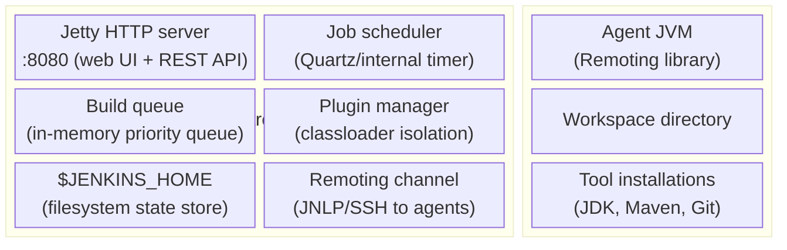

The controller can run build steps when it has executors, though production guidance commonly sets controller executors to zero and uses agents. Step location also depends on the Pipeline step and plugin; controller-side Groovy and coordination work still consume controller resources.

---

## 2. $JENKINS_HOME: The Filesystem as Database

Jenkins core commonly persists substantial state under `$JENKINS_HOME`, but plugins and integrations may use external artifact stores, credentials systems, databases, clouds, and SCM. Inventory plugin-owned state before defining a backup boundary.

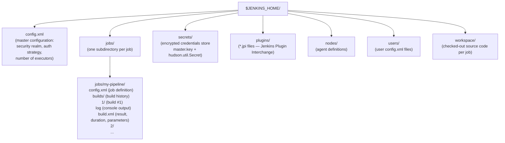

**Implications**:
- A consistent backup is not merely a live `tar` of `$JENKINS_HOME`. Quiesce or use a supported snapshot method, include encryption keys and external plugin state, verify permissions, and prove restore on a compatible Jenkins/plugin version.
- Build history accumulates indefinitely unless configured with **build discarder** (`logRotator`)
- Plugin updates install new `.jpi` files; restart loads them via classloader
- Credentials are encrypted with `master.key` (AES-128) — losing this key = losing all stored credentials

---

## 3. Build Queue and Executor Model

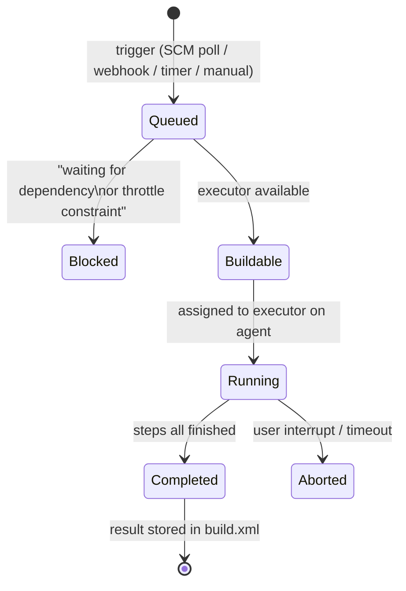

**Executor slots**: Each node (controller or agent) has a configured number of **executors** (parallel job capacity). When a build is triggered, Jenkins checks the queue against available executor slots across all connected agents. The **scheduler loop** runs continuously, assigning queued builds to free executors based on:

1. **Label expressions**: does the agent have the required label (e.g., `linux && docker`)?
2. **Node affinity**: is the job pinned to a specific agent?
3. **Queue priority**: FIFO by default, modified by priority plugins

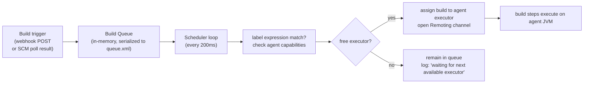

---

## 4. Jenkinsfile: Pipeline DSL Compilation and Execution

A Jenkinsfile is a **Groovy DSL** compiled by Jenkins into a **CPS (Continuation Passing Style)** execution graph. This is the key to Jenkins' ability to survive controller restarts mid-build.

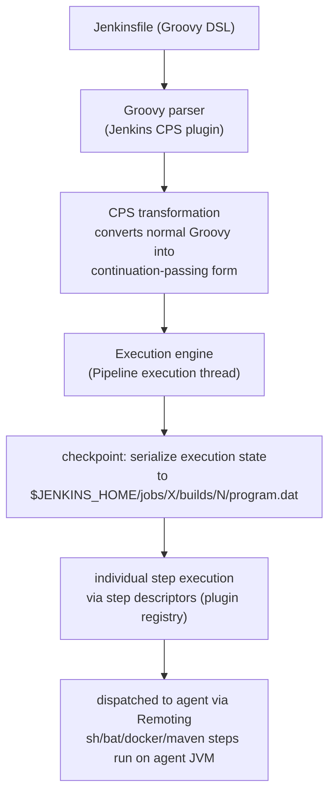

**CPS (Continuation Passing Style)** transform: every Jenkins Pipeline step is wrapped so that after each step completes, the continuation (next action) is serialized. If the Jenkins controller restarts, it deserializes `program.dat` and resumes from the last checkpoint — builds survive controller upgrades.

### Declarative vs Scripted Pipeline: AST Differences

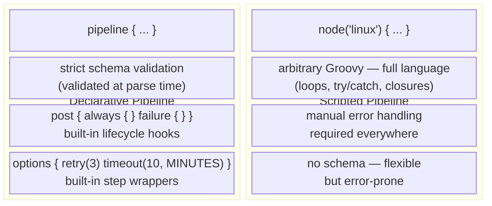

---

## 5. Stage Execution: Parallel and Sequential

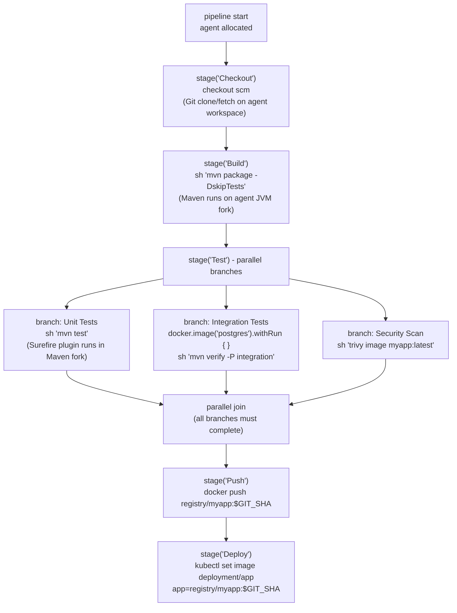

`parallel` branches are concurrent in the Pipeline graph, but they consume separate executors only when their nested `node` or `agent` allocations require them. Failure aggregation and fail-fast behavior depend on Pipeline options and branch error handling.

---

## 6. Agent Communication: Remoting Protocol Internals

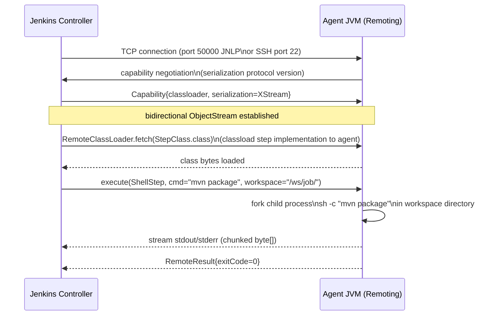

The **Remoting channel** serializes Java objects across the TCP connection using a custom protocol. Step implementations (e.g., `ShellStep`, `DockerBuildStep`) are classloaded **from the controller to the agent** on demand — agents do not need plugins pre-installed. This is why plugin updates on the controller immediately affect all agents.

### Agent Types

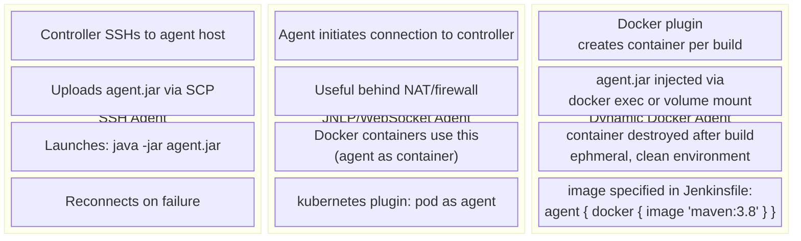

---

## 7. Plugin Architecture: Classloader Isolation

Jenkins loads each plugin in its **own classloader**, preventing dependency conflicts between plugins:

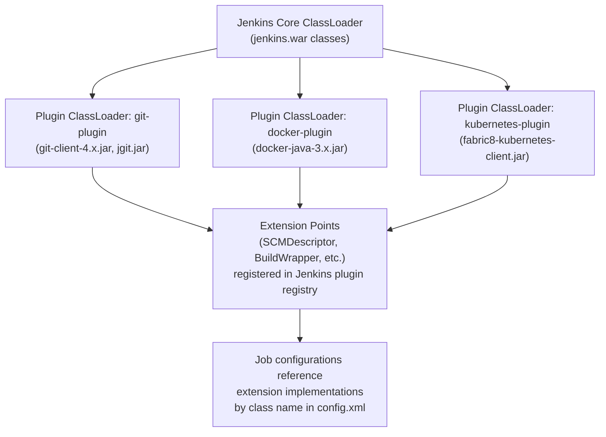

**Extension Points**: Jenkins defines interfaces like `Builder`, `Publisher`, `SCM`, `Notifier`. Plugins implement these and annotate with `@Extension` — Jenkins discovers them via `ServiceLoader`-style lookup at startup. This is how `sh` (from workflow-durable-task-step plugin), `docker.build` (from docker-workflow plugin), and `git()` (from git plugin) are all available in Pipelines.

**Plugin dependency graph**: if Plugin A requires Plugin B ≥ 2.0, Jenkins validates this at startup. Circular dependencies cause classloader deadlocks — a known Jenkins pathology.

---

## 8. SCM Polling vs Webhooks: Internal Trigger Mechanics

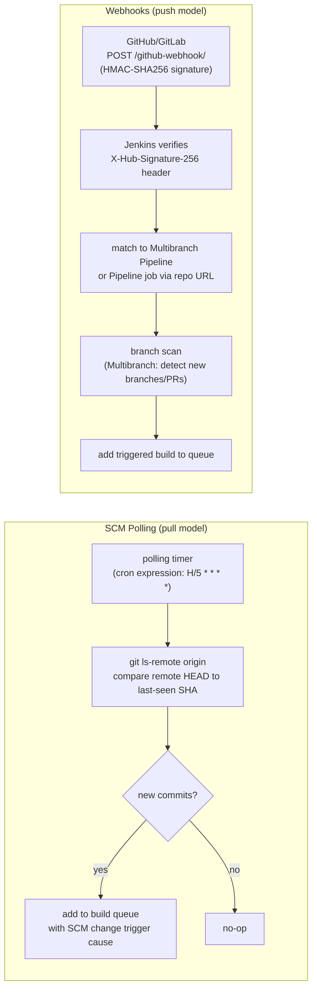

**Multibranch Pipeline** branch scanning: on webhook event, Jenkins scans the entire repository for new/deleted branches and creates/deletes corresponding pipeline jobs automatically. Each branch gets its own `jobs/repo/branches/feature-x/` directory. This is how `Jenkinsfile` in a PR branch auto-triggers a pipeline for that PR.

---

## 9. Security Model: Authentication and Authorization Internals

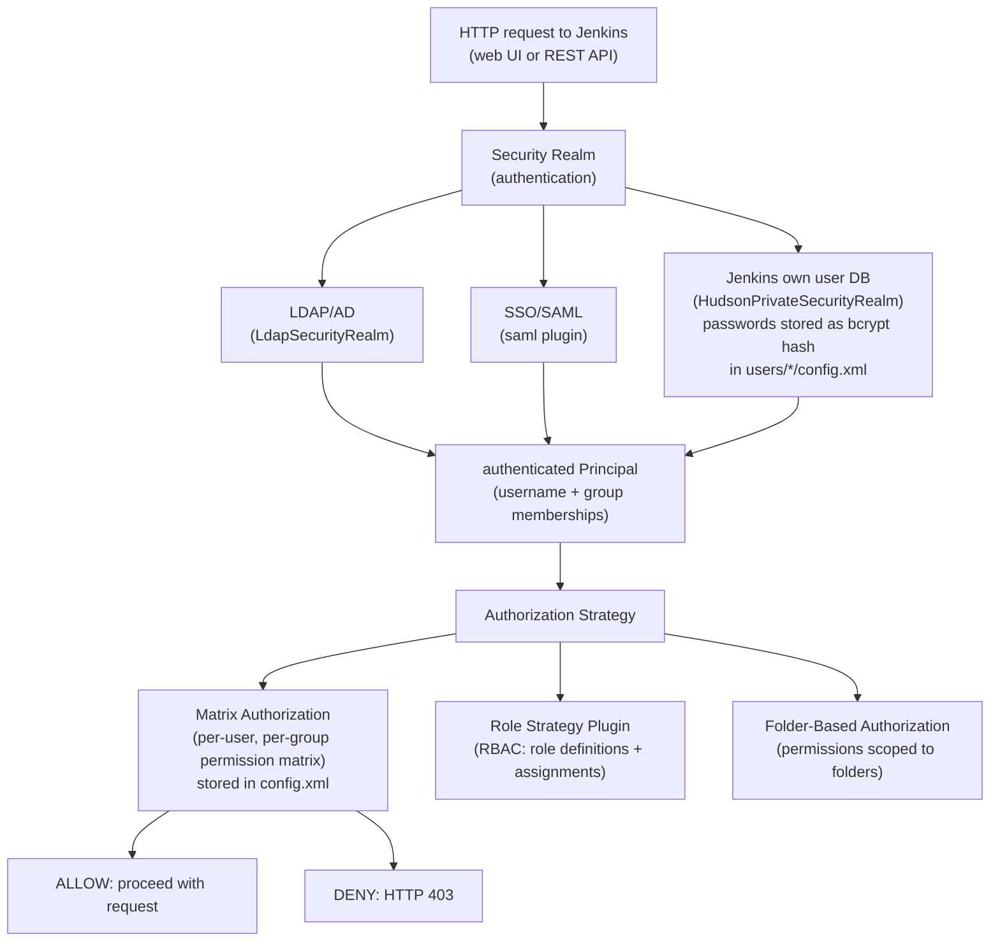

**Credential binding:** Storage and encryption depend on credential type and plugin version. `withCredentials` scopes binding and attempts console masking, but masking is not a security boundary: child processes, debug output, transformed values, temporary files, process inspection, or a malicious build can expose plaintext. Use isolated agents, least privilege, short-lived credentials, and post-build revocation evidence.

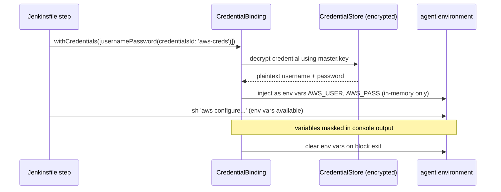

---

## 10. Build Artifact Flow: Archive and Fingerprinting

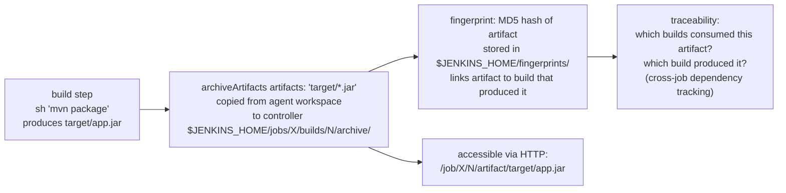

**Artifact promotion**: the `copy-artifact` plugin allows a downstream job to pull artifacts from an upstream build — Jenkins checks the fingerprint to verify the artifact came from the declared source job at the declared build number.

---

## 11. Pipeline Durability and Checkpoint Mechanism

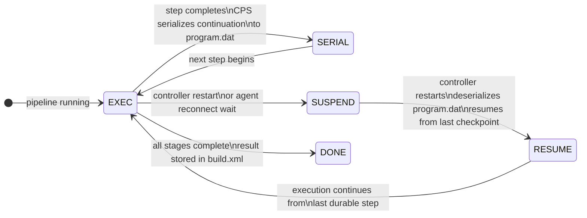

**Durable steps** (filesystem operations, `sh`, `bat`) write progress atomically. **Non-durable steps** (pure Groovy logic) may replay from checkpoint. The `PERFORMANCE_OPTIMIZED` durability hint reduces checkpoint frequency (faster builds, less resilient to crashes); `MAX_SURVIVABILITY` checkpoints after every step.

---

## 12. Full CI/CD Internal Data Flow

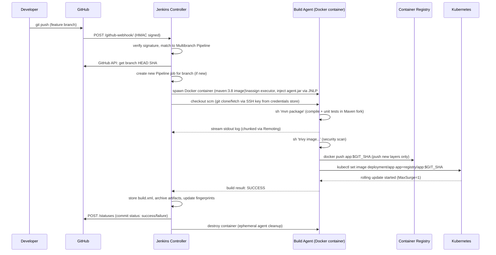

---

## 13. Blue Ocean: Visualization Layer Architecture

Blue Ocean is a Jenkins plugin that provides a React.js-based SPA over the existing Jenkins REST API — it does not change execution internals, only the UI rendering layer.

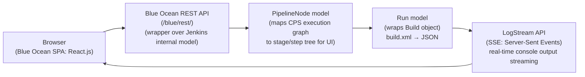

The **visual pipeline editor** in Blue Ocean serializes a Declarative Jenkinsfile AST to/from a JSON intermediate representation — edits in the GUI regenerate the Jenkinsfile text and commit it to the SCM.

---

## 14. Scaling Jenkins: Controller Bottlenecks and Mitigation

```mermaid
block-fibonacci
  columns 1
  block:BOTTLENECK["Jenkins Controller Bottlenecks"]:1
    columns 3
    B1["Build Queue: single JVM\nO(N) queue scan per poll cycle\n→ use priority queue plugin"]
    B2["Remoting channels: one TCP connection per agent\nO(N) agent connections saturate controller threads\n→ WebSocket agents, agent pools"]
    B3["$JENKINS_HOME IOPS: build history writes\nat build completion overwhelm NFS\n→ SSD-backed local storage"]
    B4["Plugin classloader: hundreds of plugins\nfull GC pauses in large JVM heaps\n→ JVM tuning: -XX:+UseG1GC -Xmx8g"]
    B5["SCM polling: H/5 * * * * × 1000 jobs\n= 200 ls-remote calls/minute to Git server\n→ replace with webhooks"]
  end
```

**CloudBees CI / Jenkins Operations Center**: addresses single-controller limits by routing builds across multiple controllers. Operations Center has a global build queue that forwards jobs to registered controllers based on label matching — similar to K8s scheduler operating across a cluster of Jenkins instances.

---

## Summary: Jenkins Internal Execution Path

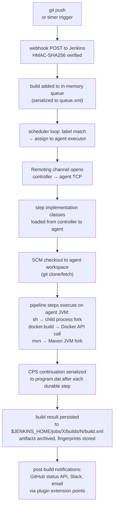

The final path is one multibranch, webhook, CPS, ephemeral-agent example. Freestyle jobs, controller executors, polling, non-durable steps, alternate agents, and plugin-specific steps take different paths; use build causes, FlowGraph, queue, node, and deployment records as completion evidence.
