# Kubernetes Orchestration Internals: Under the Hood

> Sources: *Container Management: Kubernetes vs Docker Swarm, Mesos + Marathon, Amazon ECS* (eBook); *Everything Kubernetes: A Practical Guide* (Stratoscale); *Cloud Container Engine — Kubernetes Basics* (Huawei CCE, 2025)

---

## 1. The Control Plane: etcd as the Ground Truth

Every decision Kubernetes makes flows through a single source of truth: **etcd**, a distributed key-value store implementing the **Raft consensus algorithm**. When you `kubectl apply` a manifest, the journey begins not at the scheduler or kubelet — it begins at etcd.

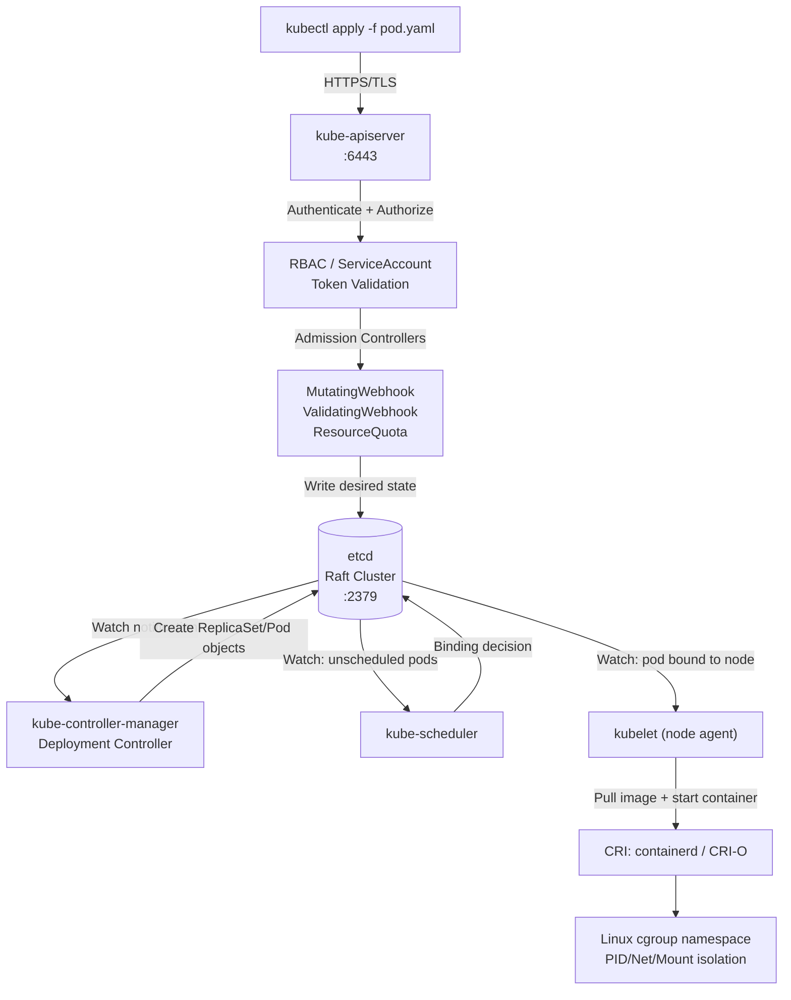

The apiserver **never** writes to the scheduler or kubelet directly. Everything is **event-driven watch loops** — each component watches etcd for objects whose state it is responsible for reconciling.

### etcd Raft Internals

etcd stores Kubernetes objects as **serialized protobuf** under keys like `/registry/pods/default/nginx-abc123`. Raft ensures that writes are committed to a quorum (⌊n/2⌋ + 1) before returning success to the API server.

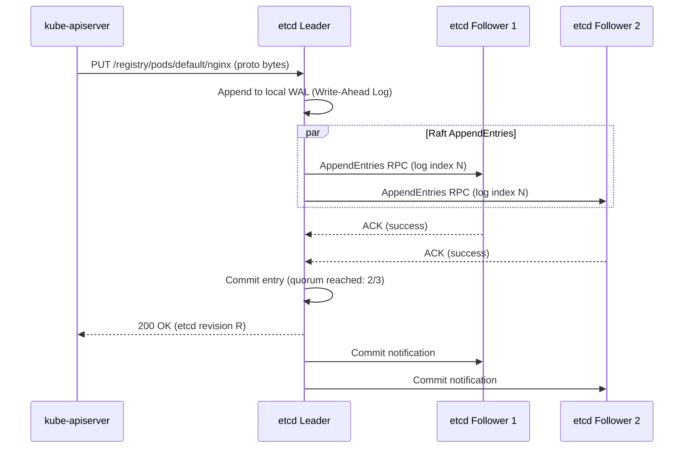

If the leader dies mid-write, Raft guarantees the partially-written entry is rolled back — the cluster elects a new leader and replays only committed log entries.

---

## 2. Scheduler Internals: Predicate and Priority Pipeline

The scheduler watches etcd for **Pending pods** (pods with no `spec.nodeName`). When found, it runs a two-phase pipeline to select a node.

```mermaid
flowchart LR
    subgraph FILTER["Phase 1: Filter (Predicates)"]
        P1["NodeResourcesFit\n(CPU/Memory requests)"]
        P2["NodeAffinity\n(label selectors)"]
        P3["PodTopologySpread\n(zone distribution)"]
        P4["TaintToleration\n(node taints)"]
        P5["VolumeBinding\n(PVC nodeAffinity)"]
    end
    subgraph SCORE["Phase 2: Score (Priorities)"]
        S1["LeastAllocated\n(spread load)"]
        S2["NodeAffinity score\n(preferred weight)"]
        S3["InterPodAffinity\n(co-location bonus)"]
        S4["ImageLocality\n(image already pulled)"]
    end
    PENDING["Pending Pod"] --> FILTER
    FILTER -->|Feasible nodes| SCORE
    SCORE -->|Highest score wins| BIND["Binding:\nPatch pod.spec.nodeName"]
    BIND --> ETCD[("etcd")]
```

**Filter phase** is O(nodes) — each predicate runs against all nodes. Infeasible nodes are eliminated immediately. **Score phase** normalizes each plugin's scores 0–100 and applies configured weights. The final score is a weighted sum.

### Resource Bin-Packing vs. Spreading

`LeastAllocated` scores nodes higher when they have *more* free resources — this spreads pods. `MostAllocated` scores nodes with *less* free resources — this bins-packs. The scheduler plugin framework lets you swap these.

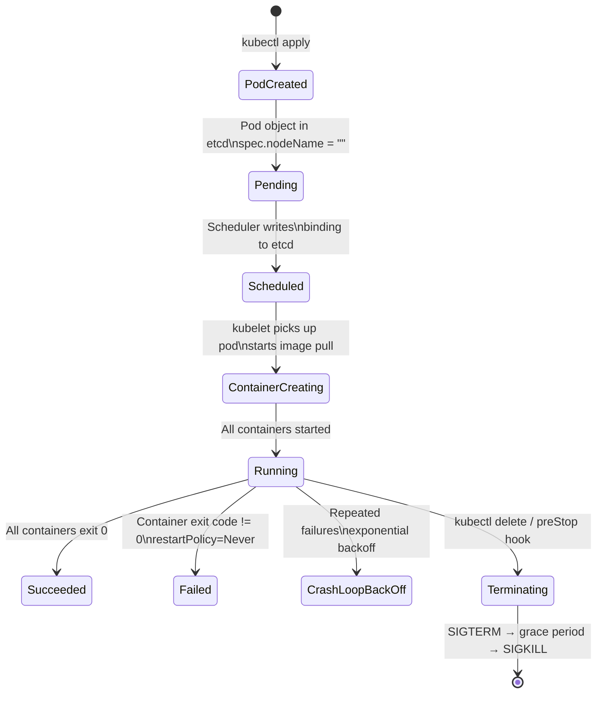

---

## 3. kubelet: The Node Agent's Internal Loop

The kubelet is the most complex component — it runs on every node and bridges the Kubernetes API with the container runtime (containerd/CRI-O) and Linux kernel.

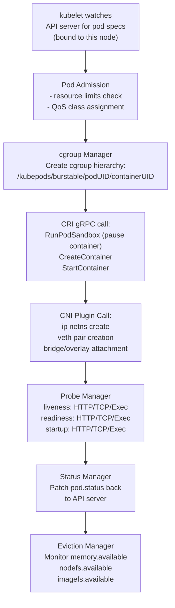

### cgroup Hierarchy for Pod QoS

Kubernetes assigns each pod a **QoS class** based on resource requests/limits:

```
/sys/fs/cgroup/memory/kubepods/
├── guaranteed/          ← requests == limits for ALL containers
│   └── pod<UID>/
│       └── <containerID>/    memory.limit_in_bytes = N
├── burstable/           ← some containers have requests < limits
│   └── pod<UID>/
│       └── <containerID>/    memory.limit_in_bytes = limit
└── besteffort/          ← no requests or limits set
    └── pod<UID>/
        └── <containerID>/    memory.limit_in_bytes = node max
```

**OOM kill order**: BestEffort pods are killed first (OOM score adj = 1000), Burstable next (score adj proportional to limit/request ratio), Guaranteed last (score adj = -998).

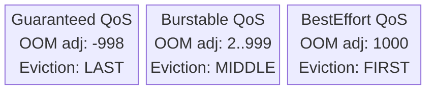

---

## 4. Container Runtime Interface (CRI): The Abstraction Layer

kubelet speaks **gRPC** to the CRI shim — it never calls Docker or containerd directly. The CRI defines two services: `RuntimeService` (pods/containers) and `ImageService` (pull/list/remove).

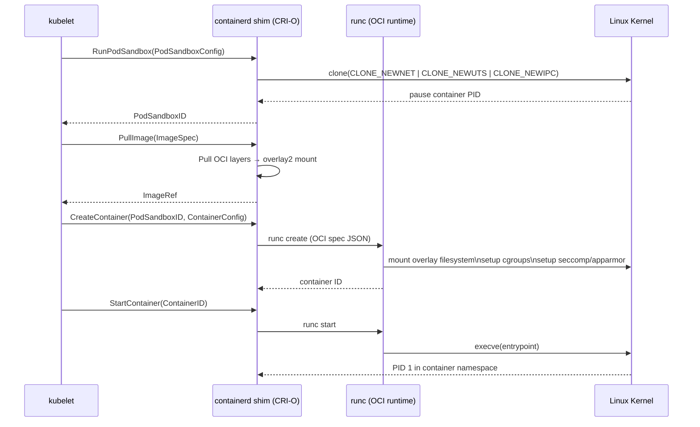

### Container Image Layers: Copy-on-Write Filesystem

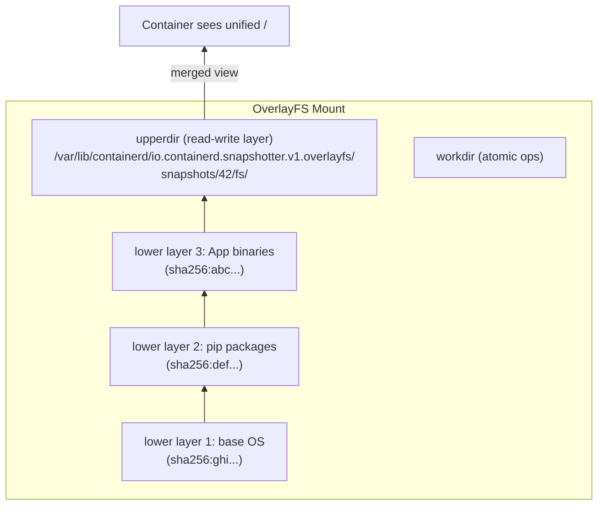

When a container writes to a read-only lower layer, the kernel performs a **copy-up**: the file is copied to `upperdir` before modification. This means first-write latency includes the copy cost.

---

## 5. Kubernetes Networking: CNI and kube-proxy

### CNI Plugin Execution Flow

When the CRI creates a pod sandbox, it calls CNI plugins via exec (not gRPC):

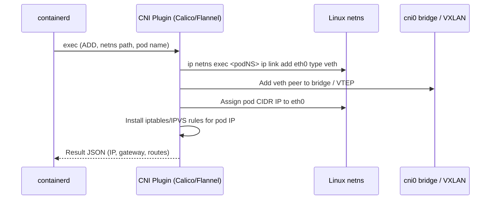

Each pod gets its own **network namespace** — a complete isolated TCP/IP stack. The `pause` container holds the namespace open so application containers can join it via `--net=container:<pause-PID>`.

### kube-proxy: Service to Pod Load Balancing

kube-proxy translates abstract Service VIPs into real pod endpoints using either **iptables** or **IPVS**:

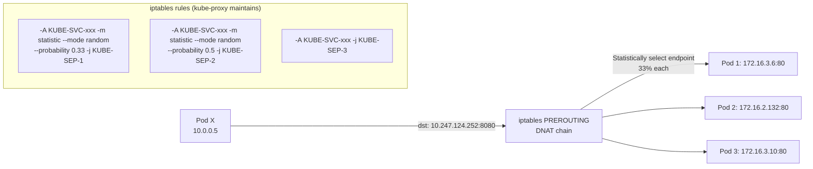

**IPVS mode** (production recommended): instead of O(n²) iptables rules, IPVS maintains a hash table in the Linux kernel virtual server module — O(1) lookup per connection regardless of service count.

### DNS Resolution Internals (CoreDNS)

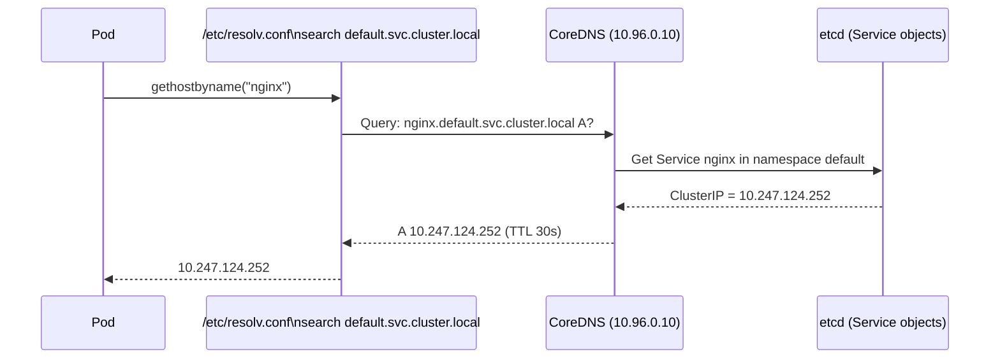

---

## 6. Controllers: The Reconciliation Loop

All Kubernetes controllers share the same architectural pattern: **informers** (cached watches) feeding **work queues**, with reconcilers running in goroutines.

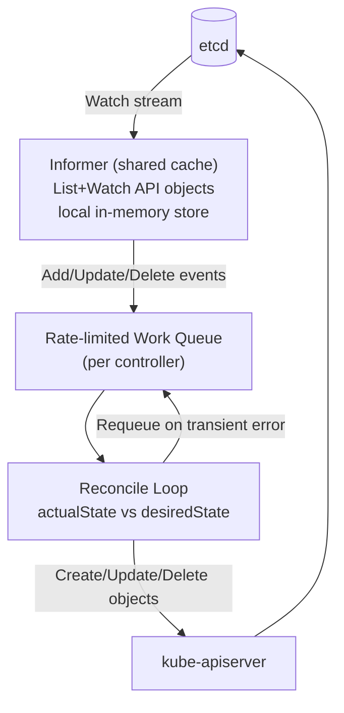

### Deployment Controller Deep Dive

When you update a Deployment's image, the Deployment Controller orchestrates a **rolling update** by managing ReplicaSets:

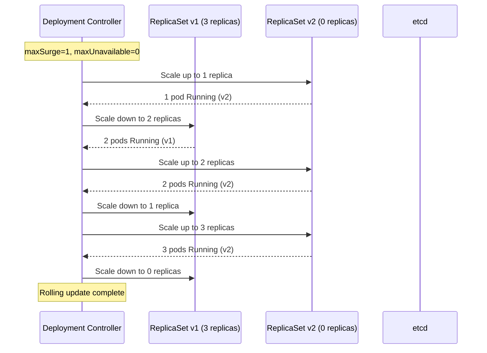

The old ReplicaSet is retained (scaled to 0) to enable `kubectl rollout undo` — which simply scales the old RS back up.

---

## 7. StatefulSets: Stable Identity for Stateful Workloads

StatefulSets differ from Deployments in three critical ways:
1. **Stable network identity**: pod-0, pod-1, pod-2 — names are deterministic
2. **Ordered operations**: pods start/stop in strict order (0→1→2 up, 2→1→0 down)
3. **Persistent volume binding**: each pod gets its own PVC bound permanently

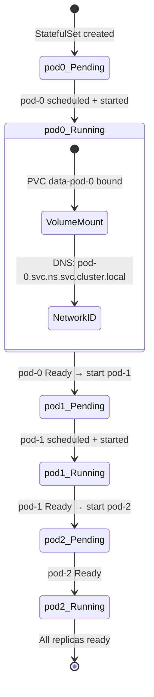

### Headless Service DNS for StatefulSets

A StatefulSet requires a **headless service** (`clusterIP: None`). CoreDNS creates A records for each pod individually:

```
pod-0.kafka.kafka-ns.svc.cluster.local → 172.16.0.10
pod-1.kafka.kafka-ns.svc.cluster.local → 172.16.0.11
pod-2.kafka.kafka-ns.svc.cluster.local → 172.16.0.12
```

Kafka brokers use these stable DNS names in their `advertised.listeners` — this is why StatefulSets are essential for stateful distributed systems.

---

## 8. Persistent Volume Subsystem: The Binding Protocol

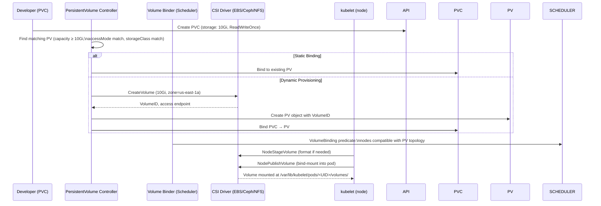

---

## 9. Kubernetes vs Competing Orchestrators

### Architecture Comparison Matrix

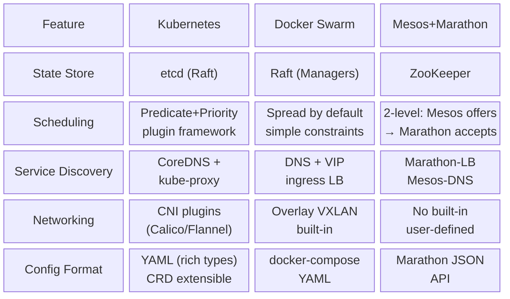

### Mesos Two-Level Scheduling

Mesos uses a **resource offer** model — fundamentally different from Kubernetes centralized scheduling:

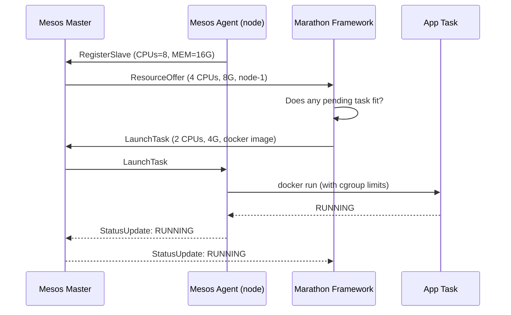

The two-level model allows **multiple independent frameworks** (Marathon, Spark, Flink) to share the same cluster resources — Mesos is a datacenter-level resource abstraction.

---

## 10. Auto Scaling Internals: HPA and VPA

### Horizontal Pod Autoscaler (HPA) Control Loop

```mermaid
flowchart TD
    METRICS["metrics-server\nCPU/memory from kubelet\nCustom metrics from Prometheus adapter"] --> HPA["HPA Controller\n(reconcile every 15s)"]
    HPA -->|desiredReplicas = ceil(current × metric/target)| CALC["Scale Decision\nmin/max clamp applied"]
    CALC -->|scale up immediately| DEPLOY["Deployment / ReplicaSet"]
    CALC -->|scale down: wait 5min cooldown| DEPLOY
    DEPLOY --> PODS["Pod count changes"]
    PODS --> METRICS

    subgraph FORMULA["HPA Scaling Formula"]
        F1["desiredReplicas =\nceil(currentReplicas × (currentMetricValue / desiredMetricValue))"]
        F2["e.g.: 3 pods × (80% CPU / 50% target) = ceil(4.8) = 5 pods"]
    end
```

### RBAC Authorization: Token Flow

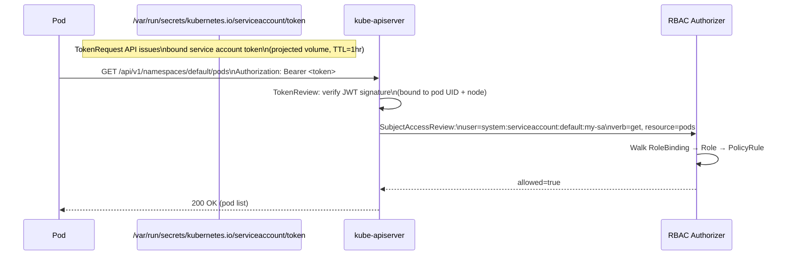

---

## 11. Ingress: External Traffic Routing

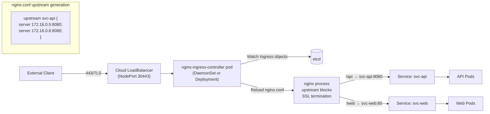

The ingress controller watches Ingress objects via informer; each add/update triggers nginx config regeneration and a graceful reload (`nginx -s reload` — no connection drops via master/worker hot-reload).

---

## 12. Node Failure and Pod Rescheduling

```mermaid
sequenceDiagram
    participant NODE as Worker Node
    participant KL as kubelet (on node)
    participant API as kube-apiserver
    participant NCM as Node Controller

    KL->>API: NodeHeartbeat (every 10s)
    Note over NODE: Node crashes / network partition
    NCM->>NCM: No heartbeat for 40s (node-monitor-grace-period)
    NCM->>API: Patch node.status.conditions:\nReady=Unknown
    NCM->>NCM: Wait 5min (pod-eviction-timeout)
    NCM->>API: Delete pods on Unknown node
    API->>ETCD: Delete pod objects
    SCHED["kube-scheduler"]-->API: Watch: pods Pending (no node)
    SCHED->>SCHED: Filter/Score healthy nodes
    SCHED->>API: Bind pod → new node
    API->>ETCD: Update pod.spec.nodeName
    KUBELET2["kubelet (new node)"]-->API: Watch: pod bound to me
    KUBELET2->>CRI2["containerd (new node)"]: Start containers
```

The 5-minute default eviction timeout means a node failure takes ~6 minutes to detect + reschedule. Tuning `node-monitor-period`, `node-monitor-grace-period`, and `pod-eviction-timeout` trades false-positive evictions against recovery speed.

---

## Summary: Data Flow Map

```mermaid
flowchart TD
    USER["User / CI System"] -->|kubectl / GitOps| API["kube-apiserver\n(validation + auth)"]
    API <-->|Read/Write proto| ETCD[("etcd cluster\nRaft consensus")]
    ETCD -->|Watch events| CTRL["Controller Manager\n(Deployment/RS/StatefulSet/Job)"]
    ETCD -->|Watch unscheduled pods| SCHED["Scheduler\n(filter + score)"]
    SCHED -->|Binding| ETCD
    ETCD -->|Watch node's pods| KUBELET["kubelet (per node)"]
    KUBELET -->|gRPC CRI| CONTAINERD["containerd"]
    CONTAINERD -->|OCI spec| RUNC["runc → Linux namespaces\ncgroups, seccomp"]
    KUBELET -->|exec| CNI["CNI plugin\n(network namespace)"]
    KUBELET -->|Probe HTTP/TCP| APP["Application containers"]
    KUBELET -->|Status patch| API
    API -->|Watch services| KPROXY["kube-proxy\n(iptables/IPVS)"]
    KPROXY -->|Route packets| APP
```

Every API call is authenticated, authorized, admitted, persisted to etcd, and then propagated through watch streams to the relevant controllers and node agents — no component holds authoritative state except etcd.
