# Distributed Computing: Principles, Algorithms, and Systems — Under the Hood

> Source: *Distributed Computing: Principles, Algorithms, and Systems* — Ajay D. Kshemkalyani & Mukesh Singhal, Cambridge University Press, 2008 (756 pages)

---

> **Reading contract:** This is a theory-oriented reading of a 2008 textbook for readers who can track system and fault models. Every theorem or message bound must name synchrony, channel reliability and ordering, membership, crash or Byzantine faults, authentication, quorum construction, and termination assumptions. Proof sketches are **derivations**; product mappings and round-trip counts are **examples**. A protocol is complete only with safety and liveness arguments, recovery state, retry/idempotency rules, and fault-injection evidence for the claimed model. Outside that model, retain the result as unproven rather than extending it by analogy.

## 1. The Distributed Execution Model: Events, Causality, and Global State

A distributed system is not a sequential machine. There is no global clock — each process has its own local clock and communicates only by message passing. The fundamental unit of analysis is an **event**: a local computation, a send, or a receive.

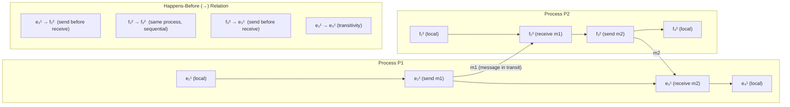

**Lamport's happens-before** (→) is a partial order — not all event pairs are comparable. Two events `a` and `b` are **concurrent** (a ∥ b) if neither `a → b` nor `b → a`. This is the root cause of distributed system complexity: concurrent events cannot be linearized without coordination.

---

## 2. Logical Clocks: Assigning Timestamps Without a Global Clock

### Lamport Scalar Clocks

Each process `Pi` maintains a counter `C[i]`. The rules:
1. Before every event: `C[i] += 1`
2. On send: piggyback `C[i]` in message
3. On receive(msg with timestamp `t`): `C[i] = max(C[i], t) + 1`

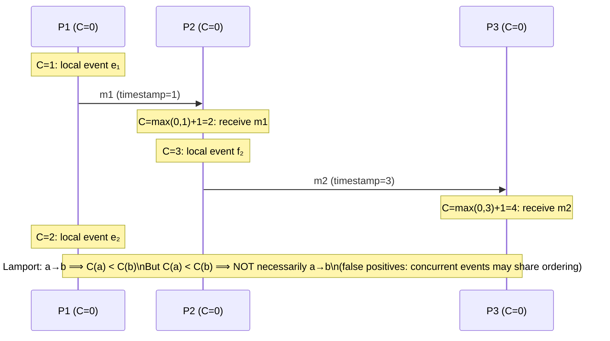

**Limitation**: Scalar clocks cannot detect concurrency. If `C(a) < C(b)`, it could mean `a → b` OR `a ∥ b`.

### Vector Clocks: Capturing Full Causality

Process `Pi` maintains vector `VC[i][1..n]`. Rules:
1. Before event at `Pi`: `VC[i][i] += 1`
2. On send: piggyback entire vector `VC[i]`
3. On receive at `Pi` from `Pj` with timestamp `VT`: `VC[i][k] = max(VC[i][k], VT[k])` for all k, then `VC[i][i] += 1`

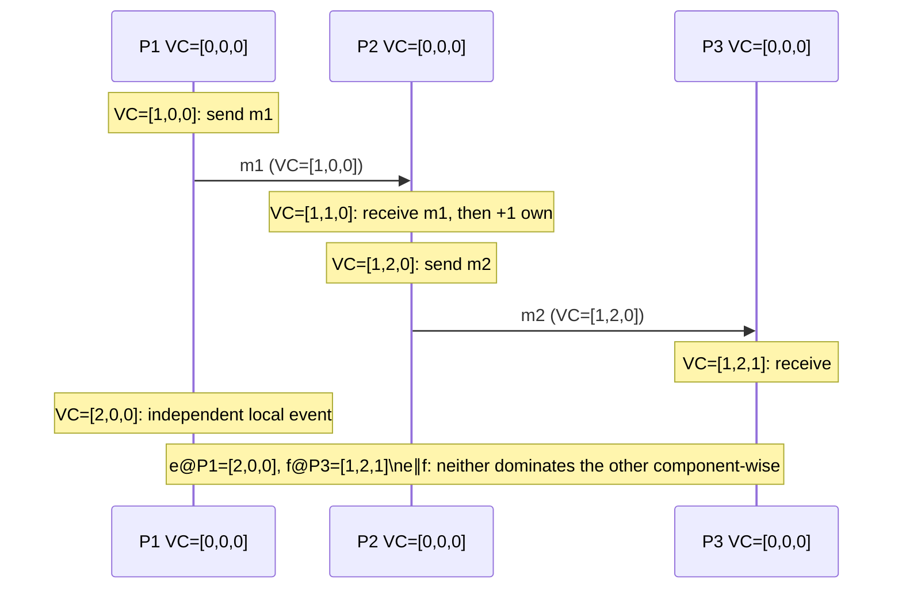

**Vector clock comparison**: `VC(a) < VC(b)` iff `VC(a)[k] ≤ VC(b)[k]` for all k and strict for at least one. This is a **necessary and sufficient** condition for `a → b`. Concurrent events are detected when neither dominates.

---

## 3. Global State and Consistent Cuts

A **global state** is a tuple of local process states and channel states. A **consistent cut** is a global state where for every message received, the corresponding send is also included.

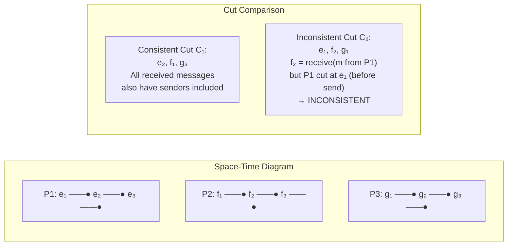

### Chandy-Lamport Snapshot Algorithm

Records a consistent global state without freezing the system:

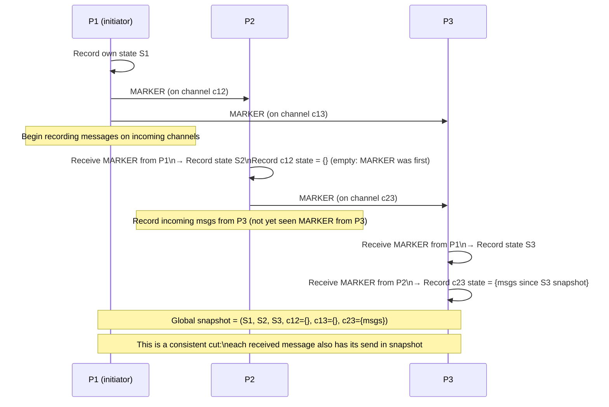

**Key insight**: The MARKER acts as a timestamp separator. Everything before the MARKER on a channel belongs to the snapshot; everything after does not. The algorithm is non-intrusive — normal computation continues.

---

## 4. Distributed Mutual Exclusion: Algorithms and Complexity

### Lamport's Algorithm (1978)

Uses Lamport clocks to totally order requests. Every site maintains a request queue sorted by `(timestamp, site_id)`.

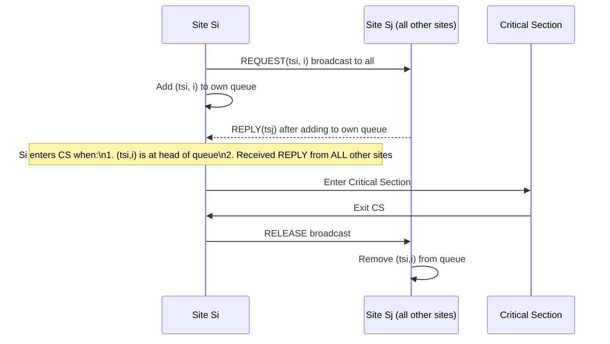

**Message complexity**: 3(N-1) messages per CS entry (N-1 REQUESTs + N-1 REPLYs + N-1 RELEASEs). **Synchronization delay**: T (one message round trip).

### Ricart-Agrawala Algorithm (1981): Optimized

Eliminates explicit RELEASE messages by merging them into deferred REPLYs:

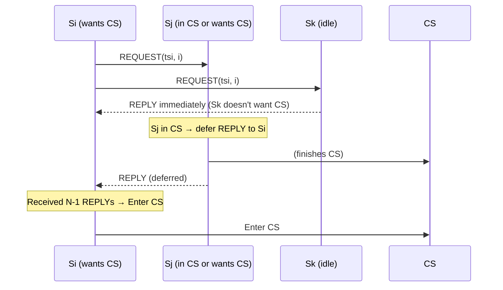

**Message complexity**: 2(N-1) messages (N-1 REQUESTs + N-1 REPLYs). **Correctness**: Total order on requests via timestamps ensures no two sites are in CS simultaneously.

### Maekawa's Quorum-Based Algorithm: √N Messages

Instead of broadcasting to all N sites, each site broadcasts to only its **quorum set** of size ~√N:

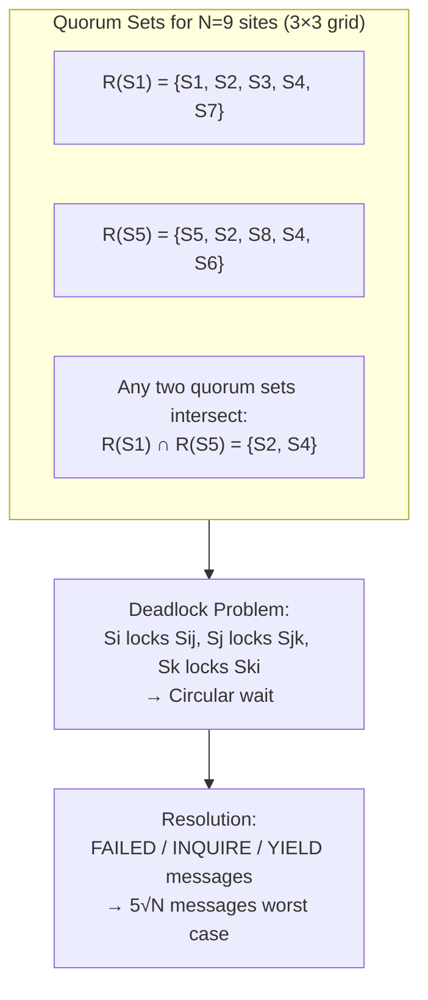

**Why quorums guarantee safety**: Any two quorum sets must intersect — so two sites can never simultaneously hold locks on disjoint sets. The intersection site acts as the "common voter" serializing access.

---

## 5. Deadlock Detection: Wait-For Graphs

### Centralized Deadlock Detection

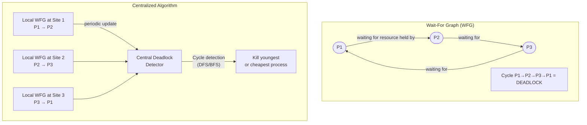

### Chandy-Misra-Haas Algorithm for Distributed Deadlock (AND model)

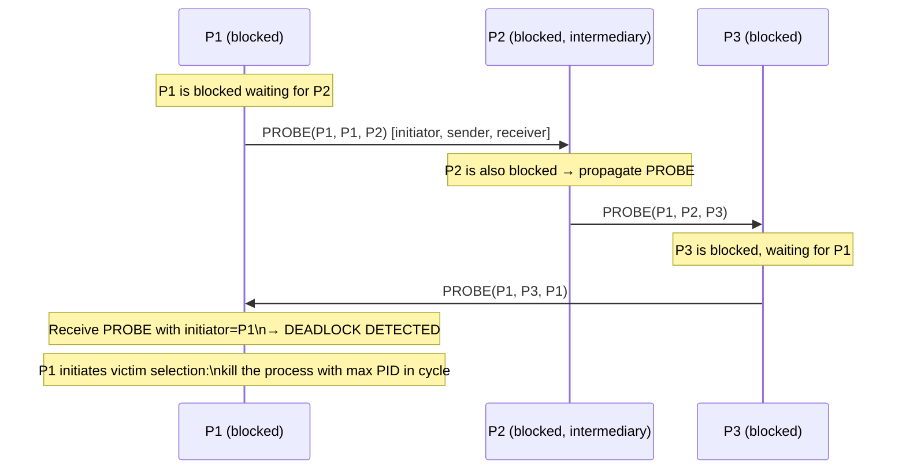

**Complexity**: O(e) messages where e = edges in WFG. Probes propagate along waiting edges — the PROBE returns to its initiator only if there is a cycle.

---

## 6. Consensus and Agreement: The FLP Impossibility

The **Fischer-Lynch-Paterson (FLP) impossibility theorem** (1985) is the most important result in distributed systems theory:

> **FLP scope:** No deterministic consensus protocol can guarantee termination in every admissible execution of a fully asynchronous message-passing system with even one possible crash failure. The result does not say safety is impossible or that practical protocols never terminate under added timing assumptions.

```mermaid
stateDiagram-v2
    [*] --> BIVALENT_INITIAL: Initial state\n(some process may crash)
    BIVALENT_INITIAL --> DECISION_ATTEMPT: Execute one step
    DECISION_ATTEMPT --> BIVALENT_AGAIN: Step taken by potentially\ncrashed process — indistinguishable\nfrom live-but-slow process
    BIVALENT_AGAIN --> DECISION_ATTEMPT: Repeat forever
    note right of BIVALENT_AGAIN: Bivalent = both 0 and 1\nstill reachable\n\nMonovalent = only 0 or 1\nreachable (decided)\n\nFLP: Can never deterministically\ntransition bivalent→monovalent\nin async system with failures
```

**Why this matters**: Any system claiming Byzantine/crash fault tolerance in an asynchronous network must either:
1. Use **randomization** (Randomized consensus, Ben-Or algorithm)
2. Use **partial synchrony** assumptions (Paxos, Raft — assume messages eventually arrive)
3. Solve a **weaker problem** (k-set consensus, approximate agreement)

### Paxos: Consensus Under Partial Synchrony

Paxos assumes **eventually synchronous** channels — messages may be delayed but eventually arrive. It uses two phases:

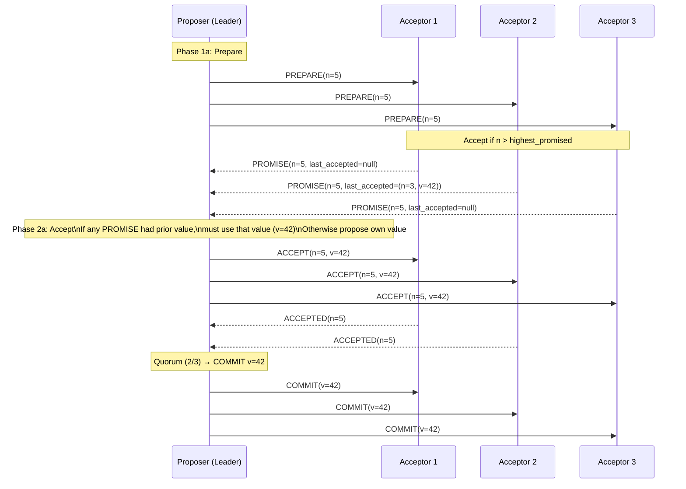

**Why Phase 1b must return the highest prior accepted value**: If an acceptor has already accepted value `v` in a prior round, there may be a quorum that has committed `v`. The new proposer must preserve this value to prevent two different values being committed in different rounds.

### Raft: Understandable Paxos

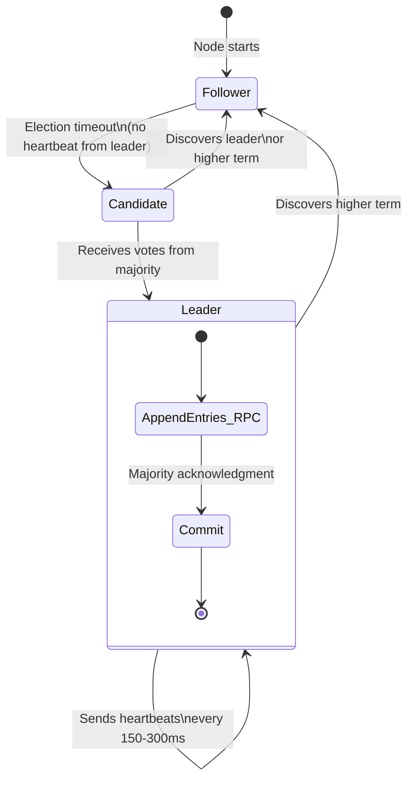

**Raft log commitment:** Majority replication is necessary, but the current leader advances commit through the Raft commitment rules, including the restriction on directly committing entries from prior terms. Client reply timing is an implementation contract. Uncommitted entries may be overwritten; committed-entry durability still assumes the Raft storage and membership model.

---

## 7. Failure Detectors: The Theory Behind Heartbeats

Chandra and Toueg (1996) formalized **failure detectors** as oracle modules:

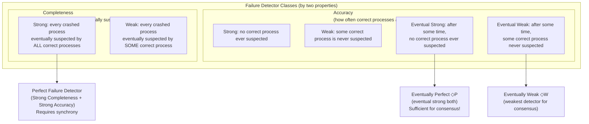

**Theorem (Chandra-Toueg)**: Consensus is solvable with failure detector class `◇W` (eventually weak) even in asynchronous systems. This justifies why Zookeeper, etcd, and Raft can solve consensus despite the FLP impossibility — they use timeouts (implementing `◇P`) and accept false suspicions temporarily.

### Phi Accrual Failure Detector (used in Akka, Cassandra)

Instead of binary "alive/dead", outputs a suspicion level φ:

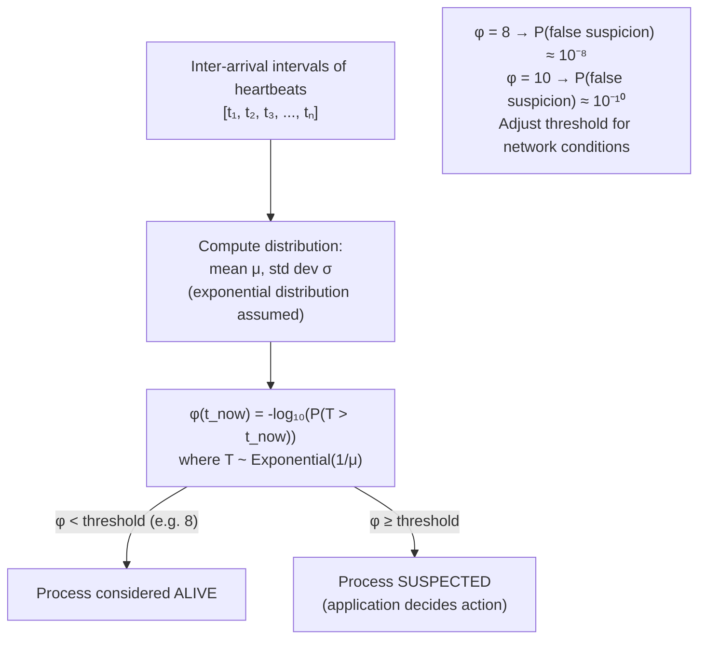

---

## 8. Distributed Transactions: 2PC and 3PC Internals

### Two-Phase Commit (2PC): Blocking Protocol

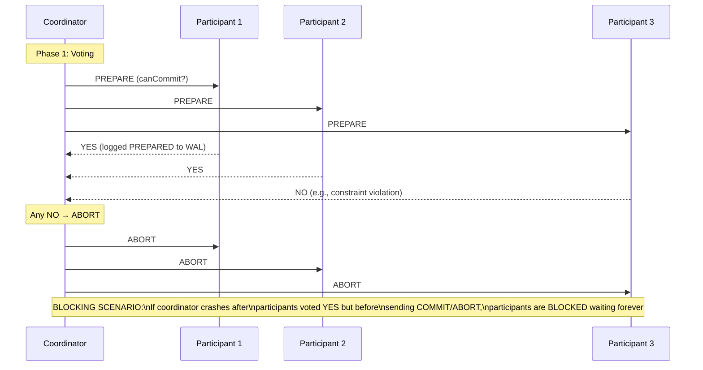

**2PC blocking problem**: A participant that has voted YES is uncertain — it cannot unilaterally abort (another participant may have committed) nor commit (another may have aborted). It must wait for the coordinator to recover.

### Three-Phase Commit (3PC): Non-Blocking

3PC adds a **pre-commit** phase that allows participants to detect coordinator failure and safely commit:

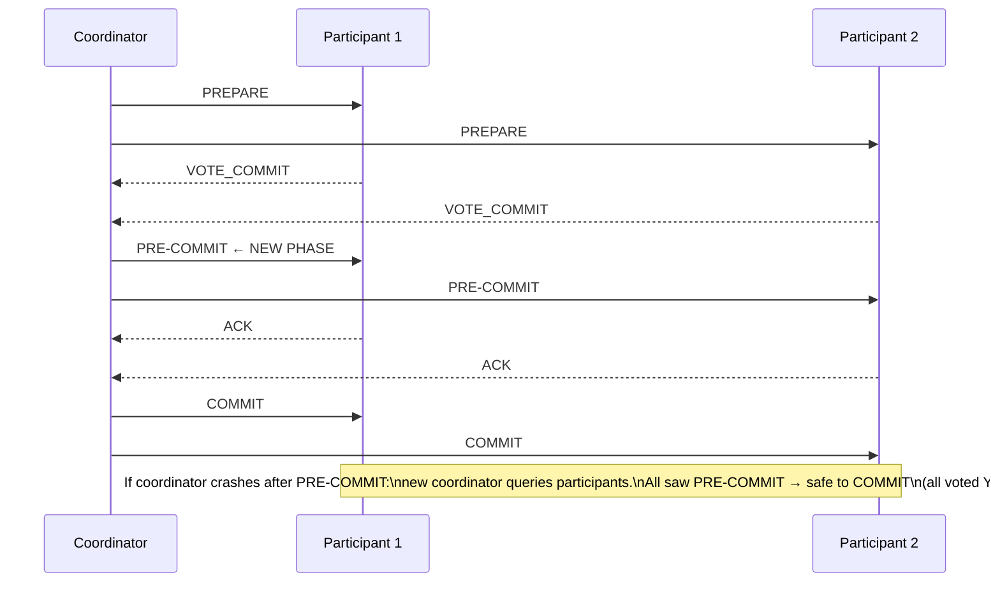

**Non-blocking scope:** 3PC's non-blocking argument requires bounded-delay or failure-detection assumptions and no partition that makes states indistinguishable. A bound on the number of crashes alone is insufficient. The pre-commit phase does not make arbitrary partitioned executions safe.

---

## 9. Peer-to-Peer Overlay Networks: Chord DHT Internals

### Consistent Hashing Ring

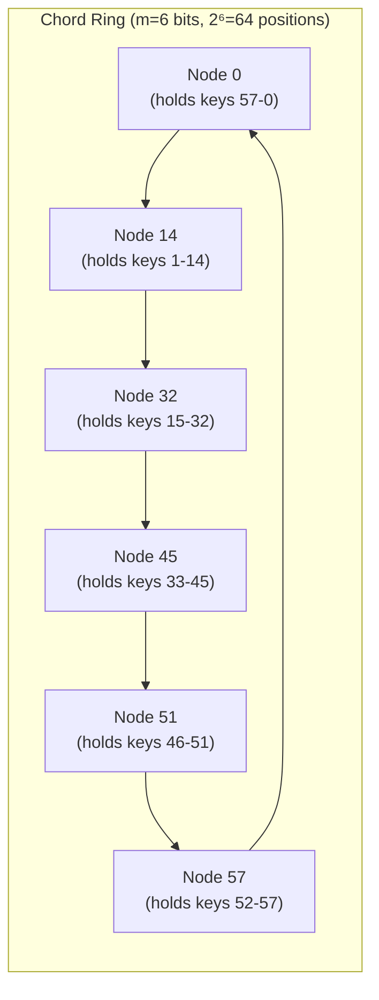

### Chord Finger Table: O(log N) Lookup

Each node `n` maintains a finger table where `finger[i] = successor(n + 2^(i-1) mod 2^m)`:

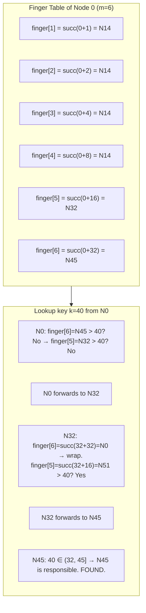

**Lookup complexity**: O(log N) hops with O(log N) finger table entries per node. When a node joins, it needs to update at most O(log² N) other nodes' finger tables.

---

## 10. Spanning Trees and Broadcast/Convergecast

Distributed algorithms for information dissemination rely on **spanning trees** — tree overlays connecting all processes with no cycles.

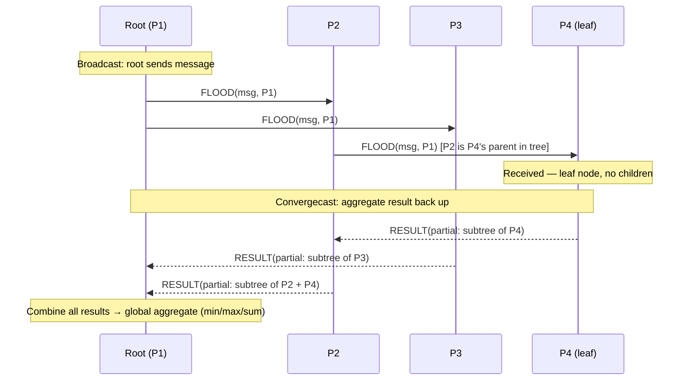

**Message complexity**: Broadcast = O(n) messages on tree. Convergecast = O(n) messages. Building the spanning tree = O(m + n log n) messages (Gallagher-Humblet-Spira MST algorithm).

---

## 11. Byzantine Fault Tolerance: Dealing with Liars

In the classic unauthenticated Byzantine agreement model, tolerating up to `f` arbitrary faulty processes requires `n ≥ 3f + 1`. Authentication, synchrony, quorum and protocol assumptions can change the exact resilience statement.

```mermaid
sequenceDiagram
    participant G as General (Commander)
    participant L1 as Lieutenant 1 (loyal)
    participant L2 as Lieutenant 2 (loyal)
    participant T as Traitor

    G->>L1: ATTACK
    G->>L2: ATTACK
    G->>T: ATTACK

    T->>L1: (claims General said) RETREAT
    T->>L2: (claims General said) ATTACK

    Note over L1: Received: ATTACK (from G), RETREAT (from T)\nMajority of 3 loyal process values → ?

    Note over L1,L2: With n=4, f=1: n ≥ 3(1)+1=4 ✓\nAlgorithm: OM(m) runs m+1 rounds\nwhere m = number of traitors\nEach loyal Lt eventually decides on majority vote
```

**Why n ≥ 3f + 1**: With n = 3f, the f traitors can confuse the 2f loyal generals into a tie. The extra f+1 loyal generals provide the decisive majority.

### Practical BFT: PBFT Protocol

```mermaid
sequenceDiagram
    participant CLIENT as Client
    participant PRIMARY as Primary Replica
    participant R1 as Replica 1
    participant R2 as Replica 2
    participant R3 as Replica 3 (faulty)

    CLIENT->>PRIMARY: Request(op)
    Note over PRIMARY: Phase 1: Pre-prepare
    PRIMARY->>R1: PRE-PREPARE(v, n, digest(m))
    PRIMARY->>R2: PRE-PREPARE(v, n, digest(m))
    PRIMARY->>R3: PRE-PREPARE(v, n, digest(m))

    Note over R1,R3: Phase 2: Prepare (multicast to all)
    R1->>R2: PREPARE(v, n, digest, i=1)
    R2->>R1: PREPARE(v, n, digest, i=2)
    R3--xR1: PREPARE (faulty: wrong digest)

    Note over R1: Received 2f PREPARE msgs → PREPARED
    Note over R1,R3: Phase 3: Commit
    R1->>R2: COMMIT(v, n, digest, i=1)
    R2->>R1: COMMIT(v, n, digest, i=2)
    Note over R1: 2f+1 COMMIT msgs → EXECUTE and REPLY to client
    R1-->>CLIENT: Reply(result)
    R2-->>CLIENT: Reply(result)

    Note over CLIENT: Accept reply after f+1 identical replies\n(guarantees at least one reply from honest replica)
```

**PBFT complexity**: O(n²) messages per request (all replicas multicast to all). This limits PBFT to small replica counts (~dozens). Modern systems like HotStuff reduce this to O(n) via threshold signatures.

---

## 12. Distributed Shared Memory and Memory Consistency Models

```mermaid
flowchart TD
    subgraph MODELS["Memory Consistency Models (weakest to strongest)"]
        EVENTUAL["Eventual Consistency\nReplicas diverge temporarily\n→ eventually converge (DNS, DynamoDB)"]
        CAUSAL["Causal Consistency\nCausally related writes seen in order\nConcurrent writes may differ (COPS)"]
        SEQUENTIAL["Sequential Consistency\n(Lamport)\nAll processes see same total order\nNot necessarily real-time"]
        LINEARIZABLE["Linearizability\n(Herlihy-Wing)\nSequential + real-time order\netcd, Zookeeper, Spanner"]
    end
    EVENTUAL --> CAUSAL --> SEQUENTIAL --> LINEARIZABLE
    LINEARIZABLE -->|"Higher cost\n(requires coordination)"| PERF["Lower Performance"]
    EVENTUAL -->|"Lower cost\n(async replication)"| PERF2["Higher Performance"]
```

### CAP Theorem Internals

```mermaid
flowchart TD
    CAP["CAP Theorem:\nIn the presence of network Partition,\nchoose Consistency OR Availability\n(but not both)"]

    subgraph CA["CP Systems (Consistent + Partition-tolerant)"]
        ETCd["etcd/ZooKeeper\n(Raft/Paxos)\nRejects writes if no quorum\n→ Unavailable during partition"]
        SPANNER["Google Spanner\n(TrueTime + Paxos)\nStrongly consistent,\nbut can't serve during partition"]
    end

    subgraph AP["AP Systems (Available + Partition-tolerant)"]
        CASSANDRA["Apache Cassandra\n(Eventual consistency)\nAlways accepts writes\nReads may see stale data"]
        DYNAMO["Amazon DynamoDB\n(tunable consistency)\nSloppy quorums allow divergence"]
    end

    CAP --> CA
    CAP --> AP
```

---

## 13. Complete Data Flow: Message Through a Distributed System

```mermaid
sequenceDiagram
    participant CLIENT as Client
    participant LB as Load Balancer
    participant SVC_A as Service A (replica 1)
    participant SVC_A2 as Service A (replica 2)
    participant DB_COORD as DB Coordinator (Paxos leader)
    participant DB_F1 as DB Follower 1
    participant DB_F2 as DB Follower 2

    CLIENT->>LB: HTTP Request
    LB->>SVC_A: Forward (round-robin)

    SVC_A->>DB_COORD: BEGIN TRANSACTION\nWRITE(key=k, val=v)
    DB_COORD->>DB_F1: AppendEntries(log entry)
    DB_COORD->>DB_F2: AppendEntries(log entry)
    DB_F1-->>DB_COORD: ACK (quorum: 2/3)
    DB_COORD->>DB_COORD: Commit (mark durable in WAL)
    DB_COORD-->>SVC_A: COMMIT OK (with vector clock VC=[5,3,2])

    SVC_A-->>CLIENT: 200 OK

    Note over SVC_A2: Lagging replica\nVC=[5,2,2] (not yet seen entry)
    CLIENT->>LB: Read same key
    LB->>SVC_A2: Forward
    SVC_A2->>DB_F2: READ(k)
    DB_F2-->>SVC_A2: Old value (DB_F2 not yet applied commit)
    Note over SVC_A2: Stale read — AP/eventual consistency\nFor strong consistency: SVC_A2 must\nread from leader (DB_COORD)
```

---

## Summary: Complexity Landscape

```mermaid
block-beta
    columns 3
    H1["Algorithm"]:1 H2["Messages per Operation"]:1 H3["Synchronization Delay"]:1
    R1["Lamport ME"]:1 M1["3(N-1)"]:1 D1["T (one round trip)"]:1
    R2["Ricart-Agrawala"]:1 M2["2(N-1)"]:1 D2["T"]:1
    R3["Maekawa Quorum"]:1 M3["5√N (with deadlock)"]:1 D3["2T"]:1
    R4["Paxos Consensus"]:1 M4["4(N-1) typical"]:1 D4["2 round trips"]:1
    R5["PBFT Byzantine"]:1 M5["O(N²)"]:1 D5["3 round trips"]:1
    R6["Chord Lookup"]:1 M6["O(log N) hops"]:1 D6["O(log N) × T"]:1
    R7["Chandy-Lamport Snapshot"]:1 M7["O(e) — one per channel"]:1 D7["Non-blocking"]:1
```

Stronger guarantees often add coordination, messages, or latency under the same fault and workload model, but batching, locality, hardware and weaker baseline implementations can change measured performance. The table is a model-specific comparison, not a universal ranking of etcd, Kafka, Cassandra, or ZooKeeper.
