# Distributed Systems: Under the Hood
> Sources: Coulouris et al. *Distributed Systems: Concepts and Design (5th Ed.)* · Kshemkalyani & Singhal *Distributed Computing: Principles, Algorithms, and Systems*

---

## 1. The Fundamental Problem: No Shared Clock, No Shared Memory

A distributed system is a collection of autonomous processes connected by a network where **no process has direct access to another's memory** and **no global clock exists**. Every "fact" one process knows about another is inherently stale — the state observed was true at message-send time, not at message-receive time.

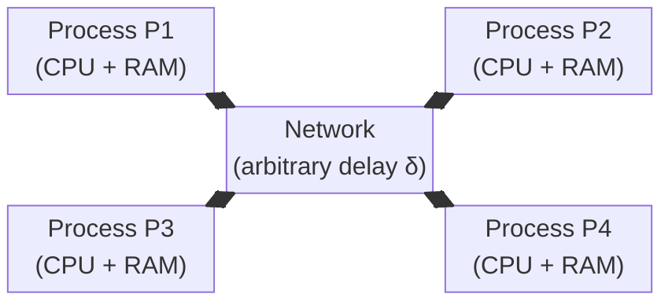

Three fundamental impossibilities define the design space:
- **FLP Impossibility**: No deterministic algorithm can solve consensus in an asynchronous system with even one crash failure
- **CAP Theorem**: A distributed store cannot simultaneously guarantee Consistency, Availability, and Partition-tolerance
- **Two Generals Problem**: No protocol over an unreliable channel can guarantee coordinated action with certainty

---

## 2. Logical Time: Imposing Order Without a Global Clock

### 2.1 Lamport Scalar Clocks

Lamport (1978) observed that processes don't need wall-clock agreement — they need **causal order**. The *happens-before* relation `→` captures this:

- `e → f` if `e` and `f` are in the same process and `e` occurs before `f`  
- `e → f` if `e` sends a message and `f` receives it  
- `e → f` if there exists `g` such that `e → g → f`

**Scalar clock algorithm:**
```
On local event: LC[i]++
On send(m):     LC[i]++; attach LC[i] to m
On receive(m):  LC[i] = max(LC[i], m.ts) + 1
```

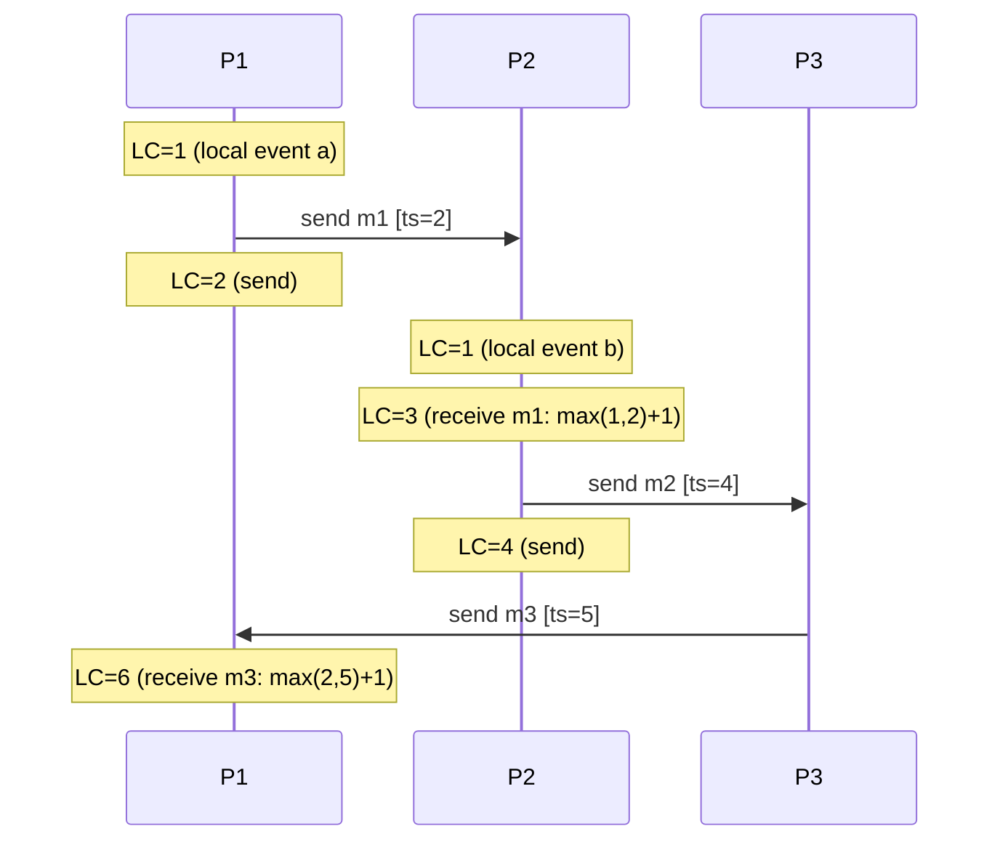

**Critical limitation**: `LC(e) < LC(f)` does **not** imply `e → f`. Concurrent events can have any scalar timestamp ordering.

### 2.2 Vector Clocks: Capturing Causality Precisely

Each process maintains a vector `VC[1..n]`. Rule: `VC[i][i]++` on every event; piggyback full vector on messages; on receive, take component-wise maximum then increment own component.

```mermaid
flowchart LR
  subgraph P1["Process 1"]
    A["a: VC=[1,0,0]"] --> B["b: VC=[2,0,0]"]
    B --> C["c (recv m2): VC=[3,2,1]"]
  end
  subgraph P2["Process 2"]
    D["d: VC=[0,1,0]"] --> E["e (send m2): VC=[0,2,0]"]
    E --> F["f: VC=[0,3,0]"]
  end
  subgraph P3["Process 3"]
    G["g: VC=[0,0,1]"] --> H["h (send m1 to P2): VC=[0,0,2]"]
  end
  H -->|m1 [0,0,2]| D
  E -->|m2 [0,2,0]| C
```

**Causal comparison**: `VC(e) ≤ VC(f)` iff `∀k: VC(e)[k] ≤ VC(f)[k]`.  
Now `e → f` iff `VC(e) < VC(f)` (strictly less in at least one component, ≤ in all).  
Concurrent: `VC(e) ∥ VC(f)` — neither dominates.

### 2.3 Matrix Clocks: Tracking What Others Know

Process `i` maintains `MC[n][n]`. `MC[i][j]` = what process `i` knows about process `j`'s clock. Enables garbage collection of causal logs: a message `m` from `j` can be discarded at `i` when `MC[k][j] ≥ ts(m)` for all `k`.

---

## 3. Global State and Consistent Cuts

### 3.1 The Snapshot Problem

A **consistent global snapshot** is a collection of local states `{S1, S2, ..., Sn}` such that no message is "in flight" from after a state was recorded by the sender to before it was recorded by the receiver.

**Chandy-Lamport Algorithm** (assumes FIFO channels):

```mermaid
sequenceDiagram
    participant P1 as Initiator P1
    participant P2
    participant P3
    Note over P1: Record local state S1
    P1->>P2: MARKER (on all output channels)
    P1->>P3: MARKER
    Note over P2: On 1st MARKER receipt:<br/>Record S2; start recording<br/>channel from P3
    P2->>P3: MARKER (forward)
    Note over P3: On 1st MARKER receipt:<br/>Record S3; start recording<br/>channel from P1 and P2
    Note over P2: On MARKER from P3:<br/>Stop recording that channel
    Note over P3: On MARKER from P2:<br/>Stop recording that channel
```

The channel state = messages received after initiator started but before MARKER arrived on that channel. This captures the **in-transit** messages in a causally consistent manner.

---

## 4. Consensus: Agreement Despite Failures

### 4.1 The Problem Statement

`n` processes each hold an input value. Despite up to `f` crash failures, all correct processes must:
1. **Agree**: all decide the same value
2. **Validity**: the decided value was proposed by some process  
3. **Termination**: all correct processes eventually decide

### 4.2 Paxos: Two-Phase Commit With Leader Election

Paxos operates across three roles: **Proposers**, **Acceptors**, **Learners**.

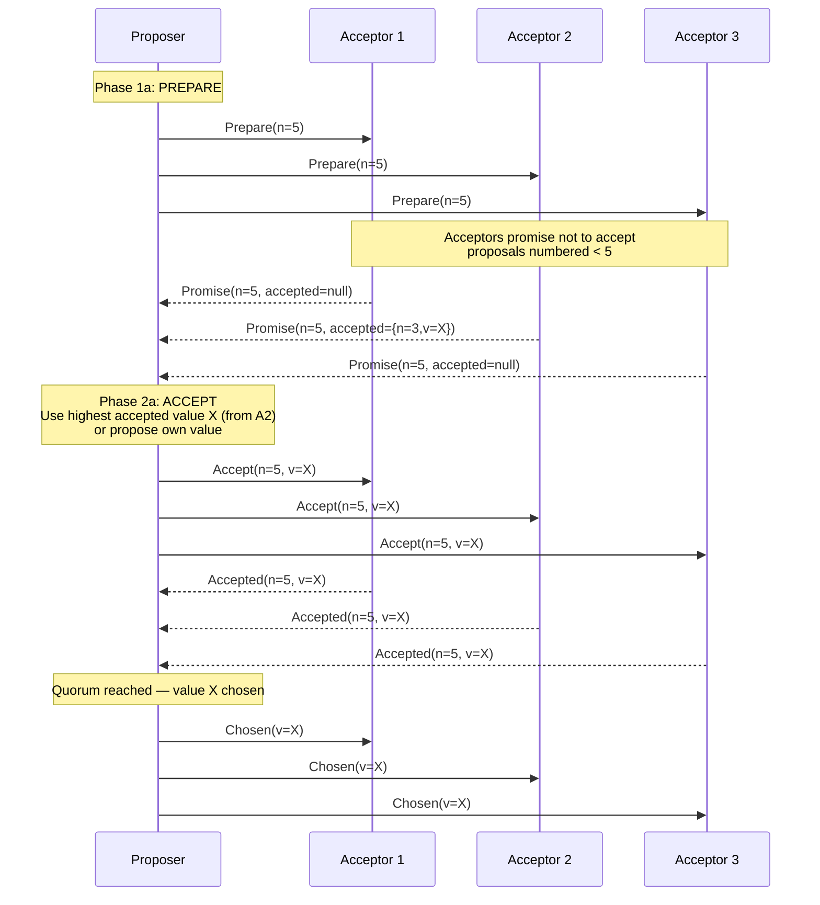

**Why safety holds**: Any two majorities overlap by at least one acceptor. If value `v` is chosen with ballot `n`, any future ballot `n' > n` will find at least one acceptor that accepted `(n, v)`, forcing the proposer to use `v`.

**Why liveness can fail**: Two proposers can indefinitely interrupt each other with higher ballot numbers (livelock). Multi-Paxos fixes this with a stable leader.

### 4.3 Raft: Paxos Made Understandable

Raft decomposes consensus into three sub-problems:

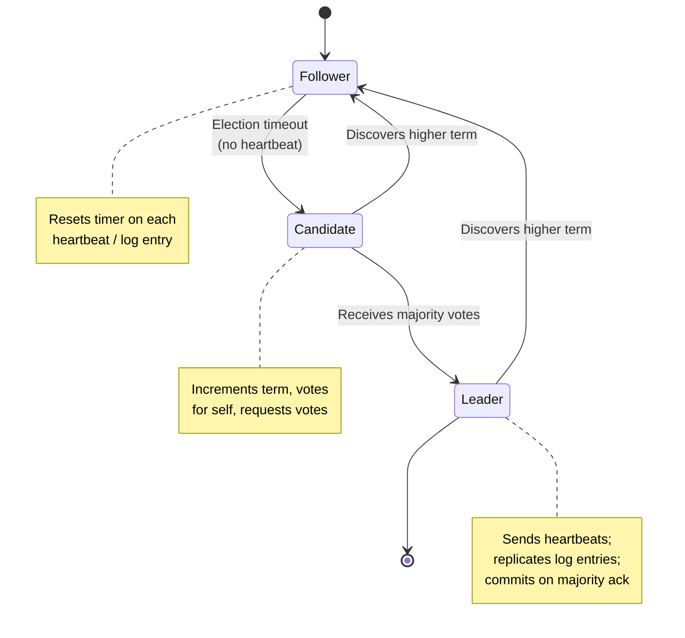

**Log replication flow**:

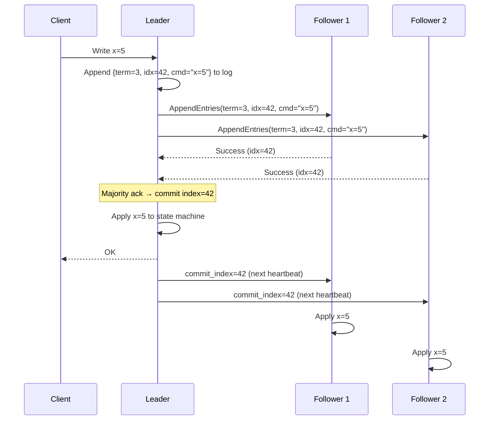

---

## 5. Distributed Mutual Exclusion

### 5.1 Token Ring Algorithm

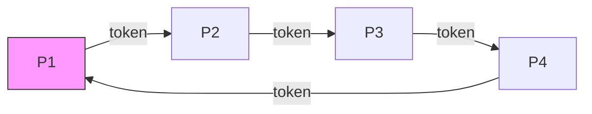

Only token holder enters CS. **O(1)** messages when no contention; O(n) when all want CS simultaneously. Token loss requires regeneration protocol.

### 5.2 Ricart-Agrawala: Timestamp-Based

Process wanting CS multicasts `REQUEST(ts, pid)`. All other processes reply `GRANT` unless they have higher-priority request pending. Process enters CS after `n-1` GRANTs.

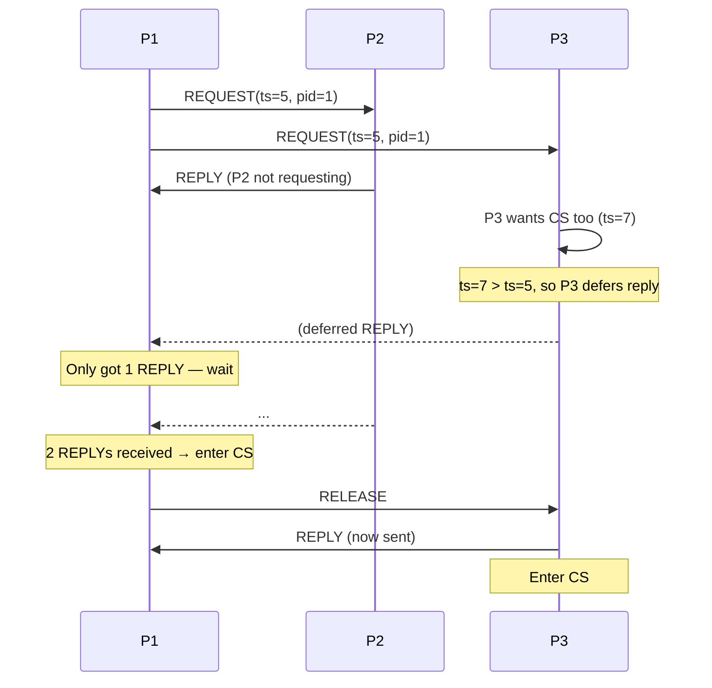

### 5.3 Maekawa's Quorum Algorithm

Assign each process a **request set** of size √n such that any two sets intersect. Process needs GRANT from all members of its request set. Reduces messages to O(√n) per CS execution.

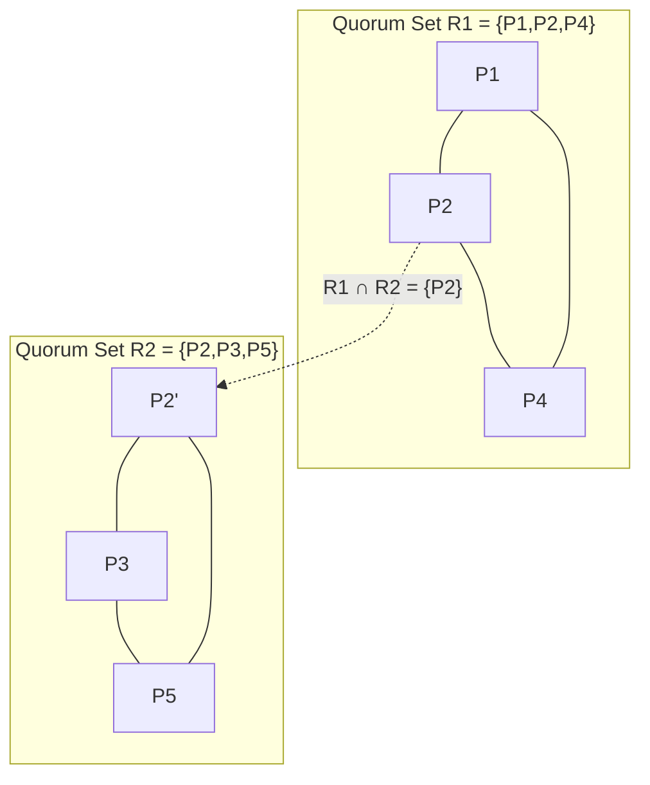

---

## 6. Distributed Transactions and Two-Phase Commit

### 6.1 ACID in a Distributed Context

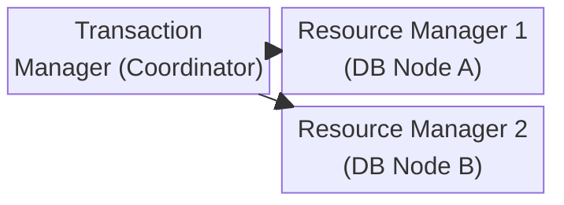

### 6.2 Two-Phase Commit Protocol (2PC)

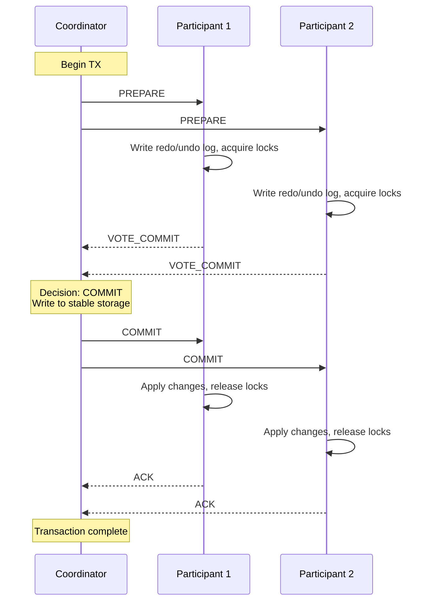

**Blocking failure scenario**: If coordinator crashes after sending PREPARE but before COMMIT/ABORT, participants holding locks are **blocked** indefinitely — they cannot safely abort (coordinator might have decided COMMIT) or commit (coordinator might have decided ABORT). This is 2PC's fundamental flaw.

### 6.3 Three-Phase Commit (3PC)

Adds a **PRE-COMMIT** phase to eliminate the blocking scenario:

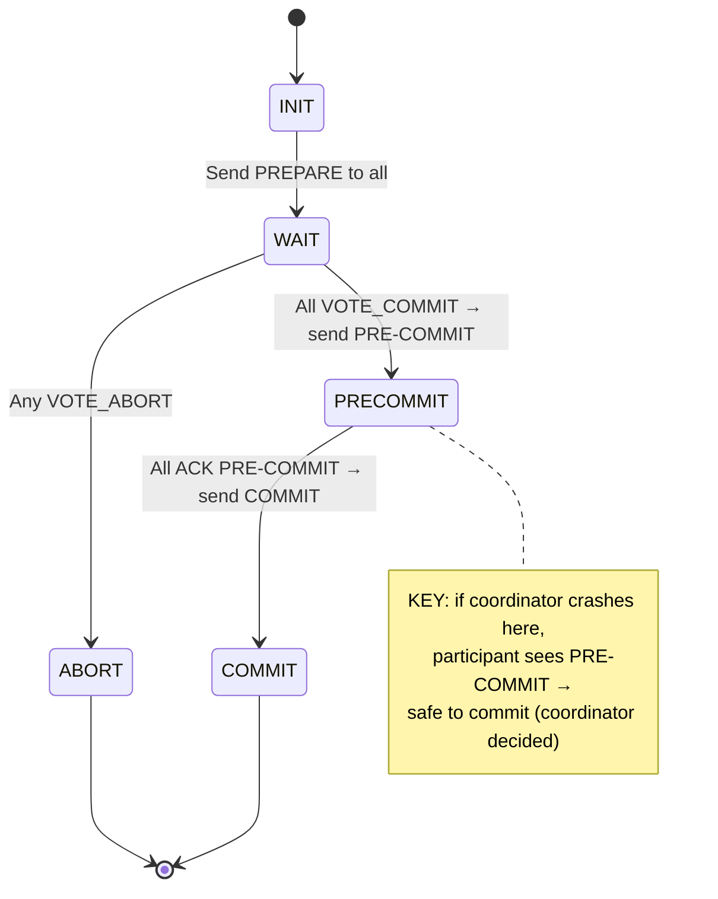

3PC is non-blocking under crash failures but not under network partitions — inconsistent decisions possible when a partition occurs during PRE-COMMIT phase.

---

## 7. Replication: Consistency vs. Availability Tradeoff

### 7.1 Consistency Models Spectrum

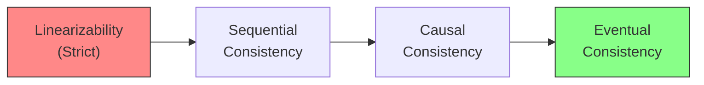

**Linearizability**: Every operation appears instantaneous at some point between its invocation and completion. Global real-time ordering preserved.

**Sequential Consistency**: All processes see operations in the same order, but that order need not match wall-clock time.

**Causal Consistency**: Causally related writes are seen in causal order everywhere. Concurrent writes may be seen in different orders at different nodes.

**Eventual Consistency**: In absence of new writes, all replicas converge to the same value. No ordering guarantees during active writes.

### 7.2 Primary-Backup Replication

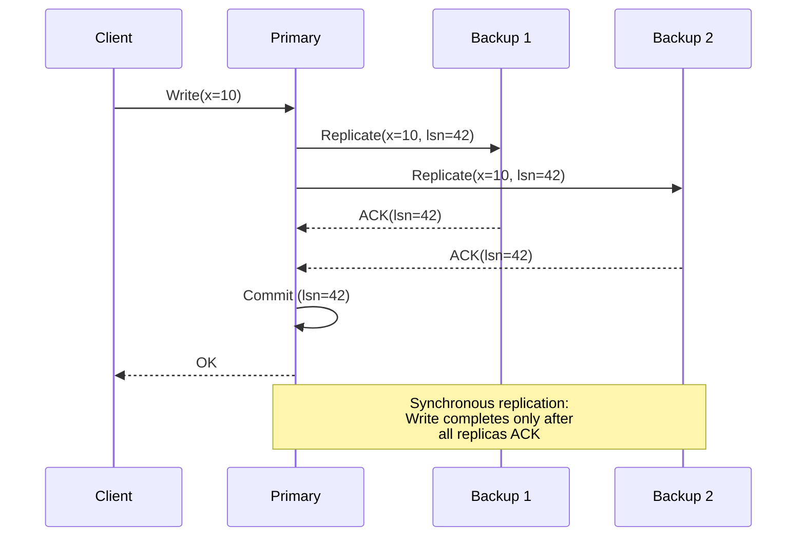

**Asynchronous** variant: Primary ACKs client before backups confirm. Higher throughput, but risk of **lost writes** on primary failure.

### 7.3 Quorum-Based Replication

With `N` replicas, require `R` read votes + `W` write votes where `R + W > N`:

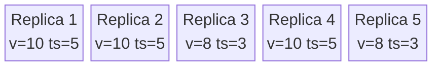

With `N=5, W=3, R=3`: Write contacts 3 replicas; Read contacts 3. Since `3+3>5`, at least one overlap → reader always sees latest write.

---

## 8. Distributed Hash Tables and Consistent Hashing

### 8.1 The Chord DHT

Map both keys and nodes to a 160-bit ring using SHA-1. Each node maintains a **finger table** of size `m` (log₂N entries):

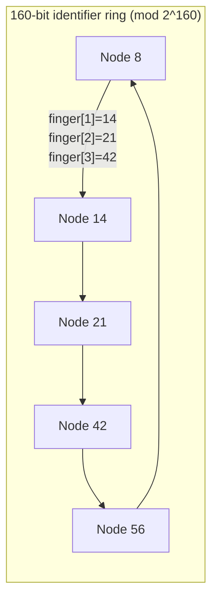

**Lookup protocol**: To find key `k`, forward to `finger[i]` where `finger[i] ≤ k < finger[i+1]`. Each hop halves the search space → O(log N) hops.

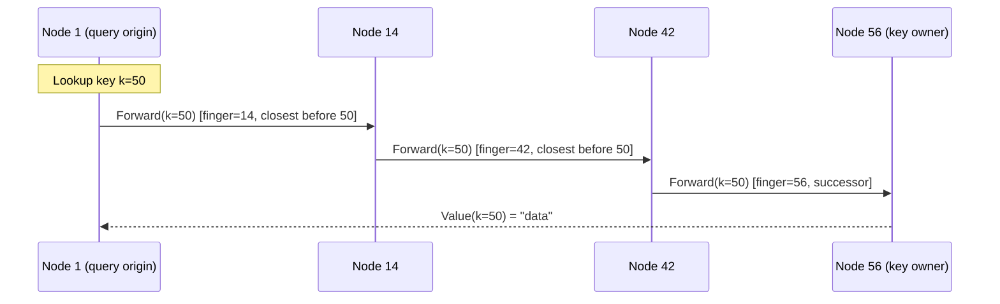

### 8.2 Consistent Hashing: Virtual Nodes

To handle heterogeneous capacity, each physical node maps to multiple **virtual nodes** on the ring:

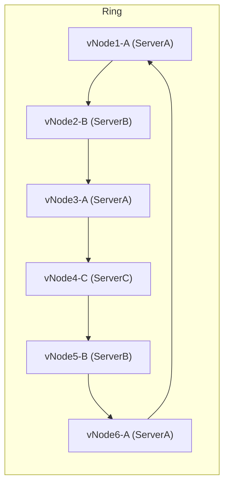

When a node joins/leaves, only keys between it and its predecessor migrate. Expected `K/N` keys move (vs O(K) in naive modular hashing).

---

## 9. Failure Detection

### 9.1 Heartbeat-Based Detectors

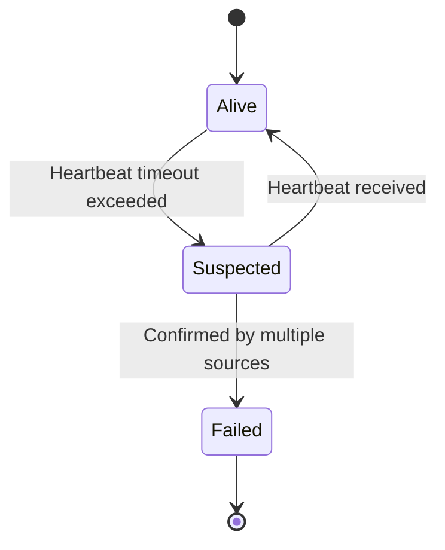

**φ-Accrual Failure Detector** (used in Cassandra/Akka): Rather than binary alive/dead, outputs a continuous **suspicion level φ**:

```
φ(t) = -log₁₀(P_later(t - t_last))
```

Where `P_later` is the probability that a heartbeat has NOT arrived by time `t` given arrival time distribution. Users set threshold (e.g., φ=8 means 10⁻⁸ probability it's still alive).

### 9.2 SWIM: Scalable Weakly-consistent Infection-style Membership

```mermaid
sequenceDiagram
    participant M as Node M (member)
    participant T as Target T
    participant K1 as Random K1
    participant K2 as Random K2

    M->>T: ping
    Note over T: No response within timeout
    M->>K1: ping-req(T)
    M->>K2: ping-req(T)
    K1->>T: ping (on behalf of M)
    K2->>T: ping (on behalf of M)
    T-->>K1: ack
    K1-->>M: ack(T is alive)
    Note over M: T confirmed alive — not failed
```

SWIM propagates membership changes by **gossip piggybacking** on ping/ack messages. Each message carries `λlog(N)` recent membership changes. Achieves O(N) convergence time for N-node cluster.

---

## 10. Clock Synchronization: NTP Internals

### 10.1 Offset and Delay Estimation

```mermaid
sequenceDiagram
    participant A as NTP Client A
    participant B as NTP Server B

    Note over A: Record T1 (send time)
    A->>B: NTP Request [T1]
    Note over B: Record T2 (receive time)
    Note over B: Process request
    Note over B: Record T3 (send time)
    B-->>A: NTP Response [T1, T2, T3]
    Note over A: Record T4 (receive time)

    Note over A: Offset θ = ((T2-T1) + (T3-T4)) / 2
    Note over A: Round-trip delay δ = (T4-T1) - (T3-T2)
```

The offset formula assumes symmetric network delays. NTP chooses the trial with minimum round-trip delay over multiple samples.

### 10.2 NTP Hierarchy

```mermaid
flowchart TD
  GPS["GPS/Atomic Clock\n(Stratum 0)"] --> PS1["Primary Server\n(Stratum 1)"]
  GPS --> PS2["Primary Server\n(Stratum 1)"]
  PS1 --> SS1["Secondary Server\n(Stratum 2)"]
  PS1 --> SS2["Secondary Server\n(Stratum 2)"]
  PS2 --> SS3["Secondary Server\n(Stratum 2)"]
  SS1 --> C1["Client (Stratum 3)"]
  SS2 --> C2["Client (Stratum 3)"]
  SS3 --> C3["Client (Stratum 3)"]
```

Stratum increases with distance from reference clock. Typical LAN accuracy: <1ms. WAN: ~10ms. GPS reference: <100μs.

---

## 11. RPC and IPC Internals

### 11.1 Remote Procedure Call Mechanics

```mermaid
sequenceDiagram
    participant CS as Client Stub
    participant NT as Network Transport
    participant SS as Server Stub
    participant SV as Server Procedure

    Note over CS: marshal(args) →<br/>XDR/protobuf bytes
    CS->>NT: Send(bytes, server_addr, port)
    NT->>NT: TCP segment →<br/>IP packet → frame
    NT->>SS: Receive(bytes)
    Note over SS: unmarshal(bytes) →<br/>typed args
    SS->>SV: call f(arg1, arg2)
    SV-->>SS: return result
    Note over SS: marshal(result)
    SS->>NT: Send(result_bytes)
    NT->>CS: Receive(result_bytes)
    Note over CS: unmarshal → typed result
```

**Marshaling overhead** dominates null-RPC cost (~60-80% of latency). Data copying between address spaces is second largest factor.

### 11.2 Lightweight RPC (LRPC) for Local Communication

When client and server are on the same machine, LRPC avoids full network stack:

```mermaid
flowchart LR
  CL["Client Thread"] -->|"args in shared\nA-stack"| KERN["Kernel"]
  KERN -->|"upcall into\nserver domain"| SV["Server Procedure"]
  SV -->|"results in\nA-stack"| KERN
  KERN -->|"return to\nclient thread"| CL
```

Single copy (into shared argument stack) replaces 4 copies of traditional RPC. Synchronous execution — server runs on client thread, avoiding scheduling overhead.

---

## 12. Security in Distributed Systems

### 12.1 Kerberos Authentication Flow

```mermaid
sequenceDiagram
    participant C as Client
    participant AS as Auth Server (KDC)
    participant TGS as Ticket Granting Server
    participant SV as Service Server

    C->>AS: I am Alice, give me TGT
    AS-->>C: {TGT}_{K_alice} + {session_key}_{K_alice}
    Note over C: Decrypt with K_alice (password-derived)

    C->>TGS: TGT + Authenticator(ts, client_id) + service_id
    TGS-->>C: {service_ticket}_{K_server} + {service_session_key}_{session_key}
    Note over C: Now has encrypted service ticket

    C->>SV: service_ticket + Authenticator
    SV-->>C: Authenticator+1 (mutual auth)
    Note over C,SV: Secure channel established
```

The key insight: the service ticket `{...}_{K_server}` is **opaque to the client** — client cannot forge it without knowing K_server. The AS never directly tells the server about the client; the ticket proves authenticity.

---

## 13. CAP Theorem: Why You Can't Have Everything

```mermaid
flowchart TD
  subgraph CAP["CAP Triangle"]
    C["Consistency\n(All nodes see same data)"]
    A["Availability\n(Every request gets response)"]
    P["Partition Tolerance\n(System works despite lost messages)"]
    C --- A
    A --- P
    P --- C
    CP["CP Systems\n(ZooKeeper, HBase)"] -.- CP_edge( )
    AP["AP Systems\n(Cassandra, DynamoDB)"] -.- AP_edge( )
    CA["CA Systems\n(Single-node SQL)"] -.- CA_edge( )
  end
```

**Why P is not optional**: In any real network, partitions WILL happen. You must choose between C and A during a partition. After the partition heals, you can repair consistency.

**PACELC refinement**: Even when no partition (else = E), there's a latency vs. consistency tradeoff. Cassandra: PA/EL (sacrifice consistency for availability + low latency). Spanner: PC/EC (consistency always, higher latency via TrueTime).

---

## 14. Gossip Protocols: Epidemic Information Dissemination

```mermaid
stateDiagram-v2
    [*] --> Susceptible
    Susceptible --> Infected : Receives update from infected peer
    Infected --> Removed : After k rounds of spreading
    Removed --> [*]

    note right of Infected
        Each round: contact β
        random peers and send update
    end note
```

**Anti-entropy**: Every `T` seconds, node `A` picks random node `B` and exchanges state. Converges in O(log N) rounds to infect all N nodes with probability 1 - 1/N.

**Rumor-mongering (push-gossip)**:
- Infected node pushes update to random neighbors each round
- Stops spreading after receiving "already know" from `k` consecutive contacts
- Reaches N nodes in O(log N) messages per node with high probability

Used in: Cassandra (topology changes), Consul (service catalog), SWIM (failure detection), Bitcoin (transaction propagation).

---

## Data Flow Summary

```mermaid
flowchart TD
  Client["Client Request"] --> Routing["Routing Layer\n(DHT lookup / load balancer)"]
  Routing --> Leader["Leader / Primary"]
  Leader --> Log["Append to Replication Log\n(Raft log / Paxos proposal)"]
  Log --> Replicas["Broadcast to Replicas\n(AppendEntries / Accept)"]
  Replicas --> Quorum["Wait for Quorum ACK\n(majority of acceptors)"]
  Quorum --> Commit["Commit Entry\n(update commit index)"]
  Commit --> StateMachine["Apply to State Machine\n(in-memory KV / DB)"]
  StateMachine --> Response["Return to Client"]
  Replicas -->|"Gossip / Heartbeat"| FD["Failure Detector\n(φ-accrual / SWIM)"]
  FD -->|"Node suspected"| Election["Leader Election\n(Raft term++)"]
  Election --> Leader
```

The entire machinery — logical clocks to establish order, consensus to agree on log entries, quorums to tolerate failures, gossip to disseminate membership, DHT to route requests — exists to paper over the fundamental gap between "no shared memory, no shared clock" and the illusion of a coherent single system.
