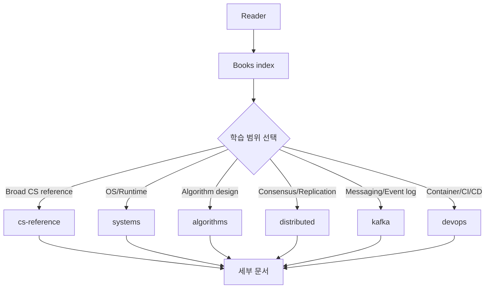
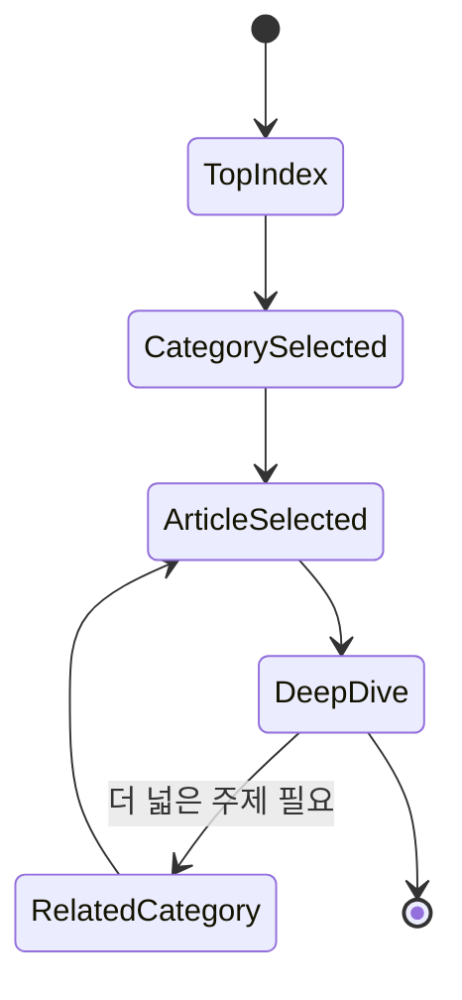

# Under the Hood CS Knowledge Library 인덱스 학습 및 기록 노트

## 1. 왜 필요한가? (Pain Point & Motivation)

`content/docs/books`는 systems, algorithms, distributed systems, Kafka/messaging, DevOps, CS reference 문서를 모아 둔 상위 지식 라이브러리다. 하위 문서가 많아질수록 독자는 어느 카테고리에서 시작해야 하는지, 어떤 문서가 내부 동작 중심인지 빠르게 파악하기 어렵다.

이 문서는 책 기반 "Under the Hood" 문서들의 상위 인덱스를 navigation data flow 중심으로 재작성한다.

## 2. 현재 나의 상태 (Baseline)

- `content/docs/books` 아래에는 현재 저장소 기준 88개의 Markdown 문서가 있다.
- 주요 하위 카테고리는 `systems`, `algorithms`, `distributed`, `kafka`, `devops`, `cs-reference`, `cs-references`다.
- 기존 인덱스는 상세 목록이 많아 전체 탐색에는 유용하지만, 유지보수 시 숫자와 항목이 실제 파일 구조와 어긋날 수 있다.
- 독자는 먼저 카테고리를 고르고, 이후 세부 문서로 들어가는 흐름이 필요하다.

## 3. 도달하고 싶은 목표 (Target State)

- 책 기반 문서의 상위 진입점을 한 화면에서 이해한다.
- 각 카테고리의 초점과 대표 문서를 빠르게 고른다.
- 상세 문서 목록은 각 카테고리나 canonical index에서 관리해 중복을 줄인다.
- 내부 동작, data flow, 상태 전이, 실패 모드 중심의 학습 방향을 유지한다.

## 4. 시스템 번역 (Data Flow)



상위 인덱스는 학습 내용을 직접 모두 담는 문서가 아니라, 사용자가 관심 있는 내부 동작 영역으로 이동하도록 돕는 router다.

## 5. 핵심 구성요소 (Building Blocks)

| 카테고리 | 대표 진입점 | 초점 |
| --- | --- | --- |
| Systems | [systems/linux-kernel-development.md](systems/linux-kernel-development.md) | Kernel, OS, C++, performance, runtime |
| Algorithms | [algorithms/algorithms-internals.md](algorithms/algorithms-internals.md) | 알고리즘 내부 상태, 증명, 복잡도 |
| Distributed | [distributed/distributed-systems-internals.md](distributed/distributed-systems-internals.md) | Consensus, replication, consistency |
| Kafka / Messaging | [kafka/kafka-internals.md](kafka/kafka-internals.md) | Broker log, producer/consumer, stream processing |
| DevOps | [devops/docker-kubernetes-internals.md](devops/docker-kubernetes-internals.md) | Container, Kubernetes, CI/CD, service mesh |
| CS Reference | [cs-reference/index.md](cs-reference/index.md) | Architecture, compiler, network, security, ML |
| CS References alias | [cs-references/index.md](cs-references/index.md) | 복수형 경로에서 canonical index로 안내 |

## 6. 상태 전이 (State Transition)



독자는 상위 인덱스에서 카테고리를 고르고, 세부 문서에서 내부 data flow와 failure mode를 학습한 뒤 관련 카테고리로 확장한다.

## 7. 불변식 (Invariant: 절대 깨지면 안 되는 규칙)

- 상위 인덱스는 실제 파일 구조와 맞는 링크만 제공해야 한다.
- 상세 문서 목록과 숫자는 한 곳에서만 관리하거나, 변경 시 실제 파일 구조와 함께 검증해야 한다.
- `cs-reference/index.md`가 CS reference의 canonical index 역할을 유지해야 한다.
- `cs-references/index.md`는 alias/호환 경로로 사용하고 목록을 중복하지 않는다.
- 책 기반 문서는 사용법 요약보다 내부 동작, data flow, 상태, 실패 사례를 중심으로 유지한다.

## 8. 가장 작은 예제 (Minimal Viable Example)

```text
Kafka 내부 동작을 보고 싶다
-> Books index
-> Kafka / Messaging
-> kafka/kafka-internals.md
-> log segment, ISR, rebalance, offset commit 흐름 확인
```

이 예제는 상위 인덱스가 학습 범위를 좁히는 router 역할을 한다는 점을 보여준다.

## 9. 실패 사례 (What could go wrong?)

- 상위 인덱스에 오래된 파일 수나 삭제된 링크가 남아 탐색이 깨진다.
- 카테고리별 상세 목록을 여러 곳에서 중복해 문서가 서로 다르게 진화한다.
- `cs-reference`와 `cs-references`의 역할이 섞여 canonical path가 불명확해진다.
- 문서가 책 제목별 요약에 머물고 내부 data flow와 실패 모드를 잃는다.
- 하위 문서 이동 후 인덱스 링크를 갱신하지 않아 dead link가 생긴다.

## 10. 뇌 확장하기 (Evolution & Variants)

- 카테고리별 상세 인덱스가 필요하면 각 하위 디렉터리에 분리한다.
- 전체 파일 수와 broken link 검증은 문서 빌드/validator 단계에서 확인한다.
- CS reference는 언어별 `ko` mirror와 영문 canonical 문서의 관계를 명확히 유지한다.
- 향후 "책별" 탐색과 "주제별" 탐색을 분리할 수 있다.

## 11. 최종 체크리스트 (Definition of Done)

- [x] 상위 books 인덱스의 역할을 router로 정리했다.
- [x] 주요 카테고리와 대표 진입점 링크를 유지했다.
- [x] 실제 저장소 기준 파일 수 확인 결과를 baseline에 반영했다.
- [x] 중복 목록, stale link, canonical path 혼동을 실패 사례로 정리했다.

## 12. 뇌에 새기는 복습 문장 (TL;DR Blank)

`books/index.md`는 모든 내용을 담는 문서가 아니라, 내부 동작 중심 문서들로 독자를 보내는 상위 라우터다.
