# Designing Event-Driven Systems — Under the Hood: Event Streaming Architecture Internals

> **Source**: *Designing Event-Driven Systems* — Ben Stopford (O'Reilly, 2018). Focus: not how to use Kafka topics, but how event-driven architectures restructure data ownership, how the log becomes a shared source of truth, and how services collaborate through immutable event streams without tight coupling.

## Reading boundary

- This is an architectural interpretation of a 2018 source, not a current Kafka configuration reference.
- Treat log-centric ownership, CQRS, and choreography as design options. State the authoritative record for each aggregate rather than assuming the log is authoritative everywhere.
- Separate Kafka's transactional boundary from database writes, HTTP calls, and other external effects. Those paths still require idempotency, reconciliation, and observable failure states.
- Validate a proposed design with schema evolution, replay time, consumer lag, duplicate delivery, and recovery-point objectives before calling it complete.

---

## 1. The Core Insight: The Database Inside Out

Traditional architectures can place a shared database at the center, while a log-centric design can make selected domain events authoritative and derive particular views from them. The choice is per domain boundary: not every database, cache, or external side effect is necessarily reconstructable from one log.

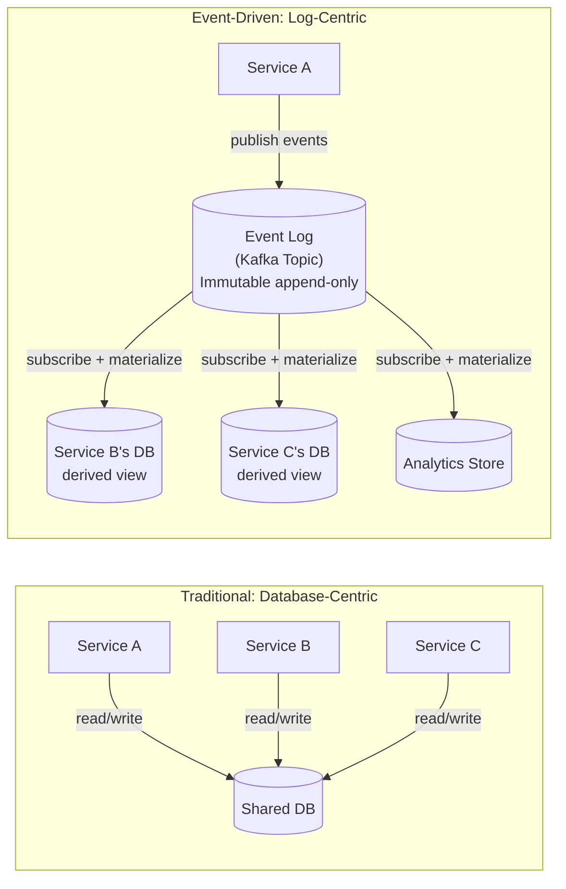

In the design modeled here, the log is more than transient transport: retained events are replayable inputs for named projections. Calling it a system of record requires retention, schema, ordering, access-control, and restoration contracts. Inserts or updates outside that contract remain authoritative in their owning systems.

---

## 2. Event Types: Commands vs Events vs Queries

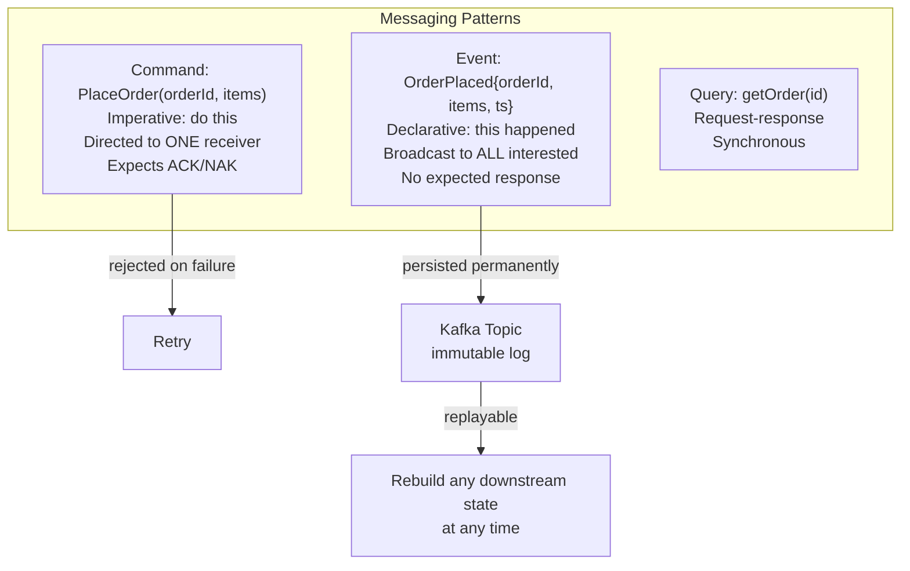

**Why events over commands**: Commands create direct coupling (caller knows receiver exists). Events decouple — publisher doesn't know who consumes. New consumers can be added without changing the publisher.

---

## 3. Kafka as Shared Nervous System

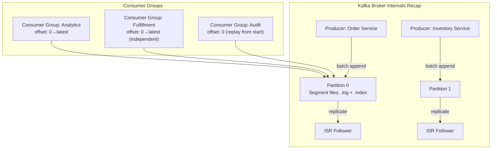

Multiple consumer groups read the **same partition independently** — each maintains its own committed offset. This is fundamentally different from a queue (message deleted after one consumer reads). The log is retained for days/weeks, allowing:
- **New services** to replay history and bootstrap their state
- **Reprocessing** after bug fixes
- **Audit trails** of every business event

---

## 4. The Kappa Architecture: Stream-Only Processing

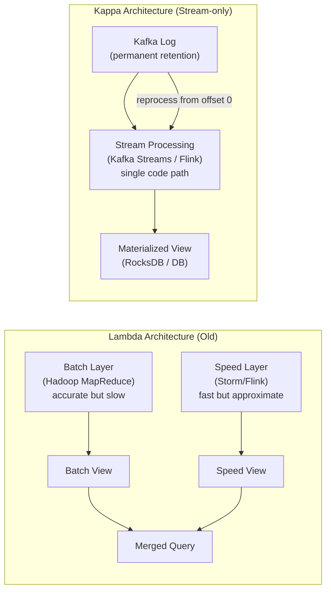

**Kappa**: one codebase handles both real-time and historical reprocessing. When logic changes, replay from beginning with new code into a new output topic/table. Eliminates the operational complexity of maintaining two separate processing paths.

---

## 5. Event Collaboration and Choreography

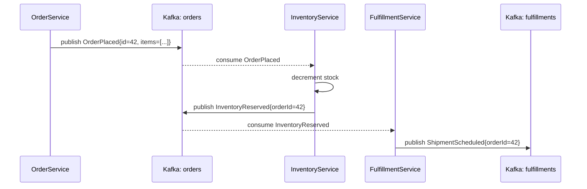

**Choreography vs Orchestration**:
- Choreography: each service reacts to events independently — no central coordinator
- Orchestration: a saga orchestrator sends commands and awaits replies

Choreography is more decoupled but harder to trace. Distributed tracing (correlationId in event headers) compensates.

---

## 6. Compacted Topics: Database Semantics Over a Log

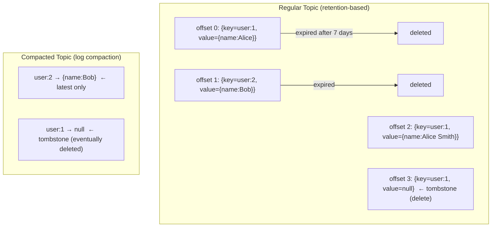

**Log compaction** runs in the background: Cleaner thread reads dirty segments, keeps only the **latest value per key**, writes to a new clean segment. Result: infinite retention of latest state per key = embedded key-value store in Kafka.

### Compaction Mechanics

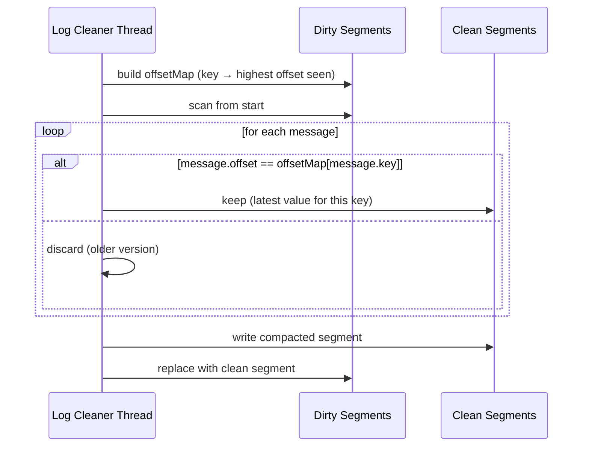

---

## 7. Stream-Table Duality

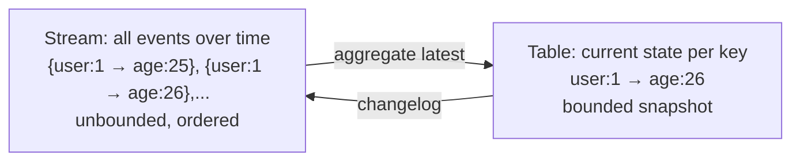

**A stream is a table's changelog. A table is a stream's materialized snapshot.**

This duality is foundational to Kafka Streams KTable semantics:
- `KStream` — each record is a standalone event (append)
- `KTable` — each record is an upsert to a key (latest wins)

### Stream-Table Join Internals

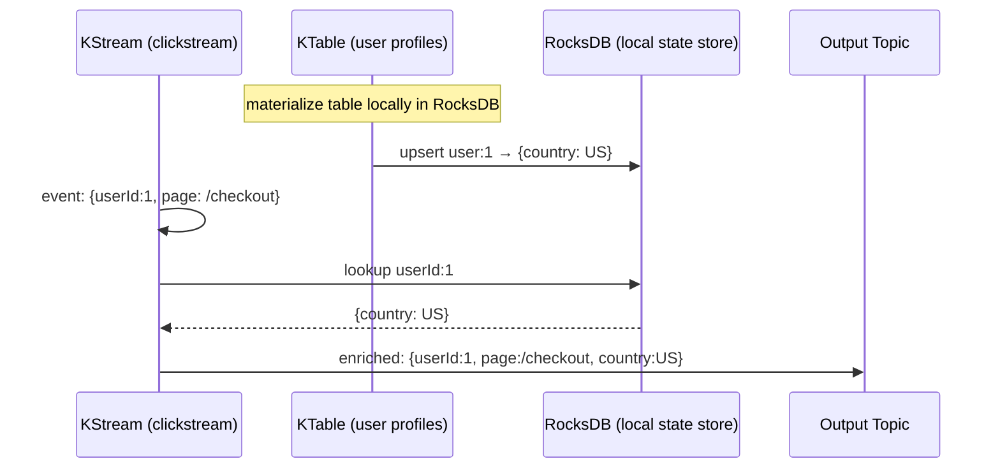

The KTable is co-partitioned with the KStream (same partition count + same key) so lookups are always local — no network hop needed.

---

## 8. Event Sourcing and CQRS at Scale

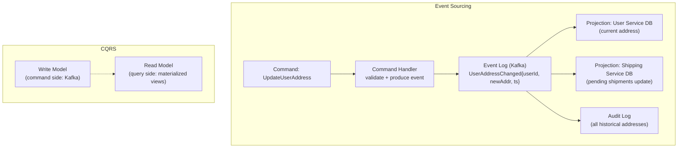

**Event sourcing benefits for distributed systems**:
- State is always reconstructible by replaying events
- Temporal queries: "what was the user's address on date X?" — query log at that offset
- Zero-downtime schema migration: add new projection consumer, replay, cut over

---

## 9. Handling Failures: Idempotency and Exactly-Once

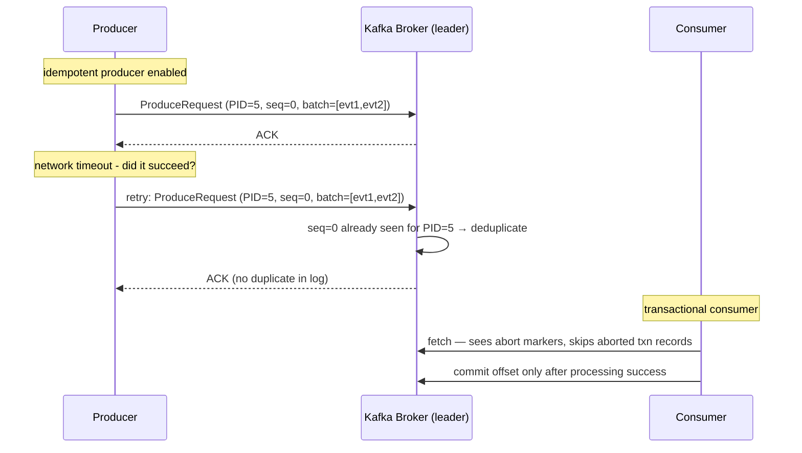

**Kafka read-process-write exactly-once behavior** requires both within the configured Kafka boundary:
1. **Idempotent producer**: `enable.idempotence=true` — PID + sequence number deduplication per partition
2. **Transactional API**: atomic multi-partition produce + offset commit in one Kafka transaction

This does not make an external database update or API call exactly once. Consumers must use an idempotency key, transactional outbox/inbox, or reconciliation process for effects outside Kafka.

---

## 10. Microservices Communication Patterns

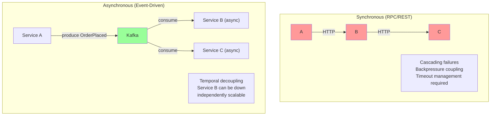

### Back-Pressure Through Kafka Partitions

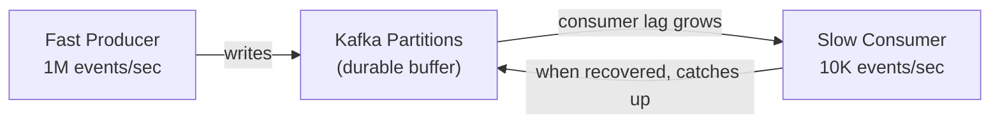

Kafka acts as a **durable backpressure buffer** — the producer and consumer are fully decoupled in time. Consumer lag is observable (via `__consumer_offsets`) and monitored for SLA alerts.

---

## 11. Building Stateful Services on Event Logs

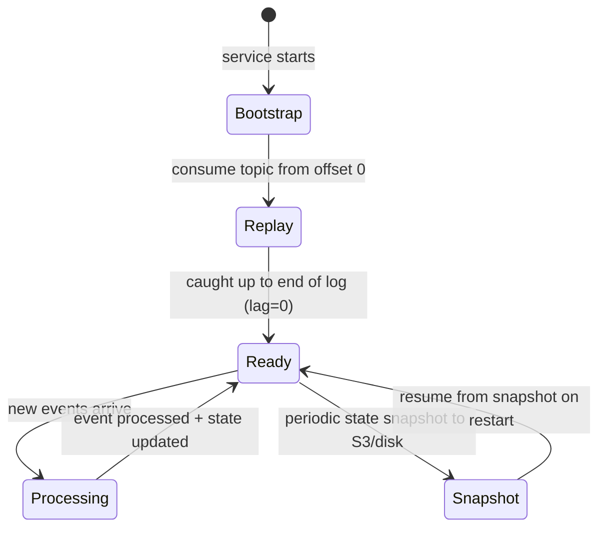

**Bootstrap time** is the key operational concern — large topics with years of history can take hours to replay. Mitigations:
- **Compacted topics** for current state (only latest per key, much smaller)
- **Snapshots** stored externally, consumer starts from snapshot offset
- **Changelog topics** in Kafka Streams (RocksDB state snapshotted to Kafka internally)

---

## 12. Data Pipelines: The Turning Database Inside Out

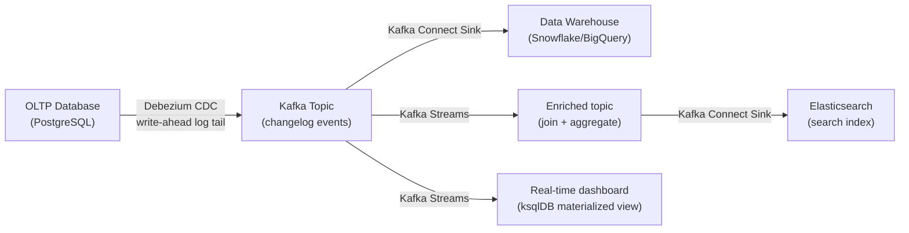

**Debezium** captures PostgreSQL changes via `pg_logical` WAL decoding — every INSERT/UPDATE/DELETE becomes a Kafka event with before/after row images. Downstream systems stay in sync without polling queries.

---

## Summary: Event-Driven Architecture Internals

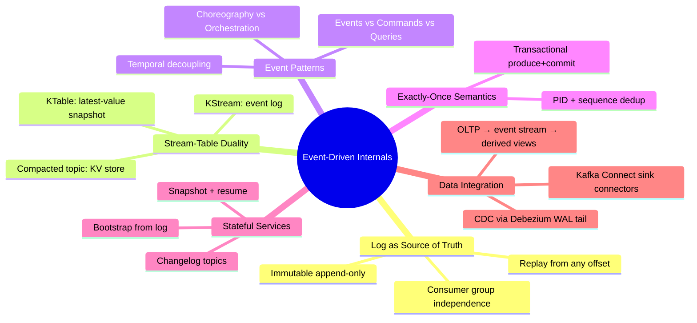
