# Effective Kafka — Under the Hood: Producer Internals, Reliability, and Performance Mechanics

> **Source**: *Effective Kafka* — Emil Koutanov (Leanpub, 2021). Focus: not API usage but the mechanical internals of how Kafka batches records through the accumulator, how compression interacts with batching end-to-end, how consumer offset semantics prevent data loss, and how reliability guarantees propagate through the entire pipeline.

---

## 1. Producer Internals: RecordAccumulator and I/O Thread

The Kafka producer is **asynchronous by design** — `send()` never directly writes to the network. Instead, it stages records through an internal accumulator.

```mermaid
flowchart TD
    App["Application: producer.send(record)"] -->|serialize + partition assign| Accumulator["RecordAccumulator\n(in-memory per-partition ProducerBatch queue)"]
    Accumulator -->|batch full OR linger.ms elapsed| Sender["Sender Thread (background I/O)"]
    Sender -->|drain batches by node| NetworkClient["NetworkClient\n(TCP connection per broker)"]
    NetworkClient -->|ProduceRequest (batches)| Broker["Kafka Broker Leader"]
    Broker -->|ACK (acks=all: wait ISR)| NetworkClient
    NetworkClient -->|callback invoked| App
```

### Accumulator Batch Lifecycle

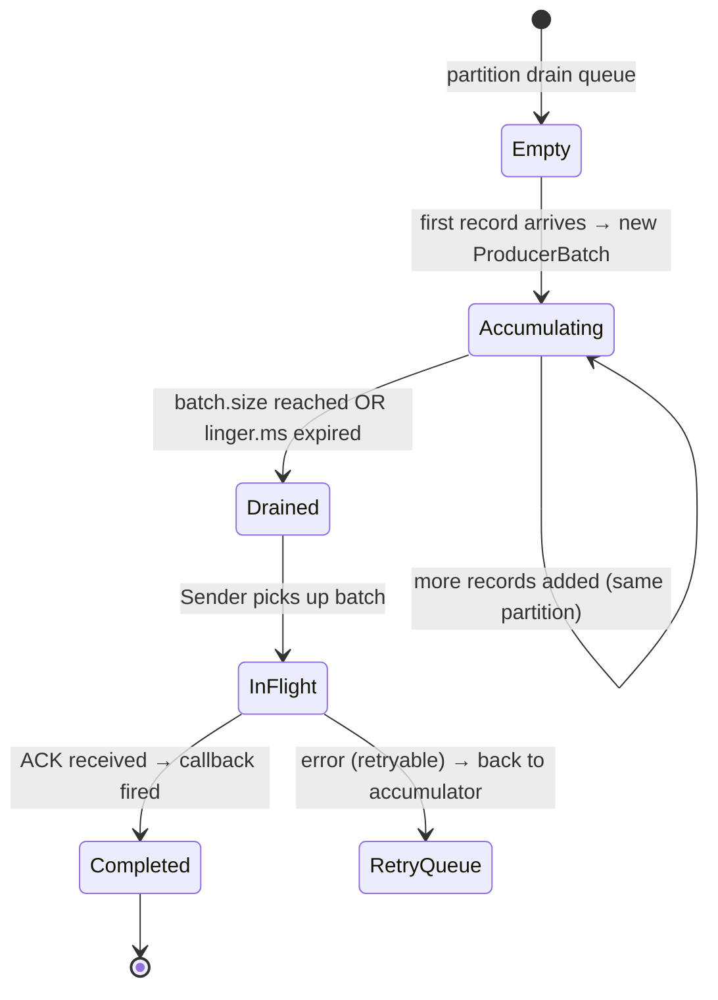

**Key interaction between `batch.size` and `linger.ms`**:
- `linger.ms=0` (default): batch dispatched as soon as Sender thread runs — minimal latency
- `linger.ms=5`: wait up to 5ms, accumulating more records → larger batches → better compression
- `batch.size` override: even if `linger.ms` hasn't elapsed, dispatch once batch fills up

---

## 2. End-to-End Batching and Compression

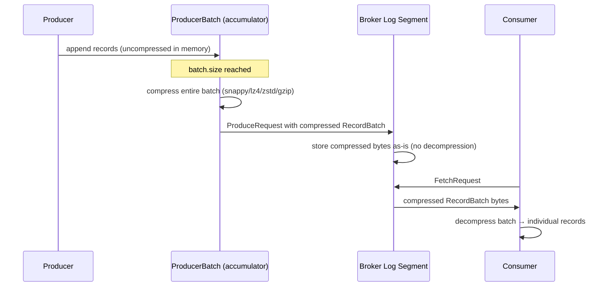

**The broker stores and transfers compressed batches without recompressing** — this is the "zero-copy end-to-end" property. Compression is client-side CPU, but saves network bandwidth AND broker disk space simultaneously.

### Compression Ratio vs. Batch Size

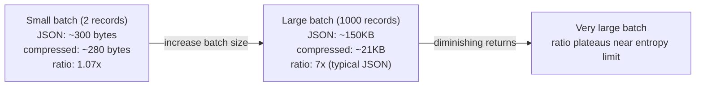

**Compression codec tradeoffs**:
- `gzip`: highest ratio, highest CPU — good for archival
- `lz4`: balanced ratio + speed — recommended for production
- `zstd`: best ratio/speed tradeoff (Kafka 2.1+) — preferred for high-throughput

---

## 3. Consumer Offset Mechanics and Delivery Guarantees

```mermaid
flowchart TD
    subgraph "Consumer Poll Loop"
        Poll["consumer.poll(timeout)"] -->|fetch records| Process["Application processes records"]
        Process -->|commitSync() or commitAsync()| OffsetCommit["__consumer_offsets topic\n{group, topic, partition} → offset+1"]
    end
    subgraph "At-Least-Once vs At-Most-Once"
        ALO["At-Least-Once:\nprocess THEN commit\nduplicates on crash"] --> CommitAfter
        AMO["At-Most-Once:\ncommit THEN process\nloss on crash"] --> CommitBefore
    end
    subgraph "Exactly-Once"
        EOE["Process + produce to output topic + commit offset\nin ONE atomic Kafka transaction"] --> TransactionalAPI
    end
```

### Offset Commit Internals

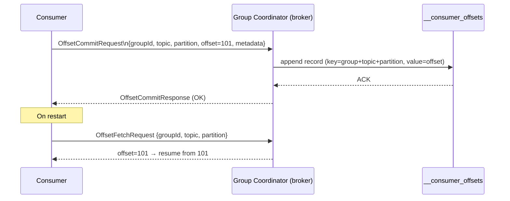

The `__consumer_offsets` topic is itself a **compacted Kafka topic** — for each `(group, topic, partition)` key, only the latest committed offset is retained. Offset storage is thus just a compacted key-value store built on Kafka's own log.

---

## 4. Consumer Group Rebalance Protocol

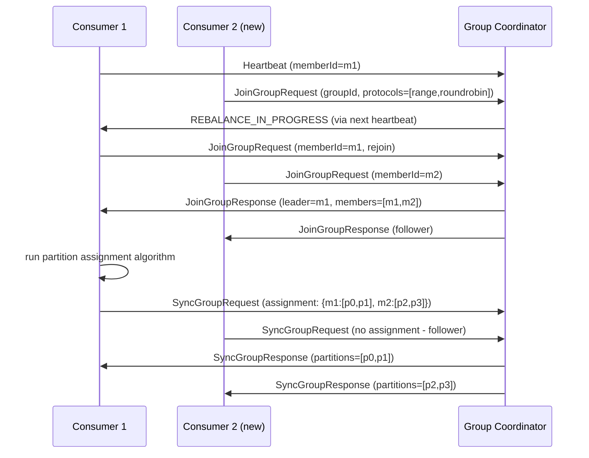

**Stop-the-world rebalance**: all consumers in the group pause consumption during rebalance. **Cooperative/Incremental rebalance** (Kafka 2.4+) moves only the reassigned partitions, minimizing pause.

---

## 5. Serialization and Schema Management

```mermaid
flowchart TD
    Record["Java POJO\nCustomerPayload"] -->|Serializer.serialize()| Bytes["byte[] payload"]
    subgraph "With Schema Registry (Avro)"
        POJO2["Java POJO"] -->|AvroSerializer| Magic["Magic byte: 0x00\n+ Schema ID (4 bytes)\n+ Avro-encoded payload"]
        Magic -->|wire format| Kafka["Kafka Record value"]
        Kafka -->|AvroDeserializer| LookupSR["Fetch schema from\nSchema Registry by ID\n(cached after first fetch)"]
        LookupSR -->|deserialize| POJO3["Java POJO"]
    end
```

**Schema evolution with Avro**:
- `BACKWARD` compatible: new schema can read old data (add fields with defaults)
- `FORWARD` compatible: old schema can read new data (remove fields that have defaults)
- `FULL` compatible: both directions — safest for production

Schema Registry stores `(subject, version) → schema` and enforces compatibility rules on registration.

---

## 6. Partitioning Strategy: Key Hashing Mechanics

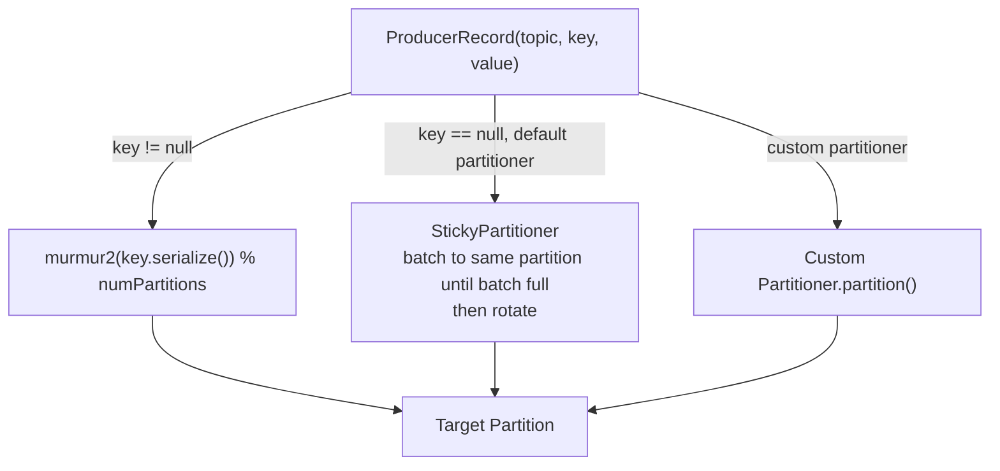

**Sticky partitioner** (default since Kafka 2.4): instead of round-robin per-record (creating many small batches across all partitions), assigns all null-key records to one partition until the batch fills, then switches. Result: larger batches, better compression, fewer Produce requests.

### Partition Count and Parallelism

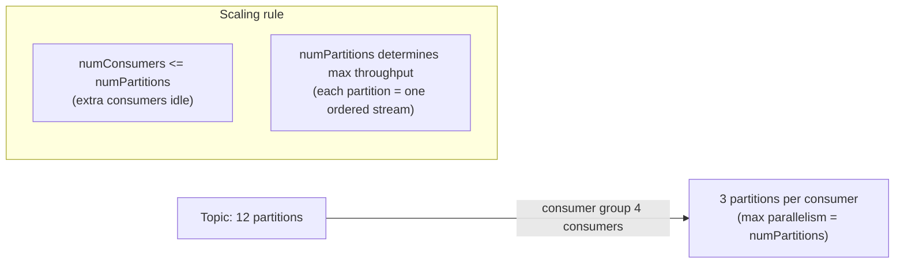

---

## 7. Broker Log Architecture: Segments and Indexes

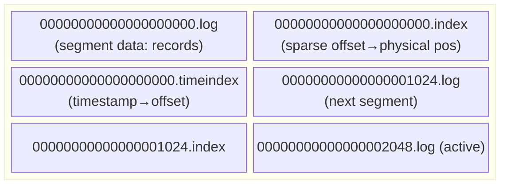

**Segment rollover**: when active segment reaches `log.segment.bytes` (default 1GB) or `log.roll.ms` (default 7 days), a new segment is created. Old segments become eligible for retention/compaction.

**Sparse index**: `.index` file does NOT index every offset — it indexes every `log.index.interval.bytes` of data. Finding offset `O`:
1. Binary search `.index` for largest indexed offset ≤ O → physical position P
2. Sequential scan `.log` from P until offset O found

---

## 8. Replication: ISR Mechanics and acks Configuration

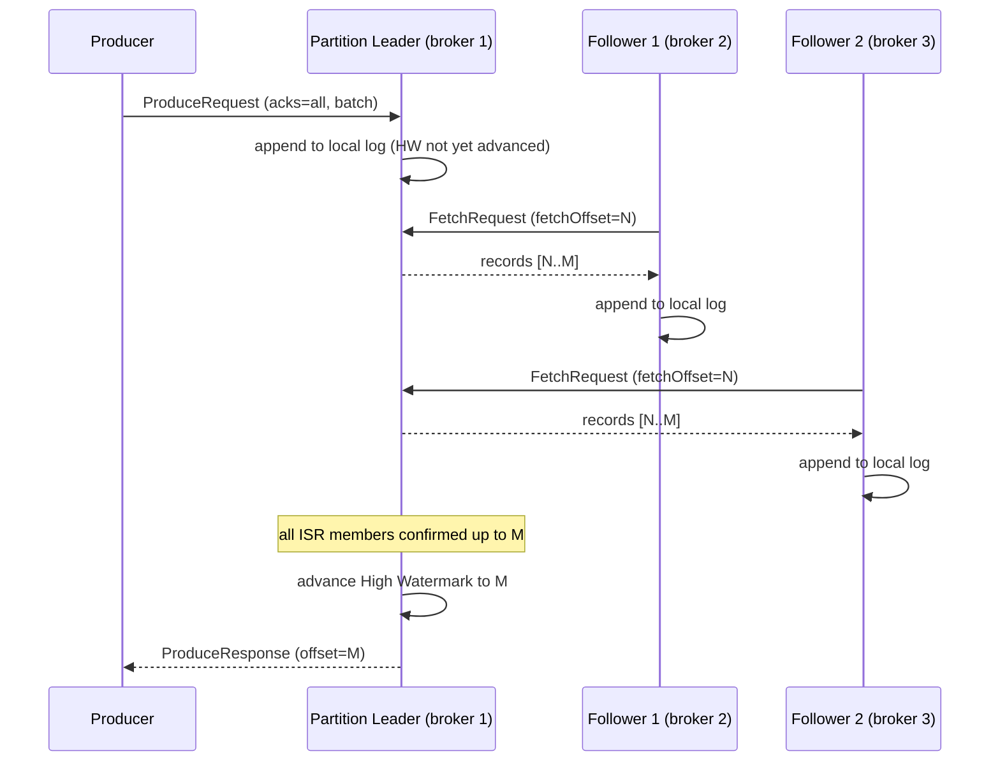

**High Watermark (HW)**: the highest offset that ALL ISR replicas have confirmed. Consumers can only read up to HW — no "dirty reads" of uncommitted data.

**ISR shrinkage**: if a follower lags beyond `replica.lag.time.max.ms` (default 30s), it's removed from ISR. If ISR shrinks to just the leader and `min.insync.replicas=2`, the leader rejects `acks=all` produces — **preventing data loss over availability**.

---

## 9. Transactions: Atomic Multi-Partition Produce

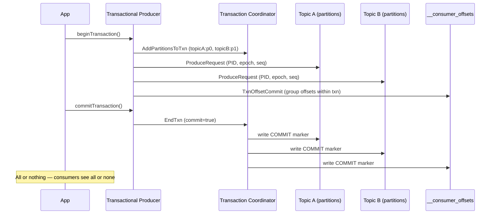

**Transaction log** (`__transaction_state`): the Transaction Coordinator persists txn state durably. On broker failure, new coordinator recovers from this log and completes or aborts in-flight transactions.

---

## 10. Consumer Configuration: Fetch Behavior Internals

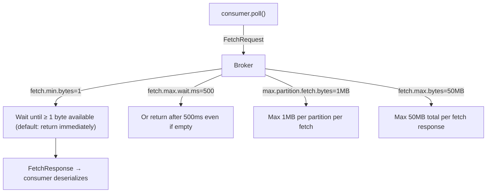

**Tuning for throughput**: increase `fetch.min.bytes` (e.g., 100KB) — broker waits to accumulate more data before responding. Reduces fetch round-trips. Tradeoff: higher latency per poll cycle.

**Tuning for latency**: `fetch.min.bytes=1`, `fetch.max.wait.ms=0` — return immediately with whatever is available.

---

## 11. SEDA Pipeline Pattern: Staged Event-Driven Architecture

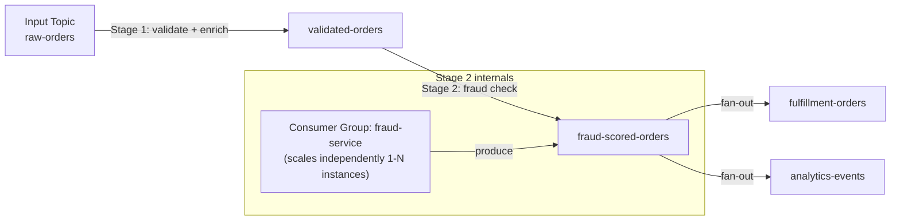

Each stage scales independently — if fraud scoring is the bottleneck, add more instances to that consumer group without touching other stages. Backpressure propagates naturally through consumer lag.

---

## 12. Delivery Reliability: Failure Mode Analysis

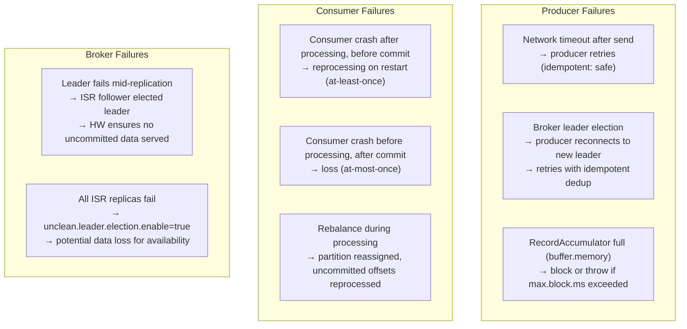

---

## Summary: Effective Kafka Internals Map

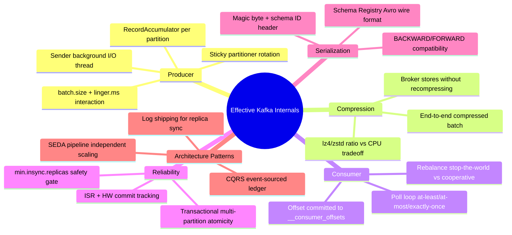
