# Kafka in Action — Under the Hood: Storage, Consumer Internals & Data Pipelines

> Sources: *Kafka in Action* (Dylan Scott, Manning MEAP 2020) + *Learning Apache Kafka 2nd Ed* (Nishant Garg)  
> Focus: Internal data paths, segment file mechanics, consumer group coordination, compaction internals, EOS lifecycle, timing wheel purgatory

## Version and model boundary

- This document combines sources from different Kafka eras. Mark ZooKeeper flows as historical and confirm KRaft, group protocol, record format, and broker defaults against the deployed release.
- Diagrams are representative state machines, not packet captures. A completion claim needs logs, metrics, effective configuration, and a reproducible failure scenario.
- "Exactly once" is scoped to committed Kafka records and offsets read with the matching isolation level. External side effects remain outside that transaction.
- Complexity claims name the unit of work. Timer insertion can be constant-time while expiration still costs work proportional to callbacks that become due.

---

## 1. Partition → Segment → Record: Physical Layout on Disk

Every Kafka partition maps to a directory on the broker's `log.dirs` filesystem. The partition is **not** a monolithic file — it is sliced into **segments**.

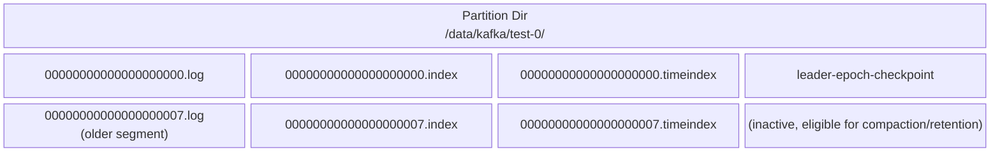

**Key observations:**
- **Segment file name = base offset** of the first record in that segment (all-zeros for the initial segment)
- The **active segment** (largest offset base) is the only file receiving appended writes
- Older segments are candidates for **retention deletion** or **compaction cleaning**
- Each triplet (`.log` / `.index` / `.timeindex`) belongs to one segment boundary

### Binary Search via Sparse Index

The `.index` file is a sparse mapping of `(relative_offset → physical_byte_position)`. It does **not** contain every offset — it samples entries every `index.interval.bytes` bytes.

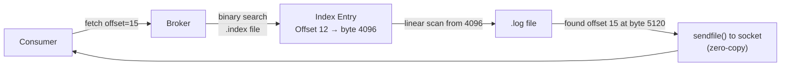

The `.timeindex` mirrors this structure but maps `(timestamp → offset)`, enabling `offsetsForTimes()` consumer API calls.

---

## 2. Log Compaction: The Dirty/Clean State Machine

Standard topics use **delete** retention (remove segments older than `log.retention.ms` or larger than `log.retention.bytes`). Compacted topics (`cleanup.policy=compact`) keep only the **latest value per key**.

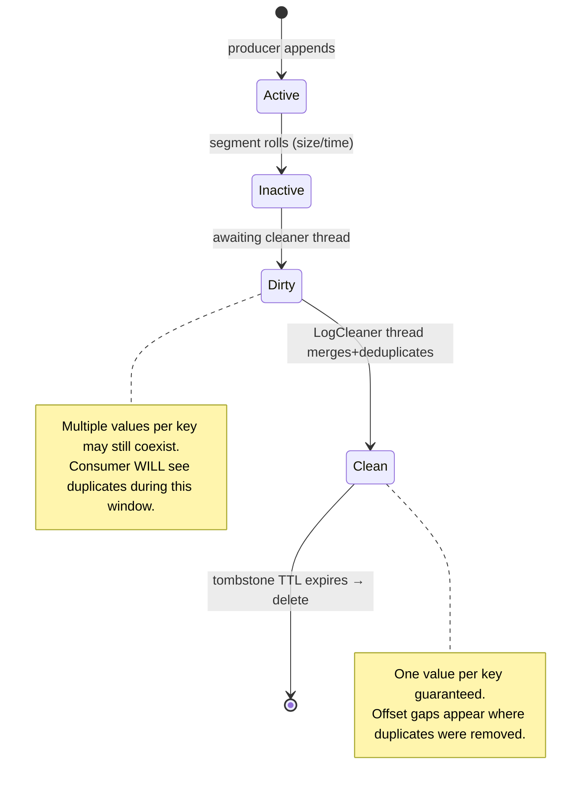

### Log Cleaner Thread Internal Flow

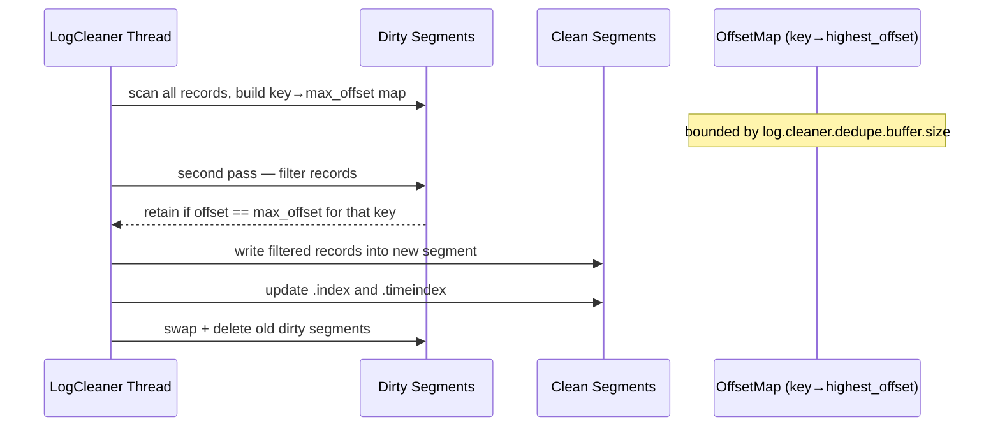

**Tombstone records** (null value, valid key) are retained through compaction for `delete.retention.ms` (default 24h) so downstream consumers can observe the deletion before the record is permanently removed.

---

## 3. Consumer Group Coordination Protocol

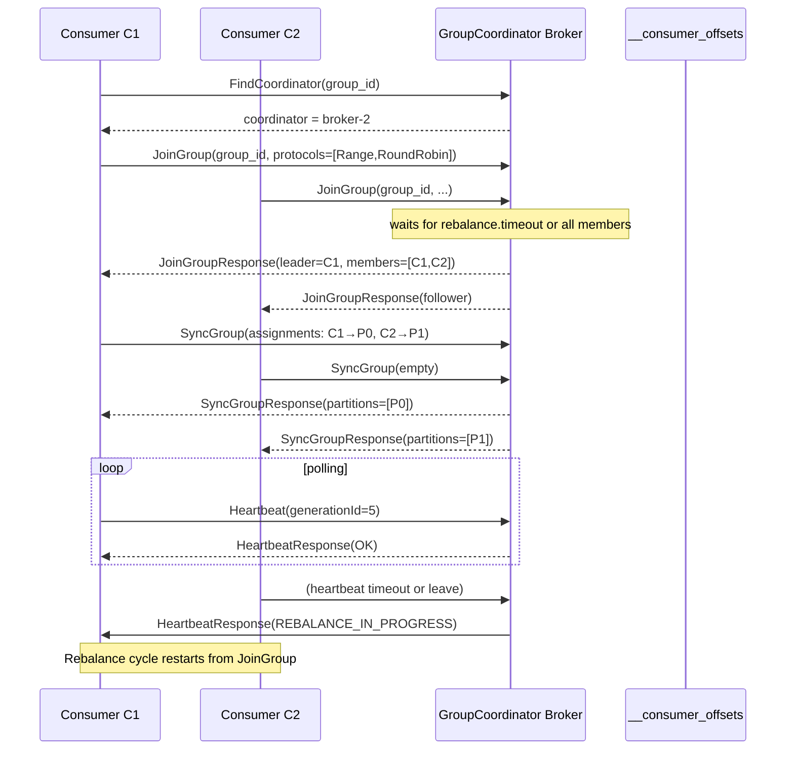

`generationId` is incremented on each rebalance. Commits referencing a stale `generationId` are **rejected** — preventing zombie consumers from poisoning offsets.

### Partition Assignment Strategies

```mermaid
flowchart TD
    subgraph Range["Range (default)"]
        r1["Sort partitions numerically\n(P0,P1,P2,P3,P4)"]
        r2["Divide by consumer count\n5÷2 = 2 remainder 1"]
        r3["C1→P0,P1,P2  C2→P3,P4"]
        r1 --> r2 --> r3
    end

    subgraph RR["RoundRobin"]
        rr1["Interleave across all topics+consumers"]
        rr2["Most even distribution\nif all consumers subscribe same topics"]
        rr1 --> rr2
    end

    subgraph Sticky["Sticky (0.11+)"]
        s1["Same as RoundRobin\nfor new assignments"]
        s2["On rebalance: keep existing\nassignments where possible"]
        s3["Minimizes partition movement\n→ fewer cache misses"]
        s1 --> s2 --> s3
    end
```

---

## 4. Offset Storage: `__consumer_offsets` Internal Topic

Before Kafka 0.9, consumer offsets were stored in ZooKeeper. Now they live in an internal compacted topic `__consumer_offsets` (default 50 partitions).

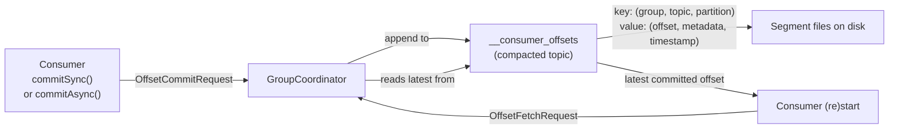

Compaction on this topic means only the **latest offset per (group, topic, partition) key** is retained — historical offset history is discarded, keeping the topic size bounded.

### Auto vs Manual Commit Trade-offs

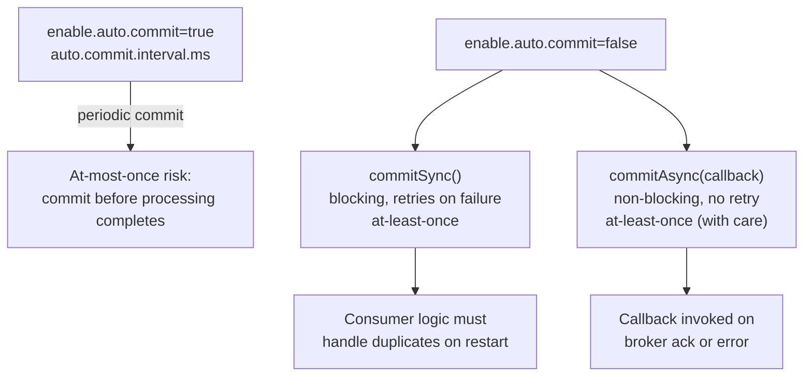

---

## 5. Delivery Semantics & EOS Touch Points

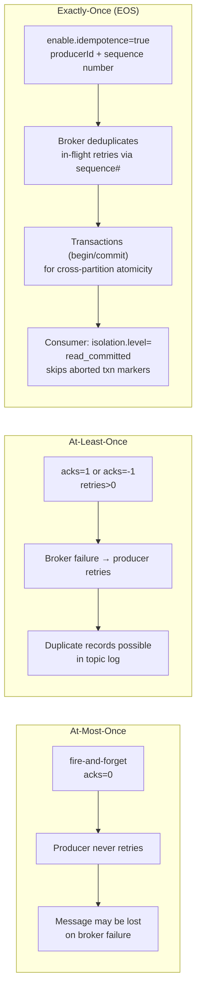

### EOS Transaction Protocol Detail

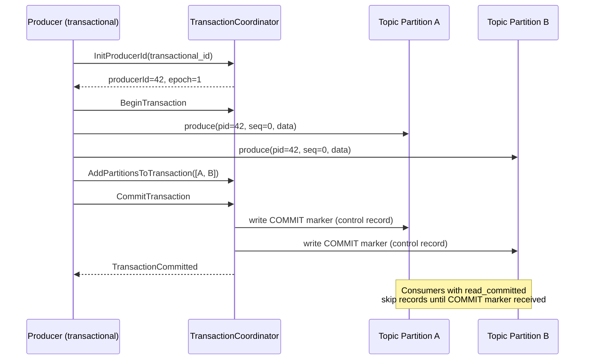

---

## 6. Hierarchical Timing Wheels: Purgatory for Delayed Operations

Kafka handles **delayed operations** (e.g., `acks=-1` waiting for ISR acknowledgements, fetch requests waiting for `fetch.min.bytes`) via a data structure called the **Purgatory** backed by **Hierarchical Timing Wheels**.

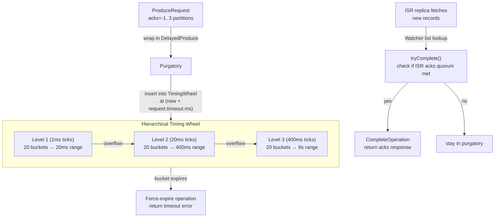

**Why near O(1) for wheel bookkeeping?**  
- Insertion uses bucket arithmetic plus list insertion under the timing-wheel assumptions.  
- Advancing an empty bucket is constant work, but expiring a populated bucket also costs O(k) for its k due entries and callbacks.  
- Cascading between levels and cancellation add implementation-dependent work even though a full scan of all timers is avoided.  
- Multi-level design handles wide timeout ranges without wasteful fine-grained buckets at long durations

Source class: `kafka.utils.timer.SystemTimer` / `TimingWheel.scala`

---

## 7. Broker: Request Processing Architecture

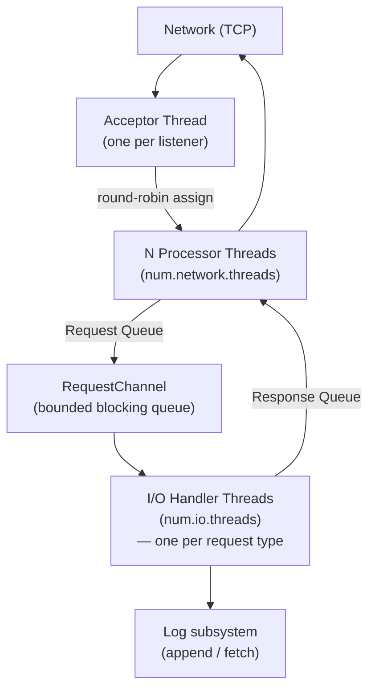

**Separate request queues exist for:**
- `PRODUCE` → `ReplicaManager.appendRecords()`  
- `FETCH` (consumer and replica) → `ReplicaManager.fetchMessages()`  
- `METADATA` → `MetadataCache`  
- `LIST_OFFSETS`, `OFFSET_COMMIT`, `OFFSET_FETCH` → respective managers

---

## 8. ZooKeeper Role (Pre-KRaft)

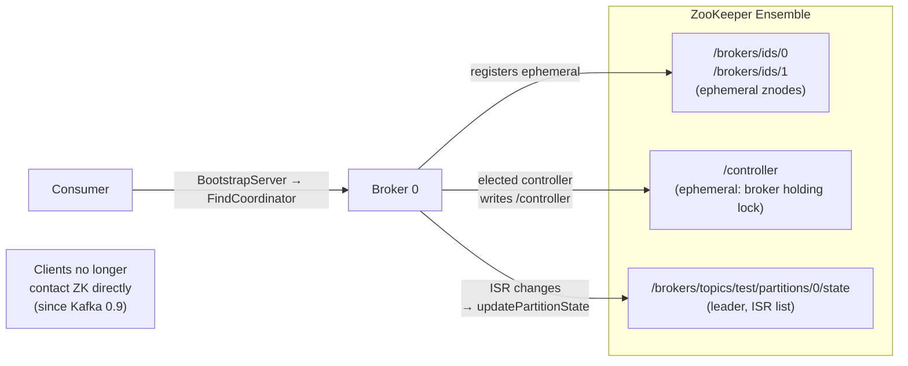

Controller watches `/brokers/ids/*` for broker join/leave events and triggers `LeaderAndIsrRequest` + `UpdateMetadataRequest` to all live brokers on each topology change.

---

## 9. Consumer Seek & Replay Patterns

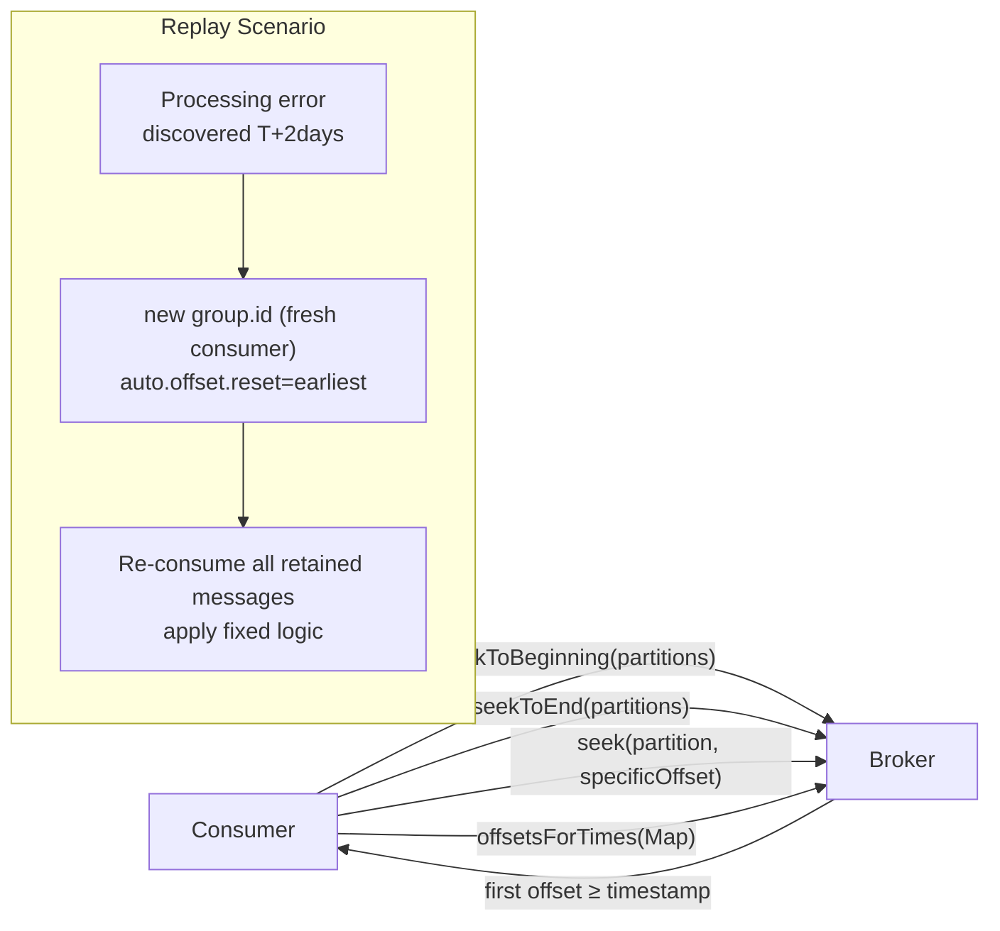

Key: Kafka retains data on its own clock (`log.retention.hours`, `log.retention.bytes`) — not on consumer acknowledgement. Multiple independent consumer groups with separate `group.id` can replay the same data without interfering.

---

## 10. Data Pipeline Patterns with Kafka Connect & Flume

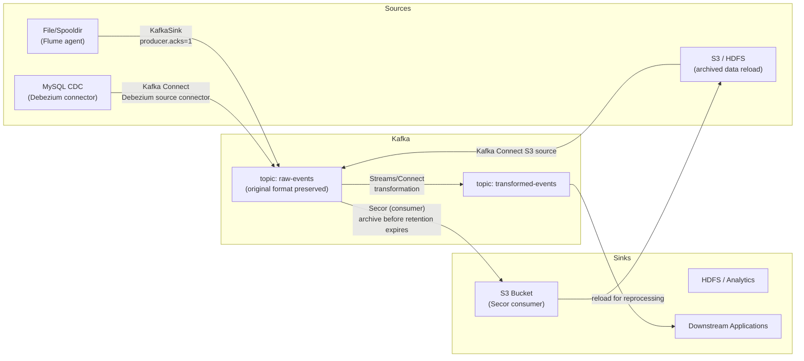

**Critical design principle**: Store raw events in Kafka unmodified. Downstream consumers or stream processors apply transformations. This allows re-processing with corrected logic by replaying from the raw topic.

---

## 11. Retention vs. Compaction: Decision Matrix

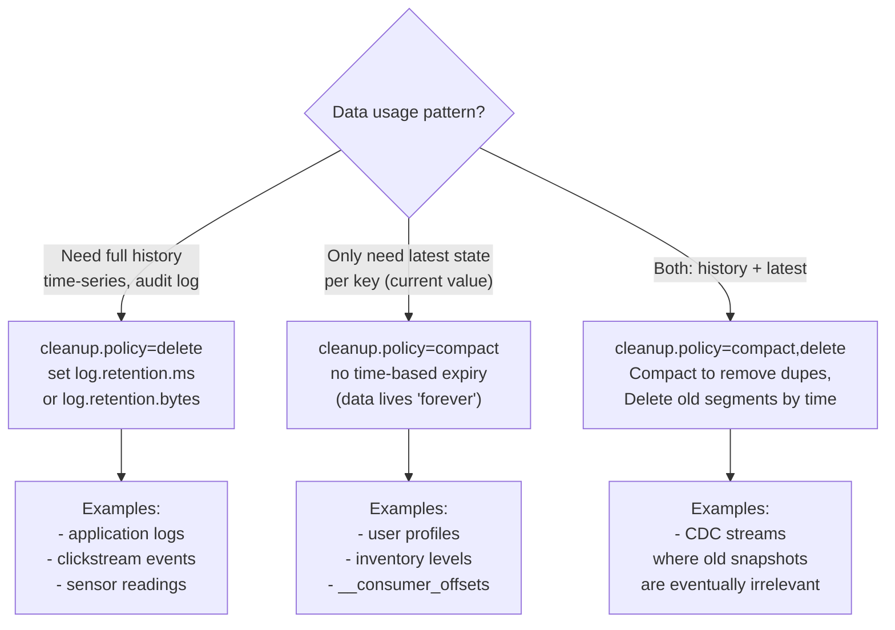

---

## 12. Message Format: Wire-Level Record Batch

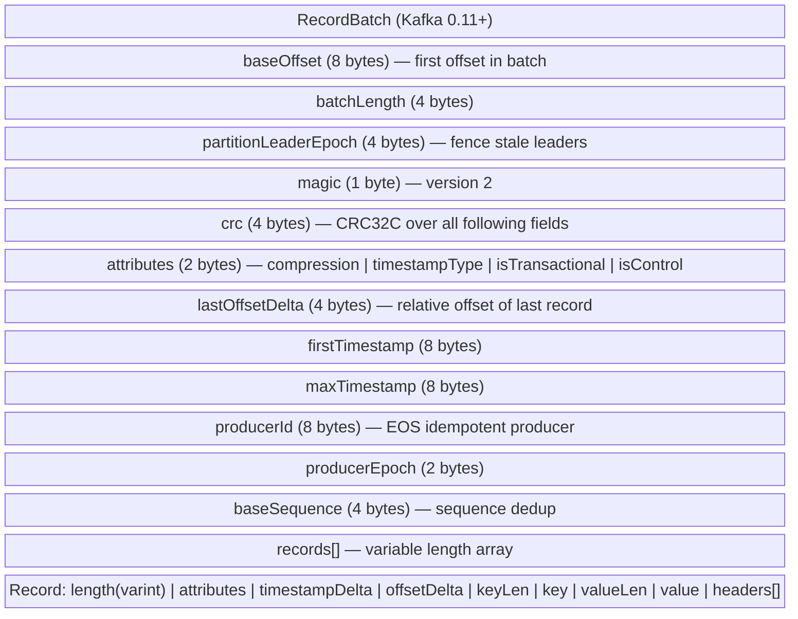

`producerId + producerEpoch + baseSequence` form the **idempotency key** the broker uses to reject re-delivered duplicates.

---

## 13. Multithreaded Consumer Patterns (Learning Apache Kafka)

The Java `KafkaConsumer` is **not thread-safe** — one consumer instance per thread. To achieve parallelism:

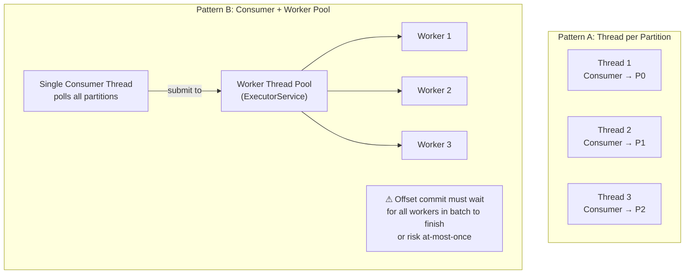

Pattern A is simpler (one consumer per partition, commit independently) but hits the partition limit ceiling. Pattern B allows processing parallelism beyond partition count but requires careful offset management to avoid commit-before-complete semantics.

---

## 14. Kafka Cluster Bootstrap & Leader Discovery

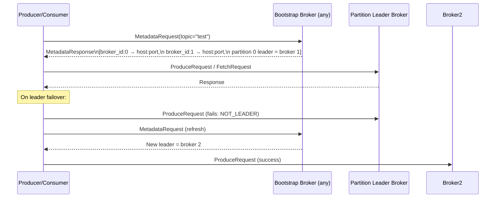

`bootstrap.servers` only needs to list **2-3 brokers** — not the full cluster. The initial `MetadataRequest` response contains full cluster topology which the client caches.

---

## 15. Replica Reassignment Internals

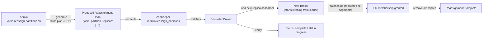

During reassignment, new replicas are added as **learners** (not yet in ISR). They replicate from the leader until LEO catches up, then join ISR. Only then is the old replica removed. This prevents data loss during the transition.

---

## Summary: Data Flow Map

```mermaid
flowchart TD
    Prod["Producer\nRecordAccumulator\nbatch → compress → send"] -->|"ProduceRequest"| BrokerAppend["Broker: ReplicaManager\nappend to active segment .log"]
    BrokerAppend -->|"ISR followers fetch"| Replicas["Follower replicas\n(fetch loop, advance LEO)"]
    BrokerAppend -->|"if purgatory: await ISR acks"| Purgatory["TimingWheel Purgatory\ntryComplete on each ISR fetch"]
    Purgatory -->|"acks quorum met"| ProduceResponse["ProduceResponse to Producer"]
    
    Consumer["Consumer\npoll() → FetchRequest"] -->|"broker: sendfile()\nzero-copy from page cache"| ConsumerApp["Consumer Application\nprocess record\ncommitOffset to __consumer_offsets"]

    BrokerAppend -->|"segment roll\nretention / compaction"| LogCleaner["LogCleaner Thread\ncompact dirty segments"]
    LogCleaner --> CleanSegments["Clean Segments\n(one value per key)"]
```
