# Kafka: The Definitive Guide — Internal Architecture Deep Dive

> **Sources**: Kafka: The Definitive Guide 1st Ed. (Narkhede, Shapira, Palino — O'Reilly 2016) + 2nd Ed. (Shapira, Palino, Sivaram, Narkhede — O'Reilly 2022)  
> **Focus**: Broker I/O thread model, controller internals, replication mechanics, AdminClient async architecture, KRaft consensus, OS-level optimizations

---

## 1. The Broker as a Log Server

Kafka's broker is fundamentally a **log server** — not a queue. Every message written is durably appended to a log segment file. Brokers do not track which consumers have seen what; they expose offsets and let consumers track position themselves.

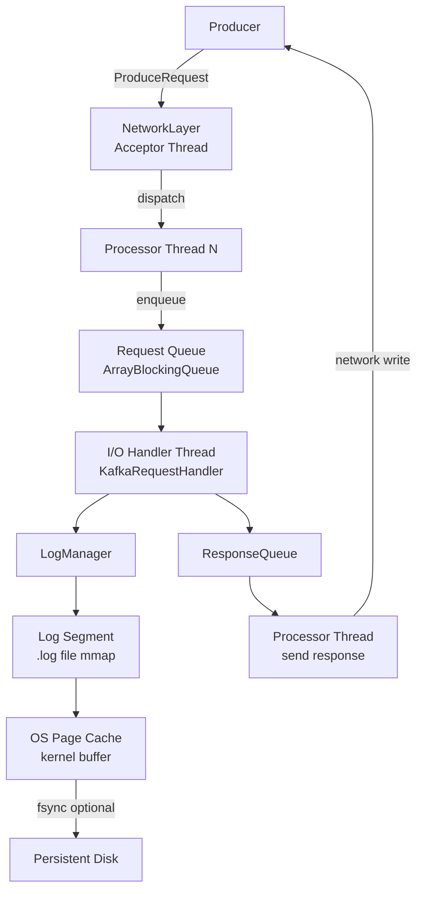

### Broker I/O Threading Model

The broker uses a **reactor pattern** layered as:

1. **Acceptor Thread** — single thread, calls `accept()` on server socket, dispatches to a Processor thread using round-robin
2. **Processor Threads** (num.network.threads, default 3) — each runs a `java.nio.Selector`, reads bytes from client sockets, assembles complete requests, enqueues to shared `RequestChannel`
3. **Request Handler Threads** (num.io.threads, default 8) — pull from `RequestChannel`, execute business logic (log append, fetch, metadata), put response back into `RequestChannel`
4. **Response dispatch** — Processor threads pick up responses, write bytes back to clients

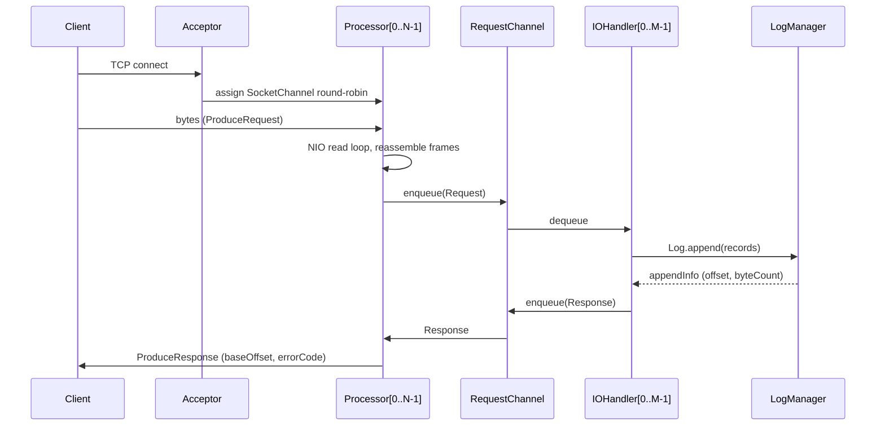

---

## 2. Log Segment Anatomy

Each partition maps to a directory `<log.dirs>/<topic>-<partition>/`. Within it, **segments** are immutable once rolled.

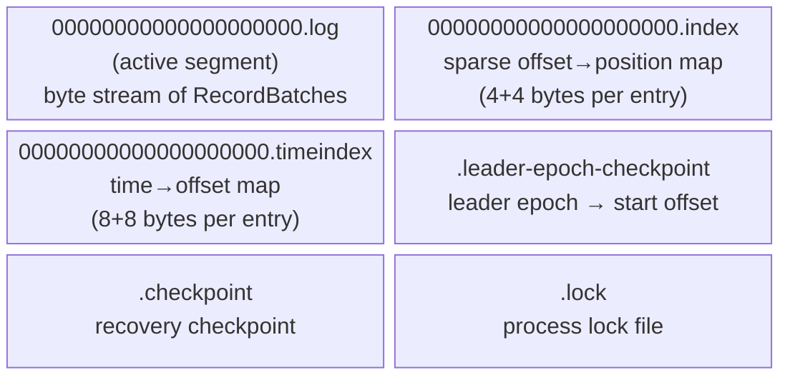

### Record Batch On-Disk Format

```
RecordBatch:
  baseOffset        : int64     (offset of first record in batch)
  batchLength       : int32     (total bytes from magic to end)
  partitionLeaderEpoch: int32   (leader epoch when written)
  magic             : int8      (= 2 for current format)
  crc               : int32     (CRC32C over attributes..records)
  attributes        : int16     (compression | timestampType | transactional | control)
  lastOffsetDelta   : int32     (lastOffset - baseOffset)
  baseTimestamp     : int64
  maxTimestamp      : int64
  producerId        : int64     (for idempotent/transactional producers)
  producerEpoch     : int16
  baseSequence      : int32
  records           : [Record]

Record:
  length            : varint
  attributes        : int8
  timestampDelta    : varint
  offsetDelta       : varint
  keyLength         : varint
  key               : byte[]
  valueLength       : varint
  value             : byte[]
  headers           : [Header]
```

### Index Lookup: O(log n) Binary Search

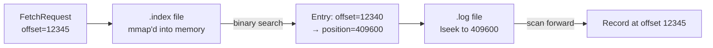

Sparse index: not every offset has an entry. `index.interval.bytes` (default 4096) controls granularity — one index entry per 4KB written. At fetch time: binary search finds largest indexed offset ≤ target, then sequential scan from that file position.

---

## 3. Replication Protocol: ISR and HWM

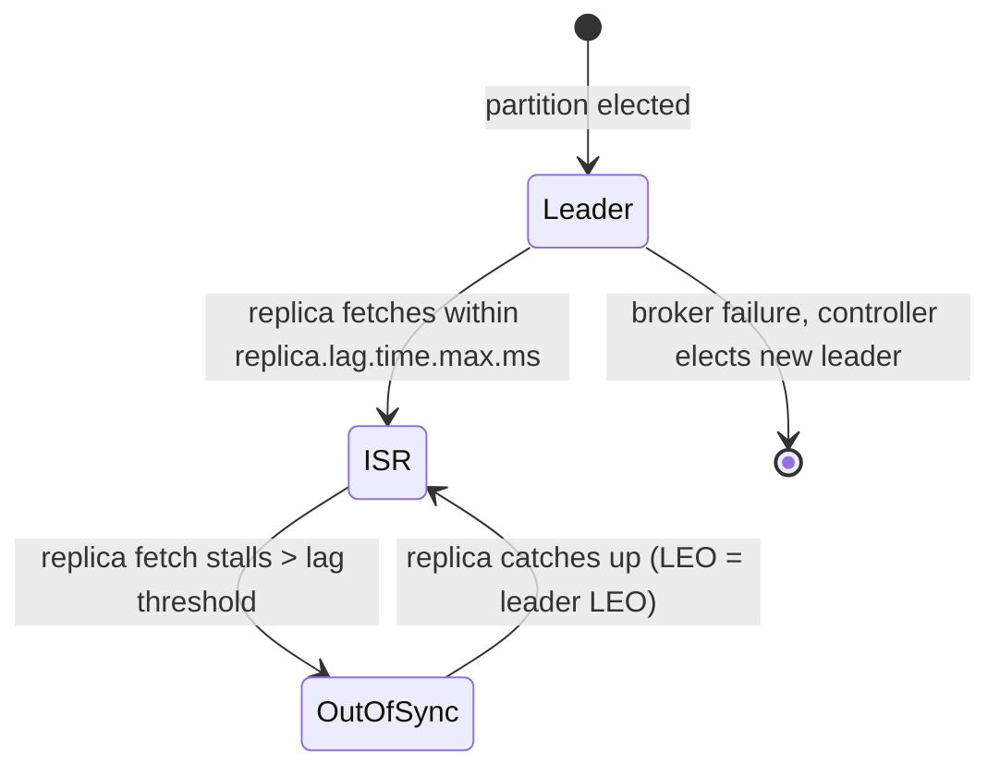

### High Watermark and Log End Offset

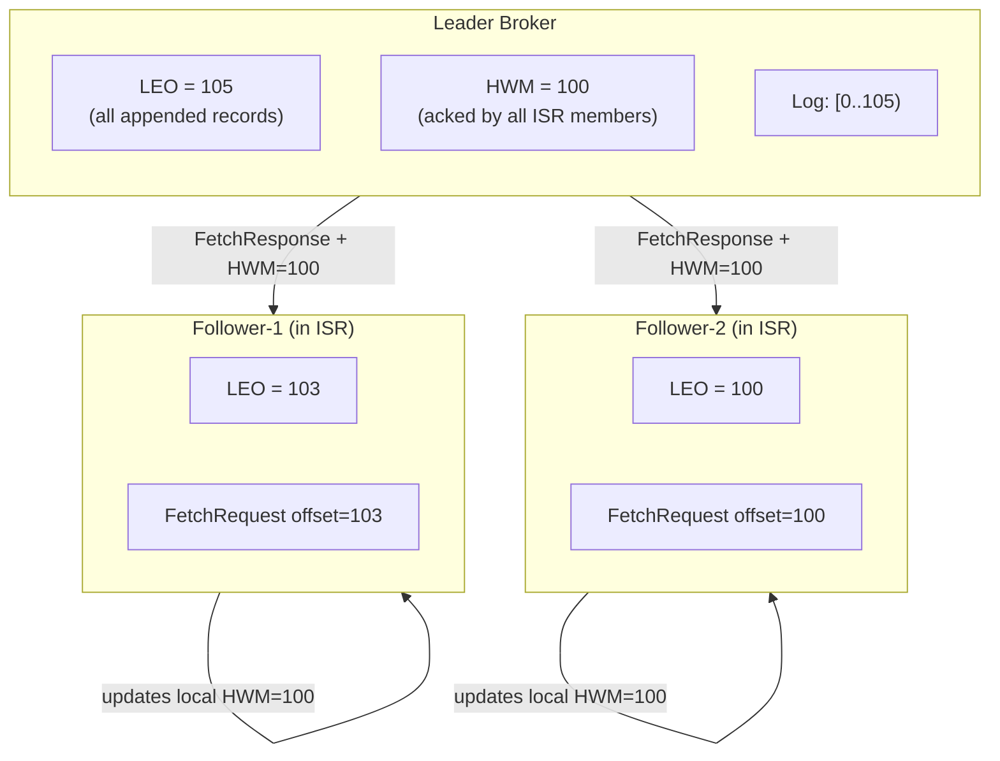

**Why HWM matters**: Consumers can only read up to HWM. Records above HWM are written to leader but not yet replicated — they're invisible to consumers until ISR members fetch them, updating the leader's knowledge of their LEOs, which advances HWM.

**acks=-1 flow**:
1. Producer sends RecordBatch
2. Leader appends to local log (LEO advances)
3. Leader waits until ALL ISR members' LEO ≥ this batch's last offset
4. Leader advances HWM
5. Leader sends ProduceResponse with baseOffset

---

## 4. Controller: Cluster Brain

The **Controller** is one broker elected via ZooKeeper ephemeral node `/controller`. In KRaft mode, it's elected via Raft consensus.

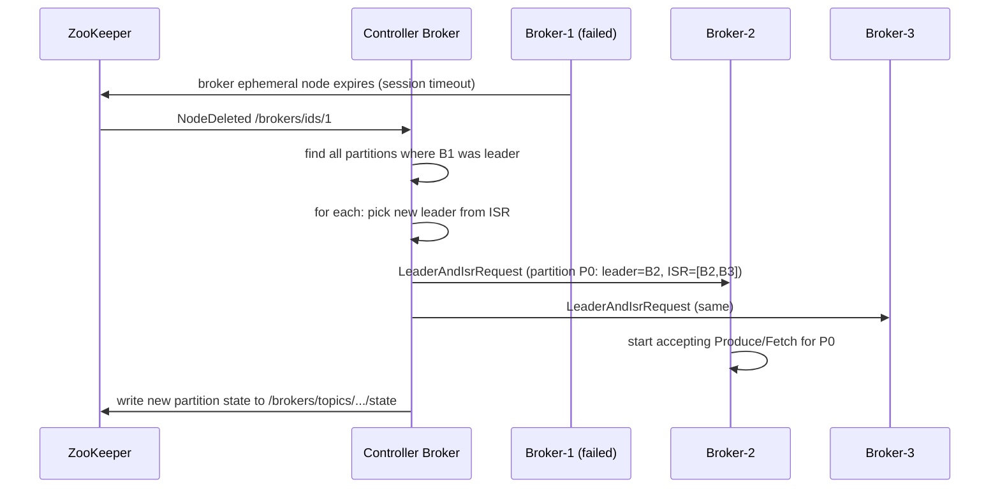

### Controller Responsibilities

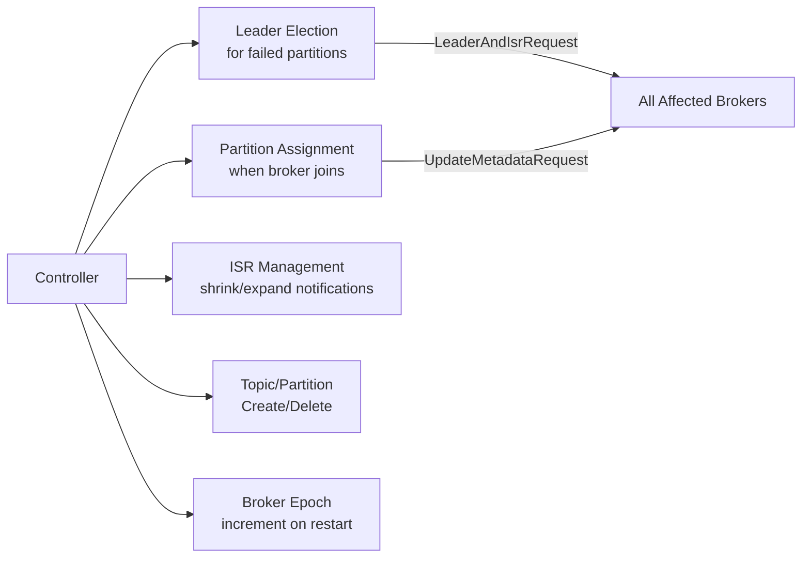

---

## 5. KRaft Mode: Removing ZooKeeper

KRaft (Kafka Raft) replaces ZooKeeper with an **internal metadata topic** `__cluster_metadata` managed by a Raft quorum of controller nodes.

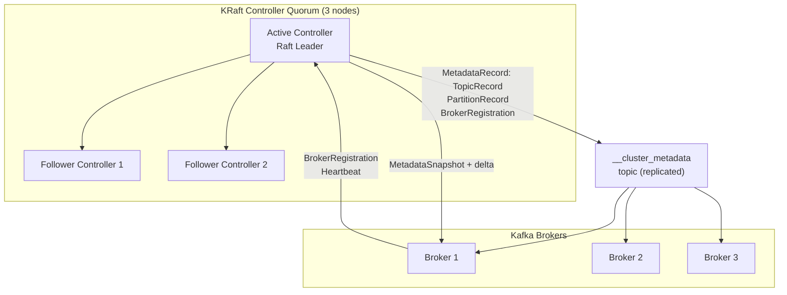

**Key difference from ZooKeeper mode**:
- Metadata operations are Raft log entries — they have ordering guarantees
- Brokers fetch metadata from `__cluster_metadata` topic (like consumer fetch)
- No external ZooKeeper process, no split-brain between ZK and Kafka state
- Broker epoch tracked in metadata log — stale requests rejected by epoch comparison
- Snapshot + incremental delta: brokers don't replay entire log from epoch 0

### Raft Metadata Record Types

```
MetadataRecord variants:
  RegisterBrokerRecord     — broker starts, registers endpoint + epoch
  BrokerRegistrationChange — broker updates capabilities
  TopicRecord              — topic created (id, name)
  PartitionRecord          — partition assignment (leader, ISR, replicas, leaderEpoch)
  RemoveTopicRecord        — topic deleted
  PartitionChangeRecord    — ISR change, leader change
  FeatureLevelRecord       — metadata version upgrade
  ClientQuotaRecord        — quota configuration
  ProducerIdsRecord        — PID block allocation
```

---

## 6. Hardware Selection Internals

The book's hardware guidance maps directly to Kafka's internal data path:

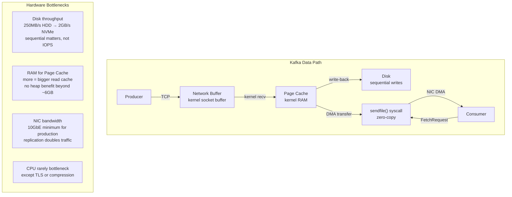

### OS Tuning Parameters

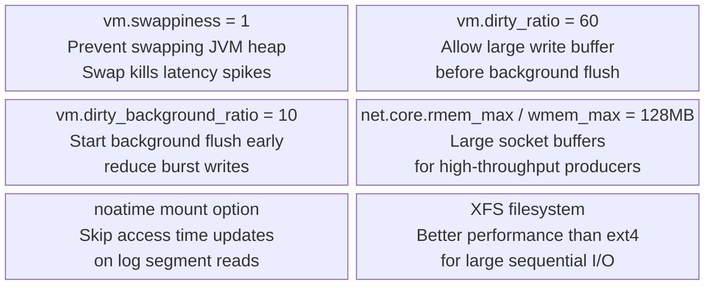

---

## 7. AdminClient: Async Event-Driven Architecture

AdminClient is built on the same `NetworkClient` as producers/consumers — fully async, non-blocking internally, exposing `KafkaFuture<T>` to callers.

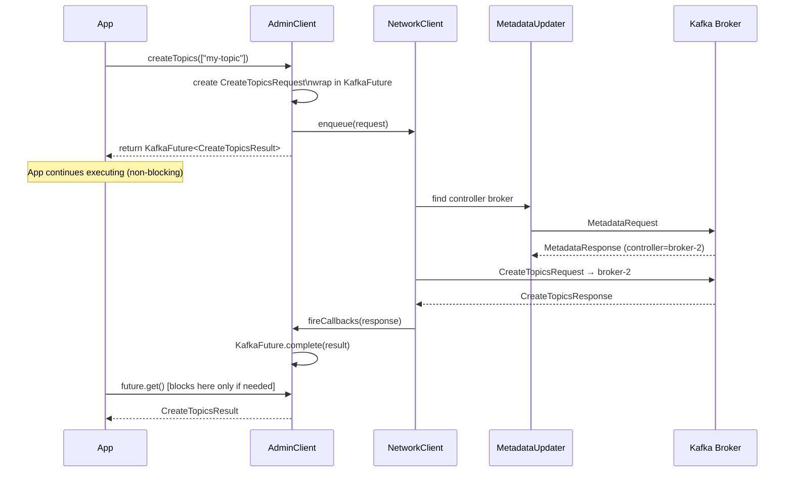

### KafkaFuture Chaining

```mermaid
flowchart LR
    BASE["KafkaFuture\n(AdminClient internal)"] -->|thenApply| MAPPED["KafkaFuture\n(user-visible result)"]
    MAPPED -->|get()| BLOCK[Blocking Wait]
    MAPPED -->|whenComplete(BiConsumer)| ASYNC[Async Callback\nnon-blocking]
    BLOCK --> RESULT[T or ExecutionException\ncause = Kafka error]
```

**Eventually Consistent**: AdminClient operations propagate through the cluster asynchronously. After `createTopics().get()` returns, other brokers may not yet see the topic in their metadata cache — they will within `metadata.max.age.ms`.

---

## 8. Consumer Group Protocol — Deep Internals

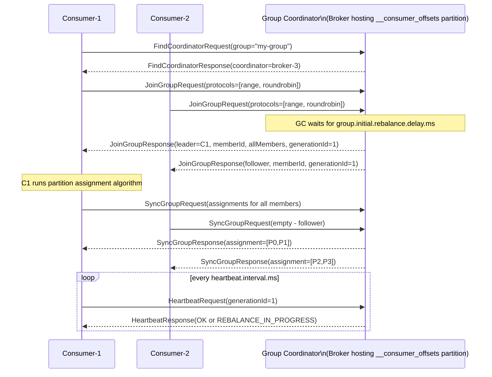

### Generation ID and Fencing

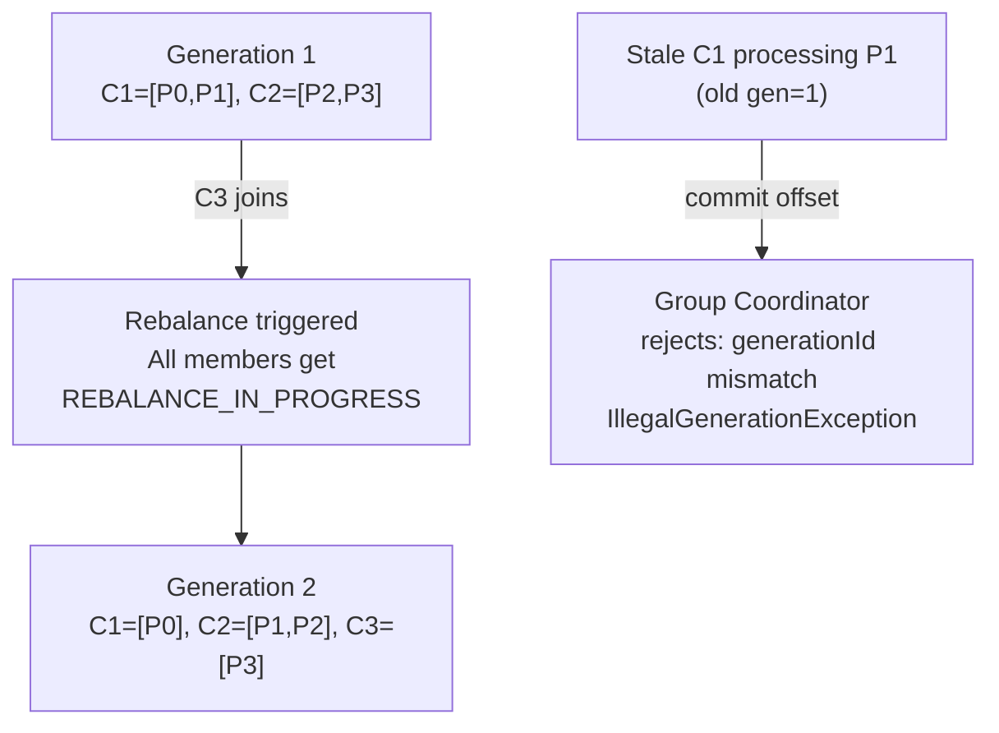

---

## 9. AdminClient Consumer Group Management Internals

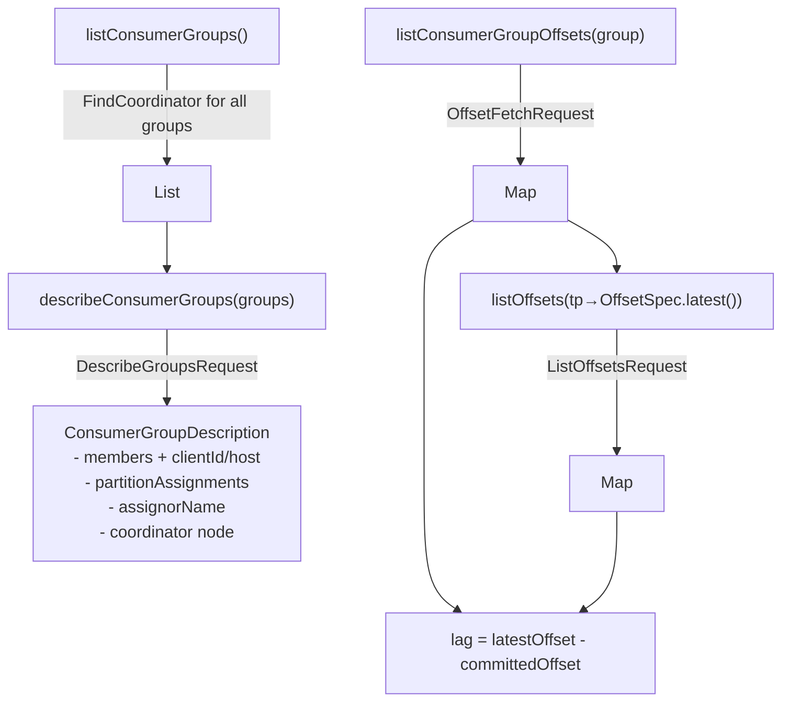

### Offset Reset Flow

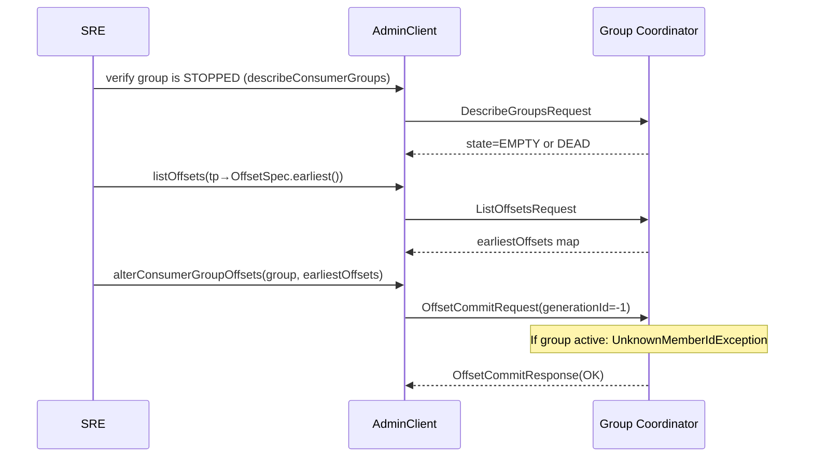

---

## 10. Replica Reassignment Internals

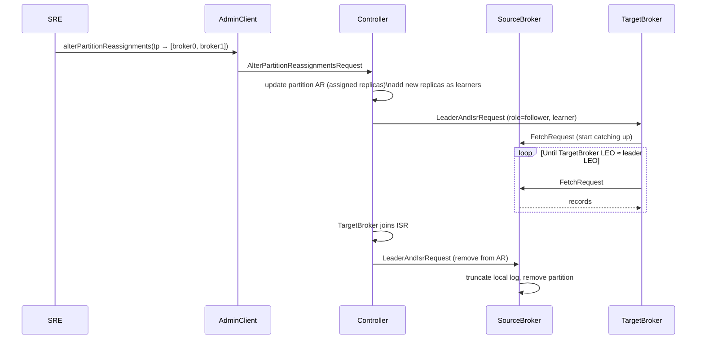

**Throttling replicas during reassignment**:
- `leader.replication.throttled.rate` and `follower.replication.throttled.rate`
- Configured per-topic as `leader.replication.throttled.replicas` and `follower.replication.throttled.replicas`
- Prevents reassignment from saturating broker network bandwidth

---

## 11. MirrorMaker 2 Cross-Datacenter Replication

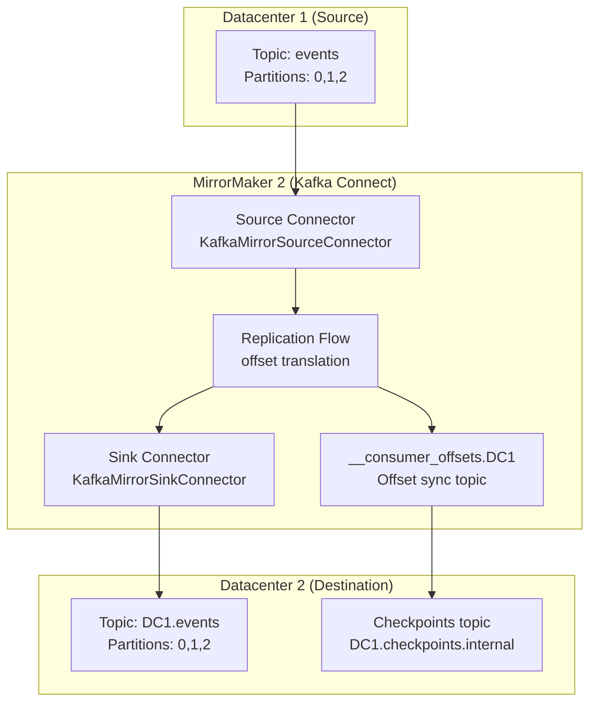

**Offset translation problem**: DC1 offset 1000 ≠ DC2 offset 1000. MirrorMaker 2 maintains a `checkpoints` topic that maps source consumer group offsets → translated target offsets, enabling consumer failover to DC2 without re-processing.

---

## 12. Kafka Connect Internal Architecture

```mermaid
flowchart TD
    subgraph Worker["Connect Worker Process"]
        direction TB
        WL[Worker Loop\nmain thread] --> CM[ConfigManager\nwatches config.storage.topic]
        WL --> OS[OffsetStorageWriter\nflushes to offset.storage.topic]
        WL --> TS[StatusBackingStore\nstatus.storage.topic]
        
        subgraph Tasks["Task Executors"]
            T1[SourceTask-0\nrecord producer loop]
            T2[SourceTask-1]
            T3[SinkTask-0\nrecord consumer loop]
        end
        
        CM --> Tasks
        T1 -->|SourceRecord[]| CP[Converter\nAvro/JSON/Protobuf]
        CP -->|ProducerRecord| KP[KafkaProducer\ninternal]
        KP --> TOPIC["Kafka Topic"]
        
        TOPIC --> KC[KafkaConsumer\ninternal]
        KC --> T3
        T3 -->|SinkRecord[]| SINK_SYS[External System\nDB, S3, Elasticsearch]
    end
```

**Distributed mode**: Workers form a group via `group.id` using the **same** consumer group protocol. The leader assigns connector tasks across workers via `SyncGroup`. Offset storage and status storage are shared Kafka topics — any worker can take over a task.

---

## 13. Broker Startup and Metadata Bootstrap

```mermaid
sequenceDiagram
    participant Broker
    participant ZK as ZooKeeper (classic mode)
    participant Controller

    Broker->>ZK: create ephemeral /brokers/ids/<id>
    ZK-->>Broker: session established
    Broker->>ZK: read /brokers/topics/* (partition assignments)
    Broker->>Broker: load log segments from log.dirs
    Broker->>Broker: recover incomplete segments (truncate to last stable offset)
    Broker->>Controller: register via /controller watch
    Controller->>Broker: UpdateMetadataRequest (full cluster state)
    Controller->>Broker: LeaderAndIsrRequest (partition roles)
    Broker->>Broker: start accepting client connections
```

**Log recovery on restart**: Broker reads `.checkpoint` file for each log directory — records last flushed offsets. Any records beyond checkpoint in `.log` file are replayed to verify CRC; truncation removes corrupt tail. For replicas, leader epoch checkpoint ensures no follower diverges from current epoch.

---

## 14. End-to-End Latency Decomposition

```mermaid
gantt
    dateFormat  SSS
    axisFormat %Lms
    section Producer
    RecordAccumulator batch fill    :a1, 000, 5ms
    Sender I/O thread network write :a2, after a1, 2ms
    section Network
    NIC transmit + kernel recv      :b1, after a2, 1ms
    section Broker
    Processor thread reassemble     :c1, after b1, 1ms
    IOHandler log append            :c2, after c1, 2ms
    ISR replication (acks=all)      :c3, after c2, 5ms
    ProduceResponse send            :c4, after c3, 1ms
    section Consumer
    Fetch poll interval             :d1, 015, 5ms
    Broker FetchResponse (HWM)      :d2, after c4, 2ms
    Consumer poll returns           :d3, after d2, 1ms
```

Key latency factors:
- `linger.ms` — deliberate batching delay at producer
- `acks=all` — waits for full ISR replication (cross-rack = 2-5ms extra)
- `fetch.min.bytes` — broker holds response until N bytes available (reduces requests, adds latency)
- `fetch.max.wait.ms` — max hold time for `fetch.min.bytes`

---

## 15. Quota Throttling Internals

```mermaid
flowchart TD
    REQ["ProduceRequest arrives"] --> QC[QuotaManager\ncheck bytes/sec quota]
    QC -->|within quota| APPEND[Log append immediately]
    QC -->|over quota| CALC["Calculate delay:\ndelay_ms = (actual - quota) / quota * window_ms"]
    CALC --> DEFER["Processor thread:\nmute channel for delay_ms\nthrottle_time in response header"]
    DEFER --> CLIENT["Client backs off\nthrottle_time_ms in ProduceResponse"]
    
    subgraph Quota Types
        UQ["User quota\nbytes/sec per principal"]
        CQ["Client ID quota\nbytes/sec per client.id"]
        BQ["Broker-level quota\nreplication throttle"]
    end
```

Quotas use a **sliding window** (default 30 x 1-second windows). Rate is computed as exponential moving average over these windows. When exceeded, the broker sends `ThrottleTime` in the response and mutes the socket channel to apply back-pressure without dropping connections.

---

## Summary: Full Request Lifecycle Map

```mermaid
flowchart TD
    PROD["Producer\nRecordAccumulator\n+Sender Thread"] -->|TCP ProduceRequest| NIO["Broker NIO\nAcceptor→Processor"]
    NIO -->|RequestChannel| IO["IOHandler\nlog append"]
    IO -->|LogManager| SEG["Segment .log file\npage cache write"]
    SEG -->|async OS flush| DISK["Persistent Storage"]
    
    SEG -->|ISR Fetch| FOL["Follower replicas\nFetch → replicate"]
    FOL -->|ACK via FetchResponse| IO
    IO -->|HWM advance| SEG
    
    CON["Consumer\npoll()"] -->|FetchRequest| NIO2["Broker NIO"]
    NIO2 --> IO2["IOHandler\nfetch up to HWM"]
    IO2 -->|sendfile()| CON
    
    CTRL["Controller\n(ZK or KRaft)"] -->|LeaderAndIsrRequest\nUpdateMetadata| NIO
    ADM["AdminClient\nKafkaFuture async"] -->|AdminRequest\nto controller| NIO
```

The broker is a **log-centric append machine**: every operation reduces to writes to append-only segment files, served from OS page cache via zero-copy `sendfile()`. Replication, quota management, and cluster coordination layer on top of this immutable log foundation.
