# Apache Kafka — Under the Hood: Internal Architecture & Data Flow

> Sources: *Kafka: The Definitive Guide (2nd Edition)* — Shapira, Palino, Sivaram, Narkhede (O'Reilly 2022); *Kafka in Action* — Dylan Scott (Manning)

---

## 1. The Commit Log as Foundational Data Structure

Kafka's central abstraction is not a queue — it is a **durable, ordered, append-only log**. Every partition is one log. Understanding the log's physical layout is the prerequisite to understanding everything else.

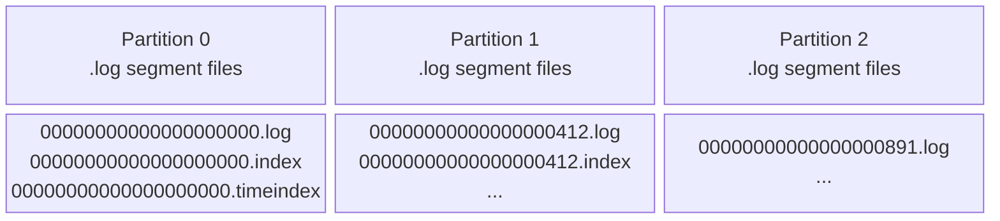

Each segment triple:
- `.log` — raw message bytes, appended sequentially
- `.index` — sparse offset → byte-position mapping (binary search entry point)
- `.timeindex` — timestamp → offset mapping (time-based seek)

The **active segment** is the only file receiving writes. Once a segment reaches `log.segment.bytes` (default 1 GB) or `log.roll.hours` (default 168 h), Kafka rolls a new active segment. Old segments are candidates for deletion or compaction based on retention policy.

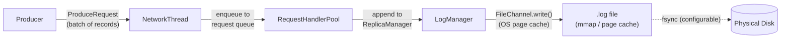

**Key insight**: Kafka does not call `fsync` per-message by default (`log.flush.interval.messages=Long.MAX_VALUE`). Durability comes from **replication**, not from forced disk flushes. The OS page cache absorbs writes; the broker later flushes via background OS writeback.

---

## 2. Partition Anatomy and Offset Mechanics

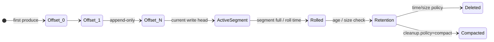

The `.index` file stores sparse entries: `(relative_offset, file_position)` pairs at configurable granularity (`log.index.interval.bytes`). Consumer seek to offset `N`:

1. Binary search `.index` for largest entry ≤ N → byte position `P`
2. Seek `.log` to `P`, scan forward until offset `N` found

This gives **O(log n)** seek on sparse index + bounded linear scan.

---

## 3. Producer Internals: RecordAccumulator and Batching

A Kafka producer does not send records one-at-a-time. The entire pipeline is designed around batching and async delivery.

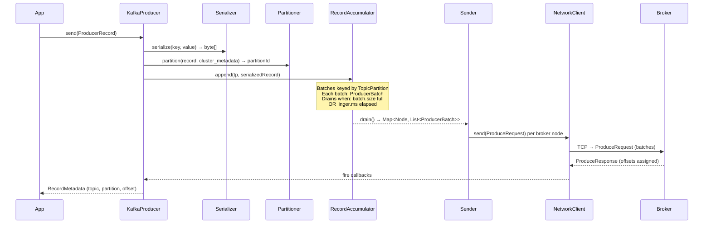

**RecordAccumulator** is a `CopyOnWriteMap<TopicPartition, Deque<ProducerBatch>>`. The `Sender` thread drains it continuously, grouping all batches destined for the same broker into a single `ProduceRequest`. This minimizes TCP round-trips: one request per broker per drain cycle, regardless of how many partitions live on that broker.

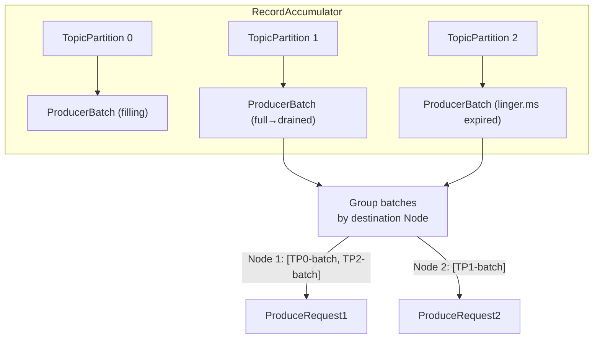

### Partitioning Algorithm

Default (no key): **sticky partitioner** (Kafka 2.4+). The producer selects a random partition and sticks to it until the batch fills or linger.ms fires, then rotates. This maximizes batch fill efficiency.

With a key: `murmur2(key) % numPartitions`. Same key → same partition, always. This is a deterministic mapping baked into `DefaultPartitioner` — it survives broker restarts because partition count doesn't change (without explicit repartitioning).

---

## 4. Idempotent Producer and Exactly-Once Semantics

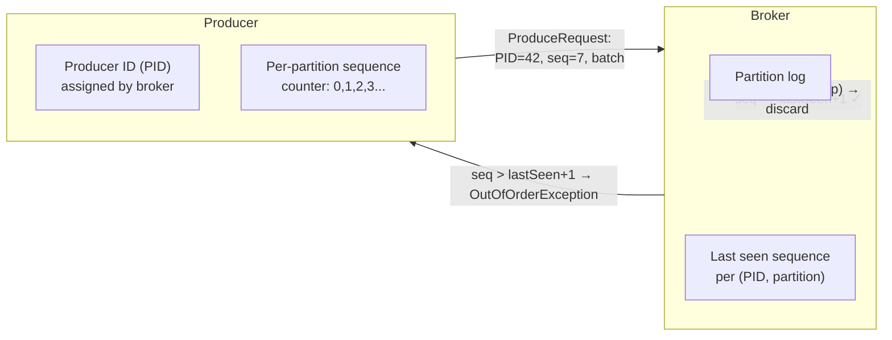

The broker maintains a **sequence number window** per `(PID, partition)`. If a producer retries due to network failure, the broker deduplicates by checking if the incoming sequence is already committed. This eliminates duplicates **within a single producer session** with zero application-level code.

For **cross-partition / cross-session** exactly-once (transactional API):

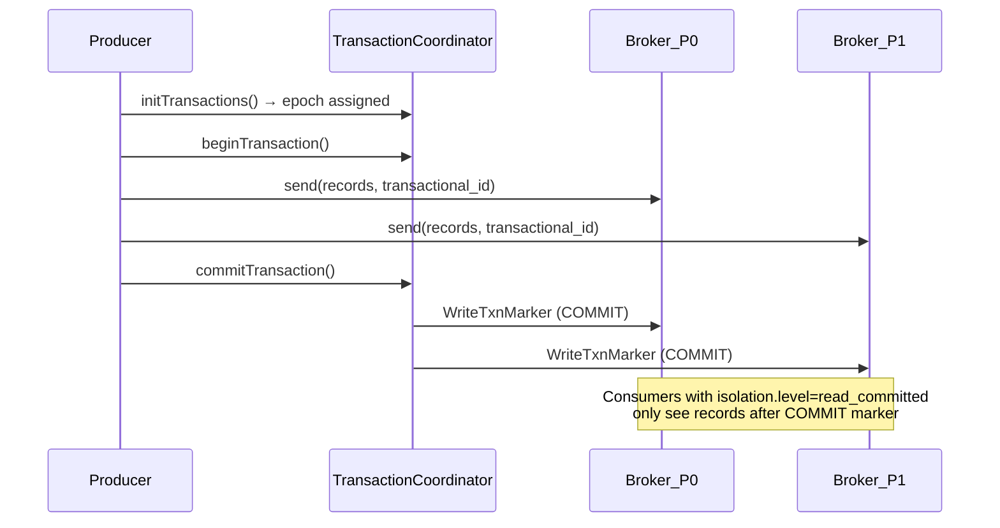

The transaction coordinator uses a special internal topic `__transaction_state` (50 partitions by default) as its durable log. The two-phase commit protocol (prepare → commit markers) ensures atomicity across partitions.

---

## 5. Broker Request Pipeline: The I/O Thread Model

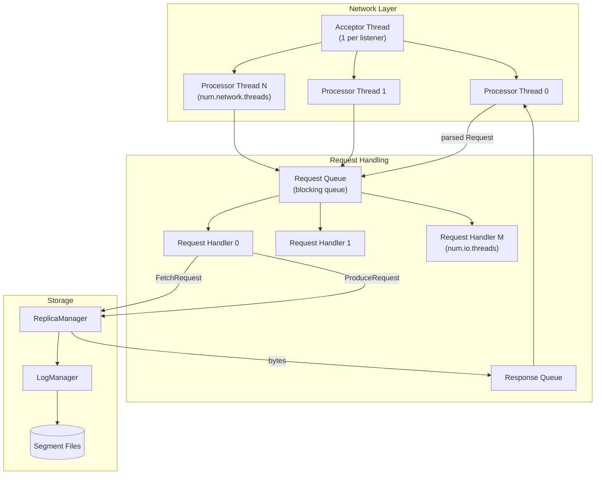

- **Acceptor**: one thread per listener (PLAINTEXT, SSL), accepts TCP connections, hands them to processor threads via round-robin
- **Processor threads** (`num.network.threads`, default 3): reads from socket → deserializes → enqueues to request queue; writes responses back to sockets
- **Request handler pool** (`num.io.threads`, default 8): dequeues requests, calls `ReplicaManager`, returns response object to processor's response queue

This design separates network I/O (non-blocking) from disk I/O (potentially blocking on page cache misses), preventing slow disk operations from stalling the network layer.

---

## 6. Replication: ISR, Leader Election, HWM

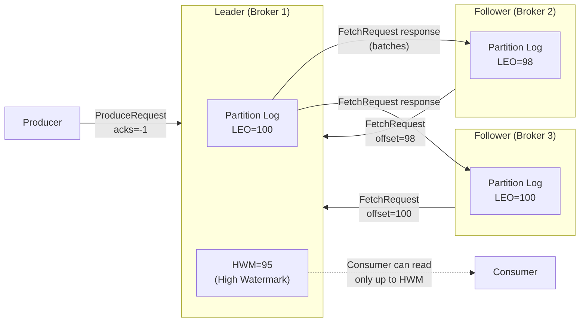

**ISR (In-Sync Replicas)**: the set of replicas whose LEO (Log End Offset) is within `replica.lag.time.max.ms` (default 30 s) of the leader's LEO. The HWM advances to `min(LEO across all ISR members)`.

When `acks=-1` (all), the producer waits until all ISR replicas have confirmed the write. This is what makes Kafka durable without `fsync`.

**ISR shrink**: if a follower falls behind (network partition, GC pause), leader removes it from ISR. HWM can now advance faster (smaller quorum). The controller writes ISR changes to `__cluster_metadata` (KRaft) or ZooKeeper.

**Unclean leader election** (`unclean.leader.election.enable`): if all ISR replicas die, Kafka can elect an out-of-sync follower as leader. This recovers availability at the cost of data loss.

---

## 7. Consumer Group Internals: Rebalance Protocol

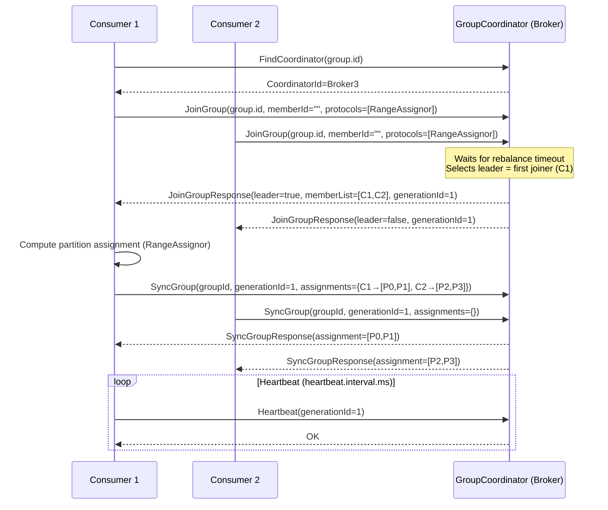

The **group coordinator** is a broker determined by: `hash(group.id) % __consumer_offsets.numPartitions`. The coordinator stores committed offsets in `__consumer_offsets`.

**Cooperative rebalancing** (Kafka 2.4+ `CooperativeStickyAssignor`): instead of revoking all partitions and reassigning, only the partitions that need to move are revoked. This eliminates the "stop-the-world" pause of eager rebalancing.

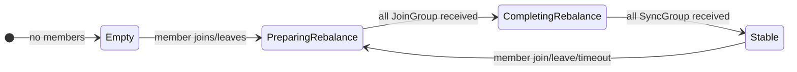

---

## 8. Offset Commit Internals

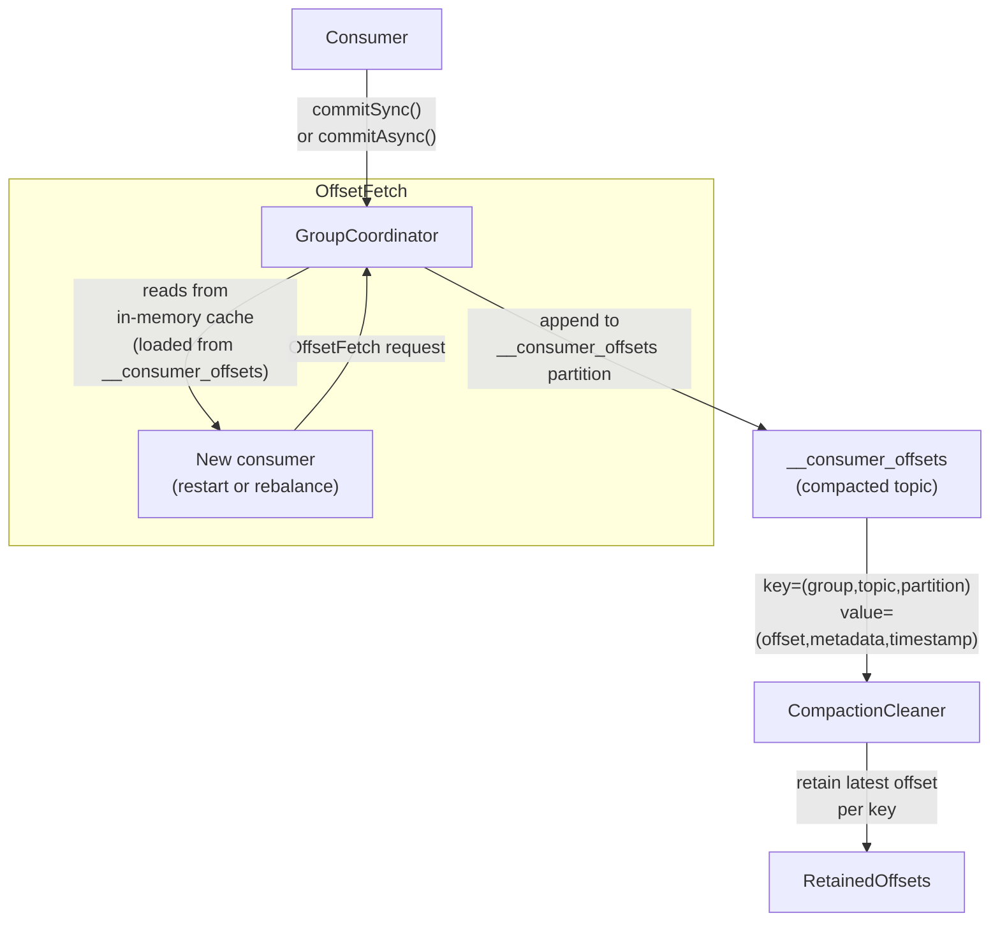

On broker startup, the coordinator **replays** the entire `__consumer_offsets` partition to rebuild its in-memory offset map. Compaction ensures this replay stays bounded — only the latest committed offset per `(group, topic, partition)` key is retained.

---

## 9. Log Compaction Mechanics

Compaction preserves **the latest value for each key** indefinitely, enabling Kafka to act as a key-value changelog store.

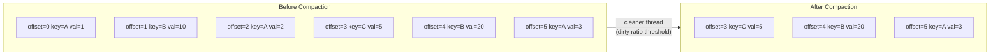

The **log cleaner** (background thread pool) operates on the "dirty" portion of the log — segments that have not been cleaned since the last pass. It:
1. Builds an in-memory `OffsetMap` (key hash → max offset seen so far) by scanning dirty segments
2. Re-copies records to new segments, skipping any record whose key has a higher-offset entry in the map
3. Replaces old segments with cleaned segments atomically

**Tombstones**: a record with key=K and null value is a deletion marker. The cleaner retains tombstones for `delete.retention.ms` (default 24 h) to allow consumers to observe the deletion, then purges them.

---

## 10. ZooKeeper → KRaft Migration

Pre-3.0 Kafka used ZooKeeper to store:
- Broker registration (`/brokers/ids/`)
- Topic configurations (`/config/topics/`)
- ISR state (`/brokers/topics/<t>/partitions/
/state`)
- Controller election (`/controller`)

This created a metadata bottleneck: every partition state change required a ZooKeeper write. At 200K partitions, this became a multi-minute recovery bottleneck.

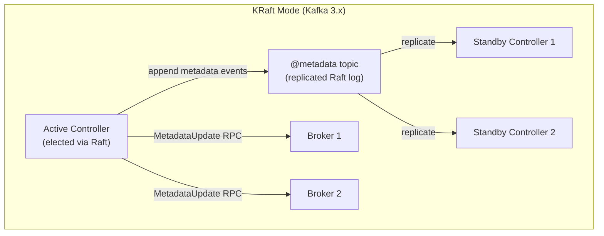

KRaft stores all cluster metadata in a Kafka topic (`@metadata`) replicated across 3–5 controller nodes using the Raft consensus protocol. Brokers maintain a local **metadata cache** and receive incremental updates from the active controller. Controller failover is now a pure Raft leader election — sub-second, no ZooKeeper coordination needed.

---

## 11. AdminClient Internal Flow

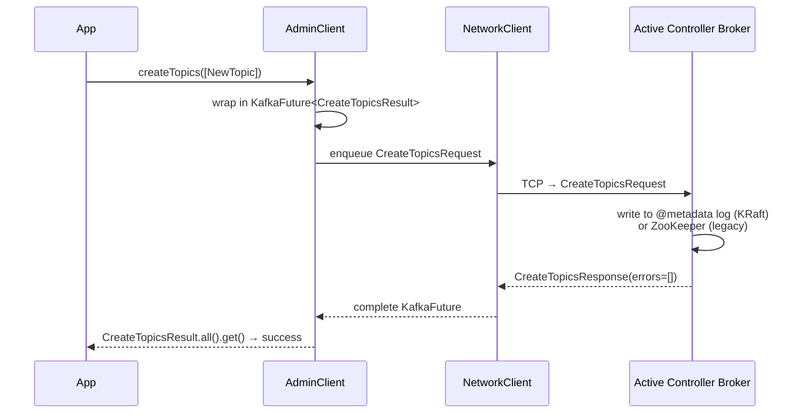

All mutating operations (create, delete, alter) route to the **active controller**. Read operations (listTopics, describeCluster) route to the **least loaded broker** — the client's internal `MetadataCache` tracks broker load via response latencies.

The `KafkaFuture` wrapper is a custom future (not `CompletableFuture`) that ensures thread-safe completion callbacks. `whenComplete()` fires on the client's I/O thread — never block inside it.

---

## 12. Producer → Broker → Consumer: Full Data Path

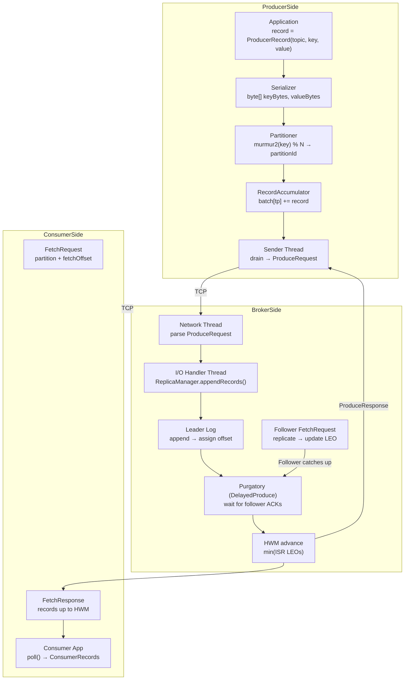

The **purgatory** (`DelayedProducePurgatory`) is an in-memory timer wheel containing pending produce requests awaiting replication. When a follower's FetchRequest arrives and advances the ISR's minimum LEO past the threshold, the purgatory watcher fires the produce callback.

---

## 13. MirrorMaker 2 / Multi-Cluster Replication

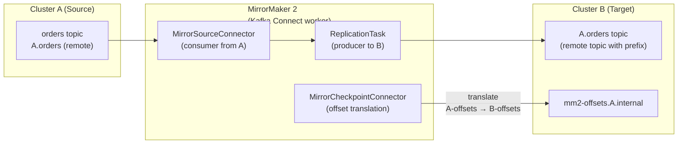

MirrorMaker 2 prefixes remote topics with the source cluster alias (`A.orders`) to avoid naming collisions. The `MirrorCheckpointConnector` maintains offset translations so that failover consumers can resume at the correct position on the target cluster.

---

## 14. Storage Internals: Segment File I/O and Zero-Copy

Kafka's throughput advantage comes from two OS-level mechanisms:

**Sequential disk writes**: The OS can batch sequential writes into large disk I/O operations. Kafka's append-only design means every write to a partition is sequential — no random seeks.

**Zero-copy via `sendfile()`**: Consumer fetch requests are served via `FileChannel.transferTo()` (Java) → `sendfile()` syscall. Data moves from:

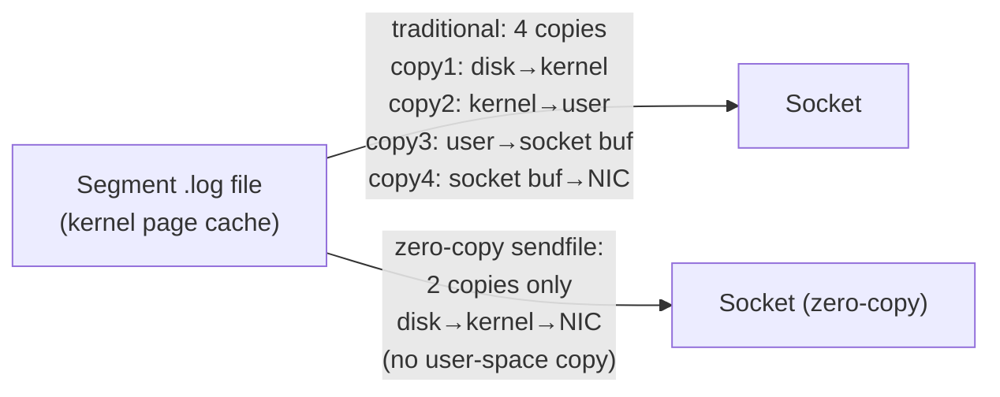

This eliminates two memory copies per fetch, reducing CPU usage by 60–70% for high-throughput consumers and allowing Kafka to serve consumers at near-disk-bandwidth speeds.

---

## 15. Schema Registry Integration

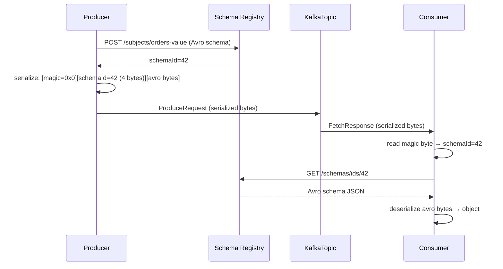

Every message contains a 5-byte header: `[0x00 magic][4-byte schema ID]`. The Schema Registry maps IDs to Avro/JSON/Protobuf schemas. Schema evolution is governed by **compatibility rules** (BACKWARD, FORWARD, FULL) enforced at registration time — consumers reading old schemas can decode new messages safely.
