# Kafka Producer & Consumer Internals — Under the Hood

> Sources: *Apache Kafka* (Nishant Garg, Packt 2013) · *Effective Kafka* (Emil Koutanov, Leanpub 2021) · *Learning Apache Kafka 2nd Edition*

---

## 1. Producer Architecture: The Two-Thread Model

```mermaid
flowchart TD
    subgraph AppThread["Application Thread"]
        APP["Application Code\nproducer.send(ProducerRecord)"]
        SER["Serializer\n(key + value → byte[])"]
        PART["Partitioner\n(assign partition number)"]
        ACC["RecordAccumulator\n(in-memory deque per partition)"]
    end
    subgraph SenderThread["Sender Thread (background I/O)"]
        DRAIN["drain(): pull batches ready to send"]
        NC["NetworkClient\n(non-blocking NIO)"]
        BROKER["Kafka Broker\n(ProduceRequest)"]
    end

    APP --> SER --> PART --> ACC
    ACC -->|"batch.size reached OR linger.ms expired"| DRAIN
    DRAIN --> NC --> BROKER
    BROKER -->|"ProduceResponse (acks)"| NC
    NC -->|"callback / future.complete()"| APP

    style AppThread fill:#1a1a2e,stroke:#4a90d9
    style SenderThread fill:#16213e,stroke:#4a90d9
```

**Critical insight**: `producer.send()` never directly writes to the network. It serializes the record, assigns a partition, appends to the `RecordAccumulator` deque, and returns. A separate background I/O thread (`Sender`) drains the accumulator and sends batches via `NetworkClient`.

---

## 2. RecordAccumulator: Batching Internals

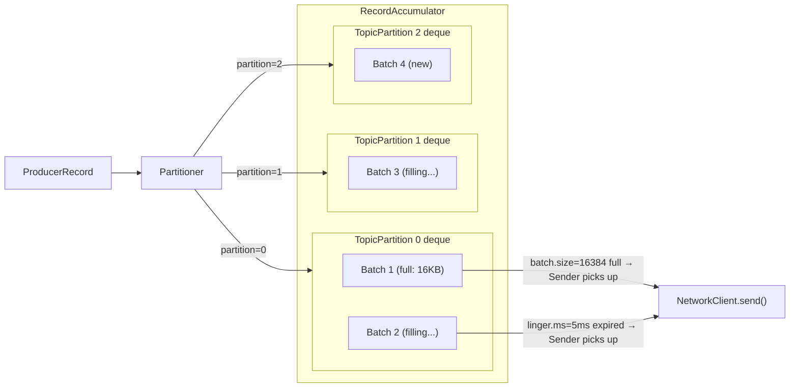

**Batch.size**: Upper limit in bytes per batch per partition. When a batch reaches `batch.size`, the Sender thread immediately drains it — no waiting.  
**Linger.ms**: If a batch hasn't filled up, wait at most `linger.ms` for more records. Default = 0 (no artificial delay).  
**Sticky partitioning** (Kafka 2.4+): When sending records with null keys, the producer "sticks" to one partition for the current batch's lifetime, then randomly picks a new partition. This avoids the "round-robin per record" anti-pattern that fragments batches across all partitions.

---

## 3. Partitioning: How a Record Finds Its Partition

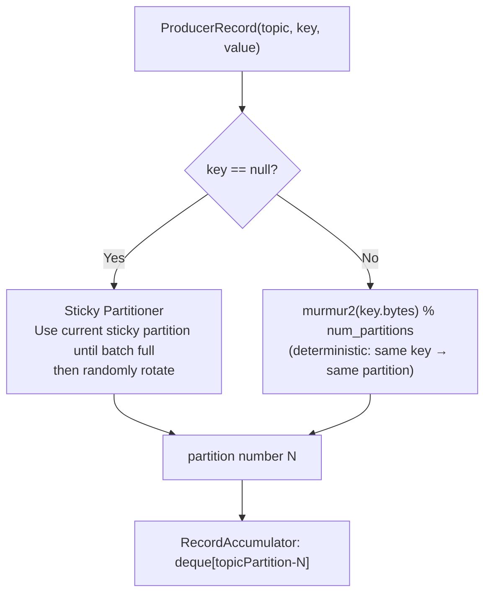

**Why determinism matters**: All records with the same key always go to the same partition, guaranteeing **total ordering** per key. Different keys may hash to the same partition (many-to-one). Changing partition count breaks key-to-partition mapping — requires careful planning.

**Custom partitioner**: Implement `Partitioner.partition(topic, key, keyBytes, value, valueBytes, cluster)`. Useful for hot-key mitigation (distribute a high-volume key across multiple partitions intentionally).

---

## 4. Producer Acknowledgement Modes (acks)

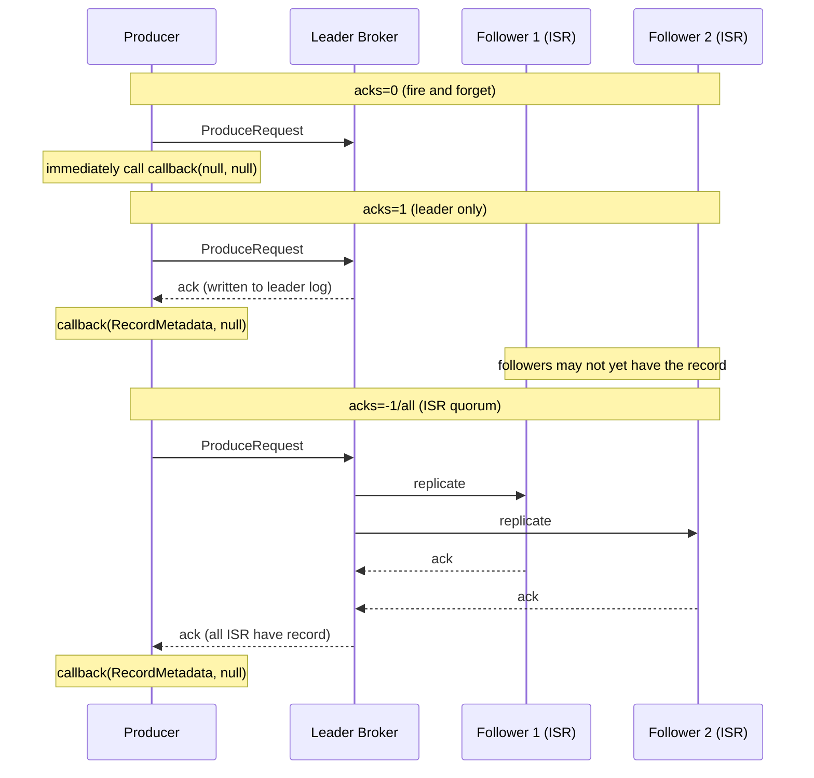

| acks | Durability | Throughput | Risk |
|---|---|---|---|
| 0 | None | Highest | Record lost if broker crashes |
| 1 | Leader-only | Medium | Lost if leader crashes before ISR sync |
| -1/all | Full ISR | Lowest | Safe, but blocks on min.insync.replicas |

---

## 5. In-Sync Replicas (ISR): The Replication Heart

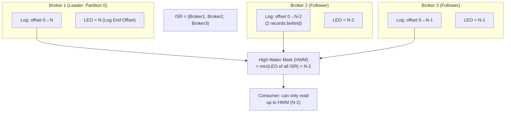

**ISR mechanism**: A follower is removed from the ISR if it falls behind by more than `replica.lag.time.max.ms` (default 30s) — i.e., it hasn't fetched from the leader recently.  
**HWM**: Consumers can only read records at or below the High-Water Mark — the minimum LEO across all ISR members. This prevents reading uncommitted (not-yet-replicated) records.  
**min.insync.replicas**: If ISR shrinks below this value and `acks=-1`, the broker rejects writes with `NotEnoughReplicasException`. Protects against data loss.

---

## 6. Idempotent Producer: Exactly-Once at the Produce Layer

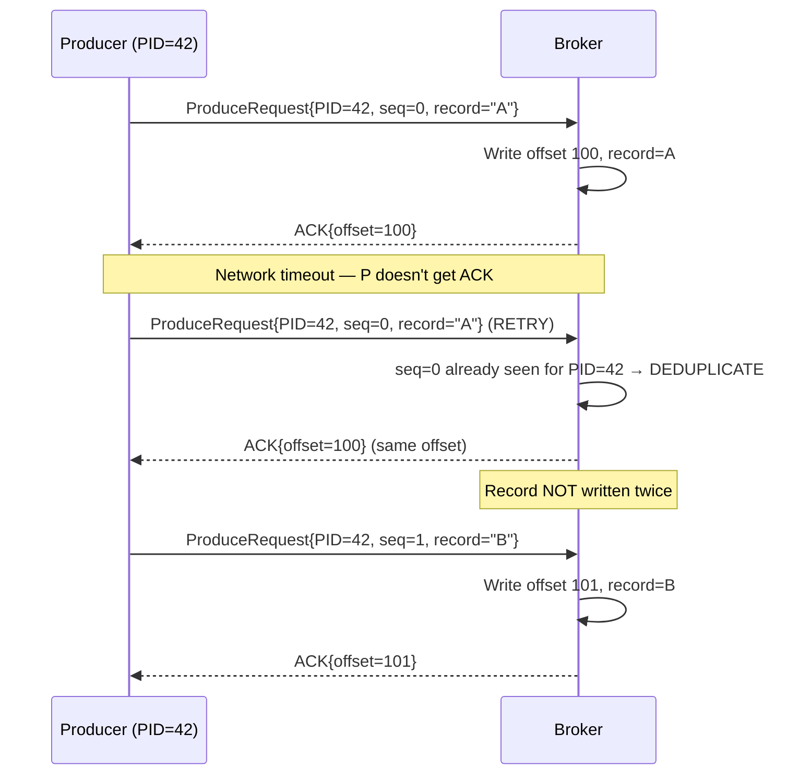

**Idempotent producer** (`enable.idempotence=true`):
- Broker assigns each producer a **PID (Producer ID)** on registration
- Each partition-targeted batch carries a **monotonically increasing sequence number**
- Broker tracks the last committed `(PID, sequence)` per partition — deduplicates retries
- Protects against duplicate records from network timeouts and retries
- Requires: `acks=-1`, `retries > 0`, `max.in.flight.requests.per.connection ≤ 5`

---

## 7. Kafka Transactions: Atomic Multi-Partition Writes

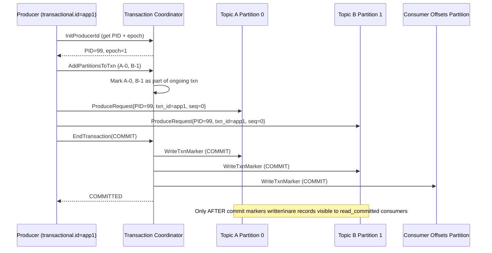

**Transaction coordinator**: One broker per `transactional.id` (hashed to `__transaction_state` partition). Stores the transaction log.  
**Isolation levels for consumers**:
- `isolation.level=read_committed` (default for EOS): Consumer only reads records whose transaction has been committed. Reads are bounded by the **Last Stable Offset (LSO)** — the offset below which all transactions are committed or aborted.
- `isolation.level=read_uncommitted`: Consumer reads all records including those in open transactions.

---

## 8. Consumer Group Protocol: JoinGroup / SyncGroup

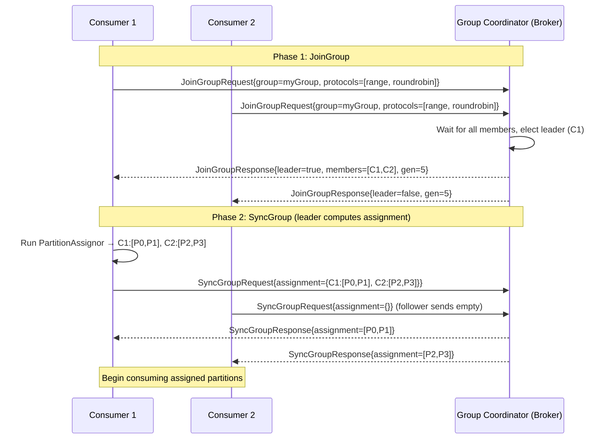

**Generation ID**: Increments on every rebalance. Consumers reject offset commits from stale generations — prevents zombie consumers from committing offsets.  
**Group coordinator**: One broker per consumer group (hashed from group ID to `__consumer_offsets` partition leader).

---

## 9. Consumer Heartbeat & Session Management

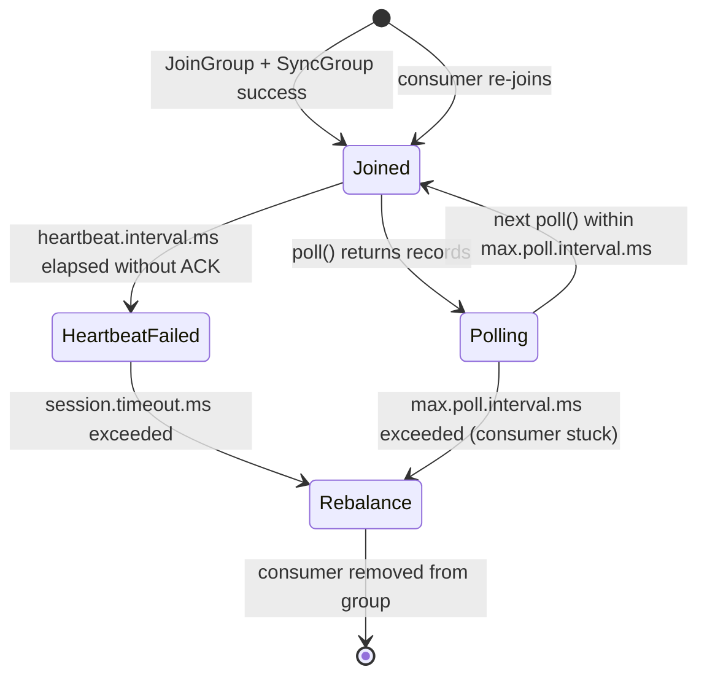

**Two independent timers**:
1. **`session.timeout.ms`** (default 45s): Broker-side timer. If no heartbeat received within this window, broker considers consumer dead → triggers rebalance. Heartbeats sent by a background thread.
2. **`max.poll.interval.ms`** (default 5min): Client-side timer. If `poll()` isn't called within this interval, the consumer self-evicts from the group. Guards against consumers stuck in long processing loops.

---

## 10. Consumer Fetch Internals: Fetch Requests & Offset Commits

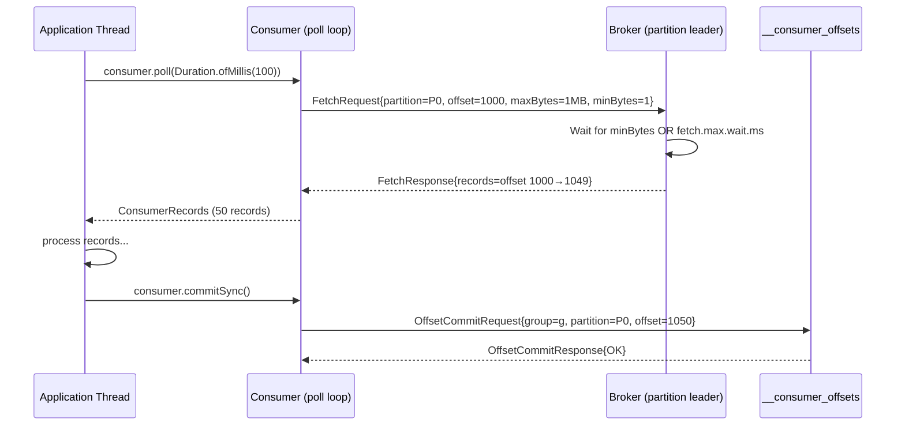

**`fetch.min.bytes`** (default 1): Broker waits until at least this many bytes are available before responding. Reduces unnecessary empty fetch responses.  
**`fetch.max.wait.ms`** (default 500ms): Maximum time broker waits to satisfy `fetch.min.bytes`. Acts as a safety valve — response sent even if minimum bytes not available.  
**`max.poll.records`** (default 500): Hard cap on records returned per `poll()` call. Tune down if per-record processing is slow.

---

## 11. Offset Commit Strategies

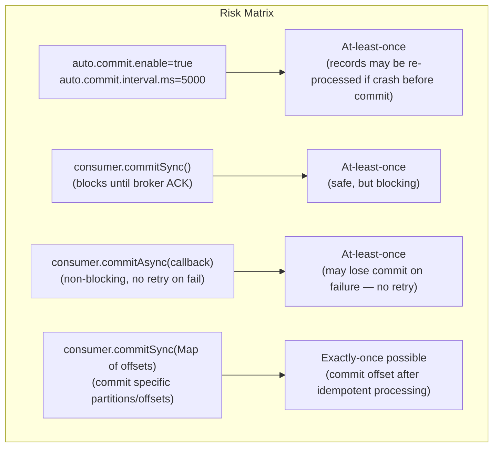

**Auto-commit pitfall**: Auto-commit fires every `auto.commit.interval.ms` regardless of processing state. If the JVM crashes after `poll()` returns 100 records but before all 100 are processed, records 50-100 may auto-commit, causing silent data loss.

**Offset commit internals**: Committed offsets are written to the special topic `__consumer_offsets` (50 partitions by default). The partition is determined by `hash(group_id) % 50`. Compact topic — only the latest offset per `(group, topic, partition)` triple is retained.

---

## 12. Kafka Storage: Log Segment Files

```mermaid
block-beta
    columns 1
    block:TOPIC["Topic: orders, Partition 0"]:1
        block:SEG0["Segment 0 (base offset 0)"]
            A["00000000000000000000.log\n(message data, append-only)"]
            B["00000000000000000000.index\n(offset → file position sparse index)"]
            C["00000000000000000000.timeindex\n(timestamp → offset sparse index)"]
        end
        block:SEG1["Segment 1 (base offset 1000000)"]
            D["00000000001000000000.log"]
            E["00000000001000000000.index"]
            F["00000000001000000000.timeindex"]
        end
        block:ACTIVE["Active Segment (writes append here)"]
            G["00000000002500000000.log (open)"]
            H["00000000002500000000.index"]
        end
    end
```

**Segment files**: A partition is stored as multiple **segment files**. Each segment has a `.log` (data), `.index` (sparse offset→position), and `.timeindex` (sparse timestamp→offset). New records always append to the **active segment**.

**Segment rolling**: When the active segment reaches `log.segment.bytes` (default 1GB) or `log.roll.ms`, it's closed and a new active segment is created. Segment file names encode the **base offset** (first record's offset in that segment).

---

## 13. Zero-Copy: sendfile() Optimization

```mermaid
flowchart TD
    subgraph WithoutZeroCopy["Without Zero-Copy (4 copies)"]
        DISK1["Disk"] -->|read syscall| KC1["Kernel Buffer"]
        KC1 -->|copy| UC1["User-space Buffer (JVM heap)"]
        UC1 -->|write syscall| KC2["Socket Buffer"]
        KC2 -->|DMA| NIC1["NIC (send to consumer)"]
    end
    subgraph WithZeroCopy["With Zero-Copy: sendfile() (2 copies)"]
        DISK2["Disk"] -->|DMA read| KC3["Kernel Buffer"]
        KC3 -->|sendfile() - kernel copies directly| SC["Socket Buffer"]
        SC -->|DMA| NIC2["NIC (send to consumer)"]
        Note["User-space never touched\nNo JVM GC pressure"]
    end
    style WithoutZeroCopy fill:#2d1b1b,stroke:#ff6b6b
    style WithZeroCopy fill:#1b2d1b,stroke:#6bff6b
```

**Zero-copy** is why Kafka can achieve millions of messages/sec: the kernel directly DMA's segment file data from page cache to the network socket without ever copying into user-space. This eliminates two data copies and two context switches per fetch request.  
**Caveat**: Zero-copy is disabled if broker-level compression differs from producer compression (broker must decompress + recompress → requires user-space involvement).

---

## 14. Log Retention & Compaction Internals

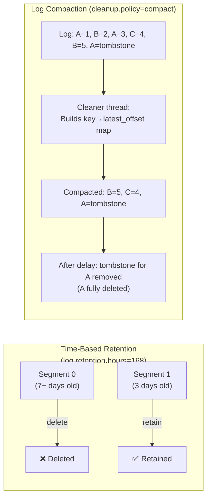

**Log compaction**: The cleaner thread runs in the background, building a key→latest_offset map over "dirty" (uncompacted) segments. It copies forward only the latest record per key, discarding older versions.  
**Tombstone**: A record with `value=null` signals deletion. The tombstone itself is retained for `delete.retention.ms` (default 24h) to allow consumers to discover the deletion before it disappears.

---

## 15. Compression: Batch-Level Encoding

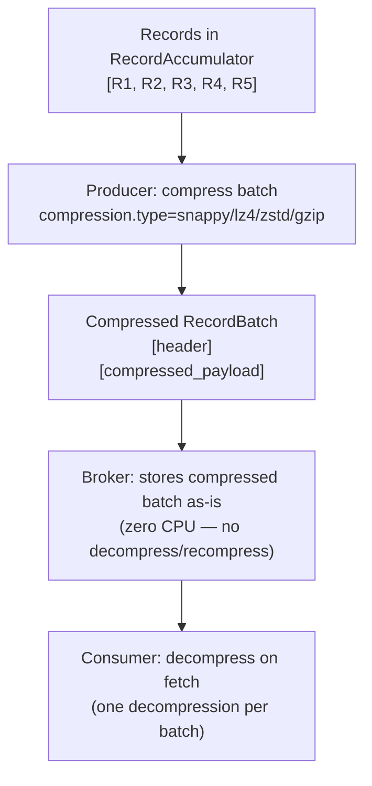

**Compression operates on the entire batch**, not individual records. This is why larger batches (`batch.size`, `linger.ms`) yield better compression ratios — more repetition across records for the algorithm to exploit.

| Algorithm | Compression ratio | Compress speed | Decompress speed | Best for |
|---|---|---|---|---|
| gzip | High | Slow | Medium | Archival, low-volume |
| snappy | Medium | Fast | Fast | Legacy consumers |
| lz4 | Medium | Fastest | Fastest | High-throughput, modern |
| zstd | High | Fast | Fast | Recommended for Kafka 2.1+ |

---

## 16. Consumer Partition Assignment Strategies

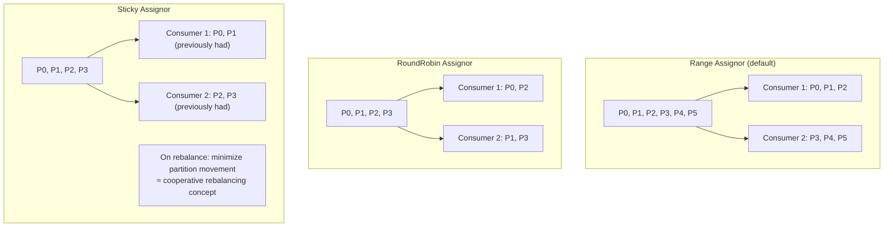

**Range**: Assigns consecutive partitions to each consumer. Can cause imbalance if multiple topics are subscribed — first consumer always gets the extra partition.  
**RoundRobin**: Cycles through all partitions across all subscribed topics, maximizing balance.  
**Sticky**: Tries to preserve existing assignments across rebalances. Minimizes state migration cost for stateful consumers.

---

## 17. Bootstrap, Metadata, and Leader Discovery

```mermaid
sequenceDiagram
    participant P as Producer/Consumer
    participant B0 as bootstrap-server (Broker 0)
    participant B1 as Broker 1 (partition leader)

    P->>B0: MetadataRequest{topics: ["orders"]}
    B0-->>P: MetadataResponse{
        brokers: [{id:0, host:b0}, {id:1, host:b1}],
        topics: [{name:"orders", partitions:[
            {id:0, leader:1, isr:[1,0]},
            {id:1, leader:0, isr:[0,1]}
        ]}]
    }

    Note over P: Cache metadata, refresh every metadata.max.age.ms
    P->>B1: ProduceRequest{topic:orders, partition:0, ...}
    B1-->>P: ProduceResponse

    Note over P: Metadata stale / leader changed
    P->>B0: MetadataRequest (refresh)
    B0-->>P: Updated MetadataResponse
```

**Bootstrap server ≠ permanent connection**: The bootstrap address is only used to fetch the initial cluster metadata. All subsequent requests go directly to the appropriate partition leader. `metadata.max.age.ms` (default 5min) controls how long metadata is cached before re-fetching.

---

## 18. Quotas: Byte-Rate Throttling

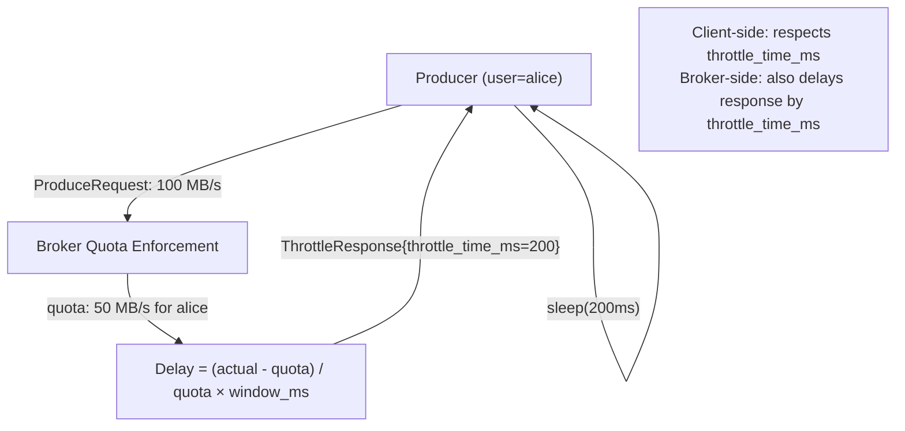

**Quota types**: Producer byte-rate, Consumer byte-rate, Request rate (CPU time as % of I/O threads). Applied per `(user, client-id)` pair. Quotas stored in ZooKeeper / KRaft metadata log, dynamically configurable without broker restart.

---

## Summary: Record Lifecycle — Producer to Consumer

```mermaid
sequenceDiagram
    participant APP as Application
    participant RA as RecordAccumulator
    participant NC as NetworkClient (I/O thread)
    participant LEADER as Broker (Leader)
    participant FOLLOWER as Broker (Follower/ISR)
    participant PAGE as Page Cache
    participant CONS as Consumer

    APP->>RA: send(key, value) → serialize → partition → enqueue
    Note over RA: Batch accumulates until batch.size OR linger.ms
    NC->>RA: drain() → pick ready batches
    NC->>LEADER: ProduceRequest (compressed batch)
    LEADER->>PAGE: write to page cache (mmap)
    LEADER->>FOLLOWER: replicate (FetchRequest)
    FOLLOWER-->>LEADER: ack (LEO update)
    LEADER->>LEADER: advance HWM to min(ISR LEOs)
    LEADER-->>NC: ProduceResponse{base_offset}
    NC-->>APP: callback(RecordMetadata)

    CONS->>LEADER: FetchRequest{offset=HWM}
    LEADER->>PAGE: sendfile() → zero-copy DMA
    LEADER-->>CONS: FetchResponse{compressed batch}
    CONS->>CONS: decompress, deserialize
    CONS->>CONS: process records
    CONS->>LEADER: OffsetCommitRequest → __consumer_offsets
