# Kafka Streams in Action — Under the Hood: Topology Execution, State, and Stream Processing Internals

> Source: *Kafka Streams in Action* — William P. Bejeck Jr., Manning 2018  
> Focus: Internal topology model, StreamTask execution, state store fault-tolerance, KTable cache mechanics, windowing state machines, Processor API scheduling, interactive query RPC routing

## Version and runtime boundary

- The source predates several current Kafka Streams changes. Confirm task assignment, state-store defaults, EOS mode, metrics, and APIs against the deployed client version.
- A logical topology, generated processor graph, subtopology, task, partition group, and stream thread are different units; do not use them interchangeably.
- Changelog restoration provides a recovery mechanism, not an instant availability guarantee. Measure state size, restore bandwidth, rebalance duration, standby freshness, and query behavior during migration.
- Exactly-once processing covers Kafka inputs, outputs, changelogs, and offsets in the transaction. External calls need a separate idempotency or reconciliation contract.

---

## 1. The Topology as a Directed Acyclic Graph (DAG)

Kafka Streams' mental model is fundamentally a DAG of processing nodes. Every transformation — `mapValues`, `filter`, `branch`, `groupBy`, `join` — becomes a **node** in this graph. The graph is assembled at build time (`StreamsBuilder.build()`) before any data flows.

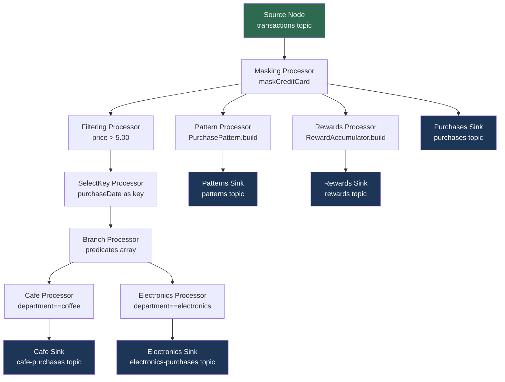
```mermaid
graph TD
    A[Source Node<br/>transactions topic] --> B[Masking Processor<br/>maskCreditCard]
    B --> C[Filtering Processor<br/>price > 5.00]
    C --> D[SelectKey Processor<br/>purchaseDate as key]
    D --> E[Branch Processor<br/>predicates array]
    E --> F[Cafe Processor<br/>department==coffee]
    E --> G[Electronics Processor<br/>department==electronics]
    F --> H[Cafe Sink<br/>cafe-purchases topic]
    G --> I[Electronics Sink<br/>electronics-purchases topic]
    B --> J[Pattern Processor<br/>PurchasePattern.build]
    B --> K[Rewards Processor<br/>RewardAccumulator.build]
    J --> L[Patterns Sink<br/>patterns topic]
    K --> M[Rewards Sink<br/>rewards topic]
    B --> N[Purchases Sink<br/>purchases topic]

    style A fill:#2d6a4f,color:#fff
    style H fill:#1d3557,color:#fff
    style I fill:#1d3557,color:#fff
    style L fill:#1d3557,color:#fff
    style M fill:#1d3557,color:#fff
    style N fill:#1d3557,color:#fff
```

### Node traversal: depth-first, single-threaded per StreamTask

Each `StreamTask` processes one partition assignment. When a record enters via the source node, execution propagates **depth-first** through the graph:

```
record arrives at Source Node
  → process at Masking Processor
    → process at Filtering Processor
      → process at Branch Processor
        → process at Cafe Processor (if predicate matches)
          → write to Cafe Sink
        → process at Electronics Processor (if predicate matches)
          → write to Electronics Sink
    → process at Pattern Processor
      → write to Patterns Sink
    → process at Rewards Processor
      → write to Rewards Sink
    → write to Purchases Sink
```

**Key implication**: no concurrent access to state stores from any single processor. `Processor.process()` and `Punctuator.punctuate()` are never called concurrently.

---

## 2. StreamThread and StreamTask Architecture

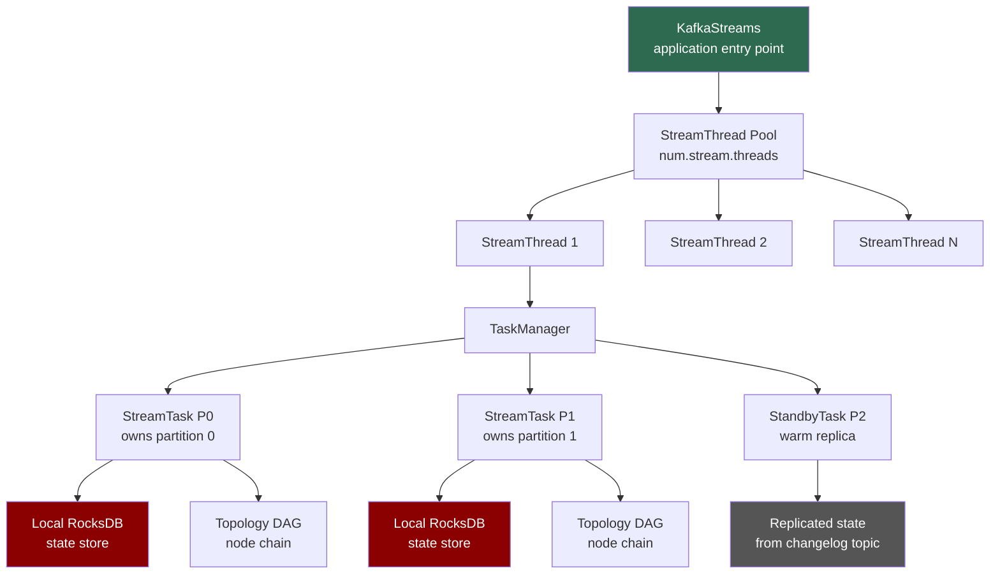
```mermaid
graph TD
    A[KafkaStreams<br/>application entry point] --> B[StreamThread Pool<br/>num.stream.threads]
    B --> C[StreamThread 1]
    B --> D[StreamThread 2]
    B --> E[StreamThread N]
    C --> F[TaskManager]
    F --> G[StreamTask P0<br/>owns partition 0]
    F --> H[StreamTask P1<br/>owns partition 1]
    F --> I[StandbyTask P2<br/>warm replica]
    G --> J[Local RocksDB<br/>state store]
    G --> K[Topology DAG<br/>node chain]
    H --> L[Local RocksDB<br/>state store]
    H --> M[Topology DAG<br/>node chain]
    I --> N[Replicated state<br/>from changelog topic]

    style A fill:#2d6a4f,color:#fff
    style J fill:#8b0000,color:#fff
    style L fill:#8b0000,color:#fff
    style N fill:#555,color:#fff
```

### Partition groups to tasks: topology-dependent mapping

```
Topic partitions:  [P0]  [P1]  [P2]  [P3]
                    │     │     │     │
StreamTasks:       [T0]  [T1]  [T2]  [T3]
                    │     │     │
                   RDB   RDB   RDB   (RocksDB per task)
```

Each `StreamTask` exclusively owns its partitions. This shared-nothing architecture means:
- State store `get(key)` = local RocksDB lookup (no network hop)
- No lock contention between tasks
- Task failure is isolated — other tasks continue unaffected

### The processing loop inside StreamThread

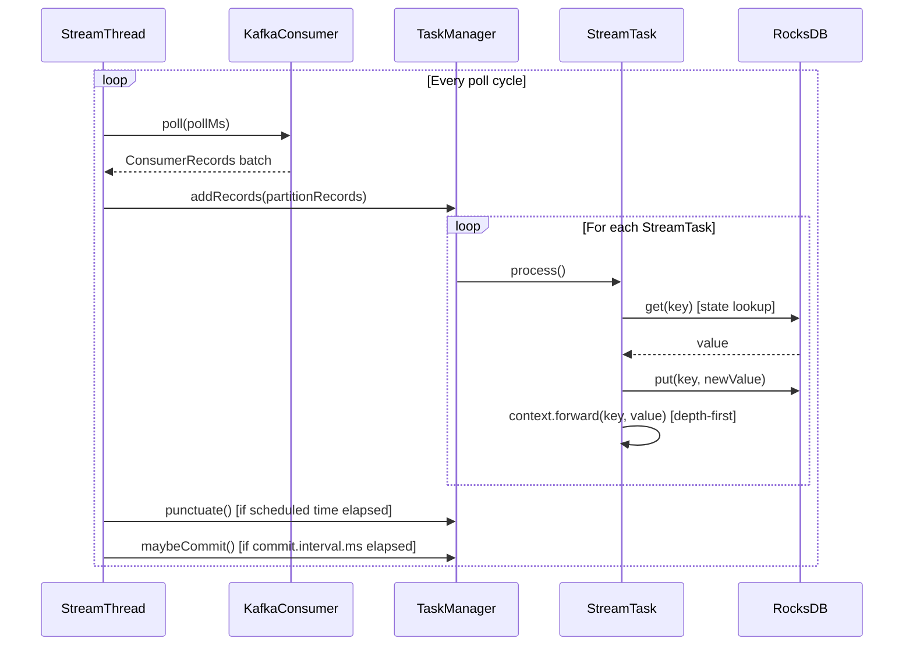
```mermaid
sequenceDiagram
    participant ST as StreamThread
    participant KCon as KafkaConsumer
    participant TM as TaskManager
    participant Task as StreamTask
    participant RDB as RocksDB

    loop Every poll cycle
        ST->>KCon: poll(pollMs)
        KCon-->>ST: ConsumerRecords batch
        ST->>TM: addRecords(partitionRecords)
        loop For each StreamTask
            TM->>Task: process()
            Task->>RDB: get(key) [state lookup]
            RDB-->>Task: value
            Task->>RDB: put(key, newValue)
            Task->>Task: context.forward(key, value) [depth-first]
        end
        ST->>TM: punctuate() [if scheduled time elapsed]
        ST->>TM: maybeCommit() [if commit.interval.ms elapsed]
    end
```

---

## 3. Serde Pipeline: How Bytes Flow Through the Topology

Every record in Kafka is raw bytes. The Serde (Serializer + Deserializer) wrapper handles conversion at boundaries:

```mermaid
flowchart LR
    A[Kafka Topic<br/>byte arrays] -->|deserialize key| B[String key]
    A -->|deserialize value| C[Purchase object]
    B --> D[Processor<br/>maskCreditCard]
    C --> D
    D -->|serialize key| E[byte[] key]
    D -->|serialize value| F[byte[] masked Purchase]
    E --> G[Kafka Sink Topic<br/>byte arrays]
    F --> G

    style A fill:#1d3557,color:#fff
    style G fill:#1d3557,color:#fff
```

### Custom Serde internals (JSON → bytes)

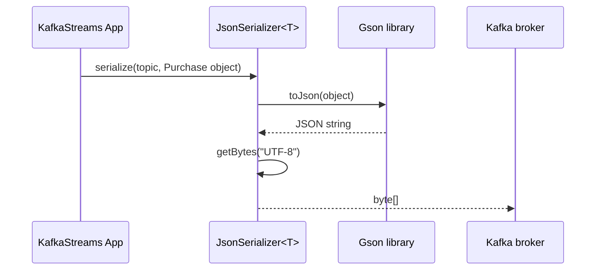
```mermaid
sequenceDiagram
    participant App as KafkaStreams App
    participant Ser as JsonSerializer<T>
    participant Gson as Gson library
    participant Kafka as Kafka broker

    App->>Ser: serialize(topic, Purchase object)
    Ser->>Gson: toJson(object)
    Gson-->>Ser: JSON string
    Ser->>Ser: getBytes("UTF-8")
    Ser-->>Kafka: byte[]
```

The `Serde<T>` container holds both `Serializer<T>` and `Deserializer<T>`. This reduces parameter count from 4 (separate key/value ser/deser) to 2 `Serde` instances per topology operation.

---

## 4. State Stores: RocksDB Internals and Fault Tolerance

### State store taxonomy

```mermaid
graph TD
    A[StateStore Types] --> B[In-Memory Key/Value<br/>Stores.inMemoryKeyValueStore]
    A --> C[Persistent Key/Value<br/>Stores.persistentKeyValueStore<br/>backed by RocksDB]
    A --> D[LRU Map<br/>Stores.lruMap]
    A --> E[Persistent Window Store<br/>Stores.persistentWindowStore]
    A --> F[Persistent Session Store<br/>Stores.persistentSessionStore]

    C --> G[RocksDB on local disk<br/>LSM-tree storage engine]
    E --> H[RocksDB + window keys<br/>(key, window_start_ms, window_end_ms)]
    F --> I[RocksDB + session keys<br/>(key, session_start, session_end)]
```

### Changelog topic: how state survives crashes

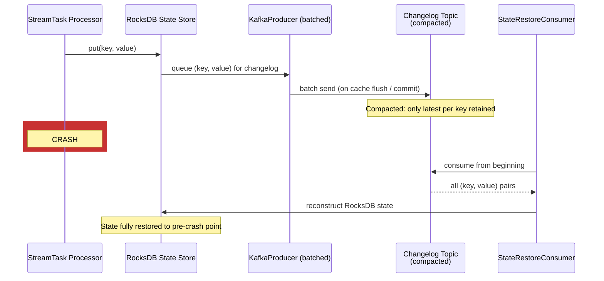
```mermaid
sequenceDiagram
    participant Proc as StreamTask Processor
    participant Store as RocksDB State Store
    participant KProd as KafkaProducer (batched)
    participant CL as Changelog Topic<br/>(compacted)
    participant Restore as StateRestoreConsumer

    Proc->>Store: put(key, value)
    Store->>KProd: queue (key, value) for changelog
    KProd->>CL: batch send (on cache flush / commit)

    note over CL: Compacted: only latest per key retained

    rect rgb(200, 50, 50)
        note over Proc: CRASH
    end

    Restore->>CL: consume from beginning
    CL-->>Restore: all (key, value) pairs
    Restore->>Store: reconstruct RocksDB state
    note over Store: State fully restored to pre-crash point
```

### Data locality principle

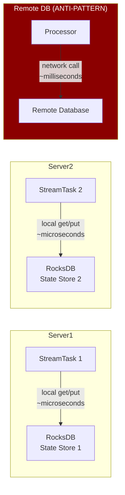
```mermaid
flowchart LR
    subgraph Server1
        T1[StreamTask 1] -->|local get/put<br/>~microseconds| S1[RocksDB<br/>State Store 1]
    end
    subgraph Server2
        T2[StreamTask 2] -->|local get/put<br/>~microseconds| S2[RocksDB<br/>State Store 2]
    end
    subgraph RemoteDB["Remote DB (ANTI-PATTERN)"]
        style RemoteDB fill:#8b0000,color:#fff
        T3[Processor] -->|network call<br/>~milliseconds| R3[Remote Database]
    end
```

An active task normally updates its local state stores from one stream thread, while interactive queries and task migration introduce additional access and lifecycle rules. Locality avoids a network round trip on the normal update path, but the impact cannot be computed by multiplying aggregate record rate by latency as if all operations were serialized. Measure per-record service time, concurrency, cache behavior, and remote-query traffic.

---

## 5. KTable Cache Mechanics and Deduplication

KTable represents an **update stream** (changelog), not an event stream. The cache layer is the key mechanism that prevents downstream flooding.

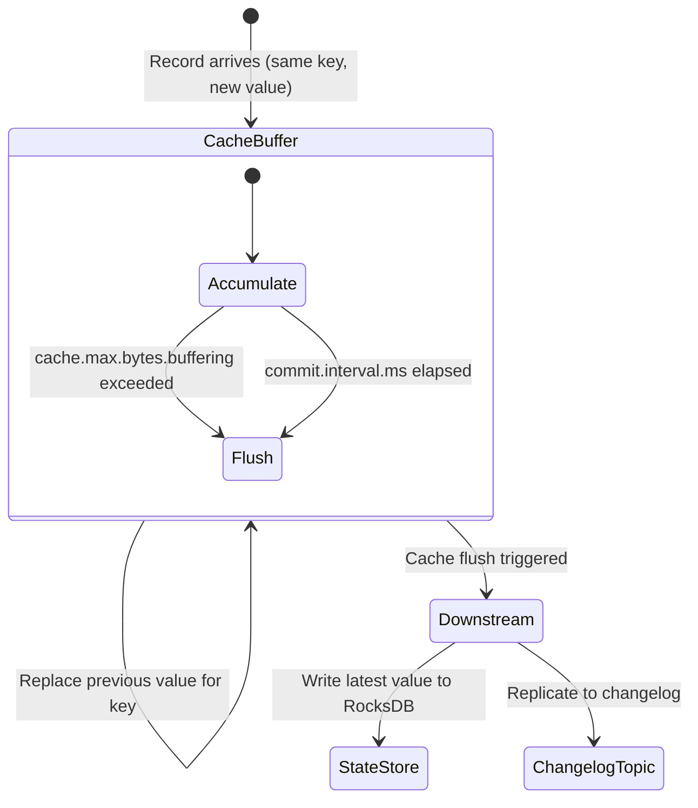
```mermaid
stateDiagram-v2
    [*] --> CacheBuffer: Record arrives (same key, new value)
    CacheBuffer --> CacheBuffer: Replace previous value for key
    CacheBuffer --> Downstream: Cache flush triggered
    Downstream --> StateStore: Write latest value to RocksDB
    Downstream --> ChangelogTopic: Replicate to changelog

    state CacheBuffer {
        [*] --> Accumulate
        Accumulate --> Flush: cache.max.bytes.buffering exceeded
        Accumulate --> Flush: commit.interval.ms elapsed
    }
```

### Cache deduplication flow

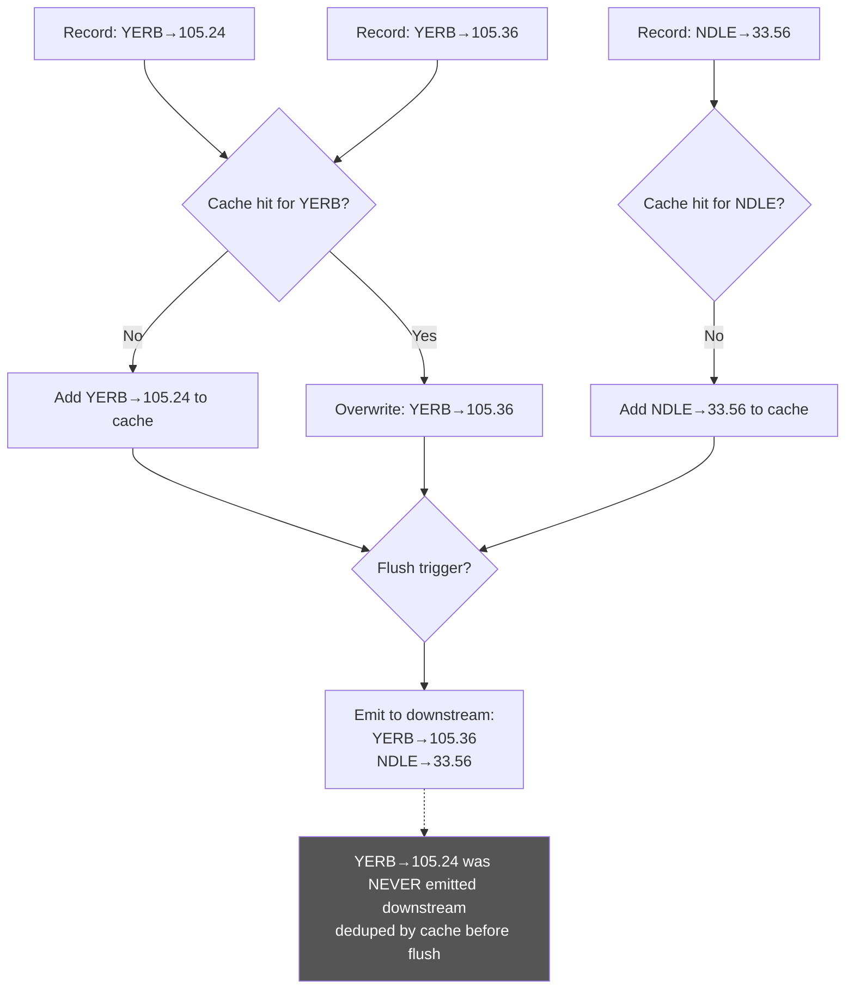
```mermaid
flowchart TD
    A[Record: YERB→105.24] --> B{Cache hit for YERB?}
    B -->|No| C[Add YERB→105.24 to cache]
    D[Record: YERB→105.36] --> B
    B -->|Yes| E[Overwrite: YERB→105.36]
    F[Record: NDLE→33.56] --> G{Cache hit for NDLE?}
    G -->|No| H[Add NDLE→33.56 to cache]
    I{Flush trigger?} --> J[Emit to downstream:<br/>YERB→105.36<br/>NDLE→33.56]
    C --> I
    E --> I
    H --> I

    note1["YERB→105.24 was NEVER emitted downstream<br/>deduped by cache before flush"]
    J -.-> note1

    style note1 fill:#555,color:#fff
```

**Critical insight**: Setting `cache.max.bytes.buffering=0` disables caching entirely. Every KTable update propagates downstream immediately, effectively turning a changelog stream into an event stream — and causing excessive I/O on persistent stores (every update hits RocksDB).

---

## 6. Windowing: Time Semantics and State Store Keys

### Three window types compared


```mermaid
gantt
    title Window Types (20s window, 5s advance for hopping)
    dateFormat X
    axisFormat %Ss

    section Tumbling
    Window 1 :0, 20
    Window 2 :20, 40
    Window 3 :40, 60

    section Hopping
    Window 1 :0, 20
    Window 2 :5, 25
    Window 3 :10, 30
    Window 4 :15, 35

    section Session (inactivity gap = 5s)
    Session 1 :0, 15
    Session 2 :25, 50
```

### Session window merging state machine

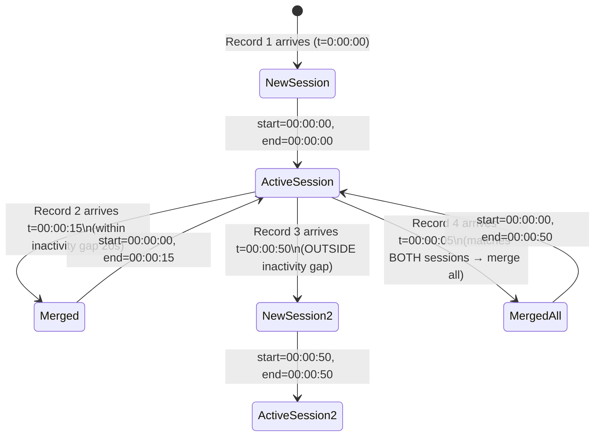
```mermaid
stateDiagram-v2
    [*] --> NewSession: Record 1 arrives (t=0:00:00)
    NewSession --> ActiveSession: start=00:00:00, end=00:00:00
    ActiveSession --> Merged: Record 2 arrives t=00:00:15\n(within inactivity gap 20s)
    Merged --> ActiveSession: start=00:00:00, end=00:00:15
    ActiveSession --> NewSession2: Record 3 arrives t=00:00:50\n(OUTSIDE inactivity gap)
    NewSession2 --> ActiveSession2: start=00:00:50, end=00:00:50
    ActiveSession --> MergedAll: Record 4 arrives t=00:00:05\n(matches BOTH sessions → merge all)
    MergedAll --> ActiveSession: start=00:00:00, end=00:00:50
```

### RocksDB key layout for window stores

```
Window state store key format:
[original_key_bytes][window_start_ms (8 bytes)][window_end_ms (8 bytes)]

Example (tumbling 20s):
  key="YERB", window_start=0, window_end=20000
  → RocksDB key: "YERB\x00\x00\x00\x00\x00\x00\x00\x00\x00\x00\x00\x00\x00\x00\x4E\x20"

Range scan to retrieve all windows for key:
  keyFrom = "YERB\x00\x00\x00\x00..."
  keyTo   = "YERB\xFF\xFF\xFF\xFF..."
```

---

## 7. Stream Joins: Co-Partitioning, Repartition, and State Stores

### Join topology internals

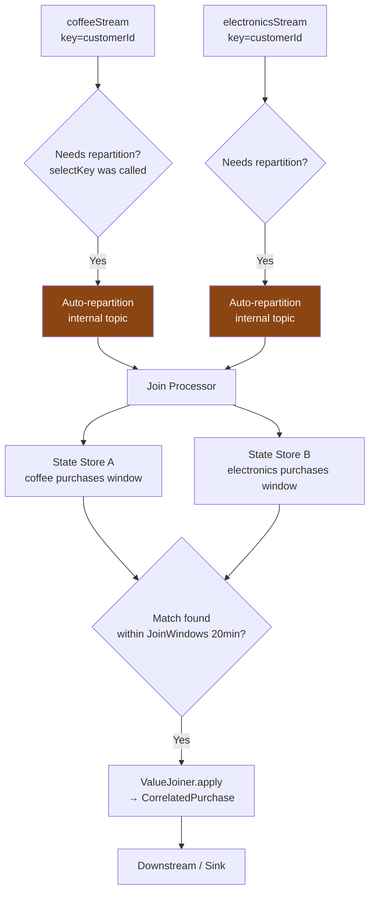
```mermaid
flowchart TD
    A[coffeeStream<br/>key=customerId] --> B{Needs repartition?<br/>selectKey was called}
    B -->|Yes| C[Auto-repartition<br/>internal topic]
    D[electronicsStream<br/>key=customerId] --> E{Needs repartition?}
    E -->|Yes| F[Auto-repartition<br/>internal topic]
    C --> G[Join Processor]
    F --> G
    G --> H[State Store A<br/>coffee purchases window]
    G --> I[State Store B<br/>electronics purchases window]
    H --> J{Match found<br/>within JoinWindows 20min?}
    I --> J
    J -->|Yes| K[ValueJoiner.apply<br/>→ CorrelatedPurchase]
    K --> L[Downstream / Sink]

    style C fill:#8b4513,color:#fff
    style F fill:#8b4513,color:#fff
```

### Co-partitioning requirement

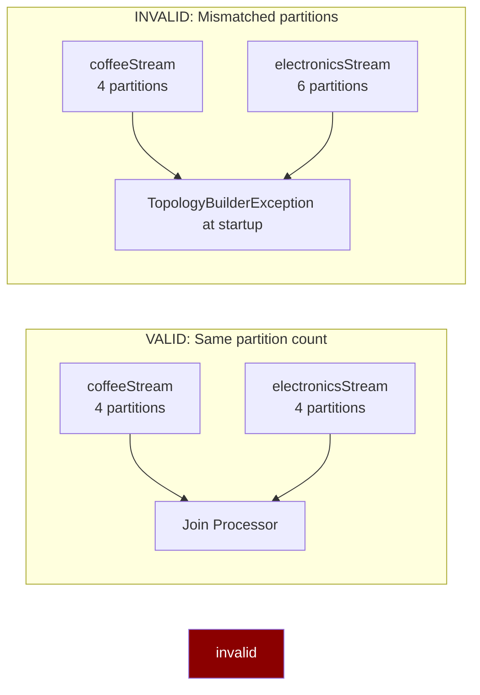
```mermaid
flowchart LR
    subgraph "VALID: Same partition count"
        A1[coffeeStream<br/>4 partitions] --> J1[Join Processor]
        B1[electronicsStream<br/>4 partitions] --> J1
    end
    subgraph "INVALID: Mismatched partitions"
        style invalid fill:#8b0000,color:#fff
        A2[coffeeStream<br/>4 partitions] --> J2[TopologyBuilderException at startup]
        B2[electronicsStream<br/>6 partitions] --> J2
    end
```

When `selectKey()` is called, an internal Boolean flag `needsRepartition=true` is set. Any subsequent `join()`, `reduce()`, or `aggregation()` automatically triggers:
1. Write records to an internal repartition topic (keyed by new key)
2. Consume from repartition topic before proceeding
3. Both join participants' partitions are now aligned

---

## 8. KStream vs KTable: Record Model Duality

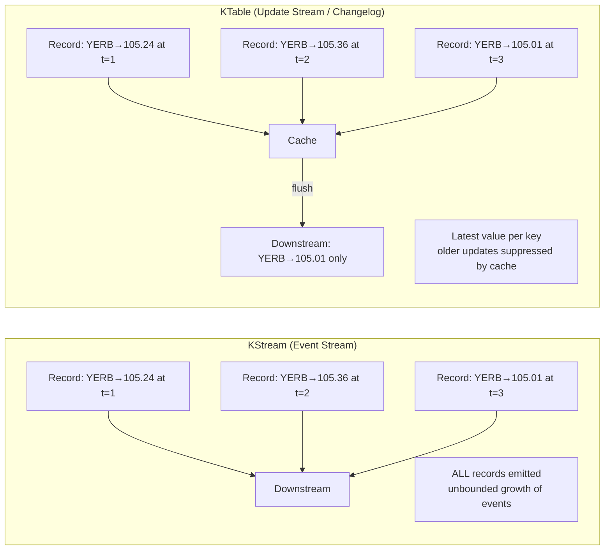
```mermaid
flowchart LR
    subgraph "KStream (Event Stream)"
        A[Record: YERB→105.24 at t=1] --> X1[Downstream]
        B[Record: YERB→105.36 at t=2] --> X1
        C[Record: YERB→105.01 at t=3] --> X1
        note1["ALL records emitted<br/>unbounded growth of events"]
    end

    subgraph "KTable (Update Stream / Changelog)"
        D[Record: YERB→105.24 at t=1] --> Cache
        E[Record: YERB→105.36 at t=2] --> Cache
        F[Record: YERB→105.01 at t=3] --> Cache
        Cache -->|flush| X2[Downstream: YERB→105.01 only]
        note2["Latest value per key<br/>older updates suppressed by cache"]
    end
```

### builder.table() — what happens internally

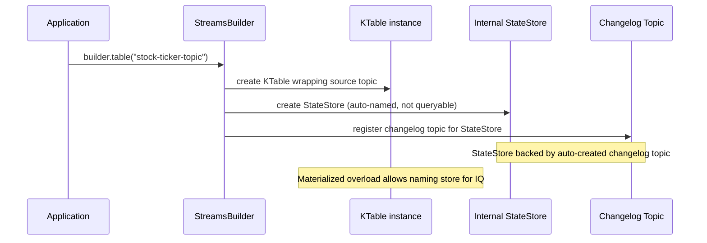
```mermaid
sequenceDiagram
    participant App as Application
    participant SB as StreamsBuilder
    participant KT as KTable instance
    participant SS as Internal StateStore
    participant CT as Changelog Topic

    App->>SB: builder.table("stock-ticker-topic")
    SB->>KT: create KTable wrapping source topic
    SB->>SS: create StateStore (auto-named, not queryable)
    SB->>CT: register changelog topic for StateStore
    note over SS,CT: StateStore backed by auto-created changelog topic
    note over KT: Materialized overload allows naming store for IQ
```

---

## 9. Processor API: Custom Scheduling with Punctuator

The high-level DSL (KStream/KTable) buffers records and relies on commit/cache flush for downstream emission. The **Processor API** gives you direct control over when records are forwarded.

### Punctuator scheduling: STREAM_TIME vs WALL_CLOCK_TIME

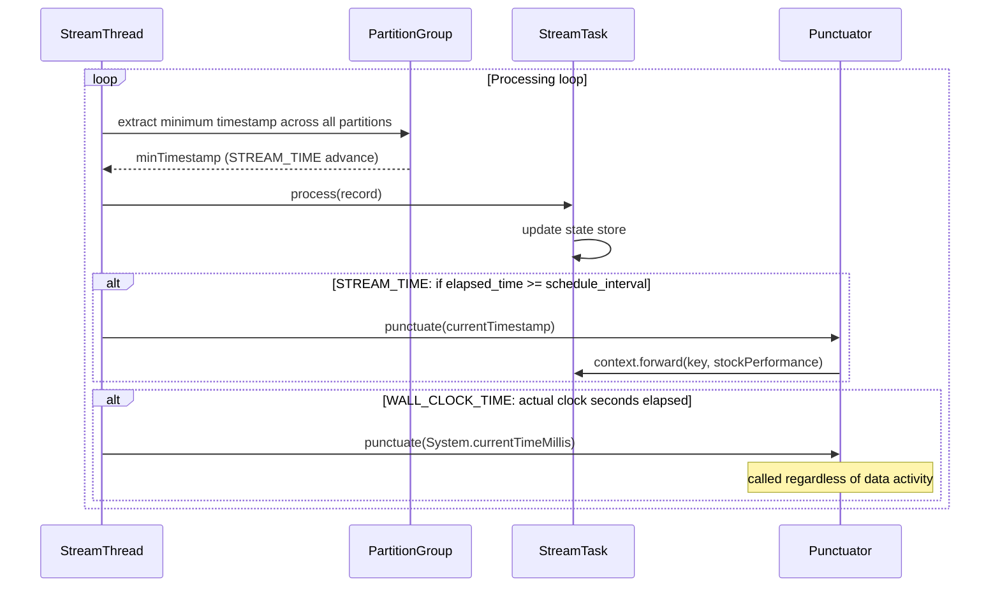
```mermaid
sequenceDiagram
    participant ST as StreamThread
    participant PG as PartitionGroup
    participant Task as StreamTask
    participant Punct as Punctuator

    loop Processing loop
        ST->>PG: extract minimum timestamp across all partitions
        PG-->>ST: minTimestamp (STREAM_TIME advance)
        ST->>Task: process(record)
        Task->>Task: update state store

        alt STREAM_TIME: if elapsed_time >= schedule_interval
            ST->>Punct: punctuate(currentTimestamp)
            Punct->>Task: context.forward(key, stockPerformance)
        end

        alt WALL_CLOCK_TIME: actual clock seconds elapsed
            ST->>Punct: punctuate(System.currentTimeMillis)
            note over Punct: called regardless of data activity
        end
    end
```

### process() + punctuate() separation of concerns

```mermaid
flowchart TD
    A[Incoming StockTransaction record] --> B[process() method]
    B --> C{State store has<br/>StockPerformance for symbol?}
    C -->|No| D[Create new StockPerformance]
    C -->|Yes| E[Fetch existing StockPerformance]
    D --> F[Update price stats SMA-20]
    E --> F
    F --> G[Update volume stats SMA-20]
    G --> H[Set lastUpdateSent timestamp]
    H --> I[keyValueStore.put(symbol, stockPerf)]
    note1["process() NEVER calls context.forward()<br/>No record emitted per received record"]

    J{Punctuator fires every 10s} --> K[Iterate all state store keys]
    K --> L{priceDifferential >= 2%<br/>OR volumeDifferential >= 2%?}
    L -->|Yes| M[context.forward(key, stockPerformance)]
    L -->|No| N[Skip — no emission]

    style note1 fill:#555,color:#fff
```

### Processor API topology wiring

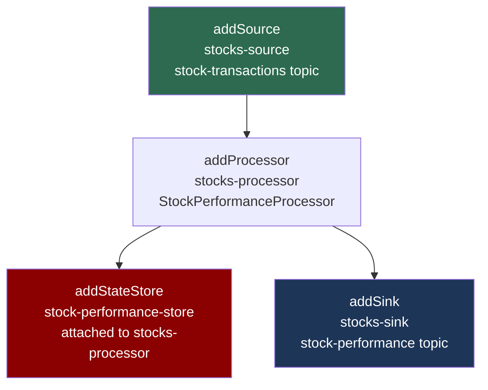
```mermaid
graph TD
    A[addSource<br/>stocks-source<br/>stock-transactions topic] --> B[addProcessor<br/>stocks-processor<br/>StockPerformanceProcessor]
    B --> C[addStateStore<br/>stock-performance-store<br/>attached to stocks-processor]
    B --> D[addSink<br/>stocks-sink<br/>stock-performance topic]

    style A fill:#2d6a4f,color:#fff
    style D fill:#1d3557,color:#fff
    style C fill:#8b0000,color:#fff
```

---

## 10. Co-Grouping Processor: Multi-Parent DAG

A `CogroupingProcessor` has **two parent nodes** — records from both source processors funnel into it. This demonstrates that Kafka Streams DAGs are not strictly trees; a node can have multiple parents.

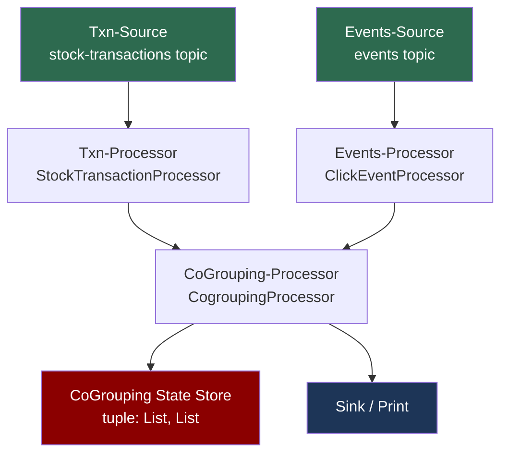
```mermaid
graph TD
    A[Txn-Source<br/>stock-transactions topic] --> B[Txn-Processor<br/>StockTransactionProcessor]
    C[Events-Source<br/>events topic] --> D[Events-Processor<br/>ClickEventProcessor]
    B --> E[CoGrouping-Processor<br/>CogroupingProcessor]
    D --> E
    E --> F[CoGrouping State Store<br/>tuple: List<clicks>, List<purchases>]
    E --> G[Sink / Print]

    style A fill:#2d6a4f,color:#fff
    style C fill:#2d6a4f,color:#fff
    style G fill:#1d3557,color:#fff
    style F fill:#8b0000,color:#fff
```

The co-grouping processor accumulates clicks and purchases separately in a shared state store, then emits a `Tuple<List<ClickEvent>, List<StockTransaction>>` per punctuate interval — a pattern not available in the high-level DSL.

---

## 11. Interactive Queries: Distributed State Store Access

When multiple instances of a Kafka Streams application run, each instance owns a subset of partitions (and thus a subset of state). Interactive queries (IQ) allow external services to query **any** instance for **any** key.

### IQ architecture: local vs remote routing

```mermaid
sequenceDiagram
    participant Client as External Client
    participant App1 as Instance 1 (owns P0, P1)
    participant App2 as Instance 2 (owns P2, P3)
    participant IQ1 as Local RocksDB (P0,P1 data)
    participant IQ2 as Local RocksDB (P2,P3 data)
    participant Meta as StreamsMetadata registry

    Client->>App1: GET /query?key=YERB
    App1->>Meta: Which instance owns key YERB?
    Meta-->>App1: Instance 2 (partition 2 via hash)
    App1->>App2: HTTP RPC: GET /query?key=YERB
    App2->>IQ2: store.get("YERB")
    IQ2-->>App2: StockPerformance value
    App2-->>App1: JSON response
    App1-->>Client: StockPerformance for YERB
```

### Configuration requirements for IQ

```
# Required for IQ remote routing
application.server=hostname:port  # each instance must know its own address

# In application code:
KafkaStreams.store(
  StoreQueryParameters.fromNameAndType(
    "stock-performance-store",
    QueryableStoreTypes.keyValueStore()
  )
)
```

```mermaid
flowchart TD
    A[KafkaStreams.store query] --> B{Is key local?<br/>hash(key) % numPartitions == localPartitions?}
    B -->|Yes| C[Direct RocksDB.get<br/>sub-millisecond]
    B -->|No| D[StreamsMetadata.getInstanceWithKey]
    D --> E[HTTP/gRPC to remote instance<br/>user-implemented RPC server]
    E --> F[Remote instance: local RocksDB.get]
    F --> G[Response back through chain]
```

---

## 12. Exactly-Once Semantics in Kafka Streams

```mermaid
sequenceDiagram
    participant Task as StreamTask
    participant TC as TransactionCoordinator
    participant Kafka as Kafka Brokers
    participant OS as Output Topics
    participant Off as __consumer_offsets

    Task->>TC: initTransactions()
    loop Per batch of records (EOS v2 per epoch)
        Task->>TC: beginTransaction()
        Task->>Kafka: consume records
        Task->>Task: process (update state stores)
        Task->>OS: produce output records (within transaction)
        Task->>Off: commitOffset (within transaction)
        Task->>TC: commitTransaction()
        note over TC,Off: commit is atomic across output + offset
    end

    rect rgb(200, 50, 50)
        note over Task: CRASH mid-transaction
    end
    TC->>Kafka: abort uncommitted transaction
    note over Kafka: Records invisible to read_committed consumers
```

**`processing.guarantee=exactly_once_v2`** (availability depends on Kafka Streams version):
- Uses a thread-scoped transactional producer in the EOS v2 design rather than the older task-scoped model
- Epoch-based fencing replaces old per-partition transaction ID scheme
- Throughput and latency overhead depend on commit interval, transaction rate, brokers, storage and workload; measure them rather than assuming 5-10%

---

## 13. Aggregation Internals: GroupBy, Reduce, KGroupedStream

```mermaid
flowchart TD
    A[KStream.stream<br/>stock-transactions topic] -->|mapValues| B[ShareVolume objects]
    B -->|groupBy symbol| C[KGroupedStream<br/>intermediate — not directly usable]
    C -->|reduce ShareVolume::sum| D[KTable<String, ShareVolume><br/>rolling share volume per symbol]
    D -->|groupBy industry| E[KGroupedTable<br/>by industry]
    E -->|aggregate with FixedSizePriorityQueue| F[KTable<String, Top5Queue>]
    F -->|mapValues queue→string| G[KTable<String, String><br/>top-5 report]
    G -->|toStream.to| H[stock-volume-by-company topic]

    style C fill:#555,color:#fff
    style H fill:#1d3557,color:#fff
```

### KTable.aggregate with adder/subtractor

For KTable aggregations, records with the same key are **updates**, not new records. The aggregate must both add new values AND remove old ones:

```
aggregate(
  initializer:  () → FixedSizePriorityQueue,   // fresh empty queue
  adder:        (k, v, agg) → agg.add(v),       // add new ShareVolume
  subtractor:   (k, v, agg) → agg.remove(v),    // remove old ShareVolume
  Materialized.with(stringSerde, queueSerde)
)
```

When record for `YERB` is updated (105.24 → 105.36):
1. `subtractor` called with old value (105.24) — removes from top-5 queue
2. `adder` called with new value (105.36) — adds to top-5 queue
3. Queue reorders by share volume

---

## 14. Branching: Multiple Children from One KStream

`KStream.branch()` produces an array of KStream instances, one per predicate. Records not matching any predicate are **dropped silently**.

```mermaid
flowchart TD
    A[transactionStream] -->|branch predicate[0]: coffee?| B[coffeeStream]
    A -->|branch predicate[1]: electronics?| C[electronicsStream]
    A -->|no predicate matches| D[DROPPED silently]

    B --> E[Cafe Sink]
    C --> F[Electronics Sink]

    style D fill:#8b0000,color:#fff
```

```
KStream<String, Purchase>[] branches = stream.branch(
    (k, v) -> v.getDepartment().equals("coffee"),
    (k, v) -> v.getDepartment().equals("electronics")
);
// branches[0] = coffee purchases
// branches[1] = electronics purchases
```

---

## 15. Monitoring: JMX Metrics and State Listeners

### Kafka Streams metrics hierarchy

```mermaid
graph TD
    A[JMX MBeans] --> B[kafka.streams:type=stream-metrics]
    A --> C[kafka.streams:type=stream-task-metrics]
    A --> D[kafka.streams:type=stream-processor-node-metrics]
    A --> E[kafka.streams:type=stream-state-metrics]

    B --> B1[commit-latency-avg/max]
    B --> B2[poll-latency-avg/max]
    C --> C1[process-latency-avg/max per task]
    C --> C2[commit-latency per task]
    D --> D1[process-rate per node]
    D --> D2[forward-rate per node]
    E --> E1[flush-rate per store]
    E --> E2[restore-rate on restart]
```

### Application state lifecycle

```mermaid
stateDiagram-v2
    [*] --> CREATED: KafkaStreams constructed
    CREATED --> REBALANCING: kafkaStreams.start()
    REBALANCING --> RUNNING: partition assignment complete
    RUNNING --> REBALANCING: consumer group rebalance
    RUNNING --> PENDING_SHUTDOWN: kafkaStreams.close()
    PENDING_SHUTDOWN --> NOT_RUNNING: cleanup complete
    RUNNING --> ERROR: uncaught exception in StreamThread

    note right of REBALANCING: State restore happens here\nchangelog replayed into RocksDB
    note right of ERROR: StateRestoreListener.onRestoreEnd\nUncaughtExceptionHandler fires
```

---

## 16. Topology Inspection and Describe

Before running, you can inspect the topology graph programmatically:

```
KafkaStreams app = new KafkaStreams(topology, config);
System.out.println(topology.describe());
```

Output reveals the internal node graph including auto-generated repartition topics, internal state store topics, and the exact parent-child wiring. This is essential for debugging unexpected data routing or verifying that `selectKey()` correctly inserted a repartitioning step.

---

## 17. Exactly-Once vs At-Least-Once Trade-offs

```mermaid
flowchart LR
    subgraph "at_least_once (default)"
        A1[High throughput] --> B1[Possible duplicate records\non consumer rebalance]
        B1 --> C1[No transaction overhead]
    end
    subgraph "exactly_once_v2"
        A2[~5-10% throughput cost] --> B2[Atomic consume+produce+commit]
        B2 --> C2[TransactionCoordinator overhead]
        C2 --> D2[Epoch-based producer fencing\nprevents zombie writes]
    end
```

Use exactly_once when:
- Financial transactions, billing, inventory deduction — any domain where duplicate processing causes real-world harm
- Downstream consumers use `isolation.level=read_committed`

Use at_least_once when:
- Idempotent downstream operations (counts can be recomputed, analytics approximate)
- Throughput > correctness guarantee

---

## Summary: Kafka Streams Internal Data Flow

```mermaid
flowchart TD
    A[Kafka Topic Records<br/>byte arrays] -->|KafkaConsumer poll| B[PartitionGroup<br/>buffered per partition]
    B -->|min timestamp selection| C[StreamTask.process<br/>depth-first traversal]
    C --> D{State needed?}
    D -->|Yes| E[RocksDB local get/put<br/>sub-millisecond]
    D -->|No| F[Stateless transform]
    E --> G[Cache buffer<br/>dedup by key]
    F --> G
    G -->|commit.interval OR cache full| H[Flush to changelog topic<br/>KafkaProducer batched]
    G --> I[Emit to downstream processor<br/>or sink topic]
    I -->|join path| J[JoinWindowed StateStore<br/>look for matching records]
    J -->|match within window| K[ValueJoiner.apply → joined record]
    I -->|aggregation path| L[KGroupedStream reduce/aggregate<br/>→ KTable update]
    H --> M[Changelog topic<br/>compacted for fault recovery]
    M -->|crash + restart| E

    style A fill:#1d3557,color:#fff
    style E fill:#8b0000,color:#fff
    style M fill:#2d6a4f,color:#fff
```

The Kafka Streams execution model is: **read from Kafka → process depth-first through DAG → write state locally → replicate state to Kafka → emit output to Kafka**. The local state stores backed by changelog topics are the core innovation — they provide sub-millisecond lookups while maintaining full fault tolerance through Kafka's own durability guarantees.
