# Kafka Streams — Under the Hood: Topology Execution, State, and Stream Processing Internals

> Source: *Kafka Streams in Action* — William P. Bejeck Jr. (Manning, 2018)

---

## 1. The Processor Topology: A DAG of Transforms

Kafka Streams is not a distributed cluster service — it is a **client library** that runs inside a JVM. Its fundamental execution model is a **Directed Acyclic Graph (DAG)** of processor nodes, built at startup time and executed per-record.

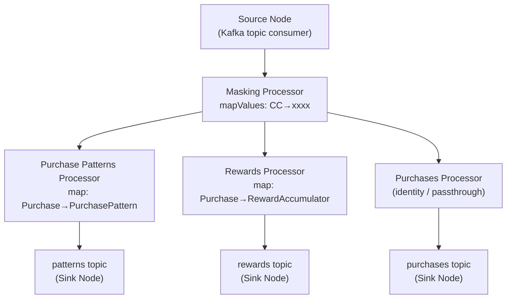

**Depth-first traversal**: each record entering the source node is fully processed through all connected processors before the next record is dequeued. This eliminates backpressure — there is no inter-node buffering, no async queue between processors in the same topology. The record traverses the entire DAG synchronously on a single thread before the next record begins.

**Consequence**: if one processor branch is slow (e.g., state store lookup), the entire DAG slows proportionally. There is no independent parallelism across branches within one task.

---

## 2. Task Model: Partitions → Tasks → Threads

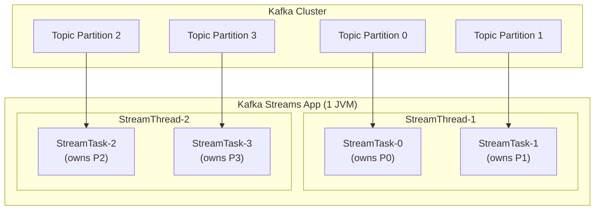

**Tasks are the unit of parallelism.** The number of tasks equals `max(partitions across all source topics)`. Each task owns exactly one partition per source topic. A `StreamThread` runs multiple tasks in a round-robin poll loop.

**Scaling**: add more partitions → more tasks. Add more `num.stream.threads` → tasks distributed across more threads. Add more JVM instances → tasks distributed across more processes (each process is a separate Kafka consumer group member).

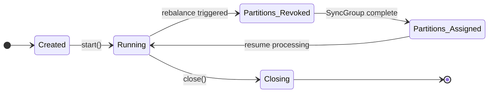

---

## 3. KStream vs KTable: Stream-Table Duality

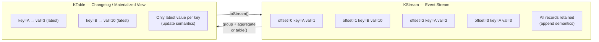

A `KTable` is a **materialized view** backed by a changelog topic. When a new record arrives with key `K`, the table's local state store is updated in-place — old value is overwritten. Downstream processors see only the latest value for each key.

**Changelog topic**: every KTable state store update is also written to a Kafka topic (`<app-id>-<store-name>-changelog`). On restart or reassignment, the Streams app rebuilds the state store by **replaying** this changelog topic from the beginning — restoring exact state without coordination.

---

## 4. State Stores: RocksDB and In-Memory

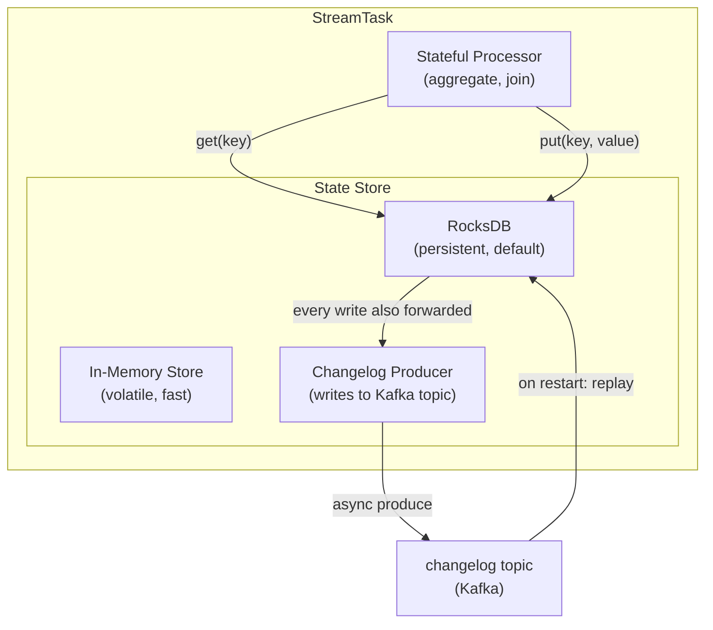

**RocksDB** (embedded LSM-tree key-value store) is the default persistent state store. Key properties:
- Data stored in `state.dir` on local disk (default `/tmp/kafka-streams/`)
- Bloom filters + SST file compaction enable O(1) average reads
- Write path: MemTable → WAL → SSTable flush → compaction
- Kafka Streams calls RocksDB's `put()` synchronously; changelog write is async

**Standby replicas** (`num.standby.replicas`): other StreamsApp instances maintain warm copies of state stores by consuming the changelog topic. On failover, the new task owner only needs to catch up the delta since the standby's checkpoint — sub-second recovery.

---

## 5. Windowing Internals

Windows enable aggregation over bounded time ranges. Kafka Streams implements several window types, each with distinct state organization.

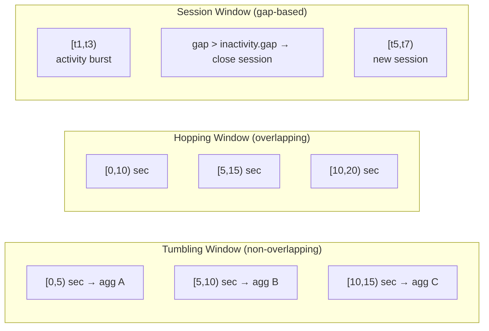

**Window state store key schema**: `(originalKey, windowStart, windowEnd)`. Each window has its own slot in RocksDB. When a record arrives at time `t`, Streams computes which windows it falls into and does a `get` + `put` for each.

**Late arrivals**: records arriving after `grace.period.ms` are discarded. The grace period allows out-of-order records (from network delays) to be incorporated into the correct window before it closes.

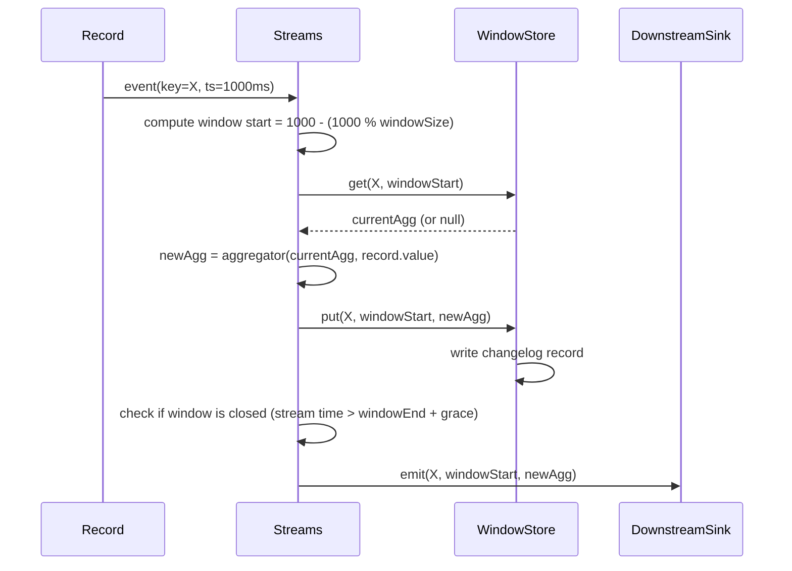

**Stream time vs wall clock time**: Streams advances "stream time" based on the maximum observed record timestamp, not the system clock. This ensures deterministic window behavior even when records arrive out-of-order or during replay.

---

## 6. Joins: Co-Partitioning Requirement

Joins in Kafka Streams require **co-partitioned topics** — both input topics must have the same number of partitions and the same partitioning strategy. This ensures that records with the same key are always assigned to the same Streams task.

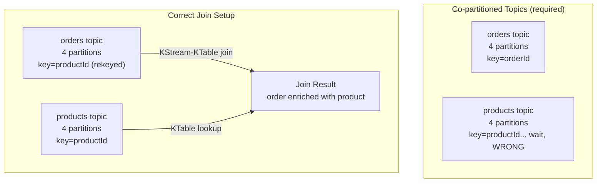

**KStream-KStream join**: both streams are windowed. Records are matched if keys match AND timestamps fall within `JoinWindows.of(Duration)`. Both sides are stored in in-memory or RocksDB windowed stores.

**KStream-KTable join**: the KTable acts as a lookup table. No windowing needed — latest KTable value for the key is used at the time the KStream record arrives. The KTable must be fully caught up (changelog replayed) before joins produce results.

**GlobalKTable**: replicated in full on every Streams instance (no co-partitioning requirement). The source topic's all partitions are consumed by every instance. Used for reference data (e.g., product catalog) that must be available for any key without repartitioning.

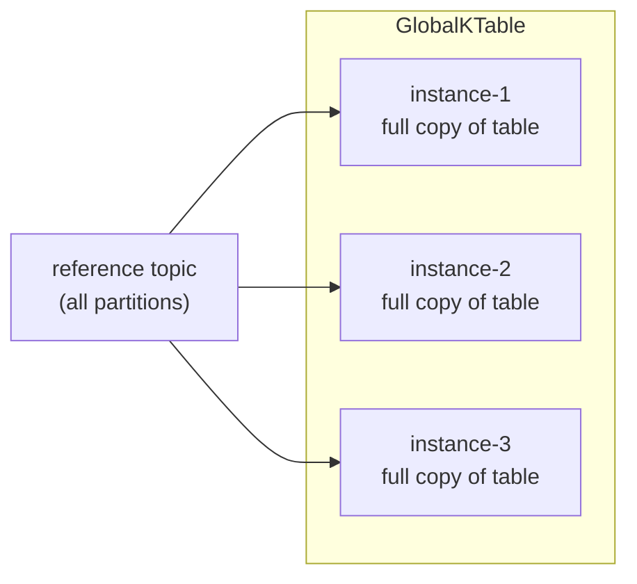

---

## 7. Processor API: Low-Level Node Building

The DSL (KStream/KTable) compiles down to the Processor API, which provides direct control.

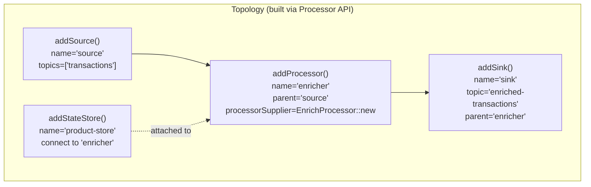

```java
// Processor lifecycle
class EnrichProcessor implements Processor<String, Order, String, EnrichedOrder> {
    ProcessorContext<String, EnrichedOrder> context;
    KeyValueStore<String, Product> productStore;

    @Override
    public void init(ProcessorContext<String, EnrichedOrder> context) {
        this.context = context;
        this.productStore = context.getStateStore("product-store");
        // Schedule punctuation: periodic callback
        context.schedule(Duration.ofSeconds(30), PunctuationType.STREAM_TIME,
            timestamp -> { /* cleanup stale state */ });
    }

    @Override
    public void process(Record<String, Order> record) {
        Product product = productStore.get(record.value().productId());
        EnrichedOrder enriched = new EnrichedOrder(record.value(), product);
        context.forward(record.withValue(enriched));
    }
}
```

**Punctuation** (`context.schedule`): a callback invoked either on stream time advancement (`STREAM_TIME`) or wall-clock time (`WALL_CLOCK_TIME`). Used for periodic state cleanup, emitting aggregates, or heartbeat-style operations. Stream-time punctuation only fires when records arrive — if no records come in, stream time does not advance.

---

## 8. Commit and Offset Management

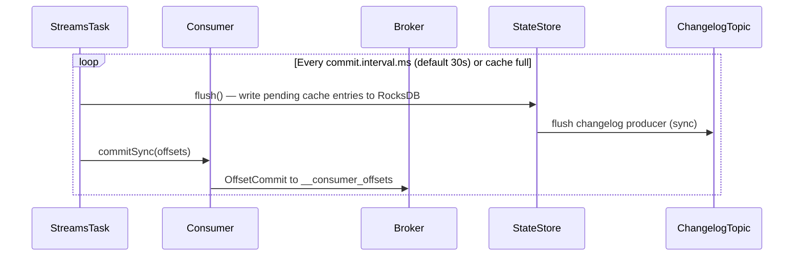

**Processing guarantee**: `processing.guarantee=exactly_once_v2` (Kafka 2.5+)

- Uses Kafka transactions internally
- Each task wraps its processing in a transaction: state store writes + changelog writes + output topic writes + offset commits are all atomic
- Requires Kafka broker 2.5+ and at least 3 replicas for internal topics

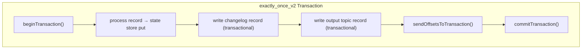

If the application crashes mid-transaction, the broker aborts the incomplete transaction. On restart, the state store is rebuilt from the changelog (which only contains committed data), and the input consumer resumes from the last committed offset.

---

## 9. Interactive Queries: Exposing Local State

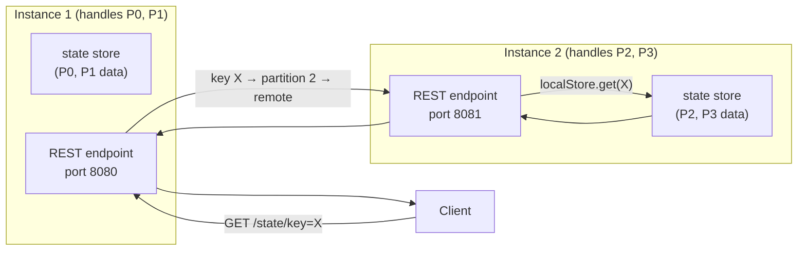

`KafkaStreams.queryMetadataForKey(storeName, key, serializer)` returns the `StreamsMetadata` containing the host and port of the instance that owns the partition for that key. Application code must implement the HTTP layer and proxy requests to the correct instance.

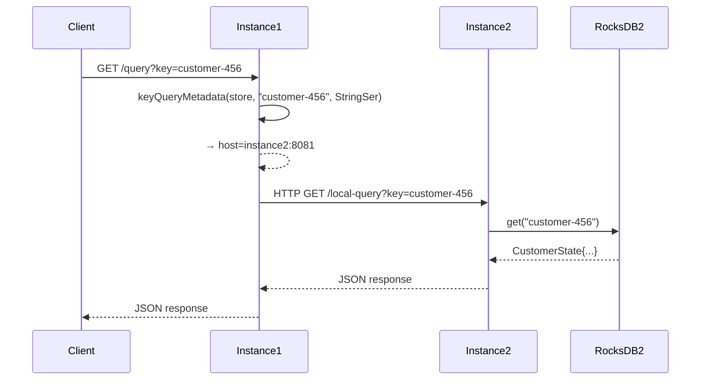

---

## 10. Serdes: Serialization in the Topology

Every node boundary in the topology requires serialization/deserialization. Kafka Streams uses `Serde<T>` (Serializer + Deserializer pair).

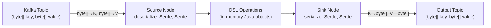

**SerdeException** pitfall: if a Serde cannot deserialize a record (corrupt data, schema change), the task throws a `DeserializationException`. Default behavior: log and skip. Configure `default.deserialization.exception.handler` to control this.

**State store Serdes**: state stores also need Serdes for key and value types. These are configured separately from the topic Serdes. Mismatch causes runtime `ClassCastException` or corrupted state.

---

## 11. Topology Inspection and Testing

The `Topology.describe()` method returns a textual description of the full DAG:

```
Topologies:
  Sub-topology: 0
    Source: KSTREAM-SOURCE-0000000000 (topics: [transactions])
      --> KSTREAM-MAPVALUES-0000000001
    Processor: KSTREAM-MAPVALUES-0000000001 (stores: [])
      --> KSTREAM-BRANCH-0000000002
    Processor: KSTREAM-BRANCH-0000000002 (stores: [])
      --> KSTREAM-BRANCHCHILD-0000000003, KSTREAM-BRANCHCHILD-0000000004
```

**TopologyTestDriver**: runs the entire topology in-process, without a real Kafka cluster:

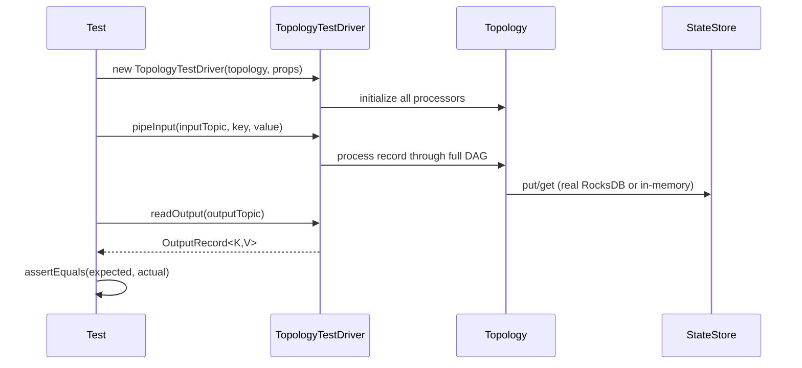

The `TopologyTestDriver` uses a **MockProcessorContext** that supports injecting event-time by setting record timestamps manually. Punctuations can be triggered by calling `advanceWallClockTime()`. This makes window-boundary behavior fully deterministic in unit tests.

---

## 12. Full Internal Data Flow: End-to-End

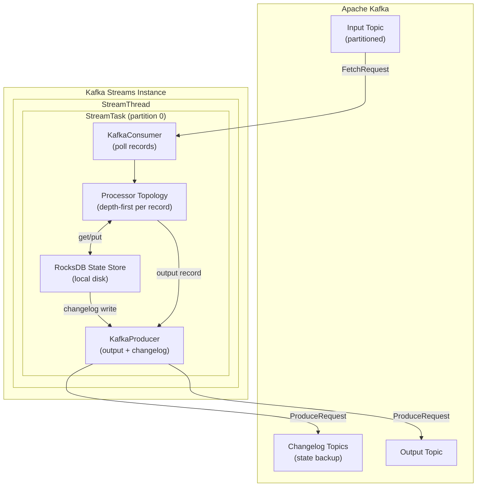

The entire processing cycle per record:
1. `KafkaConsumer.poll()` returns `ConsumerRecords` batch
2. For each record, traverse DAG depth-first (synchronous)
3. State store operations read/write RocksDB synchronously
4. Output records buffered in `KafkaProducer.RecordAccumulator`
5. Every `commit.interval.ms`: flush state stores → flush changelog producer → commit consumer offsets
6. `RecordAccumulator` drains to Kafka asynchronously on Sender thread

The absence of inter-node queues within a task means **zero-copy** between processors — the record object is passed by reference through the DAG, with no serialization until it hits a sink node or state store.
