# Kafka Streams & ksqlDB — Under the Hood

> Sources: *Mastering Kafka Streams and ksqlDB* (Mitch Seymour, O'Reilly 2021) · *Designing Event-Driven Systems* (Ben Stopford, O'Reilly 2018)

## Scope and verification

- Examples reflect the cited 2018-2021 material. Kafka Streams, ksqlDB, RocksDB defaults, EOS, and deployment modes must be checked against the deployed versions.
- SQL statements describe logical semantics; generated topics, partitions, stores, and tasks are physical evidence to inspect with topology and server metadata.
- Recovery claims include restore bytes, changelog lag, standby freshness, rebalance time, query routing, and what clients observe while a store is unavailable.
- Kafka transactions cover Kafka records and offsets, not external sinks unless their connector and target provide a compatible contract.

---

## 1. Processor Topology: Depth-First DAG Execution

A Kafka Streams application is a **directed acyclic graph (DAG)** of source, processing, and sink processors. The runtime doesn't work in layers — it traverses the graph **depth-first** per record: one record is pushed all the way from source to sink before the next record is pulled from the consumer.

```mermaid
flowchart TD
    subgraph SubTopology_0["Sub-topology 0"]
        S0[Source: raw-tweets] --> F[filter: isEnglish?]
        F --> B[branch: language]
        B --> M[merge: combined stream]
    end
    subgraph SubTopology_1["Sub-topology 1 (repartition boundary)"]
        M --> RP["Repartition Topic\n(internal)"]
        RP --> S1[Source: repartitioned]
        S1 --> AGG[aggregate: sentiment count]
        AGG --> SINK[Sink: crypto-sentiment]
    end
    style SubTopology_0 fill:#1a1a2e,stroke:#4a90d9
    style SubTopology_1 fill:#16213e,stroke:#4a90d9
```

**Why sub-topologies matter**: Whenever the DSL introduces a repartition topic (`through`, `groupByKey` after `selectKey`, `join` co-partitioning), the single logical topology is split. Each sub-topology is an independent unit of parallelism — tasks for sub-topology 0 and sub-topology 1 are scheduled independently across stream threads.

---

## 2. Task and Thread Model

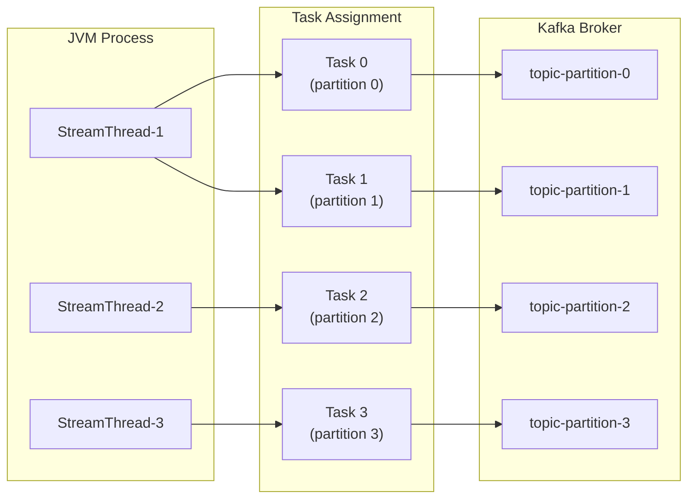

**Key invariant**: One task owns exactly one input partition set. Tasks never share state stores. Stream threads (configured by `num.stream.threads`) pull records from their assigned tasks. Because tasks are the unit of parallelism, adding partitions → adding tasks → more threads/instances can absorb them.

---

## 3. Stream-Table Duality & KStream/KTable/GlobalKTable

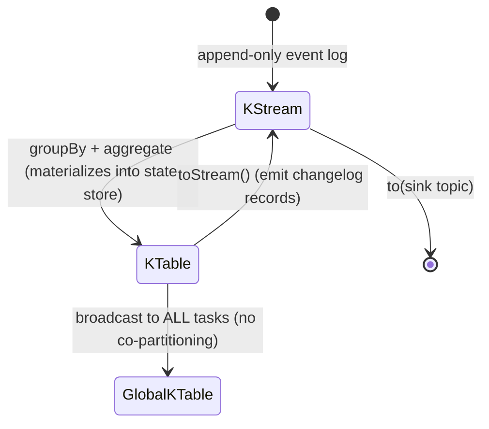

| Abstraction | Storage | Changelog | Co-partition required? | Update semantics |
|---|---|---|---|---|
| KStream | None (stateless) | No | Yes (for joins) | Each record independent |
| KTable | RocksDB (per-task) | Yes | Yes (for joins) | Upsert by key |
| GlobalKTable | RocksDB (replicated everywhere) | Yes (read from offset 0) | **No** | Full broadcast copy |

**Stream-table duality** (Ben Stopford): Every stream is a table of accumulated changes; every table is a stream of upserts. A compacted Kafka topic IS the changelog of a table — replaying it from offset 0 reconstructs the entire table state.

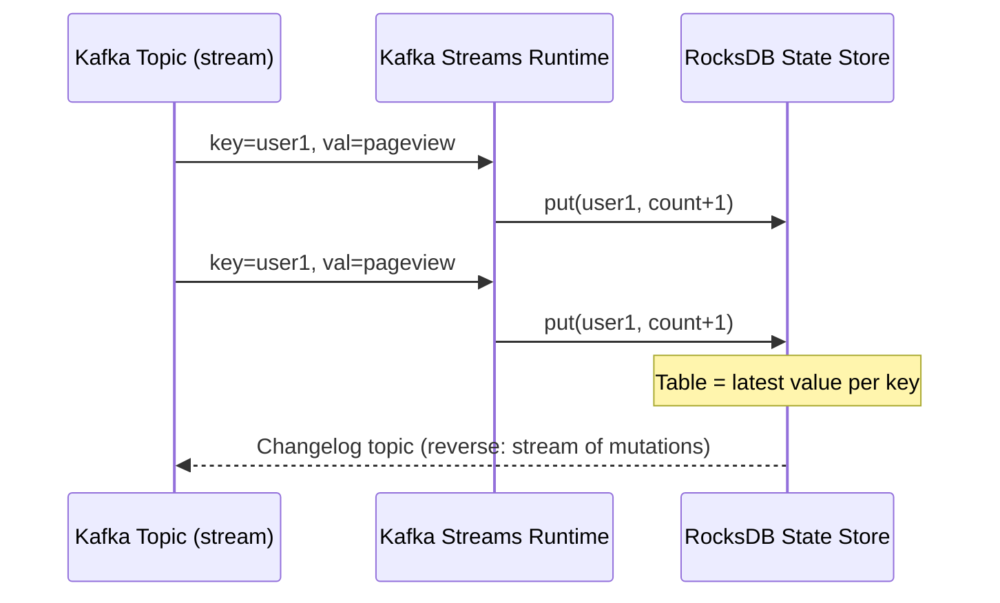

---

## 4. Persistent State Store Disk Layout

Default base: `/tmp/kafka-streams/<application-id>/`  
Production override: `StreamsConfig.STATE_DIR_CONFIG`

```mermaid
block-beta
    columns 3
    block:dir["&lt;app-id&gt;/"]:3
        block:t0["0_0/ (task 0_0)"]:1
            A[".lock"]
            B[".checkpoint"]
            block:ss["pulse-counts/ (RocksDB)"]
                C["MANIFEST-000001"]
                D["000002.sst"]
                E["000003.sst"]
                F["CURRENT"]
                G["OPTIONS-000005"]
            end
        end
        block:t1["0_1/ (task 0_1)"]:1
            H[".lock"]
            I[".checkpoint"]
            block:ss2["pulse-counts/"]
                J["SST files..."]
            end
        end
        block:t2["1_0/ (task 1_0)"]:1
            K[".lock"]
            L[".checkpoint"]
            block:ss3["another-store/"]
                M["SST files..."]
            end
        end
    end
```

**Task ID format**: `<sub-topology-id>_<partition-number>`  
**`.checkpoint` file**: Contains the last committed Kafka offset from the changelog topic — this is the **recovery cursor**. On restart, Kafka Streams replays only from `.checkpoint` offset forward, not from beginning.  
**`.lock` file**: Prevents two stream threads from owning the same state directory concurrently.

### RocksDB LSM Internals (used by Kafka Streams persistent stores)

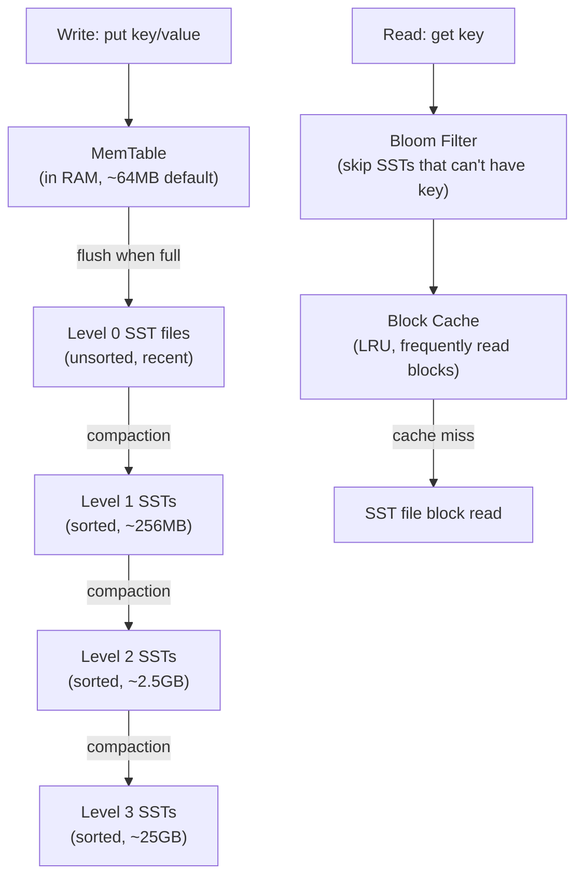

Each Kafka Streams task gets its **own RocksDB instance** under `state.dir/<app-id>/<task-id>/<store-name>/`. No sharing across tasks, so no lock contention.

---

## 5. Changelog Topics & Fault Tolerance

```mermaid
sequenceDiagram
    participant App as Kafka Streams App
    participant RS as RocksDB (local)
    participant CL as Changelog Topic (Kafka)
    participant CP as .checkpoint file

    App->>RS: put(key, aggregated_value)
    RS->>CL: async write: (key, value) [changelog producer]
    Note over CL: topic name: &lt;app-id&gt;-&lt;store-name&gt;-changelog
    
    App->>CP: commit: write last offset from changelog

    Note over App: CRASH
    
    App->>CP: read last checkpointed offset
    App->>CL: replay from checkpointed offset → offset N
    CL->>RS: re-apply updates (delta only)
    Note over RS: State fully restored ✓
```

**Changelog topic naming**: `<application-id>-<internal-store-name>-changelog`  
**Incremental recovery**: The `.checkpoint` file avoids replaying the entire changelog. On a fresh instance (no checkpoint), full replay from offset 0.  
**Disabling changelog** (`Materialized.withLoggingDisabled()`): Creates an **ephemeral store** — fast writes, zero recovery on failure.

---

## 6. Standby Replicas

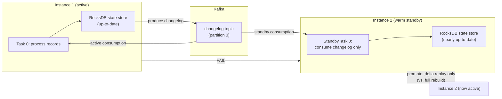

**`num.standby.replicas`**: How many warm standby copies to maintain. Standby tasks consume changelog topics but never process input topic records. Promotion = replay only the small delta since the standby's last consumed offset.

---

## 7. Rebalancing: The Enemy of Stateful Applications

```mermaid
stateDiagram-v2
    state EagerRebalance {
        [*] --> STOP: all tasks stop
        STOP --> REVOKE: all partitions revoked from all members
        REVOKE --> REASSIGN: coordinator issues new assignment
        REASSIGN --> RESTORE: each member rebuilds state from changelog
        RESTORE --> [*]: resume processing
        note right of RESTORE: restore work scales with missing state/changelog; downtime depends on bandwidth and assignment
    }

    state CooperativeStickyRebalance {
        [*] --> PARTIAL_REVOKE: only migrating partitions revoked
        PARTIAL_REVOKE --> PARTIAL_ASSIGN: migrating tasks reassigned
        PARTIAL_ASSIGN --> DELTA_RESTORE: only new tasks restore state
        DELTA_RESTORE --> [*]: unaffected tasks continue processing throughout
        note right of DELTA_RESTORE: standby may reduce missing bytes; freshness and promotion delay still require measurement
    }
```

**Sticky assignment** (`StreamsConfig.RACK_AWARE_ASSIGNMENT_STRATEGY`): Tasks are preferentially reassigned to the instance that previously held them (or their standby). This means the state store on that instance already has the data — recovery is near-instantaneous.

**Static membership** (`group.instance.id`): Prevents "dead member" rebalances when an instance temporarily disconnects. The coordinator waits `session.timeout.ms` before treating it as dead.

---

## 8. Windowing: Stream-Time Semantics

Kafka Streams uses **event-time** (the timestamp embedded in the record), not wall-clock time. Stream time advances when records arrive — late records can still be admitted within a **grace period**.

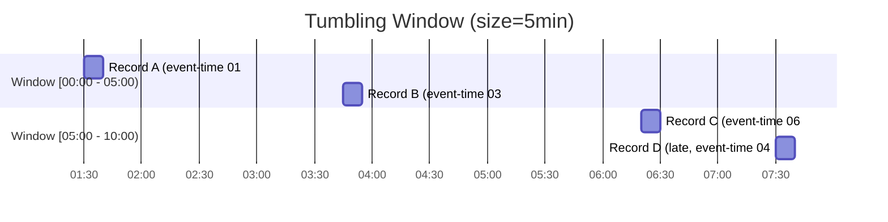

| Window Type | Overlap? | Triggered by | Use case |
|---|---|---|---|
| Tumbling | No | Fixed size | Hourly batch aggregations |
| Hopping | Yes (slide < size) | Fixed size + advance | Rolling 5-min avg |
| Session | No (gap-based) | Inactivity gap | User session analytics |

**Grace period**: `TimeWindows.of(size).grace(Duration.ofMinutes(1))` — records arriving up to 1 minute late are still admitted. After grace expires, the window result is finalized and emitted downstream (if using `Suppressed.untilWindowCloses()`).

---

## 9. Processor API — Punctuation & Low-Level Control

The Processor API exposes the raw `process(key, value)` method and **punctuation** — a periodic callback triggered by stream-time or wall-clock-time advancement.

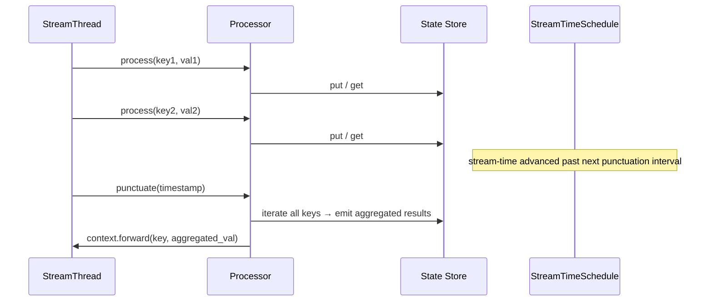

**Wall-clock punctuation** (`PunctuationType.WALL_CLOCK_TIME`): Fires even when no records arrive — useful for timeout detection (e.g. "alert if no heartbeat in 30s").  
**Stream-time punctuation** (`PunctuationType.STREAM_TIME`): Only fires when records advance stream-time past the interval — pauses during idle input.

---

## 10. Exactly-Once Semantics (EOS v2)

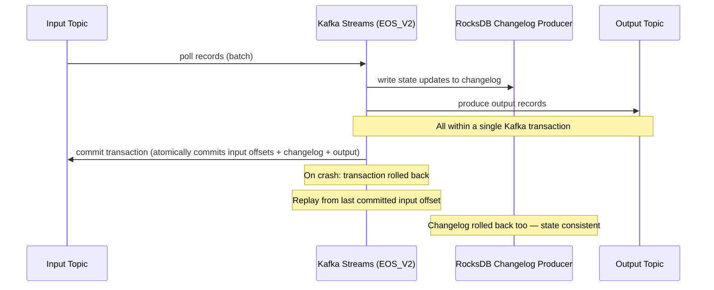

**EOS_V2** (`processing.guarantee=exactly_once_v2` in supporting versions) uses a thread-scoped transactional producer rather than the older task-scoped approach. This can reduce open producer and transaction state, but the broker-load improvement depends on task count, commit cadence, throughput and failure rate and must be measured.

---

## 11. Interactive Queries — Cross-Instance State Retrieval

```mermaid
flowchart TD
    Client["REST Client: GET /count/user42"]
    App1["Instance 1\n(owns partition 0→1)"]
    App2["Instance 2\n(owns partition 2→3)"]
    
    Client --> App1
    App1 -->|"KeyQueryMetadata.activeHost()\n= Instance 2"| Proxy["Proxy request to\nInstance 2:8080/count/user42"]
    Proxy --> App2
    App2 -->|RocksDB.get(user42)| Result["count = 47"]
    Result --> Client
```

**Metadata routing**: `streams.queryMetadataForKey(storeName, key, serializer)` returns a `KeyQueryMetadata` with the host/port owning the key. The application is responsible for proxying the query to that host — Kafka Streams provides the routing table, not the HTTP layer.

**Read-your-own-writes consistency**: Interactive queries may return stale data during rebalances or lag catch-up. `streams.state()` returns `REBALANCING` if consistency is temporarily compromised.

---

## 12. ksqlDB Architecture — Two Deployment Modes

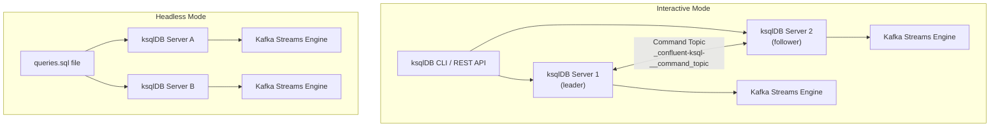

**Command topic**: In interactive mode, all DDL statements (CREATE STREAM, CREATE TABLE) are written to the command topic. All server nodes consume this topic — this is how query definitions are replicated across the cluster. A newly joined server replays the command topic from offset 0 to reconstruct all active queries.

**Interactive vs Headless**:
- Interactive: REST API + CLI available, ad-hoc queries possible, command topic for coordination
- Headless: no REST API, queries defined in `.sql` file at startup, suitable for production deployments where queries are fixed

---

## 13. ksqlDB Pull Queries vs Push Queries

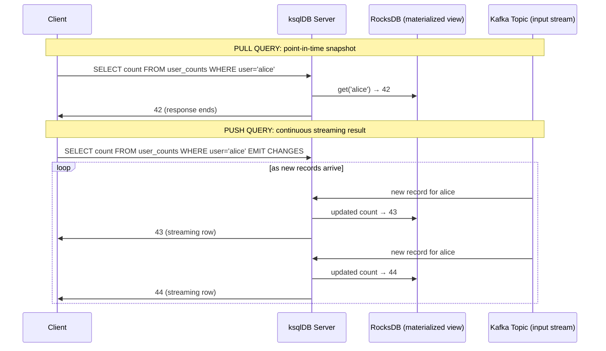

**Pull queries**: Read from materialized state store. Low latency (~ms). Suitable for request/response patterns. Require the table to be materialized (`CREATE TABLE ... WITH (KAFKA_TOPIC=...) AS SELECT ...`).

**Push queries**: Subscribe to ongoing changes. Long-lived HTTP connection (chunked transfer). Suitable for dashboards, real-time feeds.

---

## 14. ksqlDB Connect Integration

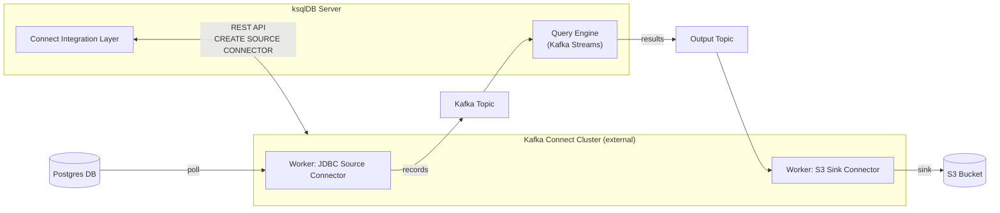

**Embedded Connect** (single node): ksqlDB runs a Kafka Connect worker in-process. Simple deployments.  
**External Connect**: ksqlDB proxies connector DDL (`CREATE SOURCE/SINK CONNECTOR`) to a separate Kafka Connect cluster via REST. Production-grade, independent scaling.

---

## 15. Event-Driven Design Patterns (Designing Event-Driven Systems)

### Commands vs Events vs Queries

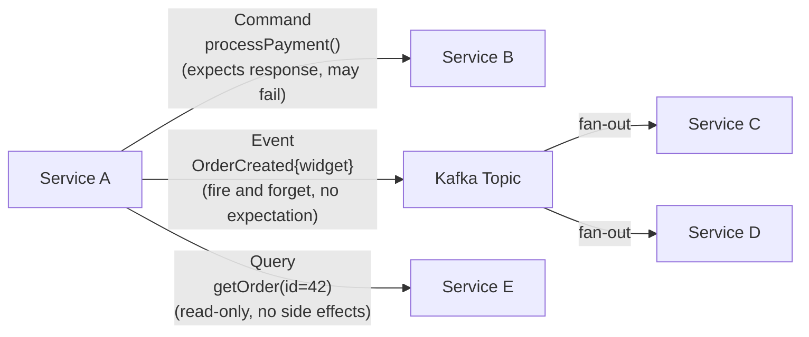

| Interaction | Direction | Coupling | Side effects | Response |
|---|---|---|---|---|
| Command | One-to-one | Tight | Yes | Maybe |
| Event | One-to-many | Loose | None at source | Never |
| Query | One-to-one | Medium | None | Always |

### Event Collaboration Pattern

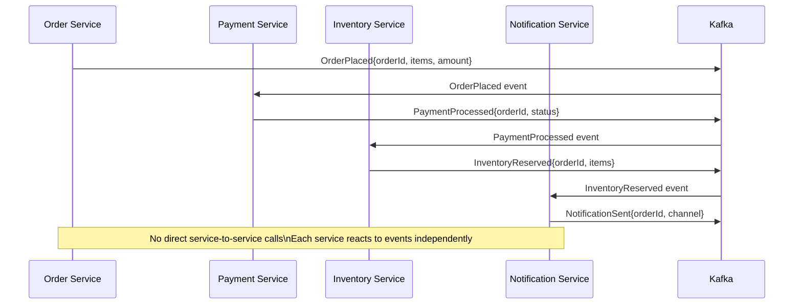

**Choreography** (shown above): No central orchestrator. Services react independently. Highly decoupled — adding a new subscriber (e.g. analytics service) requires zero changes to existing services.

**Orchestration**: A central "process manager" service issues commands to each downstream service and awaits their responses. Tighter coupling but clearer control flow for complex sagas.

---

## 16. Stream-Table Duality & Database Inside-Out

```mermaid
flowchart TD
    subgraph TraditionalDB["Traditional Database"]
        App1["Application"] -->|query| DB[("Shared Database\n(coupling point)")]
        App2["Application"] -->|query| DB
        App3["Application"] -->|query| DB
    end
    
    subgraph DatabaseInsideOut["Database Inside-Out (Kafka)"]
        LOG[("Kafka: Commit Log\n(shared source of truth)")] 
        LOG -->|stream| V1["Materialized View 1\n(search index, inside Service A)"]
        LOG -->|stream| V2["Materialized View 2\n(analytics cache, inside Service B)"]
        LOG -->|stream| V3["Materialized View 3\n(ML features, inside Service C)"]
    end
    style TraditionalDB fill:#2d1b1b,stroke:#ff6b6b
    style DatabaseInsideOut fill:#1b2d1b,stroke:#6bff6b
```

**Key insight** (Jay Kreps / Martin Kleppmann): A database has four components — commit log, query engine, indexes, caches. Kafka unbundles these:
- **Commit log** → Kafka topic (append-only, replayable)
- **Indexes/views** → Kafka Streams KTable / state stores (materialized per-service)
- **Query engine** → ksqlDB or application-level query against local state
- **Cache** → Local RocksDB, replicated via standby replicas

Each service keeps its own **lean view** — only the fields it needs. If the view is lost, replay from Kafka to reconstruct. Writes and reads are fully decoupled.

---

## 17. Compacted Topics as Event-Sourced State

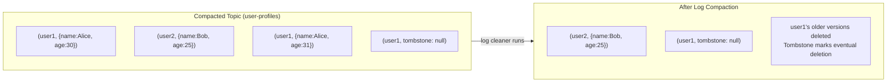

**Compacted topic = event-sourced table**: Every key's latest value is retained indefinitely. A service starting fresh can replay the compacted topic from offset 0 to rebuild its complete local state — equivalent to loading a database snapshot.

**Combined approach (latest-versioned pattern)**: Keep both a regular (time-limited) topic for audit trail AND a compacted topic for latest-state lookup. A Kafka Streams job links them — writing to the compacted topic whenever the regular topic has a new record.

---

## Summary: Internal Data Flow

```mermaid
flowchart TD
    INPUT["Kafka Input Topic\n(partitioned)"]
    INPUT -->|"1 partition = 1 task"| TASK["StreamTask\n(owns state + processing)"]
    TASK -->|depth-first record traversal| PROC["Processor Chain\n(filter → map → aggregate)"]
    PROC -->|upsert| RS["RocksDB\n(SST files on disk)"]
    RS -->|async write| CL["Changelog Topic\n(fault tolerance)"]
    CL -->|standby consumption| STANDBY["Standby Replica RocksDB\n(warm copy)"]
    PROC -->|produce| OUTPUT["Kafka Output Topic"]

    REBALANCE["Rebalance Event"] -->|sticky: reassign to previous owner| TASK
    STANDBY -->|"promote (delta replay only)"| TASK

    KSQL["ksqlDB Query Engine"] -->|compiled to| KS_TOPO["Kafka Streams Topology"]
    KS_TOPO --> TASK
    KSQL_PULL["Pull Query"] -->|point-in-time| RS
    KSQL_PUSH["Push Query"] -->|continuous subscribe| OUTPUT
```
