# Learning Apache Kafka (2nd Edition) — Under the Hood

> **Source**: Nishant Garg, Packt Publishing, 2015 (Kafka 0.8.x era)  
> **Focus**: Internal broker architecture, ZooKeeper coordination, partition log mechanics, ISR replication pipeline, producer/consumer offset state machines

## Historical boundary

- This document is an explicit Kafka 0.8.x study guide. ZooKeeper paths, high-level consumer APIs, offset storage, message formats, defaults, and controller behavior are historical unless a section says otherwise.
- Do not apply commands or sizing advice to a current cluster without mapping the concept to the deployed Kafka version and KRaft/ZooKeeper mode.
- Performance ratios are illustrative. Reproduce them with named storage, batching, compression, page-cache state, payload and percentile.
- For migration, record which invariant remains, which API or component was replaced, and how current logs and metrics prove the equivalent behavior.

---

## 1. Kafka's Architectural DNA: Why It Was Built This Way

Kafka emerged from LinkedIn's need to handle activity stream data and operational metrics at scale — a problem that JMS-style queuing systems couldn't solve efficiently due to broker-side metadata overhead, synchronous delivery contracts, and single-consumer semantics.

The core design principles that shape every internal decision:

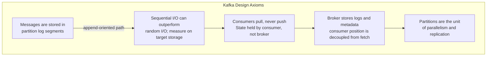

These axioms cascade into every subsystem: the log format, ZooKeeper schema, ISR mechanism, and consumer group rebalancing protocol.

---

## 2. Broker Internal Architecture: Log Segments and Page Cache

Each Kafka broker maps every topic-partition to segment files. Kafka relies heavily on the OS page cache and transfer paths, but requests, indexes, buffers and metadata can still consume JVM heap or native memory. The exact use of mmap, `sendfile`, TLS fallbacks and copying is implementation- and platform-dependent.

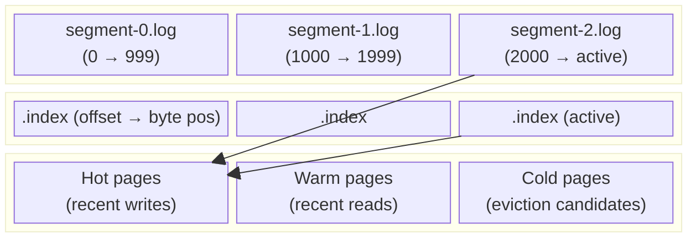

**Write path internals:**
1. Producer sends `ProduceRequest` → broker's `SocketServer` thread accepts via Java NIO
2. `RequestHandlerPool` dispatches to `ReplicaManager.appendRecords()`
3. `Log.append()` serializes `MessageSet` → writes to active segment's `FileChannel`
4. OS page cache absorbs write → async flush to disk after `log.flush.interval.messages` or `log.flush.interval.ms`
5. Once flushed, `LogManager` makes segment available to consumers by advancing **High Watermark (HW)**

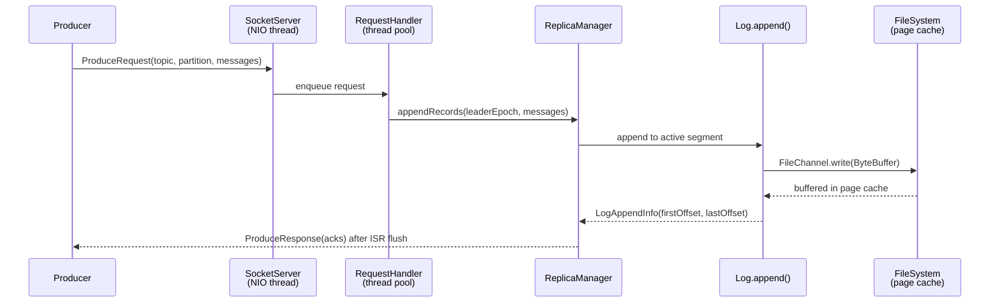

---

## 3. ZooKeeper Coordination Fabric

In Kafka 0.8.x, ZooKeeper serves as the central coordination layer — a hierarchical key-value store that all brokers and consumers watch for state changes.

### ZooKeeper Znode Schema

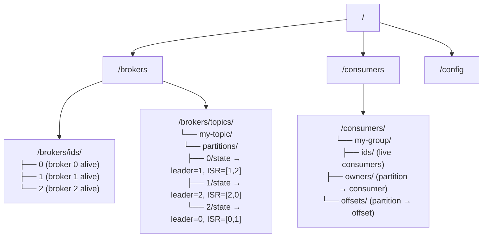

**Key coordination flows:**

| Event | ZooKeeper Operation |
|-------|-------------------|
| Broker starts | Creates ephemeral znode `/brokers/ids/{id}` |
| Broker fails | Ephemeral znode auto-deleted → triggers watches |
| Leader election | Controller watches broker deletion → writes new ISR to `/brokers/topics/…/state` |
| Consumer joins group | Creates ephemeral `/consumers/{group}/ids/{consumer-id}` |
| Consumer offset commit | Writes to `/consumers/{group}/offsets/{topic}/{partition}` |

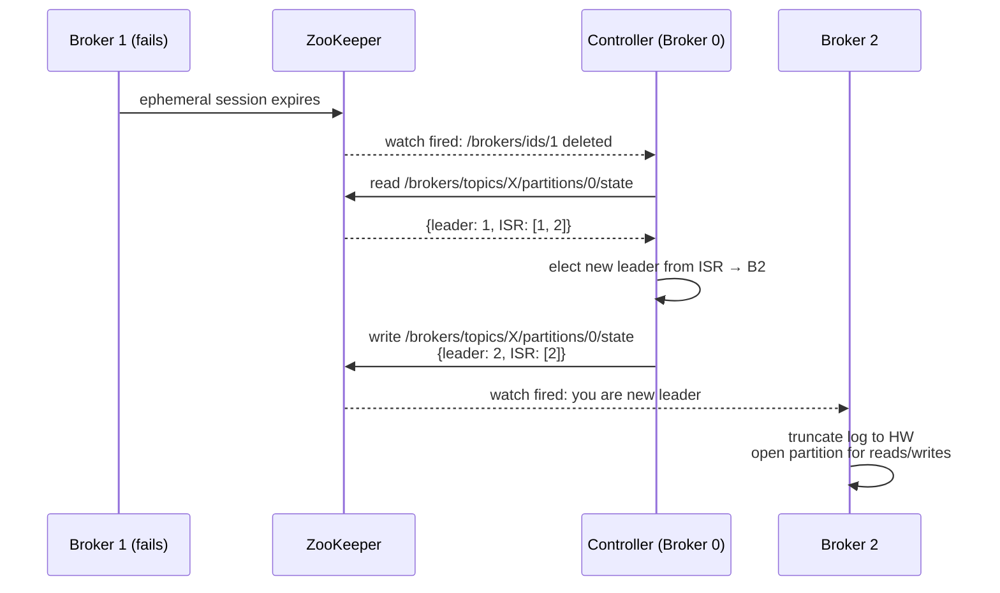

---

## 4. Producer Internals: Metadata, Partitioning, and Async Batching

### Metadata Bootstrap and Leader Discovery

Before a producer can write, it must discover the **lead replica** for each target partition. This bootstraps via `metadata.broker.list` — only used for the initial metadata request.

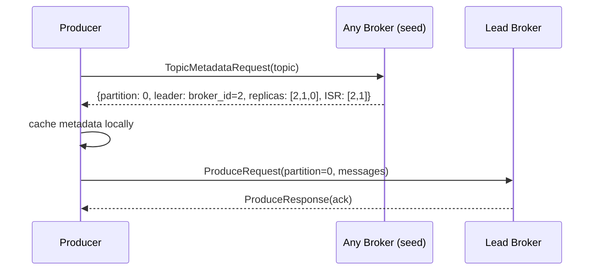

### Partitioner Hash Mechanics

The default `DefaultPartitioner` hashes the key modulo partition count:

```
partition = hash(key) % num_partitions
```

Custom partitioner example from the book (IP-based routing):


**Why key-based partitioning matters internally**: All messages with the same key land on the same partition → same ordered log → consumers see messages in causal order per key. This is the basis for event sourcing and stream joins.

### Async Mode Internal Buffer

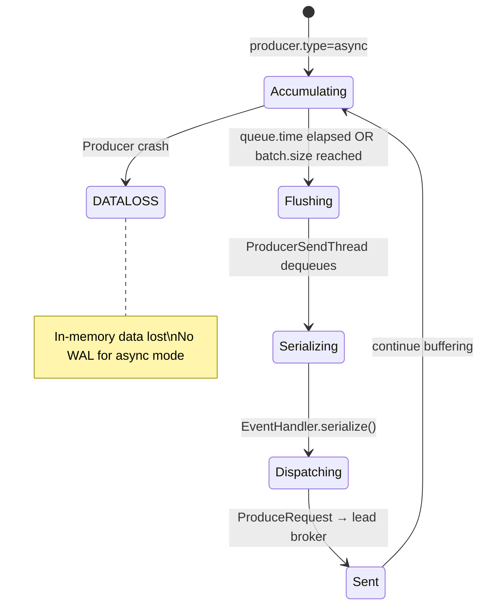

| Configuration | Effect |
|--------------|--------|
| `queue.time` (ms) | Max buffer time before flush |
| `batch.size` | Max message count before flush |
| `request.required.acks=0` | Fire-and-forget (no confirmation) |
| `request.required.acks=1` | Ack from lead replica only |
| `request.required.acks=-1` | Ack from all ISR replicas |

---

## 5. Replication Pipeline: ISR Mechanics Under Load

Kafka 0.8's replication protocol is synchronous by design for committed messages, but async for propagation.

### ISR Replication State Machine

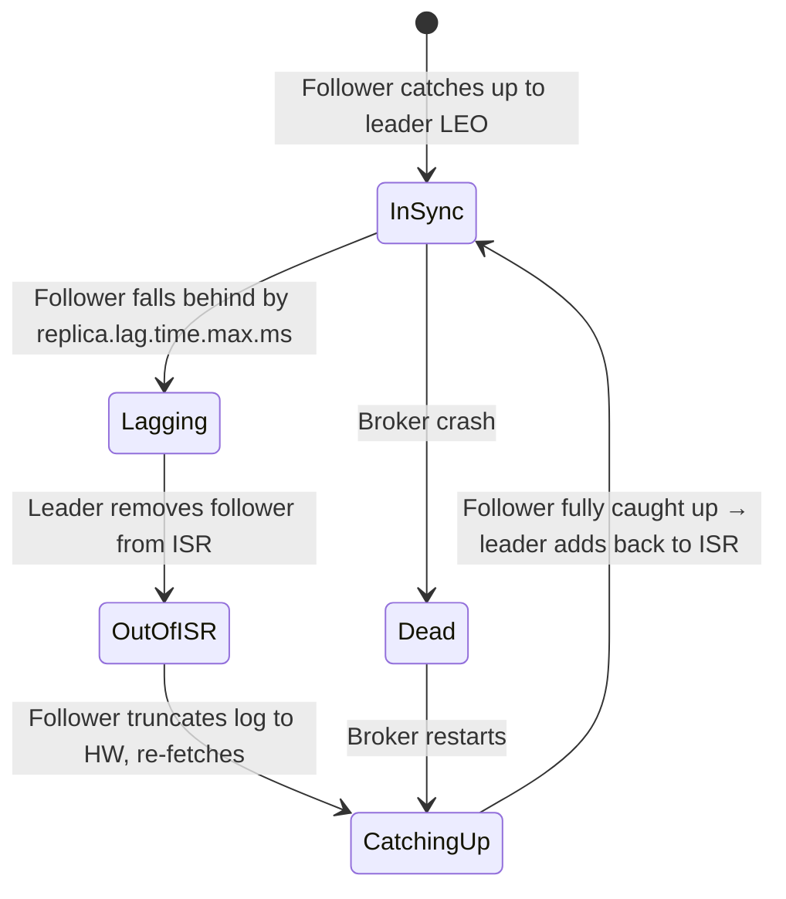

### Commit Protocol (High Watermark)

The **High Watermark (HW)** is the offset of the last message **replicated to all ISR members**. Consumers only see messages at or below HW — this is what guarantees consistency.

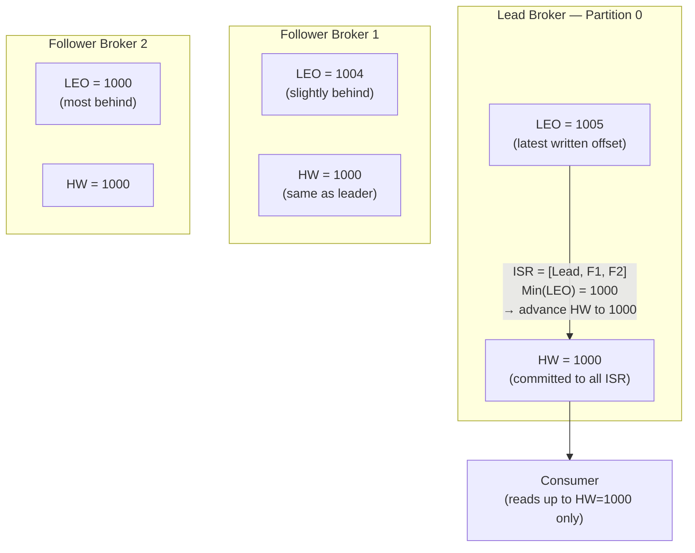

**Leader failover with log truncation:**

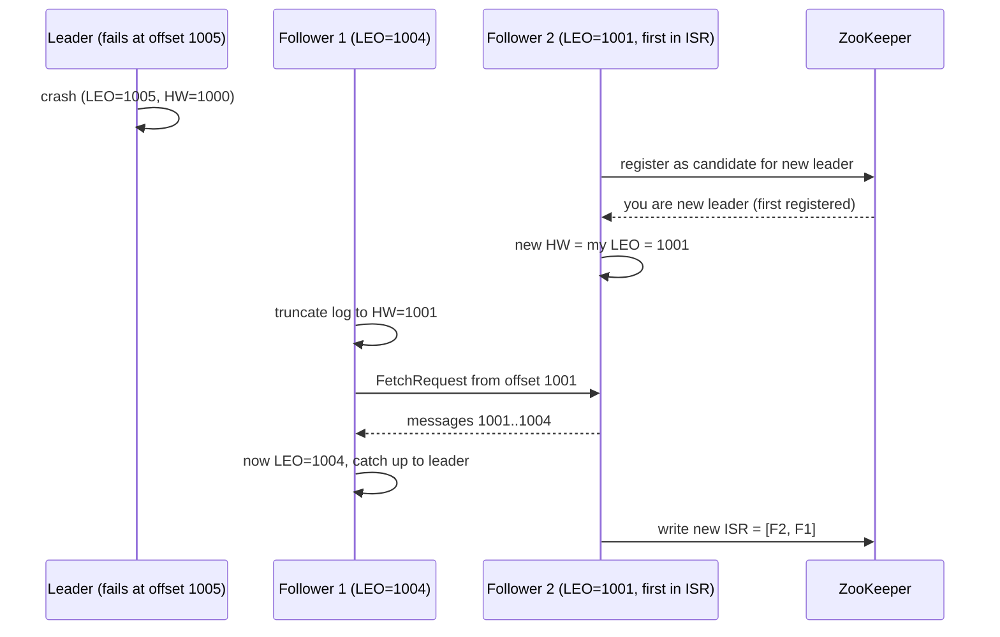

---

## 6. Consumer Architecture: Pull Model and Offset State Machine

### High-Level API Internal Architecture

The `ZookeeperConsumerConnector` abstracts the entire consumer state machine:

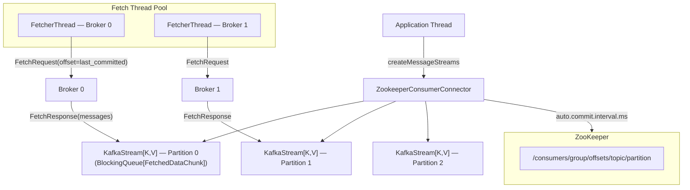

### Offset Lifecycle State Machine

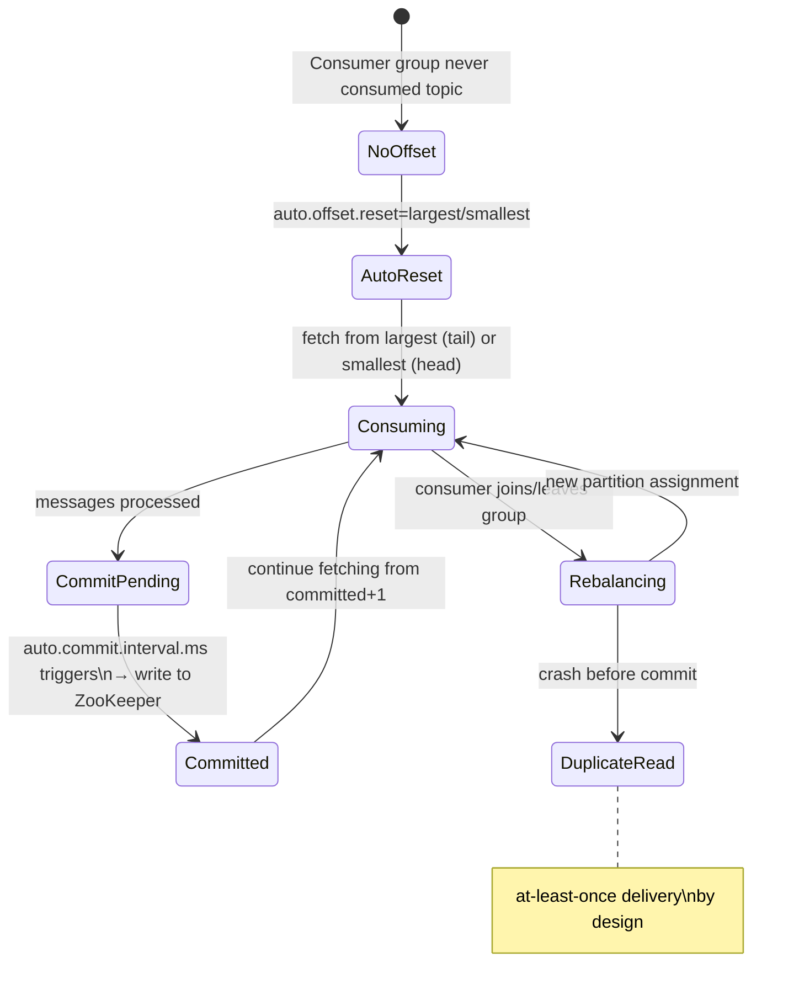

### Consumer Group Rebalancing Mechanics

When any consumer joins or leaves a group, ZooKeeper fires a watch → all consumers in the group rebalance:

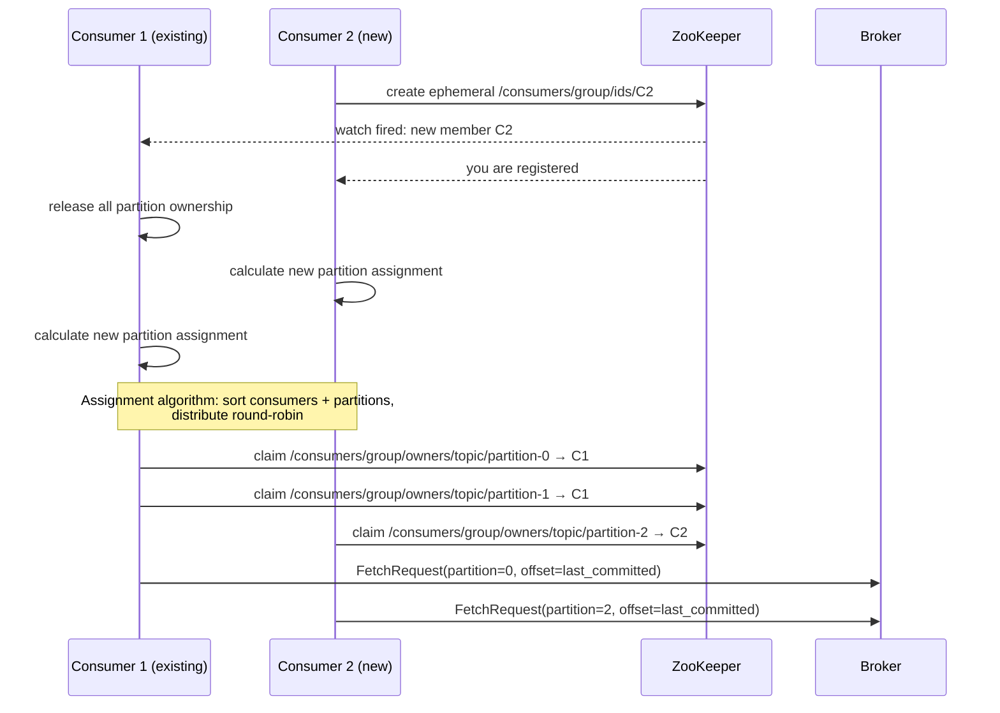

**Rebalancing hazard**: If a new consumer starts with an existing `group.id`, in-flight consumers release partitions mid-stream → some messages may be re-delivered to the new consumer. This is the "ambiguous behavior" the book warns about.

---

## 7. Log Compaction Internals

Log compaction is a background process that eliminates superseded key-value records, preserving only the most recent value per key.

```mermaid
flowchart LR
    subgraph Before["Before Compaction — Partition Log"]
        direction TB
        m0["offset=0: key=A val=v1"]
        m1["offset=1: key=B val=v1"]
        m2["offset=2: key=A val=v2"]
        m3["offset=3: key=C val=v1"]
        m4["offset=4: key=B val=v2"]
        m5["offset=5: key=A val=v3"]
    end

    subgraph After["After Compaction"]
        direction TB
        r1["offset=1: key=B val=v1 ❌ (superseded)"]
        r3["offset=3: key=C val=v1 ✅"]
        r4["offset=4: key=B val=v2 ✅"]
        r5["offset=5: key=A val=v3 ✅"]
    end
    
    Before -->|"LogCleaner thread\n(background)"| After
    
    style r1 fill:#c0392b,color:#fff
    style r3 fill:#27ae60,color:#fff
    style r4 fill:#27ae60,color:#fff
    style r5 fill:#27ae60,color:#fff
```

**Compaction properties:**
- Ordering of retained messages is always preserved (offsets are monotonically increasing)
- Once a key's record is compacted away, its offset no longer exists — consumers observing a gap in offsets must skip ahead
- The "head" of the log (recent messages) is never compacted; only the "tail" (old segments) is eligible

---

## 8. Message Compression Pipeline

Kafka 0.8's compression operates at the **MessageSet** level, not per-message — enabling superior compression ratios via batch entropy reduction.

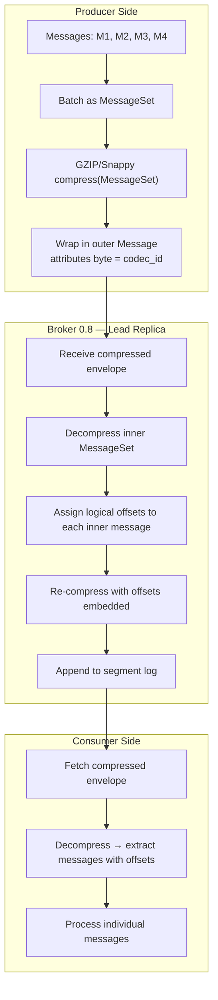

**The 0.8 compression penalty**: Unlike 0.7 (where compressed batches passed through the broker opaquely), 0.8 brokers must decompress → assign per-message logical offsets → re-compress. This causes measurable CPU load on the lead broker for high-throughput compressed topics.

**Compression attribute byte layout** (lowest 2 bits):
```
00 = uncompressed
01 = GZIP
10 = Snappy
11 = LZ4 (later versions)
```

---

## 9. Kafka 0.8 cluster topology: partition leaders and a controller

Unlike traditional databases with primary/secondary, Kafka uses a **controller** broker (elected via ZooKeeper) for administrative operations only — not for data paths.

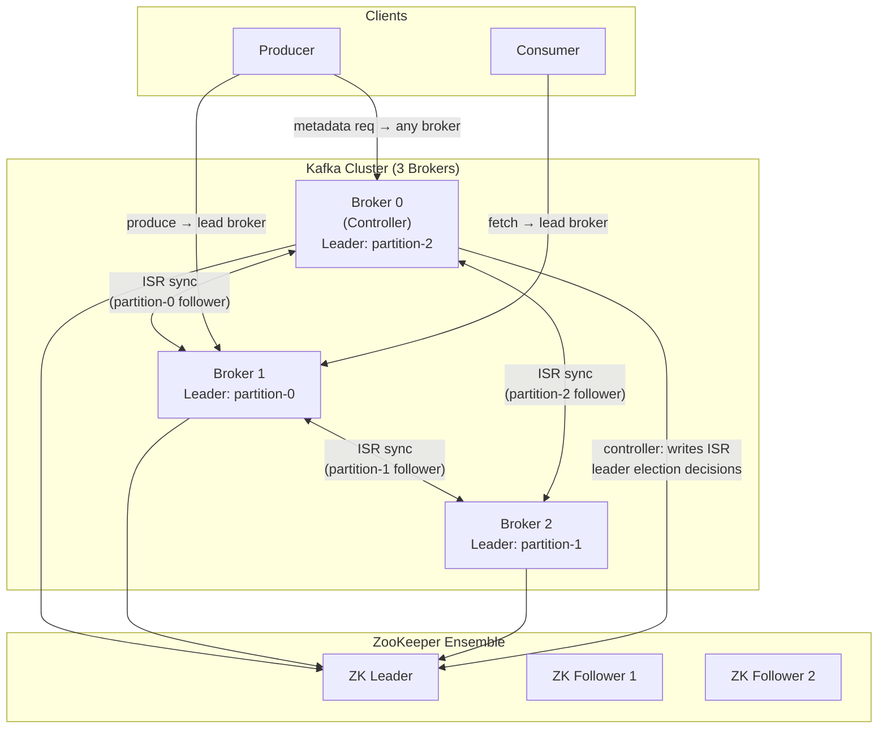

**Why no master for data paths?** Each producer connects directly to the lead broker for each partition — removing a central hotspot. The controller's role is purely metadata: writing ISR updates, triggering leader elections when brokers fail.

---

## 10. Multi-Broker Single-Node vs Multi-Node: What Changes Internally

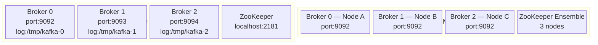

**Internal difference**: In single-node multi-broker, all brokers share the same NIC → replication traffic competes with producer/consumer traffic. In multi-node, replication traffic crosses the network but benefits from node-level failure isolation.

---

## 11. Kafka 0.8 vs Modern Kafka: What This Era Reveals

| Aspect | Kafka 0.8 (this book) | Modern Kafka (2.x+) |
|--------|----------------------|---------------------|
| Offset storage | ZooKeeper znodes | Internal `__consumer_offsets` topic |
| Consumer group coordination | ZooKeeper watches | Group Coordinator broker |
| Leader election | ZooKeeper + Controller | KRaft (Raft-based, no ZK) |
| Producer API | `kafka.javaapi.producer.Producer` | `KafkaProducer` (new API) |
| Compression re-assignment | Broker decompresses+recompresses | Broker passes through (magic byte v2) |
| Exactly-once | Not supported | Transactional API + idempotent producer |

Understanding the 0.8 era illuminates *why* the modern APIs were redesigned — every pain point (ZooKeeper offset contention, rebalancing storms, compression CPU overhead) has a specific architectural fix in the later versions.

---

## Summary: Internal Data Flow Map

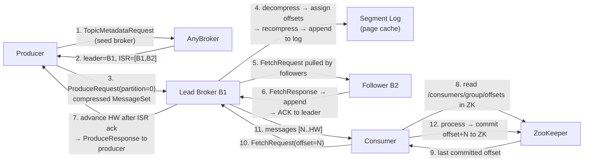

The entire system — from log append to consumer pull — is designed around **sequential I/O + OS page cache + pull-based consumers + stateless brokers**. Every design decision traces back to these four principles.
