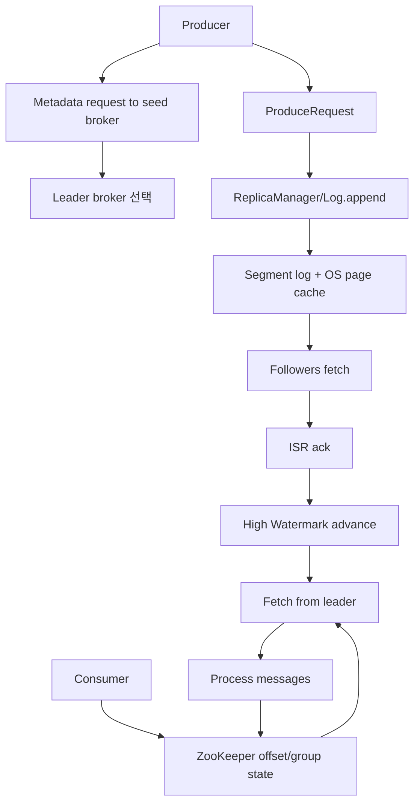
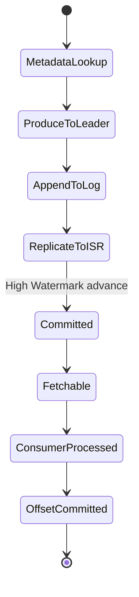
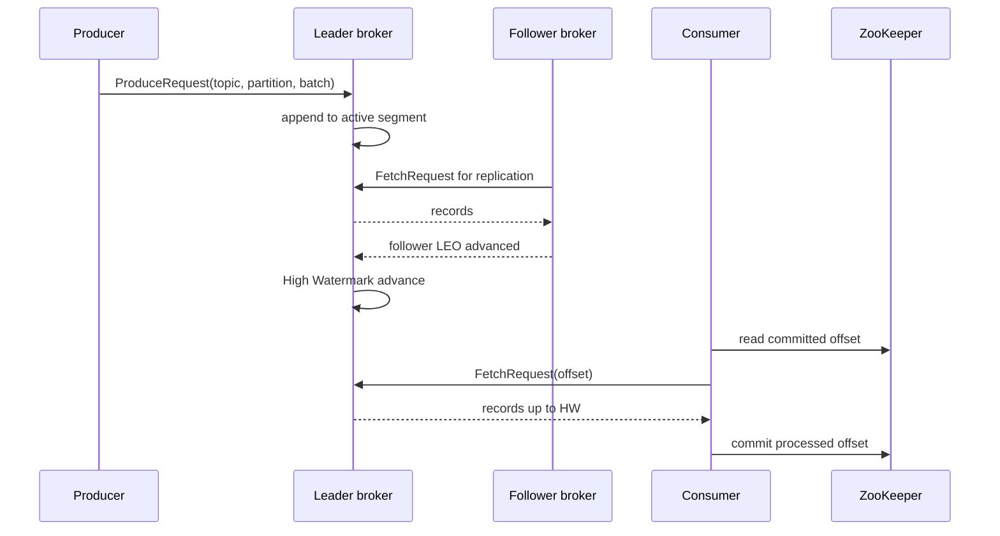

# Learning Apache Kafka 학습 및 기록 노트

## 1. 왜 필요한가? (Pain Point & Motivation)

Nishant Garg의 *Learning Apache Kafka*는 Kafka 0.8.x 시대의 broker, ZooKeeper coordination, partition log, ISR replication, producer/consumer offset 흐름을 설명한다. 이 시기의 Kafka는 modern Kafka와 다르게 consumer offset과 group coordination을 ZooKeeper에 크게 의존하므로, 현재 Kafka 구조를 이해할 때도 무엇이 바뀌었는지 비교 기준이 된다.

이 문서는 원문의 Kafka 0.8 internals 내용을 log segment, ZooKeeper, ISR, producer/consumer state machine, compaction, compression penalty 중심으로 재작성한다.

## 2. 현재 나의 상태 (Baseline)

- Kafka topic, partition, producer, consumer, broker의 기본 개념은 알고 있다.
- Kafka 0.8에서 ZooKeeper가 broker discovery, leader election, consumer group, offset 저장에 어떻게 쓰였는지 구분해야 한다.
- ISR, High Watermark, Log End Offset의 관계를 정확히 설명해야 한다.
- Producer batching과 `acks` 설정이 data loss/latency와 어떻게 연결되는지 정리해야 한다.
- Modern Kafka의 `__consumer_offsets`, group coordinator, KRaft와 0.8 구조의 차이를 알아야 한다.

## 3. 도달하고 싶은 목표 (Target State)

- Broker가 topic-partition을 segment log와 index file로 저장하는 방식을 설명한다.
- ZooKeeper znode와 watch가 broker failure, leader election, consumer rebalance를 유발하는 흐름을 이해한다.
- ISR과 High Watermark가 consumer에게 보이는 committed offset을 결정하는 과정을 설명한다.
- Consumer offset lifecycle과 at-least-once 중복 읽기 가능성을 연결한다.
- Kafka 0.8 설계의 병목이 modern Kafka에서 어떤 구조로 개선됐는지 비교한다.

## 4. 시스템 번역 (Data Flow)

Kafka 0.8의 핵심 data flow는 sequential log append, follower pull replication, High Watermark commit, ZooKeeper 기반 consumer offset commit으로 이어진다.

## 5. 핵심 구성요소 (Building Blocks)

| 구성요소 | 역할 | 핵심 상태 |
| --- | --- | --- |
| Segment log | partition data 저장 | active segment, offset, byte position |
| Index file | offset에서 segment byte 위치 탐색 | sparse offset index |
| OS page cache | broker heap 대신 disk I/O 완충 | hot/warm/cold page |
| ZooKeeper znode | cluster metadata와 liveness 저장 | ephemeral node, watch |
| Controller broker | metadata 변경과 leader election 조정 | broker session, ISR state |
| ISR | leader와 동기화된 replica 집합 | in-sync, lagging, out-of-ISR |
| High Watermark | consumer에게 보이는 committed offset | min ISR LEO |
| Producer async buffer | batch 전송과 대기 | queue time, batch size, acks |
| Consumer group | partition ownership과 offset | group id, owner znode, committed offset |
| Log cleaner | compacted topic 정리 | latest key value, dirty segment |

## 6. 상태 전이 (State Transition)

Leader는 log append 후 follower fetch와 ISR ack를 기준으로 High Watermark를 전진시킨다. Consumer는 HW 이하의 message만 읽고, 처리 후 ZooKeeper에 offset을 기록한다.

## 7. 불변식 (Invariant: 절대 깨지면 안 되는 규칙)

- 같은 key의 순서 보장이 필요하면 같은 partition으로 routing되어야 한다.
- Consumer는 High Watermark 이후의 uncommitted message를 읽으면 안 된다.
- Leader failover 후 follower는 새 leader의 HW에 맞춰 log를 truncate할 수 있어야 한다.
- ZooKeeper ephemeral node와 watch는 broker/consumer liveness 변화와 일치해야 한다.
- `acks=0`은 broker 확인 없이 반환되므로 data loss 가능성을 감수해야 한다.
- Async producer buffer는 process crash 시 유실될 수 있다.
- Log compaction은 key별 최신 값을 남기되 retained message의 offset ordering을 유지해야 한다.
- Kafka 0.8의 consumer offset은 ZooKeeper에 있으므로 offset commit 부하와 rebalance storm을 고려해야 한다.

## 8. 가장 작은 예제 (Minimal Viable Example)

이 예제는 Kafka 0.8의 내구성과 읽기 가시성이 broker log, follower replication, ZooKeeper offset state를 함께 통과한다는 점을 보여준다.

## 9. 실패 사례 (What could go wrong?)

- `acks=0` 또는 async buffer만 믿고 producer crash/data loss를 놓친다.
- ISR follower가 오래 lagging 상태인데도 replication health를 확인하지 않아 failover 위험이 커진다.
- Consumer가 처리 전에 offset을 commit해 crash 후 message loss가 생긴다.
- Consumer가 처리 후 commit 전에 crash해 같은 message를 다시 읽는다.
- 새 consumer가 같은 `group.id`로 들어와 rebalance가 발생하고 in-flight 처리 중복이 생긴다.
- ZooKeeper watch/rebalance 부하가 커져 대규모 group에서 stop-the-world처럼 보이는 지연이 생긴다.
- Kafka 0.8 compression은 broker가 decompress, offset assign, recompress를 수행해 leader CPU 병목이 된다.

## 10. 뇌 확장하기 (Evolution & Variants)

- Modern Kafka에서는 consumer offset이 ZooKeeper가 아니라 `__consumer_offsets` internal topic에 저장된다.
- Group coordination은 ZooKeeper watch 대신 broker-side group coordinator로 옮겨졌다.
- KRaft 기반 Kafka는 ZooKeeper 없이 metadata quorum을 운영한다.
- Producer는 idempotence와 transaction API로 duplicate/write fencing을 다룬다.
- Log compaction은 tombstone, compaction lag, cleanup policy와 함께 이해해야 한다.
- MirrorMaker, Kafka Connect, REST proxy는 cluster 간 복제와 외부 시스템 연동의 별도 data flow로 확장된다.

## 11. 최종 체크리스트 (Definition of Done)

- [x] Kafka 0.8의 broker log, ZooKeeper, ISR, HW, consumer offset 흐름을 정리했다.
- [x] Producer/consumer 최소 sequence diagram으로 write-read 경로를 설명했다.
- [x] Async producer, rebalance, offset commit, compression penalty 실패 사례를 포함했다.
- [x] Kafka 0.8과 modern Kafka의 구조 차이를 evolution 항목에 반영했다.
- [x] 원문 *Learning Apache Kafka* 문서를 12개 섹션 템플릿으로 재작성했다.

## 12. 뇌에 새기는 복습 문장 (TL;DR Blank)

Kafka 0.8은 sequential log, OS page cache, ISR High Watermark, ZooKeeper coordination을 결합해 확장성을 만들었고, modern Kafka는 그 병목을 broker-side coordination과 metadata quorum으로 옮겨 개선했다.
