# RabbitMQ Internals: AMQP Wire Protocol, Routing Engine, and Cluster Mechanics

> Sources: *RabbitMQ in Depth* (Gavin M. Roy, Manning 2018) · *Mastering RabbitMQ* (Ayanoglu, Aytaş, Nahum, Packt 2015)

---

## 1. The AMQP 0-9-1 Wire Frame Machine

Every interaction between a client and RabbitMQ travels as a sequence of **frames** over a single TCP connection. A frame is the atomic transport unit — a self-delimiting envelope carrying a command, a content header, or a body chunk.

```
Frame wire layout (bytes on the wire)
┌──────────┬──────────┬──────────────┬─────────────────────────┬──────────┐
│ type (1) │ chan (2) │ payload_size │ payload (N bytes)       │ 0xCE (1) │
│          │          │ (4 bytes)    │                         │ frame-end│
└──────────┴──────────┴──────────────┴─────────────────────────┴──────────┘
```

**Frame type codes:**

| Code | Name      | Purpose |
|------|-----------|---------|
| 1    | METHOD    | AMQP class+method with marshaled arguments |
| 2    | HEADER    | Content class ID, body size, property flags, property fields |
| 3    | BODY      | Raw message body chunk (≤ frame_max − 7 bytes) |
| 8    | HEARTBEAT | Keepalive, no payload |

For a message larger than the negotiated `frame_max` (default 131,072 bytes), the body is sharded into multiple BODY frames automatically. The 7-byte overhead (type+channel+size+frame-end) means each body chunk carries at most **131,065 bytes**.

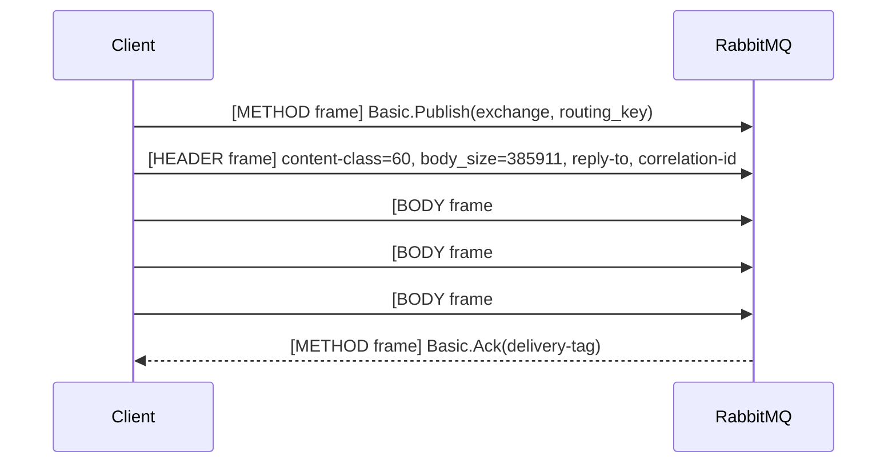

---

## 2. Connection Negotiation: RPC State Machine

AMQP uses **bidirectional RPC** — the server issues commands to the client, not just the reverse. The connection bootstrap is a multi-step negotiation:

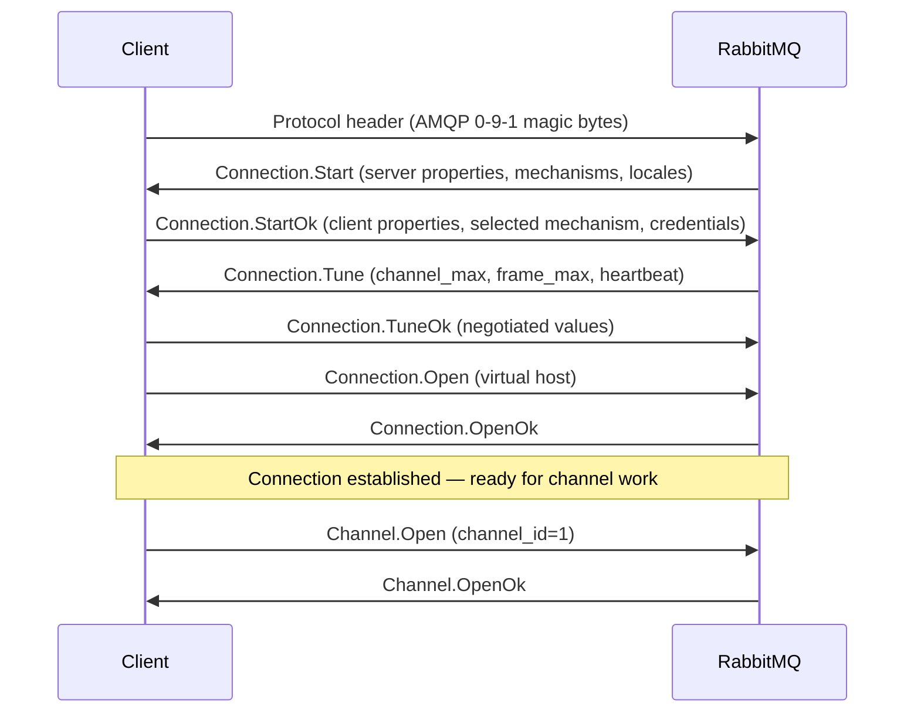

Only after `Connection.OpenOk` can the client open channels. Each channel is identified by an integer ID embedded in every subsequent frame's `chan` field. **No channel state crosses connection boundaries.**

---

## 3. Channel Multiplexing and Memory Cost

A single TCP connection carries N logical **channels** interleaved by the channel ID field in each frame:

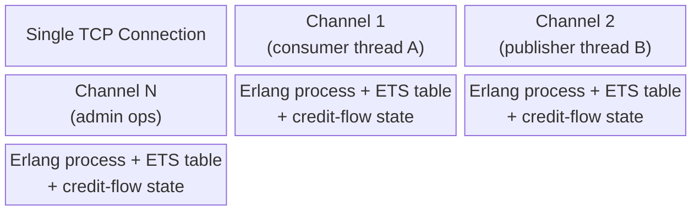

**Key insight**: Each channel is not just a number on the wire — inside the broker it maps to an **Erlang process** with its own mailbox, message backlog ETS table, prefetch credit counter, and transaction state. Creating 1,000 channels per connection means 1,000 Erlang processes, with corresponding RAM overhead. Recommended practice: one channel per thread, never reuse channels across threads.

---

## 4. The AMQ Model: Exchange → Binding → Queue Pipeline

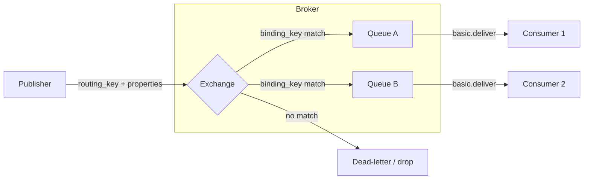

The routing decision is made **entirely inside the exchange process** by evaluating the message's `routing_key` (and optionally `headers` properties) against the set of bindings attached to that exchange.

---

## 5. Exchange Types: Internal Routing Algorithms

### 5.1 Direct Exchange — String Equality

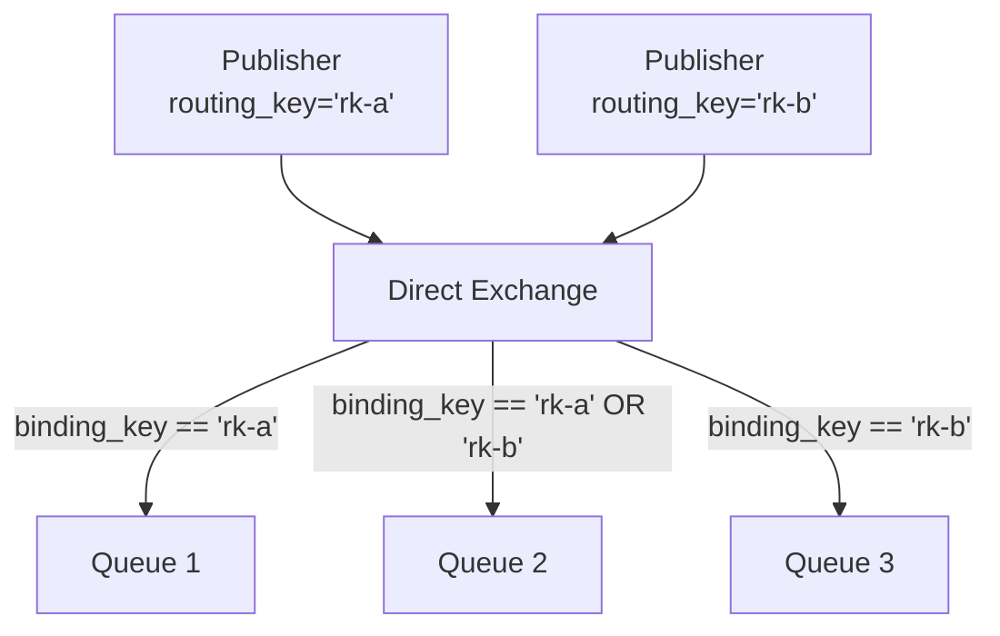

Algorithm: `routing_key == binding_key` (byte-for-byte equality, no pattern expansion). Multiple queues can bind with the same key — **all receive the message** (multicast, not load-balance).

### 5.2 Fanout Exchange — Broadcast

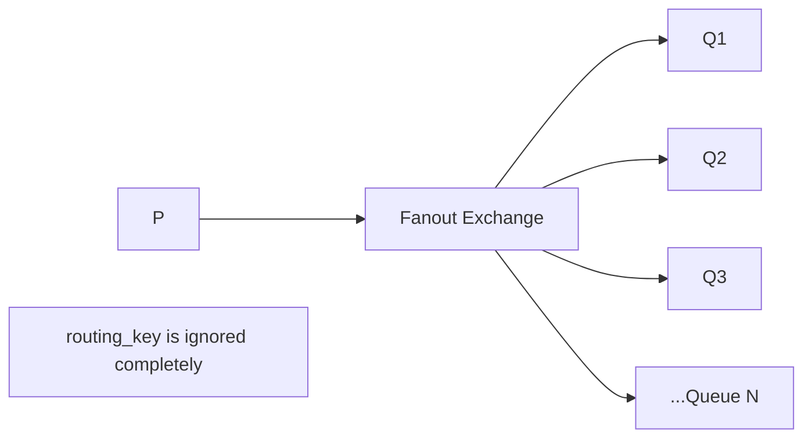

The broker iterates all bound queues and enqueues a reference to the message in each. No routing key evaluation — lowest per-message routing cost of all built-in types.

### 5.3 Topic Exchange — Wildcard Trie Matching

Routing keys are dot-delimited strings. Binding patterns use two wildcards:

- `*` — exactly one word segment
- `#` — zero or more word segments

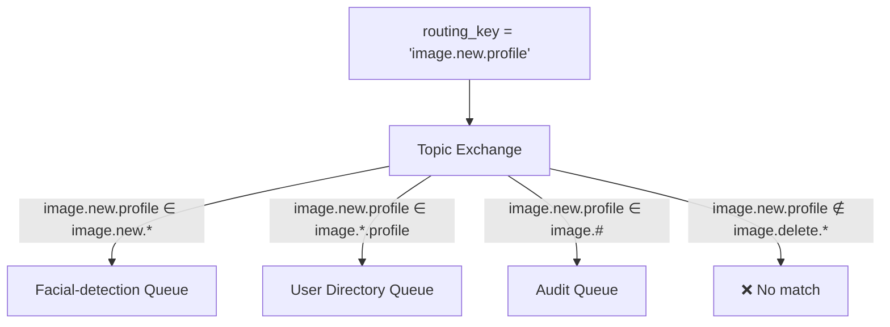

Internally, RabbitMQ compiles bindings into a **trie structure** indexed by word segments. Routing traverses the trie — O(depth) per word, not O(bindings).

### 5.4 Headers Exchange — Property Table Matching

The headers exchange ignores `routing_key` entirely. Instead it evaluates the message's `headers` property table against Queue.Bind arguments:

```
x-match = "all"  →  ALL key/value pairs in binding must match message headers (AND logic)
x-match = "any"  →  ANY key/value pair in binding matches (OR logic)
```

**Performance note**: Before evaluation, RabbitMQ's `rabbit_misc:sort_field_table/1` sorts the headers table by key — adding O(N log N) per message. Benchmarks show comparable throughput to other types when header table is small; degrades with large tables.

### 5.5 Exchange-to-Exchange Binding

RabbitMQ extends AMQP 0-9-1 with `Exchange.Bind`, allowing exchanges to be bound to other exchanges:

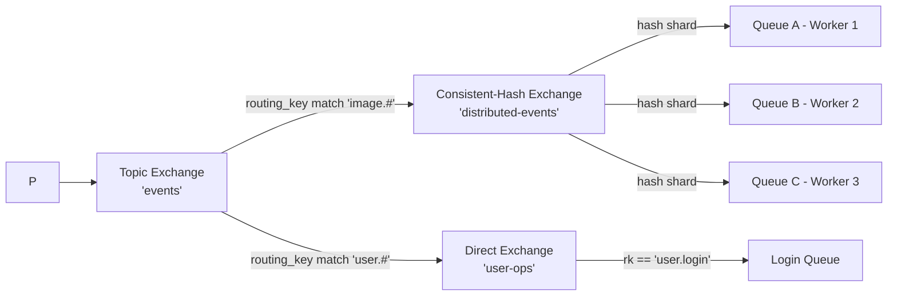

The downstream exchange receives the message as if it were published directly to it — its own routing logic applies. This enables composable routing pipelines without touching publisher code.

---

## 6. Queue Internals: Memory, Disk, and Message Lifecycle

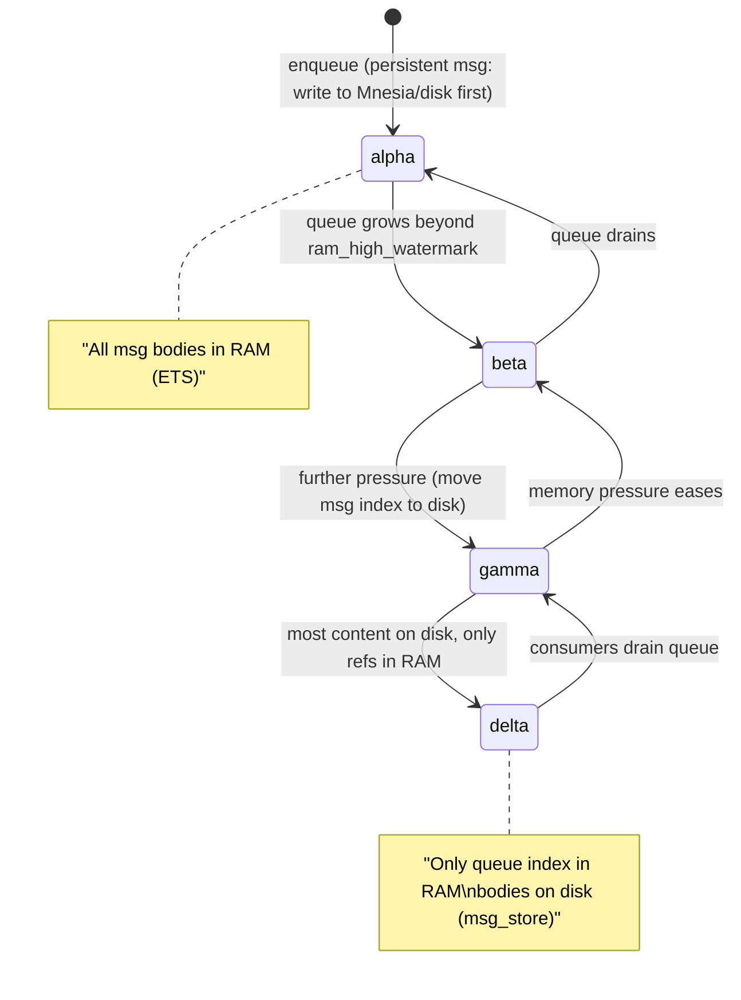

RabbitMQ queues implement a **four-state backing queue** (alpha→beta→gamma→delta) that progressively moves messages to disk as memory pressure increases:

- **alpha**: message body + index in RAM
- **beta**: index in RAM, body on disk
- **gamma**: index partially on disk
- **delta**: fully on disk, only a skeleton in RAM

The `vm_memory_high_watermark` (default 0.4 = 40% of system RAM) triggers flow control — publishers are throttled when the broker approaches this threshold.

### Queue Persistence: Mnesia vs ETS

| Storage | Content | Durability |
|---------|---------|-----------|
| ETS (Erlang Term Storage) | Transient message bodies (non-persistent) | Lost on crash |
| Mnesia disk tables | Durable queue/exchange/binding metadata, persistent message index | Survives restart |
| `msg_store` files | Persistent message bodies (chunked files on disk) | Survives restart |

Durable + persistent messages write to both the Mnesia transaction log **and** `msg_store` before sending `Basic.Ack` to the publisher.

---

## 7. Publisher Confirms vs Transactions

Two delivery guarantee mechanisms with very different performance characteristics:

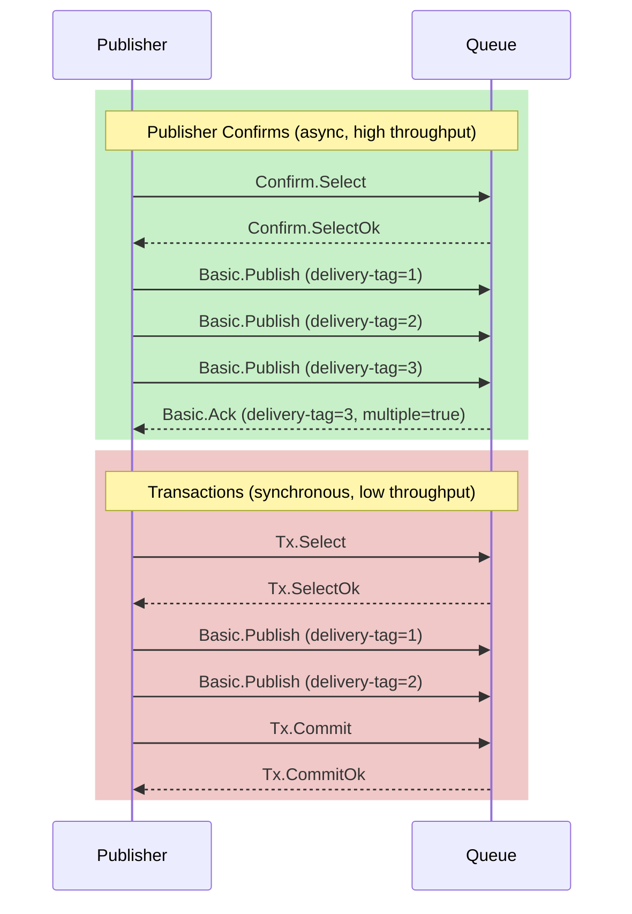

**Confirms**: broker acks delivery-tags asynchronously after writing to disk/queue. Publisher may batch inflight messages up to `delivery-tag` watermark — single `Basic.Ack(multiple=true)` acknowledges all prior delivery-tags at once.

**Transactions**: synchronous 2PC. `Tx.Select` → publish N messages → `Tx.Commit` — broker must flush all messages to disk before responding. Typically 10–100x slower than confirms.

---

## 8. Consumer Prefetch: Credit-Flow Mechanics

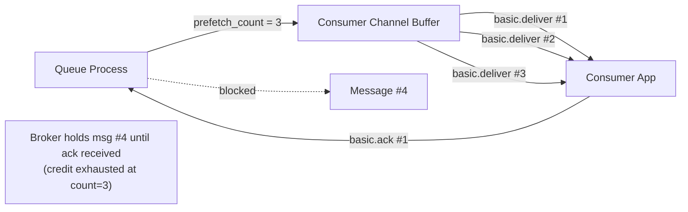

`basic.qos(prefetch_count=N)` sets the **inflight window**: broker buffers at most N unacked messages per consumer channel. When the window is full, the broker stops delivering from the queue to that consumer. This is the primary **backpressure mechanism** between broker and consumer.

Setting `prefetch_count=0` disables prefetch entirely — broker pushes all available messages immediately (dangerous with slow consumers).

---

## 9. Dead Letter Exchange (DLX): Message Fate Routing

When a message cannot be delivered normally, RabbitMQ routes it through a **Dead Letter Exchange** if one is configured on the queue:

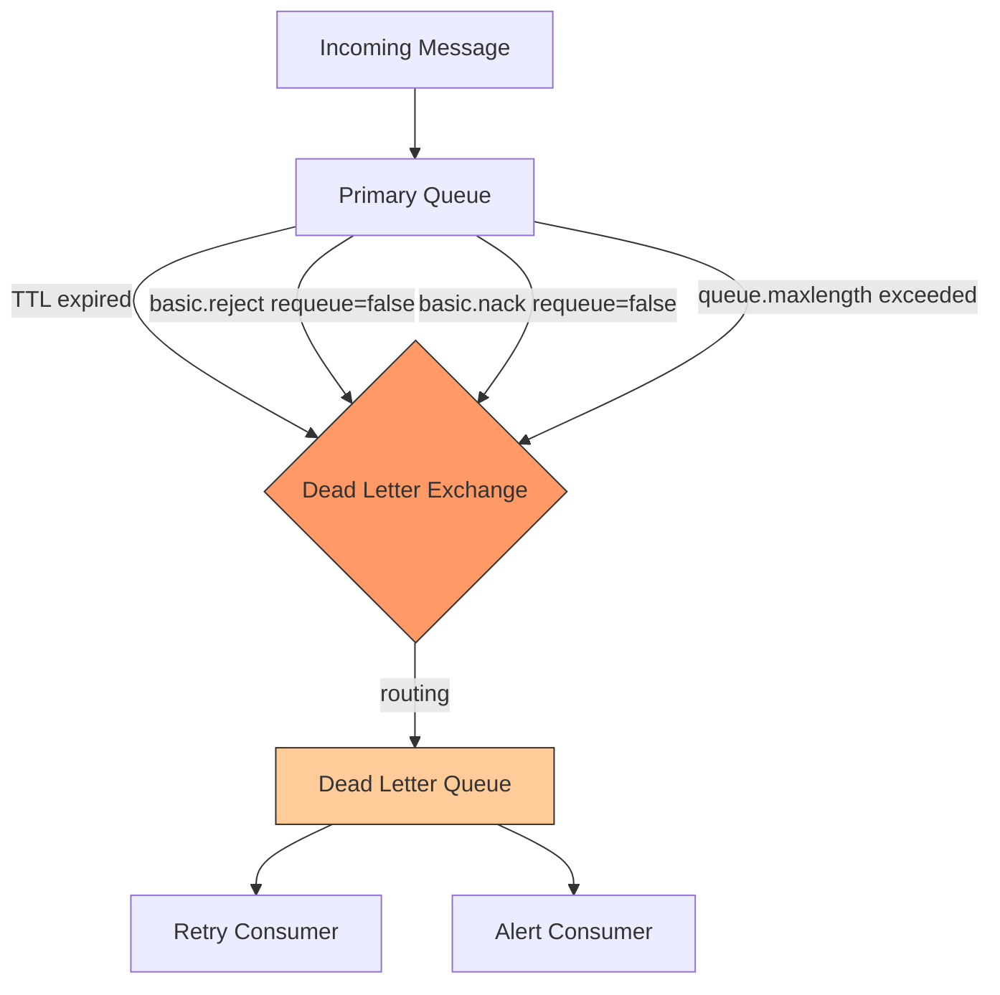

Dead-lettered messages carry additional headers injected by RabbitMQ:
- `x-death`: array of death events (each with queue name, reason, timestamp, exchange, routing keys, count)
- `x-first-death-queue`, `x-first-death-reason`, `x-first-death-exchange`

This enables **retry topologies**: DLX → delay queue (with TTL) → original exchange = exponential backoff without application code.

---

## 10. Clustering: Erlang Distribution Protocol

RabbitMQ clusters use the **Erlang Distribution Protocol** (OTP) for inter-node communication — the same mechanism Erlang uses for distributed process messaging:

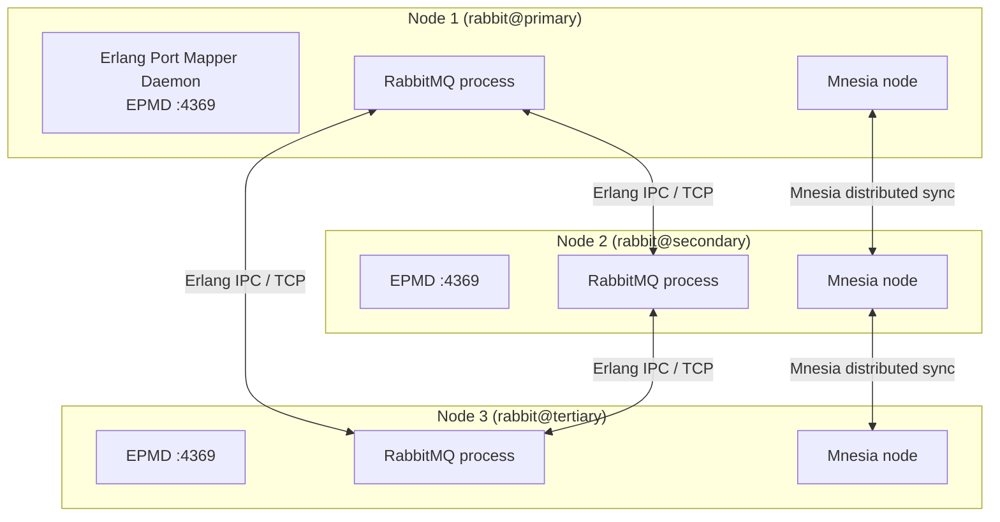

**Erlang cookie**: A shared secret file (`/var/lib/rabbitmq/.erlang.cookie`) that all nodes must have identical. Node authentication is based on this cookie — nodes with mismatched cookies refuse connections.

**Mnesia** synchronizes cluster metadata (exchanges, queues, bindings, users, vhosts, permissions) across all disk nodes. A **RAM node** stores Mnesia tables only in memory — faster but loses metadata on crash.

### Queue Locality in a Cluster

A queue **lives on exactly one node** (its "home" node) in a non-HA setup:

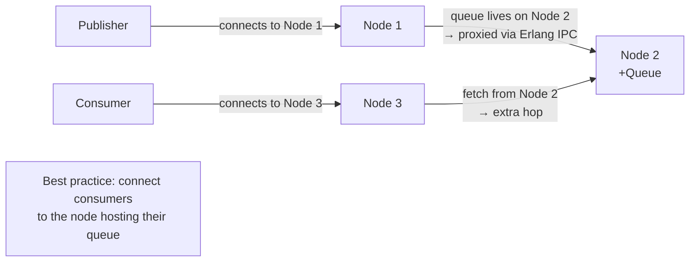

Cross-node message delivery adds an Erlang IPC hop with measurable latency. High-throughput consumers should connect to the **queue's home node** to avoid this overhead.

---

## 11. HA Queues: Guaranteed Multicast (GM) Protocol

Classic HA queues (pre-3.8 "mirrored queues") use RabbitMQ's **Guaranteed Multicast** protocol to replicate every message synchronously to all mirrors:

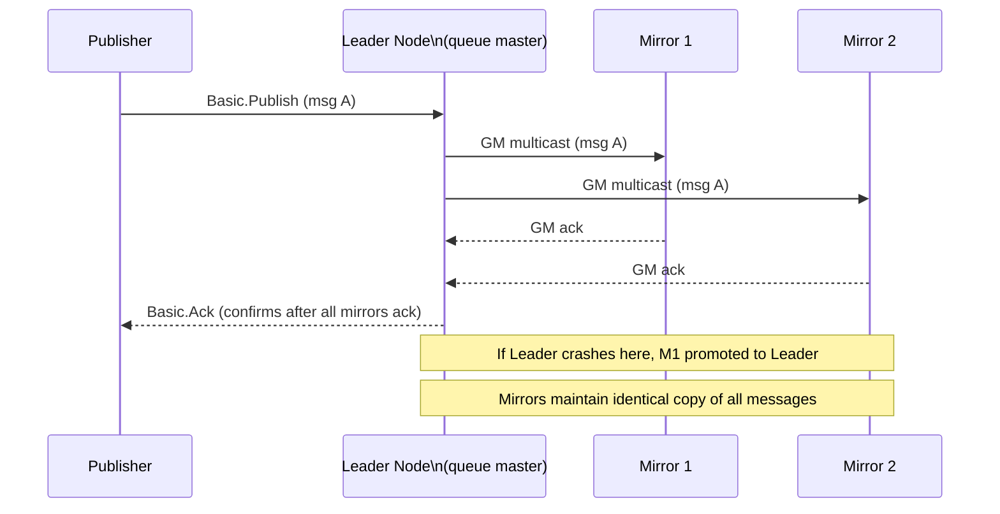

**Mirror promotion**: When the leader crashes, RabbitMQ promotes the "oldest" mirror (most synchronized) to leader. Consumers reconnect transparently — the queue's virtual identity persists on the new leader.

**Performance cost of HA**: With N mirrors, each publish requires N−1 GM acknowledgments before the publisher confirmation is sent. Throughput scales inversely with replica count and inter-node latency.

### Quorum Queues (Modern Replacement)

Quorum queues (introduced in RabbitMQ 3.8) replace mirrored queues with a **Raft consensus** protocol:

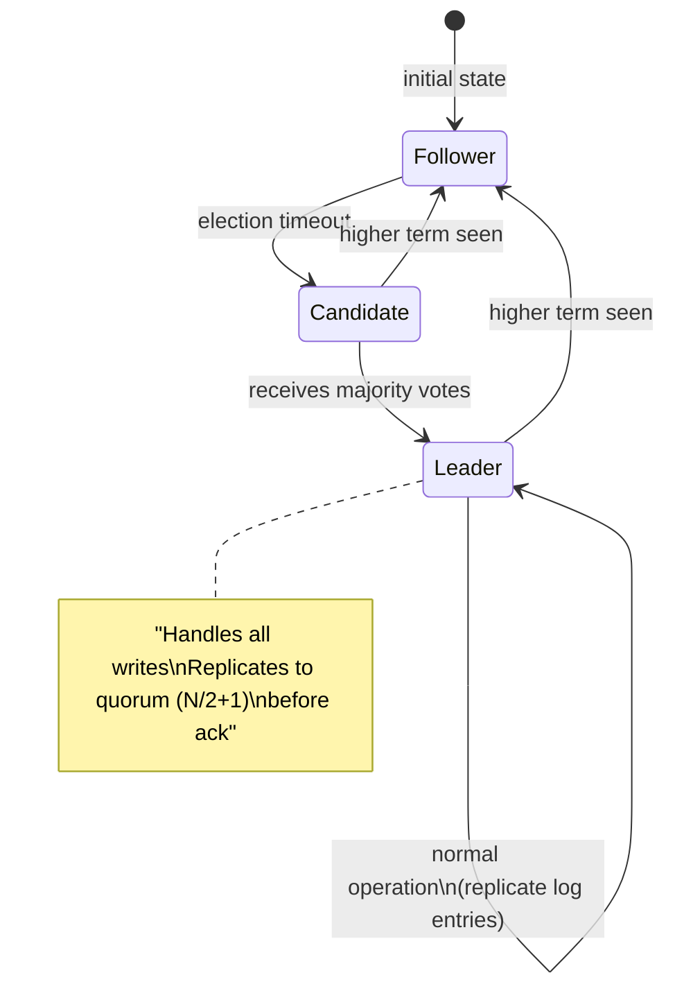

Quorum queues guarantee **linearizable** message delivery with automatic leader election. Unlike mirrored queues, they store messages in a WAL (write-ahead log) replicated to a majority of nodes — tolerating `(N-1)/2` node failures.

---

## 12. Federation Plugin: WAN-Tolerant Message Relay

Clustering requires low-latency LAN connectivity. For cross-datacenter or internet message distribution, RabbitMQ uses **Federation**:

```mermaid
flowchart LR
    subgraph DC1["Data Center 1"]
        P[Publisher] --> UE[Upstream\nExchange 'events']
        UE --> UQ[Internal Queue]
        UQ --> FC[Federation Consumer\n(Erlang process)]
    end

    FC -->|AMQP over internet\n(WAN-tolerant, reconnects)| DE

    subgraph DC2["Data Center 2"]
        DE[Downstream\nExchange 'events']
        DE --> DQ[Downstream Queue]
        DQ --> C[Consumer]
    end
```

**How federation works internally**:
1. The downstream exchange with a federation policy creates a dedicated Erlang process per upstream link
2. That process establishes an AMQP connection to the upstream broker
3. It declares a **work queue** on the upstream broker and binds it to the upstream exchange
4. The process acts as a **consumer** of the upstream work queue, forwarding messages to the local downstream exchange
5. If the WAN link drops, the upstream work queue accumulates messages — when reconnected, the federation process drains the backlog

Bidirectional federation (each datacenter upstream + downstream of the other) enables **active-active** multi-datacenter messaging.

---

## 13. Message Flow: End-to-End Internal Path

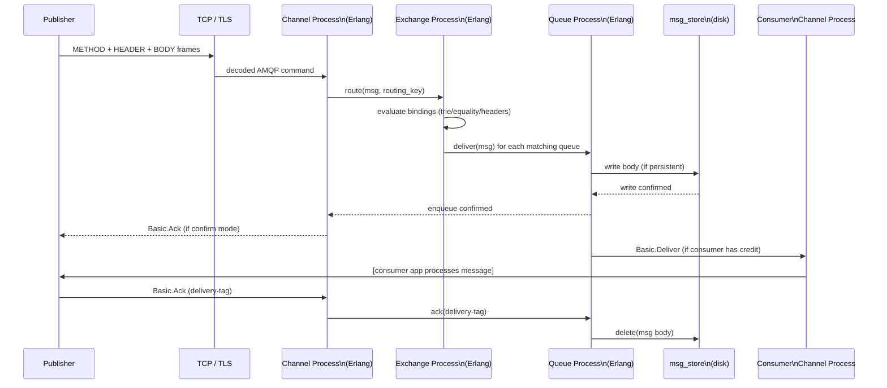

---

## 14. Memory Architecture: Flow Control and Paging

RabbitMQ implements a **credit-based flow control** system at the Erlang process level:

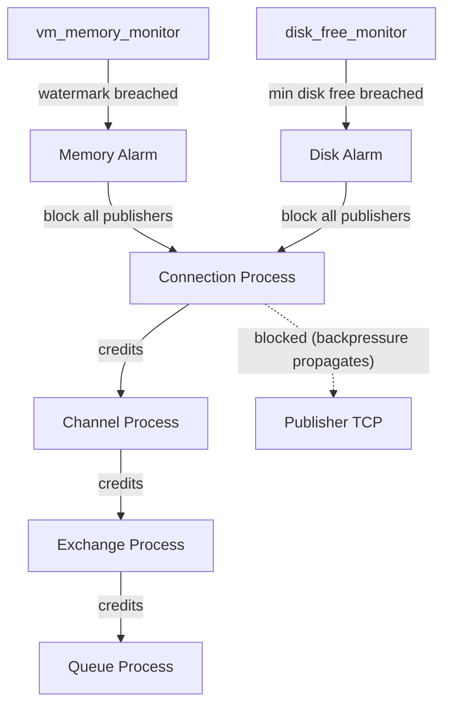

When memory usage crosses `vm_memory_high_watermark` (default 40% of RAM):
1. Memory alarm fires
2. All connection processes receive a `{block, [flow]}` signal
3. Connection processes stop reading from their TCP sockets
4. TCP buffers fill up → publisher's OS write buffer stalls → publisher app blocks on `send()`

This **end-to-end backpressure** propagates from queue → channel → connection → TCP → publisher without any application-level coordination.

### Paging Mechanism

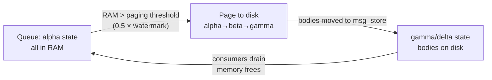

---

## 15. AMQP Classes and Method Hierarchy

```mermaid
block-beta
    columns 2
    A["Connection class\n─────────────────\nStart / StartOk\nTune / TuneOk\nOpen / OpenOk\nClose / CloseOk\nBlocked / Unblocked"] B["Channel class\n─────────────────\nOpen / OpenOk\nFlow / FlowOk\nClose / CloseOk"]
    C["Exchange class\n─────────────────\nDeclare / DeclareOk\nDelete / DeleteOk\nBind / BindOk\nUnbind / UnbindOk"] D["Queue class\n─────────────────\nDeclare / DeclareOk\nBind / BindOk\nUnbind / UnbindOk\nPurge / PurgeOk\nDelete / DeleteOk"]
    E["Basic class\n─────────────────\nPublish\nDeliver\nGet / GetOk / GetEmpty\nAck / Nack / Reject\nQos / QosOk\nConsume / ConsumeOk\nCancel / CancelOk"] F["Tx class\n─────────────────\nSelect / SelectOk\nCommit / CommitOk\nRollback / RollbackOk"]
    G["Confirm class (RabbitMQ ext)\n─────────────────\nSelect / SelectOk"] H[""]
```

Each **class** groups related methods. The class ID and method ID together form the 4-byte command identifier at the start of every METHOD frame's payload — allowing the broker to dispatch to the correct handler via a lookup table.

---

## 16. Virtual Hosts: Namespace and Permission Isolation

```mermaid
flowchart TB
    BROKER[RabbitMQ Broker] --> VH1[Virtual Host: /production]
    BROKER --> VH2[Virtual Host: /staging]
    BROKER --> VH3[Virtual Host: /analytics]

    VH1 --> E1[Exchanges\n(isolated namespace)]
    VH1 --> Q1[Queues\n(isolated namespace)]
    VH1 --> B1[Bindings]

    VH2 --> E2[Exchanges]
    VH2 --> Q2[Queues]
    VH2 --> B2[Bindings]

    U1[User: app-user] -->|"configure: '.*'\nwrite: 'events.*'\nread: '.*'"| VH1
    U1 -->|"no access"| VH2
```

Access control uses **regex pattern matching** on three permission categories:
- `configure`: create/delete exchanges and queues
- `write`: publish to exchanges
- `read`: consume from queues, get messages

---

## 17. Shovel vs Federation: Point-to-Point vs Transparent Relay

```mermaid
flowchart LR
    subgraph Shovel["Shovel (point-to-point)"]
        SRC[Source Queue\nBroker A] -->|consume| SHOVEL[Shovel Plugin]
        SHOVEL -->|publish| DST[Destination Exchange\nBroker B]
        note1["Explicit source+destination\nMessage consumed and re-published\nRouting key can be rewritten\nNo consumer transparency"]
    end

    subgraph Federation["Federation (transparent)"]
        UP[Upstream Exchange\nBroker A] -->|federate| DOWN[Downstream Exchange\nBroker B]
        note2["Exchange-level transparency\nPublisher only knows local exchange\nFederation link auto-reconnects\nDownstream has 'same' exchange name"]
    end
```

**Shovel**: explicit source queue → destination exchange mapping. Used for migrations, one-time data moves, or when exact queue control is needed.

**Federation**: transparent exchange-level relay. Publishers on either side publish to their local exchange — federation handles propagation. Used for cross-datacenter HA and geo-distribution.

---

## 18. Consistent-Hashing Exchange: Sharded Consumer Scaling

When a single queue's consumer throughput is saturated, the **consistent-hashing exchange** (plugin) distributes messages across N queues using a consistent hash of the routing key:

```mermaid
flowchart TD
    P[Publisher] -->|routing_key = "order-12345"| CHX[Consistent-Hash\nExchange]
    CHX -->|hash('order-12345') → shard 2| QA["Queue A\n(weight=1)"]
    CHX -->|hash ring| QB["Queue B\n(weight=2)"]
    CHX -->|hash ring| QC["Queue C\n(weight=1)"]
    QA --> CA[Consumer A]
    QB --> CB[Consumer B]
    QC --> CC[Consumer C]
    note["Weight determines proportion of hash ring\nassigned to each queue\nSame routing_key → always same queue\n(stickiness guarantee)"]
```

Queues bind with an **integer weight** (not a routing key string). The weight determines the proportion of the hash ring assigned to each queue. Consistent hashing guarantees that the same `routing_key` always routes to the same queue — essential when ordering within a logical stream must be preserved.

---

## 19. Erlang OTP Supervision Trees: Fault Tolerance Architecture

RabbitMQ's process architecture follows OTP supervisor trees — the foundation of its fault-tolerance:

```mermaid
flowchart TB
    ROOT[rabbit_sup\nroot supervisor] --> CONN_SUP[rabbit_connection_sup]
    ROOT --> QUEUE_SUP[rabbit_amqqueue_sup]
    ROOT --> EXCH_SUP[rabbit_exchange_sup]
    ROOT --> VHOST_SUP[rabbit_vhost_sup]

    CONN_SUP --> CONN1[connection_1\nErlang process]
    CONN_SUP --> CONN2[connection_2\nErlang process]
    CONN1 --> CHAN1[channel_1 process]
    CONN1 --> CHAN2[channel_2 process]

    QUEUE_SUP --> Q1P[queue_proc for queue_A]
    QUEUE_SUP --> Q2P[queue_proc for queue_B]

    style ROOT fill:#66f,color:#fff
    style CONN_SUP fill:#6af,color:#fff
    style QUEUE_SUP fill:#6af,color:#fff
```

If a channel process crashes (e.g., due to a malformed message or unhandled exception), the supervisor restarts only that process. The connection, other channels, and all queues remain unaffected. This OTP supervision structure is why RabbitMQ achieves the "nine nines" reliability characteristic of Erlang/OTP systems.

---

## 20. Summary: Internal Data Flow at a Glance

```mermaid
flowchart LR
    PUB[Publisher] -->|AMQP frames over TCP| CONN_PROC[Connection\nProcess]
    CONN_PROC -->|credit flow| CHAN_PROC[Channel\nProcess]
    CHAN_PROC -->|route| EXCH_PROC[Exchange\nProcess]
    EXCH_PROC -->|binding match| Q_PROC[Queue\nProcess]
    Q_PROC -->|persistent write| MSG_STORE[msg_store\ndisk files]
    Q_PROC -->|deliver with credit| CONS_CHAN[Consumer\nChannel]
    CONS_CHAN -->|AMQP frames| CONS_CONN[Consumer\nConnection]
    CONS_CONN -->|TCP| CONSUMER[Consumer App]
    CONSUMER -->|Basic.Ack| CONS_CHAN
    CONS_CHAN -->|ack| Q_PROC
    Q_PROC -->|delete confirmed msg| MSG_STORE

    Q_PROC <-->|GM multicast| MIRROR[Mirror\nQueue Processes]
    Q_PROC <-->|Erlang IPC| REMOTE_Q[Remote Node\nQueue Proxy]
```

**Key architectural invariants:**
1. Every AMQP command is an Erlang process message — no shared memory, only message passing
2. Queues are single-threaded Erlang processes — serialized access without locks
3. Persistence is synchronous for durable messages — disk write precedes ack
4. Credit-flow propagates backpressure from disk → queue → channel → connection → TCP
5. Clustering uses Erlang distribution natively — no custom cluster protocol needed
6. HA mirrors/quorum queues maintain identical state via GM/Raft — tolerate node failures without data loss
