# C++ Programming Language — Under the Hood
> Source: *The C++ Programming Language*, 3rd Edition — Bjarne Stroustrup (AT&T Labs)

## Overview

C++ is not simply "C with classes." It is a multi-paradigm language whose runtime behavior emerges from a carefully designed set of memory layouts, virtual dispatch mechanisms, template instantiation engines, and exception propagation protocols. This document maps the internal machinery: how objects occupy memory, how virtual calls route through vtables, how templates generate code at compile time, and how exceptions unwind the call stack.

---

## 1. Object Memory Layout

### 1.1 Plain Object Layout

A C++ object's memory is a contiguous block determined at compile time. Member variables are laid out in declaration order, subject to alignment padding.

```
struct Foo {
    char  a;    // offset 0, size 1
    // 3 bytes padding
    int   b;    // offset 4, size 4
    double c;   // offset 8, size 8
};              // total: 16 bytes
```

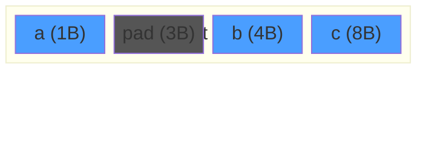

### 1.2 Class with Virtual Functions — vptr Injection

When a class declares any `virtual` function, the compiler injects a hidden pointer (`vptr`) into every instance, pointing to the class's virtual function table (`vtable`).

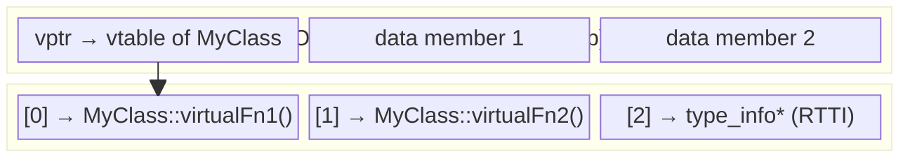

**Key mechanics:**
- `vptr` is set by the constructor, pointing to the class's own vtable
- If a derived class overrides a virtual function, the derived vtable replaces the slot
- A virtual call `obj->fn()` compiles to: `*(obj->vptr[N])(obj)` — load vptr, index into table, indirect call

### 1.3 Virtual Dispatch — Call Path

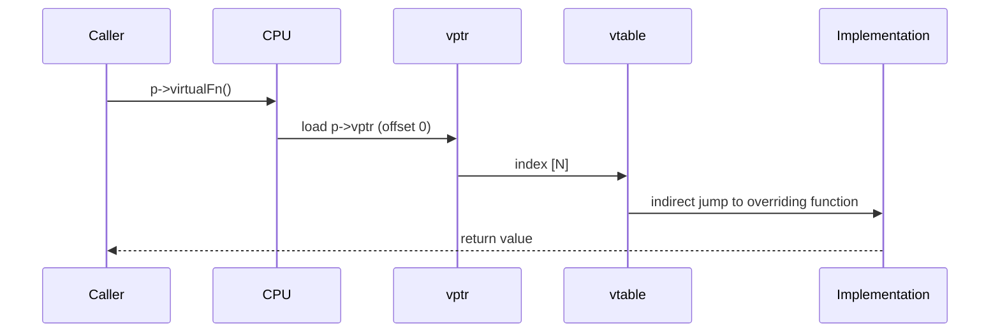

**Cost**: 1 memory load (vptr) + 1 memory load (vtable slot) + 1 indirect call. This is why `virtual` cannot be inlined by the compiler in the general case.

---

## 2. Inheritance and Memory Layout

### 2.1 Single Inheritance

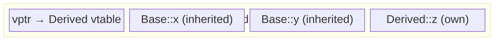

The base subobject sits at offset 0. `static_cast<Base*>(derived_ptr)` is a no-op (same address).

### 2.2 Multiple Inheritance — Pointer Adjustment

When a class inherits from multiple bases, the second base subobject starts at a non-zero offset. Casting to the second base requires **pointer adjustment**.

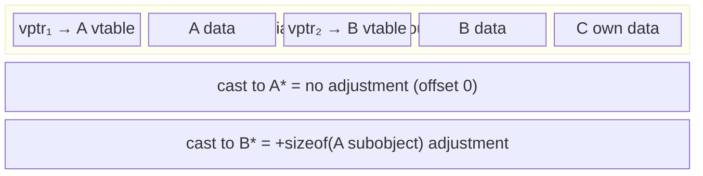

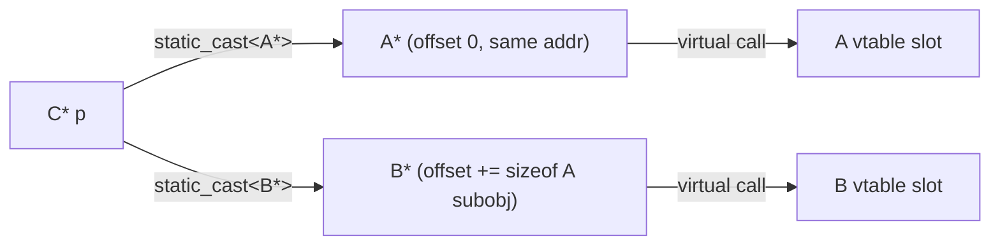

### 2.3 Virtual Inheritance — Shared Base

Virtual inheritance (`virtual public Base`) introduces an indirection so only one `Base` subobject exists regardless of how many paths lead to it.

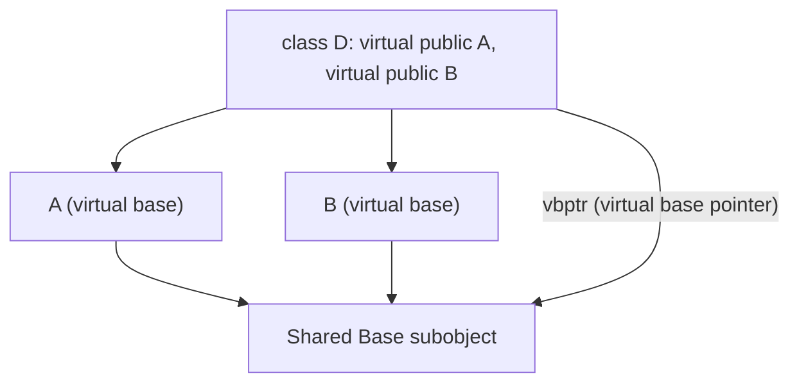

The compiler adds a `vbptr` (virtual base table pointer) to locate the shared base at runtime.

---

## 3. Templates — Compile-Time Code Generation

### 3.1 Template Instantiation Pipeline

Templates are not compiled until instantiated. The compiler generates a fresh, fully typed copy of the template body for each unique parameter combination.

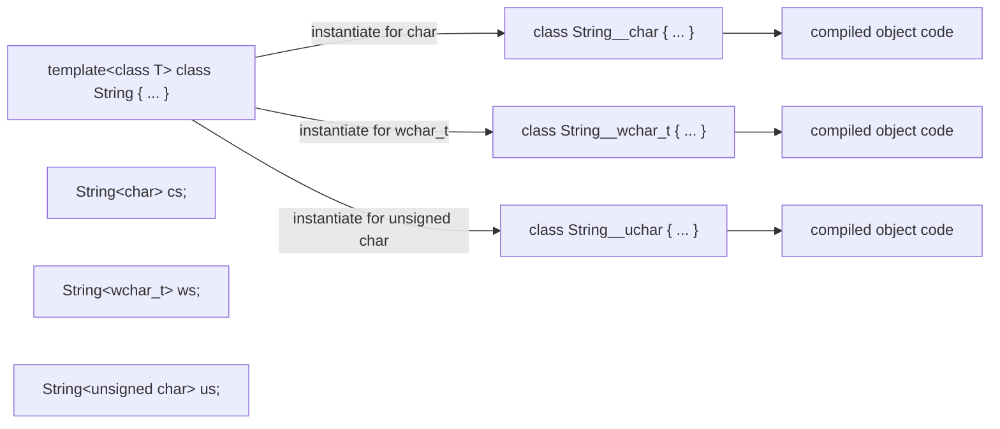

**Stroustrup's design intent**: "A class generated from a class template is a perfectly ordinary class. Thus, use of a template does not imply any run-time mechanisms beyond what is used for an equivalent 'hand-written' class."

### 3.2 Function Template Deduction and Specialization

```mermaid
flowchart TD
    call["sort(vec)"]
    deduct["Compiler deduces T = int from argument type"]
    check["Specialization for T=int* ? → Check"]
    gen["Instantiate sort&lt;int&gt; if no specialization"]
    special["Use sort&lt;int*&gt; specialization if exists"]

    call --> deduct --> check
    check -->|"no"| gen
    check -->|"yes"| special
```

### 3.3 Template vs. Virtual — Polymorphism Choice

| Axis | Templates (compile-time) | Virtual (runtime) |
|------|--------------------------|-------------------|
| Type resolution | At compile time | At runtime via vtable |
| Inlining | Yes (full visibility) | No (indirect call) |
| Code size | Can bloat (one copy per type) | Shared implementation |
| Requires inheritance | No | Yes (hierarchy) |
| Dynamic dispatch | No | Yes |

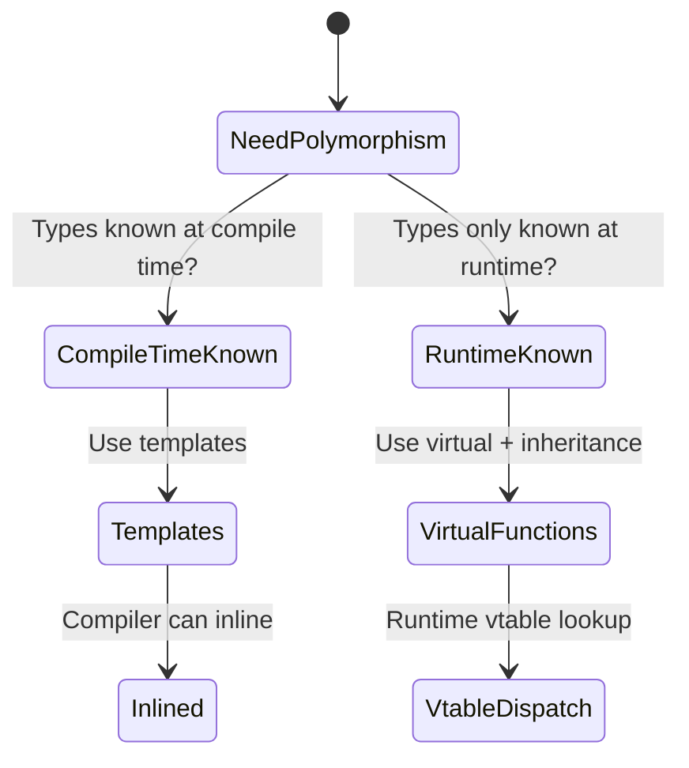

---

## 4. Exception Handling — Stack Unwinding Engine

### 4.1 Exception Flow

When `throw` executes, the C++ runtime performs **stack unwinding**: it walks up the call stack, calling destructors for all objects with automatic storage duration, until it finds a matching `catch` handler.

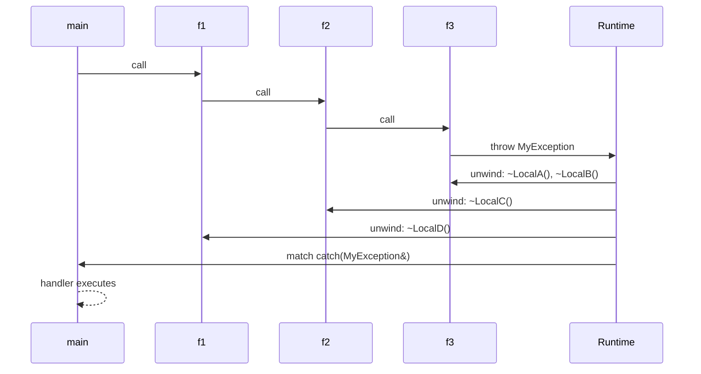

### 4.2 RTTI — type_info and dynamic_cast

Every polymorphic class (one with at least one virtual function) has a `type_info` object stored as part of its vtable layout. `dynamic_cast<T*>(p)` uses this at runtime.

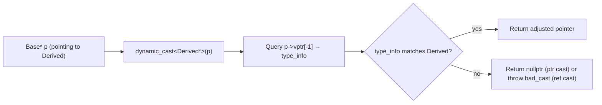

### 4.3 Exception Table (EH Tables)

Modern C++ compilers (with zero-cost exceptions) generate static exception handler tables alongside the code. No runtime overhead exists on the non-throwing path.


---

## 5. Memory Management — new/delete Internals

### 5.1 `new` Expression Decomposition

`new Foo(args)` is not atomic — the compiler decomposes it:

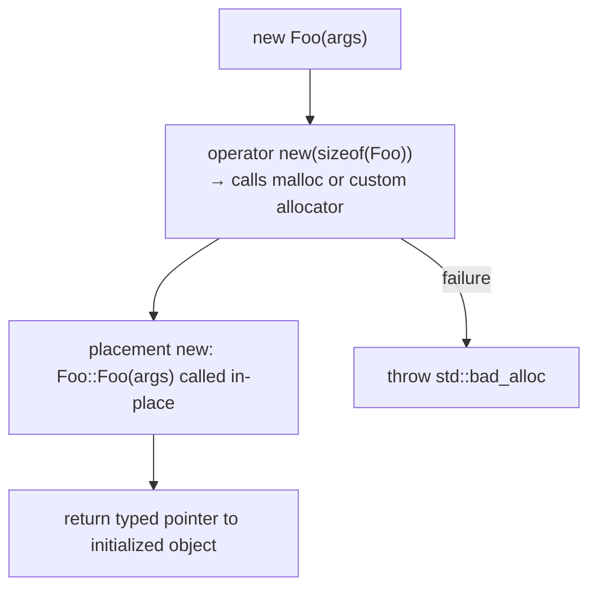

### 5.2 `delete` Decomposition

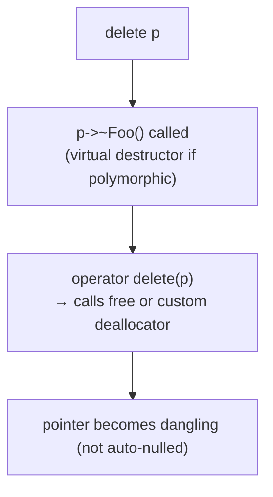

**Critical**: The destructor must be `virtual` if you intend to `delete` through a base pointer. Without `virtual ~Base()`, only `Base::~Base()` runs — derived data leaks.

### 5.3 Reference Counting (Srep Pattern)

Stroustrup's `String` uses a shared `Srep` struct with a reference count to implement copy-on-write:

```mermaid
stateDiagram-v2
    [*] --> Allocated: new Srep(sz, p)
    Allocated --> Shared: String s2 = s1 (copy ctor: Srep::n++)
    Shared --> Shared: Another copy (n++)
    Shared --> CopyOnWrite: mutation needed (get_own_copy)
    CopyOnWrite --> Allocated: n>1: n--, allocate new Srep
    Shared --> Freed: n-- reaches 0 → delete Srep
    Allocated --> Freed: last String destroyed
```

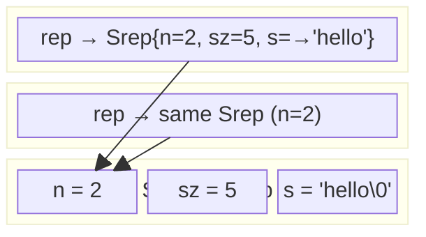

---

## 6. Namespaces and Linkage

### 6.1 Name Mangling

C++ functions are mangled to encode their full signature, enabling overloading. The linker sees mangled names, not source names.

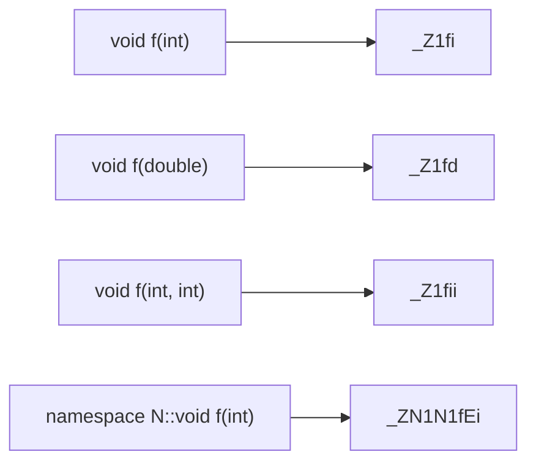

### 6.2 Include Guard — Compilation Unit Isolation

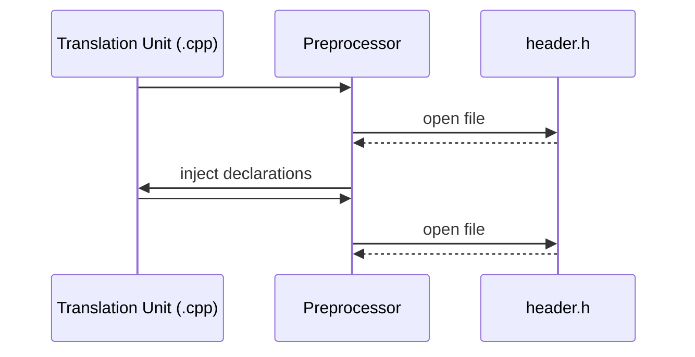

---

## 7. Standard Library Internals

### 7.1 `std::vector` — Amortized Growth

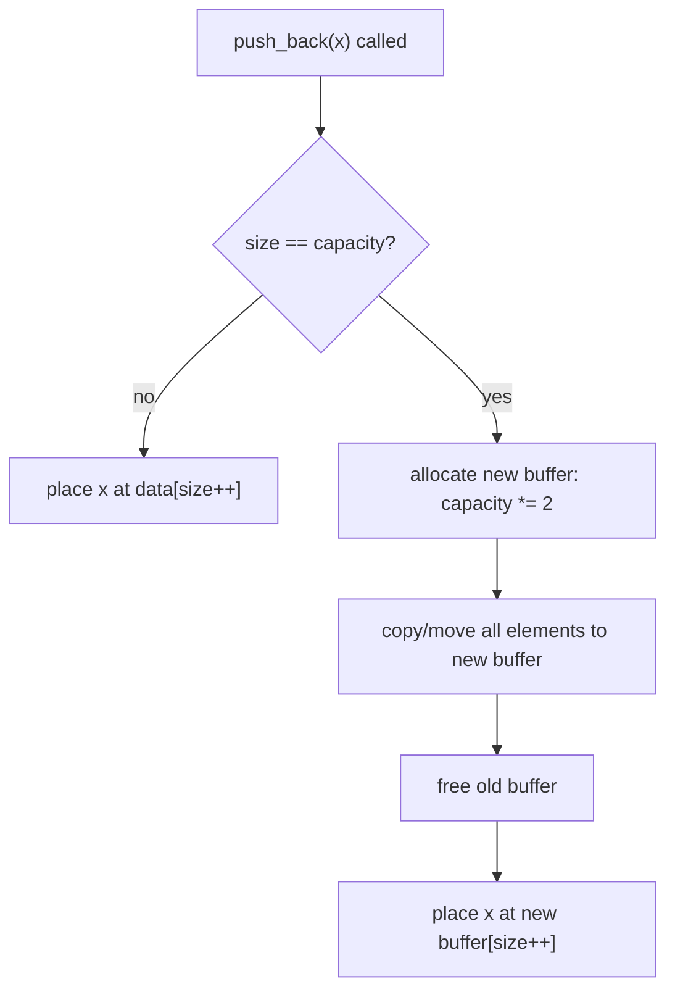

**Amortized cost**: O(1) per push_back. The doubling strategy ensures total reallocation work ≤ 2N for N insertions.

### 7.2 Iterator Architecture

Iterators form an abstraction layer between algorithms and containers. They're value types (not polymorphic), so the compiler can inline all operations.

```mermaid
flowchart LR
    algo["std::sort(v.begin(), v.end())"]
    begin["vector::iterator begin() = &data[0]"]
    end["vector::iterator end() = &data[size]"]
    deref["operator*() → *ptr"]
    inc["operator++() → ++ptr"]
    cmp["operator!=() → ptr != other.ptr"]

    algo --> begin
    algo --> end
    begin --> deref
    begin --> inc
    begin --> cmp
```

### 7.3 `std::map` — Red-Black Tree Internal Layout

```mermaid
graph TD
    root["root node (key=50)"]
    l1["key=25"]
    r1["key=75"]
    l2["key=12"]
    l3["key=37"]
    r2["key=62"]
    r3["key=87"]

    root --> l1
    root --> r1
    l1 --> l2
    l1 --> l3
    r1 --> r2
    r1 --> r3

    style root fill:#cc0000,color:#fff
    style l1 fill:#cc0000,color:#fff
    style r1 fill:#000,color:#fff
    style l2 fill:#000,color:#fff
    style l3 fill:#cc0000,color:#fff
    style r2 fill:#cc0000,color:#fff
    style r3 fill:#000,color:#fff
```

Each `map::find()` traverses O(log N) nodes. Each node heap-allocates `{color, left*, right*, parent*, key, value}`.

---

## 8. Operator Overloading — Internal Call Resolution

### 8.1 Smart Pointer `operator->`

The overloaded `->` must return a raw pointer or another object with `->` defined. The compiler chains calls automatically.

```mermaid
sequenceDiagram
    participant Code
    participant SmartPtr
    participant RawPtr
    participant Object

    Code->>SmartPtr: p->member
    SmartPtr->>SmartPtr: operator->() called
    SmartPtr-->>RawPtr: returns raw T*
    RawPtr->>Object: .member accessed (compiler applies second ->)
```

### 8.2 Prefix vs. Postfix `++`

```mermaid
flowchart LR
    prefix["++p → operator++()"]
    postfix["p++ → operator++(int)"]

    prefix --> pp["increment, return *this (reference)"]
    postfix --> copy["save copy = *this"]
    postfix --> inc2["increment *this"]
    postfix --> ret["return copy (by value)"]
```

The `int` dummy argument in `operator++(int)` distinguishes postfix from prefix at the type system level. The postfix version is inherently more expensive: it must copy the object before incrementing.

---

## 9. Compile-Time vs. Runtime Polymorphism — Decision Flow

```mermaid
flowchart TD
    start["Need to work with multiple types?"]
    known["Types fully known at compile time?"]
    inlining["Performance critical / inlining needed?"]
    hierarchy["Natural type hierarchy?"]

    start --> known
    known -->|yes| inlining
    known -->|no| hierarchy
    inlining -->|yes| templates["Use templates (compile-time polymorphism)"]
    inlining -->|no| either["Either works — choose for clarity"]
    hierarchy -->|yes| virtual["Use virtual functions (runtime polymorphism)"]
    hierarchy -->|no| templates2["Use templates or function overloading"]
```

---

## 10. Data Flow Summary — Object Lifetime

```mermaid
stateDiagram-v2
    [*] --> Uninitialized: memory allocated (stack frame / malloc)
    Uninitialized --> Constructed: constructor runs\nvptr set, members initialized
    Constructed --> InUse: object used, methods called
    InUse --> Copying: copy ctor or copy assignment\n(Srep refcount++ for COW types)
    Copying --> InUse: copy complete
    InUse --> Destructing: out of scope / delete called
    Destructing --> Destroyed: dtor runs\nmembers destroyed in reverse order\nbase dtor called last
    Destroyed --> [*]: memory returned to allocator
```

---

## Key Invariants

| Mechanism | Where it lives | When resolved |
|-----------|---------------|---------------|
| vptr | Object instance (offset 0) | Constructor execution |
| vtable | Read-only data segment, per-class | Compile/link time |
| type_info | vtable[-1] slot | Compile/link time |
| Template code | Instantiated in each TU | Compile time |
| Exception tables | Read-only section alongside code | Link time |
| Mangled names | Symbol table | Link time |
| Reference count | Heap-allocated rep object | Runtime |

C++'s power comes from the combination: zero-overhead abstractions at compile time (templates, inlining, static dispatch) layered with opt-in runtime mechanisms (virtual, RTTI, exceptions) that impose cost only when explicitly invoked.
