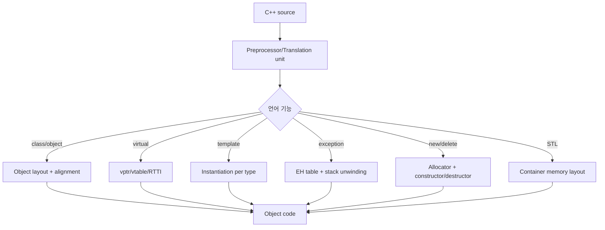
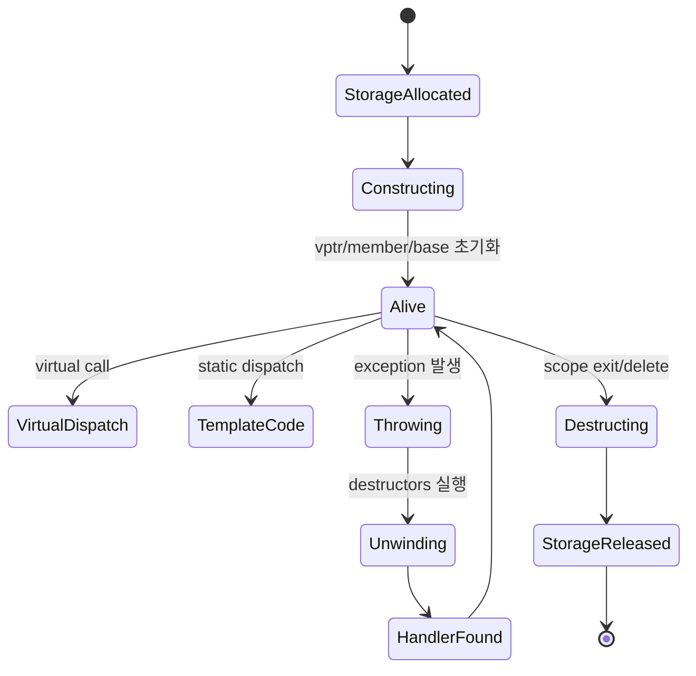

# C++ Internals 학습 및 기록 노트

## 1. 왜 필요한가? (Pain Point & Motivation)

C++는 "C with classes"가 아니라 compile-time abstraction과 opt-in runtime mechanism을 결합한 언어다. Object layout, vptr/vtable, template instantiation, exception unwinding, `new`/`delete`, name mangling, standard library container layout을 모르면 성능 비용과 undefined behavior 위험을 설명하기 어렵다.

이 문서는 Stroustrup의 *The C++ Programming Language* 기반 원문을 C++ object lifetime과 dispatch data flow 중심으로 재작성한다.

## 2. 현재 나의 상태 (Baseline)

- Class, inheritance, template, exception, STL 사용법은 알고 있다.
- Virtual call이 실제로 vptr load, vtable slot lookup, indirect call로 실행되는 과정을 더 명확히 해야 한다.
- Multiple inheritance와 virtual inheritance가 pointer adjustment와 base subobject layout을 바꾸는 이유를 정리해야 한다.
- Template이 runtime polymorphism이 아니라 compile-time code generation임을 비용 모델로 설명해야 한다.
- Exception과 RAII destructor가 stack unwinding에서 어떻게 연결되는지 이해해야 한다.

## 3. 도달하고 싶은 목표 (Target State)

- Plain object와 polymorphic object의 memory layout 차이를 설명한다.
- Virtual dispatch, RTTI, `dynamic_cast`가 어떤 metadata를 사용하는지 이해한다.
- Template instantiation과 virtual dispatch의 trade-off를 구분한다.
- `new`/`delete`, constructor/destructor, exception unwinding의 object lifetime 흐름을 추적한다.
- `std::vector`, iterator, `std::map` 같은 STL 구조의 비용을 내부 상태로 판단한다.

## 4. 시스템 번역 (Data Flow)



C++ 실행 비용은 source syntax가 object memory, generated template code, indirect dispatch, lifetime cleanup으로 어떻게 낮아지는지에서 결정된다.

## 5. 핵심 구성요소 (Building Blocks)

| 구성요소 | 역할 | 핵심 상태 |
| --- | --- | --- |
| Object layout | member 배치와 padding 결정 | offset, alignment, size |
| vptr | instance에서 vtable을 가리키는 숨은 pointer | constructor에서 설정 |
| vtable | virtual function slot table | function pointer, RTTI pointer |
| Base subobject | inheritance layout 단위 | offset, pointer adjustment |
| Template instantiation | type별 code generation | specialization, code bloat |
| Exception table | zero-cost exception metadata | PC range, cleanup, handler |
| `operator new/delete` | raw memory allocation/free | allocation size, deallocation function |
| Destructor | lifetime cleanup | reverse member destruction, virtual dtor |
| Name mangling | overload/linkage symbol encoding | namespace, parameter type |
| STL iterator/container | generic algorithm과 storage 연결 | pointer, node, capacity |

## 6. 상태 전이 (State Transition)



Object lifetime은 memory allocation과 constructor 실행이 분리되고, destructor와 deallocation도 분리된다. Exception은 stack unwinding 중 자동 객체 destructor를 호출해 RAII cleanup을 보장한다.

## 7. 불변식 (Invariant: 절대 깨지면 안 되는 규칙)

- Object member offset과 alignment는 ABI와 compiler가 정한 layout contract를 따라야 한다.
- Polymorphic object는 constructor/destructor 단계에서 vptr이 현재 class 단계에 맞게 설정된다.
- Base pointer로 delete할 가능성이 있으면 base destructor는 virtual이어야 한다.
- Multiple inheritance cast는 필요한 pointer adjustment를 반영해야 한다.
- Template은 type별로 instantiate되므로 inlining 이점과 code size 증가를 함께 고려해야 한다.
- Exception unwinding은 이미 생성된 automatic object의 destructor를 역순으로 호출해야 한다.
- `delete` 이후 pointer는 자동으로 null이 되지 않으며 dangling pointer가 된다.
- STL iterator는 container mutation 후 invalidation 규칙을 지켜야 한다.

## 8. 가장 작은 예제 (Minimal Viable Example)

```cpp
struct Base {
    virtual ~Base() = default;
    virtual void run() = 0;
};

struct Job : Base {
    void run() override {}
};

Base* p = new Job();
p->run();
delete p;
```

```text
개념 흐름:
1. operator new가 Job 크기만큼 raw storage를 할당
2. Job constructor가 Base/Job subobject와 vptr을 초기화
3. p->run()은 vptr -> vtable slot -> Job::run indirect call
4. delete p는 virtual destructor를 통해 Job::~Job 후 Base::~Base를 호출
5. operator delete가 storage를 반환
```

이 예제는 C++의 virtual dispatch와 object lifetime cleanup이 vtable contract와 virtual destructor에 의존한다는 점을 보여준다.

## 9. 실패 사례 (What could go wrong?)

- Virtual destructor가 없는 base pointer로 derived object를 delete해 derived cleanup이 누락된다.
- Object slicing으로 derived state가 사라진 base object만 복사된다.
- Multiple inheritance pointer adjustment를 무시한 unsafe cast로 잘못된 subobject를 가리킨다.
- Template을 무분별하게 instantiate해 binary size가 커지고 compile time이 늘어난다.
- Exception 중 destructor가 또 throw해 `std::terminate`로 이어진다.
- `std::vector` reallocation 후 기존 pointer/iterator/reference를 계속 사용한다.
- `delete` 이후 dangling pointer를 재사용해 use-after-free가 발생한다.

## 10. 뇌 확장하기 (Evolution & Variants)

- ABI는 Itanium C++ ABI, MSVC ABI처럼 compiler/platform별 vtable과 name mangling 차이를 비교한다.
- Template은 concepts, SFINAE, constexpr, CRTP, expression template으로 확장해 본다.
- Runtime polymorphism은 virtual, type erasure, `std::variant`, `std::function`을 비용 기준으로 비교한다.
- Memory management는 RAII, smart pointer, custom allocator, arena allocator, move semantics와 연결한다.
- Concurrency는 C++ memory model, atomic ordering, data race undefined behavior까지 확장한다.

## 11. 최종 체크리스트 (Definition of Done)

- [x] Object layout, vptr/vtable, inheritance, template, exception, `new/delete` 흐름을 정리했다.
- [x] Virtual dispatch와 virtual destructor를 최소 예제로 설명했다.
- [x] Compile-time polymorphism과 runtime polymorphism의 비용 차이를 포함했다.
- [x] Iterator invalidation, dangling pointer, object slicing 같은 실패 사례를 정리했다.
- [x] 원문 C++ internals 문서를 12개 섹션 템플릿으로 재작성했다.

## 12. 뇌에 새기는 복습 문장 (TL;DR Blank)

C++의 성능과 위험은 source code 아래의 object layout, vtable, generated template code, lifetime cleanup 규칙을 얼마나 정확히 지키는지에서 결정된다.
