# Linux Kernel Development — Under the Hood
> Based on *Linux Kernel Development, 3rd Edition* by Robert Love

## Historical and platform boundary

- The book describes an older Linux generation. Structure fields, sizes, scheduler policy, page-cache indexes, syscall entry, memory zones and block I/O paths vary by kernel version and architecture.
- Diagrams are teaching paths, not exact traces for every filesystem, cache state, security hook or device driver.
- Before using a symbol or field, record the kernel release, architecture, configuration and source commit, then confirm it in that tree.
- Runtime completion evidence combines tracepoints or BPF data, counters, return values and failure-path observations; a diagram alone is not proof.

This document maps representative Linux kernel mechanisms: tasks, scheduling, system calls, synchronization, memory and I/O. It preserves the cited book's conceptual value while marking version-specific structures as historical examples.

---

## 1. Process Model: task_struct and the Task List

Linux represents each task with `struct task_struct`, but its definition, size and related structures vary by release, architecture and configuration. The historical `~1.7 KB on 32-bit` figure is not a current invariant, and task state also references shared or external kernel objects rather than containing everything inline.

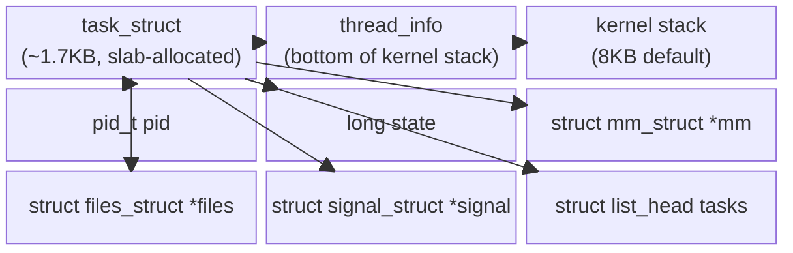

### task_struct Allocation: Slab Allocator + thread_info

Before kernel 2.6, `task_struct` lived at the **end of the kernel stack**. Now it's slab-allocated, and `struct thread_info` anchors to the stack bottom:

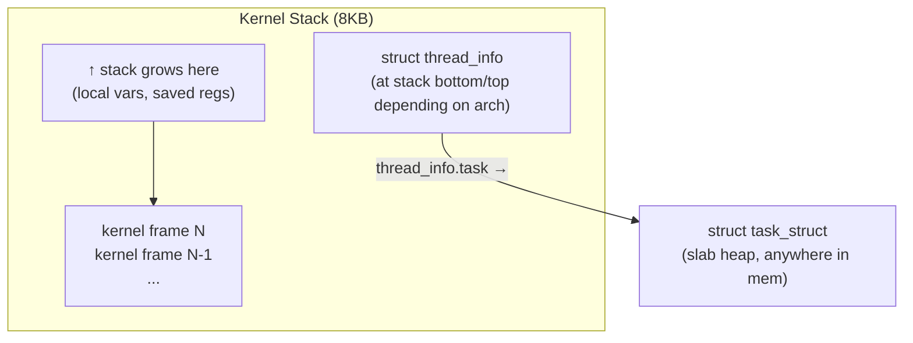

On **x86** (register-poor), `current` is computed by masking the stack pointer:
```
current_thread_info() = (stack_pointer & ~(8192-1))
current = current_thread_info()->task
```
Assembly: `movl $-8192, %eax ; andl %esp, %eax`

On **PowerPC** (register-rich), `current` is simply register `r2`.

### Process Lifecycle State Machine

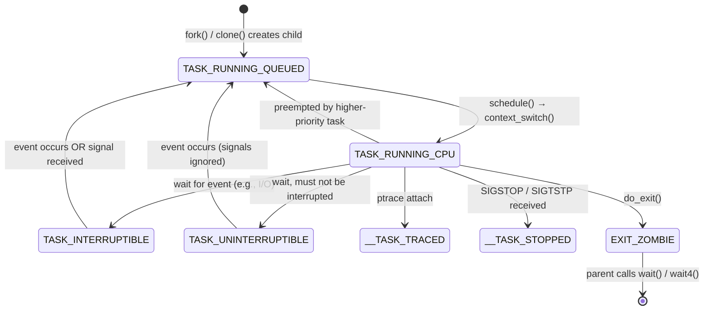

The `TASK_UNINTERRUPTIBLE` state is why you see processes in state `D` in `ps` that cannot be `SIGKILL`ed — they hold a semaphore waiting for a kernel event (typically I/O), and waking them prematurely would corrupt kernel state.

### fork() / clone() Internal Data Flow

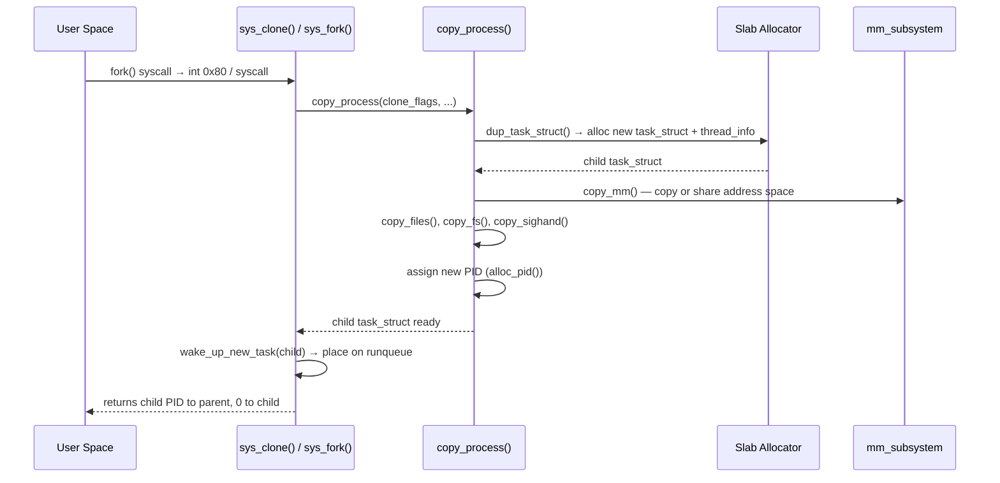

`fork()` uses **copy-on-write (COW)** — the child shares parent's page tables marked read-only. Only on first write does the kernel copy the actual page.

---

## 2. Process Scheduling: CFS and the Runqueue

Linux 2.6.23 introduced CFS in place of the earlier O(1) scheduler, using virtual-runtime ordering as a central model. Later kernels have changed fair-scheduling selection, including EEVDF-based behavior, so the red-black-tree explanation must be tied to the cited kernel era rather than treated as the current scheduler contract.

### CFS Data Structures

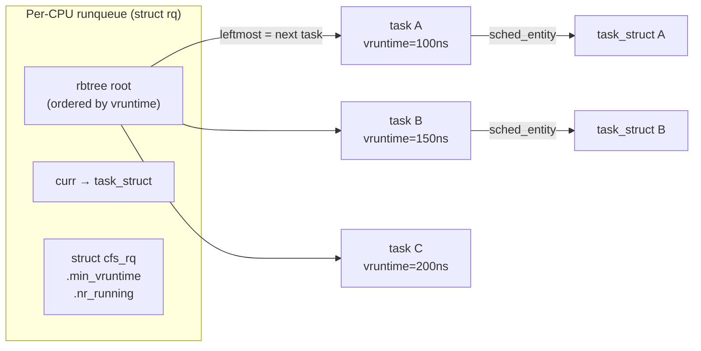

### vruntime Calculation

Every task gets a **time slice** proportional to its weight. `vruntime` accumulates at rate:
```
vruntime_delta = actual_runtime × (NICE_0_LOAD / task_weight)
```

Higher-priority tasks have higher `task_weight`, so their `vruntime` grows **slower** — they appear at the left of the rbtree and get selected more often.

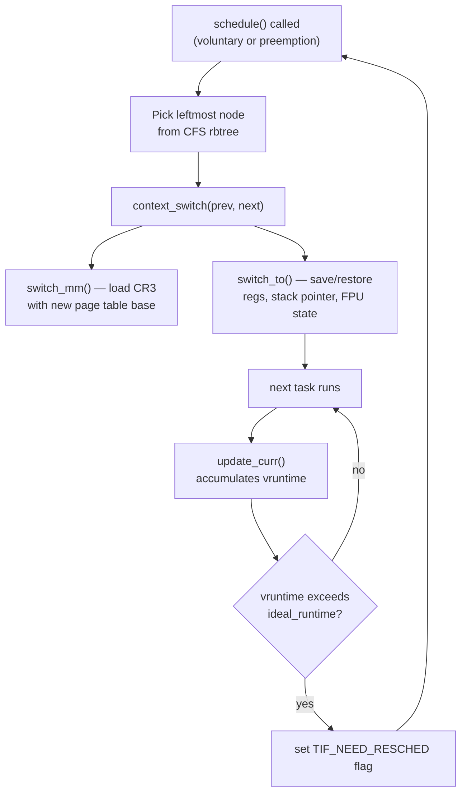

### Context Switch: What Actually Happens

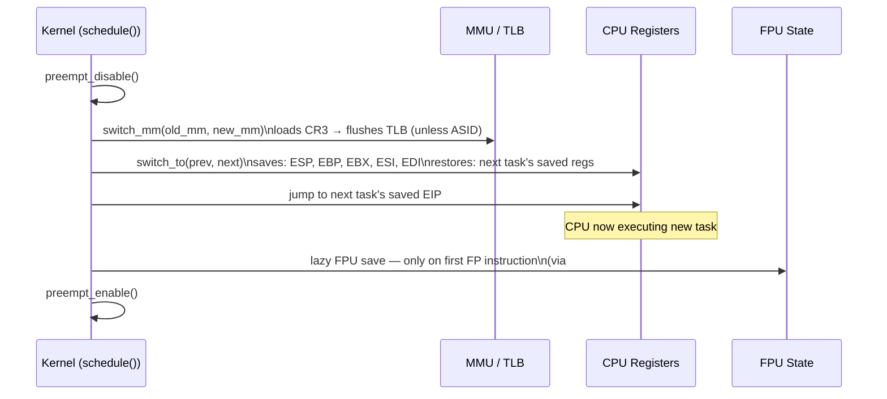

---

## 3. System Calls: The Privilege Boundary Crossing

System calls are the only legitimate way user-space crosses into kernel mode. On x86-64, the `syscall` instruction is used (replacing slower `int 0x80`).

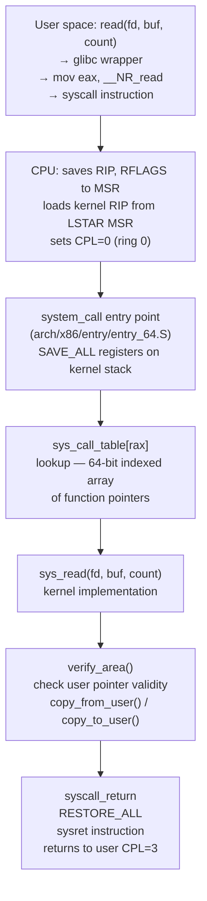

### Kernel Stack During a System Call

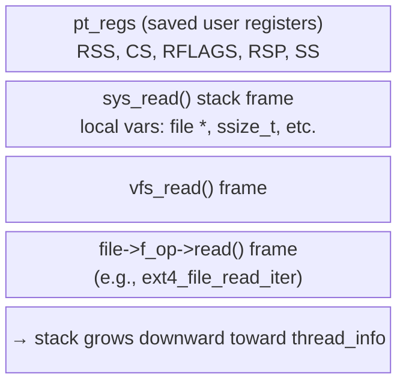

Each `task_struct` has exactly **one kernel stack** (8KB, or 4KB on CONFIG_4KSTACKS). With interrupt stacks enabled, IRQ handlers get their own per-CPU stack, preventing overflow.

---

## 4. Interrupts and Bottom Halves

Hardware interrupts must be handled in two phases: the **top half** (urgent, runs in IRQ context, can't sleep) and **bottom half** (deferred work, runs later in softer context).

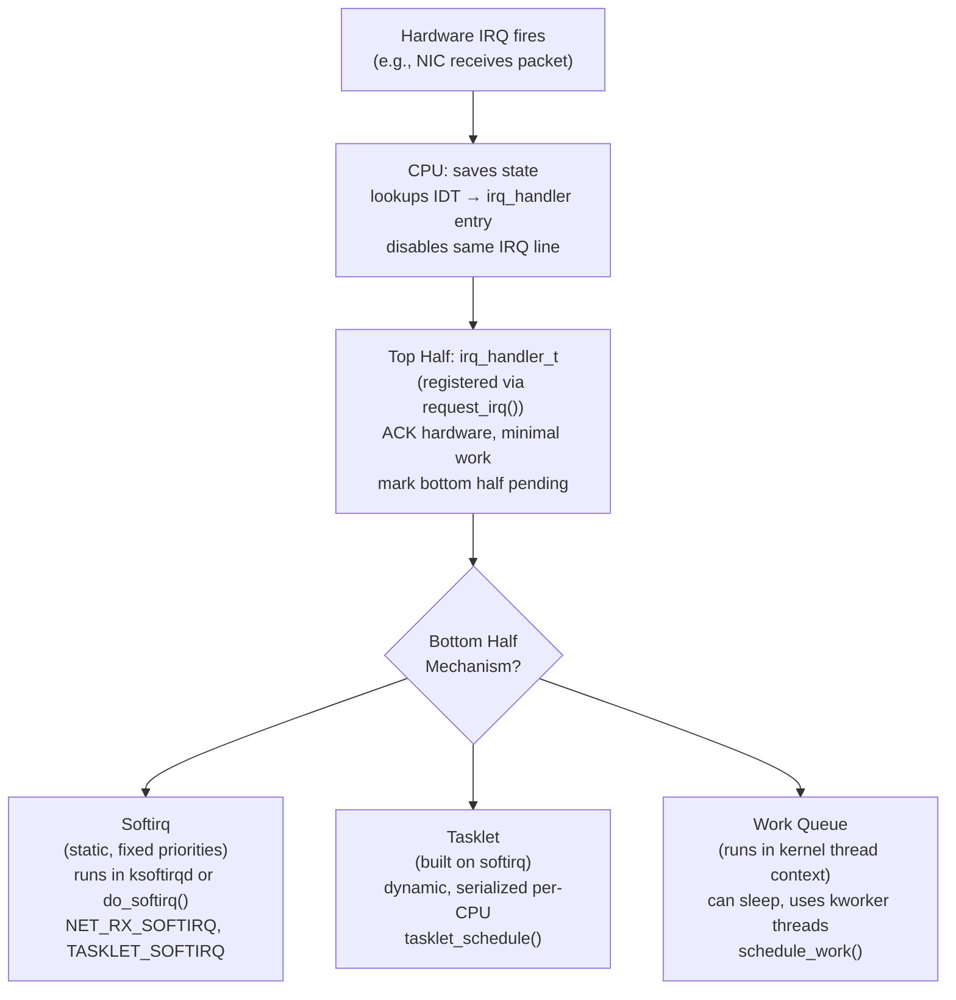

### Interrupt Context vs. Process Context

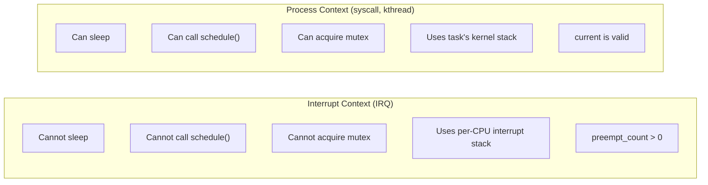

---

## 5. Kernel Synchronization

The kernel faces concurrent access from: multiple CPUs (SMP), kernel preemption, and interrupts. Three layers of primitives protect shared state.

### Atomic Operations

`atomic_t` wraps a volatile int. On x86, operations like `atomic_inc` compile to `lock addl $1, (%eax)` — the `LOCK` prefix makes the memory bus operation indivisible.

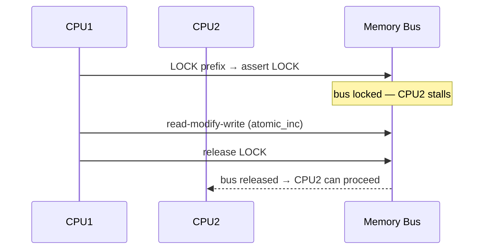

**Atomicity vs. Ordering distinction**: Atomic ops guarantee indivisibility but NOT ordering across CPUs. For ordering, memory barriers (`smp_mb()`, `smp_rmb()`, `smp_wmb()`) are needed — they compile to `mfence`/`lfence`/`sfence` on x86.

### Spinlocks

Used when the critical section is short and the lock holder will release quickly. On SMP, the non-holder busy-waits in a tight loop. On UP (uniprocessor), spinlocks compile to nothing (preemption disable only).

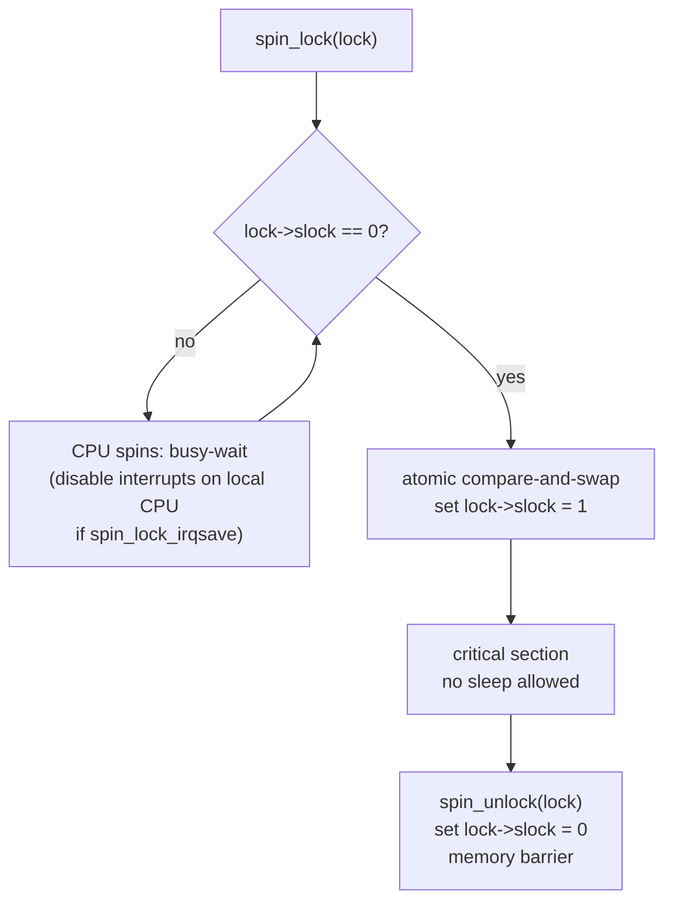

### Reader-Writer Spinlocks and Semaphores

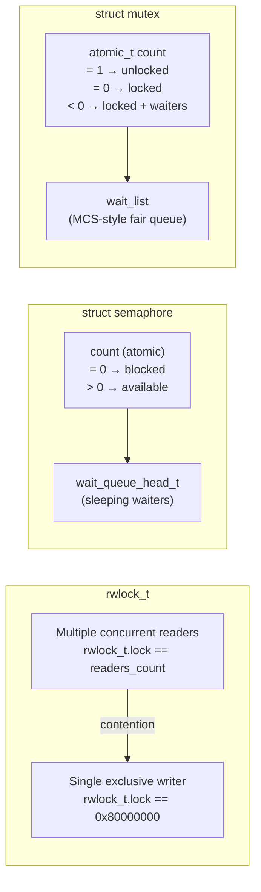

Key difference: **spinlocks** = busy-wait (never sleep, IRQ/atomic-safe); **semaphores/mutexes** = sleep (process context only, can be held across schedule()).

### RCU (Read-Copy-Update)

RCU is used for data that is read far more than written (e.g., routing tables, process credential structures):

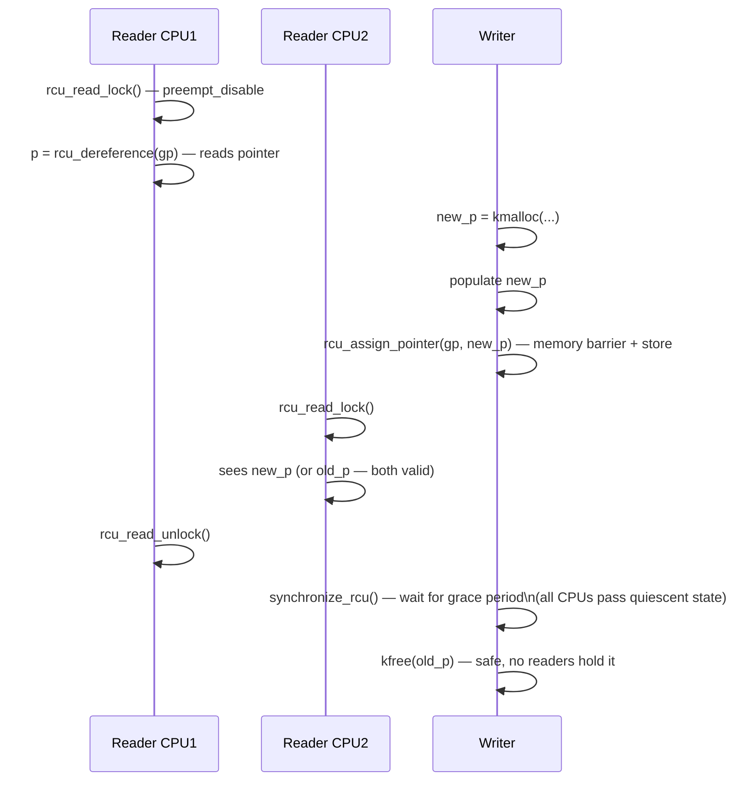

---

## 6. Memory Management: Zones, Pages, and the Allocator Hierarchy

Linux divides physical RAM into **zones** based on DMA constraints and high-memory architecture limits.

### Memory Zone Layout (x86 32-bit example)

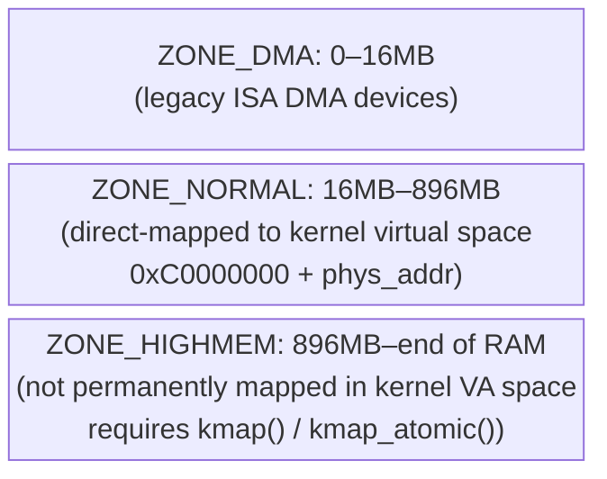

### Allocator Hierarchy

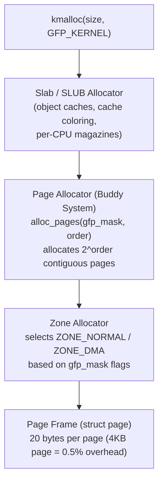

### Buddy Allocator Internal State

The buddy system tracks free pages in 11 free lists, for orders 0–10 (1, 2, 4, 8, ... 1024 pages):

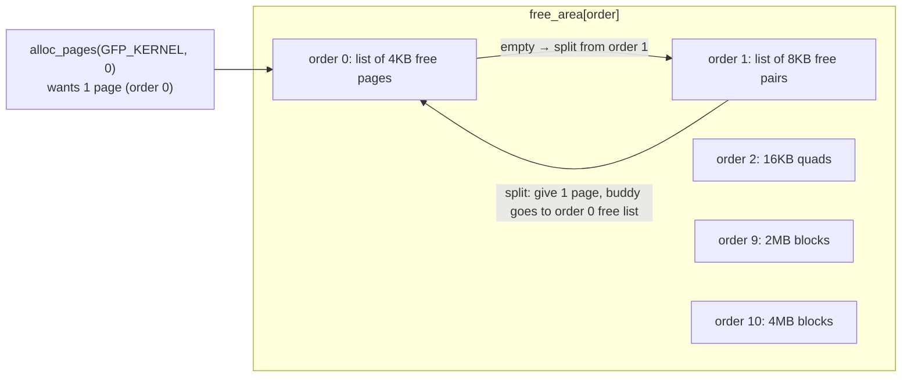

On **free**, if the freed page's **buddy** (adjacent same-size block) is also free, they are **coalesced** into a higher-order block — preventing fragmentation.

### Slab Allocator: Per-Type Object Caches

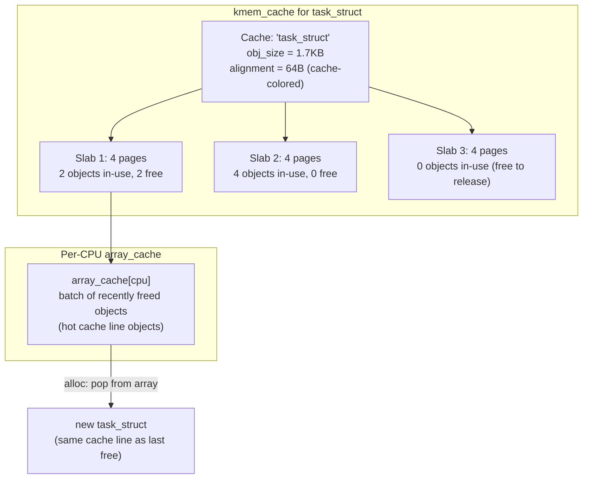

**Cache coloring**: slab start offsets are varied so that objects from different slabs land on different L1 cache sets — preventing cache line thrashing.

### High Memory Mapping

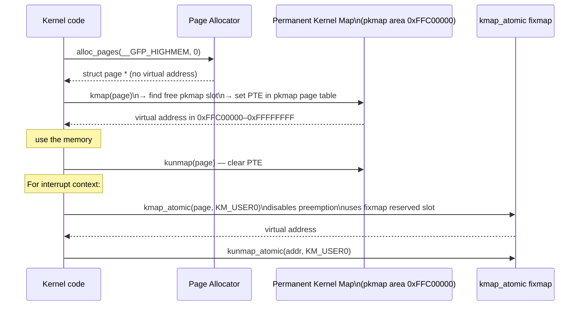

---

## 7. Virtual Filesystem (VFS): Abstraction Layer

VFS provides a uniform interface between system calls (`open`, `read`, `write`) and concrete filesystems (ext4, btrfs, tmpfs, NFS).

### VFS Object Hierarchy

```mermaid
flowchart TD
  SC["open(path, flags)\nread(fd, buf, n)"]
  SC --> FD["fd → struct file\n(per-open-file instance)\nf_pos, f_flags, f_op"]
  FD --> IN["struct inode\n(per filesystem object)\ni_ino, i_size, i_mode\ni_op, i_fop, i_mapping"]
  IN --> SB["struct super_block\n(per mounted filesystem)\ns_op, s_type, s_blocksize"]
  IN --> DE["struct dentry\n(path component cache)\nd_name, d_inode, d_parent\nd_op, d_subdirs"]
  DE --> DCA["dentry cache (dcache)\nhash table keyed by (parent, name)\nLRU eviction on memory pressure"]
```

### read() System Call — Full Data Path

```mermaid
sequenceDiagram
  participant U as User Buffer (ring 3)
  participant SC as sys_read()
  participant VFS as vfs_read()
  participant FOP as file->f_op->read_iter()
  participant PC as Page Cache (radix tree)
  participant BL as Block Layer
  participant DISK as Block Device

  U->>SC: syscall: read(fd, ubuf, count)
  SC->>SC: fget(fd) → struct file *
  SC->>VFS: vfs_read(file, ubuf, count, &pos)
  VFS->>FOP: call_read_iter() → file->f_op->read_iter()
  FOP->>PC: generic_file_read_iter()\nlook up page in address_space radix tree
  PC-->>FOP: page found (cache hit) → copy_to_user()
  note over PC: on cache miss:
  FOP->>BL: submit_bio() — build struct bio\n(block I/O descriptor: sectors, pages, direction)
  BL->>BL: I/O scheduler (CFQ/deadline/noop)\nmerge/sort requests in dispatch queue
  BL->>DISK: issue to driver → DMA transfer
  DISK-->>BL: IRQ on completion
  BL-->>PC: bio_endio() → mark page uptodate\nwake up waiting process
  PC-->>FOP: page now in cache → copy_to_user()
  FOP-->>U: data in user buffer
```

### Page Cache: Radix Tree Structure

```mermaid
flowchart TD
  subgraph "address_space (per inode)"
    RT["radix_tree_root\n(keyed by page index = file_offset / PAGE_SIZE)"]
    P0["page index 0\n(bytes 0–4095)"]
    P1["page index 1\n(bytes 4096–8191)"]
    PN["page index N"]
    RT --> P0
    RT --> P1
    RT --> PN
  end
  P0 --> FLAGS["page flags:\nPG_uptodate (data valid)\nPG_dirty (needs writeback)\nPG_locked (I/O in progress)\nPG_lru (on LRU list)"]
```

---

## 8. Block I/O Layer

The block layer abstracts storage devices and provides scheduling. The key structure is `struct bio` — a scatter-gather I/O descriptor.

```mermaid
flowchart LR
  subgraph "struct bio"
    BD["bi_bdev → block_device"]
    SE["bi_sector: starting LBA"]
    VC["bi_vcnt: number of segments"]
    IO["bi_io_vec[]: array of\n{page *, offset, len}"]
    END["bi_end_io: completion callback"]
  end
  BD --> DQ["struct request_queue\n(per device)\ndispatch_queue, elevator_queue"]
  DQ --> EL["I/O Scheduler (elevator)\nCFQ: per-process fair queues\nDeadline: prevents starvation\nNoop: FIFO for SSDs"]
  EL --> DRV["Device Driver\n(e.g., ahci, nvme)\nDMA descriptor ring"]
  DRV --> HW["Hardware\n(disk, SSD, RAID)"]
```

---

## 9. Kernel Data Structures

### Intrusive Linked List (list_head)

Unlike userspace linked lists where the list **contains** data, the kernel embeds `list_head` **inside** the data structure:

```mermaid
flowchart LR
  subgraph "fox struct 1"
    F1D["fox.data"]
    F1L["fox.list\n(list_head)\n.next → "]
  end
  subgraph "fox struct 2"
    F2L[".prev ←\nfox.list\n(list_head)\n.next → "]
    F2D["fox.data"]
  end
  subgraph "fox struct 3"
    F3L[".prev ←\nfox.list\n(list_head)"]
    F3D["fox.data"]
  end
  F1L --> F2L
  F2L --> F3L
  F3L -->|"circular"| F1L
```

`list_entry(ptr, type, member)` recovers the containing struct via `container_of()`: subtracts the compile-time offset of `member` from `ptr`.

### kfifo: Lock-Free SPSC Queue

```mermaid
flowchart LR
  subgraph "struct kfifo (power-of-2 size)"
    BUF["buffer[size]"]
    IN["in offset (enqueue position)"]
    OUT["out offset (dequeue position)"]
    SZ["size (mask = size-1)"]
  end
  IN -->|"modulo size via bitmask"| WRAP["wraps around automatically\nno conditional needed"]
  OUT --> WRAP
  NOTE["invariant: out ≤ in\nfree = size - (in - out)\nused = in - out"]
```

---

## 10. Per-CPU Data and Cache Architecture

Per-CPU data eliminates locks for CPU-local counters and caches by ensuring each processor works on its own copy.

```mermaid
flowchart TD
  subgraph "System with 4 CPUs"
    CPU0["CPU 0\nmy_var @ .data.percpu + 0×base0"]
    CPU1["CPU 1\nmy_var @ .data.percpu + 1×base1"]
    CPU2["CPU 2\nmy_var @ .data.percpu + 2×base2"]
    CPU3["CPU 3\nmy_var @ .data.percpu + 3×base3"]
  end
  ACCESS["get_cpu_var(my_var)\n1. preempt_disable()\n2. smp_processor_id() → cpu_id\n3. &__get_cpu_var + per_cpu_offset[cpu_id]"]
  ACCESS --> CPU0
  ACCESS --> CPU1
  ACCESS --> CPU2
  ACCESS --> CPU3
  CACHE["L1 cache lines:\nEach CPU hits only its own\ndata → no false sharing\n(percpu interface ensures\ncache-line alignment)"]
```

**Why it matters**: Without per-CPU data, a global counter requires an atomic op or spinlock — on a 64-CPU system, the cache line bounces between CPUs (cache thrashing). Per-CPU: each CPU's L1 cache holds its own copy permanently → near-zero overhead.

---

## 11. Timers and Time Management

```mermaid
flowchart TD
  HW_TIMER["Hardware: PIT / HPET / APIC Timer\nfires at HZ frequency (100–1000 Hz)"]
  HW_TIMER --> TI["timer_interrupt()\n(hardirq context)\nincrement jiffies\nincrement xtime (wall clock)\ncheck expired kernel timers"]
  TI --> KT["Kernel Timer subsystem\n(struct timer_list)\nhashed into timer wheels:\ntv1 (soon) → tv2 → tv3 → tv4 → tv5 (far)"]
  KT --> EXP["Expired timers: run handler\nin softirq context (TIMER_SOFTIRQ)"]
  TI --> HR["hrtimer subsystem\n(nanosecond precision)\nred-black tree ordered by expiry"]
```

The **jiffy** is the atomic unit of kernel time (`HZ` jiffies per second). High-resolution timers (`hrtimer`) bypass jiffies entirely, reading hardware directly via `clocksource` abstraction.

---

## 12. Summary: Data Flow Map

```mermaid
flowchart TD
  USR["User Process\n(ring 3, virtual address space)"]
  USR -->|"syscall instruction"| KRN["Kernel\n(ring 0, kernel virtual space)"]
  KRN --> SCH["Scheduler\n(CFS rbtree, vruntime)"]
  KRN --> MEM["Memory Manager\n(buddy + slab + page cache)"]
  KRN --> VFS["VFS Layer\n(dentry, inode, file)"]
  KRN --> IRQ["Interrupt Subsystem\n(top half → bottom half)"]
  KRN --> SYNC["Synchronization\n(spinlock, mutex, RCU, atomic)"]
  SCH -->|"context_switch()"| CPU["CPU Registers + TLB"]
  MEM -->|"alloc_pages()"| PHYS["Physical RAM\n(zones: DMA, NORMAL, HIGHMEM)"]
  VFS -->|"bio submission"| BLK["Block Layer\n(I/O scheduler → DMA)"]
  SYNC -->|"memory barriers"| CPU
  IRQ -->|"softirq / workqueue"| KRN
```

A `read()` may traverse syscall entry, VFS, filesystem and page-cache logic, but the exact path branches on file type, cache state, direct I/O, asynchronous interfaces, filesystem, block stack and architecture. Modern kernels may use XArray rather than the historical radix-tree path. Capture a trace for the named kernel and workload before asserting that BIO, DMA, IRQ or `copy_to_user` occurred.
