# Mamba: Linear-Time Sequence Modeling with Selective State Spaces — Under the Hood
> Source: *Mamba: Linear-Time Sequence Modeling with Selective State Spaces* — Albert Gu & Tri Dao (arXiv:2312.00752v2, CMU + Princeton)

## Paper and measurement boundary

- This document explains arXiv:2312.00752v2, not every later Mamba-family architecture or implementation.
- Complexity is stated in sequence length while holding model dimensions and batch shape explicit; linear asymptotics do not guarantee lower latency for every length or device.
- GPU SRAM/HBM capacity and bandwidth figures are hardware examples. Record GPU model, precision, kernel, batch, sequence length and warm-up for performance claims.
- Distinguish equations derived from the paper, implementation observations, and empirical quality results. Reproduce the named benchmark before generalizing a result.

## Overview

Mamba replaces self-attention blocks with input-dependent selective state-space layers and presents algorithms whose work scales linearly with sequence length for fixed dimensions. Standard full attention has quadratic score computation in sequence length, while actual memory and latency depend on training versus autoregressive inference, kernels and model shape. The paper's hardware-aware scan reduces selected HBM traffic; it does not imply that all expanded state lives only in SRAM throughout every implementation.

---

## 1. The Fundamental Tradeoff: Context Compression

The following diagram contrasts simplified representatives; hybrids and optimized attention variants need separate analysis.

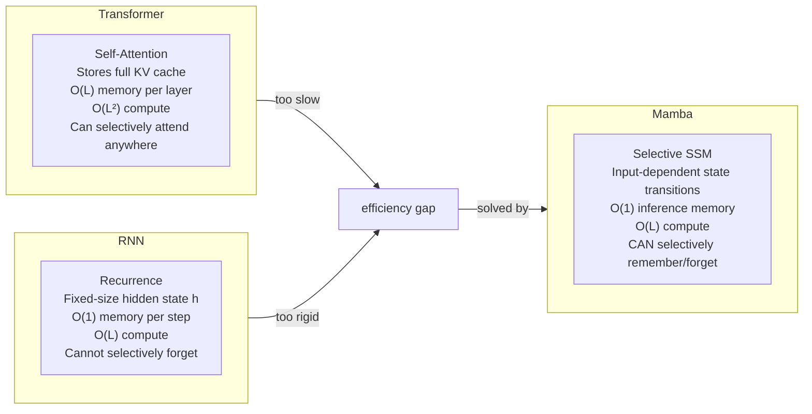

The efficiency vs. effectiveness axis can be understood as a **state compression problem**:
- Attention: does not compress (stores all context) → effective but O(L²)
- LTI SSM: compresses to fixed-size state → fast but cannot select relevant content
- Mamba (S6): input-dependent compression → fast AND content-aware

---

## 2. State Space Model Mathematics

### 2.1 The Continuous System

A structured SSM maps a 1D input sequence x(t) → y(t) through a hidden state h(t):

```
h'(t) = A·h(t) + B·x(t)    (state update)
y(t)  = C·h(t)              (output projection)
```

Where **A ∈ ℝᴺˣᴺ** is the state transition matrix, **B ∈ ℝᴺˣ¹** is the input projection, **C ∈ ℝ¹ˣᴺ** is the output projection.

### 2.2 Discretization — ZOH Rule

The continuous parameters (Δ, A, B) are converted to discrete parameters (Ā, B̄) using Zero-Order Hold:

```
Ā = exp(Δ·A)
B̄ = (Δ·A)⁻¹ · (exp(Δ·A) − I) · Δ·B
```

**Δ (timescale/step size)** is a learnable parameter that controls how much the model "samples" from the input at each discrete time step. Large Δ → more weight on current input; small Δ → rely more on hidden state.

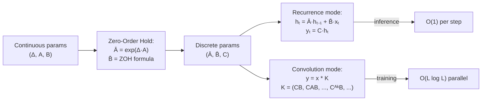

### 2.3 Dual Computation Paths

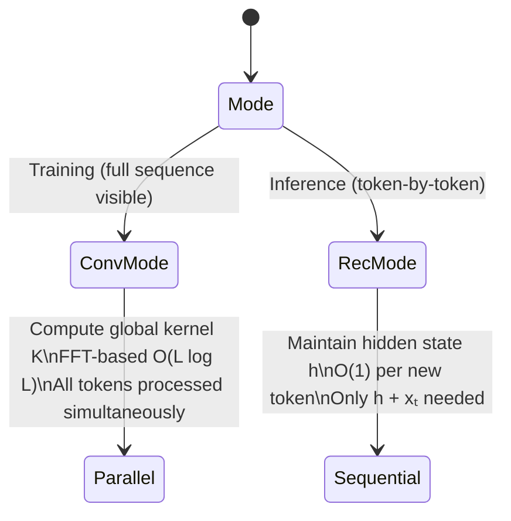

**Critical property**: S4 (classical SSM) can switch modes because **A, B, C, Δ are time-invariant constants** — the convolution kernel K is the same for all positions.

---

## 3. The Selection Mechanism — S6

### 3.1 The Problem with LTI (Linear Time Invariance)

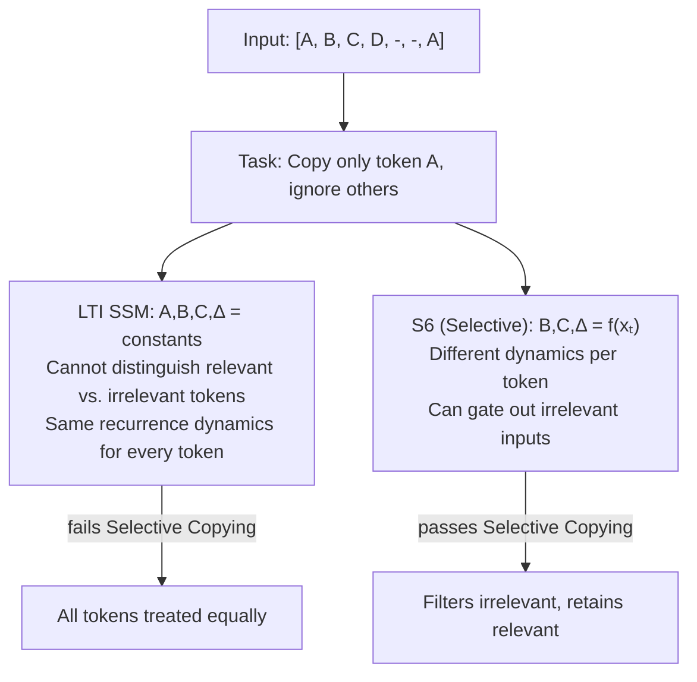

### 3.2 Making Parameters Input-Dependent

The key change from S4 → S6: **B, C, Δ become functions of the current input xₜ**:

| Parameter | S4 (LTI) | S6 (Selective) | Tensor shape |
|-----------|----------|----------------|--------------|
| A | (D, N) constant | (D, N) constant | Fixed |
| B | (D, N) constant | **B = Linearₙ(x)** | (B, L, N) |
| C | (D, N) constant | **C = Linearₙ(x)** | (B, L, N) |
| Δ | (D,) constant | **Δ = Broadcast(Linear₁(x))** | (B, L, D) |

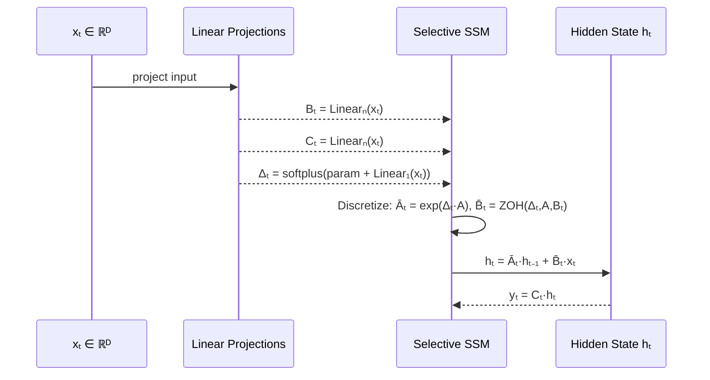

**Consequence**: The model is now **time-varying** — the recurrence parameters change at every step. This breaks the LTI equivalence to convolution, requiring a new computation strategy.

---

## 4. Hardware-Aware Selective Scan — The GPU Algorithm

### 4.1 The Memory Hierarchy Problem

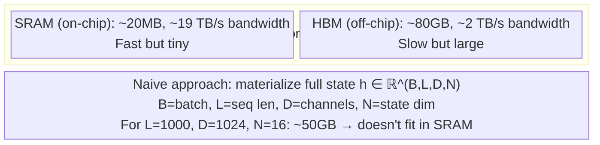

**Root cause of the bottleneck**: The expanded state h has shape (B, L, D, N) — a factor of N (~16–64) larger than input/output (B, L, D). Writing this to HBM on every step is bandwidth-bound.

### 4.2 The Solution: Kernel Fusion + SRAM-Only State

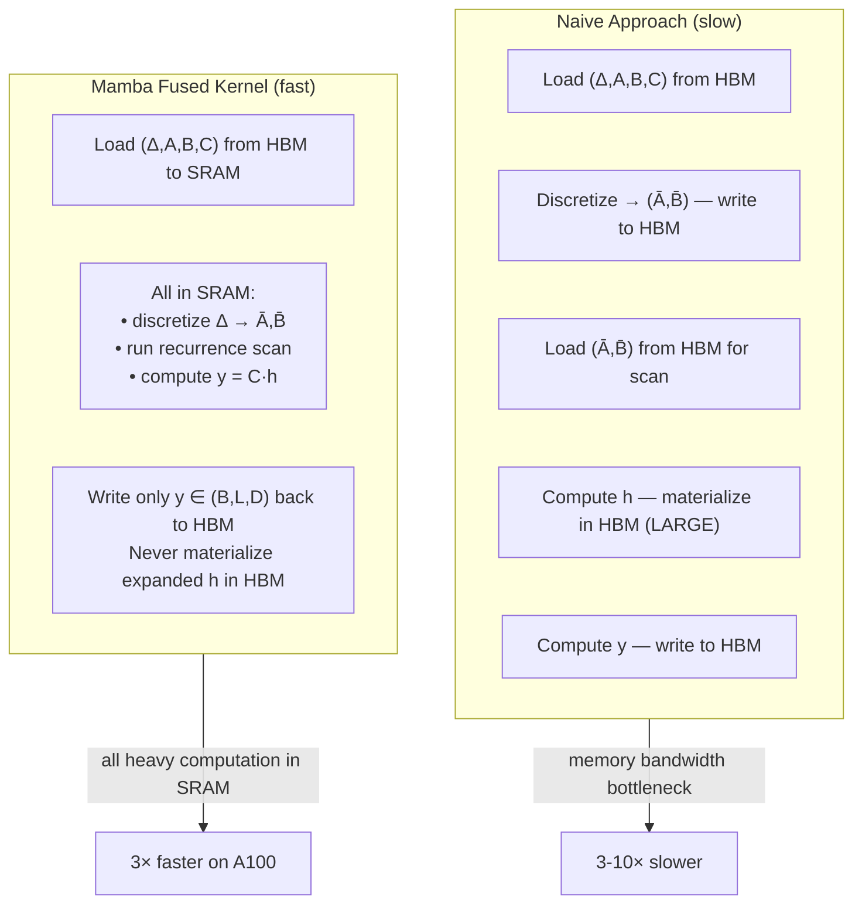

### 4.3 Parallel Scan Algorithm

Even though the recurrence `hₜ = Āₜ·hₜ₋₁ + B̄ₜ·xₜ` appears sequential, it can be parallelized using **prefix scan** (Blelloch 1990):

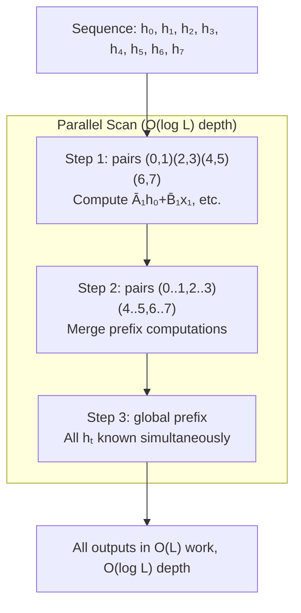

**Key property**: An associative binary operator exists for the (Ā, B̄x) recurrence, enabling prefix scan. Each merge operation: `(Ā₂, B̄₂x₂) ∘ (Ā₁, B̄₁x₁) = (Ā₂·Ā₁, Ā₂·B̄₁x₁ + B̄₂x₂)`.

### 4.4 Recomputation for Backpropagation

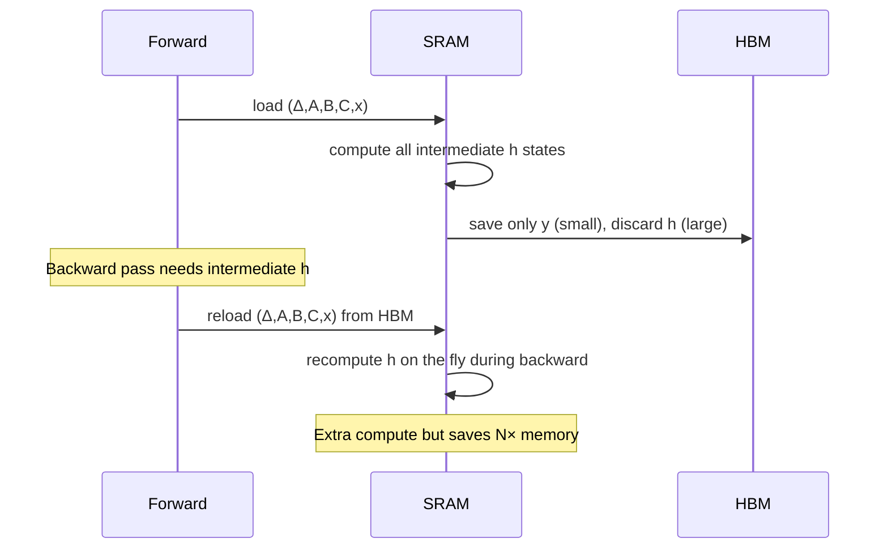

This is the same technique as FlashAttention's recomputation — trade compute for memory. Mamba achieves the **same memory footprint as FlashAttention** despite operating on a larger expanded state.

---

## 5. Mamba Block Architecture

### 5.1 Single Block Design

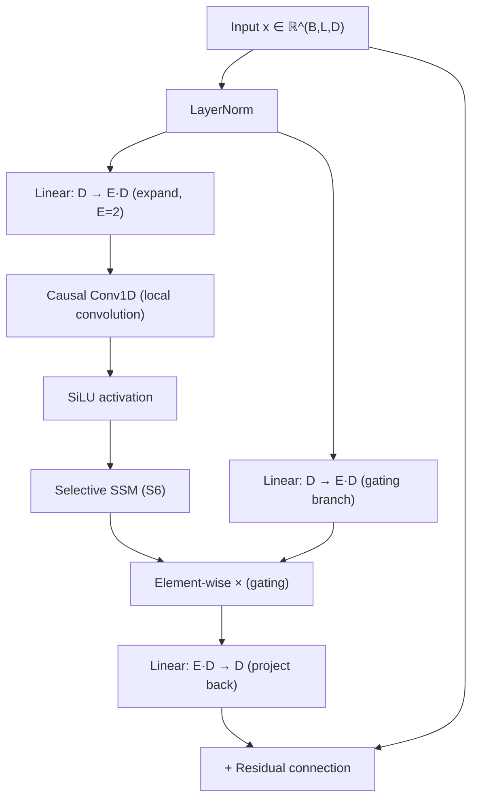

**Parameter count for one block** with expansion E=2:
- Input/output projections: 2ED² + ED² = 3ED²
- SSM parameters: Δ, A, B, C projections — much smaller, ~D·N

### 5.2 Full Mamba Architecture

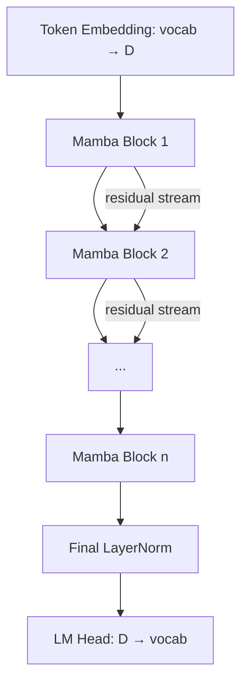

**vs. Transformer**: No MHA blocks, no separate MLP blocks. Mamba block integrates both the mixing (SSM) and transformation (gating) in a single homogeneous unit.

---

## 6. Selection Mechanism Interpretations

### 6.1 Connection to Gating in RNNs

The Δ parameter with softplus activation has a deep connection to LSTM forget gates:

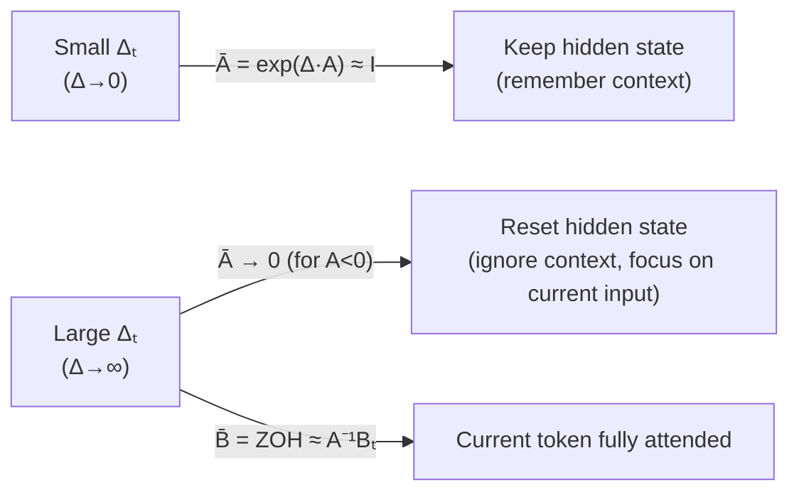

When Δ is large: the model **attends** to the current token. When Δ is small: the model **passes** the hidden state unchanged. This is the mechanism that enables **selective copying and induction heads**.

### 6.2 Selective Copy Task — Data Flow

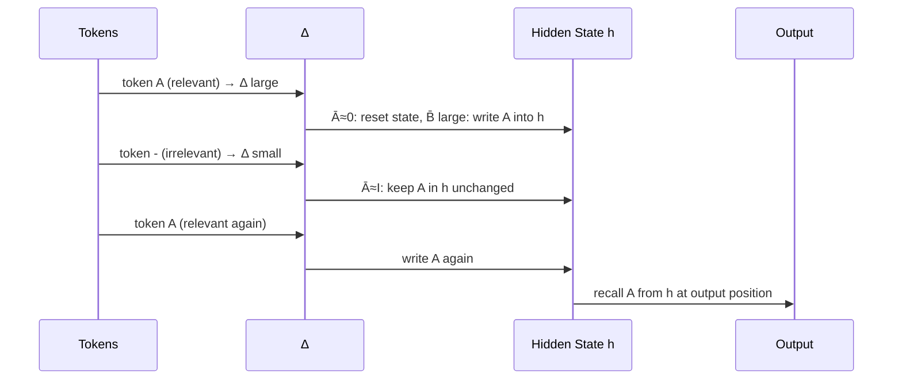

---

## 7. Memory Layout — Tensor Dimensions

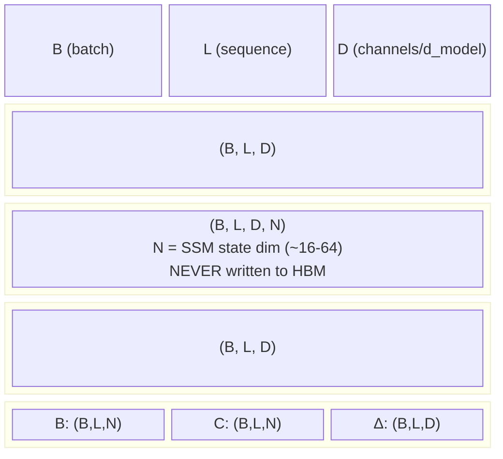

**Memory savings vs. naive**: Instead of writing (B,L,D,N) to HBM (~N× larger), only (B,L,D) is written. For N=16, that's 16× less memory bandwidth per layer.

---

## 8. Performance Characteristics

### 8.1 Complexity Comparison

| Model | Training FLOPs | Inference Memory | Inference per step |
|-------|---------------|-----------------|-------------------|
| Transformer | O(L²·D) | O(L·D) KV cache | O(L·D) growing |
| SSM (S4) | O(L·D·N·log L) | O(D·N) constant | O(D·N) constant |
| Mamba (S6) | O(L·D·N) | O(D·N) constant | O(D·N) constant |

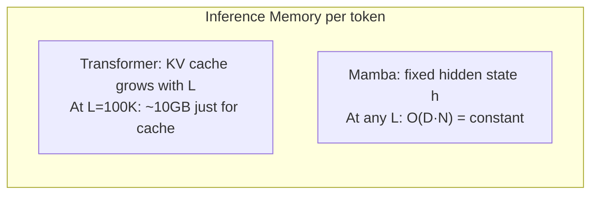

### 8.2 Throughput — 5× vs Transformers

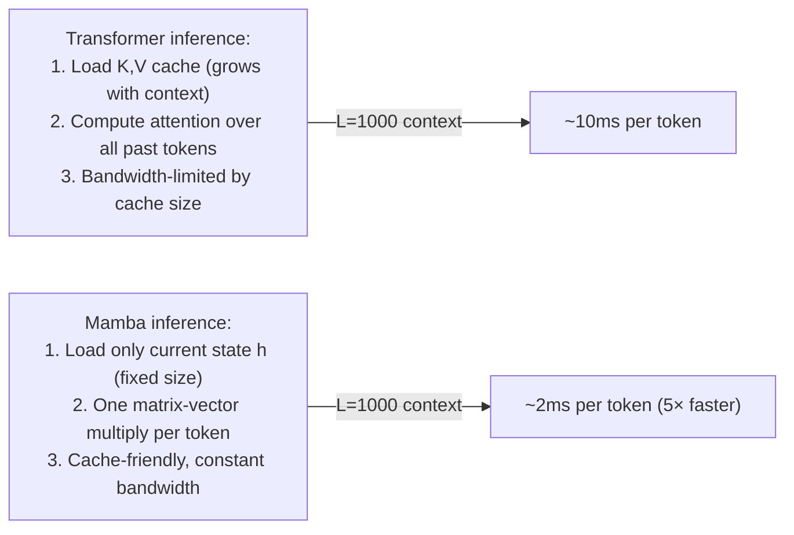

---

## 9. Why A Must Remain Constant

Making A input-dependent would destroy the associativity of the scan operator, eliminating the parallel scan parallelization:

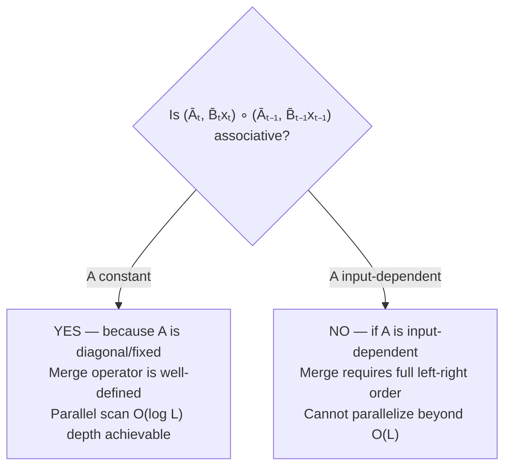

The authors keep A fixed (as a diagonal matrix of negative reals), while making B, C, Δ input-dependent. This is the minimal change that enables selectivity while preserving hardware efficiency.

---

## 10. Data Flow Summary — Forward Pass

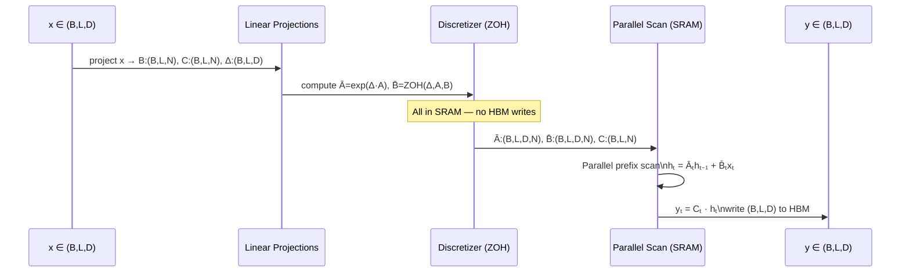

---

## Key Invariants

| Property | Classical S4 | Mamba S6 |
|----------|-------------|----------|
| Parameters | Time-invariant | Input-dependent (B,C,Δ) |
| Computation mode | Conv (train) + RNN (infer) | Scan (train) + RNN (infer) |
| State materialization | Can use convolution kernel K | SRAM-only fused kernel |
| Selectivity | No content-awareness | Full content-aware gating |
| Inference memory | O(D·N) | O(D·N) |
| Training complexity | O(L log L) | O(L) |
| Backprop strategy | Standard | Recomputation (like FlashAttention) |

Mamba demonstrates that the Transformer's quadratic complexity is not a fundamental requirement for powerful sequence modeling — it is an artifact of not compressing context selectively. By making compression content-aware via input-dependent parameters and computing efficiently via SRAM-resident parallel scan, Mamba achieves O(L) training, O(1) inference, and Transformer-matching quality.
