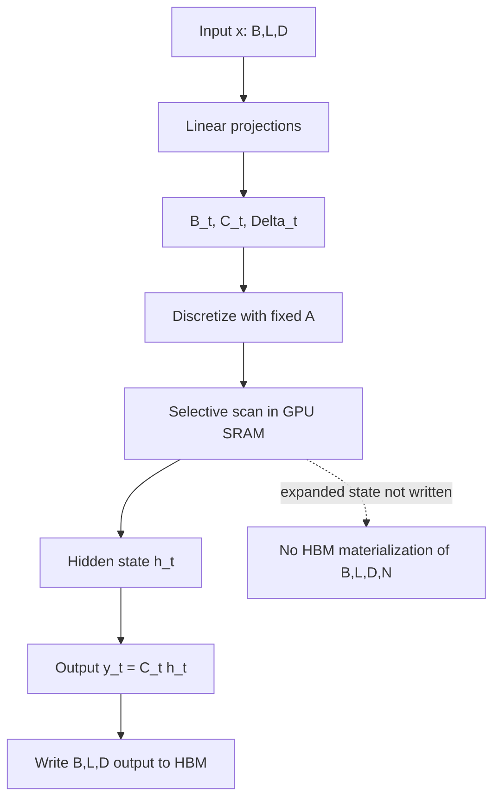
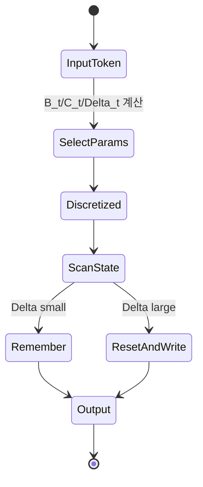

# Mamba SSM Internals 학습 및 기록 노트

## Paper and measurement boundary

- This document explains arXiv:2312.00752v2, not every later Mamba-family architecture or implementation.
- Complexity is stated in sequence length while holding model dimensions and batch shape explicit; linear asymptotics do not guarantee lower latency for every length or device.
- GPU SRAM/HBM capacity and bandwidth figures are hardware examples. Record GPU model, precision, kernel, batch, sequence length and warm-up for performance claims.
- Distinguish equations derived from the paper, implementation observations, and empirical quality results. Reproduce the named benchmark before generalizing a result.

## 1. 왜 필요한가? (Pain Point & Motivation)

Transformer attention은 긴 sequence에서 context를 잘 선택하지만 attention cache와 계산량이 sequence length에 따라 커진다. 전통적인 state space model은 fixed-size hidden state로 빠르게 동작하지만 입력별로 무엇을 기억하고 잊을지 선택하기 어렵다. Mamba는 selective state space model(S6)과 hardware-aware selective scan으로 이 trade-off를 깨려는 구조다.

이 문서는 Gu와 Dao의 *Mamba: Linear-Time Sequence Modeling with Selective State Spaces* 원문을 state compression, selective parameter, GPU memory data flow 중심으로 재작성한다.

## 2. 현재 나의 상태 (Baseline)

- Transformer attention, RNN hidden state, SSM이라는 이름은 알고 있다.
- Continuous SSM의 `A`, `B`, `C`, `Delta`가 discrete recurrence로 바뀌는 흐름을 더 명확히 해야 한다.
- S4의 time-invariant kernel과 Mamba S6의 input-dependent parameter 차이를 이해해야 한다.
- Selective scan이 왜 단순 sequential recurrence를 병렬화할 수 있는지 정리해야 한다.
- GPU HBM/SRAM 차이가 Mamba 구현 성능에 왜 중요한지 설명해야 한다.

## 3. 도달하고 싶은 목표 (Target State)

- Attention, RNN, SSM을 context compression 관점으로 비교한다.
- Continuous SSM이 ZOH discretization을 거쳐 recurrence로 실행되는 과정을 설명한다.
- Mamba에서 `B`, `C`, `Delta`는 input-dependent이고 `A`는 fixed로 남는 이유를 이해한다.
- Expanded state `(B, L, D, N)`를 HBM에 materialize하지 않는 fused selective scan의 의미를 설명한다.
- Training scan path와 inference recurrent path의 memory/compute trade-off를 구분한다.

## 4. 시스템 번역 (Data Flow)



Mamba의 hardware-aware scan은 input-dependent parameter와 state recurrence를 kernel 안에서 결합해 선택된 HBM traffic을 줄인다. 전체 expanded state `(B, L, D, N)`를 매 step 저장하지 않는 것이 핵심이며, 모든 중간 상태가 모든 구현에서 오직 SRAM에만 존재하거나 output 외에는 HBM에 쓰지 않는다는 보장은 아니다.

## 5. 핵심 구성요소 (Building Blocks)

| 구성요소 | 역할 | 핵심 상태 |
| --- | --- | --- |
| Continuous SSM | sequence를 hidden state dynamics로 표현 | `h'(t)=Ah(t)+Bx(t)` |
| ZOH discretization | continuous parameter를 discrete recurrence로 변환 | `A_bar`, `B_bar`, `Delta` |
| 학습된 `A` | Mamba에서 시간에 따라 입력 의존적으로 바뀌지 않는 parameter | discretized `A_bar_t`는 input-dependent `Delta_t`에 따라 달라질 수 있다. |
| Selective `B` | 현재 input을 state에 쓰는 방식 결정 | input-dependent projection |
| Selective `C` | state에서 output을 읽는 방식 결정 | input-dependent projection |
| Selective `Delta` | 기억/리셋 timescale 조절 | softplus gated step size |
| Parallel prefix scan | recurrence를 병렬 merge로 계산 | associative operator |
| Fused kernel | discretize, scan, output 계산을 결합 | 전체 expanded state의 반복 materialization을 피하는 HBM traffic 절감; 구체 저장 위치는 kernel별 확인 |
| Recomputation | backward에서 state를 다시 계산 | memory 절약, compute 증가 |
| Mamba block | conv, S6, gate, projection 결합 | residual stream |

## 6. 상태 전이 (State Transition)



`Delta`가 작으면 `A_bar`가 identity에 가까워져 state를 보존하고, `Delta`가 크면 이전 state 영향이 줄어 현재 token을 강하게 반영한다. 이 선택성이 Mamba가 content-aware compression을 수행하는 방식이다.

## 7. 불변식 (Invariant: 절대 깨지면 안 되는 규칙)

- Parallel scan에는 결합 가능한 associative transition 표현이 필요하다. Affine 전이 `(A_t, b_t)`는 시간에 따라 계수가 달라도 `(A_2, b_2) ∘ (A_1, b_1) = (A_2 A_1, A_2 b_1 + b_2)`라는 결합적 합성으로 표현된다.
- `B`, `C`, `Delta`는 input-dependent여야 selective copying과 content-aware filtering이 가능하다.
- Expanded state `(B, L, D, N)`를 HBM에 매 step 저장하면 memory bandwidth 병목이 된다.
- Fused selective scan의 성능 판단은 expanded state materialization과 HBM traffic을 얼마나 줄였는지로 하며, 중간 상태·checkpoint·output의 실제 저장 위치는 사용 kernel에서 확인한다.
- Backward pass에서 intermediate state를 저장하지 않는다면 재계산 비용을 감수해야 한다.
- Inference는 token-by-token recurrence로 fixed-size state만 유지해야 long-context memory가 상수에 가깝다.
- Attention과 비교할 때 training/inference complexity, memory footprint, quality trade-off를 분리해서 봐야 한다.

## 8. 가장 작은 예제 (Minimal Viable Example)

```text
Selective copy 개념:
input:  A - - B - A

token A: Delta large -> 이전 state를 줄이고 A를 state에 write
token -: Delta small -> state를 거의 그대로 keep
token B: Delta large -> B를 새로 write
token A: Delta large -> A를 다시 write
```

이 예제는 fixed recurrence가 모든 token을 같은 방식으로 처리하는 것과 달리, Mamba가 input별 `Delta`, `B`, `C`로 기억/무시/갱신을 선택한다는 점을 보여준다.

## 9. 실패 사례 (What could go wrong?)

- SSM을 단순 RNN처럼만 이해해 input-dependent parameter의 선택성을 놓친다.
- 입력 의존적인 parameter와 이전 hidden state에 비선형적으로 의존하는 전이를 혼동하면 affine scan으로 표현할 수 있는 조건을 잘못 판단한다. 입력별 A_t라는 사실만으로 associativity가 깨지지는 않는다.
- Expanded state를 HBM에 materialize하는 naive 구현으로 bandwidth 병목을 만든다.
- Training scan path와 inference recurrent path를 혼동해 memory complexity를 잘못 계산한다.
- Recomputation을 고려하지 않고 backward memory 사용량을 과소평가한다.
- Transformer attention의 KV cache와 Mamba hidden state를 같은 memory 모델로 비교한다.

## 10. 뇌 확장하기 (Evolution & Variants)

- SSM 계열은 S4, S5, S6, Hyena, RetNet, linear attention과 context compression 관점으로 비교한다.
- GPU 구현은 FlashAttention처럼 tiling, kernel fusion, recomputation, HBM/SRAM traffic으로 분석한다.
- Model block은 causal conv, gating, residual stream, normalization 위치까지 포함해 본다.
- Inference는 batch size, state cache layout, streaming generation latency 관점으로 확장한다.
- Long-context benchmark는 memory footprint, throughput, retrieval quality를 분리해 평가한다.

## 11. 최종 체크리스트 (Definition of Done)

- [x] Mamba를 attention/RNN/SSM의 context compression trade-off로 설명했다.
- [x] `A`, `B`, `C`, `Delta`, ZOH, selective scan의 역할을 정리했다.
- [x] Mamba의 학습된 A와 input-dependent B/C/Delta를 구분하고, scan의 조건은 affine transition 합성의 associativity로 설명했다.
- [x] HBM에 expanded state를 쓰지 않는 fused scan을 data flow로 표현했다.
- [x] 원문 Mamba SSM internals 문서를 12개 섹션 템플릿으로 재작성했다.

## 12. 뇌에 새기는 복습 문장 (TL;DR Blank)

Mamba의 핵심은 모든 context를 그대로 저장하는 대신 input-dependent SSM으로 기억할 정보를 고르고, hardware-aware scan으로 불필요한 expanded-state materialization과 HBM traffic을 줄이는 것이다.
