# Operating Systems — Internals and Design Principles
> Source: *Operating Systems: Internals and Design Principles*, 6th Edition — William Stallings. Synthesized from OS design principles (PDF contains different book content).

## Overview

An operating system is not a single program — it is a collection of interlocking mechanisms that together create the illusion of isolated, infinite resources from shared, finite hardware. This document maps the internal machinery: how the kernel manages processes in memory, how the scheduler selects and switches tasks, how virtual memory translates addresses through page tables, and how the I/O subsystem routes requests from userspace to hardware.

---

## 1. Kernel Architecture — Protection Rings

The CPU's privilege levels enforce the boundary between trusted kernel code and untrusted user code. On x86, rings 0–3 are available; mainstream OS design uses ring 0 (kernel) and ring 3 (user).

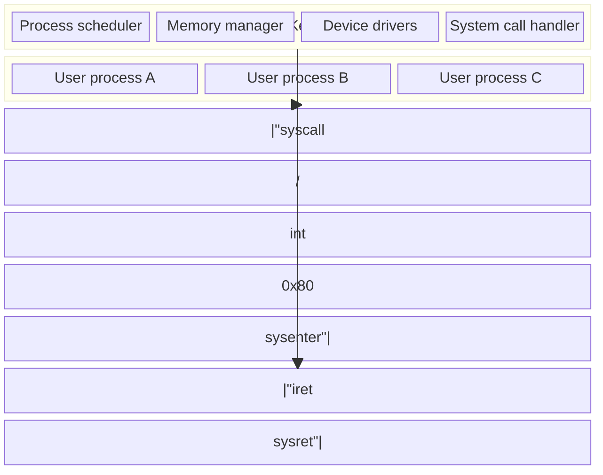

**Hardware enforcement**: Kernel-mode instructions (e.g., `HLT`, `LGDT`, direct I/O port access) fault when executed at ring 3. A user process cannot corrupt kernel memory, because the MMU enforces page-level permissions.

---

## 2. Process Control Block (PCB) — The OS's View of a Process

Every process is fully described by its Process Control Block (also called `task_struct` in Linux). When the kernel isn't running a process, everything needed to resume it is captured here.


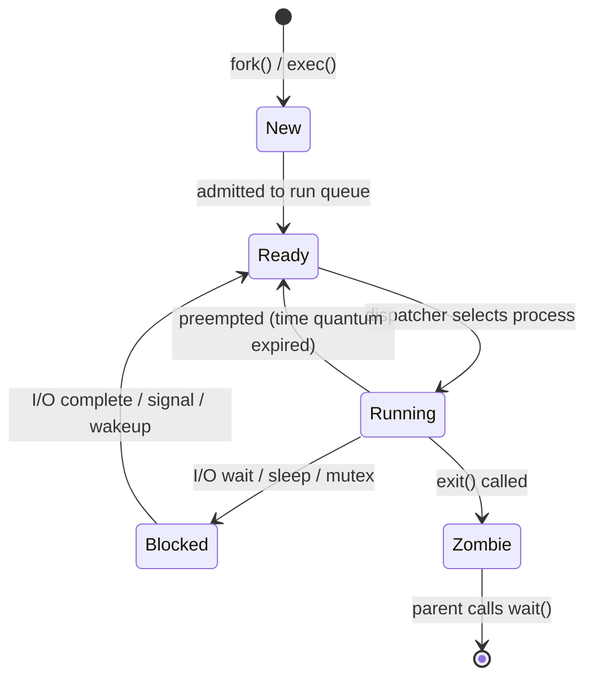

---

## 3. Context Switch — Register State Transfer

A context switch saves the complete CPU state of the outgoing process and restores the incoming process's state. This is the most performance-critical OS path.

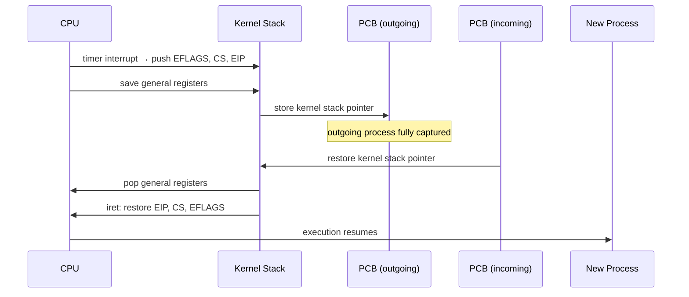

**CR3 update**: If the incoming process has a different address space, `CR3` (page directory base register) is updated. This flushes the TLB, causing page-table walk overhead for the first memory accesses.

---

## 4. Scheduling — CFS Internal Mechanics

Linux's Completely Fair Scheduler (CFS) uses a red-black tree ordered by `vruntime` — the amount of CPU time the process has consumed, normalized by priority weight.

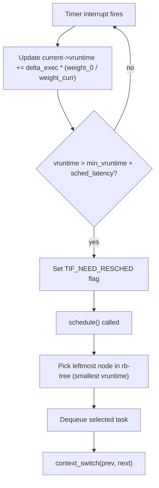

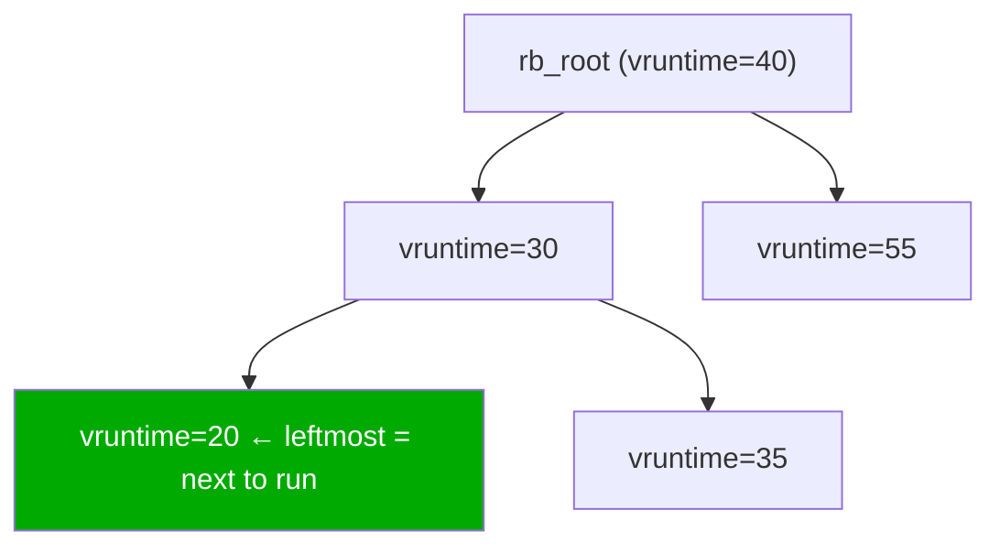

**vruntime normalization**: Higher-priority processes (nicer = -20) have a larger weight, so their vruntime grows more slowly — they get proportionally more CPU time before being preempted.

---

## 5. Virtual Memory — Address Translation Pipeline

Every user memory access goes through a multi-level page table walk to translate a virtual address to a physical address.

### 5.1 x86-64 Four-Level Page Table

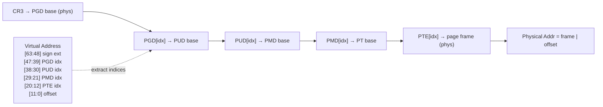

### 5.2 TLB — Translation Lookaside Buffer

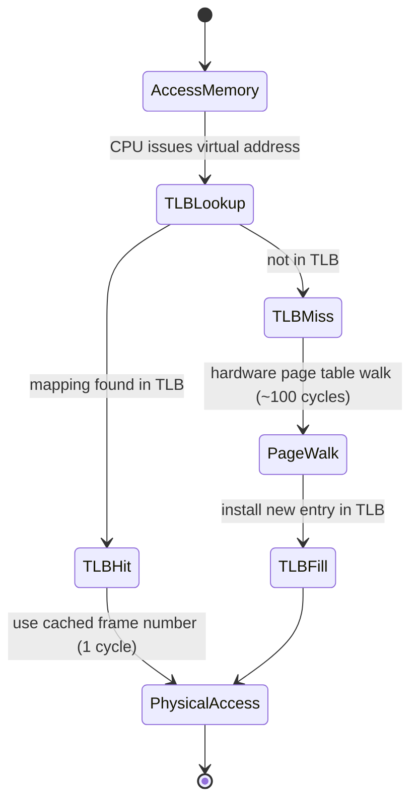

### 5.3 Page Fault Handler

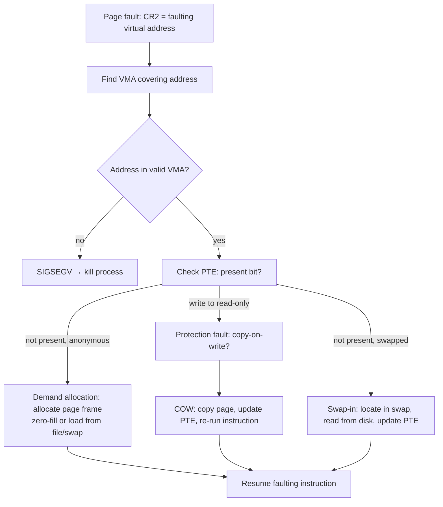

---

## 6. Memory Zones and Physical Allocation

The kernel divides physical memory into zones, each managed by a buddy allocator:

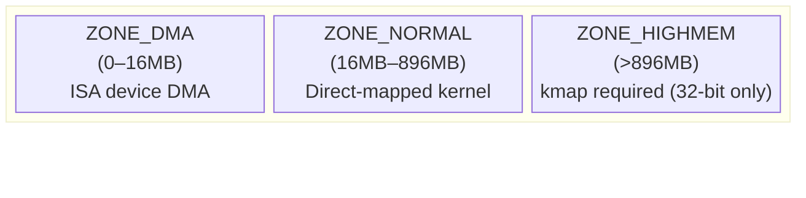

### 6.1 Buddy Allocator

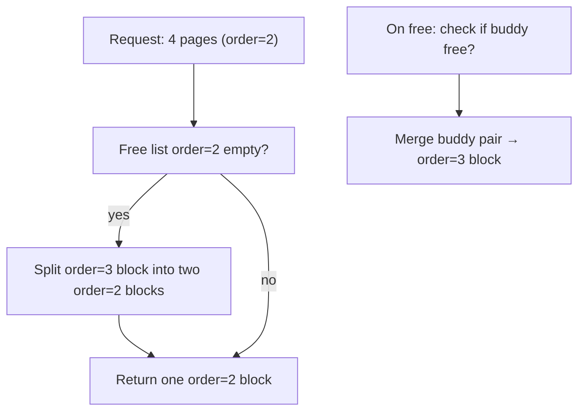

### 6.2 Slab Allocator — Object Cache

```mermaid
block-fixes
block-beta
  columns 1
  block:slab["kmem_cache for task_struct (example)"]:1
    full["Full slabs: all objects allocated"]
    partial["Partial slabs: mix of free/allocated objects"]
    empty["Empty slabs: all free → returned to buddy"]
  end
```

**Why slab**: Eliminates fragmentation for fixed-size kernel objects. `task_struct` (~1.7KB) has its own cache; allocating a new process reuses a pre-warmed slot with constructor already run.

---

## 7. File System — VFS Layer

The Virtual File System (VFS) is an abstraction layer that allows multiple filesystem implementations (ext4, XFS, tmpfs, NFS) to coexist behind a unified system call interface.

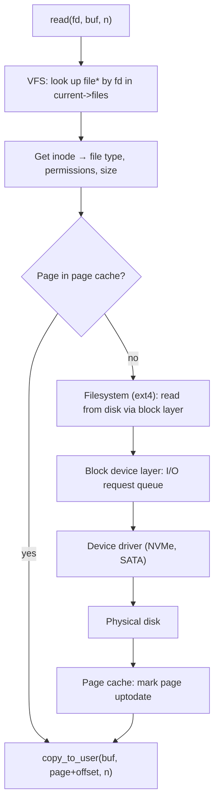

### 7.1 Dentry Cache (dcache)

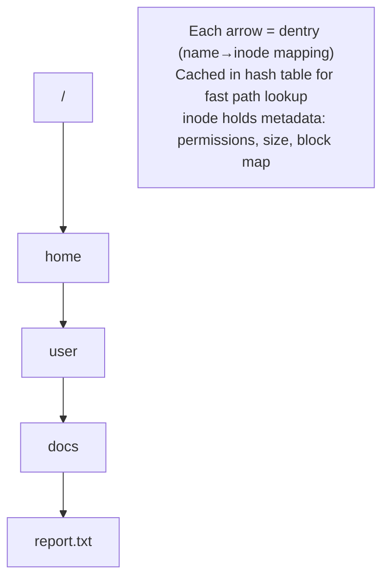

---

## 8. I/O Scheduling — Block Layer

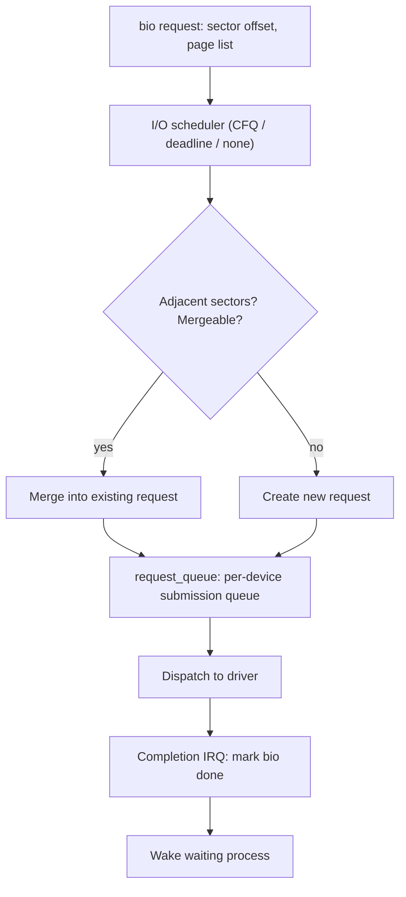

### 8.1 DMA Transfer Path

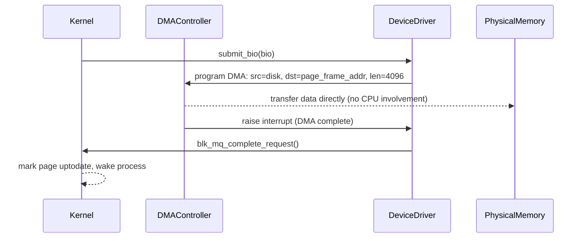

---

## 9. Synchronization — Kernel Locking Internals

### 9.1 Spinlock

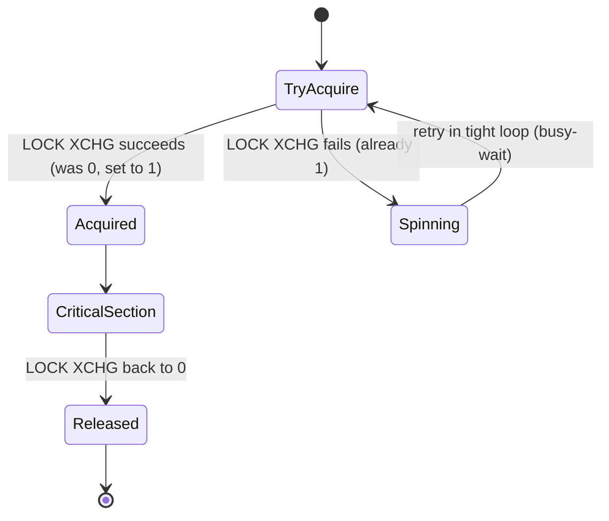

**Rule**: Spinlocks must not be held across any code that can sleep. They're suitable for IRQ handlers and very short critical sections.

### 9.2 Mutex (Sleeping Lock)

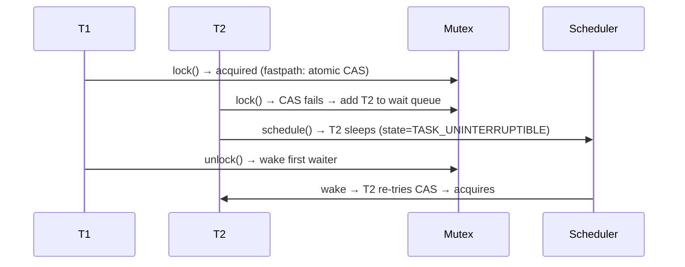

### 9.3 RCU — Read-Copy-Update

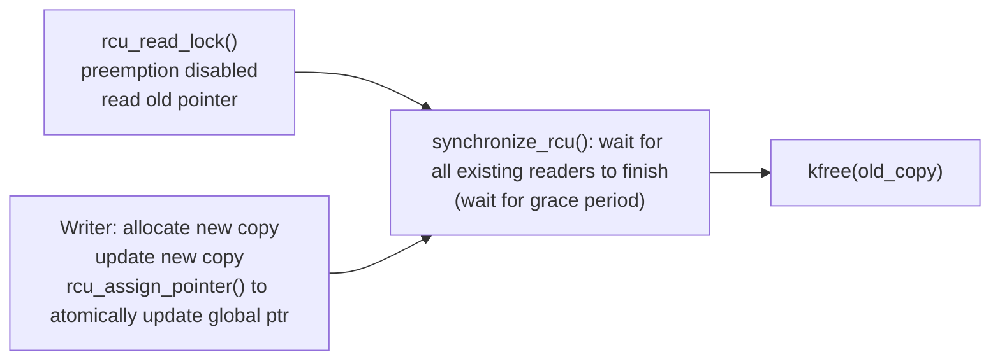

**Key property**: Readers never block. Writers pay the cost of waiting for a grace period before freeing old data. Ideal for read-heavy data structures (routing tables, process lists).

---

## 10. System Call Path — Detailed

```mermaid
sequenceDiagram
    participant UserApp
    participant libc
    participant CPU
    participant KernelEntry
    participant SyscallTable
    participant Implementation

    UserApp->>libc: read(fd, buf, n)
    libc->>CPU: MOV rax, __NR_read; SYSCALL instruction
    CPU->>CPU: switch to ring 0, load kernel stack (per-CPU)
    CPU->>KernelEntry: entry_SYSCALL_64
    KernelEntry->>KernelEntry: save all registers on kernel stack
    KernelEntry->>SyscallTable: sys_call_table[rax] = sys_read
    SyscallTable->>Implementation: sys_read(fd, buf, n)
    Implementation-->>KernelEntry: return value in rax
    KernelEntry->>CPU: SYSRET instruction
    CPU->>CPU: switch back to ring 3, restore registers
    CPU-->>libc: return
    libc-->>UserApp: bytes read
```

**SYSENTER/SYSCALL**: These are faster than the original `INT 0x80` software interrupt. `SYSCALL` (AMD64) directly loads the kernel entry point from `MSR_LSTAR`, avoiding the IDT lookup.

---

## 11. Demand Paging — Working Set Model

```mermaid
flowchart TD
    exec["exec(): map executable segments\nno physical pages yet"]
    first["First access → page fault"]
    alloc["Allocate page frame from free list"]
    zero["Zero-fill for BSS/anonymous\nOR load from file for text/data"]
    pte["Install PTE: VA → PA, set present bit"]
    resume["Resume faulting instruction"]
    pressure["Memory pressure: kswapd wakes"]
    lru["Scan LRU lists: active → inactive"]
    evict["Evict cold pages: write dirty to swap/file, clear PTE"]
    reclaim["Page frame returned to buddy allocator"]

    exec --> first --> alloc --> zero --> pte --> resume
    resume --> pressure --> lru --> evict --> reclaim
```

### 11.1 Clock Algorithm (Page Replacement)

```mermaid
stateDiagram-v2
    [*] --> Scan: kswapd wakes
    Scan --> CheckRef: examine page reference bit
    CheckRef --> ClearRef: ref=1 → clear bit, advance clock hand
    CheckRef --> Evict: ref=0 → candidate for eviction
    ClearRef --> Scan: continue scanning
    Evict --> Dirty{"Page dirty?"}
    Dirty -->|yes| WriteBack: writeback to disk/swap
    Dirty -->|no| Free: immediately reclaim
    WriteBack --> Free
    Free --> [*]: frame available
```

---

## 12. Inter-Process Communication — Data Paths

| Mechanism | Kernel involvement | Zero-copy? | Direction |
|-----------|-------------------|------------|-----------|
| Pipe | Yes — kernel buffer (64KB default) | No | Unidirectional |
| Socket (Unix domain) | Yes — copy user→kernel→user | No | Bidirectional |
| Shared memory (`mmap`) | Minimal — page table setup | **Yes** | Bidirectional |
| Signal | Yes — force delivery at next syscall return | N/A | Async |
| Message queue | Yes — kernel-managed FIFO | No | Unidirectional |

```mermaid
flowchart LR
    proc_a["Process A"]
    proc_b["Process B"]
    kernel_mem["Kernel buffer\n(pipe/socket)"]
    shared_page["Shared physical page\n(mmap/shm)"]

    proc_a -->|"write(fd, buf, n)"| kernel_mem
    kernel_mem -->|"read(fd, buf, n)"| proc_b

    proc_a -->|"direct write via VA"| shared_page
    proc_b -->|"direct read via VA"| shared_page
```

---

## Key Architecture Invariants

| Concept | Mechanism | Overhead |
|---------|-----------|----------|
| Kernel isolation | CPU rings + MMU page permissions | Hardware enforced |
| Process identity | PCB/task_struct | Allocated per-process |
| Address space | 4-level page tables + TLB | Miss = ~100 cycle penalty |
| CPU scheduling | CFS red-black tree by vruntime | O(log N) enqueue/dequeue |
| Memory allocation | Buddy (pages) + Slab (objects) | Low fragmentation |
| Sync (no sleep) | Spinlock (atomic XCHG) | Busy-wait |
| Sync (sleeping) | Mutex + wait queue + scheduler | Context switch cost |
| Readers (RCU) | Preempt-disable + grace period | Zero cost for readers |
| Filesystem | VFS + per-fs ops + page cache | Cache hit = no disk I/O |
| I/O | bio → request_queue → DMA | CPU-free data transfer |
