# Systems Performance — Under the Hood
> Based on *Systems Performance: Enterprise and the Cloud, 2nd Edition* by Brendan Gregg

## Measurement contract

- Start with a user-visible objective and time window, then name the resource, workload, host/container boundary and baseline.
- Utilization, saturation and errors are signals, not verdicts. Correlate them with latency distributions, throughput, queueing and application traces.
- Tool availability and field meaning depend on kernel, hardware, privileges, namespaces and sampling frequency. Record command, version, filters and loss counters.
- A diagnosis is complete only when a controlled change predicts and produces the expected metric and user-impact change, with an explicit rollback condition.

This document maps representative system-performance mechanisms and observability paths. BPF/eBPF and hardware counters provide sampled or instrumented evidence; they do not automatically expose every latency source exactly.

---

## 1. The USE Method: Resource Utilization Mental Model

The **USE Method** (Utilization, Saturation, Errors) is a checklist for examining resources. A resource can have multiple candidate measures for each category, and the three categories do not replace workload- and application-level evidence.

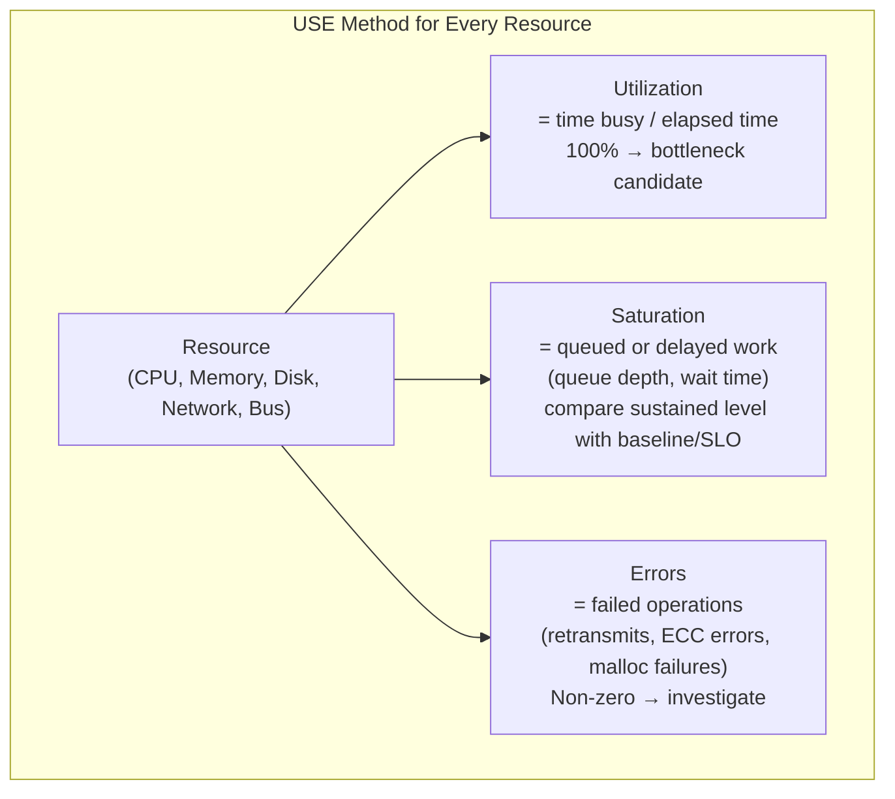

### USE Method Resource Matrix

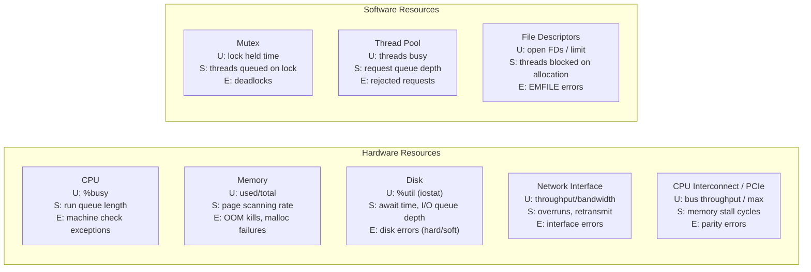

### Queueing Theory: Why 60% Utilization Matters

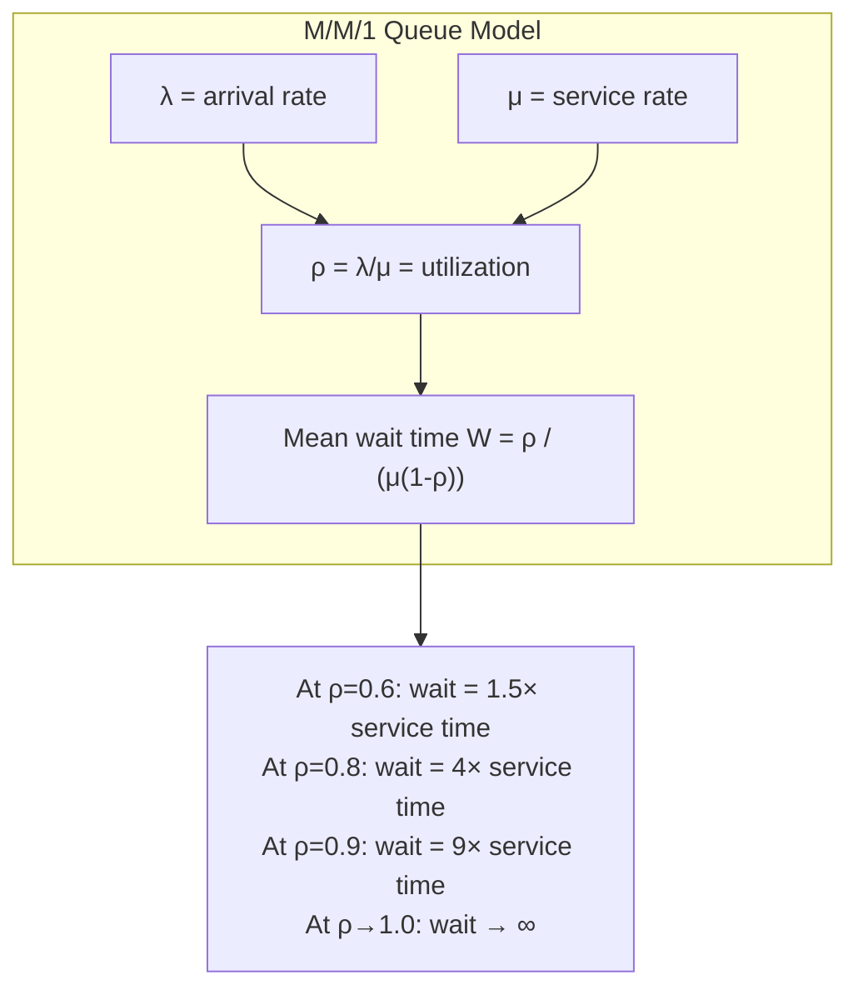

This is why 60% utilization is a practical ceiling: beyond it, queue wait times grow **superlinearly** and hide bursts of 100% utilization within measurement intervals.

---

## 2. CPU Architecture: Pipelines, Caches, and the Scheduler

### CPU Hardware Pipeline

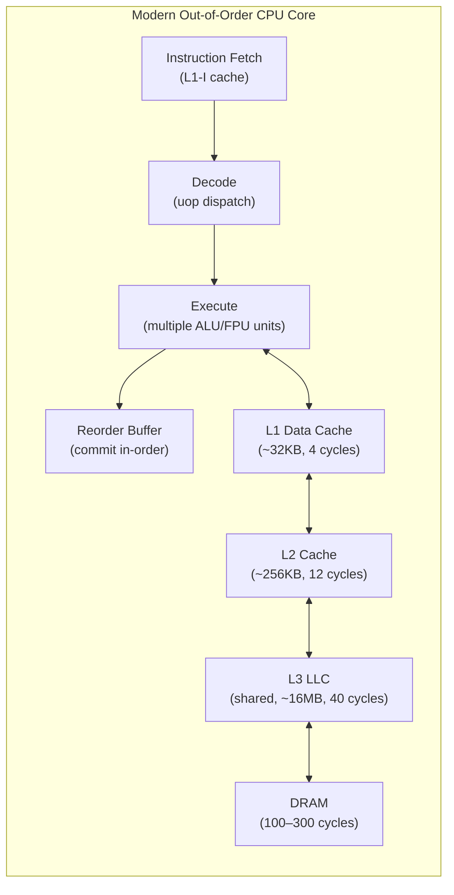

### CPU Run Queue (CFS Scheduler) Internal State

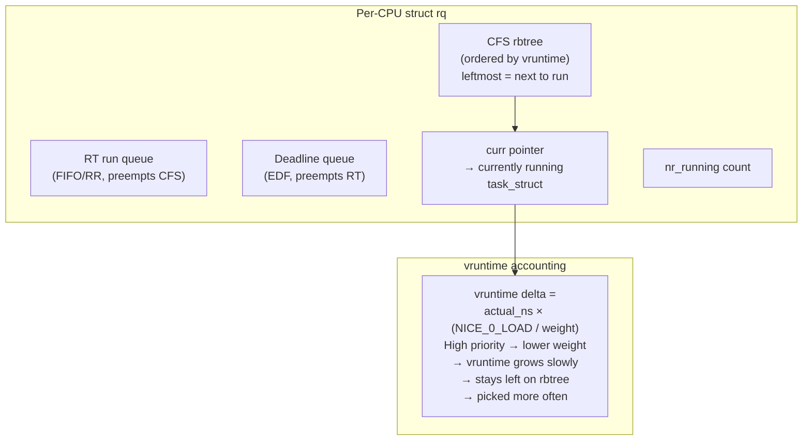

### Run Queue Latency (runqlat) — What It Measures

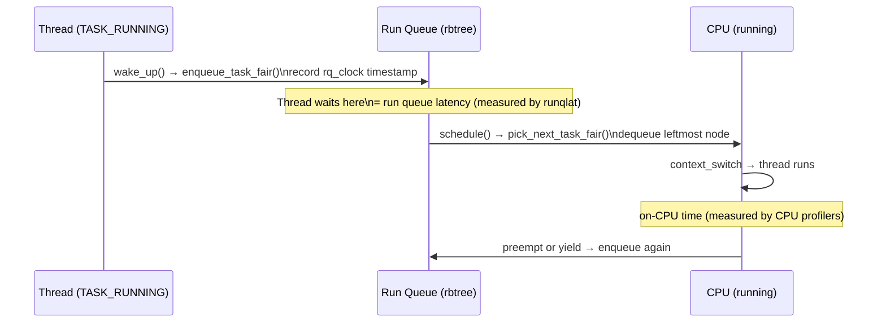

Run queue latency is a critical metric missed by CPU utilization alone. A CPU at 15% utilization can still have threads waiting 10ms+ if the scheduler is thrashing or one thread monopolizes time slices.

---

## 3. CPU Observability: Flame Graphs and BPF

### Flame Graph Anatomy

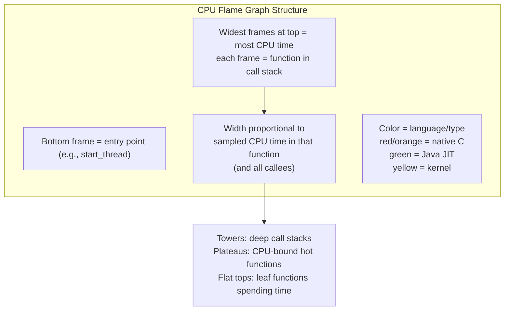

### Off-CPU vs. On-CPU Time Partitioning

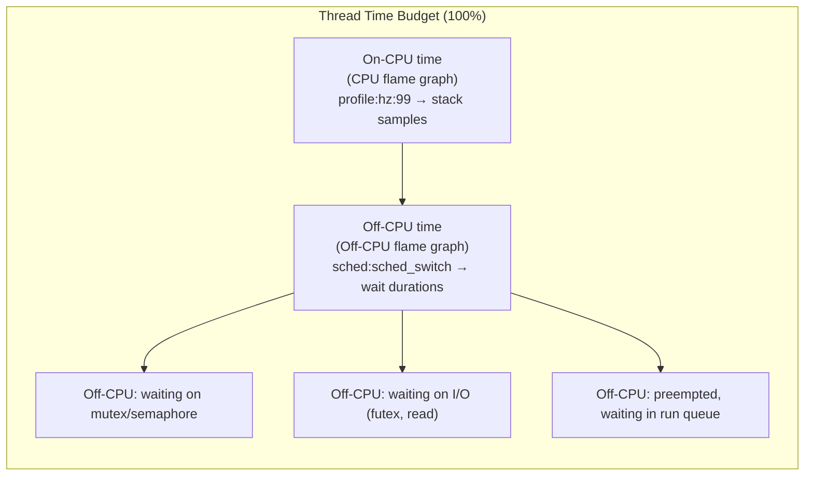

The off-CPU stack trace for a MySQL binary log sync:
```
finish_task_switch → schedule → jbd2_log_wait_commit → ext4_sync_file
→ vfs_fsync_range → MYSQL_BIN_LOG::sync_binlog_file()
```
This reveals that MySQL off-CPU time is dominated by **ext4 journal commits**, not lock contention or CPU starvation.

### BPF/eBPF Observability Architecture

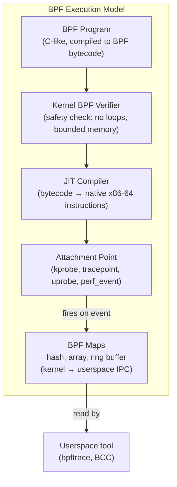

### Key BPF Tracepoints for Performance Analysis

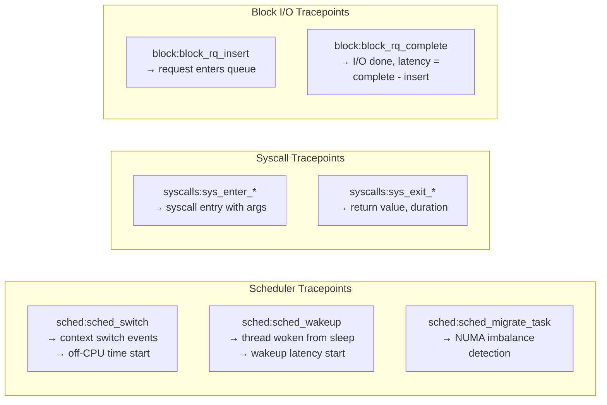

---

## 4. Memory Architecture: From Process to Physical Page

### Linux Virtual Memory Layout (x86-64)

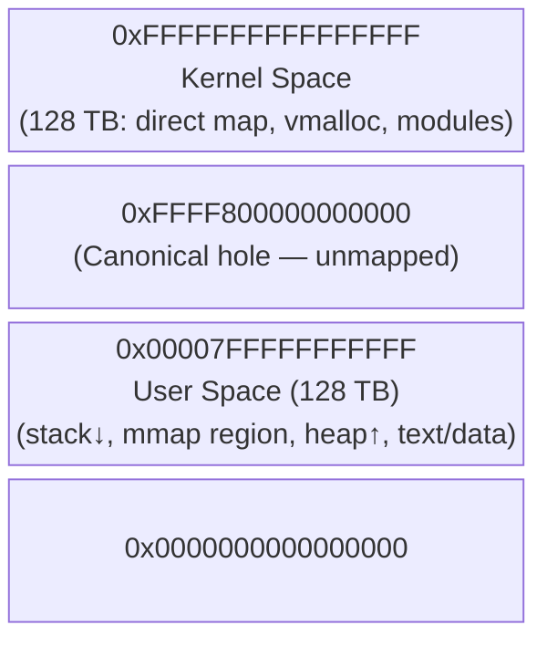

### Page Fault State Machine

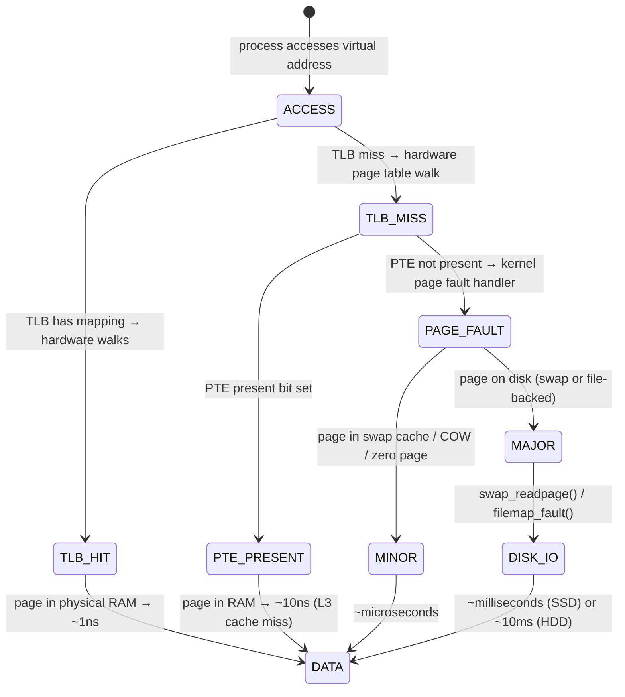

### Memory Pressure: The Reclaim Watermarks

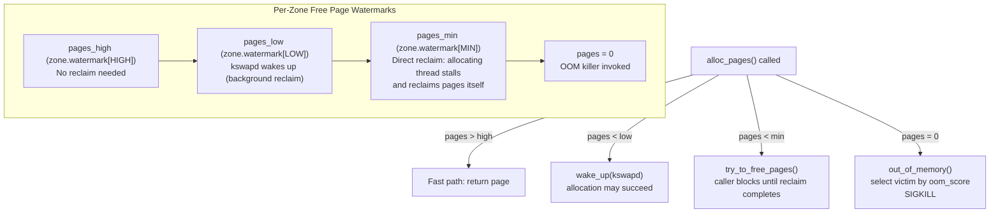

### Page Reclaim: LRU Lists and the Clock Algorithm

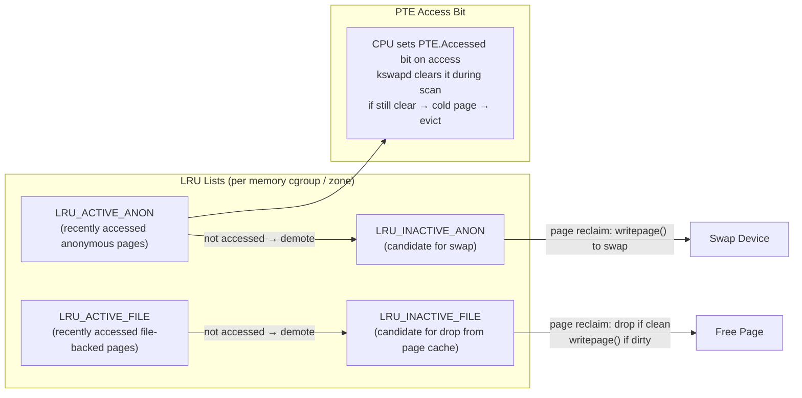

---

## 5. File System I/O Stack Internals

### Full I/O Stack: Layers and Data Structures

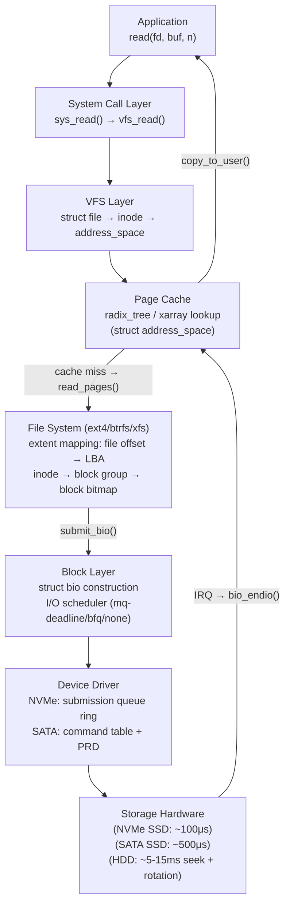

### ext4 Extent Tree: File → Block Mapping

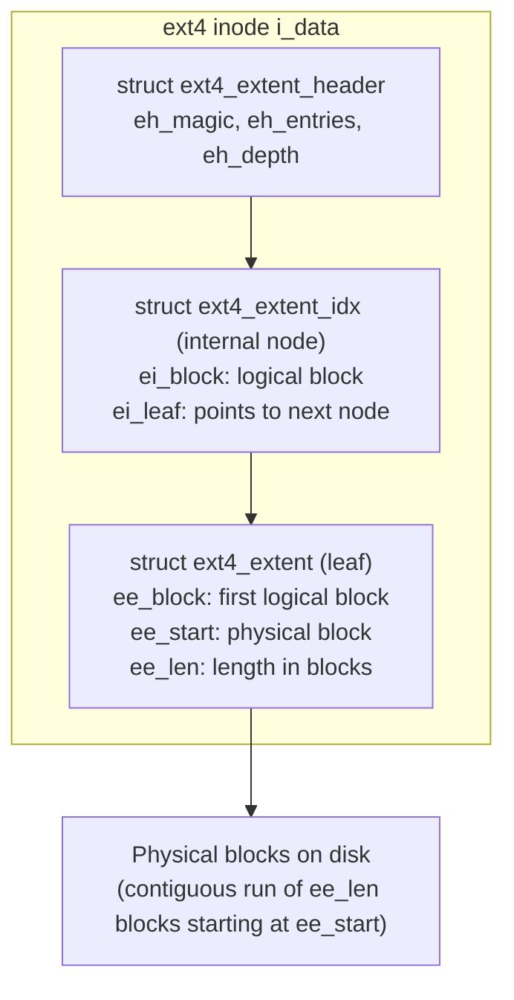

### File System Caches

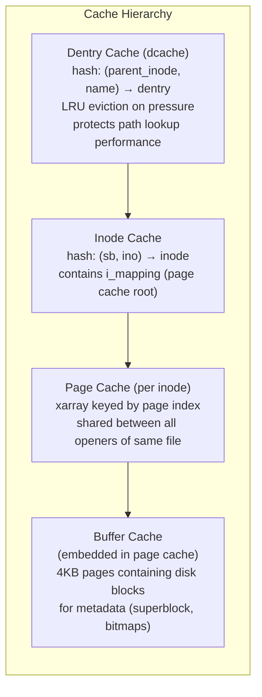

---

## 6. Disk I/O: Scheduler and Latency Anatomy

### I/O Request Lifecycle

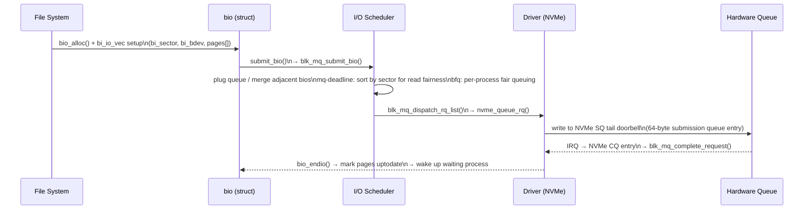

### latency = queue_time + service_time

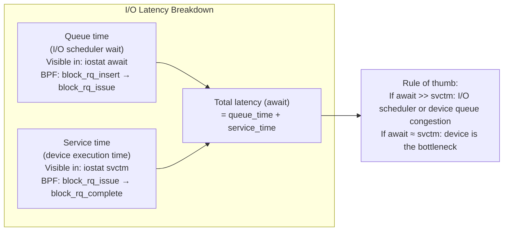

---

## 7. Network Stack Internals

### Packet Receive Path

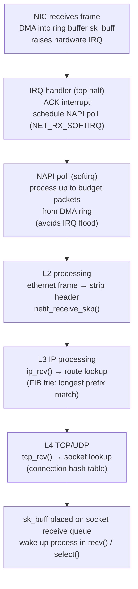

### TCP Internal State and Congestion Control

```mermaid
stateDiagram-v2
  [*] --> CLOSED
  CLOSED --> SYN_SENT: connect()
  CLOSED --> LISTEN: bind()+listen()
  LISTEN --> SYN_RCVD: SYN received
  SYN_SENT --> ESTABLISHED: SYN+ACK received
  SYN_RCVD --> ESTABLISHED: ACK received
  ESTABLISHED --> FIN_WAIT_1: close() (active)
  ESTABLISHED --> CLOSE_WAIT: FIN received (passive)
  FIN_WAIT_1 --> TIME_WAIT: FIN+ACK exchange
  CLOSE_WAIT --> LAST_ACK: close()
  TIME_WAIT --> CLOSED: 2×MSL timeout
  LAST_ACK --> CLOSED: ACK received
```

---

## 8. Methodology: Drill-Down and Workload Characterization

### Three-Stage Performance Investigation

```mermaid
flowchart TD
  MON["Stage 1: Monitoring\n(always-on metrics collection)\nPrometheus / sar / cloudwatch\nAlert on: CPU sat > 0, memory sat, disk errors"]
  MON --> ID["Stage 2: Identification\n(narrow to resource)\nvmstat: CPU/memory overview\niostat: disk utilization, await\nss / netstat: TCP retransmits"]
  ID --> ANA["Stage 3: Analysis\n(root cause with BPF/perf)\nperf record → flame graph\noffcputime → off-CPU flame graph\nbpftrace one-liners → custom metrics"]
  ANA --> FIX["Fix or Accept:\nEliminate unnecessary work first\nTune resource controls\nScale horizontally"]
```

### RED Method for Microservices

```mermaid
flowchart LR
  subgraph "RED Method (per service)"
    R["Request Rate\n(req/sec)\n↑ + ↑ latency = load problem"]
    E["Errors\n(5xx rate)\n↑ = architecture/code problem"]
    D["Duration (latency)\n↑ alone = architecture problem\nP99 - avg ≈ saturation contribution"]
  end
  R --> DIAG["Diagnosis:\nR↑ + D↑ → scale out\nR flat + D↑ → fix code or config\nE↑ → error path investigation"]
  E --> DIAG
  D --> DIAG
```

---

## 9. Observability Tool Stack

### Tool Selection by Latency Tier

```mermaid
flowchart TD
  subgraph "Observability Tool Hierarchy"
    L1_T["Static: /proc, /sys\n(polling, low overhead)\nvmstat, iostat, free, sar\n→ counts and averages"]
    L2_T["Dynamic Tracing: kprobes, uprobes\n(attach to any kernel/user function)\nperf probe, bpftrace kprobe:\n→ per-event latency"]
    L3_T["Tracepoints (stable ABI)\nsched:*, block:*, syscalls:*\n(recommended over kprobes)\nbpftrace tracepoint:"]
    L4_T["PMC (Performance Monitoring Counters)\nCPU: cache misses, branch mispredicts\ncycles per instruction (CPI)\nperf stat -e cycles,cache-misses,instructions"]
  end
  L1_T --> L2_T --> L3_T --> L4_T
```

### BPF Tool Capabilities Map

```mermaid
flowchart LR
  subgraph "BCC / bpftrace Tools"
    RUNQLAT["runqlat\nCPU scheduler run queue latency\n→ histogram of wait times"]
    OFFCPU["offcputime\nOff-CPU stacks + durations\n→ identifies blocking bottlenecks"]
    BIOLATENCY["biolatency\nBlock I/O latency histogram\n→ NVMe vs HDD vs queue delay"]
    CACHESTAT["cachestat\nPage cache hit/miss ratio\n→ read-ahead effectiveness"]
    OPENSNOOP["opensnoop\nTracks file opens in real-time\n→ unexpected file access patterns"]
    TCPRETRANS["tcpretrans\nTCP retransmit events\n→ network congestion detection"]
  end
```

---

## 10. CPU Performance Counters (PMC) and Cache Effects

```mermaid
flowchart TD
  subgraph "CPU Hardware Performance Counters"
    CYCLES["cycles: actual CPU clock cycles"]
    INSTRS["instructions: retired instructions"]
    CPI["CPI = cycles / instructions\nIdeal: 0.25–1.0\nMemory bound: > 5.0"]
    LLC_MISS["LLC cache misses\n(→ DRAM access: ~100 cycles penalty)"]
    BRANCH["branch-misses\n(→ pipeline flush: ~15 cycles penalty)"]
    STALLS["memory stall cycles\n(cycles with no instruction retired\ndue to cache miss in flight)"]
  end
  CPI --> DIAG["Diagnosis:\nHigh CPI + high LLC misses → memory bandwidth bound\nHigh CPI + high branch misses → bad branch prediction\nLow CPI but high context switches → scheduler problem"]
```

### False Sharing: Why Per-CPU Data Matters

```mermaid
flowchart LR
  subgraph "Cache Line (64 bytes)"
    CPU0_VAR["CPU0 counter (bytes 0-7)"]
    CPU1_VAR["CPU1 counter (bytes 8-15)"]
    CPU2_VAR["CPU2 counter (bytes 16-23)"]
    CPU3_VAR["CPU3 counter (bytes 24-31)"]
  end
  NOTE["If all CPUs write to this cache line:\nCPU0 write → invalidates CPU1,2,3 caches\nCPU1 write → invalidates CPU0,2,3 caches\nResult: cache line bounces between CPU L1 caches\n= 'false sharing' = massive slowdown\nFix: __cacheline_aligned_in_smp per-CPU variables"]
```

---

## 11. Cloud and Container Performance: cgroups and Throttling

```mermaid
flowchart TD
  subgraph "cgroup Resource Controls"
    CPU_CG["cpu cgroup\ncpu.cfs_quota_us / cpu.cfs_period_us\n= CPU bandwidth throttling\nThrottled → throttled_time counter"]
    MEM_CG["memory cgroup\nmemory.limit_in_bytes\nProcess sees OOM kill before host\nmemory.memsw.limit = including swap"]
    IO_CG["blkio cgroup\nblkio.throttle.read_bps_device\nI/O scheduler: per-group weight (BFQ)"]
    NET_CG["net_cls / tc\ntraffic control egress shaping\n(ingress: police, egress: htb/tbf)"]
  end
  subgraph "USE Method for Containers"
    CU["Container CPU Utilization\n= cpu.stat.usage_usec / wall_time"]
    CS["Container CPU Saturation\n= cpu.stat.throttled_time > 0"]
    MU["Container Memory Utilization\n= memory.current / memory.max"]
    MS["Container Memory Saturation\n= memory.stat.pgmajfault (major faults)"]
  end
```

---

## 12. Performance Analysis Flow: End-to-End

```mermaid
flowchart TD
  START["System slow / high latency reported"]
  START --> USE["Apply USE Method\nCheck all resources: CPU, memory, disk, net\nFind: utilization %, saturation (queue), errors"]
  USE --> FOUND{"Saturated\nresource found?"}
  FOUND -->|yes| WORKLOAD["Workload Characterization\nWho: pid, user, IP\nWhy: stack trace\nWhat: rate, IOPS, bytes\nWhen: time pattern"]
  WORKLOAD --> ELIM["Eliminate unnecessary work\n(top win: fix root cause)"]
  ELIM --> TUNE["Tune: cgroup limits,\nI/O scheduler, TCP buffers"]
  FOUND -->|no| RED["Apply RED Method\n(if microservices)\nRate, Errors, Duration per service"]
  RED --> TRACE["Deep trace with BPF\nFlame graphs (on-CPU + off-CPU)\nbiolatency, runqlat, tcpretrans"]
  TRACE --> ROOT["Root cause identified\nFix or accept + monitor"]
```

Every performance investigation follows this loop: measure at the USE/RED level to find the resource, drill down with BPF tracing to find the exact code path, then eliminate unnecessary work before tuning. The kernel's observability infrastructure — tracepoints, kprobes, perf events, and BPF maps — exposes every data path in the system at nanosecond resolution.
