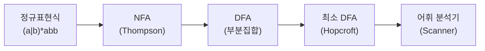
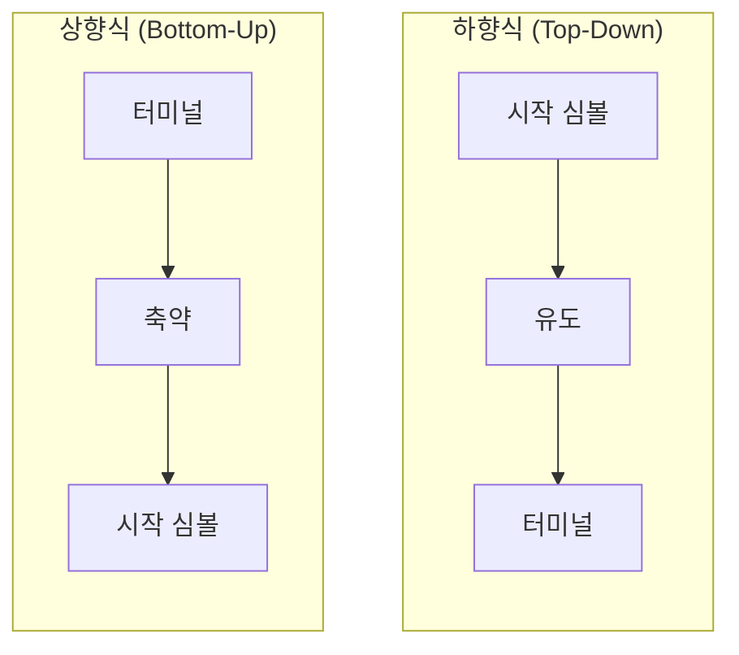
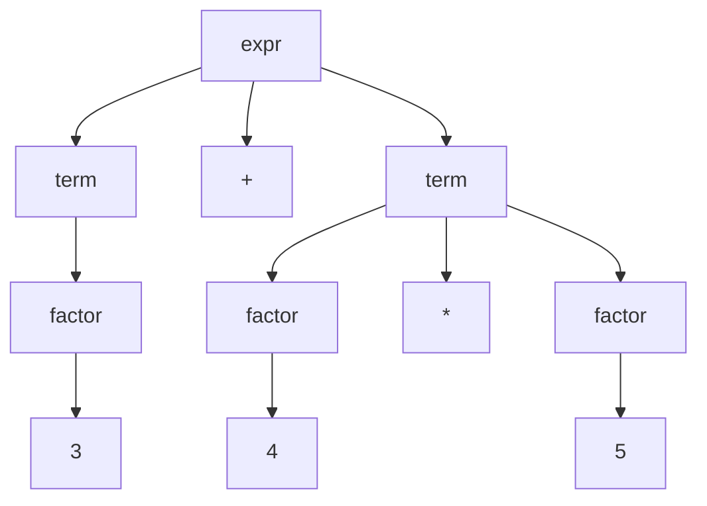
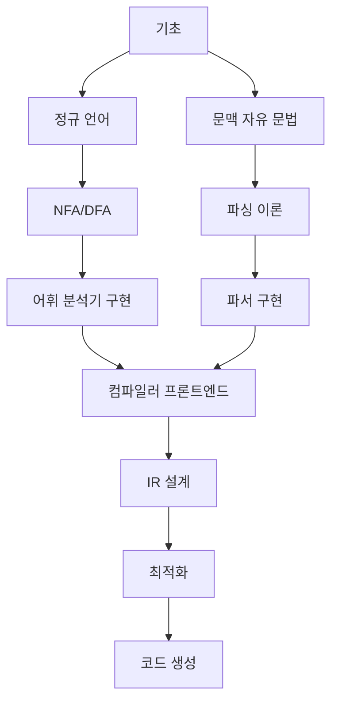

# 컴파일러 이론 문서

컴파일러 설계와 구현에 관한 학습 자료입니다.

## 문서군의 범위

- 이 인덱스는 현재 연결된 어휘·구문 분석 학습 문서를 안내하며, 전체 컴파일러 구현이 완성됐음을 뜻하지 않습니다.
- 각 문서는 입력 알파벳 또는 문법, 알고리즘의 산출물, 충돌·거부 조건을 독립적으로 명시해야 합니다.
- 예제 오토마타와 파싱 표의 완료 기준은 모든 도달 상태 또는 항목 집합을 처리하고 수용·거부 표본을 추적하는 것입니다.
- 의미 분석, IR, 최적화, 코드 생성 항목은 실제 문서나 구현 링크가 있을 때만 완료된 범위로 표시합니다.

---

## :material-cog-sync: 컴파일러 파이프라인


---

## :material-book-multiple: 문서 목록

<div class="grid cards" markdown>

-   :material-format-letter-matches:{ .lg .middle } **어휘 분석 (Lexical Analysis)**

    ---

    토큰화, 정규표현식, 유한 오토마타

    - [NFA](lexical/nfa.md) - 비결정적 유한 오토마타
    - [DFA](lexical/dfa.md) - 결정적 유한 오토마타
    - [NFA → DFA](lexical/nfa-to-dfa.md) - 변환 알고리즘

-   :material-file-tree:{ .lg .middle } **구문 분석 (Parsing)**

    ---

    문법, 파싱 기법, 파스 트리

    - [CFG](parsing/cfg.md) - 문맥 자유 문법
    - [LL 파서](parsing/ll-parser.md) - 하향식 파싱
    - [LR 파서](parsing/lr-parser.md) - 상향식 파싱
    - [Bottom-Up](parsing/bottom-up.md) - 상향식 개념

</div>

---

## :material-state-machine: 어휘 분석 단계

### 정규표현식 → NFA → DFA



### 유한 오토마타 비교

| 특성 | NFA | DFA |
|------|-----|-----|
| **전이 결과** | 상태 집합 | 단일 상태 |
| **ε-전이** | ✅ 가능 | ❌ 불가능 |
| **상태 수** | 적음 | 많을 수 있음 |
| **구현** | 단순 | 복잡 |
| **실행** | 느림 | 빠름 |
| **표현력** | 동일 | 동일 |

---

## :material-tree: 구문 분석 단계

### 하향식 vs 상향식



### 파싱 알고리즘 분류

| 유형 | 알고리즘 | 문법 제약 | 특징 |
|------|----------|----------|------|
| **하향식** | Recursive Descent | LL(1) | 직관적, 수동 구현 |
| | LL(k) Parser | LL(k) | k 토큰 lookahead |
| **상향식** | SLR | SLR(1) | 단순, 제약 많음 |
| | LALR | LALR(1) | yacc/bison |
| | LR(1) | LR(1) | 강력, 테이블 큼 |

---

## :material-format-text: 문맥 자유 문법 (CFG)

### 문법 표기법

```
// BNF (Backus-Naur Form)
<expr>   ::= <term> (('+' | '-') <term>)*
<term>   ::= <factor> (('*' | '/') <factor>)*
<factor> ::= NUMBER | '(' <expr> ')'
```

### 파스 트리 예시

`3 + 4 * 5`의 파스 트리:



---

## :material-code-braces: 중간 표현 (IR)

### 3-주소 코드

```
// 소스: a = b + c * d
t1 = c * d      // 임시 변수 사용
t2 = b + t1
a = t2
```

### SSA (Static Single Assignment)

```
// 각 변수는 한 번만 할당
x1 = 5
x2 = x1 + 1
x3 = φ(x1, x2)  // Phi 함수
```

---

## :material-lightning-bolt: 최적화 기법

| 최적화 | 설명 | 예시 |
|--------|------|------|
| **상수 폴딩** | 컴파일 타임에 상수 계산 | `3 * 4` → `12` |
| **상수 전파** | 상수를 사용처로 전파 | `x=5; y=x+1` → `y=6` |
| **죽은 코드 제거** | 사용되지 않는 코드 제거 | unreachable code |
| **루프 불변 이동** | 루프 밖으로 계산 이동 | loop-invariant hoisting |
| **공통 부분식 제거** | 중복 계산 제거 | CSE |
| **인라인 확장** | 함수 호출을 본문으로 대체 | inlining |

---

## :material-school: 학습 로드맵



### 추천 도구

| 도구 | 용도 | 언어 |
|------|------|------|
| **Flex** | 어휘 분석기 생성 | C |
| **Bison** | 파서 생성 (LALR) | C |
| **ANTLR** | LL(*) 파서 생성 | Java, Python |
| **LLVM** | 컴파일러 백엔드 | C++ |

---

## :material-link-variant: 관련 문서

- [알고리즘](../algorithms/index.md) - 그래프 알고리즘
- [운영체제](../os/index.md) - 시스템 프로그래밍 기초

---

## :material-book-open-page-variant: 참고 자료

- **Dragon Book** - Compilers: Principles, Techniques, and Tools
- **Tiger Book** - Modern Compiler Implementation
- **Engineering a Compiler** - Keith Cooper
- [JFLAP](https://www.jflap.org/) - 오토마타 시각화 도구
