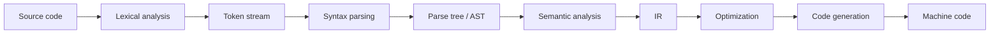
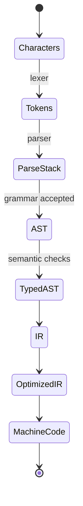

# 컴파일러 이론 인덱스 학습 및 기록 노트

## 1. 왜 필요한가? (Pain Point & Motivation)

컴파일러는 소스 코드를 바로 기계어로 바꾸는 단일 단계가 아니다. 어휘 분석은 문자를 token으로 나누고, 구문 분석은 token stream을 parse tree/AST로 만들며, 의미 분석과 IR, 최적화, 코드 생성이 뒤따른다. 각 단계를 분리해 이해하지 않으면 parser 오류, grammar ambiguity, lexer state, IR 최적화의 책임 경계를 혼동하게 된다.

이 문서는 `content/docs/compiler` 하위 문서를 compiler pipeline과 학습 순서 중심으로 재작성한 상위 인덱스다.

## 2. 현재 나의 상태 (Baseline)

- 정규표현식, NFA, DFA, CFG, LL parser, LR parser라는 용어는 알고 있다.
- Lexer와 parser가 각각 어떤 입력과 출력을 갖는지 더 명확히 해야 한다.
- Top-down parsing과 bottom-up parsing의 차이를 parse direction과 grammar constraint로 구분해야 한다.
- IR, SSA, optimization, code generation은 프론트엔드 이후 단계로만 얕게 알고 있다.
- 하위 문서로 들어가기 전 전체 학습 순서를 정리할 필요가 있다.

## 3. 도달하고 싶은 목표 (Target State)

- Compiler pipeline을 source code부터 machine code까지 단계별 data flow로 설명한다.
- Lexical analysis 문서와 parsing 문서의 역할을 구분한다.
- NFA, DFA, NFA-to-DFA 변환을 scanner 구현 관점으로 연결한다.
- CFG, LL parser, LR parser, bottom-up parsing을 parser 설계 관점으로 연결한다.
- IR과 최적화가 front-end 결과를 backend가 다루기 쉬운 형태로 바꾸는 이유를 이해한다.

## 4. 시스템 번역 (Data Flow)



Compiler pipeline은 한 단계의 출력이 다음 단계의 입력 계약이 되는 연속 처리다. Lexer는 문자를 token으로 바꾸고, parser는 token sequence가 grammar를 만족하는지 검증한다.

## 5. 핵심 구성요소 (Building Blocks)

| 영역 | 문서 | 핵심 질문 |
| --- | --- | --- |
| NFA | [lexical/nfa.md](lexical/nfa.md) | ε-transition과 여러 가능한 상태를 어떻게 표현하는가? |
| DFA | [lexical/dfa.md](lexical/dfa.md) | 입력 문자마다 단일 다음 상태를 어떻게 결정하는가? |
| NFA to DFA | [lexical/nfa-to-dfa.md](lexical/nfa-to-dfa.md) | 상태 집합을 DFA state로 어떻게 바꾸는가? |
| CFG | [parsing/cfg.md](parsing/cfg.md) | 언어의 계층 구조를 production rule로 어떻게 표현하는가? |
| LL parser | [parsing/ll-parser.md](parsing/ll-parser.md) | 시작 기호에서 token 방향으로 어떻게 예측 파싱하는가? |
| LR parser | [parsing/lr-parser.md](parsing/lr-parser.md) | token에서 시작 기호로 어떻게 shift/reduce하는가? |
| Bottom-up | [parsing/bottom-up.md](parsing/bottom-up.md) | handle을 찾아 reduce하는 관점은 무엇인가? |

## 6. 상태 전이 (State Transition)



컴파일 실패는 어느 상태 전이에서 계약이 깨졌는지에 따라 lexer error, syntax error, semantic error, codegen error로 나뉜다.

## 7. 불변식 (Invariant: 절대 깨지면 안 되는 규칙)

- Lexer는 source character stream을 grammar parser가 이해할 token stream으로 변환해야 한다.
- DFA는 현재 상태와 입력 symbol이 주어지면 다음 상태가 하나로 결정되어야 한다.
- NFA-to-DFA 변환은 원래 NFA가 인식하는 언어를 바꾸면 안 된다.
- Parser는 grammar와 lookahead 조건에 맞지 않는 입력을 accept하면 안 된다.
- LL parser는 left recursion과 FIRST/FOLLOW conflict를 처리하거나 제거해야 한다.
- LR parser는 shift/reduce와 reduce/reduce conflict를 명확히 해결해야 한다.
- IR 최적화는 프로그램 의미를 보존해야 한다.

## 8. 가장 작은 예제 (Minimal Viable Example)

```text
source: a = 3 + 4 * 5

lexer:
IDENT(a), ASSIGN, NUMBER(3), PLUS, NUMBER(4), STAR, NUMBER(5)

parser:
expr -> term PLUS term
term -> factor STAR factor

IR:
t1 = 4 * 5
t2 = 3 + t1
a = t2
```

이 예제는 compiler front-end가 문자열을 token, grammar structure, intermediate code로 단계적으로 바꾸는 흐름을 보여준다.

## 9. 실패 사례 (What could go wrong?)

- Lexer와 parser 책임을 섞어 tokenization 오류를 grammar 오류처럼 처리한다.
- NFA와 DFA의 표현력은 같지만 실행 모델이 다르다는 점을 놓친다.
- Left-recursive grammar를 recursive descent parser에 그대로 넣어 무한 재귀가 발생한다.
- Ambiguous grammar를 그대로 사용해 parse tree가 여러 개 생긴다.
- LR table conflict를 원인 분석 없이 precedence 선언으로만 덮는다.
- Optimization이 side effect나 undefined behavior 가정을 잘못 다뤄 의미를 바꾼다.

## 10. 뇌 확장하기 (Evolution & Variants)

- Lexer 생성기는 Flex, re2c, hand-written scanner를 비교한다.
- Parser 생성기는 Bison/Yacc, ANTLR, recursive descent, Pratt parser로 확장한다.
- IR은 three-address code, SSA, LLVM IR, bytecode를 비교한다.
- Optimization은 constant folding, CSE, DCE, loop invariant code motion, inlining으로 넓힌다.
- Backend는 register allocation, instruction selection, calling convention, object file/linking까지 이어진다.

## 11. 최종 체크리스트 (Definition of Done)

- [x] Compiler pipeline을 source, token, AST, IR, machine code 흐름으로 정리했다.
- [x] Lexical 문서와 parsing 문서 링크를 유지했다.
- [x] NFA/DFA/CFG/LL/LR의 학습 순서를 연결했다.
- [x] Lexer/parser/IR 최적화의 불변식과 실패 사례를 포함했다.
- [x] 원문 compiler index 문서를 12개 섹션 템플릿으로 재작성했다.

## 12. 뇌에 새기는 복습 문장 (TL;DR Blank)

컴파일러는 문자를 한 번에 기계어로 바꾸는 장치가 아니라, token, syntax tree, IR, machine code로 계약을 이어 가는 pipeline이다.
