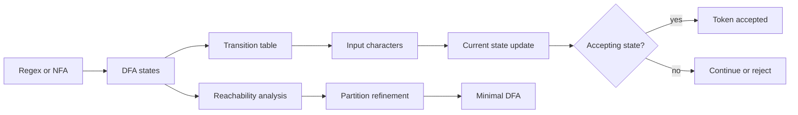
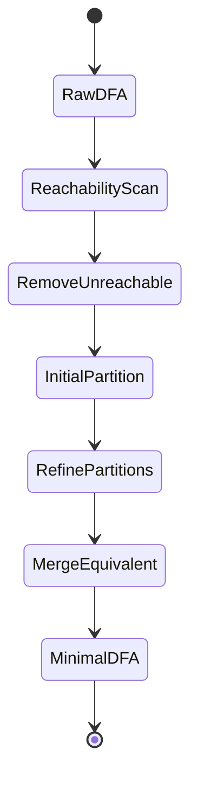
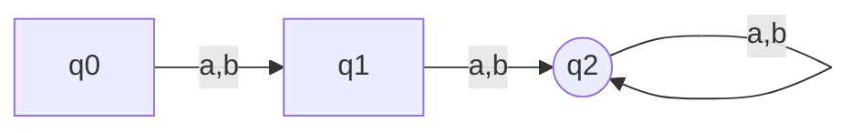

# DFA와 최소화 학습 및 기록 노트

## 1. 왜 필요한가? (Pain Point & Motivation)

DFA(Deterministic Finite Automaton)는 lexical analyzer가 token을 빠르게 판별하는 실행 모델이다. NFA보다 구현 시 상태 수가 많아질 수 있지만, 입력 문자마다 다음 상태가 하나로 결정되므로 scanner에서 table lookup으로 빠르게 실행할 수 있다. 다만 변환 과정에서 불필요한 상태가 생길 수 있어 최소화가 필요하다.

이 문서는 원문의 DFA 최소화 설명을 결정적 실행 모델, unreachable state 제거, equivalent state 병합 중심으로 재작성한다.

## 2. 현재 나의 상태 (Baseline)

- DFA가 상태와 전이로 구성된다는 사실은 알고 있다.
- NFA와 달리 DFA는 같은 상태와 입력 symbol에 대해 다음 상태가 하나뿐이라는 점을 명확히 해야 한다.
- NFA-to-DFA 변환 뒤 상태 수가 커질 수 있고, 최소화로 줄일 수 있음을 이해해야 한다.
- 도달 불가능 상태와 동등 상태가 서로 다른 제거 대상임을 구분해야 한다.
- 최소 DFA가 원래 DFA와 같은 언어를 인식해야 한다는 불변식을 기억해야 한다.

## 3. 도달하고 싶은 목표 (Target State)

- DFA를 `Q`, `Sigma`, `delta`, `q0`, `F`로 설명한다.
- Scanner가 DFA transition table을 이용해 token을 판별하는 흐름을 이해한다.
- 시작 상태에서 도달 불가능한 상태를 BFS/DFS로 제거한다.
- Final/non-final 분할에서 시작해 동등 상태를 refinement로 병합한다.
- 최소화 후에도 인식 언어가 바뀌지 않는지 검증한다.

## 4. 시스템 번역 (Data Flow)



DFA는 실행 시 현재 상태 하나만 유지한다. 최소화는 실행 전 분석 단계에서 같은 언어를 유지하면서 상태 수를 줄이는 작업이다.

## 5. 핵심 구성요소 (Building Blocks)

| 구성요소 | 의미 | 핵심 질문 |
| --- | --- | --- |
| `Q` | 상태 집합 | 어떤 단계들을 상태로 표현하는가? |
| `Sigma` | 입력 alphabet | scanner가 읽는 문자는 무엇인가? |
| `delta` | 전이 함수 | `delta(state, symbol)`이 하나로 결정되는가? |
| `q0` | 시작 상태 | 탐색과 실행은 어디서 시작하는가? |
| `F` | accepting state 집합 | 어떤 상태에서 token이 완성되는가? |
| Reachability | 시작 상태에서 닿는 상태 | 불필요한 상태가 있는가? |
| Partition | 동등성 후보 그룹 | final/non-final을 구분했는가? |
| Refinement | 그룹 세분화 | 같은 입력에서 같은 그룹으로 이동하는가? |

## 6. 상태 전이 (State Transition)



최소화는 먼저 시작 상태에서 닿을 수 없는 상태를 제거하고, 남은 상태를 final/non-final로 나눈 뒤 전이 패턴이 같은 상태들을 같은 그룹으로 유지한다.

## 7. 불변식 (Invariant: 절대 깨지면 안 되는 규칙)

- DFA의 전이 함수는 현재 상태와 입력 symbol에 대해 다음 상태를 하나만 반환해야 한다.
- 시작 상태에서 도달 불가능한 상태는 제거해도 인식 언어가 바뀌지 않는다.
- Final state와 non-final state는 같은 동등 그룹에 들어가면 안 된다.
- 두 상태가 동등하려면 모든 가능한 suffix 입력에 대해 accept/reject 결과가 같아야 한다.
- Partition refinement는 더 이상 그룹이 쪼개지지 않을 때까지 반복해야 한다.
- 최소화 결과 DFA는 원래 DFA와 같은 언어를 인식해야 한다.

## 8. 가장 작은 예제 (Minimal Viable Example)



```text
초기 분할:
non-final = {q0, q1}
final = {q2}

refinement:
q0 --a,b--> q1(non-final)
q1 --a,b--> q2(final)
따라서 q0과 q1은 구별 가능
```

이 예제는 final/non-final 분할만으로 끝나지 않고, 같은 입력에서 이동하는 그룹을 비교해 상태를 더 나누어야 함을 보여준다.

## 9. 실패 사례 (What could go wrong?)

- NFA처럼 여러 다음 상태를 허용해 DFA transition table을 잘못 만든다.
- 시작 상태에서 닿지 않는 상태를 남겨 scanner table을 불필요하게 키운다.
- Final state와 non-final state를 병합해 accept/reject 의미를 바꾼다.
- 한 번만 partition을 나누고 refinement fixpoint까지 반복하지 않는다.
- 최소화 후 token 우선순위나 longest match 규칙과의 관계를 확인하지 않는다.
- Error/dead state를 누락해 일부 입력에서 transition이 정의되지 않는다.

## 10. 뇌 확장하기 (Evolution & Variants)

- NFA-to-DFA subset construction에서 생성된 상태 집합을 최소화 입력으로 사용한다.
- Hopcroft 알고리즘은 partition refinement를 더 효율적으로 수행한다.
- Lexer 구현에서는 accepting state에 token type과 priority metadata를 함께 둔다.
- Unicode나 character class가 커지면 alphabet compression과 transition table 압축이 필요하다.
- DFA 기반 scanner와 backtracking regex engine의 성능 차이를 비교한다.

## 11. 최종 체크리스트 (Definition of Done)

- [x] DFA의 결정적 전이 모델을 설명했다.
- [x] Reachability 제거와 equivalent state 병합을 분리했다.
- [x] Partition refinement의 핵심 규칙을 정리했다.
- [x] 최소 DFA가 같은 언어를 인식해야 한다는 불변식을 포함했다.
- [x] 원문 DFA 최소화 문서를 12개 섹션 템플릿으로 재작성했다.

## 12. 뇌에 새기는 복습 문장 (TL;DR Blank)

DFA 최소화는 상태 수를 줄이는 작업이지만, 시작 상태에서 읽는 모든 문자열의 accept/reject 결과는 절대 바꾸면 안 된다.
