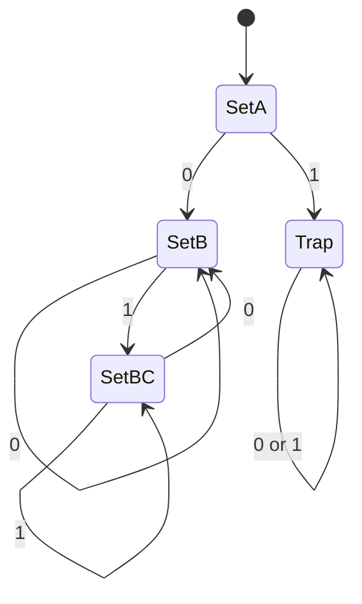
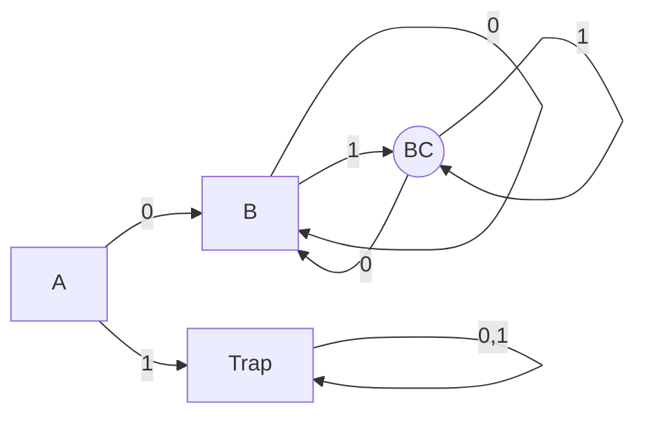

# NFA to DFA 변환 학습 및 기록 노트

## 1. 왜 필요한가? (Pain Point & Motivation)

정규표현식은 보통 NFA로 만들기 쉽지만, 실제 scanner는 입력 문자마다 다음 상태가 하나로 결정되는 DFA가 더 실행하기 쉽다. NFA-to-DFA 변환은 여러 NFA 상태의 가능성을 하나의 DFA 상태 집합으로 묶어 deterministic execution model로 바꾸는 과정이다.

이 문서는 정규표현식 `0(0|1)*1`을 예제로 subset construction 과정을 재작성한다.

## 2. 현재 나의 상태 (Baseline)

- NFA는 한 상태와 입력에서 여러 다음 상태로 갈 수 있다는 점을 알고 있다.
- DFA는 한 상태와 입력에서 다음 상태가 하나로 결정된다는 점을 알고 있다.
- NFA 상태 집합을 DFA 상태 하나로 보는 subset construction이 아직 직관적이지 않다.
- Trap state와 accepting state가 언제 생기는지 예제로 확인해야 한다.

## 3. 도달하고 싶은 목표 (Target State)

- `0(0|1)*1`이 0으로 시작하고 1로 끝나는 binary string을 인식함을 설명한다.
- NFA 상태 집합 `{A}`, `{B}`, `{B,C}`를 DFA state로 바꾸는 과정을 따라간다.
- DFA 전이표를 보고 입력 문자열의 accept/reject를 판단한다.
- NFA의 nondeterministic branch가 DFA의 state set으로 흡수되는 방식을 이해한다.

## 4. 시스템 번역 (Data Flow)

```mermaid
flowchart LR
    A[Regex: 0(0|1)*1] --> B[NFA]
    B --> C[Start set: {A}]
    C --> D[Move on symbol]
    D --> E[Reachable NFA state set]
    E --> F[DFA state]
    F --> G[Transition table]
    G --> H[DFA execution]
```

Subset construction은 "현재 NFA가 있을 수 있는 모든 상태"를 하나의 DFA 상태로 이름 붙이는 작업이다.

## 5. 핵심 구성요소 (Building Blocks)

| 구성요소 | 예제 값 | 의미 |
| --- | --- | --- |
| Alphabet | `{0, 1}` | 입력 symbol 집합 |
| Regex | `0(0|1)*1` | 0으로 시작하고 1로 끝나는 문자열 |
| NFA start | `A` | 변환 시작 상태 |
| NFA accept | `C` | 수락 상태 |
| DFA state `A` | `{A}` | 아직 첫 0을 읽기 전 |
| DFA state `B` | `{B}` | 첫 0을 읽고 중간부를 읽는 상태 |
| DFA state `BC` | `{B, C}` | 마지막 1일 수도 있고 계속 읽을 수도 있는 상태 |
| Trap | `empty set` | 가능한 NFA 상태가 없는 상태 |

## 6. 상태 전이 (State Transition)



`SetBC`는 NFA 상태 집합 `{B, C}`를 뜻한다. 이 집합에 accepting state `C`가 포함되므로 DFA에서도 accepting state가 된다.

## 7. 불변식 (Invariant: 절대 깨지면 안 되는 규칙)

- DFA state는 NFA state의 집합으로 표현되어야 한다.
- DFA state set에 NFA accepting state가 하나라도 포함되면 DFA accepting state가 된다.
- 어떤 입력 symbol에 대해 가능한 NFA 다음 상태가 없으면 `empty set` 또는 trap state로 이동한다.
- 변환된 DFA는 원래 NFA와 같은 언어를 인식해야 한다.
- DFA 실행 중에는 현재 DFA state 하나만 유지해야 한다.

## 8. 가장 작은 예제 (Minimal Viable Example)

| DFA 상태 | NFA 집합 | 수락 상태? | `0` 입력 | `1` 입력 |
| --- | --- | --- | --- | --- |
| `A` | `{A}` | no | `B` | `Trap` |
| `B` | `{B}` | no | `B` | `BC` |
| `BC` | `{B,C}` | yes | `B` | `BC` |
| `Trap` | `empty set` | no | `Trap` | `Trap` |



예를 들어 `01011010101`은 `A -> B -> B -> BC -> BC -> B -> B -> BC -> B -> B -> BC`로 끝나며 `BC`가 accepting state라서 accept된다.

## 9. 실패 사례 (What could go wrong?)

- NFA 상태 집합을 하나의 DFA state로 다루지 않고 임의로 상태 이름을 붙인다.
- `{B,C}`처럼 accepting state가 포함된 집합을 non-accepting으로 표시한다.
- Trap state를 생략해 DFA 전이 함수가 일부 입력에서 정의되지 않는다.
- 예제 문자열 경로를 NFA branch와 DFA state set 개념을 섞어 잘못 추적한다.
- Subset construction 후 최소화를 하지 않아 불필요한 DFA 상태가 남는다.

## 10. 뇌 확장하기 (Evolution & Variants)

- ε-transition이 있는 NFA에서는 각 단계마다 ε-closure를 먼저 계산해야 한다.
- 변환 후 DFA 최소화로 동등 상태를 병합할 수 있다.
- 실제 lexer에서는 accepting state에 token type, priority, longest-match 정보를 붙인다.
- Regex engine은 DFA, NFA simulation, backtracking VM 방식의 trade-off를 비교할 수 있다.

## 11. 최종 체크리스트 (Definition of Done)

- [x] `0(0|1)*1` 예제를 NFA state set 기반 DFA로 변환했다.
- [x] DFA 전이표와 상태도를 포함했다.
- [x] Accepting state 판단 규칙을 정리했다.
- [x] Trap state와 예제 문자열 경로를 명확히 했다.
- [x] 원문 NFA-to-DFA 문서를 12개 섹션 템플릿으로 재작성했다.

## 12. 뇌에 새기는 복습 문장 (TL;DR Blank)

NFA-to-DFA 변환의 핵심은 NFA가 동시에 있을 수 있는 상태 집합을 DFA의 단일 상태로 보는 것이다.
