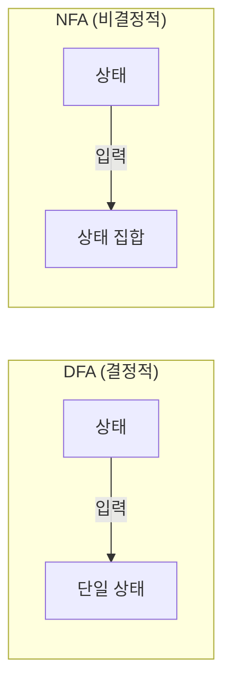
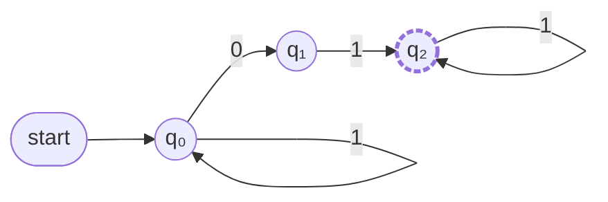
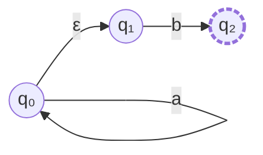
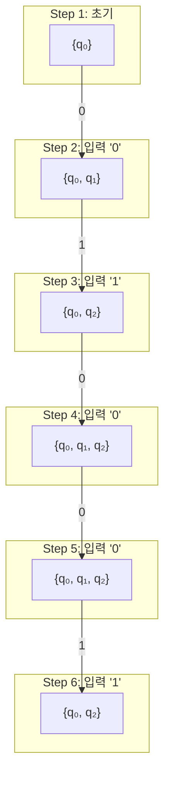
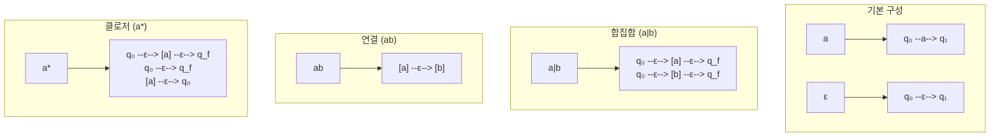
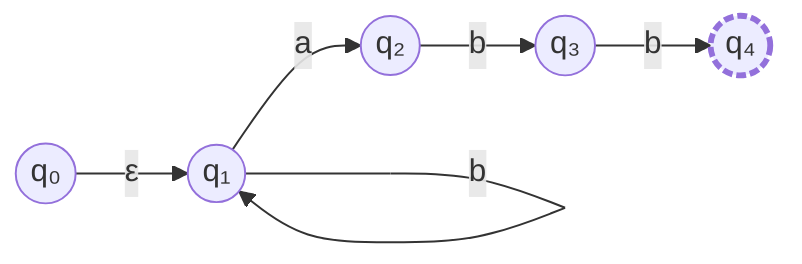
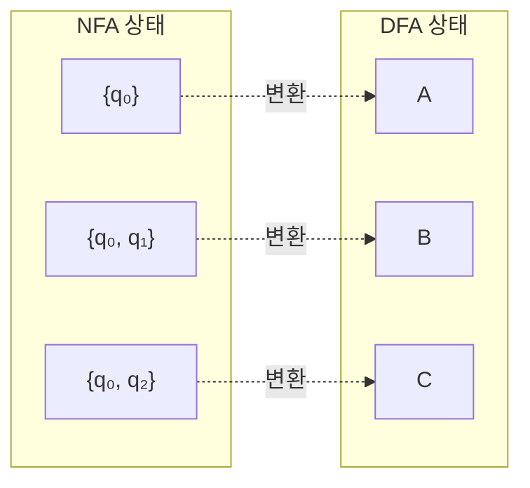

# NFA (비결정적 유한 오토마타)

Non-deterministic Finite Automaton의 개념, 구성요소, 동작 원리를 설명합니다.

---

## 📋 개요

**NFA (Non-deterministic Finite Automaton)**는 하나의 입력에 대해 여러 상태로 전이할 수 있는 유한 오토마타입니다.



### DFA vs NFA 비교

| 특성 | DFA | NFA |
|------|-----|-----|
| 전이 결과 | 단일 상태 | 상태 집합 |
| ε-전이 | 불가능 | 가능 |
| 구현 복잡도 | 높음 | 낮음 |
| 실행 복잡도 | O(n) | O(n × \|Q\|²) |
| 표현력 | 동일 | 동일 |

---

## 🔧 NFA의 5가지 구성 요소

NFA는 5-튜플 **(Q, Σ, δ, q₀, F)**로 정의됩니다.

| 구성 요소 | 기호 | 설명 | 예시 |
|:---:|:---:|:---|:---|
| **상태 집합** | Q | 오토마타의 모든 상태 | {q₀, q₁, q₂} |
| **입력 알파벳** | Σ | 허용되는 입력 기호 | {0, 1} |
| **전이 함수** | δ | 상태 전이 규칙 | δ: Q × Σ → P(Q) |
| **시작 상태** | q₀ | 초기 상태 | q₀ ∈ Q |
| **종료 상태** | F | 수락 상태 집합 | {q₂} ⊆ Q |

### 수학적 정의

$$NFA = (Q, \Sigma, \delta, q_0, F)$$

여기서:
- $Q$: 유한한 상태 집합
- $\Sigma$: 입력 알파벳 (유한 집합)
- $\delta: Q \times \Sigma \rightarrow P(Q)$: 전이 함수
- $q_0 \in Q$: 시작 상태
- $F \subseteq Q$: 종료 상태 집합

---

## 📊 NFA 상태도

### 예제: "01"을 포함하는 문자열 인식



**설명:**
- **q₀**: 시작 상태 - "01" 패턴 탐색 중
- **q₁**: "0"을 읽은 상태 - "1"을 기다리는 중
- **q₂**: 종료 상태 - "01" 패턴 발견됨

---

## 📋 전이 테이블 (Transition Table)

|   | **0** | **1** |
|:-:|:-----:|:-----:|
| **→ q₀** | {q₀, q₁} | {q₀} |
| **q₁**   | ∅        | {q₂} |
| **★ q₂** | {q₂}     | {q₂} |

**범례:**
- **→**: 시작 상태 (initial state)
- **★**: 종료 상태 (accepting state)
- **∅**: 전이 없음 (dead state로 이동)

### 테이블 해석

| 현재 상태 | 입력 | 다음 상태 | 설명 |
|:---:|:---:|:---:|:---|
| q₀ | 0 | {q₀, q₁} | "01" 시작이거나, 계속 탐색 |
| q₀ | 1 | {q₀} | "01" 시작 아님, 계속 탐색 |
| q₁ | 0 | ∅ | "00"이므로 실패 |
| q₁ | 1 | {q₂} | "01" 패턴 완성! |
| q₂ | 0, 1 | {q₂} | 나머지 입력 소비 |

---

## ⚡ ε-전이 (Epsilon Transition)

NFA는 입력 없이도 상태를 전이할 수 있는 **ε-전이**를 지원합니다.



### ε-클로저 (ε-closure)

상태 q에서 ε-전이만으로 도달 가능한 모든 상태의 집합

$$\epsilon\text{-}closure(q) = \{q\} \cup \{p : q \xrightarrow{\epsilon^*} p\}$$

**예시:**
```
ε-closure(q₀) = {q₀, q₁}  // q₀에서 ε로 q₁ 도달 가능
ε-closure(q₁) = {q₁}      // ε-전이 없음
```

---

## 🔄 NFA 실행 과정

### 입력: "01001"



**결과:** q₂ ∈ F를 포함하므로 **수락 (Accept)**

### 시뮬레이션 테이블

| 단계 | 입력 | 현재 상태 집합 | 다음 상태 집합 |
|:---:|:---:|:---:|:---:|
| 0 | - | {q₀} | - |
| 1 | 0 | {q₀} | {q₀, q₁} |
| 2 | 1 | {q₀, q₁} | {q₀} ∪ {q₂} = {q₀, q₂} |
| 3 | 0 | {q₀, q₂} | {q₀, q₁} ∪ {q₂} = {q₀, q₁, q₂} |
| 4 | 0 | {q₀, q₁, q₂} | {q₀, q₁} ∪ ∅ ∪ {q₂} = {q₀, q₁, q₂} |
| 5 | 1 | {q₀, q₁, q₂} | {q₀} ∪ {q₂} ∪ {q₂} = {q₀, q₂} |

---

## 🔀 정규표현식과 NFA

### Thompson 구성법

정규표현식을 NFA로 변환하는 체계적인 방법



### 예제: (a|b)*abb



---

## 💻 구현 예제

### Python 구현

```python
class NFA:
    def __init__(self, states, alphabet, transitions, start, accepts):
        self.states = states          # 상태 집합
        self.alphabet = alphabet      # 입력 알파벳
        self.transitions = transitions # 전이 함수 (dict)
        self.start = start            # 시작 상태
        self.accepts = accepts        # 종료 상태 집합
    
    def epsilon_closure(self, states):
        """ε-클로저 계산"""
        closure = set(states)
        stack = list(states)
        
        while stack:
            state = stack.pop()
            # ε-전이로 도달 가능한 상태 추가
            for next_state in self.transitions.get((state, 'ε'), set()):
                if next_state not in closure:
                    closure.add(next_state)
                    stack.append(next_state)
        
        return closure
    
    def move(self, states, symbol):
        """상태 집합에서 symbol로 이동 가능한 상태 집합"""
        result = set()
        for state in states:
            result.update(self.transitions.get((state, symbol), set()))
        return result
    
    def accepts_string(self, input_string):
        """문자열 수락 여부 확인"""
        current = self.epsilon_closure({self.start})
        
        for symbol in input_string:
            current = self.epsilon_closure(self.move(current, symbol))
        
        # 최종 상태가 종료 상태를 포함하는지 확인
        return bool(current & self.accepts)


# 예제: "01"을 포함하는 문자열 인식 NFA
nfa = NFA(
    states={'q0', 'q1', 'q2'},
    alphabet={'0', '1'},
    transitions={
        ('q0', '0'): {'q0', 'q1'},
        ('q0', '1'): {'q0'},
        ('q1', '1'): {'q2'},
        ('q2', '0'): {'q2'},
        ('q2', '1'): {'q2'},
    },
    start='q0',
    accepts={'q2'}
)

# 테스트
print(nfa.accepts_string("01"))     # True
print(nfa.accepts_string("1001"))   # True
print(nfa.accepts_string("111"))    # False
```

---

## 🔗 NFA → DFA 변환 (부분집합 구성법)

NFA의 각 상태 집합을 DFA의 단일 상태로 변환합니다.



자세한 내용은 [NFA to DFA 변환](nfa-to-dfa.md) 문서를 참조하세요.

---

## 📚 연습 문제

### 문제 1
다음 언어를 인식하는 NFA를 설계하세요:
- L = {w | w는 "ab"로 끝남}

### 문제 2
다음 NFA의 언어를 설명하세요:

| | 0 | 1 |
|:-:|:-:|:-:|
| →q₀ | {q₀, q₁} | {q₀} |
| ★q₁ | ∅ | ∅ |

### 문제 3
정규표현식 `(0|1)*00`에 대한 NFA를 Thompson 구성법으로 만드세요.

---

## 🔗 관련 문서

- [NFA → DFA 변환](nfa-to-dfa.md)
- [DFA 개요](dfa.md)
- [컴파일러 개요](../index.md)

---

## 📖 참고 자료

- Hopcroft, Motwani, Ullman - "Introduction to Automata Theory"
- Michael Sipser - "Introduction to the Theory of Computation"
- [Visualizing NFA](https://www.jflap.org/) - JFLAP 도구
