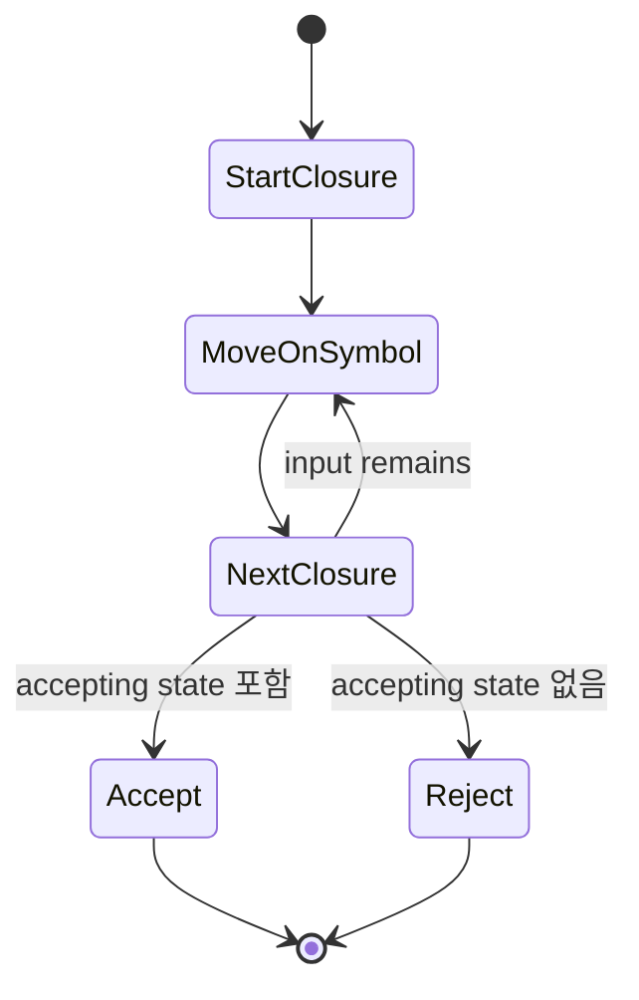
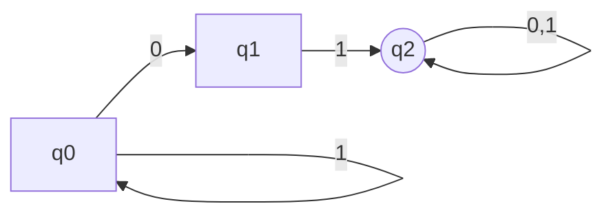

# NFA 학습 및 기록 노트

## 1. 왜 필요한가? (Pain Point & Motivation)

NFA(Non-deterministic Finite Automaton)는 정규표현식을 automata로 바꾸기 쉬운 중간 표현이다. 하나의 상태와 입력 symbol에서 여러 다음 상태로 갈 수 있고, 입력 없이 이동하는 ε-transition도 허용할 수 있다. 이 구조는 설계는 단순하지만 실행 시에는 가능한 상태 집합을 계속 추적해야 한다.

이 문서는 원문의 NFA 개념, ε-closure, 실행 시뮬레이션, Thompson construction 내용을 상태 집합 data flow 중심으로 재작성한다.

## 2. 현재 나의 상태 (Baseline)

- NFA와 DFA가 finite automaton이라는 점은 알고 있다.
- NFA의 전이 결과가 단일 상태가 아니라 상태 집합이라는 점을 명확히 해야 한다.
- ε-transition과 ε-closure가 왜 필요한지 예제로 확인해야 한다.
- 문자열을 읽을 때 NFA가 현재 가능한 상태 집합을 어떻게 갱신하는지 이해해야 한다.
- NFA가 DFA와 표현력은 같지만 실행 모델과 변환 비용이 다르다는 점을 정리해야 한다.

## 3. 도달하고 싶은 목표 (Target State)

- NFA를 `(Q, Sigma, delta, q0, F)`로 정의한다.
- `delta: Q x (Sigma union {epsilon}) -> P(Q)`의 의미를 설명한다.
- 입력 문자열을 상태 집합으로 시뮬레이션한다.
- ε-closure를 포함해 다음 상태 집합을 계산한다.
- NFA가 subset construction을 통해 DFA로 변환될 수 있음을 이해한다.

## 4. 시스템 번역 (Data Flow)

```mermaid
flowchart TD
    A[Regex] --> B[Thompson construction]
    B --> C[NFA states/transitions]
    C --> D[epsilon-closure of start]
    D --> E[Read next symbol]
    E --> F[move(current states, symbol)]
    F --> G[epsilon-closure]
    G --> H{Any accepting state?}
    H -->|after input end yes| I[Accept]
    H -->|after input end no| J[Reject]
    G --> E
```

NFA 실행은 현재 상태 하나를 추적하는 것이 아니라, 현재 도달 가능성이 있는 상태 집합을 갱신하는 과정이다.

## 5. 핵심 구성요소 (Building Blocks)

| 구성요소 | 의미 | 예시 |
| --- | --- | --- |
| `Q` | 상태 집합 | `{q0, q1, q2}` |
| `Sigma` | 입력 alphabet | `{0, 1}` |
| `delta` | 전이 함수 | `delta(q0, 0) = {q0, q1}` |
| `q0` | 시작 상태 | `q0` |
| `F` | accepting state 집합 | `{q2}` |
| ε-transition | 입력 없이 이동 | `q0 --epsilon--> q1` |
| ε-closure | ε만으로 도달 가능한 상태 집합 | `{q0, q1}` |
| State-set simulation | 가능한 상태 전체 추적 | `{q0, q1, q2}` |

## 6. 상태 전이 (State Transition)



입력 symbol을 하나 읽을 때마다 먼저 가능한 모든 transition을 모으고, 그 결과에 ε-closure를 적용한다. 입력을 모두 소비한 뒤 상태 집합에 accepting state가 있으면 accept다.

## 7. 불변식 (Invariant: 절대 깨지면 안 되는 규칙)

- NFA 전이 결과는 상태 하나가 아니라 상태 집합일 수 있다.
- ε-transition은 입력을 소비하지 않아야 한다.
- ε-closure는 자기 자신을 항상 포함해야 한다.
- 문자열 accept 여부는 입력을 모두 소비한 뒤 현재 상태 집합과 accepting state 집합의 교집합으로 판단한다.
- NFA와 DFA는 같은 정규 언어를 표현할 수 있어야 한다.
- NFA를 DFA로 바꿀 때 NFA state set 하나가 DFA state 하나가 된다.

## 8. 가장 작은 예제 (Minimal Viable Example)



이 NFA는 문자열 안에 `01`이 포함되면 accept한다.

| 단계 | 입력 | 현재 상태 집합 | 다음 상태 집합 |
| --- | --- | --- | --- |
| 0 | start | `{q0}` | `{q0}` |
| 1 | `0` | `{q0}` | `{q0, q1}` |
| 2 | `1` | `{q0, q1}` | `{q0, q2}` |
| 3 | `0` | `{q0, q2}` | `{q0, q1, q2}` |

상태 집합에 `q2`가 포함된 뒤에는 accepting possibility가 유지되므로, 입력 종료 시 `q2`가 포함되어 있으면 accept된다.

## 9. 실패 사례 (What could go wrong?)

- NFA를 실행하면서 현재 상태 하나만 저장해 nondeterministic branch를 잃는다.
- ε-closure 계산에서 시작 상태 자신을 빼먹는다.
- ε-transition을 입력 소비 transition처럼 처리해 문자열 위치가 밀린다.
- Accepting state에 도달한 적이 있다는 사실만으로 즉시 accept하고 남은 입력을 무시한다.
- NFA-to-DFA 변환에서 상태 집합을 중복 생성해 같은 DFA state를 여러 개 만든다.
- Dead transition을 empty set으로 표현하지 않아 시뮬레이션 결과가 불명확해진다.

## 10. 뇌 확장하기 (Evolution & Variants)

- Thompson construction은 regex의 union, concatenation, star를 ε-transition이 있는 NFA로 조립한다.
- Subset construction은 NFA state set을 DFA state로 바꾸며, 자세한 흐름은 [NFA to DFA 변환](nfa-to-dfa.md)에서 다룬다.
- DFA 최소화는 변환 후 불필요하거나 동등한 상태를 줄이며, [DFA 개요](dfa.md)와 연결된다.
- 실제 lexer에서는 NFA를 직접 시뮬레이션하기보다 DFA table로 변환해 실행하는 경우가 많다.
- JFLAP 같은 도구로 NFA, DFA, ε-closure를 시각적으로 검증할 수 있다.

## 11. 최종 체크리스트 (Definition of Done)

- [x] NFA의 5-tuple과 전이 함수 의미를 정리했다.
- [x] ε-transition과 ε-closure의 역할을 설명했다.
- [x] 상태 집합 기반 실행 예제를 포함했다.
- [x] NFA-to-DFA 변환과 DFA 최소화로 이어지는 학습 경로를 연결했다.
- [x] 원문 NFA 문서를 12개 섹션 템플릿으로 재작성했다.

## 12. 뇌에 새기는 복습 문장 (TL;DR Blank)

NFA는 한 번에 하나의 상태만 갖는 기계가 아니라, 현재 가능성이 있는 상태 집합을 움직이며 문자열을 인식하는 모델이다.
