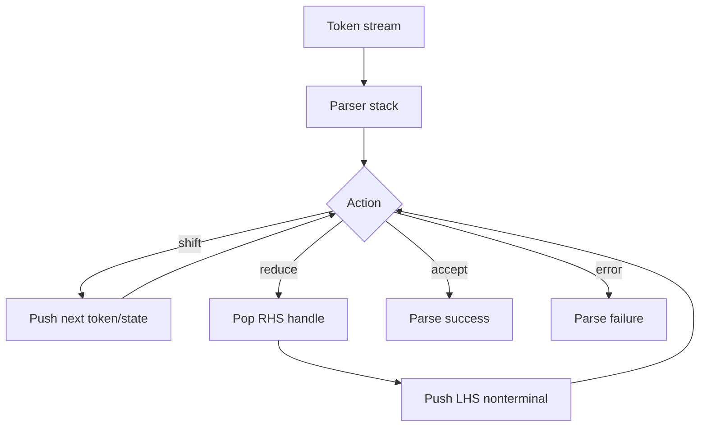
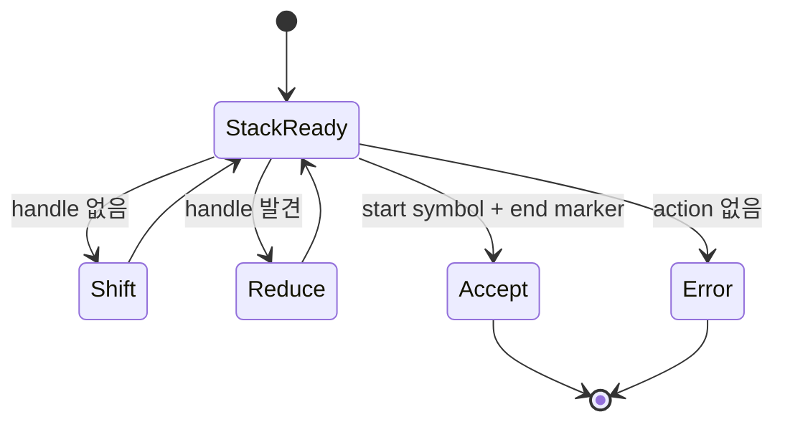

# Bottom-Up Parsing 학습 및 기록 노트

## 1. 왜 필요한가? (Pain Point & Motivation)

Bottom-up parsing은 입력 token을 leaf에서 시작해 grammar의 start symbol로 reduce하는 방식이다. Top-down parser가 "무엇을 만들어야 하는가?"를 예측한다면, bottom-up parser는 "지금 stack 위의 token들이 어떤 production의 RHS인가?"를 찾는다. 이 관점은 LR parser, shift-reduce parser, parser table conflict를 이해하는 기반이다.

이 문서는 원문의 bottom-up parsing 설명을 stack, handle, shift/reduce state transition 중심으로 재작성한다.

## 2. 현재 나의 상태 (Baseline)

- Parser가 token stream을 grammar 구조로 검증한다는 점은 알고 있다.
- Bottom-up parsing이 rightmost derivation을 역순으로 추적한다는 의미를 더 명확히 해야 한다.
- Shift와 reduce가 parser stack에서 어떤 변화를 만드는지 예제로 확인해야 한다.
- Handle을 잘못 선택하면 conflict나 잘못된 parse가 생긴다는 점을 이해해야 한다.
- LR parser의 Action/Goto table이 bottom-up parsing을 자동화한다는 연결이 필요하다.

## 3. 도달하고 싶은 목표 (Target State)

- Bottom-up parsing을 terminal에서 start symbol로 환원하는 과정으로 설명한다.
- Shift, reduce, accept, error action을 구분한다.
- Handle이 production RHS와 일치하는 stack suffix임을 이해한다.
- `n + n` 같은 작은 입력을 stack 변화로 추적한다.
- Shift/reduce conflict와 reduce/reduce conflict가 왜 생기는지 설명한다.

## 4. 시스템 번역 (Data Flow)



Bottom-up parser는 입력을 왼쪽에서 오른쪽으로 읽으면서 stack top에 handle이 생기는 순간 production을 역적용한다.

## 5. 핵심 구성요소 (Building Blocks)

| 구성요소 | 역할 | 핵심 질문 |
| --- | --- | --- |
| Token stream | lexer가 만든 입력 | 다음에 shift할 symbol은 무엇인가? |
| Parser stack | symbol/state 누적 | stack suffix가 handle인가? |
| Shift | input token을 stack에 push | 더 읽어야 하는가? |
| Reduce | RHS를 LHS로 환원 | 어떤 production을 적용하는가? |
| Handle | reduce 가능한 RHS instance | rightmost derivation의 역순인가? |
| Action table | shift/reduce/accept/error 결정 | lookahead별 action이 하나인가? |
| Goto table | nonterminal reduce 후 state 이동 | LHS로 어디로 가는가? |
| Conflict | action이 하나로 결정되지 않음 | grammar나 precedence가 필요한가? |

## 6. 상태 전이 (State Transition)



LR parser는 이 상태 전이를 수동 판단하지 않고, 현재 state와 lookahead token으로 Action/Goto table을 조회해 수행한다.

## 7. 불변식 (Invariant: 절대 깨지면 안 되는 규칙)

- Reduce는 stack top의 suffix가 어떤 production의 RHS일 때만 수행해야 한다.
- Accept는 start symbol과 input end marker가 올바르게 만났을 때만 가능하다.
- Shift와 reduce 중 어떤 action을 택할지 table에서 하나로 결정되어야 한다.
- Reduce/reduce conflict는 같은 stack/lookahead에서 적용 가능한 production이 둘 이상이라는 뜻이다.
- Shift/reduce conflict는 더 읽을지 지금 reduce할지 문법이 충분히 구분하지 못한다는 뜻이다.
- Bottom-up parser는 rightmost derivation을 역순으로 복원해야 한다.

## 8. 가장 작은 예제 (Minimal Viable Example)

문법:

```text
E' -> E
E  -> E + n
E  -> n
```

입력 `n + n`의 stack 변화:

| 단계 | Stack | Input | Action |
| --- | --- | --- | --- |
| 0 | `$` | `n + n $` | shift `n` |
| 1 | `$ n` | `+ n $` | reduce `E -> n` |
| 2 | `$ E` | `+ n $` | shift `+` |
| 3 | `$ E +` | `n $` | shift `n` |
| 4 | `$ E + n` | `$` | reduce `E -> E + n` |
| 5 | `$ E` | `$` | reduce `E' -> E` |
| 6 | `$ E'` | `$` | accept |

이 예제는 terminal을 먼저 쌓고, RHS handle을 찾을 때마다 nonterminal로 환원하는 bottom-up 흐름을 보여준다.

## 9. 실패 사례 (What could go wrong?)

- Handle이 아닌 stack suffix를 reduce해 잘못된 parse tree를 만든다.
- Lookahead를 보지 않고 greedy하게 reduce해 shift/reduce conflict를 만든다.
- Ambiguous grammar에서 precedence/associativity 없이 expression을 파싱하려고 한다.
- Reduce/reduce conflict를 production 순서로 덮고 실제 문법 모호성을 놓친다.
- Error action을 처리하지 않아 parser가 무한 loop를 돈다.
- LL parser의 predict/expand 관점과 LR parser의 shift/reduce 관점을 섞어 이해한다.

## 10. 뇌 확장하기 (Evolution & Variants)

- LR parser는 LR(0), SLR(1), LALR(1), canonical LR(1)로 확장된다.
- Expression parser는 precedence climbing이나 Pratt parser와 비교해 볼 수 있다.
- Parser generator는 conflict report를 통해 grammar 개선 지점을 알려준다.
- Error recovery는 panic mode, synchronizing token, error production으로 확장된다.
- 자세한 LR table 구조는 [LR 파서](lr-parser.md)에서 다룬다.

## 11. 최종 체크리스트 (Definition of Done)

- [x] Bottom-up parsing을 terminal에서 start symbol로 reduce하는 흐름으로 정리했다.
- [x] Shift, reduce, accept, error action을 구분했다.
- [x] `n + n` 최소 예제로 stack 변화를 설명했다.
- [x] Handle, conflict, LR Action/Goto table의 연결을 포함했다.
- [x] 원문 bottom-up parsing 문서를 12개 섹션 템플릿으로 재작성했다.

## 12. 뇌에 새기는 복습 문장 (TL;DR Blank)

Bottom-up parsing은 stack 위에서 handle을 찾아 production을 거꾸로 적용하며, token을 start symbol까지 환원하는 과정이다.
