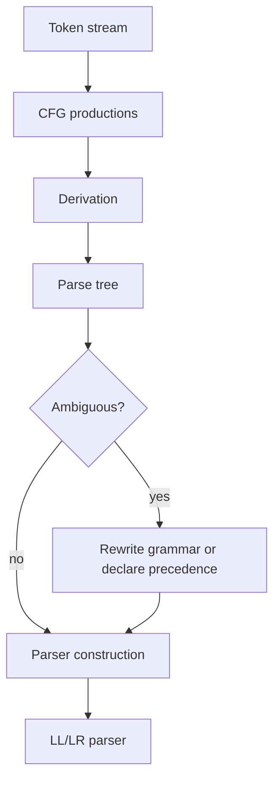
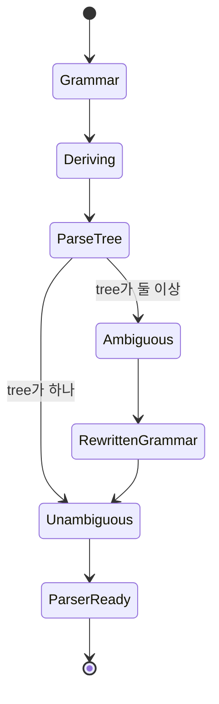
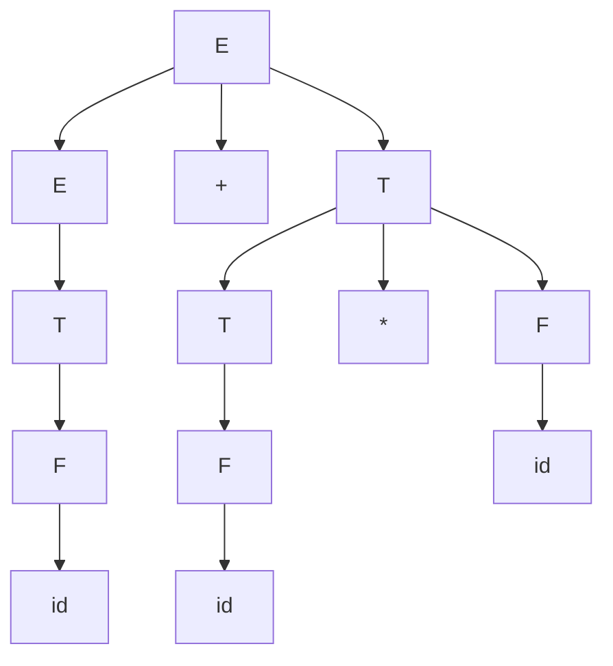

# Context-Free Grammar 학습 및 기록 노트

## 1. 왜 필요한가? (Pain Point & Motivation)

CFG(Context-Free Grammar)는 programming language syntax를 정의하는 핵심 도구다. Lexer가 token stream을 만들면 parser는 CFG production을 기준으로 token sequence가 올바른 구조인지 판단한다. CFG를 제대로 이해하지 못하면 parse tree, ambiguity, precedence, associativity, LL/LR parser 제약을 설명하기 어렵다.

이 문서는 원문의 Chomsky hierarchy와 CFG 설명을 문법 구성요소, derivation, parse tree, ambiguity 중심으로 재작성한다.

## 2. 현재 나의 상태 (Baseline)

- 정규 문법은 lexer와 연결되고, CFG는 parser와 연결된다는 정도는 알고 있다.
- CFG가 `G = (V, T, P, S)`로 정의된다는 점을 명확히 해야 한다.
- Derivation과 parse tree가 같은 구조를 다른 방식으로 표현한다는 점을 이해해야 한다.
- Ambiguous grammar가 같은 문자열에 여러 parse tree를 만들 수 있음을 예제로 확인해야 한다.
- Operator precedence와 associativity를 grammar 구조로 표현하는 방법이 필요하다.

## 3. 도달하고 싶은 목표 (Target State)

- Chomsky hierarchy에서 regular grammar와 CFG의 위치를 설명한다.
- CFG production `A -> gamma`의 의미를 이해한다.
- Arithmetic expression grammar로 parse tree를 만든다.
- Ambiguous grammar와 unambiguous grammar를 구분한다.
- LL/LR parser가 사용할 수 있도록 grammar를 정리하는 기준을 갖는다.

## 4. 시스템 번역 (Data Flow)



CFG는 token sequence를 tree 구조로 해석하는 계약이다. 문법이 모호하면 같은 input이 여러 tree와 의미로 해석될 수 있다.

## 5. 핵심 구성요소 (Building Blocks)

| 구성요소 | 의미 | 예시 |
| --- | --- | --- |
| `V` | nonterminal 집합 | `E`, `T`, `F` |
| `T` | terminal 집합 | `id`, `+`, `*`, `(`, `)` |
| `P` | production rule 집합 | `E -> E + T` |
| `S` | start symbol | `E` |
| Derivation | production을 적용해 문자열 생성 | `E => E + T => id + T` |
| Parse tree | derivation의 tree 표현 | root는 start symbol |
| Ambiguity | 한 문자열에 parse tree가 여러 개 | `id + id * id` |
| Precedence | 연산자 우선순위 | `*`가 `+`보다 먼저 |
| Associativity | 같은 우선순위 결합 방향 | left/right associative |

## 6. 상태 전이 (State Transition)



Parser가 안정적으로 동작하려면 grammar가 parser family의 제약을 만족하고, 같은 입력에 대해 의도한 parse tree를 하나로 결정해야 한다.

## 7. 불변식 (Invariant: 절대 깨지면 안 되는 규칙)

- CFG production의 왼쪽은 단 하나의 nonterminal이어야 한다.
- Terminal은 input token과 직접 대응되어야 한다.
- Start symbol에서 derive할 수 없는 production은 parser 관점에서 dead rule이 될 수 있다.
- Ambiguous grammar는 같은 token sequence에 여러 parse tree를 만들 수 있으므로 의미 분석 전에 해결해야 한다.
- Precedence와 associativity는 grammar rewrite 또는 parser generator 선언으로 일관되게 처리해야 한다.
- Grammar를 바꿔도 의도한 언어와 연산 의미는 보존되어야 한다.

## 8. 가장 작은 예제 (Minimal Viable Example)

모호하지 않은 산술식 문법:

```text
E -> E + T | T
T -> T * F | F
F -> ( E ) | id
```

입력:

```text
id + id * id
```



이 문법은 `*`를 `T` 계층에 두어 `+`보다 먼저 묶이게 만든다. 따라서 `id + (id * id)` 구조가 된다.

## 9. 실패 사례 (What could go wrong?)

- `E -> E + E | E * E | id`처럼 precedence가 없는 문법으로 expression을 정의해 ambiguity가 생긴다.
- Dangling else에서 `else`가 어느 `if`에 붙는지 명확히 하지 않는다.
- Parser generator conflict를 precedence 선언으로만 덮고 parse tree가 의도와 맞는지 확인하지 않는다.
- Left recursion이 있는 grammar를 LL recursive descent parser에 그대로 넣는다.
- 너무 넓은 CFG로 syntax 단계에서 잡아야 할 오류를 semantic 단계로 미룬다.
- Grammar rewrite 후 기존에 허용해야 할 문자열을 실수로 reject한다.

## 10. 뇌 확장하기 (Evolution & Variants)

- Chomsky hierarchy에서 Type-3 regular grammar는 lexer, Type-2 CFG는 parser에 주로 대응한다.
- CFG는 LL parser와 LR parser에서 요구하는 형태가 다르므로 left factoring, left recursion 제거, precedence rewrite가 필요할 수 있다.
- Attribute grammar는 parse tree에 type, scope, value 같은 semantic 정보를 붙인다.
- PEG나 parser combinator는 CFG 기반 parser와 다른 선택/백트래킹 semantics를 갖는다.
- 자세한 parser family는 [LL 파서](ll-parser.md), [LR 파서](lr-parser.md), [Bottom-Up](bottom-up.md) 문서와 연결된다.

## 11. 최종 체크리스트 (Definition of Done)

- [x] CFG의 4-tuple과 production rule 형태를 정리했다.
- [x] Derivation, parse tree, ambiguity의 관계를 설명했다.
- [x] Arithmetic expression grammar로 precedence를 표현했다.
- [x] Chomsky hierarchy에서 CFG의 위치를 요약했다.
- [x] 원문 CFG 문서를 12개 섹션 템플릿으로 재작성했다.

## 12. 뇌에 새기는 복습 문장 (TL;DR Blank)

CFG는 token stream을 의미 있는 syntax tree로 바꾸는 규칙이며, 좋은 grammar는 같은 입력을 의도한 하나의 tree로 해석하게 만든다.
