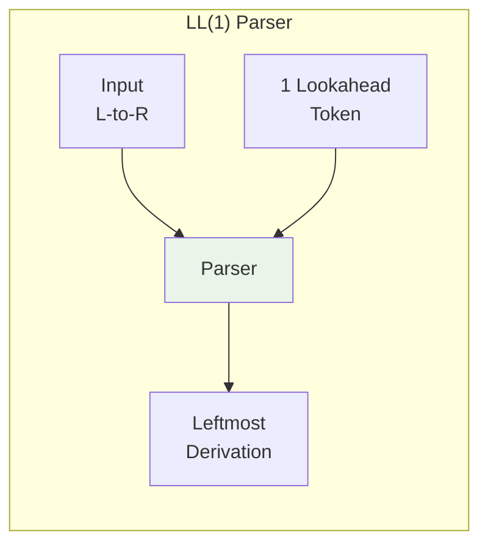
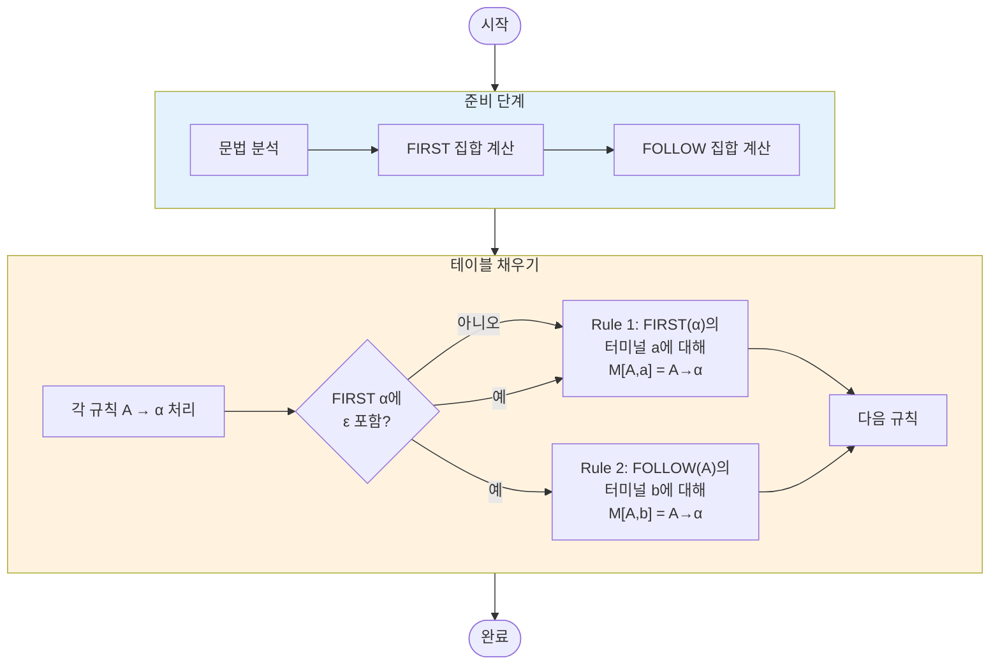
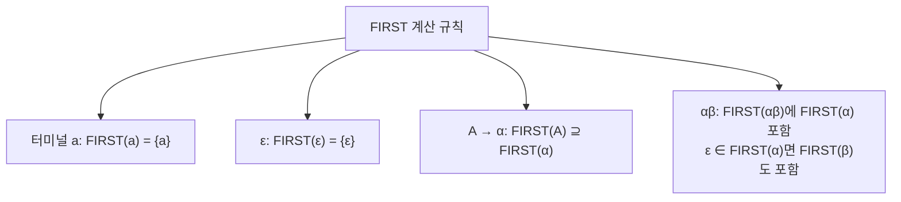
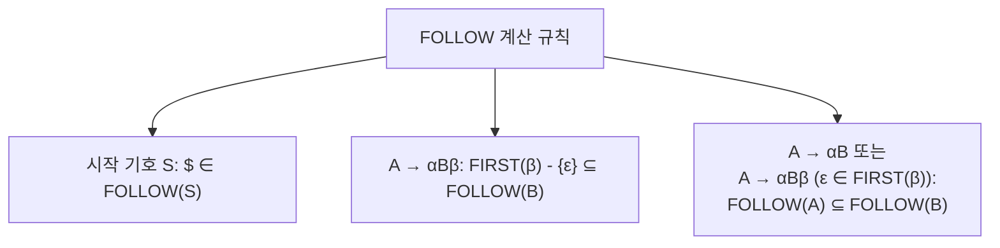
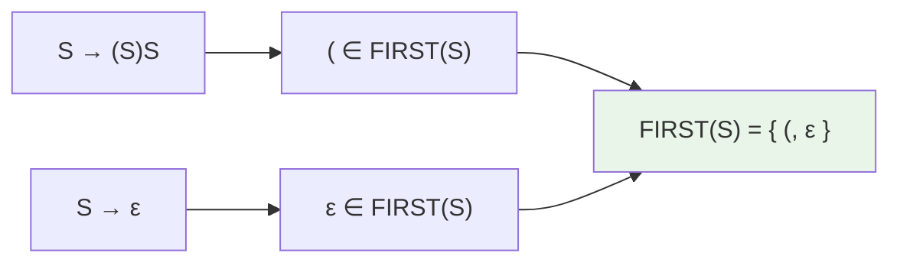
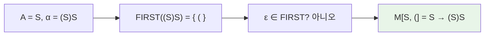
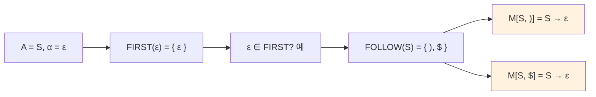
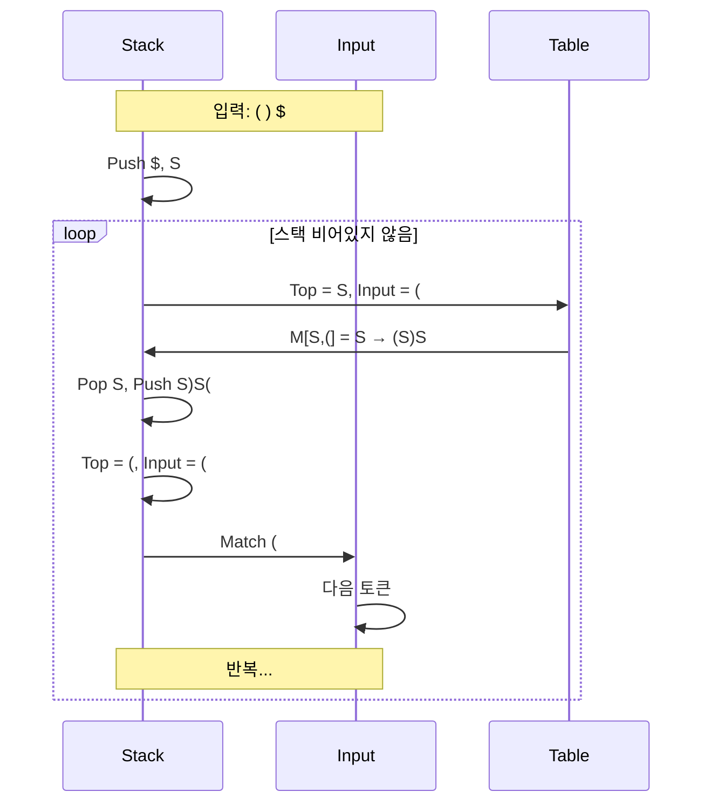

# LL(1) 파싱 테이블 생성

LL(1) 파싱 테이블을 생성하는 알고리즘과 과정을 설명합니다.

## 입력·산출물·완료 조건

- 입력은 증강 여부와 EOF가 명시된 문맥 자유 문법입니다. 필요하면 왼쪽 재귀 제거와 left factoring을 별도 변환으로 기록합니다.
- 산출물은 각 `(비단말, lookahead)`에 최대 하나의 생성 규칙 또는 error가 들어가는 표입니다.
- FIRST/FOLLOW 계산은 집합이 더 이상 변하지 않을 때 완료되며 ε의 전파와 EOF 포함 근거를 남깁니다.
- 한 셀에 둘 이상의 규칙이 들어가면 해당 문법이 현재 형태로 LL(1)이 아니라는 증거입니다. 임의 규칙 선택으로 충돌을 숨기지 않습니다.

## 개요

LL(1) 파서는 입력을 **왼쪽에서 오른쪽으로(Left-to-right)** 읽고, **최좌단 유도(Leftmost derivation)**를 수행하며, **1개의 선행 토큰(1 lookahead)**으로 결정을 내립니다.



---

## 테이블 생성 과정

LL(1) 파싱 테이블 생성은 두 단계로 이루어집니다:



---

## FIRST와 FOLLOW 집합

### FIRST 집합

**FIRST(α)**는 α에서 유도될 수 있는 문자열의 첫 번째 터미널 집합입니다.



### FOLLOW 집합

**FOLLOW(A)**는 논터미널 A 바로 뒤에 나올 수 있는 터미널 집합입니다.



---

## 테이블 생성 알고리즘

### 핵심 규칙

| 조건 | 테이블 항목 |
|------|------------|
| **Rule 1**: a ∈ FIRST(α), a ≠ ε | M[A, a] := A → α |
| **Rule 2**: ε ∈ FIRST(α), b ∈ FOLLOW(A) | M[A, b] := A → α |

### 의사 코드

```plaintext
for each 규칙 A → α in Grammar:
    for each 터미널 a in FIRST(α) - {ε}:
        M[A, a] := A → α
    
    if ε ∈ FIRST(α):
        for each 터미널 b in FOLLOW(A):
            M[A, b] := A → α
```

---

## 예제: 괄호 문법

### 문법 정의

$$
\begin{aligned}
S &\rightarrow (S)S \\
S &\rightarrow \epsilon
\end{aligned}
$$

### FIRST/FOLLOW 계산

#### FIRST(S) 계산



#### FOLLOW(S) 계산

1. S가 시작 기호 → **$** ∈ FOLLOW(S)
2. `S → (S)S`에서:
   - 첫 번째 S 뒤에 `)` → **)** ∈ FOLLOW(S)
   - 두 번째 S 뒤에 아무것도 없음 → FOLLOW(S) ⊆ FOLLOW(S)

$$\text{FOLLOW}(S) = \{ ), \$ \}$$

### 테이블 채우기

#### 규칙 1: S → (S)S



#### 규칙 2: S → ε



### 최종 파싱 테이블

|       | `(`            | `)`               | `$`               |
|:-----:|:--------------:|:-----------------:|:-----------------:|
| **S** | S → (S)S       | S → ε             | S → ε             |

---

## 더 복잡한 예제

### 산술 표현식 문법

$$
\begin{aligned}
E &\rightarrow TE' \\
E' &\rightarrow +TE' \mid \epsilon \\
T &\rightarrow FT' \\
T' &\rightarrow *FT' \mid \epsilon \\
F &\rightarrow (E) \mid id
\end{aligned}
$$

### 집합 계산 결과

| 논터미널 | FIRST | FOLLOW |
|---------|-------|--------|
| E | { (, id } | { $, ) } |
| E' | { +, ε } | { $, ) } |
| T | { (, id } | { +, $, ) } |
| T' | { *, ε } | { +, $, ) } |
| F | { (, id } | { *, +, $, ) } |

### 파싱 테이블

|       | id           | +            | *            | (            | )            | $            |
|:-----:|:------------:|:------------:|:------------:|:------------:|:------------:|:------------:|
| **E** | E → TE'      |              |              | E → TE'      |              |              |
| **E'**|              | E' → +TE'    |              |              | E' → ε       | E' → ε       |
| **T** | T → FT'      |              |              | T → FT'      |              |              |
| **T'**|              | T' → ε       | T' → *FT'    |              | T' → ε       | T' → ε       |
| **F** | F → id       |              |              | F → (E)      |              |              |

---

## LL(1) 조건

문법이 LL(1)이 되려면:

```mermaid
graph TD
    A[LL(1) 조건] --> B[조건 1: 충돌 없음]
    A --> C[조건 2: Left Recursion 없음]
    A --> D[조건 3: Left Factoring 완료]
    
    B --> B1["같은 논터미널의 두 규칙<br/>A → α | β에 대해<br/>FIRST(α) ∩ FIRST(β) = ∅"]
    B --> B2["ε ∈ FIRST(α)면<br/>FIRST(β) ∩ FOLLOW(A) = ∅"]
    
    style A fill:#e8f5e8
```

### 충돌 예시

```plaintext
# 충돌 발생 - LL(1)이 아님
A → ab | ac

# 해결: Left Factoring
A → aA'
A' → b | c
```

---

## 파서 동작

### 테이블 기반 파싱



### 파싱 단계 추적

입력: `( ) $`

| 스택 | 입력 | 동작 |
|------|------|------|
| $S | ()$ | S → (S)S 적용 |
| $S)S( | ()$ | match ( |
| $S)S | )$ | S → ε 적용 |
| $S) | )$ | match ) |
| $S | $ | S → ε 적용 |
| $ | $ | Accept |

---

## 구현 팁

### 오류 처리

```plaintext
if M[A, a] is empty:
    # 구문 오류
    report_error("Expected " + FIRST(A) + ", got " + a)
    # 복구 전략: panic mode, phrase level
```

### 테이블 최적화

- 희소 테이블: 해시맵 사용
- 압축 테이블: 행/열 압축

---

## 관련 문서

- [LR 파서](./lr-parser.md)
- [NFA 이론](../lexical/nfa.md)
