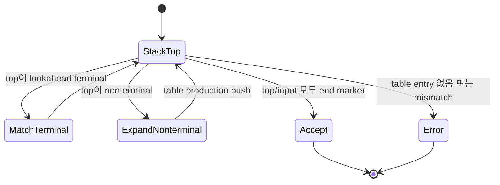

# LL Parser 학습 및 기록 노트

## 1. 왜 필요한가? (Pain Point & Motivation)

LL(1) parser는 입력을 왼쪽에서 오른쪽으로 읽고, leftmost derivation을 1-token lookahead로 예측한다. 사람이 작성하는 recursive descent parser와 table-driven predictive parser의 기반이 되지만, grammar가 left recursion이나 FIRST/FOLLOW conflict를 가지면 한 lookahead만으로 production을 고를 수 없다.

이 문서는 원문의 LL(1) parsing table 생성 과정을 FIRST, FOLLOW, table entry, conflict 조건 중심으로 재작성한다.

## 2. 현재 나의 상태 (Baseline)

- LL이 left-to-right scan과 leftmost derivation을 뜻한다는 점은 알고 있다.
- FIRST와 FOLLOW 집합이 table 생성에 어떻게 쓰이는지 더 명확히 해야 한다.
- ε-production이 있을 때 FOLLOW를 사용해야 하는 이유를 이해해야 한다.
- Left recursion과 left factoring이 LL parser에 왜 중요한지 정리해야 한다.
- Table-driven parsing에서 stack과 input이 어떻게 움직이는지 예제로 확인해야 한다.

## 3. 도달하고 싶은 목표 (Target State)

- LL(1) parsing table `M[A, a]`의 의미를 설명한다.
- 각 production `A -> alpha`에 대해 FIRST(alpha)로 table을 채운다.
- `epsilon in FIRST(alpha)`인 경우 FOLLOW(A)로 table을 채운다.
- 한 cell에 production이 둘 이상 들어가면 LL(1) conflict임을 판단한다.
- Stack top이 terminal이면 match하고, nonterminal이면 table production으로 expand한다.

## 4. 시스템 번역 (Data Flow)

```mermaid
flowchart TD
    A[Grammar] --> B[Compute FIRST]
    B --> C[Compute FOLLOW]
    C --> D[For each production A -> alpha]
    D --> E[Fill M[A, FIRST(alpha)]]
    E --> F{epsilon in FIRST(alpha)?}
    F -->|yes| G[Fill M[A, FOLLOW(A)]]
    F -->|no| H[Parsing table]
    G --> H
    H --> I[Stack-driven parser]
```

LL parser는 현재 stack top nonterminal과 현재 lookahead token만으로 다음 production을 예측해야 한다.

## 5. 핵심 구성요소 (Building Blocks)

| 구성요소 | 역할 | 핵심 질문 |
| --- | --- | --- |
| Lookahead | 다음 input token | production 선택에 충분한가? |
| FIRST(alpha) | alpha가 만들 수 있는 첫 terminal | 어떤 token에서 이 production을 쓰는가? |
| FOLLOW(A) | A 뒤에 올 수 있는 terminal | A가 epsilon이 될 때 어떤 token이 허용되는가? |
| Parsing table | `M[nonterminal, terminal]` | cell이 하나의 production만 갖는가? |
| Stack | 예측해야 할 symbol 저장 | terminal match 또는 nonterminal expand |
| Left recursion | 자기 자신으로 먼저 유도 | recursive descent에서 무한 재귀 위험 |
| Left factoring | 공통 prefix 분리 | lookahead 하나로 선택 가능하게 함 |

## 6. 상태 전이 (State Transition)



Terminal은 input과 직접 match되고, nonterminal은 parsing table이 선택한 production의 RHS로 치환된다.

## 7. 불변식 (Invariant: 절대 깨지면 안 되는 규칙)

- LL(1) table의 한 cell에는 production이 최대 하나만 들어가야 한다.
- `a in FIRST(alpha)`이면 `M[A, a] = A -> alpha`가 된다.
- `epsilon in FIRST(alpha)`이면 모든 `b in FOLLOW(A)`에 대해 `M[A, b] = A -> alpha`가 된다.
- Start symbol의 FOLLOW에는 end marker `$`가 포함되어야 한다.
- Direct/indirect left recursion은 LL parser 적용 전에 제거해야 한다.
- 공통 prefix가 있는 production은 left factoring으로 lookahead conflict를 줄여야 한다.

## 8. 가장 작은 예제 (Minimal Viable Example)

괄호 문법:

```text
S -> ( S ) S
S -> epsilon
```

집합:

| Nonterminal | FIRST | FOLLOW |
| --- | --- | --- |
| `S` | `(`, `epsilon` | `)`, `$` |

Parsing table:

| | `(` | `)` | `$` |
| --- | --- | --- | --- |
| `S` | `S -> ( S ) S` | `S -> epsilon` | `S -> epsilon` |

입력 `()$`는 stack `$ S`에서 시작해 `S -> ( S ) S`, match `(`, `S -> epsilon`, match `)`, `S -> epsilon`, accept 순서로 처리된다.

## 9. 실패 사례 (What could go wrong?)

- `A -> ab | ac`를 그대로 두어 lookahead `a`에서 production을 하나로 고르지 못한다.
- Left recursion `E -> E + T | T`를 LL parser에 넣어 무한 재귀가 발생한다.
- ε-production을 FIRST만 보고 table에 넣고 FOLLOW entry를 누락한다.
- FOLLOW(start)에 `$`를 넣지 않아 입력 종료 시 accept 조건이 깨진다.
- 한 table cell에 production이 둘 이상 들어갔는데 충돌을 무시한다.
- Stack push 순서를 뒤집지 않아 RHS가 잘못된 순서로 처리된다.

## 10. 뇌 확장하기 (Evolution & Variants)

- Recursive descent parser는 LL grammar를 함수 호출 구조로 직접 구현한다.
- LL(k)는 lookahead를 k개 사용하지만 grammar 설계 복잡도가 커진다.
- ANTLR의 LL(*) 계열 parser는 더 강한 lookahead 전략을 사용한다.
- Expression parsing은 LL grammar rewrite 대신 Pratt parser나 precedence climbing을 사용할 수 있다.
- LR parser는 bottom-up 방식으로 더 넓은 문법을 처리하며, [LR 파서](lr-parser.md)에서 다룬다.

## 11. 최종 체크리스트 (Definition of Done)

- [x] LL(1)의 입력 방향, derivation 방향, lookahead 의미를 정리했다.
- [x] FIRST/FOLLOW 기반 table fill 규칙을 설명했다.
- [x] 괄호 문법 최소 예제로 table을 만들었다.
- [x] Left recursion, left factoring, conflict 실패 사례를 포함했다.
- [x] 원문 LL parser 문서를 12개 섹션 템플릿으로 재작성했다.

## 12. 뇌에 새기는 복습 문장 (TL;DR Blank)

LL(1) parser는 stack top nonterminal과 lookahead token 하나만 보고 production을 예측할 수 있어야 한다.
