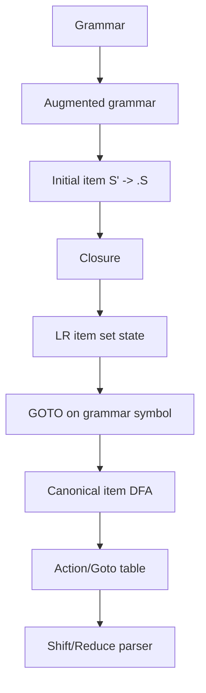
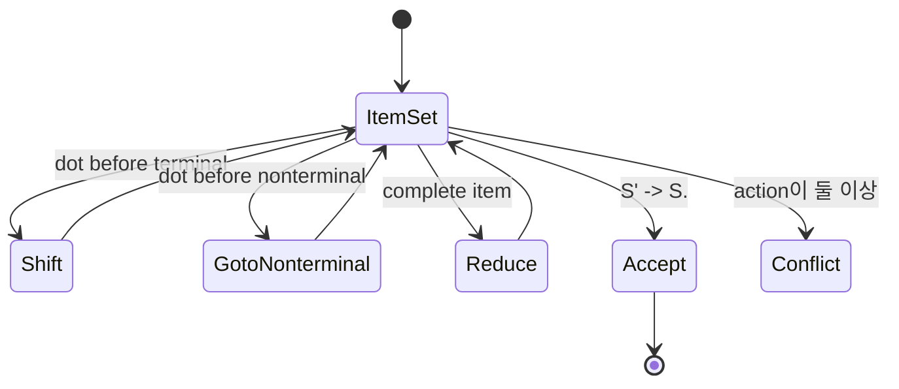
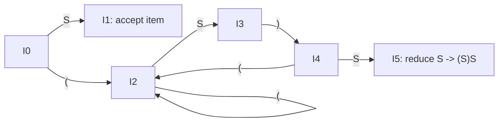

# LR Parser 학습 및 기록 노트

## 범위와 완료 조건

- 입력은 EOF와 새 시작 규칙 `S' → S`가 추가된 증강 문법입니다.
- 상태는 단일 아이템이 아니라 closure가 끝난 아이템 집합이며, 같은 집합은 하나의 상태로 재사용합니다.
- 점이 RHS 끝에 있는 아이템은 환원 후보입니다. 실제 reduce 또는 accept 행동은 항목 종류와 표의 충돌 여부까지 확인해야 합니다.
- 더 이상 새 항목 집합이나 GOTO 전이가 없고 모든 ACTION/GOTO 셀의 충돌이 보고됐을 때 구성이 완료됩니다.

## 1. 왜 필요한가? (Pain Point & Motivation)

LR parser는 input을 left-to-right로 읽으면서 rightmost derivation의 역순을 bottom-up으로 복원한다. LL parser보다 넓은 문법을 다룰 수 있지만, LR item, closure, goto, Action/Goto table을 이해하지 못하면 shift/reduce conflict와 reduce/reduce conflict의 원인을 추적하기 어렵다.

이 문서는 원문의 LR(0) item 기반 DFA 구축 설명을 parsing state, closure/goto, table action, conflict 중심으로 재작성한다.

## 2. 현재 나의 상태 (Baseline)

- Bottom-up parsing의 shift/reduce 개념은 알고 있다.
- LR item의 dot이 production RHS에서 어디까지 인식했는지를 표시한다는 점을 이해해야 한다.
- Closure가 nonterminal 기대 상태에서 관련 production을 추가하는 이유를 정리해야 한다.
- GOTO 연산이 item DFA의 transition과 parsing table을 만든다는 연결이 필요하다.
- LR(0), SLR, LALR, LR(1)의 차이를 conflict 처리 관점으로 구분해야 한다.

## 3. 도달하고 싶은 목표 (Target State)

- LR item `A -> alpha . beta`의 의미를 설명한다.
- Augmented grammar `S' -> S`가 accept condition을 만든다는 점을 이해한다.
- Closure와 GOTO로 canonical LR item set DFA를 만든다.
- DFA state에서 Action/Goto table row가 어떻게 만들어지는지 설명한다.
- LR(0) conflict가 왜 생기고 lookahead 기반 parser가 어떻게 완화하는지 이해한다.

## 4. 시스템 번역 (Data Flow)



LR parser generator는 grammar를 item DFA로 바꾸고, 각 DFA state를 parsing table의 행으로 사용한다.

## 5. 핵심 구성요소 (Building Blocks)

| 구성요소 | 역할 | 핵심 질문 |
| --- | --- | --- |
| Augmented grammar | accept 상태 정의 | `S' -> S`를 추가했는가? |
| LR item | production 진행 위치 표시 | dot 왼쪽은 인식했고 오른쪽은 기대한다 |
| Complete item | reduce 가능 상태 | dot이 RHS 끝에 있는가? |
| Closure | 기대 nonterminal의 production 추가 | dot 뒤 nonterminal이 있는가? |
| GOTO | symbol을 읽은 뒤 다음 item set 계산 | dot을 symbol 뒤로 옮기는가? |
| Item DFA | LR parser state graph | item set이 상태 하나인가? |
| Action table | terminal lookahead에서 동작 결정 | shift/reduce/accept/error |
| Goto table | nonterminal reduce 후 state 이동 | LHS로 어느 state에 가는가? |

## 6. 상태 전이 (State Transition)



LR(0) 아이템 자체에는 lookahead가 없지만 실행기는 현재 상태와 다음 token으로 ACTION 표를 조회한다. 일반 complete item의 reduce를 모든 terminal과 EOF 열에 넣으므로 같은 상태의 shift 또는 다른 reduce와 충돌할 수 있다.

## 7. 불변식 (Invariant: 절대 깨지면 안 되는 규칙)

- DFA state는 단일 item이 아니라 closure가 적용된 LR item set이어야 한다.
- `S' -> S.` item은 입력 종료 marker와 함께 accept를 의미해야 한다.
- `A -> alpha . X beta`에서 `GOTO(I, X)`는 dot을 `X` 뒤로 옮긴 item들의 closure여야 한다.
- Complete item `A -> alpha .`은 stack top의 `alpha`를 `A`로 reduce하는 후보가 된다.
- 한 table cell에 shift와 reduce가 동시에 들어가면 shift/reduce conflict다.
- 한 table cell에 reduce가 둘 이상 들어가면 reduce/reduce conflict다.
- LR(0)에서 해결되지 않는 conflict는 SLR/LALR/LR(1) lookahead 또는 grammar rewrite가 필요하다.

## 8. 가장 작은 예제 (Minimal Viable Example)

문법:

```text
S' -> S
S  -> ( S ) S
S  -> epsilon
```

초기 closure:

```text
I0 = closure({ S' -> . S })
   = {
       S' -> . S,
       S  -> . ( S ) S,
       S  -> .
     }
```

주요 GOTO:

| 연산 | 결과 item set |
| --- | --- |
| `GOTO(I0, S)` | `{ S' -> S . }` |
| `GOTO(I0, ()` | `{ S -> ( . S ) S, S -> . ( S ) S, S -> . }` |
| `GOTO(I2, S)` | `{ S -> ( S . ) S }` |
| `GOTO(I3, ))` | `{ S -> ( S ) . S, S -> . ( S ) S, S -> . }` |
| `GOTO(I4, S)` | `{ S -> ( S ) S . }` |



이 예제의 I0에는 `S -> .` complete item과 `S -> . ( S ) S` shift 가능 item이 함께 있다. LR(0)는 epsilon reduce를 모든 terminal과 EOF 열에 넣어 `(` 열에서 conflict가 생긴다. SLR은 reduce를 FOLLOW(S)인 `)`와 `$`로 제한해 `(` shift와 분리한다.

## 9. 실패 사례 (What could go wrong?)

- Closure를 한 번만 적용하고 새로 추가된 item의 dot 뒤 nonterminal을 다시 확장하지 않는다.
- DFA state를 item 하나로 착각해 관련 production 후보를 누락한다.
- Complete item이 있는 모든 상태를 무조건 accept로 처리한다.
- LR(0)의 일반 reduce를 모든 terminal과 EOF 열에 넣어 생긴 conflict를 숨기거나 임의로 지운다. Conflict는 문법이 해당 parser family의 조건을 만족하지 않는다는 증거로 보고한다.
- Shift/reduce conflict를 grammar 의미 분석 없이 precedence 선언으로만 덮는다.
- Reduce/reduce conflict에서 production 순서로 선택해 실제 모호성을 숨긴다.
- SLR/LALR/LR(1)의 lookahead 범위 차이를 무시한다.

## 10. 뇌 확장하기 (Evolution & Variants)

- SLR은 LR(0) item DFA를 쓰되 reduce lookahead를 FOLLOW(LHS)로 제한한다.
- LR(1)은 item에 lookahead terminal을 포함해 더 정밀하게 conflict를 줄인다.
- LALR(1)은 LR(1) item set 중 core가 같은 상태를 병합해 table 크기를 줄인다.
- Parser generator는 conflict report를 통해 grammar ambiguity, precedence, associativity 문제를 드러낸다.
- Bottom-up 기본 흐름은 [Bottom-Up](bottom-up.md), grammar 구조는 [CFG](cfg.md)와 함께 봐야 한다.

## 11. 최종 체크리스트 (Definition of Done)

- [x] LR item, closure, GOTO, item DFA의 역할을 정리했다.
- [x] Augmented grammar와 accept item의 의미를 설명했다.
- [x] 괄호 grammar 예제로 LR(0) item set 전이를 보였다.
- [x] Shift/reduce와 reduce/reduce conflict의 원인을 포함했다.
- [x] 원문 LR parser 문서를 12개 섹션 템플릿으로 재작성했다.

## 12. 뇌에 새기는 복습 문장 (TL;DR Blank)

LR parser는 grammar를 LR item DFA로 바꾸고, 현재 state와 lookahead를 table에서 조회해 shift와 reduce를 결정한다.
