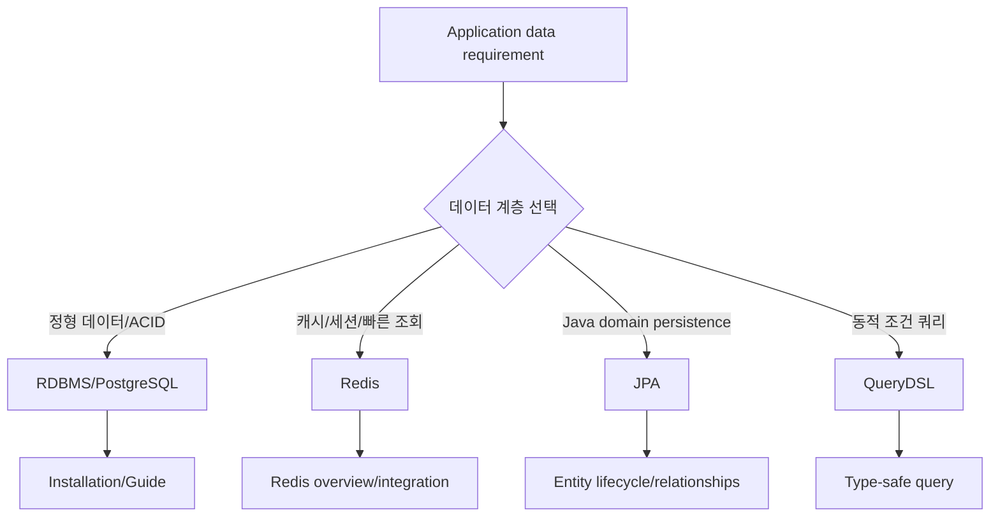
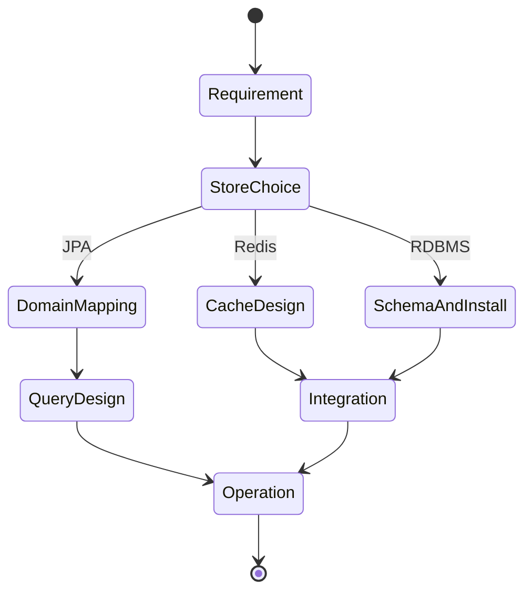

# 데이터베이스 {#_1}

<nav class="hub-directory" aria-label="데이터베이스 문서 목록" markdown="1">

<div class="hub-directory__groups" markdown="1">

<section class="hub-directory__group" aria-labelledby="directory-group-1" markdown="1">

<h2 id="directory-group-1">주요 문서</h2>

- [데이터베이스 및 애플리케이션 설치](installation.md)
- [PostgreSQL 주요 명령어](postgresql-guide.md)

</section>

<section class="hub-directory__group" aria-labelledby="directory-group-2" markdown="1">

<h2 id="directory-group-2">Redis</h2>

- [Redis 개요](redis/overview.md)
- [Redis Spring Boot Integration](redis/springboot-integration.md)

</section>

<section class="hub-directory__group" aria-labelledby="directory-group-3" markdown="1">

<h2 id="directory-group-3">JPA와 쿼리</h2>

- [JPA 개요 및 복합키](jpa/overview.md)
- [JPA Entity Relationships](jpa/relationships.md)
- [QueryDSL과 JPA 연동](jpa/querydsl.md)
- [Spring Bean Lifecycle 관리](jpa/lifecycle.md)

</section>

<section class="hub-directory__group" aria-labelledby="directory-group-4" markdown="1">

<h2 id="directory-group-4">함께 읽기</h2>

- [Java](../java/index.md)
- [Docker 설치 가이드](../development/docker/installation.md)
- [Prometheus, Grafana, Loki 관측 스택](../infrastructure/monitoring/prometheus-grafana-loki.md)

</section>

</div>
</nav>

<details class="hub-directory-notes" markdown="1" open>
<summary>안내와 학습 노트</summary>

## 문서 경계

- 이 페이지는 현재 문서로 이동하기 위한 인덱스이며 제품 선택이나 운영 준비 완료를 보증하지 않습니다.
- 설치 문서는 OS·DB 버전, 네트워크 노출, 인증서와 백업 조건을 먼저 확인하고 사용합니다.
- ORM·캐시 예시는 데이터 모델, 트랜잭션 경계, 쿼리 계획과 실패 시 일관성을 명시한 뒤 적용합니다.
- 링크·요약·비교표는 대상 문서의 실제 범위가 바뀔 때 함께 갱신합니다.

## 1. 왜 필요한가? (Pain Point & Motivation)

애플리케이션에서 데이터 계층은 설치, 연결, 쿼리, 캐시, ORM mapping, transaction lifecycle이 함께 움직인다. RDBMS와 Redis, JPA, QueryDSL을 별도 지식으로만 보면 성능 문제나 일관성 문제를 어느 계층에서 봐야 하는지 놓치기 쉽다.

이 문서는 `content/docs/databases` 하위 문서를 데이터 저장소 선택, 설치, ORM, 캐시 연동의 navigation data flow 중심으로 재작성한다.

## 2. 현재 나의 상태 (Baseline)

- RDBMS, Redis, JPA, QueryDSL이라는 큰 범주는 알고 있다.
- 데이터베이스 설치와 애플리케이션 연동 문서가 어디에 있는지 빠르게 찾을 필요가 있다.
- PostgreSQL guide, Redis overview, Spring Boot Redis integration, JPA mapping 문서를 하나의 학습 흐름으로 묶어야 한다.
- 데이터 계층 문제를 DB, cache, ORM, query builder 중 어느 경계에서 봐야 할지 구분해야 한다.

## 3. 도달하고 싶은 목표 (Target State)

- 데이터 저장소 요구사항을 RDBMS, Redis, ORM 계층으로 나눠 판단한다.
- 설치 문서와 PostgreSQL guide를 운영 준비 흐름으로 연결한다.
- Redis 문서를 cache/session/fast lookup 계층으로 이해한다.
- JPA 문서를 entity lifecycle, relationship, query generation 관점으로 탐색한다.
- QueryDSL 문서를 type-safe dynamic query 작성 흐름으로 연결한다.

## 4. 시스템 번역 (Data Flow)



데이터베이스 문서 인덱스는 사용자가 먼저 저장소와 접근 계층을 고르고, 해당 세부 문서로 이동하게 하는 router 역할을 한다.

## 5. 핵심 구성요소 (Building Blocks)

| 영역 | 문서 | 핵심 질문 |
| --- | --- | --- |
| 설치 | [installation.md](installation.md) | DB를 로컬 또는 서버에 어떻게 준비하는가? |
| PostgreSQL | [postgresql-guide.md](postgresql-guide.md) | schema, query, index, operation을 어떻게 다루는가? |
| Redis 개요 | [redis/overview.md](redis/overview.md) | cache와 in-memory data type을 어떻게 선택하는가? |
| Redis Spring Boot | [redis/springboot-integration.md](redis/springboot-integration.md) | application cache/session과 어떻게 연결하는가? |
| JPA 개요 | [jpa/overview.md](jpa/overview.md) | entity와 persistence context가 어떻게 동작하는가? |
| JPA 관계 | [jpa/relationships.md](jpa/relationships.md) | association mapping과 fetch 전략은 어떻게 정하는가? |
| JPA 생명주기 | [jpa/lifecycle.md](jpa/lifecycle.md) | transient, managed, detached, removed 상태는 무엇인가? |
| QueryDSL | [jpa/querydsl.md](jpa/querydsl.md) | type-safe 동적 쿼리를 어떻게 작성하는가? |

## 6. 상태 전이 (State Transition)



데이터 계층은 저장소 선택에서 끝나지 않는다. schema, mapping, query, cache, 운영 지표가 연결되어야 실제 애플리케이션 흐름이 안정된다.

## 7. 불변식 (Invariant: 절대 깨지면 안 되는 규칙)

- 원천 데이터의 일관성 요구가 강하면 cache보다 transactional store를 기준으로 설계해야 한다.
- Redis cache는 source of truth인지 acceleration layer인지 명확히 구분해야 한다.
- JPA entity 관계는 database foreign key와 object reference 사이의 mapping contract를 지켜야 한다.
- Lazy/eager loading과 fetch join은 N+1 문제와 memory 폭발을 함께 고려해야 한다.
- QueryDSL 동적 조건은 null/empty 조건 처리와 pagination 정렬 기준을 명확히 해야 한다.
- Index는 query predicate, sort, cardinality, write cost를 함께 고려해 설계해야 한다.

## 8. 가장 작은 예제 (Minimal Viable Example)

```text
요구사항: 주문 목록을 사용자별로 빠르게 조회하고, 인기 상품 랭킹도 보여준다.

1. 주문/사용자/상품 원천 데이터: PostgreSQL
2. Java domain mapping: JPA relationships
3. 검색 조건 조합: QueryDSL
4. 인기 상품 랭킹 캐시: Redis sorted set
5. 운영 확인: index, query plan, cache TTL
```

이 예제는 한 기능도 RDBMS, ORM, query builder, cache가 함께 설계되어야 함을 보여준다.

## 9. 실패 사례 (What could go wrong?)

- Redis cache를 원천 데이터처럼 사용하면서 eviction, TTL, persistence 설정을 고려하지 않는다.
- JPA lazy loading을 이해하지 못해 API 응답 생성 중 N+1 query가 발생한다.
- Relationship cascade를 잘못 설정해 의도하지 않은 delete/update가 전파된다.
- QueryDSL 조건 조합에서 null 조건을 잘못 처리해 전체 조회가 실행된다.
- Index 없이 pagination과 sort를 수행해 대량 데이터에서 latency가 급증한다.
- 설치 문서의 기본 설정을 운영 환경에 그대로 적용해 인증, 백업, 모니터링이 빠진다.

## 10. 뇌 확장하기 (Evolution & Variants)

- RDBMS는 PostgreSQL, MySQL, MariaDB의 type, index, replication 차이를 비교한다.
- Cache pattern은 cache-aside, read-through, write-through, write-behind로 구분한다.
- JPA는 persistence context, dirty checking, transaction boundary, flush timing으로 확장한다.
- Query optimization은 `EXPLAIN`, index design, slow query log, connection pool 지표를 함께 본다.
- 운영은 backup/restore, migration, monitoring, alerting, capacity planning으로 이어진다.

## 11. 최종 체크리스트 (Definition of Done)

- [x] Databases 하위 문서의 탐색 역할을 정리했다.
- [x] 설치, PostgreSQL, Redis, JPA, QueryDSL 문서 링크를 유지했다.
- [x] 데이터 저장소 선택과 애플리케이션 연동 흐름을 data flow로 표현했다.
- [x] Cache, ORM, index, query 실패 사례를 포함했다.
- [x] 원문 databases index 문서를 12개 섹션 템플릿으로 재작성했다.

## 12. 뇌에 새기는 복습 문장 (TL;DR Blank)

데이터 계층은 DB 하나가 아니라 저장소, ORM, 쿼리, 캐시, 운영 지표가 이어진 흐름으로 봐야 한다.

</details>
